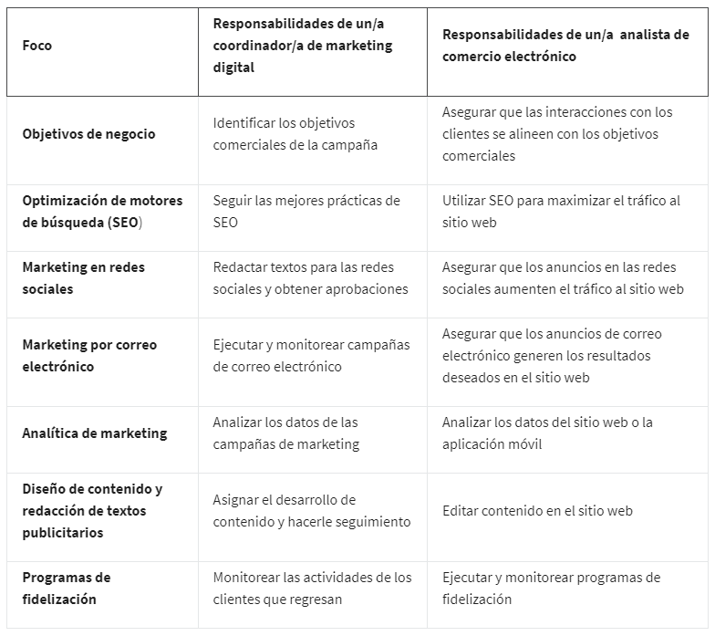

# Fundamentos del marketing digital y comercio electrónico

## Comenzando con el programa de certificación

### Te damos la bienvenida al Certificado de Carrera de Google en Marketing Digital y Comercio Electrónico

Hola, te doy la bienvenida al certificado de Marketing Digital y Comercio Electrónico de Google. ¡Qué emoción tenerte! Soy
Joi, gerente de Marketing de Producto en Google. Seré tu instructora en el primer curso de este programa de certificación.

La demanda de especialistas en este campo está creciendo a un ritmo increíble. El mercado del e-commerce creció más de un
600% en una década. Y, ahora que se hacen cada vez más negocios en línea, entran al campo más personas con diversos
antecedentes y experiencias, así que el e-commerce se adapta a mercados nuevos y culturas distintas.

Hay puestos bien pagados de e-commerce y marketing digital, con o sin título universitario, gracias al enorme crecimiento
global. Sin embargo, aunque la demanda es más alta que nunca, a las empresas les cuesta hallar candidatos con la experiencia
ideal.

Este programa está diseñado justamente para eso: darte conocimientos y habilidades para comenzar o potenciar tu carrera en
marketing digital o e-commerce. No importa si inicias una trayectoria profesional o si ya trabajas en algo similar.

Al final de este programa, podrás encontrar un trabajo en estos campos de alto crecimiento e impacto. Si has comprado algo
en línea, ya conoces el e-commerce del lado del cliente. Pero ¿qué hacen los especialistas en e-commerce y marketing
digital?

Piensa en la última vez que compraste algo en línea, algo grande o pequeño, no importa lo que fuera. ¿Cómo terminaste
comprando ese producto en particular? Quizá necesitabas algo específico, como una nueva lámpara o un software, y buscaste en
línea para encontrar el artículo ideal. O quizá fue algo que no sabías que necesitabas hasta que te enteraste por un amigo o
un anuncio en línea.

Puede que hayas comprado gracias a especialistas en e-commerce y marketing digital. Ya sea comunicándose por redes sociales
o garantizando el funcionamiento del pago, siempre piensan en mejores formas de conectarte a ti, el cliente, con las
soluciones y productos que necesitas. Y, al hacerlo, ayudan a empresas de todos los tamaños a tener éxito y crecer en el
mercado en línea.

Algo de lo mejor del e-commerce y marketing digital es que hay muchas trayectorias profesionales, cada una con sus propias
habilidades y responsabilidades. Sin importar tus antecedentes, probablemente verás que ya tienes experiencia relevante.

Por ejemplo, yo trabajo a tiempo completo en marketing digital y he llevado tiendas de e-commerce fuera del trabajo. Estudié
relaciones públicas e hice prácticas en Google, donde después me contrataron a tiempo completo. También ayudé durante años a
llevar la tienda en línea de mi familia, y después comencé mi propio negocio de belleza en línea.

Si no sabes qué dirección quieres tomar, no hay problema. En este programa descubrirás los diversos puestos de trabajo que
hay, así como las habilidades especializadas que te ayudarán a decidir hacia dónde quieres llevar tu carrera.

El programa incluye varios cursos que abarcan temas como atraer clientes a través de motores de búsqueda y anuncios en
línea, involucrar a clientes en redes sociales y crear campañas de correo electrónico. También aprenderás a medir y analizar
resultados, administrar relaciones con clientes, optimizar tiendas en línea y prepararte para conseguir trabajo.

Con un certificado de carrera de Google como este, desarrollarás habilidades y aprenderás a usar herramientas para trabajar
en un campo de rápido crecimiento y alta remuneración. No necesitas experiencia previa en marketing digital o e-commerce,
porque aquí comenzarás con lo básico y potenciarás las habilidades que ya tienes.

Yo te guiaré en este primer curso y te enseñaré los fundamentos para tener éxito en el campo. También tendrás el apoyo de
los compañeros que cursan el certificado al mismo tiempo que tú.

Este programa también es muy flexible. Puedes completar todos los cursos del certificado a tu ritmo y gusto, todo en línea.
Los certificados de carrera de Google los diseñaron expertos del sector que tienen décadas de experiencia en Google.

En cada curso del certificado te guiará un experto de Google diferente. Te enseñaremos mediante videos, harás actividades
prácticas y y te daremos escenarios reales que puedes encontrar al trabajar.

Crearás clientes ideales, escribirás correos de marketing, usarás herramientas de analítica, crearás una cartera e incluso
crearás una tienda en línea simulada. Los certificados están diseñados para que consigas trabajo en 3 o 6 meses, si los
cursas a tiempo parcial.

Y, tras graduarte, puedes conectar con más de 150 empleadores que quieren contratar graduados de certificados de Google. Ya
sea que quieras cambiar de carrera, empezar una nueva, potenciar tus habilidades o crear un negocio, los certificados de
carrera de Google te abren puertas a nuevas oportunidades.

Reunimos a instructores increíbles que te apoyarán en tu trayectoria. Se van a presentar ahora. Hola, soy AK, líder de
Excelencia de Ventas en Google. Te enseñaré a atraer e involucrar a clientes. Veremos el embudo de marketing, optimización y
marketing de motores de búsqueda.

Hola, soy Cindy. Soy gerente de Marketing de Producto de Google Ads. Seré tu instructora de marketing y publicidad en RR.
SS., que consiste en incorporar RR. SS. en campañas de marketing.

Hola, me llamo Miriam. Soy gerente de Marketing de Producto de Google Ads. Te enseñaré qué constituye una campaña de
marketing por email de inicio a fin. Te enseñaré a preparar, elaborar y enviar correos para optimizar la marca del negocio.
¡Qué emoción!

Hola, soy Michael, ejecutivo sénior de Cuentas de Crecimiento de Mercado Medio de Google, que apoya a empresas con
estrategias de publicidad de Google. Te enseñaré analítica de marketing; a usar herramientas de analítica en marketing de
rendimiento, y monitorear métricas clave de campañas de e-commerce y marketing.

Hola, soy Cindy, líder de Excelencia en Ventas en Google. Te guiaré en el curso de E-commerce y Venta en Línea. Verás cómo
funcionan las tiendas en línea y cómo involucrar a clientes.

Hola, soy Mike, gerente de Estudios de Rendimiento Global en Google. Seré el instructor del curso final del programa. Verás
cómo crear lealtad de cliente y más sobre e-commerce.

Y yo soy Erica, consultora de Personas en Google. Ayudo a gerentes, líderes y empleados de Google a potenciar sus puestos
para que la empresa alcance sus metas. Te ayudaré a prepararte para buscar

### Introducción al curso 1

Curso 1: Fundamentos de E-commerce y Marketing Digital

Ahora que tienes una idea de qué esperar en este programa en total, quiero contarte un poco sobre qué esperar de este curso.

Empezamos con lo básico: qué son el e-commerce y el marketing digital y la actividad diaria de los profesionales del sector.
Verás habilidades fundamentales para el éxito en e-commerce y marketing digital, como algunas que ya tienes, y cómo las
impulsarás con el programa.

Veremos el panorama actual de oportunidades laborales. Descubrirás oportunidades disponibles para candidatos de nivel básico
y las responsabilidades que conllevan. Con esto deberías pensar en tus intereses y cómo hallar con ellos una trayectoria
ideal.

Luego descubrirás herramientas para atraer clientes potenciales e impulsar ventas en línea. Verás lo necesario para crear
estrategias de marketing digital y tácticas para llegar a clientes: anuncios digitales, correos y redes sociales.

Al final verás la importancia de medir e interpretar los resultados de dichas tácticas y cómo las empresas usan los datos
parar mejorar su estrategia global. Y recibirás consejos laborales a tener en mente para el siguiente curso.

Eso es lo que te espera. Ahora repasemos recursos con los que aprovecharás el programa al máximo. Me emociona que inicies tu
trayectoria. ¡Empecemos!

## ¿Qué son el marketing digital y el comercio electrónico?

### ¿Qué son el marketing digital, el comercio electrónico?

¿Sabías que la primera venta completamente en línea ocurrió en 1994? Un hombre llamado Dan Kohn vendió un CD por $12.48
por un sitio web encriptado que él mismo creó.

Ahora es mucho más fácil vender en línea, tanto como persona, pequeño negocio o gigante del comercio minorista. El
e-commerce creció desde los 90; ahora es un sector de miles de millones de dólares.

Lo es porque, en general, es más asequible, práctico y accesible que las ventas en tiendas físicas. Con el crecimiento del
mercado en línea, creó nuevos sectores y profesiones, como el marketing digital.

Comenzamos a explorar el e-commerce y marketing digital y cómo crean valor para las empresas. Primero veamos definiciones.
El término E-commerce se refiere a la compra y venta de bienes y servicios en línea.

Casi todas las compras en línea son de una de cuatro categorías: productos físicos, como libros o bienes domésticos;
productos digitales, como libros digitales o cursos en línea; servicios, como vacaciones o citas médicas, y software, como
programas para procesar texto o editar fotos.

Poder comprar o vender prácticamente cualquier cosa por computadoras, tabletas o teléfonos ha transformado los negocios por
completo. No se necesita una tienda física para empezar un negocio en línea.

Muchos minoristas tienen tiendas físicas y tiendas en línea, pero otros solo venden en línea. Sin el costo de mantener una
tienda, crear un negocio se volvió más fácil que nunca. Así, entraron más personas del mundo al mercado en línea.

Pero también el mercado en línea se saturó muy rápidamente. Para distinguirse y atraer clientes, las empresas empezaron a
anunciarse en línea. Así se creó el marketing digital.

El marketing digital se refiere a llegar al consumidor por canales digitales con el objetivo de convertirlo en cliente. Un
canal digital es un método o plataforma de comunicación que un negocio usa para llegar a su público objetivo en línea.

Puede ser un sitio web, motor de búsqueda, correo electrónico o red social. La meta del e-commerce es vender en línea, el
marketing digital ayuda a las empresas a alcanzarla. Pero no se limita a eso.

También ayuda a las empresas a generar confianza, inspirar lealtad y y ofrecer un mejor servicio. Así es similar al
marketing tradicional, como la publicidad impresa o carteles, pero tiene ventajas agregadas para las empresas y los
consumidores.

Para empezar, el marketing digital es rentable. El presupuesto de publicidad rinde mucho más en línea que en televisión,
radio y medios impresos. Así es porque los profesionales eligen muy bien los anuncios correctos mostrados al público
adecuado en los momentos oportunos.

También hay la posibilidad de que corra la voz del cliente por plataformas como RR. SS. Las campañas de marketing digital
llegan a más gente que las tradicionales, que usan plataformas locales, como periódicos y estaciones de radio.

Crea reconocimiento de marca en mercados nuevos e incluso globales. Así se impulsan las ventas y se ofrecen servicios a
diversas personas. El marketing digital también puede generar resultados más rápido.

Si un cliente ve un producto que desea en un anuncio impreso, puede o no recordar comprarlo después. Los anuncios digitales
le permiten tomar acción al momento, y aumentan la probabilidad de que lo compre.

También permiten a la empresa crear relaciones con el cliente mediante comunicación directa. Los canales como el correo y
RR. SS. dan una personalización con la que el marketing tradicional no puede competir.

Verás más sobre las ventajas y retos del e-commerce y marketing digital más tarde en el curso. Ahora repasemos lo que
aprendimos. En las últimas décadas, estos sectores han cambiado la esencia de los negocios.

La meta del e-commerce es generar ventas; el marketing digital ayuda a las empresas a alcanzarlas al conectar con clientes y
crear relaciones. A continuación, veremos los principales roles y responsabilidades del e-commerce y marketing digital.

### ¿Qué hacen quienes se especializan en marketing digital y comercio electrónico?

Ahora sabes qué es el marketing digital y el e-commerce, y cómo se relacionan. Veamos qué hacen los profesionales de este
campo en el día a día.

El sector de e-commerce y marketing digital es como un motor. Tiene muchas piezas y mucha acción. Cada pieza tiene una
función diferente, pero trabajan juntas para que todo funcione sin problemas y con eficacia.

En una empresa grande te puedes especializar en un par de áreas, en una pequeña, puedes encargarte de todo un poco. Hay
muchos trabajos diferentes y grupos de responsabilidades diferentes. Por eso el sector es emocionante.

Tus habilidades pueden encajar, no importa cuáles sean. Así también hay muchas opciones al decidir tu trayectoria
profesional.

Como dueña de una pequeña empresa, me encargo de muchas actividades: estrategia y ejecución de campañas de marketing,
gestión del sitio web y desarrollo de producto. También subcontrato personal para lo que conozco menos, como servicio al
cliente y cumplimiento del pedido.

Cada quien tiene sus propios intereses y fortalezas. Al identificar los tuyos podrás descubrir qué quieres. Si te gusta
escribir, puedes trabajar con correos de marketing o artículos de blog. Si te gusta lo visual, puedes trabajar con imágenes
o disposición de sitios web. Si te gusta organizar, puedes administrar tiendas de e-commerce. Si eres de números, puedes
trabajar en estrategias de precios o analizar datos y ver tendencias y compromiso del cliente.

Te ayudaremos a prepararte para varios cargos en el sector. Por ejemplo: coordinador de marketing digital y analista de
e-commerce, Estos pueden parecer distintos, pero pueden tener mucho en común, según dónde trabajes.

Las responsabilidades de marketing digital e e-commerce coinciden a menudo, comparten ciertas habilidades y usan los mismos
canales, como redes sociales, correo electrónico y anuncios. Sin importar tu cargo, podrías dedicarte a esto: investigar la
audiencia; planear, crear o publicar contenido; actualizar descripciones de productos, o analizar datos para ver los
resultados.

Tus metas pueden ser captar e involucrar clientes potenciales, generar confianza, mostrar valor, impulsar ventas o crear una
gran experiencia de cliente.

Desde luego, en el sector hay muchos otros tipos de cargos. Conocerás más sobre ellos y sus responsabilidades en este curso.

Sin importar el cargo que buscas, ayuda saber cómo se ajustan las metas y responsabilidades, como generar conocimiento de
marca, impulsar ventas y gestionar inventarios. Este programa te ayudará a aprender sobre ello.

A continuación, veremos habilidades esenciales para el sector, y cómo puede que ya las hayas practicado.

### Joi: Trayectoria profesional en marketing digital

Hola, me llamo Wade y soy directora asociada de Marketing de Producto aquí en Google, y eso significa que trabajo en
campañas de marketing digital.

Crecí en una familia de empresarios, mis padres y mis hermanos mayores son propietarios de pequeñas empresas. Así que crecí
siempre ayudándolos con todos los aspectos de la gestión de un negocio, era esa persona que les decía, “Oye, tal vez
deberíamos tener un sitio web, tener páginas de redes sociales, y una lista de correo electrónico”. Eso fue muy importante
para ellos porque comenzaron su negocio mucho antes de que existieran muchos de los canales de marketing que tenemos hoy.

Así que ellos aprendieron sobre marketing digital y yo, que soy de la generación Z, crecí en ese espacio digital. De hecho,
empecé un canal de YouTube en 2011 y ese fue mi primer amor con los contenidos y con la creación de contenidos digitales.
Creaba muchos contenidos de estilo de vida, era la época de las gurús de belleza y muchas mujeres hacían tutoriales de
maquillaje. Por alguna razón pensé que podría hacer contenidos de maquillaje, pero no pude. Pero, creo que esa es la belleza
de YouTube, se trata de experimentar y encontrar tu voz. Y esos humildes comienzos me llevaron finalmente a conseguir una
carrera en marketing digital.

Después de graduarte en el programa, buscar un trabajo va a ser muy importante y hay muchos puestos de nivel inicial en
marketing digital. Piensa en las habilidades que obtuviste en el curso, así como cualquier otra experiencia laboral previa
que tengas y combínalas con las cosas que ves que los empleadores están buscando.

Si estás empezando a sentirte abrumado por el curso, quiero que sepas que puedes hacerlo, hay que trabajar mucho para
superar este curso, pero nada se consigue sin trabajo duro. Creo que realmente verás una recompensa al final, y te lo
agradecerás cuando finalmente tengas tu carrera en marketing digital.

### Habilidades para el marketing digital y el comercio electrónico

Algo que me encanta de trabajar en este sector es que hay muchas trayectorias que elegir según tus intereses y experiencia.
Al hacer este y los otros cursos del programa, aprenderás sobre muchas habilidades que tienen una alta demanda. Incluso si
recién te incorporas al sector, seguro ya tienes habilidades y experiencias útiles.

En este video, exploraremos habilidades y cualidades con las que tendrás éxito en e-commerce y marketing digital:
curiosidad, mente analítica y narración de historias. No hace falta dominarlas todas. Recuerda que hay varios tipos de
trabajo en el sector. Pero seguro que tienes experiencia con todas ellas.

Empecemos con la curiosidad. Las personas curiosas preguntan, buscan respuestas y prueban novedades. La curiosidad es innata
para algunos, pero puede desarrollarse y tener importancia para trabajar en el sector. En e-commerce y marketing digital la
curiosidad por la gente es esencial: qué quiere, cómo piensa y qué la motiva a tomar acción.

La curiosidad también es importante porque el sector cambia rápidamente. Explorar y conocer las tendencias emergentes te
ayudará a medida que este crece y evoluciona. Hacer este curso es un excelente ejemplo de curiosidad. Estás aquí por
curiosidad por trabajar en e-commerce y marketing digital, y buscas respuestas de forma activa.

Tener curiosidad y preguntar no es la única habilidad útil. Usar una mente analítica para resolver problemas también ayuda
mucho. Los profesionales de e-commerce y marketing digital la usan siempre. No todos somos científicos de datos, al menos yo
no, pero recopilamos y organizamos datos para ver patrones, descubrir tendencias y resolver problemas.

Tener mente analítica no es tener habilidades técnicas, es una forma de pensar. Al decidir en grande como planear un viaje o
comprar un auto seguro usaste el pensamiento analítico. Si comparaste aspectos como costo, tamaño, características, y
seguridad, y elegiste un auto según los más importantes para ti, usaste el pensamiento analítico. Casi siempre analizamos
situaciones sin siquiera darnos cuenta.

Si te gusta resolver rompecabezas y acertijos, los analizas para encontrar soluciones. Otro ejemplo es ser fan de un
deporte. Ver estadísticas de tu equipo y predecir sus resultados futuros es como lo que obtienen con datos los expertos del
sector. Al tener información tras analizar, hay que comunicarla bien a un público. Eso se hace mediante la narración de
datos.

Mediante historias, convertimos cifras y estadísticas en presentaciones e informes que cautivan. Los expertos usan la
narración de datos para comunicar información a clientes y colegas todo el tiempo. Las empresas lo usan para comunicar valor
a los clientes de forma accesible, atractiva y, sobre todo, memorable. Con las historias conectan con los clientes y se
distinguen de la competencia.

Todos cuentan historias. Ya sea mediante un blog o contando bien chistes, todos contamos historias en el día a día. Y no es
siempre algo oral: también se usa storytelling visual en e-commerce y marketing digital. Si tienes experiencia en dibujo,
diseño o fotografía, puedes crear historias visuales para campañas de marketing digital.

En este curso conocerás más formas de usar la narración de datos en el sector. Estas son solo algunas habilidades que te
pueden ayudar en tu carrera. Hay muchas otras como adaptabilidad o liderazgo. Algo útil que tenía antes de trabajar en
marketing es mi creatividad. A veces necesitas averiguar cómo destacar de la competencia.

Los expertos deben destacar las cualidades de la marca y captar clientes de forma creativa. Al ver los distintos cargos y
responsabilidades del sector, piensa en otras formas de usar tus habilidades y experiencia. Piensa en tus fortalezas al
hacer el programa y las podrás transmitir mejor a posibles empleadores.

El sector cambiará y crecerá con las nuevas tecnologías. Quizá debas aprender nuevo software o tecnología. Las habilidades
transferibles como la curiosidad, mente analítica y narración de datos te permitirán crecer con el sector. A continuación,
te diré más sobre habilidades especializadas que puedes necesitar y que desarrollarás con este programa.

### Prisha: El camino que recorrí para trabajar en marketing digital

Hola, soy Prisha, y soy estratega de Cuentas. Como estratega de Cuentas, ayudo a las empresas a crecer enseñándoles Google
Ads. Uno de mis aspectos favoritos del marketing digital es lo colaborativo que es, y realmente disfruto trabajando con un
montón de gente diferente. Me encanta poder marcar la diferencia y crear el mejor contenido posible para mis clientes,
usuarios o cualquier otra persona.

Cuando entras en el mundo del marketing, está muy bien no tener tanta experiencia como crees que necesitas. Entré en el
marketing con cero experiencia, y mi mayor consejo es que tengas la mente muy abierta y no temas el porque te postularás
para muchas cosas diferentes, y no pasa nada si no consigues el puesto al principio, porque trabajarás para conseguirlo en
el futuro.

Mi canal de YouTube fue algo que decidí hacer cuando tenía 16 años. Lo comencé porque quería concienciar sobre mi enfermedad
crónica para ayudar a marcar la diferencia en la comunidad y mostrar a los demás que cualquiera con una condición crónica o
una diferencia visible puede alcanzar sus sueños o metas. Empecé a hablar también de maquillaje pero también de blogs de
viajes y blogs educativos, y luego me incliné por contenidos más relacionados con la pasantía y la carrera profesional para
concienciar también sobre ello.

Pude aprender qué es lo más les gusta a mis seguidores o a la comunidad de mi canal y mantenerlo para poder crecer aún más.
De mi canal de YouTube y de la gestión de mis redes sociales aprendí muchas cosas que pude aplicar a mi trabajo diario
durante mi pasantía; por ejemplo, la importancia de ser coherente con tu campaña, de modo que cuando gestionas varias
empresas diferentes, es muy importante tener mensajes coherentes, y lo hice a través de mi canal de YouTube, Instagram, y
Tik Tok para asegurarme de que la gente entendía mi marca y mi historia en diferentes aspectos.

Cuando tenía 18 años, decidí hacer una pasantía en lugar de la universidad. En la escuela sabía que mi pasión era el
marketing digital e iba a estudiar economía, pero me di cuenta de que, siendo mi pasión este tipo de marketing, por qué no
comenzar mi carrera temprano. Supe que me gustaba mucho por mi experiencia laboral en mi canal de YouTube.

Cuando me presenté a las entrevistas para los diferentes puestos (el de la pasantía y el que tengo a tiempo completo en
Google), quería mostrar la importancia de la pasión y cómo el entusiasmo llega muy lejos, y si algo te apasiona, eso te hará
avanzar en cualquier puesto o entrevista. Así que algo que intenté durante la pasantía, cuando no tenía experiencia, fue que
me apasiona el marketing digital, y he hecho XYZ para mostrarlo a través de mi canal de YouTube y a través de diferentes
cosas, así que creo que si puedes mostrar tu pasión y entusiasmo por algo, llegarás muy lejos.

Cuando empiezas en el marketing digital o en cualquier otra carrera, puede ser muy estresante, y puedes tener el síndrome
del impostor y puedes sentir realmente que no perteneces aquí para estar aquí, y eso es algo a lo que me enfrenté en en la
pasantía, pero también en la transición a un puesto a tiempo completo. Mi consejo en este sentido es que hables con mucha
gente, y verás cuántas personas sienten realmente que tienen el síndrome del impostor, y creo que hablando de ello con el
tiempo, te darás cuenta de que mereces estar aquí, y que te has ganado un puesto.

Encontrar un mentor puede ser muy útil. Con tu mentor puedes trabajar en objetivos a corto y largo plazo, y puede ayudarte
con los distintos miedos que puedas tener. Por ejemplo, yo tenía miedo a hablar en público, y mi mentor y yo pudimos
trabajar en ello y establecer objetivos a corto plazo para ayudarme a conseguirlo, de modo que ahora soy capaz de presentar
y llevar a cabo diferentes iniciativas basadas en ello.

Estoy súper emocionada de que completes este curso y de que te apasiones más de lo que ya estás por el marketing digital,
igual que yo, y no puedo esperar a que completes esto y a que tengas todas las habilidades relevantes para convertirte en un
profesional del marketing digital. Mucha suerte. Habilidades especializadas que puedes necesitar y que desarrollarás con
este programa.

### turaHabilidades básicas de especialistas en marketing digital y comercio electrónico

Las habilidades que obtendrás al completar el Certificado de Carrera de Google en Marketing Digital y Comercio Electrónico
son utilizadas en muchos puestos de marketing digital y comercio electrónico de nivel inicial. Esta lectura te brinda una
visión general de los temas que integran el programa de la certificación y los relaciona con ejemplos de requisitos
laborales.

Comparación de habilidades básicas en diferentes puestos

Tanto los puestos en marketing digital como en comercio electrónico demandan habilidades similares. Sin embargo, a menudo,
estas habilidades se aplican de maneras diferentes. La siguiente tabla te da una idea de cómo las responsabilidades
laborales pueden diferir ligeramente entre unos casos y otros.

Conclusiones principales

A menudo, se recomienda que adaptes tu currículum cada vez que solicites un empleo, para que tu experiencia y tus destrezas
se alineen lo más posible con los requisitos del puesto en cuestión. Al final de este programa, podrás adaptar tu
currículum, en función de las habilidades que hayas aprendido, para los puestos de marketing digital o comercio electrónico.

### Melba: El camino que recorrí para trabajar en comercio electrónico

Hola, me llamo Melba y soy directora de Marketing de Producto en Google. Ayudo a comunicar el qué, el por qué y el cuándo de
los productos que estamos desarrollando, tanto internamente a equipos multifuncionales como externamente a nuestros públicos
objetivo definidos.

Diría que mi trayectoria ha sido muy poco convencional. A los 16 años tuve que dejar el instituto para buscar trabajo y
ayudar económicamente a mi madre. Crecí en un hogar monoparental y, si soy sincera, cuando tenía 16 años nunca pensé que
fuera a ir a la universidad, y mucho menos que fuera a conseguir un trabajo en un lugar como Google.

Es interesante la forma en que las cosas terminaron funcionando porque después de conseguir un trabajo, me encontré tratando
con una líder latina muy increíble y poderosa. La primera vez que vi a una líder latina, me quedé asombrada porque no era
algo que soliera ver a menudo. Y cuando lo hice, me di cuenta de que si ella podía hacerlo, yo también.

Fui a casa ese mismo día, y empecé a investigar una carrera en marketing. Tuve que comenzar desde cero. Empecé a tomar
clases para obtener mi GED. Una vez que obtuve el GED, me licencié y seguí trabajando a jornada completa. Como parte de mi
educación y aprendizaje continuo, tomé varias clases en línea y también hice muchos cursos que estaban disponibles de forma
gratuita en línea.

Una de las más grandes razones por las que lo hice es porque me di cuenta de que, a menudo, necesitaba sentarme con los
materiales y poder hacerlo a mi propio ritmo. Para mí, eso fue fundamental porque como abandoné la escuela, cuando estaba en
la universidad, me di cuenta de que todo el mundo iba a un ritmo más avanzado que yo. Yo no tenía muchos de los
conocimientos básicos que ellos tenían, y, por eso, a menudo tenía que volver, tomar clases en línea, hacer cursos
adicionales, y adquirir esos conocimientos básicos para poder prepararme para el éxito en el futuro.

Supe que había tomado la decisión correcta de dedicarme al marketing cuando lancé mi primera campaña. En realidad, mi
primera campaña iba dirigida a poblaciones desatendidas. Como latina, es muy importante que en el trabajo que hago pueda
retribuir a mi comunidad y asegurarme de que se reconoce su voz.

Además del trabajo que hago en Google, también fundé una empresa llamada Mujeres on the Rise, una comunidad que ayuda a las
latinas a ascender a través de recursos, comunidad y asesoramiento. Al pertenecer a una comunidad marginada, me di cuenta de
que hay muchas barreras que nos impiden conseguir lo que queremos. Y muchas veces esas barreras son nuestras propias voces
internas que nos dicen que no somos capaces de hacer lo que queremos hacer.

Como parte del trabajo que hago, empecé esta comunidad para compartir lo que he aprendido en el camino y ayudar a otros a
hacer lo mismo. Solía creer que mi situación en la vida determinaría para siempre mi futuro. Tras haber progresado tanto
desde mi punto de partida, sé que eso no es necesariamente cierto.

Puedes cambiar el rumbo de tu vida, pero todo empieza con una decisión. Tienes que dar ese primer paso sin pensar
necesariamente en el larguísimo viaje que te espera. Simplemente da un paso, un día cada vez, y con el tiempo, mirarás atrás
y te darás cuenta de lo lejos que has llegado.

### Andrew: el camino que recorrí para trabajar en marketing digital y comercio electrónico

Me llamo Andrew y soy director del Programa de Operaciones de Socios para los equipos de soporte publicitario en Google.

Como responsable de este programa, trabajo con los equipos de soporte de anuncios que brindan apoyo directo a nuestros
clientes publicitarios.

Cuando me gradué de la escuela secundaria, realmente no sabía qué quería hacer con mi vida, o qué quería ser de grande, por
así decirlo.

Tuve la suerte de asistir a la Academia Naval de los Estados Unidos durante cuatro años, donde obtuve un título
universitario, además de la experiencia en liderazgo para ingresar a la marina como oficiales y liderar a los marineros.

El equipo al que me uní fue la comunidad submarina, y dejé Annapolis para ir a Charleston, Carolina del Sur, donde ingresé a
nuestro programa de capacitación en energía nuclear.

Son unos seis meses bastante agotadores en la teoría de la ingeniería nuclear y luego seis meses de capacitación práctica en
reactores.

Desafortunadamente, al ser un programa muy difícil, no funcionó lo bastante bien para mí, y la ingeniería nuclear sigue
siendo un tema que me parece complejo hasta el día de hoy.

Terminé saliendo de la marina un poco antes de lo que esperaba, de modo que tuve que reevaluar dónde estaba y qué estaba
haciendo, y averiguar definitivamente que quería hacer después de la marina, mucho antes de lo que había previsto
originalmente.

Cuando dejé la marina, tuve la suerte de tener un amigo que trabajaba en Google en ese momento y que conoció un poco más
sobre mi experiencia, y me ayudó a comprender realmente dónde podría aprovechar mis habilidades tras salir de la marina y al
entrar al mundo civil.

Así que preparé mi primer currículum y comencé a buscar empleo, pero realmente me tomó un par de meses descubrir cómo
presentar una buena candidatura para los puestos.

No tenía una dirección clara hacia dónde ir ni en qué industria me gustaría estar, y pasé aproximadamente cinco o seis meses
aplicando a trabajos que me interesaban o en los que parecía que podía encajar.

Fue un poco agotador. Ya sabes, te postulas a un trabajo y esperas y sigues esperando, y finalmente recibes esa carta de
rechazo y solo esperas que algún día alguien se arriesgue a contratarte.

Entonces, cuando comencé a conectarme con algunos de mis compañeros para comprender en qué estaban teniendo éxito, se me
aclararon las ideas.

Tenía que hacer un mejor esfuerzo al decirles a las empresas por qué deberían contratarme y por qué encajaría bien en ellas.

Creo que aprendí que lo más importante para mí iba a ser no solo contarle a la gente sobre mi experiencia militar, sino
decirle cómo esa experiencia encajaría muy bien para el puesto que buscaban.

La idea era tratar de traducir algunas de las habilidades que tenía, incluso si no estaban directamente relacionadas con la
experiencia, traducir cómo esas habilidades me convertirían en el candidato ideal o en un miembro exitoso para sus equipos.

Una vez que empecé a esforzarme más para contar mi propia historia y adueñarme de mis experiencias, empecé a ver un mayor
éxito cuando en realidad yo era la persona que entrevistaba.

Creo que es muy importante buscar siempre nuevas oportunidades para aprender.

No tenía una formación formal en marketing digital y, sin embargo, pude ingresar a esta industria y tener éxito al estar
dispuesto a aprender, mantener la mente abierta al abordar nuevas oportunidades, y hacer muchas preguntas.

Para cualquiera que esté saliendo del servicio militar, mi recomendación número uno sería hablar con personas que ya estén
en el mundo civil.

No importa que sean otros militares que hayan hecho la transición anteriormente, o simplemente amigos, familiares, conocidos
que ya están en la industria o en el área en la que quieres estar, reúnete con ellos para pedirles información y conocer más
sobre un puesto o sobre una industria, o pídele a alguien que revise tu currículum y que te dé su opinión sobre lo que no
esté claro o o genere confusión, o cómo podrías describir mejor alguna parte de tu experiencia.

No tengas miedo de pedir ayuda a las personas que ya están en el puesto, que hayan tenido esa experiencia y que puedan
compartir parte de ese conocimiento contigo, como alguien que acaba de unirse al equipo.

## Carreras profesionales en marketing digital y comercio electrónico

## Revisión: Introducción a los fundamentos del marketing digital y el comercio electrónico
