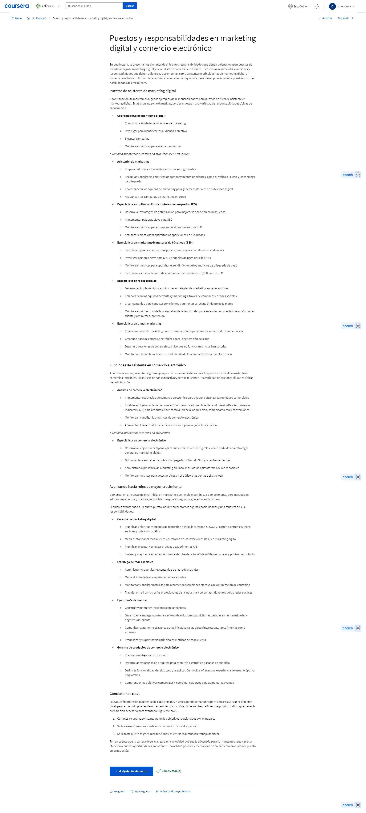
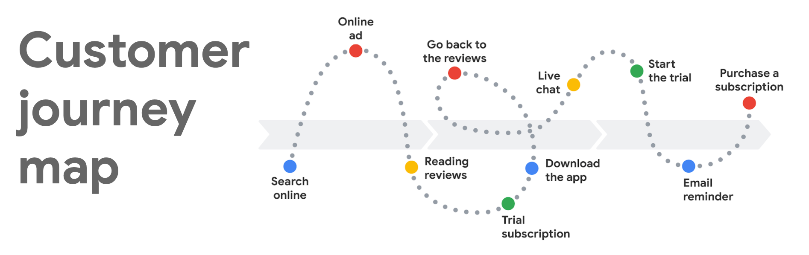
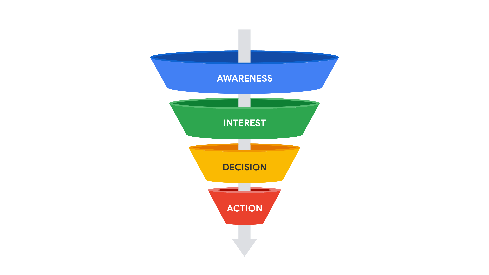
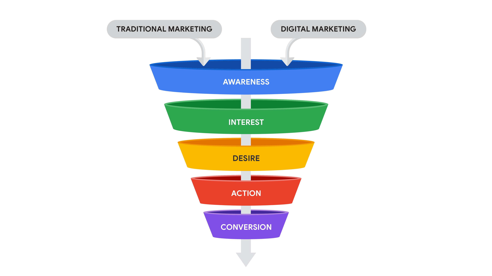
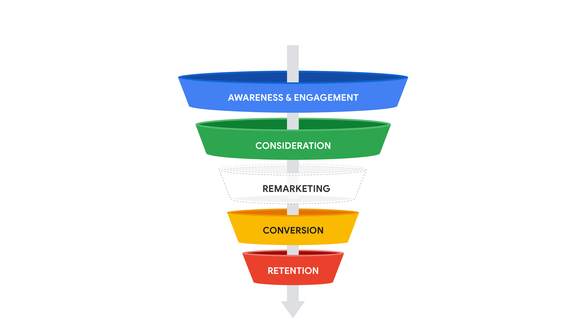
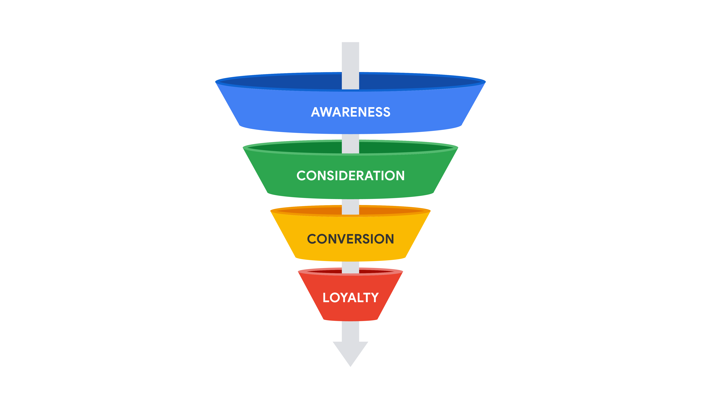

# Fundamentos del marketing digital y comercio electrónico

## Introduccion al marketing digital y comercio electrónico

### Comenzando con el programa de certificación

#### Te damos la bienvenida al Certificado de Carrera de Google en Marketing Digital y Comercio Electrónico

Hola, te doy la bienvenida al certificado de Marketing Digital y Comercio Electrónico de Google. ¡Qué emoción tenerte! Soy
Joi, gerente de Marketing de Producto en Google. Seré tu instructora en el primer curso de este programa de certificación.

La demanda de especialistas en este campo está creciendo a un ritmo increíble. El mercado del e-commerce creció más de un
600% en una década. Y, ahora que se hacen cada vez más negocios en línea, entran al campo más personas con diversos
antecedentes y experiencias, así que el e-commerce se adapta a mercados nuevos y culturas distintas.

Hay puestos bien pagados de e-commerce y marketing digital, con o sin título universitario, gracias al enorme crecimiento
global. Sin embargo, aunque la demanda es más alta que nunca, a las empresas les cuesta hallar candidatos con la experiencia
ideal.

Este programa está diseñado justamente para eso: darte conocimientos y habilidades para comenzar o potenciar tu carrera en
marketing digital o e-commerce. No importa si inicias una trayectoria profesional o si ya trabajas en algo similar.

Al final de este programa, podrás encontrar un trabajo en estos campos de alto crecimiento e impacto. Si has comprado algo
en línea, ya conoces el e-commerce del lado del cliente. Pero ¿qué hacen los especialistas en e-commerce y marketing
digital?

Piensa en la última vez que compraste algo en línea, algo grande o pequeño, no importa lo que fuera. ¿Cómo terminaste
comprando ese producto en particular? Quizá necesitabas algo específico, como una nueva lámpara o un software, y buscaste en
línea para encontrar el artículo ideal. O quizá fue algo que no sabías que necesitabas hasta que te enteraste por un amigo o
un anuncio en línea.

Puede que hayas comprado gracias a especialistas en e-commerce y marketing digital. Ya sea comunicándose por redes sociales
o garantizando el funcionamiento del pago, siempre piensan en mejores formas de conectarte a ti, el cliente, con las
soluciones y productos que necesitas. Y, al hacerlo, ayudan a empresas de todos los tamaños a tener éxito y crecer en el
mercado en línea.

Algo de lo mejor del e-commerce y marketing digital es que hay muchas trayectorias profesionales, cada una con sus propias
habilidades y responsabilidades. Sin importar tus antecedentes, probablemente verás que ya tienes experiencia relevante.

Por ejemplo, yo trabajo a tiempo completo en marketing digital y he llevado tiendas de e-commerce fuera del trabajo. Estudié
relaciones públicas e hice prácticas en Google, donde después me contrataron a tiempo completo. También ayudé durante años a
llevar la tienda en línea de mi familia, y después comencé mi propio negocio de belleza en línea.

Si no sabes qué dirección quieres tomar, no hay problema. En este programa descubrirás los diversos puestos de trabajo que
hay, así como las habilidades especializadas que te ayudarán a decidir hacia dónde quieres llevar tu carrera.

El programa incluye varios cursos que abarcan temas como atraer clientes a través de motores de búsqueda y anuncios en
línea, involucrar a clientes en redes sociales y crear campañas de correo electrónico. También aprenderás a medir y analizar
resultados, administrar relaciones con clientes, optimizar tiendas en línea y prepararte para conseguir trabajo.

Con un certificado de carrera de Google como este, desarrollarás habilidades y aprenderás a usar herramientas para trabajar
en un campo de rápido crecimiento y alta remuneración. No necesitas experiencia previa en marketing digital o e-commerce,
porque aquí comenzarás con lo básico y potenciarás las habilidades que ya tienes.

Yo te guiaré en este primer curso y te enseñaré los fundamentos para tener éxito en el campo. También tendrás el apoyo de
los compañeros que cursan el certificado al mismo tiempo que tú.

Este programa también es muy flexible. Puedes completar todos los cursos del certificado a tu ritmo y gusto, todo en línea.
Los certificados de carrera de Google los diseñaron expertos del sector que tienen décadas de experiencia en Google.

En cada curso del certificado te guiará un experto de Google diferente. Te enseñaremos mediante videos, harás actividades
prácticas y y te daremos escenarios reales que puedes encontrar al trabajar.

Crearás clientes ideales, escribirás correos de marketing, usarás herramientas de analítica, crearás una cartera e incluso
crearás una tienda en línea simulada. Los certificados están diseñados para que consigas trabajo en 3 o 6 meses, si los
cursas a tiempo parcial.

Y, tras graduarte, puedes conectar con más de 150 empleadores que quieren contratar graduados de certificados de Google. Ya
sea que quieras cambiar de carrera, empezar una nueva, potenciar tus habilidades o crear un negocio, los certificados de
carrera de Google te abren puertas a nuevas oportunidades.

Reunimos a instructores increíbles que te apoyarán en tu trayectoria. Se van a presentar ahora. Hola, soy AK, líder de
Excelencia de Ventas en Google. Te enseñaré a atraer e involucrar a clientes. Veremos el embudo de marketing, optimización y
marketing de motores de búsqueda.

Hola, soy Cindy. Soy gerente de Marketing de Producto de Google Ads. Seré tu instructora de marketing y publicidad en RR.
SS., que consiste en incorporar RR. SS. en campañas de marketing.

Hola, me llamo Miriam. Soy gerente de Marketing de Producto de Google Ads. Te enseñaré qué constituye una campaña de
marketing por email de inicio a fin. Te enseñaré a preparar, elaborar y enviar correos para optimizar la marca del negocio.
¡Qué emoción!

Hola, soy Michael, ejecutivo sénior de Cuentas de Crecimiento de Mercado Medio de Google, que apoya a empresas con
estrategias de publicidad de Google. Te enseñaré analítica de marketing; a usar herramientas de analítica en marketing de
rendimiento, y monitorear métricas clave de campañas de e-commerce y marketing.

Hola, soy Cindy, líder de Excelencia en Ventas en Google. Te guiaré en el curso de E-commerce y Venta en Línea. Verás cómo
funcionan las tiendas en línea y cómo involucrar a clientes.

Hola, soy Mike, gerente de Estudios de Rendimiento Global en Google. Seré el instructor del curso final del programa. Verás
cómo crear lealtad de cliente y más sobre e-commerce.

Y yo soy Erica, consultora de Personas en Google. Ayudo a gerentes, líderes y empleados de Google a potenciar sus puestos
para que la empresa alcance sus metas. Te ayudaré a prepararte para buscar

#### Introducción al curso 1

Curso 1: Fundamentos de E-commerce y Marketing Digital

Ahora que tienes una idea de qué esperar en este programa en total, quiero contarte un poco sobre qué esperar de este curso.

Empezamos con lo básico: qué son el e-commerce y el marketing digital y la actividad diaria de los profesionales del sector.
Verás habilidades fundamentales para el éxito en e-commerce y marketing digital, como algunas que ya tienes, y cómo las
impulsarás con el programa.

Veremos el panorama actual de oportunidades laborales. Descubrirás oportunidades disponibles para candidatos de nivel básico
y las responsabilidades que conllevan. Con esto deberías pensar en tus intereses y cómo hallar con ellos una trayectoria
ideal.

Luego descubrirás herramientas para atraer clientes potenciales e impulsar ventas en línea. Verás lo necesario para crear
estrategias de marketing digital y tácticas para llegar a clientes: anuncios digitales, correos y redes sociales.

Al final verás la importancia de medir e interpretar los resultados de dichas tácticas y cómo las empresas usan los datos
parar mejorar su estrategia global. Y recibirás consejos laborales a tener en mente para el siguiente curso.

Eso es lo que te espera. Ahora repasemos recursos con los que aprovecharás el programa al máximo. Me emociona que inicies tu
trayectoria. ¡Empecemos!

### ¿Qué son el marketing digital y el comercio electrónico?

#### ¿Qué son el marketing digital, el comercio electrónico?

¿Sabías que la primera venta completamente en línea ocurrió en 1994? Un hombre llamado Dan Kohn vendió un CD por $12.48
por un sitio web encriptado que él mismo creó.

Ahora es mucho más fácil vender en línea, tanto como persona, pequeño negocio o gigante del comercio minorista. El
e-commerce creció desde los 90; ahora es un sector de miles de millones de dólares.

Lo es porque, en general, es más asequible, práctico y accesible que las ventas en tiendas físicas. Con el crecimiento del
mercado en línea, creó nuevos sectores y profesiones, como el marketing digital.

Comenzamos a explorar el e-commerce y marketing digital y cómo crean valor para las empresas. Primero veamos definiciones.
El término E-commerce se refiere a la compra y venta de bienes y servicios en línea.

Casi todas las compras en línea son de una de cuatro categorías: productos físicos, como libros o bienes domésticos;
productos digitales, como libros digitales o cursos en línea; servicios, como vacaciones o citas médicas, y software, como
programas para procesar texto o editar fotos.

Poder comprar o vender prácticamente cualquier cosa por computadoras, tabletas o teléfonos ha transformado los negocios por
completo. No se necesita una tienda física para empezar un negocio en línea.

Muchos minoristas tienen tiendas físicas y tiendas en línea, pero otros solo venden en línea. Sin el costo de mantener una
tienda, crear un negocio se volvió más fácil que nunca. Así, entraron más personas del mundo al mercado en línea.

Pero también el mercado en línea se saturó muy rápidamente. Para distinguirse y atraer clientes, las empresas empezaron a
anunciarse en línea. Así se creó el marketing digital.

El marketing digital se refiere a llegar al consumidor por canales digitales con el objetivo de convertirlo en cliente. Un
canal digital es un método o plataforma de comunicación que un negocio usa para llegar a su público objetivo en línea.

Puede ser un sitio web, motor de búsqueda, correo electrónico o red social. La meta del e-commerce es vender en línea, el
marketing digital ayuda a las empresas a alcanzarla. Pero no se limita a eso.

También ayuda a las empresas a generar confianza, inspirar lealtad y y ofrecer un mejor servicio. Así es similar al
marketing tradicional, como la publicidad impresa o carteles, pero tiene ventajas agregadas para las empresas y los
consumidores.

Para empezar, el marketing digital es rentable. El presupuesto de publicidad rinde mucho más en línea que en televisión,
radio y medios impresos. Así es porque los profesionales eligen muy bien los anuncios correctos mostrados al público
adecuado en los momentos oportunos.

También hay la posibilidad de que corra la voz del cliente por plataformas como RR. SS. Las campañas de marketing digital
llegan a más gente que las tradicionales, que usan plataformas locales, como periódicos y estaciones de radio.

Crea reconocimiento de marca en mercados nuevos e incluso globales. Así se impulsan las ventas y se ofrecen servicios a
diversas personas. El marketing digital también puede generar resultados más rápido.

Si un cliente ve un producto que desea en un anuncio impreso, puede o no recordar comprarlo después. Los anuncios digitales
le permiten tomar acción al momento, y aumentan la probabilidad de que lo compre.

También permiten a la empresa crear relaciones con el cliente mediante comunicación directa. Los canales como el correo y
RR. SS. dan una personalización con la que el marketing tradicional no puede competir.

Verás más sobre las ventajas y retos del e-commerce y marketing digital más tarde en el curso. Ahora repasemos lo que
aprendimos. En las últimas décadas, estos sectores han cambiado la esencia de los negocios.

La meta del e-commerce es generar ventas; el marketing digital ayuda a las empresas a alcanzarlas al conectar con clientes y
crear relaciones. A continuación, veremos los principales roles y responsabilidades del e-commerce y marketing digital.

#### ¿Qué hacen quienes se especializan en marketing digital y comercio electrónico?

Ahora sabes qué es el marketing digital y el e-commerce, y cómo se relacionan. Veamos qué hacen los profesionales de este
campo en el día a día.

El sector de e-commerce y marketing digital es como un motor. Tiene muchas piezas y mucha acción. Cada pieza tiene una
función diferente, pero trabajan juntas para que todo funcione sin problemas y con eficacia.

En una empresa grande te puedes especializar en un par de áreas, en una pequeña, puedes encargarte de todo un poco. Hay
muchos trabajos diferentes y grupos de responsabilidades diferentes. Por eso el sector es emocionante.

Tus habilidades pueden encajar, no importa cuáles sean. Así también hay muchas opciones al decidir tu trayectoria
profesional.

Como dueña de una pequeña empresa, me encargo de muchas actividades: estrategia y ejecución de campañas de marketing,
gestión del sitio web y desarrollo de producto. También subcontrato personal para lo que conozco menos, como servicio al
cliente y cumplimiento del pedido.

Cada quien tiene sus propios intereses y fortalezas. Al identificar los tuyos podrás descubrir qué quieres. Si te gusta
escribir, puedes trabajar con correos de marketing o artículos de blog. Si te gusta lo visual, puedes trabajar con imágenes
o disposición de sitios web. Si te gusta organizar, puedes administrar tiendas de e-commerce. Si eres de números, puedes
trabajar en estrategias de precios o analizar datos y ver tendencias y compromiso del cliente.

Te ayudaremos a prepararte para varios cargos en el sector. Por ejemplo: coordinador de marketing digital y analista de
e-commerce, Estos pueden parecer distintos, pero pueden tener mucho en común, según dónde trabajes.

Las responsabilidades de marketing digital e e-commerce coinciden a menudo, comparten ciertas habilidades y usan los mismos
canales, como redes sociales, correo electrónico y anuncios. Sin importar tu cargo, podrías dedicarte a esto: investigar la
audiencia; planear, crear o publicar contenido; actualizar descripciones de productos, o analizar datos para ver los
resultados.

Tus metas pueden ser captar e involucrar clientes potenciales, generar confianza, mostrar valor, impulsar ventas o crear una
gran experiencia de cliente.

Desde luego, en el sector hay muchos otros tipos de cargos. Conocerás más sobre ellos y sus responsabilidades en este curso.

Sin importar el cargo que buscas, ayuda saber cómo se ajustan las metas y responsabilidades, como generar conocimiento de
marca, impulsar ventas y gestionar inventarios. Este programa te ayudará a aprender sobre ello.

A continuación, veremos habilidades esenciales para el sector, y cómo puede que ya las hayas practicado.

#### Joi: Trayectoria profesional en marketing digital

Hola, me llamo Wade y soy directora asociada de Marketing de Producto aquí en Google, y eso significa que trabajo en
campañas de marketing digital.

Crecí en una familia de empresarios, mis padres y mis hermanos mayores son propietarios de pequeñas empresas. Así que crecí
siempre ayudándolos con todos los aspectos de la gestión de un negocio, era esa persona que les decía, “Oye, tal vez
deberíamos tener un sitio web, tener páginas de redes sociales, y una lista de correo electrónico”. Eso fue muy importante
para ellos porque comenzaron su negocio mucho antes de que existieran muchos de los canales de marketing que tenemos hoy.

Así que ellos aprendieron sobre marketing digital y yo, que soy de la generación Z, crecí en ese espacio digital. De hecho,
empecé un canal de YouTube en 2011 y ese fue mi primer amor con los contenidos y con la creación de contenidos digitales.
Creaba muchos contenidos de estilo de vida, era la época de las gurús de belleza y muchas mujeres hacían tutoriales de
maquillaje. Por alguna razón pensé que podría hacer contenidos de maquillaje, pero no pude. Pero, creo que esa es la belleza
de YouTube, se trata de experimentar y encontrar tu voz. Y esos humildes comienzos me llevaron finalmente a conseguir una
carrera en marketing digital.

Después de graduarte en el programa, buscar un trabajo va a ser muy importante y hay muchos puestos de nivel inicial en
marketing digital. Piensa en las habilidades que obtuviste en el curso, así como cualquier otra experiencia laboral previa
que tengas y combínalas con las cosas que ves que los empleadores están buscando.

Si estás empezando a sentirte abrumado por el curso, quiero que sepas que puedes hacerlo, hay que trabajar mucho para
superar este curso, pero nada se consigue sin trabajo duro. Creo que realmente verás una recompensa al final, y te lo
agradecerás cuando finalmente tengas tu carrera en marketing digital.

#### Habilidades para el marketing digital y el comercio electrónico

Algo que me encanta de trabajar en este sector es que hay muchas trayectorias que elegir según tus intereses y experiencia.
Al hacer este y los otros cursos del programa, aprenderás sobre muchas habilidades que tienen una alta demanda. Incluso si
recién te incorporas al sector, seguro ya tienes habilidades y experiencias útiles.

En este video, exploraremos habilidades y cualidades con las que tendrás éxito en e-commerce y marketing digital:
curiosidad, mente analítica y narración de historias. No hace falta dominarlas todas. Recuerda que hay varios tipos de
trabajo en el sector. Pero seguro que tienes experiencia con todas ellas.

Empecemos con la curiosidad. Las personas curiosas preguntan, buscan respuestas y prueban novedades. La curiosidad es innata
para algunos, pero puede desarrollarse y tener importancia para trabajar en el sector. En e-commerce y marketing digital la
curiosidad por la gente es esencial: qué quiere, cómo piensa y qué la motiva a tomar acción.

La curiosidad también es importante porque el sector cambia rápidamente. Explorar y conocer las tendencias emergentes te
ayudará a medida que este crece y evoluciona. Hacer este curso es un excelente ejemplo de curiosidad. Estás aquí por
curiosidad por trabajar en e-commerce y marketing digital, y buscas respuestas de forma activa.

Tener curiosidad y preguntar no es la única habilidad útil. Usar una mente analítica para resolver problemas también ayuda
mucho. Los profesionales de e-commerce y marketing digital la usan siempre. No todos somos científicos de datos, al menos yo
no, pero recopilamos y organizamos datos para ver patrones, descubrir tendencias y resolver problemas.

Tener mente analítica no es tener habilidades técnicas, es una forma de pensar. Al decidir en grande como planear un viaje o
comprar un auto seguro usaste el pensamiento analítico. Si comparaste aspectos como costo, tamaño, características, y
seguridad, y elegiste un auto según los más importantes para ti, usaste el pensamiento analítico. Casi siempre analizamos
situaciones sin siquiera darnos cuenta.

Si te gusta resolver rompecabezas y acertijos, los analizas para encontrar soluciones. Otro ejemplo es ser fan de un
deporte. Ver estadísticas de tu equipo y predecir sus resultados futuros es como lo que obtienen con datos los expertos del
sector. Al tener información tras analizar, hay que comunicarla bien a un público. Eso se hace mediante la narración de
datos.

Mediante historias, convertimos cifras y estadísticas en presentaciones e informes que cautivan. Los expertos usan la
narración de datos para comunicar información a clientes y colegas todo el tiempo. Las empresas lo usan para comunicar valor
a los clientes de forma accesible, atractiva y, sobre todo, memorable. Con las historias conectan con los clientes y se
distinguen de la competencia.

Todos cuentan historias. Ya sea mediante un blog o contando bien chistes, todos contamos historias en el día a día. Y no es
siempre algo oral: también se usa storytelling visual en e-commerce y marketing digital. Si tienes experiencia en dibujo,
diseño o fotografía, puedes crear historias visuales para campañas de marketing digital.

En este curso conocerás más formas de usar la narración de datos en el sector. Estas son solo algunas habilidades que te
pueden ayudar en tu carrera. Hay muchas otras como adaptabilidad o liderazgo. Algo útil que tenía antes de trabajar en
marketing es mi creatividad. A veces necesitas averiguar cómo destacar de la competencia.

Los expertos deben destacar las cualidades de la marca y captar clientes de forma creativa. Al ver los distintos cargos y
responsabilidades del sector, piensa en otras formas de usar tus habilidades y experiencia. Piensa en tus fortalezas al
hacer el programa y las podrás transmitir mejor a posibles empleadores.

El sector cambiará y crecerá con las nuevas tecnologías. Quizá debas aprender nuevo software o tecnología. Las habilidades
transferibles como la curiosidad, mente analítica y narración de datos te permitirán crecer con el sector. A continuación,
te diré más sobre habilidades especializadas que puedes necesitar y que desarrollarás con este programa.

#### Prisha: El camino que recorrí para trabajar en marketing digital

Hola, soy Prisha, y soy estratega de Cuentas. Como estratega de Cuentas, ayudo a las empresas a crecer enseñándoles Google
Ads. Uno de mis aspectos favoritos del marketing digital es lo colaborativo que es, y realmente disfruto trabajando con un
montón de gente diferente. Me encanta poder marcar la diferencia y crear el mejor contenido posible para mis clientes,
usuarios o cualquier otra persona.

Cuando entras en el mundo del marketing, está muy bien no tener tanta experiencia como crees que necesitas. Entré en el
marketing con cero experiencia, y mi mayor consejo es que tengas la mente muy abierta y no temas el porque te postularás
para muchas cosas diferentes, y no pasa nada si no consigues el puesto al principio, porque trabajarás para conseguirlo en
el futuro.

Mi canal de YouTube fue algo que decidí hacer cuando tenía 16 años. Lo comencé porque quería concienciar sobre mi enfermedad
crónica para ayudar a marcar la diferencia en la comunidad y mostrar a los demás que cualquiera con una condición crónica o
una diferencia visible puede alcanzar sus sueños o metas. Empecé a hablar también de maquillaje pero también de blogs de
viajes y blogs educativos, y luego me incliné por contenidos más relacionados con la pasantía y la carrera profesional para
concienciar también sobre ello.

Pude aprender qué es lo más les gusta a mis seguidores o a la comunidad de mi canal y mantenerlo para poder crecer aún más.
De mi canal de YouTube y de la gestión de mis redes sociales aprendí muchas cosas que pude aplicar a mi trabajo diario
durante mi pasantía; por ejemplo, la importancia de ser coherente con tu campaña, de modo que cuando gestionas varias
empresas diferentes, es muy importante tener mensajes coherentes, y lo hice a través de mi canal de YouTube, Instagram, y
Tik Tok para asegurarme de que la gente entendía mi marca y mi historia en diferentes aspectos.

Cuando tenía 18 años, decidí hacer una pasantía en lugar de la universidad. En la escuela sabía que mi pasión era el
marketing digital e iba a estudiar economía, pero me di cuenta de que, siendo mi pasión este tipo de marketing, por qué no
comenzar mi carrera temprano. Supe que me gustaba mucho por mi experiencia laboral en mi canal de YouTube.

Cuando me presenté a las entrevistas para los diferentes puestos (el de la pasantía y el que tengo a tiempo completo en
Google), quería mostrar la importancia de la pasión y cómo el entusiasmo llega muy lejos, y si algo te apasiona, eso te hará
avanzar en cualquier puesto o entrevista. Así que algo que intenté durante la pasantía, cuando no tenía experiencia, fue que
me apasiona el marketing digital, y he hecho XYZ para mostrarlo a través de mi canal de YouTube y a través de diferentes
cosas, así que creo que si puedes mostrar tu pasión y entusiasmo por algo, llegarás muy lejos.

Cuando empiezas en el marketing digital o en cualquier otra carrera, puede ser muy estresante, y puedes tener el síndrome
del impostor y puedes sentir realmente que no perteneces aquí para estar aquí, y eso es algo a lo que me enfrenté en en la
pasantía, pero también en la transición a un puesto a tiempo completo. Mi consejo en este sentido es que hables con mucha
gente, y verás cuántas personas sienten realmente que tienen el síndrome del impostor, y creo que hablando de ello con el
tiempo, te darás cuenta de que mereces estar aquí, y que te has ganado un puesto.

Encontrar un mentor puede ser muy útil. Con tu mentor puedes trabajar en objetivos a corto y largo plazo, y puede ayudarte
con los distintos miedos que puedas tener. Por ejemplo, yo tenía miedo a hablar en público, y mi mentor y yo pudimos
trabajar en ello y establecer objetivos a corto plazo para ayudarme a conseguirlo, de modo que ahora soy capaz de presentar
y llevar a cabo diferentes iniciativas basadas en ello.

Estoy súper emocionada de que completes este curso y de que te apasiones más de lo que ya estás por el marketing digital,
igual que yo, y no puedo esperar a que completes esto y a que tengas todas las habilidades relevantes para convertirte en un
profesional del marketing digital. Mucha suerte. Habilidades especializadas que puedes necesitar y que desarrollarás con
este programa.

#### turaHabilidades básicas de especialistas en marketing digital y comercio electrónico

Las habilidades que obtendrás al completar el Certificado de Carrera de Google en Marketing Digital y Comercio Electrónico
son utilizadas en muchos puestos de marketing digital y comercio electrónico de nivel inicial. Esta lectura te brinda una
visión general de los temas que integran el programa de la certificación y los relaciona con ejemplos de requisitos
laborales.

Comparación de habilidades básicas en diferentes puestos

Tanto los puestos en marketing digital como en comercio electrónico demandan habilidades similares. Sin embargo, a menudo,
estas habilidades se aplican de maneras diferentes. La siguiente tabla te da una idea de cómo las responsabilidades
laborales pueden diferir ligeramente entre unos casos y otros.

Conclusiones principales

A menudo, se recomienda que adaptes tu currículum cada vez que solicites un empleo, para que tu experiencia y tus destrezas
se alineen lo más posible con los requisitos del puesto en cuestión. Al final de este programa, podrás adaptar tu
currículum, en función de las habilidades que hayas aprendido, para los puestos de marketing digital o comercio electrónico.

#### Melba: El camino que recorrí para trabajar en comercio electrónico

Hola, me llamo Melba y soy directora de Marketing de Producto en Google. Ayudo a comunicar el qué, el por qué y el cuándo de
los productos que estamos desarrollando, tanto internamente a equipos multifuncionales como externamente a nuestros públicos
objetivo definidos.

Diría que mi trayectoria ha sido muy poco convencional. A los 16 años tuve que dejar el instituto para buscar trabajo y
ayudar económicamente a mi madre. Crecí en un hogar monoparental y, si soy sincera, cuando tenía 16 años nunca pensé que
fuera a ir a la universidad, y mucho menos que fuera a conseguir un trabajo en un lugar como Google.

Es interesante la forma en que las cosas terminaron funcionando porque después de conseguir un trabajo, me encontré tratando
con una líder latina muy increíble y poderosa. La primera vez que vi a una líder latina, me quedé asombrada porque no era
algo que soliera ver a menudo. Y cuando lo hice, me di cuenta de que si ella podía hacerlo, yo también.

Fui a casa ese mismo día, y empecé a investigar una carrera en marketing. Tuve que comenzar desde cero. Empecé a tomar
clases para obtener mi GED. Una vez que obtuve el GED, me licencié y seguí trabajando a jornada completa. Como parte de mi
educación y aprendizaje continuo, tomé varias clases en línea y también hice muchos cursos que estaban disponibles de forma
gratuita en línea.

Una de las más grandes razones por las que lo hice es porque me di cuenta de que, a menudo, necesitaba sentarme con los
materiales y poder hacerlo a mi propio ritmo. Para mí, eso fue fundamental porque como abandoné la escuela, cuando estaba en
la universidad, me di cuenta de que todo el mundo iba a un ritmo más avanzado que yo. Yo no tenía muchos de los
conocimientos básicos que ellos tenían, y, por eso, a menudo tenía que volver, tomar clases en línea, hacer cursos
adicionales, y adquirir esos conocimientos básicos para poder prepararme para el éxito en el futuro.

Supe que había tomado la decisión correcta de dedicarme al marketing cuando lancé mi primera campaña. En realidad, mi
primera campaña iba dirigida a poblaciones desatendidas. Como latina, es muy importante que en el trabajo que hago pueda
retribuir a mi comunidad y asegurarme de que se reconoce su voz.

Además del trabajo que hago en Google, también fundé una empresa llamada Mujeres on the Rise, una comunidad que ayuda a las
latinas a ascender a través de recursos, comunidad y asesoramiento. Al pertenecer a una comunidad marginada, me di cuenta de
que hay muchas barreras que nos impiden conseguir lo que queremos. Y muchas veces esas barreras son nuestras propias voces
internas que nos dicen que no somos capaces de hacer lo que queremos hacer.

Como parte del trabajo que hago, empecé esta comunidad para compartir lo que he aprendido en el camino y ayudar a otros a
hacer lo mismo. Solía creer que mi situación en la vida determinaría para siempre mi futuro. Tras haber progresado tanto
desde mi punto de partida, sé que eso no es necesariamente cierto.

Puedes cambiar el rumbo de tu vida, pero todo empieza con una decisión. Tienes que dar ese primer paso sin pensar
necesariamente en el larguísimo viaje que te espera. Simplemente da un paso, un día cada vez, y con el tiempo, mirarás atrás
y te darás cuenta de lo lejos que has llegado.

#### Andrew: el camino que recorrí para trabajar en marketing digital y comercio electrónico

Me llamo Andrew y soy director del Programa de Operaciones de Socios para los equipos de soporte publicitario en Google.

Como responsable de este programa, trabajo con los equipos de soporte de anuncios que brindan apoyo directo a nuestros
clientes publicitarios.

Cuando me gradué de la escuela secundaria, realmente no sabía qué quería hacer con mi vida, o qué quería ser de grande, por
así decirlo.

Tuve la suerte de asistir a la Academia Naval de los Estados Unidos durante cuatro años, donde obtuve un título
universitario, además de la experiencia en liderazgo para ingresar a la marina como oficiales y liderar a los marineros.

El equipo al que me uní fue la comunidad submarina, y dejé Annapolis para ir a Charleston, Carolina del Sur, donde ingresé a
nuestro programa de capacitación en energía nuclear.

Son unos seis meses bastante agotadores en la teoría de la ingeniería nuclear y luego seis meses de capacitación práctica en
reactores.

Desafortunadamente, al ser un programa muy difícil, no funcionó lo bastante bien para mí, y la ingeniería nuclear sigue
siendo un tema que me parece complejo hasta el día de hoy.

Terminé saliendo de la marina un poco antes de lo que esperaba, de modo que tuve que reevaluar dónde estaba y qué estaba
haciendo, y averiguar definitivamente que quería hacer después de la marina, mucho antes de lo que había previsto
originalmente.

Cuando dejé la marina, tuve la suerte de tener un amigo que trabajaba en Google en ese momento y que conoció un poco más
sobre mi experiencia, y me ayudó a comprender realmente dónde podría aprovechar mis habilidades tras salir de la marina y al
entrar al mundo civil.

Así que preparé mi primer currículum y comencé a buscar empleo, pero realmente me tomó un par de meses descubrir cómo
presentar una buena candidatura para los puestos.

No tenía una dirección clara hacia dónde ir ni en qué industria me gustaría estar, y pasé aproximadamente cinco o seis meses
aplicando a trabajos que me interesaban o en los que parecía que podía encajar.

Fue un poco agotador. Ya sabes, te postulas a un trabajo y esperas y sigues esperando, y finalmente recibes esa carta de
rechazo y solo esperas que algún día alguien se arriesgue a contratarte.

Entonces, cuando comencé a conectarme con algunos de mis compañeros para comprender en qué estaban teniendo éxito, se me
aclararon las ideas.

Tenía que hacer un mejor esfuerzo al decirles a las empresas por qué deberían contratarme y por qué encajaría bien en ellas.

Creo que aprendí que lo más importante para mí iba a ser no solo contarle a la gente sobre mi experiencia militar, sino
decirle cómo esa experiencia encajaría muy bien para el puesto que buscaban.

La idea era tratar de traducir algunas de las habilidades que tenía, incluso si no estaban directamente relacionadas con la
experiencia, traducir cómo esas habilidades me convertirían en el candidato ideal o en un miembro exitoso para sus equipos.

Una vez que empecé a esforzarme más para contar mi propia historia y adueñarme de mis experiencias, empecé a ver un mayor
éxito cuando en realidad yo era la persona que entrevistaba.

Creo que es muy importante buscar siempre nuevas oportunidades para aprender.

No tenía una formación formal en marketing digital y, sin embargo, pude ingresar a esta industria y tener éxito al estar
dispuesto a aprender, mantener la mente abierta al abordar nuevas oportunidades, y hacer muchas preguntas.

Para cualquiera que esté saliendo del servicio militar, mi recomendación número uno sería hablar con personas que ya estén
en el mundo civil.

No importa que sean otros militares que hayan hecho la transición anteriormente, o simplemente amigos, familiares, conocidos
que ya están en la industria o en el área en la que quieres estar, reúnete con ellos para pedirles información y conocer más
sobre un puesto o sobre una industria, o pídele a alguien que revise tu currículum y que te dé su opinión sobre lo que no
esté claro o o genere confusión, o cómo podrías describir mejor alguna parte de tu experiencia.

No tengas miedo de pedir ayuda a las personas que ya están en el puesto, que hayan tenido esa experiencia y que puedan
compartir parte de ese conocimiento contigo, como alguien que acaba de unirse al equipo.

### Carreras profesionales en marketing digital y comercio electrónico

#### Cómo iniciar tu carrera en marketing digital o comercio electrónico

Hola, me llamo Erika. Soy consultora de Personas en Google, o bien socia comercial de RR. HH. Ayudo a empleados, líderes y
gerentes a resolver problemas y enfocarse en sus metas. También los guío, y te guiaré a ti en este programa.

No me fue simple llegar a trabajar en RR. HH. Antes trabajé en otros sectores, como mesera y cajera. Incluso gestioné
reclamos de seguros de autos. Mi pasado laboral es diferente, pero me enseñó sobre mí y qué quería hacer. Al darme cuenta de
mi pasión por ayudar a otros a aprender y desarrollarse, vi mi camino con claridad.

Ahora te comparto con gusto lo que sé para tu futuro profesional. Me verás en ocasiones y te daré recursos de carrera.
También te aconsejaré sobre buscar trabajo y entrevistarte. En este video, hablaremos del panorama laboral y qué puedes
hacer ahora para hacer avanzar tu carrera.

El e-commerce y marketing digital son sectores de rápido crecimiento hoy. Ahora hay miles de vacantes y millones con cargos
similares. Muchos de estos trabajos no existían hace 5 o 10 años. Y, con las nuevas tecnologías, habrá más. Si buscas en una
bolsa, verás vacantes de marketing digital e e-commerce en empresas de todo tipo, no solo en minoristas y bienes de consumo.

Hay oportunidades en muchos campos que permiten crear impacto en diversas áreas, como educación, salud y finanzas. Puedes
buscar trabajo en sectores que te gustan. ¿Te gusta la moda, la tecnología o el entretenimiento? Todos necesitan expertos en
e-commerce y marketing digital.

A la vez, busca trabajo con la mente abierta. Quizá tu próximo trabajo no sea el definitivo. Aunque no empieces en el sector
ideal, te puede ayudar a alcanzar lo que quieres. Además de buscar por determinados sectores, quizá prefieres ciertos
aspectos del marketing digital o e-commerce. Eso está bien.

Los mejores candidatos conocen bien los fundamentos y son expertos en una o dos áreas específicas. Durante el programa,
presta atención a los temas y cursos que más te atraen. Piensa en tus fortalezas y qué quieres hacer con ellas. Quizá no lo
tienes claro, pero estas preguntas te ayudarán a buscar cargos de tu interés.

Aunque aún no quieras buscar trabajo, ya puedes tomar acciones para mejorar tus posibilidades futuras. Por ejemplo, nunca es
demasiado pronto para explorar descripciones de vacantes. Piensa en tus habilidades y lo que más te gusta del programa, y, a
la vez, busca cargos en esas áreas. Anota los términos y habilidades que suelen aparecer.

Por ejemplo, a menudo pueden mencionarse análisis e informes de datos. Con esto aprenderás la terminología del sector y
descubrirás dónde desarrollar tus habilidades. Tras hallar los puestos que te interesan, identifica ejemplos de experiencia
laboral que sean relevantes.

¿Has escrito un ensayo o una historia?, ¿diseñado un sitio web?, ¿gestionado un presupuesto u organizado una hoja de
cálculo? Crearás un portafolio más adelante en el programa. Identifica los elementos que quieres incluir allí. Si no tienes
ejemplos aún, no hay problema. Crearás algunos al completar las actividades de los cursos próximos.

Al final del programa, tendrás ejemplos concretos para demostrar tu experiencia ante empleadores. Para aprovechar lo
aprendido, también puedes preparar tu imagen como especialista en marketing digital o e-commerce. Es decir, crear tu marca
personal. Muestra tus conocimientos y habilidades en redes sociales o tu sitio web personal.

Así incluso puedes conseguir ejemplos laborales para tu cartera. Por último, sigue el programa poco a poco hasta el final.
Al completar esta serie de cursos, inviertes en ti, tus habilidades y tu futuro. Ya lo estás haciendo, ¡sigue así! ¡Buena
suerte! Te veo de nuevo al final del curso.

#### Roles en agencias en comparación con puestos internos

Ahora conoces ciertas habilidades y responsabilidades de los cargos de e-commerce y marketing digital. También viste un poco
sobre el panorama laboral.

Profundicemos y veamos dos trayectorias que puedes tomar: cargos internos y cargos en agencias.

En los cargos internos, trabajas en una sola empresa con sus productos. Por ejemplo, yo trabajo como gerente de Producto
interna en Google. Creo videos y contenido de redes sociales para la marca Think with Google. Si quieres variar tus
responsabilidades en proyectos de diversos sectores, puedes trabajar en una agencia.

Las agencias se asocian con empresas sin equipos de marketing internos para encargarse de su marketing digital y publicidad.
Ambos tipos de cargos presentan ventajas y desventajas. El ideal para ti depende de lo que quieres para tu carrera. No hace
falta elegir uno para siempre. Aquí te ayudaremos a prepararte para ambos.

Hay diferencias que tener en mente al pensar en opciones. En un cargo interno, conocerás muy bien una sola empresa y sus
productos. Asimismo, dominarás un sector en específico. Si trabajas en una empresa de cosméticos, tu experiencia puede ir
directamente a otra empresa similar.

En cambio, si te gusta trabajar en muchos proyectos diferentes, trabajar en una sola empresa y producto puede no ser ideal.
Si quieres cambiar de tipo de negocio, cambiar de sector es más difícil con experiencia especializada. Si trabajas en una
agencia, es poco probable que te aburras, pues el trabajo es por proyectos. Colaboras en varias iniciativas y sectores. Así,
desarrollas experiencia amplia y flexible que te ayudará para varias empresas.

Pero también puedes especializarte. Las agencias se enfocan en ciertas áreas del marketing, como redes sociales o marca. Así
puedes conocer muy bien ciertas habilidades.

Pero también hay desventajas. La variabilidad que hace el trabajo interesante también crea impredecibilidad. Los clientes
pueden hacer solicitudes inesperadas o pedirte hacer algo de una forma desconocida. Se trabaja más tiempo, en especial hacia
el final de un proyecto.

Cada empresa es diferente y sus ventajas y desventajas variarán. Sin importar si eliges la especialización y estabilidad de
un cargo interno o el amplio saber y la flexibilidad en agencia, ganarás experiencia que puede llevarte a la próxima gran
oportunidad.

#### Puestos y responsabilidades en marketing digital y comercio electrónico

En otra lectura, te presentamos ejemplos de diferentes responsabilidades que tienen quienes ocupan puestos de coordinador/a
de marketing digital y de analista de comercio electrónico. Esta lectura resume otras funciones y responsabilidades que
tienen quienes se desempeñan como asistentes o principiantes en marketing digital y comercio electrónico. Al final de la
lectura, encontrarás consejos para pasar de un puesto inicial a puestos con más posibilidades de crecimiento.

Puestos de asistente de marketing digital A continuación, te mostramos algunos ejemplos de responsabilidades para puestos de
nivel de asistente en marketing digital. Estas listas no son exhaustivas, pero te muestran una variedad de responsabilidades
típicas de cada función.

Coordinador/a de marketing digital* Coordinar actividades e iniciativas de marketing Investigar para identificar las
audiencias objetivo Ejecutar campañas Monitorear métricas para evaluar tendencias

Asistente de marketing

Preparar informes sobre métricas de marketing y ventas Recopilar y analizar las métricas de comportamiento de clientes, como
el tráfico a la web y los rankings de búsqueda Coordinar con los equipos de marketing para generar materiales de publicidad
digital Ayudar con las campañas de marketing en curso

Especialista en optimización de motores de búsqueda (SEO) Desarrollar estrategias de optimización para mejorar la aparición
en búsquedas Implementar palabras clave para SEO Monitorear métricas para comprender el rendimiento de SEO Actualizar
enlaces para optimizar las apariciones en búsquedas

Especialista en marketing de motores de búsqueda (SEM) Identificar tipos de clientes para poder comunicarse con diferentes
audiencias Investigar palabras clave para SEO y anuncios de pago por clic (PPC) Monitorear métricas para optimizar el
rendimiento de los anuncios de búsqueda de pago Identificar y supervisar los indicadores clave de rendimiento (KPI) para el
SEM

Especialista en redes sociales Desarrollar, implementar y administrar estrategias de marketing en redes sociales Colaborar
con los equipos de ventas y marketing a través de campañas en redes sociales Crear contenido para conectar con clientes y
aumentar el reconocimiento de la marca Monitorear las métricas de las campañas de redes sociales para entender cómo es la
interacción con el cliente y optimizar el contenido

Especialista en e-mail marketing Crear campañas de marketing por correo electrónico para promocionar productos o servicios
Crear una base de correos electrónicos para la generación de leads Depurar direcciones de correo electrónico que no
funcionan o no se han suscrito Monitorear mediante métricas el rendimiento de las campañas de correo electrónico

Funciones de asistente en comercio electrónico A continuación, se presentan algunos ejemplos de responsabilidades para los
puestos de nivel de asistente en comercio electrónico. Estas listas no son exhaustivas, pero te muestran una variedad de
responsabilidades típicas de cada función.

Analista de comercio electrónico*

Implementar estrategias de comercio electrónico para ayudar a alcanzar los objetivos comerciales Establecer objetivos de
comercio electrónico e indicadores clave de rendimiento (Key Performance Indicators, KPI) para atributos clave como
audiencia, adquisición, comportamiento y conversiones Monitorear y analizar las métricas de comercio electrónico Aprovechar
los datos del comercio electrónico para mejorar la operación

Especialista en comercio electrónico Desarrollar y ejecutar campañas para aumentar las ventas digitales, como parte de una
estrategia general de marketing digital. Optimizar las campañas de publicidad pagada, utilizando SEO y otras herramientas
Administrar la presencia de marketing en línea, incluidas las plataformas de redes sociales Monitorear métricas para
detectar picos en el tráfico o las ventas del sitio web

Avanzando hacia roles de mayor crecimiento Comenzar en un puesto de nivel inicial en marketing o comercio electrónico es
emocionante, pero después de adquirir experiencia y práctica, es posible que quieras seguir progresando en tu carrera.

Si quieres avanzar hacia un nuevo puesto, aquí te presentamos algunas posibilidades y una muestra de sus responsabilidades.

Gerente de marketing digital Planificar y ejecutar campañas de marketing digital, incluyendo SEO/SEM, correo electrónico,
redes sociales y publicidad gráfica Medir e informar el rendimiento y el retorno de las inversiones (ROI) en marketing
digital Planificar, ejecutar y analizar pruebas y experimentos A/B Evaluar y mejorar la experiencia integral del cliente, a
través de múltiples canales y puntos de contacto

Estratega de redes sociales Administrar y supervisar el contenido de las redes sociales Medir el éxito de las campañas en
redes sociales Monitorear y analizar métricas para recomendar soluciones efectivas de optimización de contenido Trabajar en
red con otros/as profesionales de la industria y personas influyentes de las redes sociales

Ejecutivo/a de cuentas Construir y mantener relaciones con los clientes Garantizar la entrega oportuna y exitosa de
soluciones publicitarias basadas en las necesidades y objetivos del cliente Comunicar claramente el avance de las
iniciativas a las partes interesadas, tanto internas como externas Pronosticar y supervisar las principales métricas de cada
cuenta

Gerente de productos de comercio electrónico Realizar investigación de mercado Desarrollar estrategias de producto para
comercio electrónico basadas en analítica Definir la funcionalidad del sitio web y la aplicación móvil, y ofrecer una
experiencia de usuario óptima para ambos Comprender los objetivos comerciales y coordinar esfuerzos para aumentar las ventas

Conclusiones clave La evolución profesional depende de cada persona. A veces, puede tomar unos pocos meses avanzar al
siguiente nivel; pero a menudo puedes demorar también varios años. Estas son tres señales que podrían indicar que tienes la
preparación necesaria para avanzar al siguiente nivel.

Cumples o superas constantemente los objetivos relacionados con el trabajo. Se te asignan tareas asociadas con un puesto de
nivel superior. Solicitaste que te asignen más funciones, mientras realizabas tu trabajo habitual.

Ten en cuenta que tu carrera debe avanzar a una velocidad que sea la adecuada para ti. ¡Mantente alerta y presta atención a
nuevas oportunidades mostrando una actitud positiva y mentalidad de crecimiento en cualquier puesto en el que estés!

#### Zuri: un día en la vida de un especialista en marketing digital de nivel inicial

Me llamo Zuri y soy directora asociada de Marketing de Producto en Google.

Entré en el marketing digital de una forma poco convencional.

Una parte de mi historia es que crecí sin saber necesariamente nada sobre marketing digital o marketing en general.

La forma en que entré en este campo fue específicamente a través de una pasantía increíble con Google: la pasantía BOLD.

Antes de entrar en el marketing digital, algunos de los trabajos que tuve no tenían nada que ver con este tipo de marketing.

Mi primer trabajo fue en Chick-fil-A.

En mi ciudad natal, trabajaba como camarera y tomaba pedidos, atendía a los clientes y preparaba sus comidas y bebidas.

Y ese trabajo en sí mismo tenía un montón de habilidades transferibles a lo que veo ahora como una mercadóloga digital.

Ya sea dándole prioridad al cliente o consumidor, o al gestionar su tiempo con diligencia y eficacia.

En mi opinión, lo esencial es que te enseña a interactuar con las personas.

Estoy seguro de que, si se busca bien, se pueden encontrar habilidades y características clave transferibles a un puesto
básico de marketing digital.

El equipo específico en el que trabajo dentro de Google Ads es el equipo de arquitectura de marca.

Pensamos estratégicamente sobre lo que es importante destacar en el texto de los anuncios de Google.

Tenemos que tener en cuenta el anunciante que va a interactuar y que verá la copia y el texto que se muestra dentro de la
cartera del anuncio.

Como mercadóloga de nivel básico, trabajo con muchos equipos equipos para asegurarme de que se escucha la voz del cliente.

La mayor parte del día, me dedico a buscar en diferentes documentos, presentaciones y plataformas para recopilar la
información que necesito para hacer mi trabajo, y esa es la primera parte.

La segunda mitad consiste en extraer la información que he recopilado y hablar con determinados Googlers para asegurarme de
que, por un lado, entiendo lo que leo y, por otro, al entender lo que leo, lo aplico apropiadamente a la tarea que tengo
entre manos.

Además de eso, a lo largo del día y en el desempeño de mis funciones, recibo formación que me ayuda a ser mejor Googler y a
desempeñar mi trabajo con mayor eficacia.

Lo que más me gusta de trabajar en marketing digital es la creatividad.

Soy capaz de actuar como creativa, como pensadora estratégica y también como solucionadora de problemas con el objetivo y la
mente puestos en ayudar y promocionar nuestra marca entre los clientes que adoran y usan nuestros productos y servicios.

Y esa es una característica clave que hay que tener como mercadóloga digital: conocer y comprender el comportamiento del
cliente, comprender la personalidad y ser capaz de jugar con eso.

Si trabajas e interactúas con la gente, si promueves y das a conocer una marca o un producto, tienes un lugar en el
marketing digital.

#### Jebb: un día en la vida de un Gerente de Cuentas de comercio electrónico de nivel inicial

Soy Jebb Rickets y soy director de Cuentas para Grandes Minoristas en Google.

Un director de Cuentas básicamente trabaja con empresas que ya invirtieron en Google para gastar más dinero con Google.
Piensa en las grandes empresas minoristas, ya sean de ropa, electrónica, comestibles o en un supercentro.

Cuando empecé en Google, trabajé con pequeñas y medianas empresas, tanto de comercio electrónico como de generación de
leads. Pero en el lado del comercio electrónico, trabajábamos con cualquier cosa. Podría ser ropa, chucherías: uno de mis
clientes favoritos vendía tarjetas personalizadas. Teníamos de todo, desde artículos baratos hasta artículos que podían
costar $1000, $2000 o $3000.

Muchas empresas continúan en línea, incluso si tienen una sede física. Creo que para el comercio electrónico, lo importante
es si eres omnicanal o no. ¿Tienes una tienda física? ¿Y cómo puedes ampliar tu tienda vendiendo también en línea? Y luego,
si no tienes un local físico, cómo aumentas el conocimiento de tu marca para que la gente vaya a tu sitio web y no al sitio
web de un competidor o a un negocio físico?

Lo que me encanta del e-commerce es que podemos ver el impacto de lo que estamos vendiendo y en lo que estamos trabajando.
Entonces, a través del análisis de datos y todas estas piezas, podemos determinar: hicimos una campaña por $10 millones y
nos dio $30 millones en ganancias. Y esa es una sensación increíble que muchas veces no obtienes con otros canales
mediáticos, piensa en la televisión, es muy difícil probar si esta genera dinero para la empresa o no. Así que me encanta
ver el éxito entre ingresos y resultados que somos capaces de lograr a través del marketing digital.

Por lo general, tenemos proyectos semanales: trabajamos en una plataforma de presentación para un nuevo producto que creemos
que los clientes deben usar. O hacemos cálculos de datos en una campaña que se acaba de ejecutar y tratamos de determinar el
retorno final de la inversión publicitaria.

La tarea común para las personas que se inician en el comercio electrónico depende del cliente con el que están trabajando.
En una empresa pequeña, podrías estar en Excel o Google Sheets y calcular cuál fue tu gasto durante las últimas semanas. Y
luego tratar de calcular de nuevo esa parte del retorno de la inversión y pensar en qué nuevas estrategias podemos emplear
para mejorar eso. Tal vez sea organizar reuniones con las partes interesadas internas que digan: “Deberíamos hacer XYZ si
queremos aumentar el rendimiento en el tiempo”.

Para una empresa más grande, puede ser un poco más difícil conocer el día a día, porque muchas veces es reactiva. Recibes un
correo electrónico del cliente interno que dice, “Necesitamos que investigues esto y que investigues aquello”. Así que a
menudo tienes que realizar muchas tareas pequeñas mientras abordas un proyecto más grande, como, “Queremos ejecutar una
campaña de $100 millones en el transcurso de un año”. Y eso requiere varias semanas o meses para presentar una idea como
esa.

Para ser un director de Cuentas exitoso, necesitas habilidades técnicas e interpersonales. Las primeras se refieren a
analizar datos: ¿puedes mirar los datos y determinar qué se debe hacer para mejorar el proyecto o qué podemos aprovechar de
él después de que se puso en marcha? Las habilidades interpersonales pueden ser tan simples como ser agradable en una
conversación, donde hablas cosas triviales y comunes, y luego pasas a situaciones más profundas y complejas con ese cliente.
Realmente se trata de generar confianza y ganar esa relación desde el principio.

Les hago saber a mis clientes que estoy abierto a ellos. Si tienen algún problema o dificultad, deben enviarme un correo
electrónico, llamarme y podré responder sus dudas. Y luego, cuando se trata de mi tiempo para un gran proyecto, ya me
conocen, confían en mí, me han visto responder a todas estas preguntas difíciles. Y ahora tengo esta nueva idea de producto
que les encanta, solo porque hemos trabajado juntos durante las últimas semanas o meses.

Mi consejo número uno es simple: sé paciente pero ten hambre. Hay mucho que aprender sobre el marketing digital. Hay mucho
que aprender sobre un cliente específico. Escucha las necesidades de ese cliente y aparta tiempo para conocer los productos
en los que estás trabajando o que estás vendiendo. Hay mucho que aprender y tienes que estar abierto a ello, tienes que ser
ávido y lo suficientemente paciente para conocerlo porque requiere algo de tiempo.

#### ¿Comercio electrónico, E-commerce, ecommerce o eCommerce?

¿Cuál es el término correcto: comercio electrónico, E-commerce, ecommerce, eCommerce o simplemente ecomm para abreviar? El
nombre y la ortografía del término comercio electrónico han evolucionado en los últimos 30 años, tanto como las tecnologías
y las habilidades necesarias para trabajar en este campo. En esta lectura, conocerás un resumen de la evolución del comercio
electrónico, la historia del término y cuatro modelos distintos  que han surgido, dentro del comercio electrónico, a lo
largo de los años.

Aunque es algo relativamente reciente, como casi todo en internet, el comercio electrónico ha evolucionado y cambiado mucho.
Lo que comenzó como comercio electrónico, rápidamente se convirtió en e-commerce, ecommerce o eCommerce. Pero, ¿cómo puedes
saber cuál es el término que debes usar? En este curso, usaremos principalmente comercio electrónico, pero también el
término en inglés, e-commerce. Esto se debe, en parte, a que Google Trends (un sitio web que analiza la popularidad de las
principales búsquedas que se realizan en el buscador de Google) muestra que la mayoría de las personas prefieren usar
e-commerce en lugar de ecommerce o eCommerce. Dado que el término en inglés es una combinación de dos palabras, el uso del
guión lo hace más claro. Ahora, hablemos de los cuatro modelos que existen dentro del comercio electrónico:

Negocio a consumidor (Business-to-Consumer, B2C)

Consumidor a consumidor (Consumer-to-Consumer, C2C)

Negocio a negocio (Business-to-Business, B2B)

Consumidor a negocio (Consumer-to-Business, C2B)

Nota: Cuando se trata de una entidad gubernamental, la sustitución de negocios por administración da origen a nuevos modelos
de comercio electrónico, como de empresa a administración (B2A) y de consumidor a administración (C2A).

Comercio electrónico de negocio a consumidor (B2C) El negocio al consumidor (business to consumer: B2C) es la forma más
común de comercio electrónico. Este es el caso de las empresas que venden productos o servicios directamente a las y los
consumidores. Algunos le dan crédito a la compañía estadounidense Pizza Hut por haber realizado la primera transacción de
comercio electrónico (vender una pizza en línea). Sin embargo, los historiadores también reconocen que, antes de esa venta
de pizza, Dan Kohn vendió un álbum de CD a un amigo en Filadelfia, el 11 de agosto de 1994. Ese amigo envió la información
de su tarjeta de crédito para pagar el álbum y los costos de envío utilizando tecnología de cifrado. ¡Nadie podía robar la
información de su tarjeta de crédito, porque estaba encriptada!

Hoy en día, el comercio electrónico B2C genera miles de millones de dólares en ingresos anuales y las transacciones cifradas
son algo cotidiano. Con el marketing B2C, tienes la oportunidad de aplicar tus habilidades de marketing digital de maneras
muy específicas. Por ejemplo, puedes convertirte en especialista en marketing de experiencias o marketing en redes sociales,
o incluso en un área específica del marketing en redes sociales llamada marketing de influencers.

El marketing de experiencias, también conocido como marketing de interacciones, alienta a los consumidores no solo a comprar
una marca o producto, sino a experimentarlo. Las campañas de marketing experiencial buscan generar respuestas emocionales en
las audiencias.

El marketing en redes sociales crea contenido en diferentes plataformas de redes sociales para impulsar la interacción y
promover un negocio o producto.

El marketing de influencers es el proceso de reclutar influencers para que respalden o mencionen una marca o producto entre
sus seguidores de las redes sociales.

Comercio electrónico de consumidor a consumidor (C2C) En el comercio electrónico de consumidor a consumidor (C2C), las
personas venden productos o servicios a otras personas. En otras palabras, los consumidores compran y venden artículos entre
sí. Boston Computer Exchange creó la primera plataforma para el comercio electrónico C2C en 1982. Una comunidad en línea de
personas utilizó esta plataforma para vender sus computadoras usadas a otras y otros usuarios. Sin embargo, la plataforma de
comercio electrónico C2C más conocida hoy es eBay, fundada en 1995.

Actualmente, el comercio electrónico C2C ocurre en plataformas como eBay y Etsy, aunque plataformas de empresa a consumidor,
como Amazon, también ofrecen ventas C2C. Las plataformas de redes sociales como Facebook también ingresaron al comercio
electrónico C2C con Facebook Marketplace. El marketing digital de una empresa C2C prioriza las habilidades en optimización
de motores de búsqueda (SEO), creación de contenido y redes sociales, ya que la mayoría de los consumidores C2C se
encuentran a través de blogs y publicaciones en redes. Sus intereses compartidos conducen a transacciones C2C en las que se
compran y venden artículos.

Comercio electrónico de negocio a negocio (B2B) El comercio electrónico de negocio a negocio (B2B) existe cuando las
empresas venden productos y servicios a otras empresas. El aumento de los servicios, en particular los servicios de
software, aceleró el comercio electrónico B2B. Este tipo de servicio se conoce como software como servicio
(Software-as-a-Service, SaaS). Un ejemplo de una empresa SaaS es Salesforce, fundada en 1999. Las compañías SaaS, como
Salesforce, brindan a otras compañías acceso por suscripción, a través de Internet, a servicios cruciales para el negocio.
Por ejemplo, Salesforce proporciona un software de gestión de relaciones con los clientes (Customer Relationship Management,
CRM) que unifica las ventas, el marketing y los servicios, de modo de poder ofrecer, a cada cliente, un recorrido
personalizado.

Hoy en día, quienes se especializan en marketing digital para empresas B2B utilizan muchas de las habilidades que utilizan
las y los especialistas en marketing digital para empresas B2C. Sin embargo, las campañas de marketing B2B requieren una
identificación más precisa de sus audiencias objetivo. Vender a las empresas exige centrarse en comunicar un valor inmediato
a las y los clientes potenciales. Por lo tanto, el marketing digital para empresas B2B tiende a ser más estratégico, y
ofrece menos oportunidades para especializarse en un tipo específico de marketing, como el marketing en redes sociales,
mientras que da un mayor énfasis a la analítica y el análisis de los datos.

Comercio electrónico de consumidor a negocio (C2B) El gran crecimiento que han tenido las pequeñas empresas ayudó a
establecer otro modelo, que se enfoca en el comercio electrónico entre consumidores y empresas. Con el comercio electrónico
C2B, las y los consumidores venden sus productos o servicios a las empresas y existen plataformas especializadas que
permiten realizar estas transacciones en línea. Por ejemplo, Upwork, fundada en 2015, conecta a freelancers con empresas que
pueden necesitar sus habilidades y servicios.

Los consumidores que son influencers también pueden ubicarse en esta categoría de comercio electrónico, porque pueden vender
sus servicios para promocionar los productos de una empresa. Dado que las redes sociales influyen cada vez más en las
decisiones de las y los consumidores, es probable que el modelo de comercio electrónico C2B también crezca.

Conclusiones principales Esta exploración de los diferentes modelos de comercio electrónico muestra que el e-commerce ha
evolucionado -y lo seguirá haciendo- a gran velocidad. Saber cómo aplicar y obtener nuevas habilidades de marketing digital
es vital para avanzar en tu carrera dentro de esta industria.

### Revisión: Introducción a los fundamentos del marketing digital y el comercio electrónico

#### Glosario: terminos utilizados en marketing Digital

Términos y definiciones del curso 1, semana 1

Agencia: socio externo que satisface las necesidades de marketing y publicidad digital de una empresa.

Canal digital: cualquier método de comunicación o plataforma en línea que una empresa puede usar para llegar a su público
objetivo.

Comercio electrónico (e-commerce): compra y venta de bienes o servicios a través de Internet.

Consumidor a consumidor (Consumer-to-Consumer, C2C): se refiere a cuando los individuos (las y los consumidores) venden
productos o servicios a otros/as consumidores. Es decir, cuando las personas compran y venden entre sí.

Consumidor a negocio (Consumer-to-Business, C2B): se refiere a cuando los individuos (las y los consumidores) venden
productos o servicios a las empresas. Es decir, cuando las empresas compran a los consumidores.

Habilidades transferibles: habilidades de otras áreas que pueden ayudar a una persona a progresar en una carrera en
marketing.

Interno: dentro de una empresa.

Marketing de influencers: es el proceso de reclutar influencers para que respalden o mencionen una marca o producto a sus
seguidores en las redes sociales.

Marketing de interacciones: (consultar marketing experiencial).

Marketing digital: práctica de llegar a las y los consumidores en línea a través de canales digitales, con el objetivo de
convertirlos en clientes.

Marketing en redes sociales: proceso de creación de contenido en diferentes plataformas de redes sociales para impulsar la
interacción y promover un negocio o producto.

Marketing experiencial: proceso de alentar a los consumidores no solo a comprar una marca o producto, sino a experimentarlo.

Negocio a consumidor (Business-to-Consumer, B2C): se refiere a cuando las empresas venden productos o servicios a los
consumidores. Es decir, cuando los consumidores compran a las empresas.

Negocio a negocio (Business-to-Business, B2B): se refiere a cuando las empresas venden productos o servicios a otras
empresas. Es decir, cuando las empresas compran entre sí.

## Recorrido del cliente y el embudo de Marketing

### Cómo el marketing digital y el comercio electrónico benefician a las organizaciones

#### Te damos la bienvenida a la semana 2

Hola de nuevo.

Anteriormente, aprendiste cómo el marketing digital y el e-commerce siguen cambiando el panorama empresarial. Ya sabes algo
sobre las carreras en estas industrias, las habilidades básicas, funciones diarias, cargos y planes profesionales.

Por último, conoces las habilidades que ya tienes para impulsar tu carrera. Ahora, vamos a explorar cómo el marketing
digital y el e-commerce generan valor para empresas y clientes.

En esta parte del curso, aprenderás cómo usar canales digitales para captar clientes y explorarás conceptos clave para que
los compradores potenciales se vuelvan clientes fieles.

Por último, sabrás por qué medir el desempeño de marketing es crucial para el éxito. El marketing digital crece y cambia
constantemente. Por eso, es un campo emocionante para trabajar.

Pero hay algunos puntos importantes, como crear conciencia, fomentar la confianza y la fidelidad. Los métodos pueden variar,
pero los conceptos básicos te permiten adaptar y crecer con la industria.

¿Todo listo? Empecemos.

#### Cómo el marketing digital y el comercio electrónico generan valor

¿Sabías que más del 60 % de la población mundial está en línea y más gente se une a ellos todos los días?

Por eso cada empresa, grande o pequeña, necesita una presencia en línea para ser competitivos, pero una página web no es
suficiente.

Puede haber mucha gente en línea, pero también hay muchas empresas que buscan su atención y su negocio.

Tu público objetivo debe saber que existes, cómo puedes ayudarlos y lo que te diferencia de la competencia.

Para atravesar este campo lleno de gente y llegar a clientes potenciales, usamos el marketing digital.

Ahora, tal vez notaste que aún no he mencionado la venta de productos. Es porque el marketing digital es más grande que
las ventas.

Vender productos y servicios es importante, pero no es lo único que el marketing digital hace por las empresas.

Medir las ventas individuales es fácil, pero no es importante si el público objetivo no confía en tu marca o tus clientes
no regresan por una segunda, tercera o cuarta compra.

El marketing digital es exitoso si guía la interacción entre la empresa y el cliente.

Les permite a las empresas pensar estrategias para captar clientes a través de canales digitales antes, durante y después
de una compra.

Puede ser difícil medir el valor de estas actividades, pero una estrategia bien coordinada les permite tener éxito y crecer
en línea.

Pensemos en un ejemplo: una empresa que hace calzado para correr invierte en marketing digital. Crean anuncios de video y
los suben a una página de noticias popular.

Crean cuentas en varias redes sociales y empiezan a publicar contenido.

Pero el contenido no logra mucha interacción y los anuncios no atraen nuevos clientes.

Peor aún, ni siquiera saben por qué no obtienen resultados. Han perdido tiempo, dinero y recursos en una campaña digital
que no funciona.

Ahora, pensemos en lo que habría sucedido si la misma empresa hubiera estudiado su audiencia. En vez de anunciar en páginas
de noticias, lo hicieron en páginas de deportes.

Ellos investigaron y sabían dónde encontrar a sus nuevos clientes en línea. Saber esto les permite crear contenido a medida
para sus redes sociales y el público adecuado.

Y, porque estudiaron a su audiencia, lograron establecer metas significativas para su estrategia. Con objetivos claros,
sabían exactamente cómo medir su éxito.

Con las mediciones lograron ajustar la comunicación con sus clientes, y mejorar sus campañas de video, redes y correo
electrónico.

Pudieron reconocer oportunidades para llegar a clientes potenciales y relacionarse con ellos eficazmente. Sí, las ventas
subieron.

Pero su estrategia digital bien planeada, también creó conciencia, confianza y lealtad.

Aprenderás más sobre cómo los marketers crean y ejecutan estrategias como esta durante este programa.

En resumen: el marketing digital es más que anuncios para impulsar las ventas. Son prácticas que afectan la interacción
con los clientes de una empresa en cada nivel y etapa del proceso de compra.

Conociendo sus clientes, los equipos de marketing digital llegan a su audiencia en un mercado en línea saturado y nutren
la relación con los clientes en el tiempo.

A continuación, aprenderás sobre el valor del marketing digital para las empresas y algunos desafíos de los equipos al
crear y ejecutar estrategias en línea.

#### Ventajas y desafíos del marketing digital

El marketing tradicional es aquel que no se realiza en línea. Quienes se especializan en ese tipo de marketing llegan a los
clientes potenciales a través de medios impresos, televisión, radio, correo directo, llamadas telefónicas o vallas
publicitarias. El marketing digital, en cambio, es aquel que se realiza exclusivamente en línea. Quienes se dedican al
marketing digital se enfocan en los potenciales clientes que interactúan con contenido en línea, lo que incluye los
resultados de los motores de búsqueda, el correo electrónico, el contenido en video, los blogs o las redes sociales.

En esta lectura, te contaremos cuáles son las ventajas que tiene el marketing digital en comparación con el marketing
tradicional e identificaremos algunos de sus desafíos más importantes.

- Ventajas del marketing digital

El marketing digital tiene ciertas ventajas en comparación con el marketing tradicional, por las siguientes razones:

Evita gastos innecesarios.

Se adapta a las nuevas tecnologías.

Llega al público objetivo con mayor precisión.

**Gastos:**

El marketing digital utiliza contenido en una variedad de formatos, que pueden convertirse fácilmente de unos a otros, lo
que permite optimizar la inversión. Además, el marketing digital permite reducir gastos. Por ejemplo, piensa en los anuncios
de televisión o las vallas publicitarias. Los ven tanto las personas que tienen interés en tu empresa o producto como
aquellas que no. El marketing tradicional siempre desperdicia algo de presupuesto en personas que nunca comprarán un
producto o servicio. Por el contrario, los anuncios digitales se pueden mostrar solo a las personas que más probablemente
estén interesadas en ese producto o servicio. Al centrarse más estratégicamente en las personas adecuadas, el marketing
digital ofrece un mejor retorno de la inversión.

**Tecnología:**

Al usar diferentes tecnologías, las organizaciones pueden involucrarse e interactuar con sus  clientes de manera más eficaz.
Este es un aspecto clave del marketing digital. Desarrollar una buena relación en línea con las y los clientes hace que sea
más probable que encuentren tu empresa, se conviertan en clientes fieles e incluso compartan su experiencia con otras
personas.

Las herramientas de marketing digital también permiten a las empresas recopilar datos y medir los resultados de sus
iniciativas de manera más eficaz. Al obtener datos más rápido, quienes se dedican al marketing digital pueden cambiar de
dirección más fácilmente si una iniciativa no logra los resultados esperados. Medir el éxito de las campañas de marketing
digital es clave para garantizar que se obtengan los resultados esperados.

Además, el marketing digital se adapta a las nuevas tecnologías. Siempre hay nuevas oportunidades para llegar a las y los
clientes de diferentes maneras, especialmente en comparación con el marketing tradicional.

**Público objetivo:**

Las herramientas y los datos de marketing digital te permiten llegar a más clientes que con el marketing tradicional. Tanto
la visibilidad de los anuncios como la cobertura de la audiencia se pueden adaptar para satisfacer tus necesidades y
objetivos de negocio. Cuando llegas al público correcto, es más probable que aumenten las ventas. Además, podrás desarrollar
programas sostenibles de fidelidad para tus clientes.

Desafíos del marketing digital El marketing digital también tiene ciertos desafíos, relacionados con el gasto, la tecnología
y el público objetivo. Para cada ventaja que identificamos previamente, también hay retos a encarar.

**Gastos:**

Ventaja: El contenido digital es más fácil de crear.

Desafío: Las organizaciones aprovechan el marketing omnicanal, es decir, la integración o sincronización de contenido a
través de varios canales, para que las y los clientes puedan tener una experiencia coherente con la marca. Esto aumenta la
cantidad de contenido que se debe crear. Así, aunque sea más fácil crear contenido digital, en general, es necesario crear
mucho más. Además, no se trata solo de la cantidad de contenido, sino de su calidad. Lo cierto es que hay cada vez más
anuncios y el contenido debe destacarse para poder tener un impacto positivo en los comportamientos de las y los clientes.

Ventaja: El marketing digital es más rentable que el marketing tradicional.

Desafío: Cuando una organización trabaja para lograr una presencia omnicanal, el costo de publicar anuncios en todos los
canales es mayor, y obtener el apoyo o la aprobación necesarios para contar con el presupuesto que esto demanda puede ser
difícil.

**Tecnología:**

Ventaja: El marketing digital se adapta a las nuevas tecnologías.

Desafío: Cuando te dedicas al marketing, mantenerte actualizado/a y aprender a usar las nuevas tecnologías y herramientas es
un trabajo continuo. Además, debes seguir y estar al día con todas las regulaciones de privacidad y uso de datos de las y
los usuarios en todo el mundo. El marketing omnicanal también hace que sea más difícil identificar de dónde provienen las
ventas. Por eso, quienes se especializan en marketing dependen mucho de las herramientas de análisis para este seguimiento.

**Público objetivo:**

Ventaja: Las herramientas de marketing digital amplían el alcance usando audiencias específicas.

Desafío: En el entorno digital, hay muchas empresas y cada día se suman más. Por eso, es cada vez más difícil, para quienes
se especializan en marketing, que sus anuncios se destaquen, incluso cuando se dirigen a las audiencias correctas.

**Conclusiones clave:**

Gracias a las diferentes tecnologías disponibles, el marketing digital es más rentable y fácil de adaptar que el marketing
tradicional. Además, las herramientas de marketing digital permiten realizar una selección de audiencias más avanzada y
específica para las campañas. Sin embargo, estos beneficios presentan también algunos desafíos. En un entorno digital
repleto de participantes, es más difícil que la marca y la publicidad de una empresa se destaquen. Quienes se dedican al
marketing digital deben mantenerse al día con los avances tecnológicos y los comportamientos de los clientes, que cambian
rápidamente.

#### Jen: Diversidad en el marketing digital

Hola, soy Jen y trabajo como especialista en Compras aquí en Google. Trabajo con grandes minoristas para ayudarles a mejorar
su rendimiento de marketing con los productos de Google.

Una de las cosas que me encantan de mi trabajo es que es realmente cuantificable y medible. En cuanto a los productos que
incorporo al mercado, puedo ver cómo transforman los negocios de los minoristas y cómo les ayuda a generar más ingresos para
su empresa y a cumplir con sus resultados.

Fui reclutada de la Universidad Howard, que es una universidad históricamente negra, lo cual es realmente genial porque, en
ese momento, diría que no había tanta diversidad, dentro de la industria de la tecnología y el comercio electrónico
específicamente.

Cuando pienso en DEI en el espacio del comercio electrónico, realmente pienso en cómo estamos conectándonos con nuestros
clientes. Tenemos que recordar que estamos representando y tratando de llegar a un grupo diverso de clientes, de modo que
nuestros equipos también tienen que ser diversos.

Creo que queremos dar forma a nuestros equipos, nuestra comunidad, nuestra cultura para que sean lo más abiertos posible,
para reflejar a la sociedad.

Vine sin ninguna experiencia en el comercio electrónico ni en el marketing digital. Creo firmemente que el comercio
electrónico es un lugar donde puedes venir y crecer en el puesto, y que la mayoría de las personas que provienen de entornos
no tradicionales y que no tienen una preparación clásica en este campo o en el marketing digital, pueden aumentar y agregar
valor a sus clientes de una manera realmente efectiva en un corto período de tiempo.

Cuando pienso en diversidad, equidad, e inclusión, realmente me gusta ponerlo en el contexto de las personas.
Específicamente en la diversidad, pienso tanto en la amplitud, como en la profundidad de las personas. En establecer la
misma oportunidad. Y con la diversidad nos aseguramos de que todos tengan acceso a eso.

Cuando pienso en la equidad en términos de personas, pienso en la compensación. Todos queremos asegurarnos de que nos paguen
a una tasa similar por el conjunto de habilidades que incorporamos a una empresa.

Cuando pienso en la inclusión, realmente pienso en la pertenencia, y para mí, eso trata sobre saber que mi opinión es
valorada y saber que mi aporte es aceptado por el equipo y genera un diálogo y una conversación de la misma manera que la
opinión y el aporte de otra persona.

Si pensamos en la sociedad y en cómo a veces las personas simplemente tratan de marcar una casilla, pues sí, podemos tener
un entorno diverso a nuestro alrededor, pero si no se compensa a todos de manera justa, o si la gente realmente no siente
que pertenece y proviene de diferentes orígenes, en realidad no hará mella y no contribuirá realmente al objetivo general,
que es, una vez más, ser una parte representativa de la sociedad.

Es importante que cumplamos estos tres aspectos porque podemos tener una sala diversa, pero eso no significa que todos
tengan la misma voz.

La forma en que me aseguro de que las personas que no se parecen a mí o que no actúen o hablen como yo sean escuchadas, es
dar un paso hacia atrás y escuchar. A menudo podemos llenar una sala con nuestras ideas y se puede perder la aportación de
algunos de los compañeros de equipo más reservados o callados.

Así que a veces me gusta dar un paso atrás, hacer un inventario de la sala y organizar un par de reuniones para simplemente
escuchar, y eso permite que otras personas tengan más espacio para expresar su opinión y presentar sus aportes.

Y a veces incluso me gusta preguntar directamente a aquellos que conozco que no se sienten cómodos en expresar su opinión
directamente, diciéndoles: “Oye, X, ¿qué piensas acerca de este tema específico?” Esa es una forma que puedes hacer para que
una persona se abra y contribuya sin que se sienta incómoda, deteniendo a otras personas que pueden ser un poco más
bulliciosas.

Creo que el objetivo es que las empresas de comercio electrónico y marketing se parezcan a la sociedad. Ese es el objetivo
final, pero la forma en que podemos hacerlo es a través de la acción.

Así que en lugar de usar palabras y decir lo que creemos que defendemos, la forma en que puedes demostrar que crees en ello
es a través de acciones y creando ese cambio que deseas ver.

#### Marketing inclusivo

Como especialistas en marketing digital, ser inclusivos/as es esencial para crear conexiones más profundas con las y los
clientes. El marketing inclusivo consiste en ampliar la representación y mejorar el sentido de pertenencia en los materiales
de marketing y publicidad que crea una organización.

En esta lectura, descubrirás por qué el marketing inclusivo es importante y cómo una empresa puede incorporar la inclusión
en sus estrategias de marketing y publicidad.

Por qué es importante el marketing inclusivo En el marketing digital, las decisiones creativas que toma una empresa pueden
afectar la forma en que las personas se ven tanto a sí mismas como a otras. A veces, las campañas de marketing tradicional
refuerzan los estereotipos y dejan de lado las perspectivas de los grupos menos representados. El marketing inclusivo, en
cambio, busca representar una amplia variedad de perspectivas, incluyendo particularmente a aquellas que han sido marginadas
en el pasado.

Cuando una empresa toma decisiones creativas que se centran exclusivamente en un grupo específico de edad, género, etnia u
otros rasgos de identidad, pierde la oportunidad de representar a un público más diverso. Al abordar las acciones de
marketing con un enfoque inclusivo, la empresa puede reflejar de manera más positiva y auténtica la diversidad que existe en
el mundo.

Tomando decisiones inclusivas y evitando los estereotipos Para hacer marketing digital, debes conocer a la audiencia de una
manera profunda. Con el marketing inclusivo, puedes llevar esto un paso más allá e intentar comprender si tu audiencia ha
sido excluida, estereotipada o tergiversada en el pasado.

A veces, puedes pasar por alto involuntariamente ciertos aspectos de la diversidad, incluso si tienes en cuenta otros. Estos
son algunos rasgos de identidad del público al que intentas llegar que puedes tener presentes al crear materiales de
marketing o publicidad:

Etnia

Estado socioeconómico

Edad

Capacidades

Género

Orientación sexual

Religión

Ubicación geográfica

Cultura

Orientación política

Condición militar

Idiomas

Recopilar datos demográficos de la audiencia te permite ampliar tu perspectiva. También es importante tener en cuenta los
datos demográficos de aquellas personas que actualmente no son tus clientes. Es posible que estas personas no usen o ni
siquiera sepan sobre los productos o servicios que ofrece tu empresa, simplemente porque las iniciativas de marketing de tu
marca no llegaron a ellas. Al comprender sus necesidades y deseos, puedes encontrar maneras de llegar a estos grupos en
formas que les resulten relevantes.

Piensa que, al menos, mil millones de personas en el mundo viven con una discapacidad. Si tu producto o servicio no es
accesible para ellas, es probable que no lo usen ni sepan que existe. Si las iniciativas de marketing de tu empresa no
incluyen a personas con discapacidad ni abordan sus necesidades, es posible que tus productos o servicios no sean relevantes
para ellas.

Por eso, es importante pensar exhaustivamente en la audiencia y sus necesidades y asegurarse de que sus perspectivas e
historias formen parte de los materiales de marketing y publicidad de tu marca.

**Conclusiones clave:**

Ya sea que estés desarrollando objetivos de marketing, investigando a tu público, planeando una campaña o analizando datos,
recuerda los principios del marketing inclusivo. Mantener una perspectiva más amplia de tu audiencia te ayudará a establecer
una conexión más profunda con tus clientes.

#### Janice: Marketing inclusivo

Mi nombre es Janice y trabajo en Google como director de Marketing de Producto en el equipo Grow with Google.

El objetivo de Grow with Google es crear oportunidades económicas para todos, y a través del marketing inclusivo, podemos
asegurarnos de representar a todos con precisión y autenticidad.

La parte favorita de mi trabajo es que puedo trabajar con las personas que servimos e impactamos. En Grow with Google puedo
ser la persona que se asocia con las OSAL y que puede acercarse directamente a la gente y decirle: “Oye, tengo una
oportunidad para ti que te abrirá las puertas para un nuevo trabajo y una carrera que probablemente pensaste que no era
posible antes”.

La representación es muy importante, no solo porque es lo correcto. Es importante que la gente pueda verse a sí misma en su
trabajo, para que sientan que son importantes, para que se sientan visibles, pero también es la decisión comercial correcta.

Hicimos un estudio sobre marketing inclusivo que demostró que las personas que se veían representadas en el trabajo eran más
leales a esa marca y, de hecho, tenían más probabilidades de comprar o utilizar sus productos y servicios.

Si eres nuevo en el marketing inclusivo, hay algunas cosas en las que debes pensar cuando practiques este tipo de marketing.
Creo que lo primero es decir: “¿Estoy representando a un grupo de una manera que puede ser perjudicial para ellos?”. Eso es
lo primero. Asegúrate de no ofender a un grupo determinado.

Lo segundo es pensar, ¿A quién estoy tratando de llegar, y están representados en este proyecto?”. Y luego también diría que
te preguntes, “¿Quién falta? ¿Quién no está en la sala? ¿Con quién estamos tratando de hablar que no hemos hablado antes y
que no estamos representando en nuestro trabajo?”.

Entender a tu audiencia es absolutamente fundamental para informar tu estrategia de marketing inclusivo. No podrás
representar con precisión a un grupo de personas, a menos que comprendas realmente algo más que su aspecto. Hay que entender
su entorno, sus acciones, su comportamiento, lo que les influye.

Yo comenzaría con la investigación y, a partir de ahí, construiría la idea, la solución y el plan, porque solo entonces será
auténtico y se dirigirá a los usuarios. Por eso es tan importante trabajar desde el principio para entender no solo a un
tipo de persona de este grupo, sino muchos tipos diferentes de experiencias de ese grupo cuando se trata de marketing
inclusivo.

#### Xiomara: Marketing inclusivo

Me llamo Xiomara. Soy directora de Marketing de Producto.

Un director de Marketing de Producto se dedica a explicar por qué un producto, una función o una herramienta que estamos
creando pueden ser útiles para alguien. Es como ver un comercial o ver un anuncio en Internet y explicar por qué es especial
para ti.

Un consultor de marketing inclusivo es alguien que revisa los materiales creativos o las campañas de la empresa para
asegurarse de que sean más inclusivas. Un ejemplo de ello es pensar en qué usuarios estamos mostrando y cómo los estamos
mostrando y si el material creativo es accesible por lo que estamos creando un sitio web o tenemos un evento y nos
aseguramos de que cualquiera pueda asistir a ese evento, o pueda ver o escuchar el sitio web.

Ser una consultora de marketing inclusivo encaja en mi papel porque tengo que usar ese lente todos los días cuando reviso
mis materiales creativos o reviso mis campañas. Pero, además, puedo trabajar con otros equipos y aportarles mis
conocimientos sobre marketing inclusivo, para que ellos también puedan aplicar esos principios.

Mis experiencias personales, crecer con bajos ingresos, ser una estudiante universitaria de primera generación, formar parte
de una familia que tenía pequeños negocios, una familia de inmigrantes, todo eso se tiene en cuenta cuando pienso qué
historias quiero contar, qué usuarios quiero mostrar en nuestras campañas de marketing.

Y creo que en términos de experiencias laborales, el hecho de poder dirigir el marketing inclusivo de la empresa también me
ha permitido conocer otras perspectivas de las que no soy consciente personalmente y asegurarme de que esas historias
también se cuentan en el marketing que lanzamos al mundo.

Tenemos la influencia y el poder de contar historias que mucha gente, millones de personas, pueden ver. La ventaja de un
marketing inclusivo es que creas y cuentas historias auténticas en el mundo. Eso no es solo bueno para tu marca, sino
también para las personas que la ven.

Contamos historias que importan a la gente. Hacemos que se sientan vistas y representadas en nuestro trabajo.

Una forma de aplicar los principios del marketing inclusivo es saber a quién se muestra. ¿Muestras a personas de distintas
edades, con discapacidades, de diferentes orígenes raciales o étnicos? ¿Consideraste la geografía? ¿Muestras a personas de
comunidades urbanas o rurales?

Otra forma de ver esto es si tienes un anuncio digital en marcha y es un video, ¿tienes subtítulos? Porque no todos los
usuarios tienen la capacidad de escuchar, así que necesitan leer lo que estás diciendo en tu campaña. La inclusión puede ser
desde el principio hasta el final de tu material creativo.

Los mercadólogos pueden pensar en la inclusión desde el principio y con frecuencia, empezando por las instrucciones del
proyecto, esbozando quién es su público, cuál es la historia que quieren contar y qué perspectiva puede faltar.

El siguiente paso puede ser asociarse con una agencia, una organización, o investigar con un grupo de usuarios para
asegurarse de que la historia se cuenta con autenticidad.

Después, cuando ya están trabajando en la parte creativa, hay que recabar opiniones desde el principio, recabar opiniones a
menudo y, de nuevo, recuperar muchos de los puntos de vista de los usuarios que pueden faltar en el equipo y asegurarse de
que se reflejan en el proceso de recabar opiniones.

Obtener diferentes perspectivas de un gran grupo de personas puede parecer desalentador al principio, pero se convierte en
un ejercicio que es realmente muy importante, independientemente de lo que estés trabajando, si tu intención es ser
inclusivo o no, es parte del proceso.

Como mercadólogo, siempre manejas muchas perspectivas u opiniones de las partes interesadas o de tu equipo. Piénsalo de la
misma manera. Ahora en realidad tienes otro conjunto de usuarios que también están proporcionando una perspectiva, y solo
tienes que sacar los temas y volver a analizar los datos. Es lo mismo. Cuál es el tema que escucho aquí y cómo me aseguro de
que se refleje?

Al final, vale la pena pasar por todo esto porque tendrás historias realmente hermosas y exitosas que contarás y darás a
conocer al mundo. Siempre se puede aprender.

Si te interesa aprender sobre marketing inclusivo, un gran recurso son las pautas de marketing inclusivo All In de Google.
Si es la primera vez que aprendes sobre un público concreto, si deseas obtener información sobre investigaciones u otras
perspectivas, o quieres aprender a evitar estereotipos o incluso ver ejemplos de campañas de marketing realmente geniales,
este es un buen recurso al que puedes acudir si estás empezando por primera vez.

Desafíate a ti mismo a obtener otras perspectivas para seguir ampliando tus conocimientos. Todos tenemos prejuicios, y la
gente de la que nos rodeamos también nos ayuda a construir ciertos prejuicios.

Exponiéndonos, mirando cosas con las que no estamos familiarizados, podemos desafiarnos a tener otras perspectivas para
empezar a eliminar los sesgos que tenemos. Así construimos un marketing inclusivo que lanzamos al mundo, para contar siempre
historias auténticas.

### Introducción al embudo de marketing

#### El recorrido del cliente y los mapas del recorrido

Hola de nuevo.

Hasta ahora, aprendiste varias cosas que el marketing digital y el e-commerce pueden hacer para las empresas en línea.
Conoces las ventajas del marketing digital y los desafíos al captar clientes en un mercado en línea saturado. También sabes
que el primer y más esencial paso en una estrategia de marketing es estudiar los clientes.

Profundicemos en este último punto. Es fácil pensar que el marketing en una empresa es solo sobre ellos. Sobre cómo atraer
clientes, aumentar las ganancias o crecer su presencia en línea. Una estrategia de marketing eficaz inicia con lo que
necesitan los clientes y los puntos debiles. Estos son problemas que los clientes y los clientes potenciales quieren
resolver.

En lugar de preguntar “¿Cómo vendemos más productos?", las empresas exitosas quieren saber "¿Cómo ayudamos a que los
clientes superen sus problemas y alcancen sus metas?" Una trata los objetivos de la empresa y la otra del recorrido del
cliente.

¿Qué es el recorrido del cliente? Piensa en la última vez que recomendaste algo a un amigo. Podría ser un producto, una
aplicación o una herramienta, o un servicio, como un restaurante o contratista. Ahora piensa en tu recorrido con ese
producto o servicio. ¿Cómo lo encontraste por primera vez? Si tenías preguntas, ¿cómo obtuviste respuestas? ¿Qué te
convenció para probarlo? ¿Cómo te ayudó a resolver un problema o lograr un objetivo? Por último, ¿por qué lo recomendaste a
alguien más?

El camino que tomas desde estudiar el producto, resolver tus dudas y hacer la compra, es tu recorrido como cliente. Desde tu
perspectiva, la meta no era necesariamente comprar ese producto, sin embargo, lo que compraste cubrió tus necesidades.

Mira un ejemplo: imaginemos que vas a descargar una nueva app para ver el clima. La que tienes ahora no es fiable y te
alcanza la lluvia por no tener paraguas. Así que buscas en línea las mejores apps del clima y encuentras algunas opciones.
Una te llama la atención por su nombre familiar. Tal vez un amigo la nombró recientemente o tal vez fue un anuncio en línea.
Limitas tus opciones a unas cuantas y empiezas a leer reseñas. Dos tienen todas las funciones que deseas, pero eliges la del
nombre familiar. Encabeza varias de las mejores listas y tiene una suscripción de prueba.

Descargas la aplicación, pero no está funcionando bien. Vuelves a las reseñas y te das cuenta de que es un problema común.
Contactas el soporte a través del chat en vivo. Ellos resuelven tu problema rápidamente, lo que te hace sentir bien con la
empresa. Empiezas el periodo de prueba y en un mes, siempre tuviste el paraguas cuando llovió. Recibes un correo
electrónico, tu periodo de prueba se va a acabar. y estás tan feliz con la app que compras una suscripción. Ahora eres un
cliente fiel.

Cada interacción con la marca durante el la compra se llama punto de contacto. Desde la búsqueda hasta las reseñas, el
anuncio en línea, el periodo de prueba, el chat en vivo y el correo electrónico, cada punto de contacto tuvo el potencial
de ayudar o no, tu percepción de la marca y sus productos. Una mala experiencia en algún punto puede costar el abandono al
recorrido, entonces la empresa debe asegurar que tengas la información y las respuestas que necesitas.

Al investigar los clientes, los marketers vuelven estas interacciones en un mapa de recorrido. Un mapa del recorrido del
cliente muestra los puntos de contacto que un cliente típico se encuentra en el proceso de compra. Puedes tener varios mapas
basados en patrones y comportamientos de los clientes Por supuesto, es imposible saber qué ruta tomará cada persona, Pero
estos mapas no tratan de predecir el futuro. Te ayudan a entender cómo y por qué los clientes interactúan con tu negocio.

Cuando sabes cómo los clientes te encuentran, cómo se enteran de ti y qué problemas quieren resolver, puedes mejorar sus
experiencias. En últimas, una buena experiencia del cliente indica más éxito para tu negocio.

Ya lo sabes. Entendiendo el recorrido del cliente, puedes crear experiencias mejores y más fáciles de usar. A continuación,
aprenderás cómo los mapas se usan con otra herramienta, el embudo de marketing, para determinar las acciones de marketing y
que los clientes potenciales compren.

#### Qué es un punto de contacto?

Ya sabes que, antes de que ocurra una compra, cada interacción con la marca durante el recorrido del cliente se llama punto
de contacto.

Mapa del recorrido del cliente, con puntos de contacto que incluyen la búsqueda, la lectura de reseñas, el chat en vivo, una
suscripción de prueba, un recordatorio por correo electrónico y la compra.

Es importante analizar los puntos de contacto, porque cada uno de ellos revela los tipos de decisiones que las y los
clientes están tomando durante su recorrido hasta comprar tu producto o servicio. Los puntos de contacto ocurren cuando un
cliente interactúa con tu sitio web o app móvil. Pero también incluyen todas las interacciones que tiene el/la cliente con
todos tus canales y medios antes de llegar a tu sitio web.

En este artículo, te explicaremos cómo clasificar los puntos de contacto y cómo aprovecharlos para obtener más información
sobre las y los clientes.

**Los puntos de contacto se relacionan con un contexto o necesidad específica** Identificar puntos de contacto no es
simplemente hacer un listado de tus redes sociales o tus anuncios gráficos. Estos canales pueden ser los medios en los que
se producen los puntos de contacto, pero los puntos de contacto reales proporcionan mucha más información. Al identificar un
punto de contacto, piensa en cómo la interacción allí podría satisfacer la necesidad de tu posible cliente.

Por ejemplo, en lugar de considerar las redes sociales como un punto de contacto, considera la respuesta de un/a cliente a
un anuncio de oferta por tiempo limitado en Twitter. Cuando hace clic en un enlace, esa persona quiere saber qué puede
comprar a un precio con descuento.

Siguiendo este ejemplo, piensa en cuánta información contextual puedes perder si simplemente agrupas cada interacción en las
redes sociales bajo un solo punto de contacto llamado “redes sociales”.

Los puntos de contacto tienen contexto y reflejan las necesidades de tus clientes. En el ejemplo, el contexto era la
curiosidad, y la necesidad era ahorrar dinero.

**Los puntos de contacto se centran en el cliente** Los puntos de contacto también deben estar centrados en el cliente.
Volviendo al ejemplo anterior, imagina si analizaras los puntos de contacto desde la perspectiva de la empresa en lugar de
hacerlo desde la experiencia del/la cliente. Si miras todo solamente desde el objetivo de negocio de aumentar las ventas,
quizás te quedes simplemente con el número frío que muestra  la relación entre puntos de contacto y conversiones.

Si bien la relación entre puntos de contacto y conversiones es útil, un análisis centrado en el cliente, en lugar de uno
centrado en el negocio, puede darte más información sobre las motivaciones de quien compra.

**Conclusiones clave** Aprovecha los puntos de contacto y defínelos cuidadosamente para todos los canales. Si relacionas los
puntos de contacto con las necesidades de tus clientes, obtendrás información más valiosa sobre sus motivaciones,
preferencias y comportamientos.

#### El embudo de marketing

Ahora que sabes de mapas del recorrido del cliente, Presentamos un concepto relacionado: el embudo de marketing.

El embudo de marketing, también llamado embudo de ventas o embudo de conversión, es una idea más antigua que el Internet. De
hecho, los marketers la usan desde hace más de 100 años. Si ha existido tanto tiempo, debe ser una herramienta poderosa.

¿Qué es un embudo de marketing y cómo funciona? El embudo de marketing es una representación visual del proceso desde que
alguien conoce una marca hasta que es un cliente fiel. El embudo es ancho arriba y se estrecha hacia el fondo. porque muchos
clientes potenciales entran en la parte superior, pero solo algunos de ellos llegan al fondo y son clientes fieles.

Por supuesto, la gente se irá en las etapas intermedias, entonces asegúrate de que haces todo lo posible para que avancen.
Hay diferentes versiones del embudo de marketing y aprenderás algunas luego.

En este momento, te presentaré una versión simple del embudo que tiene cuatro etapas. Conciencia, consideración, conversión
y fidelidad. En la parte superior está la etapa de conciencia. Es cuando un cliente potencial ve una marca por primera vez,
tal vez de un anuncio o una recomendación. En esta etapa, el cliente probablemente no sabe lo suficiente de la empresa para
opinar. Solo saben que existe.

Conciencia es la parte más amplia y aunque muchas personas conozcan la empresa solo algunos de ellos pensarán en hacer
negocios con ella. Por eso es importante que haya la mayor conciencia posible en el público objetivo. Público objetivo es el
grupo de personas más proclives a comprar los productos. Tus esfuerzos de marketing deben capturar la atención de ellos.

Las cosas se empiezan a reducir en la próxima etapa: consideración. Esto es cuando algunos clientes de la la etapa anterior
consideran negociar. En este punto, podrían estar navegando activamente la página web o comparando marcas. Dejar una buena
impresión es clave.

Los que van más allá de la etapa de consideración, pasan a la conversión. La conversión es cuando alguien decide comprar y
convertirse en cliente. Para aumentar las conversiones, el cliente debe demostrar su valor y proveer una experiencia fácil
de usar.

La última etapa es la fidelidad. Se necesita mucho esfuerzo para llevar un cliente potencial de la conciencia a la
conversión. Entonces cuando el cliente compre, debes darle razones para que vuelva. Hacer felices a los clientes actuales
sube la confianza y hace que vuelvan por años.

Si piensas que todo esto se parece al mapa del recorrido del cliente, tienes razón. Embudos de marketing y mapas son
conceptos relacionados que se usan mejor juntos. Así se complementan entre sí: primero, sabes que el mapa es el camino del
cliente hasta la compra a través de los puntos de contacto. Pero el embudo hace parte de un plan de negocios para que los
clientes avancen.

Un mapa del recorrido tiene la perspectiva del cliente, pero un embudo considera el mismo proceso desde la posición del
negocio. En segundo lugar, la estructura del embudo es más simple que la del mapa. Un mapa del cliente es complejo porque
indica cómo interactúa con la marca. Sus caminos hacia la compra son únicos y pueden repetirse o volver sobre sí mismos.

Por el contrario, el embudo es un modelo lineal que divide este viaje en etapas amplias. No se trata de cómo los clientes
llegan a la consideración o conversión sino lo que una empresa hace para mover muchos clientes de una etapa a otra.
¿Recuerdas el ejemplo de la app del clima? Pensemos en unos puntos de contacto que nuestro cliente hipotético tuvo y cómo
podrían encajar en un embudo de marketing.

El cliente recordó la app por los anuncios cuando buscó resultados, siendo estas actividades de conciencia. El periodo de
prueba podría ser un ejercicio de consideración porque el cliente aprendió del producto. Pero al final, el correo
electrónico logró que comprara. y esa una táctica de conversión.

Estos embudos ayudan a las empresas a enfocarse en sus metas y marketing y logran un camino simple de arriba a abajo.
Impulsan la interacción y a los clientes a hacer negocios con una empresa. Cuando se usan juntos, los mapas y los embudos
guían a los expertos a entender y servir a los clientes mejor que por separado. Revisemos: junto con el mapa del recorrido,
el embudo es una herramienta poderosa para enfocar y coordinar las acciones de marketing.

Para aprovechar al máximo un embudo, se debe optimizar el trabajo en cada etapa. De conciencia a consideración, conversión y
fidelidad, un embudo bien planeado facilita el éxito en línea de las empresas. A continuación, veremos algunas versiones del
embudo y cómo evolucionan en el e-commerce. Nos vemos allí.

#### Del embudo de marketing tradicional al embudo de marketing digital

El embudo de marketing es un método eficaz que tienen las empresas para centrar y coordinar sus esfuerzos de marketing. Para
aprovecharlo al máximo y alcanzar los resultados deseados, es importante optimizar el trabajo en cada una de sus etapas.

En el video del embudo de marketing de este curso, viste un modelo simple de embudo,  compuesto por cuatro etapas:

Conciencia

Consideración

Conversión

Fidelidad

Como sabes, existen diferentes versiones de embudos de marketing, ya que estos se fueron modificando con el tiempo para
reflejar los cambios en los negocios, las tecnologías e incluso los comportamientos de las y los clientes. En este artículo,
te contamos una breve historia de esa evolución.

**Evolución del embudo de marketing** ¿Cómo se relaciona el tofu con el embudo de marketing? En realidad, ToFU, que nada
tiene que ver con el alimento, es el acrónimo de “Top of Funnel”, y se refiere a la parte superior del embudo. También
tenemos MoFU y BoFU que corresponden a la parte media e inferior del embudo, respectivamente. Cuando se utiliza cualquier
embudo, el objetivo es obtener los mejores resultados para ToFU, MoFU y BoFU. A medida que leas sobre los diferentes tipos
de embudos, también puedes pensar en cómo se diferencian (o no) los resultados esperados para ToFU, MoFU y BoFU.

**Embudo de ventas tradicional** En un principio, los embudos solo se enfocaban en las ventas. Un embudo de ventas simple
está integrado por las etapas de Conciencia, Interés, Decisión y Acción, tal como se muestra en el siguiente gráfico.

Los resultados esperados para cada etapa de un embudo de ventas como el que se muestra en el gráfico, podrían ser:

Conciencia (ToFU): el/la cliente tiene un conocimiento general de tu marca, producto o servicio.

Interés (MoFU): tu marca, producto o servicio aparece como la mejor opción cuando el/la cliente investiga, compara o piensa
en opciones.

Decisión (MoFU): el/la cliente elige tu marca, producto o servicio por sobre aquellos que ofrece la competencia.

Acción (BoFU): el/la cliente compra tu marca, producto o servicio.

**Embudo combinado de marketing y ventas** Lo más probable es que los embudos combinados de marketing y ventas hayan sido
una evolución de los embudos de ventas originales. A continuación, te mostramos un ejemplo.

Embudo con entradas de marketing tradicional y digital, en la parte superior, y etapas de Conciencia, Interés, Deseo, Acción
y Conversión a medida que se avanza hacia la parte inferior.

Los resultados esperados para cada etapa de un embudo combinado de ventas y marketing como el que se muestra en el gráfico,
podrían ser:

Conciencia (ToFU): el/la cliente tiene un conocimiento general de tu marca, producto o servicio.

Interés (MoFU): tu marca, producto o servicio aparece como la mejor opción cuando el/la cliente investiga, compara o piensa
en opciones.

Deseo (MoFU): el/la cliente tiene motivación o un incentivo para comprar tu marca, producto o servicio.

Acción (BoFU): el/la cliente compra tu marca, producto o servicio por primera vez.

Conversión (BoFU): el/la cliente realiza compras regularmente y se establece una relación.

**Embudo de marketing digital** A medida que los negocios y la tecnología evolucionaron, se desarrollaron embudos más
especializados, como es el caso del embudo completamente enfocado en el marketing digital. A continuación, puedes ver un
ejemplo de un embudo específico de marketing digital . Ten en cuenta que la etapa de remarketing del embudo es solo para
clientes que interactuaron con tu marca, producto o servicio al menos una vez antes y no convirtieron previamente. Las y los
nuevos clientes pueden pasar directamente de la etapa de Consideración a la etapa de Conversión.

Embudo con etapas que avanzan hacia la parte inferior, desde Conciencia e Interacción, hasta Consideración, Remarketing,
Conversión y Retención.

Los resultados esperados para un embudo de marketing digital como el que se muestra en el gráfico, podrían ser:

Conciencia e interacción (ToFU): el/la cliente tiene un conocimiento general de tu marca, producto o servicio, e interactúa
con tu empresa en línea para obtener más información.

Consideración (MoFU): tu marca, producto o servicio aparece como la mejor opción después de las interacciones del/la
cliente.

Remarketing (MoFU): el/la cliente que no convirtió vuelve a interactuar y a considerar tu marca, producto o servicio.

Conversión (BoFU): el/la cliente compra tu marca, producto o servicio por primera vez.

Retención (BoFU): el/la cliente realiza compras regularmente y se establece una relación.

**Otras variaciones del embudo de marketing** Actualmente, existen diferentes embudos para diversas áreas del marketing. Por
ejemplo, existe un embudo de marketing de comercio electrónico, uno de redes sociales e incluso uno de contenido.

*Embudo de marketing de comercio electrónico* Un embudo de marketing de comercio electrónico puede incluir las siguientes
etapas, orientadas a atraer y retener clientes:

Conciencia: generar reconocimiento de tu empresa de comercio electrónico.

Consideración: construir la marca.

Diferenciación: destacarse en la categoría del negocio.

Compra: llegar a las personas con más probabilidades de comprar.

Preparación de la marca: aumentar las posibilidades de que las y los clientes vuelvan a realizar compras.

*Embudo de marketing de redes sociales* Un embudo de marketing de redes sociales puede incluir las siguientes etapas,
orientadas a convertir en promotores/as a clientes que ya conocen la marca:

Conciencia: atraer clientes potenciales que desconocen tu marca, producto o servicio.

Consideración: destacarse entre la competencia para que las y los clientes potenciales tengan una buena impresión de tu
marca, producto o servicio.

Acción: convencer a las y los clientes potenciales para que actúen y realicen una compra.

Interacción: mantener a las y los clientes interesados/as después de realizar una compra para que tu marca, producto o
servicio siga destacándose y siendo relevante.

Promoción: generar la confianza necesaria con las y los clientes como para que recomienden tu marca, producto o servicio a
otros.

*Embudo de marketing de contenidos* Un embudo de marketing de contenido puede incluir las siguientes etapas, con el fin de
ayudar a quienes se especializan en marketing a organizar y enfocar el contenido:

Conciencia: crear páginas web, blogs, publicaciones en redes sociales, infografías y podcasts.

Evaluación: con foco en encuestas, correos electrónicos, seminarios web y eventos educativos.

Conversión: compartir historias de éxito de clientes, seminarios web, especificaciones y demostraciones.

**Conclusiones clave** A modo de resumen sobre los embudos, recuerda que:

No hay un solo embudo que se adapte a todas las necesidades.

Los embudos se crean para satisfacer las necesidades generales de ventas y marketing.

Los embudos también se crean para áreas específicas del marketing.

Las iniciativas de marketing eficaces incorporan embudos para optimizar los resultados.

Finalmente, recuerda también que, aunque en esta lectura se presentaron diferentes embudos, el embudo de marketing al que
haremos referencia más a menudo en este programa es el que se muestra a continuación.

### Atraer clientes potenciales e interactuar con ellos

#### Parte superior del embudo: Conciencia y Consideración

Hola de nuevo. Anteriormente en el curso, vimos los conceptos del recorrido del cliente y el embudo de marketing. Ahora,
exploremos el embudo con un poco más de detalle, iniciando con las etapas de conciencia y consideración.

Veremos lo que los equipos pueden hacer para atraer clientes potenciales y dirigir las interacciones. Primero, la
conciencia. Ya sabes que es cuando un cliente potencial se encuentra tu marca por primera vez. La idea es simple, pero ¿cómo
aseguras que la empresa tenga la audiencia correcta?

El primer paso es la investigación. Entender quiénes son tus clientes y dónde están en línea te ayuda a realizar buenas
acciones de marketing. Conocer tu audiencia particular te permite elegir los mejores canales para llegar a ellos.

Hay diferentes tácticas que una empresa puede usar para llegar a clientes. Una forma es mejorar el ranking y resultados del
motor de búsqueda. Esto se logra optimizando el contenido del sitio web alrededor de ciertos términos de búsqueda o pagar
por anuncios digitales en páginas web, redes, correo o plataformas de video.

Formar asociaciones promocionales con otras marcas o influencers también puede ayudar a crear conciencia. Aprenderás más
sobre cada táctica más tarde en el programa. Por ahora, sólo recuerda que una estrategia fuerte al comienzo del embudo, usa
múltiples canales y crea una experiencia consistente en todos.

Ten en cuenta que el descubrimiento no es cosa de una sola vez. Una vez que alguien sabe de tu negocio, puede tomar días,
semanas, o incluso más tiempo para que lleguen a la consideración. Una vez que hayas alcanzado un cliente potencial, la meta
es que te recuerden.

Si tu empresa vende refrigeradores. Es una gran compra y no una que hagas todos los días. Incluso si un cliente potencial
conoce tu negocio, podrían esperar hasta que su refrigerador se dañe para pensar en uno nuevo. Mantener una presencia en
línea coherente, les recordará a ti cuando llegue la hora. Así, pensarán en tu negocio cuando necesiten tus servicios.

Ahora continuemos con la consideración. La consideración es la etapa para que te conozcan. Es cuando empiezan a explorar tu
negocio y lo que te diferencia de la competencia. En esta etapa, la meta es aumentar las posibilidades de que un cliente
potencial eventualmente haga una compra.

Podrían estar leyendo reseñas en línea o navegando activamente tu página, así que dales razones para quedarse o volver si ya
se fueron. En esta etapa, algunos clientes potenciales se volverán leads. Un lead es un cliente potencial que interactuó con
la marca y compartió información personal, como un correo electrónico.

Volvamos al ejemplo del refrigerador. Imagina que el cliente va a la página web y mira varios modelos, pero no toman una
decisión de inmediato. Tal vez necesitan más tiempo para pensar o comparar diferentes marcas, o tal vez se distrajeron.
Involucra a esa persona otra vez al mostrarle anuncios basados en los productos y páginas que visitaron. Eso aumenta la
probabilidad de que vuelvan para comprar.

Una vez que un cliente potencial está en tu página, edúcalos sobre tus ofertas y explica cómo ciertos productos o servicios
alivian sus puntos de dolor.

Esto significa ofrecerles contenido útil como blogs, boletines o webinars. Muestras, herramientas o periodos de prueba
permiten a los clientes potenciales probar los servicios antes de comprar. La meta es crear confianza en la calidad de tus
productos y darles a los clientes lo necesario para que elijan bien.

Para recapitular, El inicio del embudo aumenta la conciencia e interacción del cliente. En esta etapa, los marketers usan
herramientas y canales para llegar a los clientes potenciales y sus mentes. Durante la etapa de consideración, deben aclarar
lo que ofrecen y cómo cubren las necesidades de los clientes.

Si se hacen bien, las tácticas de conciencia y consideración eventualmente traerán nuevos clientes. A continuación, sabrás
más sobre embudos de marketing y verás cómo medir el éxito de la conciencia y la consideración.

Hola de nuevo. Anteriormente en el curso, vimos los conceptos del recorrido del cliente y el embudo de marketing. Ahora,
exploremos el embudo con un poco más de detalle, iniciando con las etapas de conciencia y consideración.

#### Caso práctico: Cómo estructura MERSEA su embudo de marketing

Ya sabes cuáles son las diferentes etapas del embudo de marketing. En este caso práctico, verás cuáles son las estrategias
de marketing y el enfoque que MERSEA , una empresa de comercio electrónico con sede en Lenexa, Kansas, utiliza con respecto
al embudo para atraer clientes potenciales, convertirlos en clientes de pago y, por último, lograr que vuelvan a comprar.

No existe un enfoque universal para crear un embudo de marketing. Diferentes modelos de embudo de marketing, a menudo,
comparten estrategias y estructuras similares, pero varían según las necesidades de cada empresa.

En 2013, Lina Dickinson y Melanie Bolin fundaron MERSEA, una marca de lifestyle (estilo de vida) ubicada en Lenexa, Kansas,
que ofrece ropa, accesorios y fragancias para el hogar. Los productos de MERSEA se inspiran en la alegría de viajar y en la
tranquilidad de los entornos marinos. Inicialmente, Lina y Melanie se enfocaron en vender a través de socios minoristas.
Así, posicionaron los productos de MERSEA en más de 1200 tiendas.

**El desafío** Después de lograr una sólida presencia en tiendas minoristas, las fundadoras de MERSEA se propusieron
aumentar todavía más sus ventas a través del comercio electrónico. Entonces, el desafío que enfrentó MERSEA, así como muchos
otros negocios de comercio electrónico, fue adquirir nuevos clientes en línea y convertirlos en clientes regulares. Este es
hoy el eje central del embudo de marketing de MERSEA.

Ponte en el lugar del dueño o la dueña de un negocio e imagina que ya tienes una tienda en línea. ¿Cómo logras que las y los
clientes potenciales visiten la tienda digital? Y, después de haber atraído clientes, ¿cómo haces que vuelvan a visitar la
tienda y se conviertan en clientes regulares?

**El enfoque** Para que la marca y los productos de MERSEA lleguen a sus clientes ideales, Lina y Melanie utilizaron una
combinación de estrategias de marketing, como publicidad de pago en línea, marketing por correo electrónico, marketing en
redes sociales y mensajes de texto.

Es importante tener en cuenta que MERSEA no está implementando todas estas estrategias con sus propios empleados.
Contrataron a una empresa de marketing externa para que las ayude con Google Ads. Trabajar con una empresa de marketing
externa permite a las fundadoras y a sus empleados centrarse en lo que mejor hacen: crear productos excepcionales.

Para quienes administran una empresa y tienen poco tiempo libre, puede ser beneficioso contratar agencias externas que
realicen ciertas actividades, especialmente en el caso de estrategias de marketing, que requieren habilidades más técnicas.
Por ejemplo, Google Ads requiere conocer la plataforma y saber cómo interpretar las métricas.

A continuación, explora algunas estrategias de marketing que utiliza MERSEA, organizadas en función de las etapas del embudo
de marketing:

**Conciencia** Para la etapa de Conciencia, MERSEA utiliza anuncios en línea, que incluyen Google Ads y Anuncios de
Facebook.

MERSEA usa varios tipos de Google Ads. Por ejemplo, la empresa utiliza anuncios de búsqueda para aparecer en búsquedas de
marcas y productos. También utiliza anuncios de compras para tipos específicos de productos, como “suéter kimono”. En lo que
se refiere a Anuncios de Facebook, MERSEA posiciona anuncios con clientes potenciales a partir de una segmentación basada en
el estilo de vida.

Ambas estrategias de anuncios ayudan a que la marca MERSEA y sus productos lleguen a quienes buscan o se interesan por este
tipo de propuestas.

**Consideración** Durante la etapa de Consideración del embudo de marketing, MERSEA continúa aplicando la publicidad en
línea, y también utiliza marketing en redes sociales y marketing por correo electrónico.

Para la publicidad en línea, una de las estrategias que utiliza MERSEA es mostrar anuncios a las personas que visitaron
previamente su sitio web. Esto se conoce como remarketing. Después de que el/la cliente visita el sitio web, recibe anuncios
específicamente sobre los productos que vio. Este tipo de publicidad se encuentra en la etapa de Consideración, porque los
anuncios de remarketing generan interés en las y los clientes potenciales.

En sus campañas de marketing en redes sociales y marketing por correo electrónico, MERSEA comparte historias sobre productos
y así presenta la marca a clientes potenciales.

**Conversión** MERSEA trabaja continuamente para mejorar la etapa de Conversión de su embudo de marketing. Una estrategia
que utiliza es el seguimiento de las y los clientes que han abandonado sus carritos. Un carrito abandonado ocurre cuando
un/a cliente agrega un artículo a su carrito en una tienda en línea, pero no termina de realizar la compra. Si el o la
cliente ingresa su correo electrónico durante el proceso de pago, pero no realiza la compra, MERSEA envía automáticamente
correos electrónicos de seguimiento para recordarle que el producto está en su carrito. Este seguimiento conduce a un
aumento en la tasa de conversión.

**Fidelidad** Durante la etapa de Fidelidad, MERSEA convierte a sus clientes de pago en clientes regulares.

Después de realizar una compra, cada cliente recibe correos electrónicos sobre otros productos recién lanzados que pueden
interesarle. Estos correos electrónicos generalmente se envían dos veces por semana: uno en días laborables y otro durante
el fin de semana.

Además, una estrategia especial que MERSEA utiliza para generar fidelidad es a través de mensajes de texto. Suele tener
éxito enviando mensajes de texto para confirmar entregas e informar actualizaciones. Cuando se hace bien, esta estrategia de
mensajes de texto crea una relación más personal con las y los clientes.

**Los resultados** Si bien el éxito de MERSEA se debe principalmente a la calidad y actualidad de sus productos, el hecho de
contar con un embudo de marketing eficaz es de gran ayuda. Dos años después de haber decidido enfocarse en el comercio
electrónico y haber creado un embudo de marketing en línea, MERSEA aumentó sus ventas electrónicas del 10 % al 45 %.

Además, debido a que las y los clientes están satisfechos, y la etapa de Fidelidad está bien desarrollada en su embudo de
marketing, alrededor del 50 % de las y los clientes de MERSEA son recurrentes.

**Conclusión** No hay una manera única de estructurar un embudo de marketing. La clave para un embudo eficaz es probar
nuevas ideas continuamente. MERSEA tuvo éxito con sus iniciativas de marketing en línea porque no solo creó una tienda de
comercio electrónico, sino que diseñó un embudo de marketing para complementarla.

Un producto de calidad es importante, pero un enfoque de marketing integral ayuda a venderlo. Una correcta combinación de
estrategias de marketing impulsa a las y los clientes a avanzar a través del embudo y a pasar de desconocer la marca a
interesarse, comprar por primera vez y convertirse luego en clientes regulares.

#### Midiendo el éxito en la parte superior del embudo

Ya aprendiste varias formas de aumentar la conciencia e interacción con clientes. Sabes que elegir bien los canales para
llegar al público objetivo es una acción relevante para que los negocios ofrezcan sus productos en línea. Pero no llegamos a
la parte más importante: ¿Cómo saber si las tácticas que elegiste funcionan? ¿Hay formas de mejorar las que ya tienes o
debes empezar con un plan nuevo? La respuesta a todas estas preguntas es la medición. El hecho es que, no importa cuánto
investigues o planees tus estrategias, nada de eso importa a menos que puedas medir tu éxito. Medir los resultados en cada
etapa del embudo te permite entender lo que haces bien y mal y lo que puedes mejorar.

En este video, veremos varias métricas que las empresas usan para medir el éxito arriba del embudo. Una métrica es una
medición cuantificable usada para realizar seguimiento y evaluar el progreso hacia una meta. Las métricas de marketing
calibran el rendimiento y eficacia de una campaña, lo que permite a las empresas hacer mejoras para el futuro. Por ejemplo,
para medir la conciencia de sus anuncios, los marketers usan técnicas para rastrear impresiones, alcance y frecuencia.

Reproduce el video desde :1:19 y sigue la transcripción1:19 Las impresiones son el total de veces que un anuncio aparece en
la pantalla. Este número incluye a los usuarios que vieron el anuncio más de una vez. Si un anuncio es visto 200 veces por
100 personas, el número de impresiones es 200, ya que se mostró 200 veces. Al contrario, alcance es el total de individuos
únicos que se encuentran un anuncio en todos sus diferentes dispositivos. No importa cuántas veces una persona reciba el
anuncio, solo se cuenta una vez. El alcance de un anuncio que fue visto 200 veces por 100 personas, sería 100. Frecuencia se
refiere a las veces que cada usuario se encuentra el anuncio en un tiempo determinado. Así, si las 100 personas encuentran
el anuncio 2 veces en una semana, su frecuencia sería de dos. Estas son algunas métricas usadas para calcular la conciencia.

Más adelante, aprenderás sobre el seguimiento y análisis de métricas de conciencia. El objetivo de la etapa de conciencia es
que los anuncios lleguen a personas y momentos adecuados. Analizando las impresiones, alcance y frecuencia, los marketers
descubren el impacto que sus anuncios tienen. Si los números no alcanzan la meta de la empresa para la conciencia, deben
evaluar su estrategia publicitaria. Pero es posible establecer metas más específicas para la conciencia, como lograr una
cantidad de visitantes en una página web. Elegir lo que quieres medir exactamente, depende de tus objetivos. Por esto es
clave establecer metas para cada etapa del embudo.

En la etapa de consideración, hay varias maneras de medir el éxito, pero todas se reducen a una idea: interacción. Cuánto,
con qué frecuencia y por cuánto tiempo los clientes potenciales se involucran con tu contenido. Las herramientas analíticas
miden cosas como la frecuencia en que buscan tu negocio en línea, el número de visitantes por primera vez a un sitio, el
número de páginas por visitante, y cuánto tiempo los visitantes están en una página. Los registros de correo o del boletín
son una buena forma de medir interacción y obtener la información de contacto del cliente facilitará recordarles que existes
y demostrar tu valor más adelante.

Puede parecer que más interacción es mejor, pero ese no es siempre el caso. Si la meta es que un cliente encuentre lo que
necesita rápidamente pero pasa mucho tiempo completando tareas, puede significar que necesitas rediseñar tu página web.
Medir las interacciones del sitio web puede darte muchas ideas. Es crucial saber qué números son relevantes y lo que
evidencian en tu meta. Incluso con objetivos claros e información precisa, medir la conciencia y la interacción a veces es
más difícil que medir asuntos del fondo del embudo, como las ventas.

Más adelante en el programa, aprenderás cómo interpretar esta información y cómo usarla para mejorar las tácticas para que
los leads vayan de la consideración a la conversión. Repasemos: medir la conciencia y la interacción es lo más importante
que las marcas pueden hacer para asegurar el éxito arriba del embudo. Los marketers usan técnicas analíticas para medir la
conciencia a través del número de impresiones, alcance y frecuencia. La consideración se puede medir con el uso del sitio
web, como las visitas a la página, vistas detalladas y correos registrados. Saber qué medir con el fin de alcanzar las
metas, es parte del éxito del marketing.

A continuación, aprenderás más sobre el embudo y las etapas de conversión y fidelidad.

### Aumentar las ventas y generar fidelidad a la marca

#### La parte inferior del embudo: Conversión y Fidelidad

Hola de nuevo.

En la lección anterior, estudiamos las etapas de conciencia y consideración del embudo de marketing. Discutimos acciones
que las empresas deben hacer para crear conciencia y mejorar el compromiso del cliente.

Ahora veamos las etapas de conversión y fidelidad del embudo. Estudiaremos qué pueden hacer los equipos para mejorar las
ventas y asegurarse de que vuelvan.

Ya sabes que la etapa de conversión, conocida como la decisión o etapa de compra, es cuando alguien hace una compra y se
convierte en un cliente. No todos los que compran se convertirán. Y los clientes potenciales compran cuando ven que la
solución de una empresa es mejor que la de los demás.

Resulta esencial que hagan todo a su alcance para demostrar y entregar valor en esta etapa. Quieres que tus clientes confíen
y se sientan seguros de comprar tu producto. El objetivo de la etapa de conversión es simple: convertir clientes potenciales
en compradores.

Pero la forma como las empresas lo hagan dependerá de sus productos y público. Es esencial considerar que los clientes
pueden pasar de la consideración a la conversión a través de puntos de contacto distintos. Es posible identificar patrones
del comportamiento del cliente para ajustar el contenido y mejorar áreas relevantes. Más adelante te explicaremos un poco
sobre estas tendencias.

Para diferenciarse en la etapa de conversión, las empresas deben ofrecer contenidos y experiencias claras y útiles. Eso
incluye desde descripciones precisas de los productos, hasta compras sencillas y una política de devoluciones clara.
Anuncios bien situados y centrados en el producto, y una página organizada es persuasivo también.

Así, facilitar las respuestas y la toma de acción de los leads aumenta las probabilidades de conversión. Algunos embudos
de marketing terminan una vez el cliente compra. Pero crear y mantener la fidelidad del cliente puede ser tan importante
como su conversión en primer lugar.

Las empresas exitosas equilibran la adquisición y retención del cliente porque una vez construida la relación con el
cliente, quieres mantenerla. La fidelidad del cliente depende de la calidad y el valor de tu producto. Incluso si un cliente
ama su compra, no es garantía de que volverán por más.

La fidelidad es crear una gran experiencia al cliente durante y después de la compra. Las empresas usan el correo
electrónico, programas de recompensas, o interacciones en las redes sociales para nutrir la relación con el cliente
continuamente. Estas interacciones siempre deben ser intencionales y reflexivas.

Por ejemplo, los cupones por correo electrónico incentivan la recompra, pero enviar un cupón de algo que el cliente recién
compró, no lo hará feliz. Cuando las empresas crean una experiencia positiva después de la compra, pueden impulsar ventas
futuras y volver clientes fieles en fanáticos de la marca.

Y eso es todo. Repasemos: en el fondo del embudo, las empresas se centran en la conversión de clientes potenciales y motivan
esos clientes para que regresen en el futuro. Durante la etapa de conversión, muestran su valor con el contenido y
experiencias de calidad. Después de una compra, crean fidelidad al interactuar con los clientes y construir relaciones.

Al optimizar estos resultados en cada etapa, las empresas prosperan en un mercado en línea saturado. A continuación,
revisarás lo aprendido de los embudos hasta ahora y verás cómo las empresas miden el éxito al fondo del embudo. Nos vemos
ahí.

#### Midiendo el éxito en la parte inferior del embudo

#### El futuro del comercio electrónico

### Repaso: El recorrido del cliente y el embudo de marketing

## estrategias de marketing y comercio electrónica

## Medir el exito
