# Atraer clientes e interactuar con ellos/as mediante el marketing digital

## Introducción a “atrae e involucra clientes con marketing digital”

### Comenzando con el curso

#### Introducción al Curso 2

En este curso verás cómo identificar tus clientes tipo, comunicarte con ellos en línea y motivarlos para que compren. En
particular, aprenderás estrategias de marketing como la optimización y el marketing de motores de búsqueda.

Antes de hablar sobre lo que aprenderás, me voy a presentar. Soy Coach AK, coach de rendimiento, emprendedor serial y actual
Líder de Excelencia de Ventas en Google. Me entusiasma impartir este curso.

Durante más de 10 años, trabajé con startups. He ayudado a emprendedores a convertir sus ideas en realidad. Todo lo que
experimentamos, como los muebles en casa, los aparatos e incluso cómo viajamos comenzó con una idea. Esa idea pasó a la
acción, y esa acción generó nuevos productos y servicios que impactan a diario a miles de millones de personas.

Mi primera experiencia como emprendedor fue en el campo del atletismo. Era atleta profesional de pista y campo. Así aprendí
la importancia de crecer continuamente para alcanzar grandes resultados. Siempre logré crecer, iterar y aprender las últimas
técnicas y estrategias para alcanzar el éxito.

Después de retirarme del atletismo en 2016, usé la misma energía y dedicación, y las transferí al mundo emprendedor. Aprendí
de cero a crear sitios web e incorporar estrategias de SEO. Incluso usé Google Ads para llegar a audiencias de todo el mundo
que no sabía que podía alcanzar. Aún recuerdo mi primer sitio web; era muy malo. Pero, en retrospectiva, es lo que empezó mi
trayectoria.

Implementé, pieza por pieza, cada cosa nueva que aprendí. Esto es lo más valioso que aprendí después de todos estos años,
porque siempre se puede crecer y aprender algo nuevo. Si dedicas tiempo y te dispones a intentar algo nuevo, todo dará sus
frutos. Cada nueva habilidad adquirida es un nuevo músculo que nos ayuda a ti y a mí a ser mejores que antes.

Yo creo que ser un 1 % mejor cada día crea resultados inmensos. Este curso te ayuda a mejorar ayudándote a crear músculos de
marketing para que avances en marketing digital al cruzar la línea de la meta del curso.

Te diré lo que veremos en este curso. Empezaremos con un concepto de marketing importante y algo que deberías crear antes de
iniciar una campaña: clientes tipo. Los clientes tipo representan las identidades específicas de clientes, así como sus
características y necesidades en tu estrategia de marketing.

Luego veremos estrategias de cada etapa del embudo de marketing: Conciencia, Consideración, Conversión y Fidelidad. Después
aprenderás sobre la optimización de motores de búsqueda (SEO). El SEO consiste en hacer que un sitio web clasifique más alto
en motores de búsqueda como Google. Piensa en cuando un cliente potencial busca tu producto y servicio. Lo ideal es que tu
sitio web aparezca lo más arriba posible en la página de resultados. ¿Cierto?

Luego aprenderás sobre marketing de motores de búsqueda (SEM). El SEM es similar al SEO; la diferencia es que se trata de
anuncios de pago. Un ejemplo popular de SEM son los anuncios de búsqueda en la página de resultados de Google.

Terminaremos con los anuncios de Display. Cuando abres un sitio web y ves un anuncio a menudo es un anuncio de Display.
Verás cómo funcionan los anuncios de Display y algunas de las mejores prácticas sobre cuándo y cómo usarlos.

Ahora conoces la descripción general del curso; tienes todo listo para empezar.

#### Descripción general del Curso 2

Te damos la bienvenida al segundo curso del programa, Atrae e involucra clientes con marketing digital. Al final de esta
etapa, serás capaz de aplicar estrategias de marketing digital, utilizar las mejores prácticas y herramientas para aumentar
el reconocimiento (Conciencia) de una marca e identificar las necesidades de las y los clientes para incrementar su interés
en los productos y servicios ofrecidos.

Flujo del curso El programa consta de siete cursos. Atrae e involucra clientes con marketing digital es el segundo de la
serie.

Fundamentos de marketing digital y comercio electrónico: Explora los trabajos de nivel inicial en marketing digital y
comercio electrónico e identifica los roles y funciones que se desempeñan en esos puestos dentro de una organización. Conoce
el embudo de marketing y cómo da forma al recorrido del cliente.

Atrae e involucra a clientes con marketing digital (curso actual): Conoce cómo usar la optimización de motores de búsqueda
(SEO), el marketing de motores de búsqueda (SEM) y la publicidad gráfica para atraer e involucrar a los clientes.

De Me gusta a Leads: interactúa con los clientes en línea: Explora las plataformas de redes sociales e identifica qué
plataforma es la más adecuada para cada necesidad. Aprende a crear contenido para las redes sociales usando principios de
diseño gráfico para especialistas en marketing y conoce cómo administrar la presencia de una marca en las redes sociales.

Creatividad en la bandeja de entrada: marketing por correo electrónico: Conoce más sobre el marketing por correo electrónico
y cubre temas como la creación de estrategias, ejecución de campañas y medición de los resultados de campañas por correo
electrónico. También, descubre cómo usar listas de correo y emplear la automatización para flujos de trabajo.

Evaluar para el éxito: analítica y medición de marketing: Explora las prácticas de analítica de marketing, como las pruebas
A/B y el retorno sobre la inversión publicitaria (ROAS). Aprende a usar herramientas como Google Analytics, Google Ads y
funciones de hoja de cálculo.

Consigue la venta: construye, lanza y administra tiendas de comercio electrónico: Conoce cómo las empresas y personas venden
productos en línea, incluido el uso de plataformas populares como Shopify.

Satisfacción garantizada: desarrolla estrategias de fidelización de clientes en línea: Descubre estrategias para aumentar la
fidelidad de las y los clientes en el comercio electrónico usando herramientas para desarrollar y mantener relaciones.

**Contenido del Curso 2** Este curso tiene tareas semanales. Puedes completarlas a tu propio ritmo, aunque el orden semanal
fue diseñado para ayudarte a terminar el programa en seis meses o menos. Consulta a continuación la progresión semanal de
este curso.

*Semana 1: Introducción para atraer e involucrar clientes con marketing digital* Continuarás aprendiendo sobre el embudo de
marketing y sus etapas: Conciencia, Consideración, Conversión y Fidelidad. También, aprenderás estrategias para convertir
clientes potenciales en clientes que pagan y que sean regulares. Por último, explorarás cómo usar los clientes tipo para
comprender los objetivos, los puntos de dolor y las plataformas en línea preferidas de las y los consumidores.

*Semana 2: Comprender la optimización de motores de búsqueda (SEO)* Revisarás los fundamentos del SEO. Luego, incorporarás
conceptos básicos sobre cómo funciona el motor de búsqueda de Google y cómo se hace el ranking de los sitios web. También,
aprenderás cómo investigar las palabras clave.

*Semana 3: Aplicar la optimización de motores de búsqueda (SEO)* Aprenderás a optimizar un sitio web para mejorar su
posicionamiento en los motores de búsqueda, incluyendo estrategias para el contenido, las imágenes y los enlaces. También,
verás cómo ayudar a los motores de búsqueda a comprender mejor tu contenido. A continuación, explorarás cómo crear títulos
de sitios web efectivos y agregar marcado de datos estructurados para ayudar a las y los usuarios y a los motores de
búsqueda a encontrar lo que necesitan. Luego, aprenderás cómo usar las herramientas SEO para analizar el rendimiento de las
búsquedas y el comportamiento de las audiencias.

*Semana 4: Marketing de motores de búsqueda (SEM) y publicidad gráfica* Verás las diferentes oportunidades de publicidad
dentro de los motores de búsqueda, también llamada SEM, y publicidad en Google Display. Conocerás las mejores prácticas para
crear un anuncio en los resultados de búsqueda o un anuncio de display. Terminarás el curso entendiendo cómo aplicar y
mejorar los anuncios de display.

### Crea clientes tipo para tu público objetivo

#### Te damos la bienvenida a la semana 1

Hola, en esta sección verás estrategias para hacer avanzar al cliente por cada etapa del embudo. Iniciaremos con una
descripción general del cliente tipo, que es una representación del cliente ideal (customer persona) de una empresa. También
aprenderás a investigar y crear varios clientes tipo.

Luego obtendrás una visión general del embudo de marketing, un enfoque paso a paso sobre cómo atraer clientes que pueden no
conocer una marca, sus productos o servicios, y convertirlos en clientes regulares y promotores de la marca. Repasaremos la
primera etapa del embudo, la etapa de Conciencia. En esta sección veremos estrategias para que los clientes conozcan la
marca.

Luego veremos la segunda etapa de embudo, Consideración. Esta etapa se trata de crear interés en clientes potenciales.
Después veremos la Conversión. En esta etapa, los clientes están listos para hacer una compra. Hay que generar confianza en
ellos para que hagan compras.

Por último, veremos la etapa de Fidelidad. Es cuando tienes clientes que pagan y los incentivas a convertirse en clientes
regulares y promotores de la marca. También leerás estudios de casos sobre cómo las empresas aplican estas estrategias en
cada etapa del embudo de marketing. En los siguientes videos abarcaremos mucho.

¿Todo listo? Genial. ¡Empecemos!

#### Clientes tipo para tu público objetivo

Nos abruman con marketing y anuncios todo el día. Como profesional de marketing, ¿cómo haces para destacar una marca? Debes
crear un mensaje y materiales que conecten con tu cliente. Antes de empezar a crear materiales de marketing, debes saber a
quién te diriges.

En este curso empezaremos con un concepto importante de marketing: definir a tu cliente tipo. En este video, hablaremos del
cliente tipo (customer persona, buyer persona, marketing persona, audience persona). El cliente tipo representa un grupo de
personas similares en una audiencia deseable. Te permite llegar a las personas adecuadas en el momento adecuado con el
mensaje, la oferta y productos adecuados.

El cliente tipo que veremos es muy sencillo. Incluye quién es la persona representada, (sus características) su objetivo
(qué quiere lograr) y la barrera para lograrlo (punto de dolor). El profesional de marketing suele crear varios clientes
tipo para un producto o servicio. Incluso se puede trabajar más de diez. Esto es porque la mayoría de las empresas tienen
más de un tipo de cliente. Recuerda que los clientes tipo pueden ser muy complejos. Aquí veremos una versión sencilla. Como
profesional, agregarás más detalles como intereses del cliente, sus comportamientos, necesidades y habilidades.

¿Por qué crear clientes tipo? Un motivo es comprender la perspectiva del cliente. El cliente tipo te permite ponerte en el
lugar del cliente. Esto es más específico que un público objetivo, que es más amplio y general. Al crear material de
marketing como anuncios o correos debes considerar las prioridades del cliente: ¿qué mensaje o imagen le atraerá más? ¿Le
ayuda a lograr sus objetivos o se relaciona con sus puntos de dolor?

Otro motivo es que al saber quién es tu cliente es más fácil crear contenido personalizado para él. Sabrás cómo piensa, qué
quiere lograr y qué barrera tiene para comprar. El último motivo para crear un cliente tipo es es para dirigir anuncios con
eficacia. Más adelante en este curso y los siguientes verás más sobre dirigir anuncios (anuncios dirigidos). La mayoría de
las plataformas de anuncios ofrecen anuncios dirigidos.

Reproduce el video desde :2:44 y sigue la transcripción2:44 Ofrecen herramientas para dirigir anuncios y llegar a tu público
objetivo. Veamos un ejemplo de un cliente tipo, para una empresa que vende tiendas de campaña. Quieren crear una campaña de
marketing para una tienda para seis personas. Según su investigación, el equipo de marketing define que un elemento del
cliente tipo es que tiene hijos.

Al continuar la investigación demográfica descubre que tiene entre 35 y 55 años, y dos o tres hijos. Tras hacer entrevistas,
el equipo descubre que su objetivo general es comprar una tienda económica que dure varios años. Verás que una barrera común
para comprar una tienda grande es la inquietud que genera colocarla por una experiencia previa frustrante. Con esto puedes
crear material ad hoc.

Por ejemplo, un anuncio en línea que diga tienda fácil de instalar para toda la familia. Puedes dirigir el anuncio a
personas del mismo perfil demográfico. Puedes profundizar en los datos demográficos, objetivos o barreras del cliente tipo.
¡Excelente! Este conocimiento práctico de los clientes tipo, te ayudará a conectar con clientes en tu futuro puesto de
marketing digital.

#### Cómo crear un cliente tipo

¡Hola! Ahora, que sabes qué son los clientes tipo y por qué son importantes, veamos cómo crear uno. Al crear un cliente tipo
necesitarás información sobre tus clientes ideales (customer personas). No se trata de adivinar; necesitas datos reales. Es
probable que debas investigar para recopilar esta información. Estas son algunas maneras de investigar.

La primera es revisar los datos de clientes. Puede que el negocio ya tenga datos de sus clientes. Consulta para obtener
información como datos demográficos, ubicación, historial de ventas y notas de servicio. La segunda es entrevistar a
clientes. Pregunta a los clientes directamente sobre su experiencia con el producto o servicio. Pregunta por qué compraron
el producto, cómo resolvieron su problema, y si corresponde, recopila información sobre sus otros intereses para crear un
cliente tipo más detallado.

Otra forma es analizar los datos web. Si la empresa usa redes sociales, revisa los datos demográficos de los seguidores de
la empresa. Además, la analítica de sitios web, como Google Analytics, proporciona datos sobre elementos como la edad y
género de los visitantes del sitio. Si te preguntas qué es Google Analytics, lo veremos más adelante en otro curso. Si los
hay, consulta comentarios y reseñas en línea también. Pueden ofrecer datos para el cliente tipo. La cuarta forma es enviar
encuestas. Un método simple para obtener información es enviar encuestas por correo a clientes. Quizá la participación sea
baja con esta estrategia. Para incentivar a que participen en la encuesta, regala algo a quienes la contesten.

Tras investigar, lo primero al crear un cliente tipo es definir quién es tu cliente. Esto incluye definir sus intereses,
características y datos demográficos. Los datos demográficos es información específica del cliente, como edad, identidad de
género, ingresos, tamaño de familia, ocupación, educación y ubicación. Por ejemplo, un cliente tipo de un negocio de
mascotas puede ser: hombre de 30-39 años, 2 hijos, ama el aire libre y vive en los suburbios. Incluso se puede ser más
específico y detallado: hombre de 32 años, 2 hijos, tiene un perro grande y le gusta el senderismo. Cuantos más detalles
haya, más clientes tipo crearás. Esto adapta tu lenguaje publicitario para muchos miembros de tu público.

Tras definir los intereses, rasgos y datos demográficos del cliente tipo debes especificar sus objetivos y barreras. Para
crear objetivos y barreras, usa principalmente los datos que recopilas de los clientes, como encuestas y entrevistas. Para
el objetivo del cliente tipo, especifica los datos del cliente lo que quiere lograr. Este objetivo debe estar relacionado
con el producto o servicio. Por ejemplo, si se trata de una empresa de paisajismo, el cliente quiere un excelente trabajo de
jardinería. Al revisar los datos, también identificas objetivos adicionales que quizá quieren lograr. Algunos clientes solo
quieren que alguien cuide sus plantas. Otros quieren enorgullecerse del aspecto de su jardín. Al usar tus datos para definir
el objetivo y la barrera puedes incluir detalles adicionales. Por ejemplo, quizá varios clientes indicaron que desean un
jardín con buen aspecto. Se puede inferir que quieren sentir orgullo por su hogar.

Tras identificar los objetivos, considera la barrera, lo que impide que el cliente logre su objetivo. Puedes pensar en qué
impide que el cliente contrate la empresa. Revisa los datos del cliente, incluidas las encuestas y entrevistas. ¿Puedes
identificar alguna barrera? Siguiendo con el ejemplo anterior, al revisar las encuestas, notas algunas barreras recurrentes.
Algunos clientes indican no tener tiempo para atender el pasto. Otros dicen que lo intentaron, pero no creen que se vea
bien. Otro grupo indicó que simplemente no tiene el equipo. Piensa en una barrera relacionada con la contratación de la
empresa. Podría ser que no confían en empresas de paisajismo por un mal servicio anterior.

Ahora, que tienes los datos demográficos, objetivos y barreras, combina esa información para crear clientes tipo. Siguiendo
con el mismo ejemplo, un cliente tipo puede ser una mujer de 55 años en la ciudad con un pequeño patio y un jardín. Ha
cuidado de su propio patio por cinco años, pero ya no tiene tiempo para hacerlo. Otro puede ser un hombre de 30 años con
casa nueva. Nunca ha hecho paisajismo y acaba de mudarse a los suburbios. Uno tercero puede ser un inquilino de 27 años con
poco presupuesto en un área rural. Quiere un paisajismo básico para cumplir con los requisitos del vecindario.

Imagina que creaste algunos clientes tipo. ¿Qué sigue? Una buena práctica es tenerlos a la mano. Al trabajar en material de
marketing, considera todos los clientes tipo. ¿A quién quieres llegar? ¿Qué elementos visuales le atraen? ¿Qué mensajes le
atraen? ¿Qué plataformas en línea usa? Ese es el poder de un cliente tipo. En lugar de adivinar o combinar clientes, tienes
datos de quiénes son tus clientes. Sabes qué quieren lograr y qué barreras tienen.

Parece complejo crear clientes tipo, pero vale mucho la pena. El marketing exitoso comienza con conocer bien a tus clientes.
Ahora ya sabes qué pasos dar para obtener ese conocimiento y crear esa conexión.

#### Aprende a crear clientes tipo

Ya viste lo importante que es conectar con tus clientes a través del marketing digital. Ahora queremos contarte que una de
las formas de hacerlo es crear clientes tipo para tu público objetivo. En esta lectura, aprenderás más sobre el proceso de
creación de un cliente tipo.

Introducción a los clientes tipo Los clientes tipo representan a un grupo de personas similares, dentro de un público
deseable. Son personas ficticias, cuyos deseos y características representan los deseos y características de un grupo más
amplio de personas.

Los clientes tipo pueden ayudarte a crear materiales de marketing efectivos para las personas que tienen más probabilidades
de comprar tus productos o servicios.

La mayoría de las empresas tienen más de un tipo de cliente, por lo que suelen crear varios clientes tipo para captar a sus
diferentes públicos objetivo. Cada cliente tipo representa a una persona de uno de los grupos objetivo de la organización.
Un grupo objetivo es un conjunto de personas que tienen intereses, objetivos o inquietudes similares.

En una de las actividades siguientes, practicarás cómo crear dos clientes tipo.

**Qué incluye un cliente tipo** Aunque algunas plantillas para clientes tipo pueden ser más largas y complejas, la que
usarás en este curso es sencilla e incluye tres componentes básicos:

Quién: proporciona una breve descripción de la persona ficticia que incluya su nombre, edad, ubicación geográfica, el lugar
donde vive y educación. También debes incluir una foto. Estos detalles hacen que sea más fácil imaginar a alguien que
represente a un cliente real.

Objetivos: describe lo que la persona quiere conseguir. Esto puede incluir varios objetivos relacionados con los productos o
servicios que ofrezcas.

Barrera: identifica un punto de dolor que impida a esa persona ficticia alcanzar sus objetivos.

Aunque no es obligatorio para los clientes tipo que crearás en este curso, puede ser útil agregar más información. Por
ejemplo, podrías incluir una descripción detallada de la personalidad, las aficiones, los valores y el estilo de vida de la
persona. Añadir más información puede ayudarte a comprender mejor al cliente.

Investiga a tus clientes La creación de un cliente tipo preciso comienza con la investigación. Necesitarás información
sobre tus clientes reales, incluidos datos demográficos como la edad, la ubicación, el hogar, la educación y la ocupación.
También, necesitarás datos que describan los objetivos y las barreras (o puntos de dolor) de tus clientes actuales.

Las empresas recopilan estos datos mediante herramientas de análisis, entrevistas a clientes, encuestas, grupos de discusión
y otros métodos de investigación.

Estos son algunos ejemplos de preguntas que se pueden hacer para recopilar datos de los clientes:

    ¿Qué edad tienes?

    ¿Cuál es tu nivel de formación?

    ¿Dónde vives?

    ¿Con quién vives?

    ¿A qué te dedicas?

    ¿Cuáles son tus actividades principales en un día normal de trabajo? ¿Y el fin de semana?

    ¿A qué retos te enfrentas?

    ¿Qué es lo que más valoras?

    ¿Cuáles son tus objetivos?

Las preguntas que formules también deben tener relación con los productos o servicios que ofrezca tu empresa.

Después de reunir y compilar todos los datos, tendrás que organizarlos buscando tendencias y agrupando respuestas similares.
Luego, en función de la información recopilada, puedes crear clientes tipo que representen a cada grupo de tu público
objetivo.

Aquí hay un ejemplo de cómo podrías organizar los datos de tus clientes en una hoja de cálculo:

**Ejemplos de clientes tipo** Los siguientes ejemplos representan clientes tipo de una empresa que vende carpas para
camping, que es uno de los ejemplos utilizados en un video de este curso. Según la investigación de la empresa, la mayoría
de sus clientes son padres, madres o tutores de entre 30 y 50 años, con dos o tres hijos. También investigaron los objetivos
y las barreras de sus clientes, y los dividieron en diferentes grupos, según sus respuestas. La información que arrojó esta
investigación sirvió para crear un cliente tipo que represente a cada grupo.

Este es uno de los clientes tipo que creó la empresa de camping:

Quién:

    Antonio Weber tiene 35 años y tres hijos pequeños. Es electricista y vive en los suburbios.

Objetivos:

    Compartir el amor por la naturaleza con sus tres hijos pequeños.

    Comprar una carpa grande y económica, que dure varios años.

Barrera:

    Preocupación por poder armar la carpa solo, ya que los niños son demasiado pequeños para ayudar en esta tarea.

*Cliente tipo 1* 

Este es otro cliente tipo creado por la empresa:

Quién:

    Juliana Soto tiene 50 años y dos hijas en edad universitaria. Es agente de seguros, con una licenciatura, y vive en
    la ciudad.

Objetivos:

    Planificar un viaje familiar de un mes por carretera por Estados Unidos a un precio accesible.

    Encontrar una carpa impermeable que mantenga a la familia seca y protegida en todo tipo de condiciones meteorológicas

Barrera:

    Inquietud por que en la carpa pueda hacerse una gotera durante una tormenta, debido a una experiencia anterior.

*Cliente tipo 2* 

**Por qué los clientes tipo marcan la diferencia** Es importante recordar que las y los clientes tipo se basan en la
investigación y la información que obtienes sobre tus clientes reales. Un cliente tipo preciso y basado en investigación
te ayudará a conectar mejor con tu público objetivo.

Crear clientes tipo te ayudará a centrar tu trabajo en el punto de vista del cliente. Tus mensajes de marketing, la voz
de tu marca y tus campañas de correo electrónico y redes sociales sin duda se beneficiarán más cuanto más profundamente
logres conocer a tus clientes.

**Conclusiones principales** La creación de clientes tipo puede ayudarte a comprender mejor a tu público objetivo y a
empatizar con él. El proceso empieza por investigar e identificar quiénes son tus clientes. A continuación, se agrupan las
y los clientes similares y se crea un cliente tipo que represente a cada grupo.

#### Actividad de ejemplo: Crear dos clientes tipo

Evaluación del ejemplo

Compara el ejemplo con los clientes tipo que creaste. Revisa tu trabajo utilizando cada uno de los criterios del ejemplo.
¿Qué hiciste bien? ¿En qué aspectos podrías mejorar? Las respuestas a estas preguntas te servirán de guía, a medida que
avances en el curso.

Nota: el ejemplo representa dos clientes ideales (customer personas) creados en función de los datos de cliente
proporcionados. Es probable que tus clientes tipo difieran en algunos aspectos. Lo importante es que ofrezcan una
representación clara de las características generales, los objetivos y las barreras de cada público objetivo.

Revisemos cada cliente tipo:

**Cliente tipo 1 - Comprador de bajo presupuesto** Nombre: Este cliente tipo utiliza el nombre de uno de los encuestados
(Raj), que coincide con la mayoría de las características del comprador de bajo presupuesto.

Edad: La edad de Raj (27 años) está dentro del rango etario principal de las y los clientes que más se preocupan por el
precio del producto.

Ubicación: Raj vive en los suburbios, porque es donde residen la mayoría de las y los compradores de bajo presupuesto.

Educación: Raj tiene estudios universitarios porque las y los clientes de bajo presupuesto suelen tener estudios
universitarios.

Hogar: Las y los compradores de bajo presupuesto suelen ser más jóvenes que las y los compradores de variedades, por lo que
suelen no tener pareja, cónyuge ni hijos.

Barreras: Raj es un comprador de bajo presupuesto, así que quiere comprar ropa de cama que no cueste demasiado. Pero le
preocupa que su bajo presupuesto pueda limitar sus opciones. Dado que no puede revisar la ropa de cama en persona antes de
comprarla, también se pregunta si la calidad es realmente tan alta como parece en línea.

**Cliente tipo 2 - Comprador de variedades** Nombre: Para mencionar a este cliente tipo se usará el nombre de una de las
encuestadas (Malena), cuyas características coinciden con la mayoría de las de las compradoras de variedades.

Edad: La edad de Malena (44 años) está dentro de la franja principal de edad de las y los clientes que más se preocupan por
la variedad.

Ubicación: Malena vive en una ciudad, porque allí es donde residen la mayoría de las y los compradores de variedades.

Educación: Malena tiene estudios universitarios, porque las y los compradores de variedades suelen tener estudios
universitarios.

Hogar: Malena forma parte de un hogar de varias personas, porque las y los compradores de variedades suelen estar en pareja
o casados, y tener 1 o 2 hijos.

Barreras: Como compradora de variedades, Malena quiere poder elegir entre una amplia gama de opciones para ella, su pareja y
sus hijos. Pero no sabe si podrá encontrar tantas alternativas en un solo lugar. Incluso, aunque estén disponibles, la falta
de una buena categorización en el sitio web podría dificultar su localización.

### Etapas de Conciencia y Consideración del embudo de marketing

#### Introducción al embudo de marketing y sus beneficios

¡Hola de nuevo!

Aprendiste lo que es el embudo de marketing, un proceso para dirigir a personas que no conocen tus productos o servicios y
convertirlos en clientes que pagan. En general, un objetivo principal del embudo es ayudar a la empresa a lograr sus
objetivos, ya sean para beneficios, ingresos, nuevos clientes o incluso otra cosa. Todos los esfuerzos de marketing deben
estar optimizados para que ayuden a lograr los objetivos de la empresa.

Como profesional de marketing, debes comunicarte y relacionarte con tus públicos objetivos en todas las etapas del recorrido
del cliente. Si buscas embudos de marketing, verás rápidamente que hay muchos tipos diferentes. Puedes trabajar para una
empresa con un embudo de seis etapas. No hay ningún problema. El embudo es solo un marco. Ayuda a que los clientes pasen de
conocer un negocio a comprar algo de él. La estructura puede variar según el negocio.

Aquí nos enfocaremos en el embudo de marketing de cuatro etapas: Conciencia, Consideración, Conversión y Fidelidad. En los
siguientes videos, profundizaremos en cada etapa y veremos estrategias de marketing. Pero antes de ver las estrategias,
repasemos brevemente las ventajas del embudo de marketing.

La primera ventaja de este esquema es considerar el recorrido del comprador. En lugar de probar estrategias al azar, o
mantener lo que impulsa ventas en lo inferior del embudo, el embudo te anima a considerar la experiencia del comprador con
la marca. ¿Cuándo es su primera experiencia con la marca? ¿Cómo la experimentan? ¿Y qué hacen después de su primera
experiencia? Estas preguntas te ayudan como profesional a entender la marca y el negocio desde la perspectiva del cliente.

La siguiente ventaja es optimizar la estrategia de marketing. Todas las estrategias tienen lagunas; el embudo ayuda a verlas
y arreglarlas. Quizá los anuncios gráficos no llaman la atención del cliente potencial o quizá tus anuncios sí, pero la
página a la que llega se carga lentamente y le impide avanzar. Al optimizar el embudo, puedes buscar y resolver estos retos.

Y, por último, tras considerar el recorrido del comprador y optimizar las estrategias de marketing, aumentarás la tasa de
conversión y generarás más resultados. Por ejemplo, con un e-commerce puede rastrear el porcentaje de potenciales clientes
que hacen una compra. Si 100 personas visitan la página de un producto y solo una compra, la tasa de conversión es del 1 %.
Al optimizar el embudo das una mejor experiencia a los clientes potenciales. Esto puede aumentar la tasa de conversión y
generarle más ingresos a la empresa.

En general, un objetivo principal del embudo es dar una excelente experiencia al cliente y generarle más ingresos a la
empresa. Los esfuerzos de marketing deben estar optimizados. Así el rendimiento de marketing ayuda a lograr los objetivos de
la empresa. Saber qué ayuda al cliente a avanzar por el embudo y qué no puede ser una de tus tareas profesionales más
importantes.

#### Conciencia: Estrategias para que las y los clientes conozcan una marca

Hola de nuevo.

En el video anterior, hablamos del embudo de marketing y sus ventajas. En los siguientes videos, verás estrategias de
marketing de cada etapa del embudo.

Hablemos de la primera etapa del embudo: Conciencia. En esta etapa el cliente potencial puede no conocer el producto o
servicio. Quizá tiene un problema específico que necesita resolver, como comprar un mueble nuevo. O quizá vio tu marca sin
buscar un producto o servicio en particular, por ejemplo, mediante un anuncio en una red social. No obstante, encuentra la
marca. La etapa de Conciencia es cuando un cliente potencial descubre el producto o servicio. Esta primera impresión cuenta.

Imagina que trabajas en marketing digital y debes crear e implementar una estrategia para que más personas conozcan un
producto o servicio. ¿Cómo lo consigues? Antes de hablar sobre las estrategias, si no entiendes bien estos términos y
conceptos, está bien. Los explicaré mejor más tarde en este curso y los que siguen. Te prometo que serás un profesional al
terminar el programa de certificación.

Repasemos rápido la diferencia entre estrategias y tácticas. Este es un concepto de marketing importante. Verás que se
suelen usar estos términos como sinónimos. Pero, para nosotros, las estrategias apoyan el plan para lograr la meta de
marketing y tienden a ser ideas más generales. Las tácticas son acciones tomadas para hacer que el plan suceda. Por ejemplo,
el marketing de redes sociales es una estrategia; es una idea general. Las acciones en redes sociales son tácticas; apoyan
la estrategia.

Estas son estrategias y tácticas para crear conciencia. La primera es optimización de motores de búsqueda (SEO). Es el
proceso de mejorar un sitio web para aumentar su visibilidad en un motor de búsqueda como Búsqueda de Google o Microsoft
Bing. Piensa en cuando un cliente potencial busca una solución a su problema. Si tu sitio web aparece en lo alto de la
búsqueda, conocerá tu negocio.

La siguiente es el marketing de motores de búsqueda (SEM). Consiste en aumentar la visibilidad de un sitio web en un motor
de búsqueda con anuncios de pago. Es similar al SEO. Cuando un cliente busca en Google lo que ofreces, ¿acaso no es ideal
aparecer arriba de los resultados de búsqueda? El SEM puede colocar la marca ahí.

Los anuncios de Display son fotos, videos o texto. Es común ver anuncios de Display en sitios web y aplicaciones. Para crear
reconocimiento, coloca anuncios de Display en sitios web que tus clientes potenciales visitan.

La siguiente es el marketing en redes sociales: publicaciones en redes sociales como Facebook, Instagram o LinkedIn. Estas
suelen ser gratis. Según la red social, hay diversas formas de crear reconocimiento. Una estrategia común es lograr que un
seguidor comparta una publicación de la marca. Cuando esto pasa hay nuevas personas que descubren tu marca.

Los anuncios en redes sociales son como marketing en redes sociales, pero de pago. El tipo de anuncios varía según la
plataforma. Una oportunidad común de pago que genera reconocimiento son anuncios mostrados en los feeds de los no
seguidores. Puedes dirigirte a clientes potenciales según sus intereses.

El marketing de video varía mucho; pero un uso común para generar reconocimiento son los anuncios de YouTube reproducidos
antes de un video, similar a los anuncios en redes sociales. Puedes dirigirte a clientes potenciales según qué videos
vieron.

El marketing de influencers es colaborar con personas o marcas con muchos seguidores, que te cobran por promocionar tu
producto o servicio. Hay varios tipos de colaboraciones de marketing de influencers. Uno común para crear reconocimiento es
una reseña. Por ejemplo, la marca paga a un influencer para que pruebe su producto o servicio. El influencer entonces
detalla su experiencia. La reseña puede ser por video, foto o texto. Al hacer marketing de influencers, asegúrate de que el
influencer revele la relación. Sigue las pautas reglamentarias.

Luego tenemos el marketing de contenidos; una técnica de marketing para crear y distribuir contenido valioso. Un ejemplo es
un libro digital descargable que los clientes potenciales pueden leer o una página web educativa. El marketing de contenidos
suele vincularse al SEO o SEM. Pero recuerda: crear contenido valioso es el primer paso del marketing de contenidos. El
siguiente es mostrar el contenido a clientes potenciales.

Muy bien. Vimos muchas estrategias para crear conciencia. Repasemos brevemente: hablamos de SEO, SEM, anuncios de Display,
marketing en redes sociales, anuncios en redes sociales, marketing de videos marketing de influencers y marketing de
contenidos. Recuerda: aprenderás más sobre esto a lo largo de este programa.

#### Cómo una marca da a conocer sus productos

Las marcas utilizan estrategias de marketing para crear reconocimiento entre las y los clientes potenciales. Ya aprendiste
que la primera etapa del embudo de marketing es la de Conciencia. En esta etapa, las y los clientes potenciales conocen por
primera vez un producto o servicio. Las personas que no  conocen la marca, no buscan sus productos o servicios. Por eso, es
tarea de la empresa darse a conocer en primer lugar.

En esta lectura, aprenderás cómo una empresa ficticia, Lirio Cases, crea una estrategia de marketing para generar
reconocimiento (Conciencia) de marca. Lirio Cases fabrica y comercializa fundas de cuero de alta calidad para teléfonos
móviles. La compañía lleva varios años en el mercado. Y, aunque su base de clientes es cada vez más grande, busca llegar a
una mayor cantidad de personas potencialmente interesadas en sus productos.

Estas son las estrategias de marketing que Lirio Cases utiliza para dar a conocer sus productos a  potenciales clientes:

**Marketing de motores de búsqueda (SEM)** Aunque el sitio web de Lirio Cases aparece en la primera página de resultados de
búsqueda de Google y Bing para palabras clave como “funda de cuero para iPhone” o “funda de cuero para Android”, suele
figurar en la parte inferior de la página.

Con el fin de tener también presencia en la parte superior de la página de resultados de búsqueda, la empresa decidió crear
y publicar anuncios de búsqueda utilizando Google Ads y Microsoft Advertising. Estos anuncios permiten a Lirio Cases
presentar su marca a las personas que buscan productos como los suyos. Por ejemplo, cuando alguien busca artículos como
“funda iPhone de cuero negro”, su anuncio suele aparecer, con otros anuncios, en la parte superior del motor de búsqueda.

**Marketing en redes sociales** Lirio Cases está presente en varias plataformas de redes sociales y tiene muchos seguidores
en Instagram. Por lo general, publica fotos sencillas de sus productos. Sin embargo, a la firma le gustaría llegar a nuevas
y nuevos clientes proporcionando más información útil en su contenido de Instagram.

Para ello, agregó fotos de alta calidad de sus fundas de cuero para teléfonos combinadas con otros artículos populares, como
bolígrafos, billeteras y relojes. La combinación artística de sus fundas con otros accesorios crea una buena y nueva razón
para seguir a esta cuenta: recomendaciones de estilo y moda.

**Publicidad en redes sociales** Además de hacer publicaciones de alta calidad en Instagram, Lirio Cases también hace
publicidad en plataformas de redes sociales. Para llegar a nuevos clientes potenciales, se basa en los clientes tipo que
creó previamente. Para el contenido de los anuncios, reutiliza las nuevas fotos de alta calidad de su cuenta de Instagram.

La publicidad en redes sociales llega a nuevas y nuevos clientes, y también hace crecer  la cantidad de seguidores en
Facebook e Instagram.

**Marketing de influencers** Para aumentar el alcance en Instagram, Lirio Cases contrató a un influencer con muchos
seguidores y le pidió que promocione su última funda de cuero. Gracias a esta acción, miles de nuevos clientes potenciales
conocieron la marca y los productos de Lirio Cases.

En el posteo de Instagram, el influencer recomendó a sus seguidores  visitar la cuenta de Lirio Cases y ofreció un descuento
del 15 % para las próximas 200 compras.

**Conclusiones principales** La combinación del marketing de motores de búsqueda (SEM), marketing en redes sociales,
publicidad en redes sociales y marketing de influencers ayudó a Lirio Cases a alcanzar nuevos clientes potenciales. Pero
este fue solo el primer paso. Tras la presentación inicial, se debe crear interés para que las personas se conviertan en
clientes.

Es importante recordar que, como especialista en marketing digital, es poco probable que implementes todas estas estrategias
al mismo tiempo. Lo más factible es que desarrolles una a la vez. Además, una pequeña o mediana empresa típica sólo puede
centrarse en 2 o 3 de estas estrategias. En una empresa más grande, los y las especialistas en marketing digital
generalmente se dedican a un tipo concreto de marketing, como el marketing de motores de búsqueda o el marketing en redes
sociales.

#### Caso práctico: Okabashi utiliza estrategias de marketing para atraer clientes y generar interés

Ya aprendiste sobre la etapa de Conciencia del embudo de marketing, que es cuando un/a cliente aún no conoce una marca o sus
productos. Ahora, verás cómo Okabashi utiliza estrategias de marketing para crear reconocimiento (Conciencia) y
consideración entre los clientes potenciales. La Conciencia es la primera etapa del embudo y se refiere a cuando las
personas aún no han oído hablar de la marca o no la conocen. La Consideración, en tanto, es la segunda etapa y es cuando
un/a cliente conoce una marca, pero aún no está preparado/a para hacer una compra. Okabashi utiliza estrategias de marketing
específicas para guiar a las y los clientes potenciales a su sitio de comercio electrónico y tratar de que, finalmente,
realicen una compra.

Creada en 1984, Okabashi Brands, es una empresa familiar de calzado situada en la pequeña localidad de Buford, Georgia.
Actualmente, la compañía  está dirigida por Sara Irvani, quien sucedió a su padre en el cargo en 2017.  Okabashi se
caracteriza por ofrecer chanclas y sandalias moldeables y coloridas, diseñadas para mantener los pies saludables. La empresa
fabrica sus productos en una planta de casi 9300 metros cuadrados.

Okabashi hace hincapié en sus valores empresariales, como su fuerte compromiso con la sostenibilidad. Cada par de sandalias
Okabashi está hecho con casi un 25 % de productos reciclados de su propio proceso de fabricación. Además, las y los clientes
que reciclan sus sandalias viejas con Okabashi reciben un 15 % de descuento en su próxima compra.

**El desafío** Como muchas empresas, Okabashi enfrenta el desafío de llegar a nuevas y nuevos potenciales clientes y
despertar su interés. Aunque tiene muchos clientes fieles, siempre está tratando de aumentar su alcance.

**El enfoque** Para llegar a nuevos/as clientes, Okabashi utiliza varias estrategias, como anuncios en motores de búsqueda,
anuncios en redes sociales, anuncios de display y marketing de influencers. Una vez que las y los clientes potenciales
conocen sus productos, la marca sigue utilizando varias estrategias de marketing, pero ahora busca despertar el interés de
esas personas. Las estrategias que utiliza durante la etapa de Consideración incluyen anuncios de remarketing, marketing por
correo electrónico y exhibición de reseñas de Google para generar confianza.

En muchas de sus estrategias de marketing, Okabashi utiliza un lenguaje que refleja sus valores: productos de fabricación
local, hechos en EE.UU., un negocio  liderado principalmente por mujeres y calzado producido de forma sostenible.

**Conciencia** Durante la etapa de Conciencia del embudo de marketing, Okabashi utiliza varios tipos de Google Ads,
incluidos los anuncios de búsqueda y los anuncios de shopping. Al configurar Google Ads, se especifica el tipo de producto,
incluso el color. Por ejemplo, usará “coral” para describir sandalias en lugar de un color más general, como “rosa”. Esto
hace que los productos de Okabashi aparezcan en resultados de búsquedas específicas.

En las redes sociales, la empresa promociona anuncios en Facebook e Instagram. Normalmente, estos se basan en el estilo de
vida y hacen referencia a  la marca en general, no solo a un producto específico.

Una de las estrategias de marketing que Okabashi utiliza es el marketing de influencers. La empresa envió notas escritas a
mano junto a un producto gratuito a más de 100 influencers. La idea detrás de esta estrategia era que el/la influencer se
conecte con la nota escrita a mano, disfrute del producto y luego haga una publicación en su perfil de redes sociales. La
clave para que esta estrategia se traduzca en ventas es asegurarse de que el/la influencer tenga una audiencia interesada en
ese tipo de producto.

**Consideración** Okabashi utiliza el remarketing para mantener sus productos en las mentes de las y los clientes
potenciales. Cuando un cliente potencial ve un producto en su sitio web, Okabashi vuelve a promocionarlo a través de
anuncios en línea. Los anuncios de remarketing se muestran en sitios web compatibles con Google Ads, Facebook e Instagram.

Otra estrategia utilizada por Okabashi para despertar el interés de las y los clientes potenciales es el marketing por
correo electrónico. En esta estrategia, se asocia con marcas que no sean competidoras y que compartan valores e intereses
similares, como la fabricación en Estados Unidos. Cada marca envía un correo electrónico a su lista de contactos con un
mensaje promocionando el negocio de la otra.

Como una manera de generar consideración, Okabashi se enfoca en aumentar la confianza de sus clientes potenciales. Una forma
de hacerlo es a través de las reseñas en su Perfil de Negocio de Google, donde es posible conocer la experiencia que
tuvieron otras personas con los productos de la marca. Además, Okabashi  fomenta la confianza compartiendo su historia
empresarial en las redes sociales, por correo electrónico y en sus páginas de productos. Al leer la historia de cómo
Okabashi fabrica sus productos en los Estados Unidos, las y los clientes potenciales confían más en la marca.

**Los resultados** El embudo de marketing bien diseñado y con múltiples estrategias ayudó a Okabashi a aumentar su base de
clientes en línea. Hasta ahora, la marca lleva vendidos más de 35 millones de pares de calzado.

**Conclusión** Una de las cualidades que ha hecho que Okabashi tenga éxito con su tienda de comercio electrónico es su
creatividad en las estrategias de marketing . El uso del marketing de influencers y las colaboraciones por correo
electrónico para hacer llegar sus productos a los clientes tipo es algo especialmente innovador. Al considerar estas
estrategias, es importante tener en cuenta que se necesita construir relaciones. Si bien una empresa puede crear anuncios
para generar reconocimiento y consideración, asociarse con influencers y marcas es una estrategia que fortalece las
relaciones. Si se hace bien, puede ser beneficiosa para todos.

#### Consideración: Estrategias para despertar el interés por tu producto o servicio

Muy bien.

Tienes clientes potenciales conscientes de la marca y de qué ofrece. Pero aún no están listos para comprar. ¿Qué sigue?
Creas Consideración. En esta etapa del embudo de marketing, creas interés para tu producto o servicio. El cliente potencial
ya conoce el producto o servicio; ahora quiere saber más. Recuerda que las estrategias que vimos en el video anterior aún
aplican en la etapa de Consideración. Por ejemplo, el marketing en redes sociales crea reconocimiento, el marketing de
contenidos también. La diferencia entre la etapa de Conciencia y Consideración es el tipo de estrategia de marketing que
usas. Por ejemplo, el contenido para la Consideración puede ser más detallado y persuasivo, como un estudio de caso. El
anuncio se dirigirá a una audiencia distinta también: a visitantes anteriores.

Estas son estrategias y tácticas de marketing para crear consideración. La primera es la propuesta de venta única (USP).
Explica por qué un producto o servicio es mejor que el de la competencia. Cuando un cliente potencial conoce el producto o
servicio, asegúrate de que la USP sea clara y se repita con frecuencia. Los testimonios es la experiencia con un producto o
servicio contada por clientes. Un buen testimonio puede generar confianza en un cliente potencial. Se imaginan siendo el
cliente que tuvo una gran experiencia y cuyo problema se resolvió. Los testimonios pueden ser por escrito, audio o video.
Los estudios de casos son similares a los testimonios, pero son más detallados. Suelen ser por escrito. Un negocio con
proyectos que duran varios meses puede usarlos para explicar su avance. Los estudios de casos exhaustivos generan confianza.
Los anuncios de remarketing se muestran a compradores, suscriptores o visitantes anteriores del sitio web o las redes
sociales de una marca. Son comunes en el comercio electrónico. Seguro has visto anuncios de remarketing. Por ejemplo, quizá
viste unos zapatos en un sitio web y luego viste anuncios de esos zapatos en otros sitios o aplicaciones. Eso es el
remarketing. Aprenderás más al respecto en un curso posterior.

Los webinars son presentaciones que suelen ser educativas y se dan en línea. Son excelentes para informar a clientes
potenciales y promocionar tu producto o servicio. Un reto es hacer que la gente asista a los webinars. Debes asegurarte de
ofrecer algo atractivo y valioso a los clientes.

El email marketing consiste en enviar correos promocionales o educativos a una lista de contactos. Cuando un cliente
potencial descubre la marca y se suscribe a la lista de correos, quiere saber más sobre lo que se ofrece. Las listas de
correos tienen muchos usos. Una estrategia para crear consideración es enviar información educativa sobre los productos o
servicios. Los testimonios ayudan a los que aún no compran también. El marketing en redes sociales en la etapa de
Consideración es diferente a la de Conciencia. En la Consideración, los clientes potenciales siguen la cuenta. Publica
continuamente contenido variado para crear interés en la marca.

Esas son las estrategias para generar consideración. Los clientes potenciales ya consideraron el producto o servicio, y
están listos para comprar. En el siguiente video, verás la etapa de Conversión: cómo incentivar a los clientes a seguir y
hacer la compra.

#### Cómo aumentar la consideración de una marca

La segunda etapa del embudo de marketing es la Consideración. Durante la etapa de Consideración, una empresa busca despertar
en las personas el interés por su producto o servicio. El/la cliente potencial conoce el producto y la empresa le
proporciona información para acercarlo/a a la compra.

Si bien hay estrategias similares entre la etapa de Conciencia y la de Consideración, la etapa de Consideración suele
proporcionar información más detallada y persuasiva que la etapa de Conciencia.

Lirio Cases, una empresa ficticia que fabrica fundas de cuero para teléfonos móviles, tiene miles de clientes potenciales
que conocen sus productos. La firma busca ahora despertar el interés y deseo de estas personas por sus artículos y éstas son
algunas de las estrategias de marketing que utiliza:

*Anuncios de remarketing* Los anuncios de remarketing son anuncios que se envían a compradores o personas que hayan visitado
previamente el sitio web o las redes sociales de una marca. Después de que alguien visita su sitio web o su perfil  de redes
sociales, Lirio Cases realiza anuncios de remarketing para la página del producto específico que esa persona visitó.

Así, por ejemplo, cuando alguien visita la página de la funda de cuero para iPhone, Lirio Cases puede mostrar anuncios de
ese mismo producto a esa misma persona en Instagram. Si la persona desea obtener más información, puede hacer clic en el
enlace y volver al sitio web. Y si quiere saber más sobre la marca, puede visitar fácilmente la cuenta de Instagram de Lirio
Cases.

**Marketing por correo electrónico** Cuando una persona visita el sitio web de Lirio Cases, se le anima a suscribirse en la
lista de correo electrónico para recibir un descuento del 15 % en el primer pedido. Aunque algunas personas realizan una
compra inmediatamente con este descuento, la mayoría no lo hace.

Lirio Cases mantiene el contacto con estos clientes a través del marketing por correo electrónico. Una vez a la semana, las
y los clientes potenciales reciben correos electrónicos sobre productos de cuero, incluidas las fundas para teléfonos. A
través de estos correos, Lirio Cases también cuenta a las y los nuevos clientes la historia de la marca: cómo empezó el
negocio, la calidad de su cuero, la sostenibilidad y cómo está inspirando a su clientela.

**Reseñas** Las reseñas son cuando las y los clientes comparten cómo resultó su experiencia con los productos de una
empresa. Para aumentar el interés de clientes potenciales, Lirio Cases agregó reseñas positivas en las páginas de sus
productos, en sus redes sociales y, periódicamente, también en sus correos electrónicos.

Las y los clientes potenciales leen las reseñas de clientes actuales que están conformes con el producto y confían en su
calidad. También, comienzan a imaginarse cómo sería tener la funda de cuero para su teléfono.

**Propuesta de venta única** Una propuesta única de venta (unique selling proposition, USP) explica por qué un producto o
servicio es mejor que el de la competencia. La USP de Lirio Cases es “fundas de cuero para teléfonos y diseños de primera
calidad que pueden ir a todas partes”. Esta USP explica claramente por qué un cliente debe comprar sus fundas de cuero para
teléfono. Para que su propuesta única de venta fuera efectiva y vista con frecuencia, Lirio Cases la incluyó en todo su
sitio web, así como en los materiales de marketing.

**Conclusiones principales** Para despertar el interés de clientes potenciales, Lirio Cases utiliza anuncios de remarketing,
marketing por correo electrónico, reseñas y una propuesta única de venta renovada.

Las estrategias de marketing que una empresa utiliza en la etapa de Consideración pueden variar drásticamente. Los productos
de Lirio Cases cuestan menos de $80 (USD). Para productos y servicios de mayor costo, pueden ser necesarias estrategias más
detalladas, como webinars, casos prácticos y pruebas gratuitas. Cuanto mayor sea el precio del producto, por lo general, más
tiempo llevará despertar el interés de un/a cliente potencial.

Después de que una empresa despierte interés por sus productos y su marca, debe centrarse en estrategias para la siguiente
etapa del embudo: la Conversión.

### Etapas de Conversión y Fidelidad del embudo de marketing

#### Conversión: Estrategias para aumentar la tasa de conversión de un sitio web

En el video anterior, viste cómo crear consideración y hacer que los clientes se interesen en un producto o servicio. Ahora
están listos para comprar. La siguiente etapa del embudo de marketing es la Conversión. La Conversión es el proceso para
hacer que un cliente potencial tome una acción deseada. Esta puede ser registrarse para una consulta, o simplemente que
visite la tienda. En este video, nos enfocaremos en las compras en línea.

Parece un proceso sencillo: alguien visita un sitio web y hace una compra, pero no siempre es tan fácil. ¿Qué pasa si tiene
dificultades con el proceso de pago o se distrae y no completa la transacción? ¿O qué pasa si le interesa el producto o
servicio, pero aún no sabe si es el adecuado?

Como profesional de marketing digital o comercio electrónico, quizá debes encargarte de que no haya problemas con el proceso
de pago. Quizá también debes aumentar la probabilidad de que el cliente compre. O quizá debes aumentar el volumen de compra
o el valor total. Ambos trabajos tienen una meta principal: aumentar la tasa de conversión. Esta es el porcentaje de
usuarios o visitantes del sitio web que toman una acción deseada. La tasa de conversión de un sitio de e-commerce suele ser
de alrededor del 1 o 2 %. Por ejemplo, si 2 de 100 personas visitan la página de un producto y lo compran, la tasa de
conversión es del 2 %. Imagina poder aumentarla con solo 1 de cada 100 personas. Si 3 de cada 100 personas compran, los
ingresos aumentan en un 33 % con un simple cambio en el sitio web. Eso tendría un gran impacto en los ingresos de la
empresa.

Ahora que entiendes más sobre la Conversión, veamos estrategias y tácticas.

Optimizar el proceso de pago. Cuando un cliente va a pagar, el proceso debe ser lo más fácil posible. Cada campo adicional
puede disminuir la tasa de conversión. Un campo es cualquier información que debe ingresarse para comprar el producto. Por
ejemplo, ¿necesitas su número telefónico? Si no, elimina ese campo. Otra idea de optimización es cambiar el botón de compra
de “Agregar al carrito” a “Comprar ahora”. O considera agregar más opciones de pago como Google Pay o Shop Pay de Shopify.

Agregar mejores fotos del producto y servicio. La calidad y cantidad de fotos en un sitio web impactan en la tasa de
conversión.

Agrega fotos de alta calidad con ángulos variados para aumentarla. Muchas empresas de e-commerce solo muestran fotos del
producto o servicio. Considera agregar fotos de estilo de vida: imágenes de alguien usando el producto o servicio. Anima a
los clientes a poner este tipo de fotos en las reseñas.

Robustece el copy del producto o servicio. Lo que el cliente potencial lea sobre el producto o servicio debe ser persuasivo.
El copy es el material escrito que anima a comprar un producto o servicio. El copy debe explicar el producto y hacer un
llamamiento emocional para comprarlo.

Agregar chat en vivo. No todas las empresas podrán agregar chat en vivo, pero, si pueden, podrían aumentar la tasa de
conversión. Si un cliente tiene un problema de pago o una pregunta sobre el producto, puede preguntar por el chat. Eso es
mejor que si debe salir de la página web. Si trabajas para una pequeña empresa que no puede tener chat en vivo, puedes
agregar chatbots. Un chatbot es un software que responde preguntas básicas de los visitantes.

Dar seguimiento a carritos abandonados. Es cuando un cliente va a pagar, ingresa su correo, pero no compra. Tal vez no lo
parezca, pero suele suceder. Muchos softwares de e-commerce permiten enviar un correo a estos clientes. En él se les
recuerda que aún tienen artículos en su carrito. Algunos clientes volverán al sitio web y finalizarán la compra. Además, es
excelente para enviar un anuncio de remarketing, que recordará a estos clientes potenciales lo que hay en su carrito.

Aumentar la velocidad del sitio web. Según un estudio de The State of Online Retail Performance, con cada segundo de retraso
de carga de la página, la Conversión cae un 20 %. Veremos la velocidad del sitio web más adelante en el programa. Hay
estrategias simples para aumentar la velocidad de un sitio web lento, como reducir el tamaño de las imágenes.

Ofrecer una prueba o garantía de devolución de dinero. No es posible hacerlo con todos los productos o servicios, pero puede
persuadir al cliente a hacer la compra. Las garantías de devolución son comunes en compras de mayor valor. Yo lo he visto
recientemente en compras de colchones, lentes y ropa.

Experimentar con pruebas A/B. Esta es una estrategia más avanzada porque requiere analítica. La prueba A/B compara dos
versiones de una página web para ver cuál tiene la mayor tasa de conversión. Recomendamos que al cambiar un elemento de la
página compares su tasa de conversión con la versión anterior de la página. En general, debes cambiar un elemento a la vez
para obtener resultados precisos. Por ejemplo, puedes probar distintas fotos principales de un producto. ¿Cuál convierte
más? ¿La foto del producto con fondo blanco, exterior o en entorno de estilo de vida? Recuerda que las pruebas A/B no solo
se aplican en el e-commerce, sino en todo negocio que desea facilitar al cliente tomar una acción deseada.

Al implementar una estrategia para aumentar la Conversión, hay que tener en cuenta la tasa de devolución. No es bueno si la
Conversión sube a la vez que la cantidad de productos devueltos. Tenlo en cuenta.

Bien. Llevaste al cliente potencial de la etapa de Conciencia a la de Consideración y y a la de Conversión. ¡Felicidades! Ya
es tu cliente. ¿Pero termina el marketing aquí? No. En el siguiente video veremos la etapa de Fidelidad: cómo convertir a
clientes en clientes regulares que apoyan la marca.

#### Cómo aumentar la tasa de conversión de un sitio web de comercio electrónico

Una vez que las y los clientes potenciales conocen y consideran un producto, el siguiente paso en el embudo de marketing es
convertirlos en clientes que paguen. Esta es la tercera etapa del embudo de marketing, la Conversión. Es decir, el proceso
de lograr que un/a cliente potencial realice una acción deseada.

En el caso de Lirio Cases, la empresa ficticia de fundas de cuero para teléfonos, se busca que las y los clientes compren
sus accesorios.

Estas son algunas de las estrategias de marketing que Lirio Cases utiliza para conseguir una conversión de compra:

**Recuperar los carritos abandonados** Un porcentaje de quienes ven los productos de Lirio Cases llega a la página final de
pago e ingresa su dirección de correo electrónico, pero no realiza finalmente la compra. Esto se denomina carrito
abandonado.

Anteriormente, Lirio Cases no recuperaba los carritos abandonados. Dejaba que el cliente se fuera del sitio web y el carrito
abandonado, simplemente, desaparecía. Ahora, decidieron intentar recuperar estos carritos enviando un correo electrónico de
seguimiento. A través de este correo electrónico, la firma recuerda al/la cliente los artículos que agregó a su carrito
digital, pero no compró.

No todos los correos electrónicos que envía Lirio Cases terminan generando una compra. Sin embargo, algunos sí. Estas
compras aumentan la tasa de conversión general de las páginas de productos.

Además, Lirio Cases analiza todo su proceso de pago para determinar si hay algún problema que impida a sus clientes
potenciales efectuar el pedido, como por ejemplo, que se pida completar demasiados campos de información. Un proceso de pago
más simple puede ayudar a reducir el porcentaje de carritos abandonados.

**Agregar mejores fotos** Aunque Lirio Cases tenía buenas fotos de los productos, éstas tenían ya varios años, por lo que la
empresa decidió contratar a un fotógrafo profesional para que actualizara las imágenes de su catálogo.

Además de las fotos estándar de los productos, Lirio Cases añadió fotografías que son fáciles de relacionar con la
experiencia personal, también llamadas fotos de “estilo de vida”. Estas imágenes muestran a personas usando las fundas en
situaciones cotidianas, tanto en el hogar como en el trabajo o en alguna actividad al aire libre. Es clave que las fotos de
estilo de vida representen la diversidad de personas que pueden usar el producto.

Para mostrar mejor las características de las fundas, Lirio Cases también contrató a un diseñador gráfico y le pidió que
cree mini animaciones. Estas se muestran en el sitio web y ayudan a explicar las características especiales de sus fundas.

En la etapa de Conversión del embudo, las fotos y animaciones de mayor calidad incentivan a las y los clientes a pasar a la
acción y realizar la compra.

**Reforzar el texto publicitario** Además de las nuevas fotos, Lirio Cases decidió reformular el texto publicitario de su
sitio web. El texto publicitario (copy) es el material escrito que incentiva a las y los clientes a comprar un producto o
servicio.

Anteriormente, el texto solo describía las características del producto, lo que no resultaba muy convincente para su público
objetivo. Ahora, el texto incluye una apelación emocional, explicando cómo la vida del/la cliente podría ser diferente si
adquiriese la funda de cuero para teléfono de Lirio Cases. Una apelación emocional lleva al cliente a imaginar cómo se
sentiría usando el producto, lo que aumenta las probabilidades de que realice la compra.

La empresa también rediseñó su página de preguntas frecuentes (FAQ) e incluyó las preguntas más comunes recibidas por correo
electrónico. Las nuevas preguntas y respuestas, por ejemplo cómo cuidar la funda de cuero, ayudan a disipar las dudas de las
y los clientes potenciales sobre los productos.

**Experimentar con pruebas A/B** Después de reformular las fotos y el texto publicitario de la página del producto, Lirio
Cases quiso probar los cambios para asegurarse de que estuvieran generando más ventas. También quiso probar cambios en la
página del producto, como dónde colocar las reseñas y las recomendaciones de otros artículos.

Para hacerlo, realizó pruebas A/B. La prueba A/B consiste en comparar dos versiones de una página web para determinar cuál
tiene la tasa de conversión más alta.

Lirio Cases probó varias versiones de páginas web de productos. Así, determinó cuál era la más efectiva y aumentó su tasa de
conversión en un 0,8 %. Los cambios generaron un incremento de $150.000 (USD) en los ingresos anuales por ventas debido solo
a unas pocas modificaciones en la página del producto.

**Conclusiones principales** Las estrategias de marketing que Lirio Cases utilizó para aumentar su tasa de conversión fueron
agregar mejores fotos, reforzar el texto publicitario del sitio web, realizar pruebas A/B sobre cambios en la página del
producto y recuperar los carritos abandonados. Al implementar estas estrategias, la empresa aumentó su tasa de conversión y
sus ingresos globales.

Lirio Cases ya consiguió que las y los clientes potenciales conozcan sus productos, se interesen por ellos y se conviertan
en clientes que pagan. Ahora, tienen que convertir a esos clientes en clientes regulares y fieles promotores de la marca.

#### Fidelidad: Estrategias para aumentar la fidelidad de las y los clientes luego de realizar una compra

En el último video, vimos estrategias que llevan a a clientes interesados a hacer una compra. Ahora veremos estrategias para
convertirlos en clientes regulares fieles.

En la etapa de Fidelidad del embudo, los clientes se vuelven regulares y promotores de la marca. Idealmente, se convierten
en voceros de la marca. Quizá hablan del excelente producto a su familia y amistades. Quizá publican algo en redes sociales
y cientos de amistades ven su experiencia. O quizá pasan de recibir recordatorios de compra a buscar activamente el
servicio. Con las herramientas digitales, ahora es muy fácil volver a clientes fieles en seguidores de la marca.

En esta etapa, ya tienes al cliente que paga. Las siguientes estrategias no son necesarias. Pero implementarlas generará más
clientes regulares y una mayor tasa de conversión o valor de conversión. Además, tus clientes fieles promocionan el producto
o servicio y se convierten en voceros de la marca. Eso es marketing gratis.

Veamos estrategias y tácticas de posventa para aumentar la lealtad del cliente.

Programas de recompensas. Incentiva a los clientes a volver a comprar. Hay programas de recompensas en aplicaciones de
alimentos como cadenas de comida rápida. Muchos sistemas de punto de venta (POS) ofrecen programas de recompensas integrados
en su software. El sistema POS acepta pagos de clientes y administra su información.

El email marketing mantiene tu marca a la vista del cliente de forma constante. Recuerda siempre elaborar correos que
ofrezcan valor al cliente. De lo contrario, puede darse de baja. Para generar fidelidad, puedes informar a los clientes o
contarles la historia de tu marca.

Compartir en redes sociales es cuando los clientes comparten lo que ofreces en sus redes sociales. Primero debes persuadir a
los clientes para que sigan a la empresa en las redes sociales. Luego debes dar contenido que querrán compartir con sus
seguidores.

Haz remarketing a clientes que ya pagan con anuncios nuevos. Aunque vimos el remarketing de anuncios en una etapa anterior,
úsalo para volver a involucrar a clientes. Cuando sabes qué producto compró el cliente, puedes recomendar otro producto o
complementos.

Otra forma de ganar fidelidad es fomentar que el cliente deje una reseña positiva. Si el cliente tiene una experiencia
positiva anímalo a escribir al respecto. La reseña puede ser en línea, como en una red social, o simplemente por correo. Las
reseñas positivas pueden publicarse como contenido en el sitio web, o redes sociales de la empresa y por email marketing.

A mucha gente le gusta que la feliciten en su cumpleaños. Puedes dar un descuento al cliente en su cumpleaños o en el día
de su aniversario de haberse hecho cliente.

Los regalos recuerdan a los clientes la marca una y otra vez. Pueden ser un sticker, imán, camiseta o algo relacionado con
la empresa. Por ejemplo, compré una almohada hace poco. Y recibí de regalo un antifaz de la marca para dormir. La verdad es
que me pareció genial.

La última estrategia consiste en mensajes de confirmación divertidos. Cuando un cliente compra un producto, recibe un correo
o mensaje de texto de confirmación. Los mensajes suelen ser estándar y transaccionales. Si son apropiados, ¿por qué no
hacerlos interesantes? Dales personalidad a los mensaje de confirmación al escribirlos de una forma que emocione al cliente
por recibir su producto o servicio.

De forma descriptiva, dile qué sentirá al recibir el producto. Al usar estas estrategias, ojalá puedas convertir a los
clientes en fans leales. Seguirán comprando más productos y servicios, e, idealmente, los clientes fieles les contarán
también a su familia y amistades sobre el negocio.

#### Cómo incrementar la fidelidad de las y los clientes después de una compra

En la etapa de Fidelidad del embudo de marketing, las empresas buscan que sus clientes eventuales se conviertan en clientes
regulares y promotores/as de la marca. Piensa en promotores como si fueran voceros/as de la marca, que hablan con sus
familiares y amistades acerca de su compra y de lo conformes que están con ella.

A las empresas les interesa contar con promotores de la marca porque estas personas recomiendan sus productos con pasión y
entusiasmo. Este tipo de promoción no tiene costo. Ten presente que las y los promotores de la marca no cobran por su
recomendación, por lo tanto no representan un gasto adicional para el área de marketing.

Continuaremos con nuestro ejemplo de Lirio Cases, el negocio dedicado a la fabricación y comercialización de fundas de cuero
para teléfonos móviles. En la actualidad, la empresa cuenta con decenas de miles de clientes. Sin embargo, no ha aplicado
estrategias específicas para fidelizarlos y convertirlos en promotores de la marca.

Estas son algunas de las estrategias que utiliza Lirio Cases para fidelizar a sus clientes:

**Compartir en redes sociales** Compartir en redes sociales (social sharing) es cuando una persona comparte el contenido de
una marca con sus seguidores a través de las distintas plataformas de redes sociales que utiliza. Actualmente, las y los
seguidores de Lirio Cases no comparten mucho contenido de la marca.

En una lectura anterior, mencionamos que Lirio Cases está enfocando su contenido de Instagram en consejos de estilo y moda.
Desde la empresa, creen que este cambio de estrategia hará que las personas sean más propensas a compartir su contenido.

Además de mejorar el contenido en las redes sociales, Lirio Cases también incorporó sorteos mensuales de productos entre
aquellas/os clientes que publiquen su última compra en las redes sociales. Cada mes seleccionan a una persona que etiquete
su cuenta de Instagram en una publicación para recibir el obsequio.

**Incentivar las reseñas** Las reseñas indican qué tan satisfecha está una persona con una compra. Una reseña positiva y
detallada puede persuadir a un/a cliente potencial para que realice una compra.

Un aspecto de las reseñas que en general no se discute es la fidelidad de marca que generan. Cuando alguien se toma el
tiempo de escribir por qué está conforme con un producto, desarrolla sentimientos positivos hacia éste y construye lealtad
de marca.

Actualmente, Lirio Cases muestra reseñas en las páginas de sus productos. Sin embargo, no incentiva a sus clientes a que las
escriban. Para cambiar esto, desde la firma deciden enviar un correo electrónico de seguimiento a sus clientes una semana
después de haberles entregado la funda de cuero, pidiéndoles que escriban una reseña.

**Enviar obsequios** Los obsequios son artículos que cada cliente recibe junto al producto comprado. Anteriormente, Lirio
Cases no enviaba obsequios con sus productos. Ahora, con cada venta, envía un sticker con la marca, un imán pequeño y un
manual de instrucciones sobre cómo cuidar la funda de cuero.

Este tipo de gesto ayuda a crear una conexión con la marca. Algunos clientes colocarán el imán en la puerta de la nevera y
el sticker en su computadora portátil o en su botella de agua. Esta exhibición pública de la marca los convierte en
promotores de la misma. Además, recuerda la marca a cualquier persona que vea el sticker o el imán ¡incluidos sus clientes!

**Vender otros productos (cross selling)** Lirio Cases vende otros productos, además de fundas de cuero para teléfonos, como
correas, carteras y estuches para tabletas. A la empresa le gustaría promocionar estos otros artículos a personas que hayan
comprado alguna vez una funda, para convertirlas en clientes regulares.

Recuerda que los anuncios de remarketing se envían a compradores, suscriptores o personas que hayan visitado previamente un
sitio web. Basándose en lo que las y los clientes compraron con anterioridad, Lirio Cases publica anuncios de productos que
no han sido adquiridos por estas personas.

Por ejemplo, si una persona compró una funda de cuero de color marrón para el teléfono, puede recibir anuncios con una
cartera del mismo color que combine con la funda.

**Conclusiones principales** Lirio Cases busca fidelizar a sus clientes ofreciéndoles la posibilidad de compartir sus
productos en las redes sociales, incentivando que escriban reseñas, enviándoles obsequios y presentándoles otros artículos
que puedan comprar. Lograr que clientes eventuales se conviertan en promotores/as de la marca es una forma económica, o
incluso gratuita, de conseguir aún más ventas.

### Introducción para atraer e involucrar a clientes con marketing digital

#### Términos y definiciones del Curso 2, semana 1

Anuncio de remarketing: anuncio mostrado a compradores, suscriptores o personas que hayan visitado previamente un sitio
web o las redes sociales de una marca.

Anuncio de display: un formato de anuncio visual colocado en sitios web o aplicaciones.

Barrera del cliente tipo: aquello que impide que el cliente logre su objetivo.

Carrito abandonado: cuando un/a potencial cliente agrega un artículo al carrito, pero no completa la transacción.

Cliente tipo (customer persona): representación de un grupo de personas similares en una audiencia deseable.

Compartir en redes sociales: cuando un cliente comparte un producto o servicio con sus seguidores en las redes sociales.

Datos demográficos: información específica del/la cliente, como edad, identidad de género, ingresos, tamaño de la familia,
ocupación, educación y ubicación.

Estrategia: plan para lograr un objetivo de marketing.

Etapa de Conciencia: primera etapa del embudo de marketing, cuando un/a cliente potencial descubre por primera vez el
producto o servicio.

Etapa de Consideración: segunda etapa del embudo de marketing, cuando el interés de un/a cliente potencial sobre un producto
o servicio aumenta.

Etapa de Conversión: tercera etapa del embudo de marketing, cuando las y los especialistas en marketing capitalizan el
interés que las personas ya mostraron en las etapas previas.

Etapa de Fidelidad: cuarta etapa del embudo de marketing, cuando las y los clientes se convierten en clientes regulares y
promotores/as de la marca.

Marketing de contenido: técnica de marketing que se centra en crear y distribuir contenido relevante a una audiencia
específica.

Marketing de influencers: proceso de reclutar influencers para que respalden o mencionen una marca o producto a sus
seguidores en las redes sociales.

Marketing de motores de búsqueda (SEM): consiste en generar tráfico a un sitio web a través de anuncios de pago que aparecen
en los resultados de los buscadores.

Marketing en redes sociales: proceso de creación de contenido para diferentes plataformas de redes sociales para impulsar la
interacción y promover un negocio o producto.

Marketing por correo electrónico: proceso de enviar mensajes a una lista de suscriptores para compartir información,
impulsar las ventas o crear una comunidad.

Objetivo del cliente tipo: lo que el/la cliente quiere lograr.

Optimización de motores de búsqueda (SEO): proceso de mejorar la visibilidad de las páginas web en los buscadores para
atraer tráfico más relevante.

Propuesta de venta única (USP): explicación de por qué un producto o servicio es mejor que el de la competencia.

Prueba A/B: método de prueba donde se comparan dos versiones de contenido con una sola variable diferente para determinar
cuál produce mejores resultados.

Táctica: acción que un especialista en marketing toma para alcanzar un objetivo de marketing.

Tasa de conversión: porcentaje de usuarios/as o visitantes del sitio web que completaron una acción deseada, como hacer clic
en el enlace en un correo electrónico o comprar un producto.

Texto publicitario (copy): cualquier material escrito que impulse  a una persona a comprar un producto o servicio.

Webinar: presentación, típicamente educativa, que se proporciona en línea.

## Comprende la optimización de motores de búsqueda (SEO)

### Cómo funciona la búsqueda

#### Te damos la bienvenida a la semana 2 - curso 2

Hola. Imagina que un/a cliente potencial usa un motor de búsqueda para resolver su problema. Si tu negocio ofrece la
solución, lo ideal sería que te encuentre en los resultados de búsqueda.

Bien. Un aspecto muy importante del marketing digital es encontrar tu sitio web en los motores de búsqueda. En las
siguientes lecciones, aprenderás más sobre cómo lograrlo. Te diré cómo funciona el motor de búsqueda de Google y cómo decide
la clasificación de los sitios. Verás la estructura de las páginas de resultados de los motores de búsqueda (SERP). Luego
veremos la optimización de motores de búsqueda (SEO). Esta consiste en posicionar un sitio en las SERP. Discutiremos los
pasos a seguir antes de empezar a considerar la SEO.

Y luego, para tus primeros pasos: la investigación de palabras clave y la organización de la estructura del sitio.

En lo personal, me encanta trabajar en SEO. Ha sido la mejor herramienta de marketing para mi marca. Pero admito que no lo
entendía cuando empecé. Escuchaba hablar de palabras clave, etiquetas, aparecer en las SERP, etc. La verdad es que cuando
empecé todo me sonaba a un idioma desconocido.

Tras implementar estrategias durante varios meses pasó algo interesante para mi marca. Recuerdo que un amigo me contactó, y
me dijo que leyó uno de mis artículos y vio una foto que publiqué de mi negocio. Recuerdo que pensé: “¿De qué hablas? Yo no
compartí nada”. Me dijo que buscaba ayuda sobre un tema, y que aparecieron mi artículo y foto. Me emocioné mucho cuando eso
sucedió. Ahora, años después, solo al buscar mi nombre en Google, aparecen decenas de imágenes, contenidos y videos. Mi
confianza y credibilidad en línea me ahorra mucho tiempo al no tener que convencer con lo que hago una y otra vez. El SEO es
de las mejores estrategias de marketing para aumentar la exposición de una marca en línea.

Te doy la bienvenida al mundo de la optimización de motores de búsqueda. Espero que estés entusiasmado por empezar.

#### ¿Cómo funciona el motor de búsqueda de Google?

Antes de aprender a optimizar contenido para los motores de búsqueda, debes entender qué es y cómo funciona un motor de
búsqueda. Aquí veremos los tres procesos principales del motor de búsqueda de Google: rastreo, indexación y publicación.

El motor de Google usa estos procesos para hallar el contenido más relevante según la búsqueda de cada usuario/a. Un aviso
rápido sobre el contenido de búsqueda que verás: no contiene información confidencial. Todo está disponible públicamente.
Puedes ver más en la documentación oficial de la Búsqueda de Google.

Entonces, ¿qué es un motor de búsqueda? Es un software que encuentra información para una consulta en una búsqueda. Como
especialista en marketing, puedes trabajar con varios motores de búsqueda. Por ejemplo, en comercio electrónico puedes
trabajar con el motor de búsqueda de Amazon o el de Etsy. Cada motor funciona un poco diferente. Sin embargo, muchos de los
conceptos y estrategias que vemos aplican a todos.

Veamos los procesos de Google para organizar la información en línea: rastreo, indexación y publicación. Lo primero que hace
el motor de búsqueda de Google es rastrear, que es el proceso de hallar páginas web nuevas y actualizadas. Google explora
por Internet con programas automatizados: rastreadores. Estos encuentran páginas web nuevas y actualizadas.

Tras descubrir una página web nueva o actualizada, Google almacena sus URLs en una lista grande que revisará después. La URL
de una página es una dirección web como <www.example.com/blog>. Hay varias formas en las que los rastreadores hallan páginas
web. La principal es seguir los enlaces de las páginas ya identificadas. Los enlaces son las direcciones web dentro de una
página.

Imaginemos que creas una página para un sitio web, El rastreador descubrirá principalmente la página mediante un enlace
dentro del sitio o en otro sitio web diferente. Antes de rastrear la página, se fijará si el o la propietario/a del sitio lo
permite.

Tras rastrear las nuevas páginas, Google las almacena en un índice. Imagínate un índice en línea similar al de la última
página de un libro. El índice de un libro es una lista del contenido y las páginas donde se encuentra. Google almacena
contenido web con su ubicación de forma similar: la URL de cada página web.

¿Qué tipo de contenido indexará Google? Casi cualquier cosa en la página: texto, fotos y videos. La indexación solo es
posible si el o la propietario/a del sitio permite rastrear la página web. Si el o la propietario/a no quiere que se
rastree, indexe ni aparezca en la Búsqueda de Google, puede indicarlo en el código del sitio.

Tras indexar el contenido, el algoritmo de Búsqueda de Google se pone a trabajar. En este contexto, un algoritmo es un
software automatizado que encuentra información para responder consultas de los y las usuarios/as. El algoritmo inspecciona
miles de millones de páginas para entregar el contenido más relevante para cada consulta.

El objetivo del algoritmo es ofrecer los mejores resultados para una búsqueda. Por ejemplo, si buscas un producto, los
resultados probablemente sean los que más te ayuden a conocer o comprar el producto. ¿Qué toma en cuenta el algoritmo al
clasificar una página en una búsqueda? Muchos factores, como el contenido del sitio y la información de otros sitios.
Algunos son más evidentes que otros, como la ubicación y el idioma.

Google quiere ofrecer resultados que necesitan los y las visitantes con una gran experiencia de usuario/a. Veremos cinco
factores clave, como la calidad del contenido y usabilidad de las páginas web, en un próximo video. En general, la Búsqueda
de Google quiere dar los resultados que necesitan los y las visitantes, junto con una gran experiencia de usuario/a.

Si esta información te confunde, no te preocupes. Al final de este curso, sabrás mucho más sobre estrategias para posicionar
un sitio en el motor de búsqueda de Google. Al trabajar en marketing digital, verás algoritmos con frecuencia. En términos
generales, un algoritmo es un conjunto de instrucciones para resolver un problema o realizar una tarea.

Un ejemplo sencillo de un algoritmo es una receta. Si quieres preparar algo, sigues las instrucciones de una receta. Los
sitios y plataformas usan algoritmos para decidir qué verá su público. Un algoritmo de búsqueda de un sitio de comercio
electrónico podría mostrar productos que probablemente comprará un/a usuario/a. Factores como el precio y el envío influyen
en los resultados.

Un algoritmo de redes sociales intenta mostrar el contenido más entretenido posible. Factores como popularidad y duración
del contenido influyen en los resultados que el o la usuario/a ve en la red social.

Bien. Ahora sabes cómo funcionan el motor de búsqueda y los algoritmos. Como especialista en marketing, quizá te preguntes
cómo mostrar tu sitio web, productos o publicaciones a muchas más personas. ¡Es parte del trabajo!

#### Cómo determina Google el ranking de un sitio web

En marketing digital, entender cómo aparecen las páginas en una búsqueda, ayuda a aprovechar al máximo tus esfuerzos. En
este video, profundizaremos en la clasificación de los resultados en las páginas de resultados de motores de búsqueda
(SERP). Veremos cinco factores clave: el significado de la consulta, la relevancia de las páginas web, la calidad del
contenido, la usabilidad de las páginas web y el contexto general y configuración de usuario/a. Considera estos factores
clave como conceptos. Verás que se pueden aplicar de distintas maneras.

Crear contenido para posicionarse bien en las SERP suele interpretarse de varias formas. Por ejemplo, ¿cuánta información
debes escribir sobre un tema y cómo debes organizarla? ¿El público prefiere contenido con fotos o videos? Veremos más
estrategias más adelante. Por ahora, piensa en estos factores clave desde la perspectiva de un motor de búsqueda, para
entender qué toma en cuenta el algoritmo al clasificar los sitios web.

El primer factor es el significado de la consulta. La consulta son las palabras escritas en la barra de búsqueda de Google.
Para obtener resultados relevantes, el algoritmo necesita definir qué busca el o la usuario/a. Es decir, la intención de la
consulta. Los algoritmos de Google crearon modelos de lenguaje para descifrar el significado y la intención de cada
búsqueda. Como especialista en marketing, considera también el significado y la intención de las búsquedas de los y las
clientes potenciales.

Quizás debas crear tu contenido según las necesidades de quienes buscan. Un buen especialista entiende la intención y el
significado de las búsquedas. Por eso es ideal crear clientes tipo (customer persona), para entender a las y los clientes.

El segundo factor clave es la relevancia de las páginas web. Es cuando el algoritmo decide qué contenido es relevante para
cada búsqueda. La señal básica que indica que la información es relevante es que la página contiene las mismas palabras
clave que la consulta. Una palabra clave es una o varias palabras usadas para buscar información, productos o servicios en
línea. La palabra clave debe coincidir o parecerse a la de la consulta.

Por ejemplo, si las palabras clave aparecen en los encabezados o en el cuerpo del texto de una página, los algoritmos pueden
decidir que la página es más relevante que otras. Los algoritmos de Google ven más que palabras clave para la relevancia.
Vinculan frases y temas que les pueden interesar a los y las usuarios/as.

Por ejemplo, si alguien busca “perros”, es probable que no quiera una lista larga con resultados de esa palabra. También
puede interesarle otros contenidos, como razas o fotos de perros. Según el tipo de búsqueda, se ven también distintos tipos
de contenido relevante. Quizás es más probable que un/a usuario/a vea un video en lugar de leer textos. O quizás el
contenido también incluye fotos y no solo texto.

Otro factor clave es la calidad del contenido. Lo veremos a lo largo de este curso. Como especialista en marketing debes
crear contenido web de calidad. Una forma en que Google decide si el contenido es de calidad es sabiendo si hay sitios
importantes con enlaces o referencias al contenido.

Google usa varios factores para definir la calidad de un contenido y de un sitio web en general. Los factores no son
elementos técnicos que los y las propietarios/as pueden activar o desactivar, sino aspectos que capturan el panorama
general. Por ejemplo, los libros no se disfrutan solo porque están bien hechos.

Además, la Búsqueda de Google recibe cierto feedback a través de un proceso de evaluación de la calidad de las búsquedas
para mejorar los algoritmos usados para la clasificación.

El cuarto factor es la usabilidad de las páginas web. Los algoritmos de Google consideran la facilidad de uso del contenido.
Si tienes dos páginas con exactamente el mismo contenido, la que tenga mejor experiencia de usuario/a puede clasificar
mejor. Google lo llama factor de posicionamiento de experiencia de página.

¿Cómo es una mejor experiencia de usuario/a? Por ejemplo, si la página es apta para dispositivos móviles, se ve mejor en
teléfonos o se carga rápidamente. Estos son algunos de los muchos factores que contribuyen al posicionamiento.

El último factor es el contexto y la configuración de usuario/a. Los datos como su ubicación, historial de búsquedas y
configuración de búsqueda ayudan al algoritmo a ofrecer resultados relevantes y útiles. El país y la ubicación pueden
alterar los resultados.

Por ejemplo, imagina que vives en Chicago. Buscas “fútbol”. Es probable que veas resultados de fútbol americano y los
Chicago Bears. Pero si buscas “fútbol” en Londres, Es probable que veas resultados de fútbol y la Premier League.

Otro aspecto de contexto interesante que puede alterar los resultados: Google puede adaptar los resultados según la
actividad de tu cuenta de Google. Por ejemplo, si buscas “eventos cerca de mí”, Google podría recomendarte categorías que
cree que podrían interesarte.

Estos sistemas se diseñaron para coincidir con los intereses, pero no para interferir en características personales
delicadas. Ahora sabes cómo funciona la Búsqueda de Google y algunos factores que los SEO consideran importantes al
posicionar el contenido. Es fundamental saber esto. Recuerda los factores clave:

significado de la consulta, relevancia de las páginas web, calidad del contenido, usabilidad de la página web, y contexto
y configuración de usuario/a.

#### Desglose de las páginas de resultados del motor de búsqueda de Google (SERP)

Profundicemos en el aspecto de los resultados de búsqueda de Google. Las páginas de resultados de motores de búsqueda (SERP)
aparecen al realizar una consulta de búsqueda. Hay distintos tipos de funciones de SERP según cada búsqueda.

Por ejemplo, si buscas un producto, los resultados serán sobre compras o productos. Si buscas noticias puntuales, los
resultados serán artículos. Busca siempre en Google tu producto o servicio con el nombre de marca y palabras relacionadas.
Analiza los resultados: ¿qué posición tendrías en las SERP?

Al analizar las SERP, considera que hay resultados orgánicos y de pago. Normalmente los anuncios pagos se muestran en la
parte superior de la página de resultados. Después de estos vienen los resultados orgánicos. También puedes ver los anuncios
al final de la página de resultados.

Debes conocer varias funciones de las SERP. Veamos algunas de las más comunes. Un fragmento destacado (featured snippet) es
un recuadro especial que muestra información de una búsqueda en la página de resultados. Se muestra cuando el algoritmo
define el formato o cuando el público podría descubrir más fácilmente lo que busca. Es una función sin costo.

Los especialistas pueden marcar una página como fragmento destacado. Los sistemas de Google decidirán si la página es un
buen fragmento destacado para la búsqueda. Los resultados enriquecidos dan datos específicos sobre un sitio web. Ayudan a
mostrar el sitio web con más funciones en los resultados.

Un ejemplo es una página web de productos. La información adicional incluye reseñas, calificaciones, precio y
disponibilidad. Pueden aparecer imágenes si el sistema de Google decide que el contenido visual aporta valor a la búsqueda.
Las imágenes pueden aparecer en cualquier posición, como arriba, en el medio o en la parte inferior de las SERP. Las
imágenes son una función sin costo.

Al igual que las imágenes, pueden aparecer videos si el sistema de Google cree que le aportan valor a la consulta. Estos
también aparecen arriba, en el medio o abajo de la página. Las SERP muestran videos de cualquier parte del sitio web.

Al buscar un negocio, producto o servicio local, pueden aparecer distintas funciones de SERP según la ubicación. La más
destacada es un mapa y una lista de negocios locales. Los negocios enumerados son de una lista de perfiles empresariales sin
costo que ofrece Google. El perfil está disponible para negocios con clientes locales. Además, si alguien busca el nombre de
la empresa, su perfil empresarial podría aparecer como un panel en el lado derecho de la SERP.

Aparte de los resultados orgánicos, están los anuncios pagos. Verás más sobre los distintos tipos de anuncios más adelante
en el curso. Aquí concluimos la lección sobre las páginas de resultados del motor de búsqueda de Google.

Me gustaría que hicieras algo para saber más sobre las SERP. Al buscar en Google u otro motor de búsqueda, analiza los
resultados. ¿Qué sitios web, productos, y fragmentos destacados aparecen? ¿Dónde se ubican? ¿Por qué crees que que están
ahí? Al analizar los resultados, entenderás mejor los resultados de búsqueda y estarás un paso más cerca de pensar como un/a
especialista en marketing digital.

#### Otros motores de búsqueda populares

Google es un motor de búsqueda enormemente popular, pero no es el único. Por eso, para posicionar y comercializar productos
y servicios de manera efectiva, debes considerar otras plataformas. Ten en cuenta que los motores de búsqueda evolucionan
continuamente a medida que la tecnología mejora. Esta lectura te permitirá identificar otros buscadores populares, que
puedes utilizar para el marketing digital, y te explicará sus características.

**Motores de búsqueda tradicionales** En un video anterior, aprendiste que un motor de búsqueda es un software que localiza
información a partir de una búsqueda. Cuando una persona escribe una consulta en un motor de búsqueda como Google, recibe
una variedad de enlaces relacionados con ella para seleccionar. Los siguientes motores de búsqueda ofrecen una estructura de
búsqueda similar a la del buscador de Google.

**Yahoo! Google Search y Bing** Al igual que Google creó Google Search en 1995, la empresa estadounidense de servicios web
Yahoo! creó el motor de búsqueda Yahoo Search, su principal producto.

Desde entonces, la empresa ha diversificado sus actividades. En 2009, Yahoo! anunció que el motor de búsqueda de su sitio
web pasaría a funcionar con Bing, el buscador creado por Microsoft. En la actualidad, la plataforma de búsqueda orientada se
llama Microsoft Bing, mientras que el backend de marketing digital se llama Microsoft Advertising. Microsoft Advertising
tiene características similares a Google Ads, y es el segundo mayor motor de búsqueda a nivel publicitario.

**DuckDuckGo** DuckDuckGo es un motor de búsqueda que fue lanzado en 2008. Una de las características que define a
DuckDuckGo es su compromiso de proporcionar páginas de resultados de motores de búsqueda (SERP) sin filtro, ya que no
incorpora información de la persona que hace la consulta de búsqueda. Así, evita recopilar datos privados de quienes
realizan las búsquedas. Microsoft Advertising publica los anuncios en DuckDuckGo.

**Baidu (China)** Baidu, propiedad de una empresa multinacional de tecnología del mismo nombre, es el buscador más utilizado
en China y tiene una participación del 76,05 % en el mercado de motores de búsqueda de ese país.

**Conclusiones clave** En la era digital, los motores de búsqueda son necesarios para ayudar a las personas a encontrar
información, contenidos y productos. Como profesional del marketing digital, debes tener en cuenta otros motores de
búsqueda, más allá de Google Search, para llegar a audiencias adicionales y tener más oportunidades de alcanzar tus
objetivos.

#### Jake - Objetivo y funcionamiento de los algoritmos de búsqueda

Hola, soy Jake, y soy Responsable de Búsqueda en Google. Trabajo con Pods y clientes. Los Pods en Google son un grupo de
gerentes y ejecutivos/as de cuentas que trabajan con un grupo de clientes. Realmente te asocias con ellos/as en la
estrategia general en todo su pod o todo su grupo de clientes. Sin embargo, también trabajas con ellos/as y dialogas sobre
cómo alinear sus objetivos de negocio con tus esfuerzos de búsqueda. Esto permite que exista un vínculo directo para que
todo lo que desarrollen en su publicidad de búsqueda también se conecte con el crecimiento del negocio.

Así que aquí hay algunos ejemplos de los motores de búsqueda más conocidos. Obviamente, Google es líder al respecto en todo
el mundo. Pero hay muchos otros. Bing es uno de los más grandes en Estados Unidos. Baidu es uno de los más grandes en China.
Está Yandex, está Yahoo Japón. Hay muchísimas opciones cuando se trata de diferentes motores de búsqueda en los que puedes
mostrarte y anunciarte de manera orgánica.

Las habilidades en estos motores de búsqueda son muy transferibles. Esto se debe a que todos usan algoritmos muy similares
para obtener la información que se busca, especialmente en la parte orgánica. Lo más importante que debes aprender sobre
publicidad es cómo usar las interfaces de usuario/a de distintas plataformas. Pero cuando se trata del lado orgánico, son
muy transferibles. Las mismas búsquedas generalmente producen resultados similares en varios motores de búsqueda.

Son las mismas tres etapas del algoritmo de búsqueda. La primera es rastrear. Se trata básicamente de buscar toda la
información en la web. La siguiente es indexar, que es cuando tomas toda esa información y comienzas a entender la
relevancia, los temas y asuntos de esa naturaleza. Y la tercera es publicar, que es a lo que estamos acostumbrados como
usuarios/as. Cuando hacemos una búsqueda, ahí es cuando los resultados se publican, dependiendo de qué tan relevante es la
información que se indexó.

Por lo tanto, se revisa todo lo que se indexó y se decide lo que se publica en función de la relevancia de la búsqueda. El
rastreo, la indexación y la publicación son tres fases distintas, y cada una de ellas es continua y constante. La etapa de
rastreo no se detiene cuando comienza la etapa de indexación. La etapa de indexación no se detiene cuando se pasa a la etapa
de publicación.

Esto es muy importante porque hay diferentes sitios web en la red todo el tiempo. Es necesario para que la etapa de rastreo
continúe y encuentre esta nueva información. Y el 15 % de las búsquedas son únicas, por lo que es necesario comprender su
relevancia y atender de forma diferente a los y las usuarios/as, para responder estas nuevas búsquedas nunca antes vistas.
El proceso es continuo, no estático, pero se van conectando unos con otros y van en ese orden.

¿Cuál es realmente el objetivo de los algoritmos de búsqueda? Obtener información relevante disponible en la web para los y
las usuarios/as. Eso es realmente a lo que se reduce. Y el objetivo de todos estos motores de búsqueda y de todas estas
empresas es ser lo más relevante posible para cada usuario/a, para que regrese una y otra vez.

### Comprende los conceptos básicos de la optimización para motores de búsqueda (SEO)

#### ¿Qué es SEO y por qué es importante?

Vimos algunas formas sin costo y pagas de encontrar sitios web en las páginas de resultados de los motores de búsqueda.
Hablemos sobre el proceso orgánico para dar visibilidad a los sitios en las SERP.

La optimización de motores de búsqueda (SEO) consiste en aumentar la visibilidad de las páginas en los motores de búsqueda
para atraer más tráfico relevante. El tráfico relevante se refiere a los y las clientes tipo que quieres en tu sitio.
También se denomina SEO a los y las profesionales que se dedican a ello. Verás, por ejemplo: “Contraté un nuevo SEO para
mejorar nuestra presencia en línea”.

Cada profesional de marketing digital debe aprender las bases de SEO. Aunque trabajes para un negocio con un sitio web en
una plataforma como Blogger, Wix o Squarespace, igual vale la pena saber de SEO. Saber un poco puede ayudar mucho a que las
personas encuentren tu sitio.

En general, los sitios web con SEO pueden facilitar a los algoritmos de los motores a rastrear, indexar y comprender su
contenido. El SEO es importante porque si los motores de búsqueda no logran rastrear un sitio, puede que no aparezca en un
motor de búsqueda como Google. Y, si el algoritmo de un motor no logra comprender el contenido del sitio, puede que no se
muestre cuando un/a cliente potencial busque los productos y servicios del negocio.

El SEO suele consistir en hacer pequeños cambios en algunas partes de un sitio web. Los cambios por separado pueden parecer
mejoras mínimas. Pero al combinarlos con otras optimizaciones, el impacto puede ser grande. Puede afectar el rendimiento en
los resultados de búsqueda.

En el motor de búsqueda de Google, hay una herramienta de ayuda para el SEO llamada Google Search Console. Ayuda a
monitorear, dar mantenimiento y y solucionar problemas sobre la presencia del sitio en los resultados de Google. Veremos más
sobre Google Search Console más adelante.

Recuerda que hay muchas opiniones sobre la mejor manera de hacer SEO. Normalmente, Google publica directrices de SEO. Pero
suele ser el o la especialista en marketing digital, SEO o la empresa quienes deciden cómo implementar estas directrices.
Según la empresa, el o la especialista puede tener distintas estrategias para implementar el SEO.

Por suerte, hay muchas formas de hacer visible un sitio en la búsqueda. No tiene que ser la misma que usan otros sitios.
Veamos algunas tareas que suelen implicar el SEO. Al hacer SEO se puede revisar el contenido o la estructura del sitio. Es
importante tener un sitio web bien organizado que los algoritmos puedan rastrear fácilmente. Verás a qué me refiero con un
sitio bien organizado en la próxima sección. Por ahora, solo debes saber que, si un sito no se rastrea fácilmente, algunas
páginas podrían no mostrarse en los resultados.

Otra tarea de SEO es el desarrollo técnico web. Esta tarea es más avanzada. Puede implicar tareas de hosting,
redireccionamiento web, páginas de errores o uso de JavaScript. JavaScript es un lenguaje de programación que se considera
un tipo de código informático. El desarrollo técnico también puede implicar mejorar la velocidad de carga.

Una tercera tarea de SEO es el desarrollo de contenidos. El contenido es todo lo que experimenta un/a visitante en un sitio
El contenido incluye texto, videos y fotos. El SEO también incluye la experiencia de usuario/a. Al desarrollar el contenido
hay que considerar cómo el o la visitante experimenta e interactúa con él.

Una cuarta tarea de SEO es la investigación de palabras clave. La investigación de palabras clave consiste en buscar
términos y frases que las y los clientes potenciales escriben en los motores de búsqueda. Hay que crear contenido web según
lo que las y los clientes potenciales buscan.

Se suelen investigar palabras clave y crear contenido a la vez. Se pueden investigar palabras para mejorar la estrategia de
contenido. La investigación de palabras clave es un ejemplo de estrategia SEO que varía según cada empresa. Algunas
estrategias son más eficientes que otras. No existe una que sea perfecta.

Ahora tienes una visión general del SEO: por qué importa y qué tareas comunes tiene. Todo/a especialista en marketing
digital o comercio electrónico debe conocer a nivel práctico las mejores prácticas de SEO. La mayoría de las y los
especialistas creará contenido para sitios web. Es importante aprender las mejores prácticas para que los motores de
búsqueda y las personas entiendan el contenido.

#### Primeros pasos antes de implementar la optimización para motores de búsqueda

Como especialista en marketing digital responsable del SEO de la empresa, debes hacer un trabajo previo para dos grupos: la
empresa u organización que solicita el SEO, y las y los visitantes potenciales del sitio web. Implementar SEO sin hacer un
trabajo previo puede causar problemas. Puede que tu trabajo no esté alineado con los objetivos de la empresa. Tu trabajo
debe ayudar a que la organización alcance sus objetivos. Pero hay otro problema con las y los visitantes del sitio web. ¿Qué
pasa si tu trabajo no logra conectar con ellos? Peor aún, ¿qué pasa si los ahuyenta? El trabajo previo a implementar la SEO
puede ayudar en estas situaciones. Repasemos los factores a considerar antes de hacer tareas de SEO.

El primero es conocer los objetivos de tu sitio o empresa.

¿Qué se quiere lograr principalmente? Por ejemplo, ¿quiere tener más ventas, correos o llamadas? El tipo de SEO que usarás
dependerá de estos objetivos. Es importante tenerlos bien claros. Lo ideal es hacer tareas que crees que apoyarán a estos
objetivos. Recuerda: Como profesional de marketing digital, puedes influir en estos objetivos. La mayoría de los y las
empresarios/as quieren vender y obtener más ingresos. Puede depender de ti encontrar la mejor manera de lograrlo. Por
ejemplo, imagina que creas un formulario de marketing que busca recopilar correos electrónicos. Sabes que con correos de
clientes potenciales, tendrás ventas. Al implementar el SEO priorizas crear contenido para recopilar correos.

Otro paso a seguir antes de empezar con el SEO es conocer bien a tus clientes. Este principio es la razón por la que
empezamos el curso con clientes tipo (customer persona). Antes de hacer SEO, debes conocer a quienes leen y experimentan tu
contenido. Imagina que un/a cliente potencial visita un sitio web que puede ayudarlo/a a resolver su problema. Si lee frases
o ve imágenes que no están alineadas con lo que busca, simplemente se irá. Se irá a otro sitio web. Hay otros sitios web que
podrán ayudar a resolver su problema. Además, debes conocer la intención de las y los visitantes. ¿Qué quieren lograr?
Comunícate con ellos/as directamente y ayuda a que logren lo que desean.

Un tercer paso a seguir antes de iniciar el SEO es hacer una lluvia de ideas para pensar primero qué contenido quiere tu
público. Para entender qué significa crear este contenido, debes entender cómo es trabajar en SEO. Al crear o mejorar el
contenido, revisarás lo que ya aparece en las SERP. Es fácil caer en el hábito de crear contenido para lo que crees que las
SERP de Google quieren mostrar. Si ya funciona, hay que crear contenido similar, ¿correcto? Pero las y los mejores
profesionales de SEO no crean contenido primero para los resultados de búsqueda de Google. Lo crean primero para las
personas y luego para Google. ¿Qué hace esto? Que un/a especialista prioriza y considera lo que los y las usuarios/as
necesitan en sus consultas, y no solo lo que ya aparece en los resultados de búsqueda. ¿Hay información que falta? Por
ejemplo, ¿el o la especialista debería explicar el contenido de forma visual con fotos y videos?

Aunque todos los artículos de los resultados sean de texto, puede que eso no es lo que los y las usuarios/as quieren.

Un último factor a considerar es conocer muy bien a la competencia. Para posicionarte más alto en las SERP, a menudo tendrás
que crear contenido mejor que el de tu competencia. Cada persona interpreta “mejor” de forma distinta. Puede ser un video en
lugar de un texto, o quizás un contenido más detallado, como una historia larga o un estudio de caso para agregar
información sobre un tema, o bien un contenido más corto y preciso. Será tu responsabilidad descubrir cómo mejorar. Para
crear mejor contenido que la competencia, primero analiza lo que han creado y hecho, y hazlo de una mejor manera. No te
olvides de mantener a tu cliente ideal en mente.

En las próximas secciones, hablaremos mucho de conceptos de SEO y estrategias generales que podrás usar cuando entres al
mundo del marketing digital. Excelente trabajo hasta ahora.

#### Terminología SEO para principiantes

Aprendiste los conceptos básicos de la optimización para motores de búsqueda (SEO) y cómo funciona. Ahora es el momento de
revisar los términos que aprendiste y conocer otros, que verás en detalle más adelante en este curso. Este glosario te
ayudará a familiarizarte con algunos de los términos y definiciones básicas de SEO que debes conocer al momento de ocupar un
puesto de nivel inicial en marketing digital o comercio electrónico.

Algoritmo de búsqueda: proceso automatizado que ayuda a localizar información para responder a las consultas realizadas en
buscadores.

Breadcrumb (ruta de navegación): serie de enlaces internos en la parte superior o inferior de un sitio web que permite a
quienes lo visitan navegar rápidamente a una sección anterior o a la página de inicio.

Búsqueda orgánica: resultados no pagados que produce un buscador cuando se realiza una búsqueda.

Datos estructurados: código utilizado para describir mejor el contenido de una página web a los motores de búsqueda.

Dominio: parte central de la URL o dirección de Internet de un sitio web. Por ejemplo, en la URL <www.google.com/ads>, el
nombre de dominio es google.com.

Enlace roto: enlace que conduce a una página web que ya no existe. Por ejemplo, es posible que se haya eliminado la página
web o el contenido se haya movido a una ubicación diferente.

Googlebot: nombre genérico del rastreador de Google.

Índice: Google almacena todas las páginas web que conoce en su índice (similar al índice de un libro). La entrada del índice
de cada página describe el contenido y la ubicación (URL) de ese sitio.

Investigación de palabras clave: proceso de encontrar términos y frases que las personas usan en los motores de búsqueda.

Metadescripción: texto que proporciona a los motores de búsqueda un resumen de lo que trata la página. En algunas
situaciones, esta descripción se muestra en los resultados de búsqueda.

Optimización de motores de búsqueda (SEO): proceso de mejorar la visibilidad de las páginas web en un motor de búsqueda para
atraer tráfico más relevante.

Página 404: URL que dice a quien visita la página web que esta no existe.

Página web apta para dispositivos móviles: página web que está diseñada para cargarse rápidamente y mostrarse correctamente
en la pantalla de un teléfono.

Páginas de resultados de motores de búsqueda (SERP): páginas de resultados que aparecen cuando alguien realiza una consulta
de búsqueda.

Palabra clave: término de búsqueda que las personas usan para encontrar información, productos o servicios en línea.

Paneles de conocimiento de Google: cuadros de información que aparecen en Google cuando alguien busca personas, lugares,
organizaciones o cosas que están disponibles en la base de datos de Google.

Ranking: posición de una página web en las páginas de resultados de motores de búsqueda (SERP), que está determinada por un
algoritmo.

Rastreador (Crawler): software automatizado que rastrea (busca) páginas de la web y las indexa

Rastreo (Crawling): proceso de encontrar páginas web nuevas o actualizadas.

Resultados enriquecidos: resultados mejorados en la búsqueda de Google con funciones visuales o interactivas adicionales.

Sitemap: archivo que proporciona información sobre las páginas, videos y otros archivos en un sitio web, así como las
relaciones entre ellos. Los motores de búsqueda como el de Google leen este archivo para rastrear tu sitio de manera más
eficiente.

Subdominio: subconjunto de un dominio más grande utilizado para organizar un sitio web en una URL de página diferente. Los
subdominios generalmente se encuentran al comienzo de una URL. Por ejemplo, support.google.com es un subdominio de
google.com.

Tasa de rebote: porcentaje de visitantes de un sitio web que ven una página y luego la abandonan.

Título de la página web: elemento que proporciona tanto a las personas como a los buscadores el tema de una página.

URL: dirección de una página web o archivo en Internet. Por ejemplo, <www.google.com>.

**Conclusiones principales** Hemos descubierto una gran cantidad de términos de SEO y veremos más, a medida que avance el
curso. Este glosario te servirá para recordar sus significados y entender cómo se relaciona la optimización para motores de
búsqueda con el marketing digital y el comercio electrónico. Además, te ayudará al momento de empezar a trabajar en un nuevo
puesto relacionado con la temática.

**Recursos para obtener información adicional** Para obtener más información sobre los términos de SEO para principiantes,
consulta este glosario: Centro de la Búsqueda de Google: Consulta el glosario de términos SEO de la Guía de inicio de SEO

### Investigación de palabras clave y estructura del sitio web

#### Investigación de palabras clave y recomendaciones

Como especialista en marketing digital o comercio electrónico, tu empresa puede pedirte que crees contenido para una página
web. Antes de crearlo, es importante saber qué términos o frases escriben las y los clientes potenciales en Google para
hallar información. Por ejemplo, imagina que escribes en una página web sobre un tipo y estilo de sofá. Antes de crear el
contenido, es importante que sepas qué palabras escriben las y los clientes potenciales en los motores de búsqueda para
encontrar la información del sofá sobre el que estás escribiendo. Esto parece fácil, pero puede complicarse.

Por ejemplo, además del sofá, ¿buscan un diván, sofá cama o sillón? ¿Usan alguna palabra más que otras? ¿O combinan
palabras, como “sofá seccional”? Entender las preferencias de palabras te ayudará a crear un contenido que se relacione
directamente con lo que las y los clientes buscan. Este contenido logrará conectar con ellos. Y cuando eso sucede, es más
probable que tomen una acción que deseas. En SEO, estas palabras se denominan palabras clave. Son los términos que usan las
personas para encontrar información, productos o servicios en línea.

Pero ¿cómo se determinan las palabras clave? La investigación de palabras clave es hallar términos que se usan en los
motores. No hay una única forma de investigar las palabras clave. Cada empresa tiene sus propios procesos. Es subjetivo. Al
investigar palabras clave, hay herramientas que te ayudarán. Ofrecen datos sobre cuántas veces la gente busca ciertas
palabras. También muestra qué tan competitiva es cada palabra clave.

Este proceso varía según la empresa para la que trabajes, y también un poco según las opiniones de cada persona. Es algo que
se aprende con la práctica, así que no lo trabajaremos aquí. Pero las directrices de calidad de SEO de Google recomiendan no
hacer una práctica de palabras clave llamada keyword stuffing. Esta consiste en llenar una página con palabras clave o
números para intentar manipular el posicionamiento del sitio en los resultados de búsqueda. Estas palabras suelen aparecer
en forma de lista o agrupadas. Suelen no ir con el contexto ni la naturaleza del contenido de la página.

Llenar páginas con palabras clave genera una experiencia de usuario/a negativa, y puede dañar el posicionamiento del sitio.
Concéntrate en crear información útil y contenido relevante con palabras clave de forma adecuada y dentro de cada contexto.
Algunos ejemplos de keyword stuffing son: bloques de textos que enumeran ciudades y estados en los que la página busca
posicionarse, o repetir las mismas palabras o frases con una frecuencia poco natural, como: “Vendemos velas. Nuestras velas
están hechas a mano. Si quieres comprar velas, contacta a un/a especialista en velas”.

Ahora sabes qué son las palabras clave y la investigación de palabras clave. Al igual que definir clientes tipo es
fundamental antes de crear material de marketing, investigar palabras clave es fundamental antes de crear contenido. Las
palabras clave son los temas de tu página web. Obtener palabras clave precisas te ayudará a crear contenido que conecte
directamente con los y las usuarios/as. Al conectarte con ellos, puedes impulsar acciones. Y hacer que las y los clientes
potenciales tomen tus acciones, te hará tener éxito en tu rol de especialista en marketing digital.

#### Daniel - Pasos y consejos para optimizar un sitio web para SEO

Hola, soy Daniel. Soy Gerente de Marketing de Productos y Trabajo para Google Store. SEO es optimización de motores de
búsqueda. Cuando alguien tiene curiosidad por cualquier cosa del mundo, va a Google, y hace esa pregunta. Lo que un/a
especialista o profesional en SEO hace es entender lo que las personas buscan en sus respectivos mercados, en sus
respectivos negocios, y cómo responder a esa pregunta que les permite estar en la parte superior de la página de resultados.
Y Google creó este algoritmo que les permite a los negocios competir por ese espacio de la manera más orgánica posible, y
que no se sobreescribe con los anuncios de pago y las publicaciones patrocinadas.

El objetivo de los motores de búsqueda es ofrecer una respuesta a una pregunta. Ofrecen información y respuestas sobre
productos o servicios que las personas quieren conocer y obtener más información al respecto. Si obtienes un ranking alto en
algún tema, o en una consulta de palabras clave o consulta de búsqueda, es más probable que atraigas a más visitantes a tu
página, que se podría optimizar aún más, al convertir a esas personas en ventas si vendes un producto o servicio, o puedes
aumentar la interacción, si solo das información y quieres que las personas formen parte de tu página.

Si optimizas tu página para SEO, obtendrás más visitantes y tráfico en tu página. Uno de los problemas más comunes cuando
una página no está optimizada, es que las personas no reciben tráfico en su página. Si es un negocio que depende de vender
productos en línea, significa que no tendrá ventas porque nadie encontrará sus páginas, a menos que quieran invertir dinero
en marketing y promocionar su página en la parte superior de la página de resultados. Pueden hacer eso, pero también
requiere de mucho capital y la mayoría de las empresas pequeñas no pueden darse el lujo de hacerlo.

Una forma gratuita de hacerlo es el SEO. Si optimizas para SEO, puedes impulsar tu contenido de manera orgánica y gratuita y
hacer que el tráfico web fluya hacia tu sitio. Con suerte, esas personas se convertirán en clientes y tendrás más ventas.
Hay dos tipos de SEO. El componente SEO orientado a los y las usuarios/as se refiere al contenido y palabras clave y y lo
que realmente se ve en la página. Y luego está el backend SEO, que es el lado más técnico, que trata sobre la velocidad y el
rendimiento del sitio.

Algunas de las optimizaciones de SEO para tu propia página son buscar las palabras clave que son realmente relevantes para
tu página, para tu negocio, o para tu industria. Crea contenido a partir de esas palabras clave y en torno a las consultas
de búsqueda que sabes que le interesan a las personas. Si puedes ofrecerles una respuesta, como una página de blog o de
información en tu página, entonces eso se puede usar para canalizar el tráfico hacia tu sitio. También puedes buscar
palabras clave relevantes.

Hay herramientas gratuitas con las que puedes explorar distintas industrias y ver las palabras clave por sector, mercado o
negocio. Y si aún no lo has incorporado, puedes comenzar después a crear contenido alrededor de estos temas. Así que si
quieres saber cómo le va a tu sitio web en términos de SEO, hay muchas herramientas gratuitas que ofrecen una auditoría
gratuita que muestra qué tan rápido carga tu página, las medidas y acciones que puedes tomar para disminuir el tamaño de la
página, para que cargue más rápido.

Si puedes aumentar la velocidad para la carga de la página, conseguirás una mejor experiencia de usuario/a. Un consejo que
doy para personas realmente interesadas en SEO, o para quien quiera seguir con SEO, es entender que siempre está cambiando.
Pero el resultado final es el mismo: tratar de entender a las y los clientes, qué les interesa orgánicamente, y de qué
tienen curiosidad orgánicamente. Y si puedes concentrarte en eso, entonces tendrás una carrera exitosa en SEO.

#### Organiza las páginas de tu sitio web: estructura y navegación

Hola de nuevo. Un aspecto importante del SEO es tener una estructura del sitio bien organizada. La estructura del sitio es
la forma en que las páginas se enlazan y conectan. También es cómo un/a visitante navega por el sitio web. Debes considerar
la estructura al crear el sitio web o puede que debas encargarte de revisar la estructura existente. Muchas empresas grandes
tienen departamentos enteros centrados en la arquitectura web y la experiencia de usuario/a. Aunque trabajes en un equipo
con expertos y expertas, es importante entender cómo la estructura del sitio afecta al SEO.

En general, la estructura del sitio pertenece a la parte técnica del SEO. Una empresa pequeña puede tener 10 páginas, algo
fácil de estructurar. Sin embargo, si es de comercio electrónico y cuenta con miles de productos, la organización puede
complicarse. En general, una buena estructura de sitio es jerárquica: las páginas se enlazan o se asocian con otras páginas
web. Por ejemplo, los sitios de comercio electrónico organizan sus productos de forma jerárquica con categorías. Si visitas
un sitio de mejoras para el hogar, verás categorías como equipamiento, aparatos y plomería.

En general, la jerarquía debe ser una estructura plana. Una buena práctica a seguir es que cada página debe estar a solo
tres o cuatro clics de la página de inicio. Desde una perspectiva técnica, el rastreador de Google debe pasar con facilidad
de página en página y entender cómo fluye el sitio. Para los y las usuarios/as, la página debe ser fácil de usar. Piensa en
tus experiencias con un sitio web. ¿Has visitado un sitio que te pareció difícil de navegar? ¿O simplemente confuso? Con una
buena organización de sitio, eso no debería suceder.

Hay varios motivos para planificar la estructura del sitio web. El primero: ayuda a los rastreadores de los motores de
búsqueda. Recuerda: los rastreadores de Google ven las páginas nuevas o actualizadas mediante enlaces de otras páginas. Si
creas una página sin enlaces a ella, los rastreadores de Google podrían tardar más en descubrirla. Otra forma en que los
rastreadores descubren páginas es a través de un sitemap, que es importante particularmente para sitios web grandes. Verás
más sobre sitemaps más adelante en el programa.

Segundo motivo: ayuda a conseguir una estructura de URLs consistente y legible. La URL es la dirección de una página web. La
mejor práctica es tener URLs claras. Las URLs encriptadas y largas con pocas palabras reconocibles pueden intimidar a las y
los visitantes del sitio. Además, recuerda que la URL puede mostrarse en los resultados de búsqueda de Google cerca del
título del documento. Las y los clientes potenciales podrían leerla antes de hacer clic en el resultado.

Tercer motivo: mejora la experiencia de usuario/a. Si un/a usuario/a tiene dificultad para navegar por el sitio, es probable
que se vaya. Esto aumentará tu tasa de rebote. Recuerda: el rebote es el porcentaje de visitantes que vieron solo una página
y luego abandonaron el sitio. Una tasa de rebote alta indica que, aunque la audiencia llegue a través del buscador,
abandonaron el sitio sin convertirse en clientes.

Veamos consejos para considerar al crear la estructura y navegación del sitio. Uno es usar https:// siempre que sea posible,
e idealmente para cada URL del sitio web. El HTTPS es un protocolo de comunicaciones de Internet que protege la integridad y
confidencialidad de los datos entre la computadora de las personas y el sitio. Al crear una página o un sitio web con HTTPS
en lugar del antiguo HTTP, proteges a las y los usuario/as de tu sitio, sin importar qué contenido haya en él.

Otro consejo es crear una página de navegación para los y las usuarios/as. Esta se refiere a una página simple en el sitio
web que muestre toda su estructura. En general, consiste en una lista jerárquica de todas las páginas del sitio. Los y las
usuarios/as pueden visitarla si no logran hallar páginas en el sitio. Aunque los motores de búsqueda también la vean, está
dirigida ante todo a los y las usuarios/as.

Tercer consejo: mostrar páginas 404 útiles. Una página 404 es una URL que le indica a las y los visitantes que la página no
existe. En ocasiones, las personas llegan a esta página por un enlace roto o al escribir la URL de forma incorrecta. Crear
una página 404 personalizada para el sitio guía amablemente al público de vuelta hacia una página que sí funciona. Esto
puede mejorar mucho la experiencia de quienes visiten el sitio. Agrega un enlace para volver a la página de inicio o enlaces
que lleven hacia el contenido popular del sitio.

Cuarto consejo: haz que el rastreador de Google navegue por el sitio fácilmente. Para que Google encuentre todas las páginas
de tu sitio, haz que sean accesibles mediante enlaces de navegación. Para un sitio de comercio electrónico, la página de
categorías de productos debe enlazarse con páginas de subcategorías y luego con las páginas de los productos.

La estructura del sitio puede parecer sencilla, pero también puede complicarse, especialmente a medida que le agregas más
páginas al sitio web. Un poco de trabajo antes de crear el sitio puede evitar problemas como la desorganización del sitio y
páginas que los rastreadores de Google no pueden encontrar. Como especialista en marketing digital, quizás debas reorganizar
un sitio. Quizás no consideraron la estructura del sitio al crearlo.

Serás una gran ayuda.

#### Mejores prácticas de jerarquía del sitio

La organización jerárquica de un sitio facilita al motor de búsqueda de Google el rastreo y la indexación de las páginas del
mismo. El rastreo es el proceso de encontrar páginas web nuevas o actualizadas. Una jerarquía del sitio organizada garantiza
que las URL sean sencillas y legibles, mejora el SEO y facilita que tus clientes encuentren lo que buscan. Esta lectura te
ayudará a conocer las mejores prácticas para llevarla a cabo.

**Cómo planificar la jerarquía de un sitio web** Todos los sitios web tienen una página de inicio, o página raíz, que es el
punto de partida desde el cual se crea la jerarquía. También, es la primera página que la mayoría de tus clientes verán
cuando visiten tu sitio por primera vez.

La página de inicio, que se encuentra en el nivel superior de la jerarquía de tu sitio, debe contener información general
sobre tu negocio o tus productos. Las subpáginas, o páginas de nivel inferior que aparecen debajo de ella, deben contener
información más específica, como los detalles de cada producto.

Puedes tener tres o cuatro niveles de subpáginas dentro de la jerarquía de tu sitio. Cada nivel incluye información más
específica que el anterior. Algunos sitios incluyen más de cuatro niveles, pero generalmente es mejor hacer que las otras
páginas no estén a más de tres o cuatro clics de la página de inicio.

Aquí hay un ejemplo de organización de la jerarquía de un sitio web de comercio electrónico, comenzando con la página de
inicio y luego conduciendo a tres niveles de subpáginas: páginas de categorías, páginas de subcategorías y páginas de
productos.

Imagina que trabajas para una librería en línea. La página de inicio podría presentar el contenido más interesante para la
mayoría de los clientes, como ofertas actuales, nuevos lanzamientos y bestsellers.

El primer nivel de jerarquía del sitio incluiría páginas de categorías, que agrupan contenido o productos similares. Por
ejemplo, pueden incluir ficción, no ficción y libros para niños.

El segundo nivel de jerarquía del sitio incluiría páginas de subcategorías, que son páginas que se relacionan con las
páginas de categorías. Por ejemplo, debajo de la categoría “libros infantiles”, podría incluir subcategorías para libros de
cuentos, ilustrados, novelas gráficas, sagas y otros temas relacionados.

El tercer nivel de jerarquía debe incluir información más específica, como la descripción y detalles de un libro específico.

La jerarquía que se muestra a continuación refleja cómo podría organizarse una parte del sitio web de la librería en línea.

**Uso de breadcrumbs** Piensa en el siguiente ejemplo: una persona visita el sitio y llega a la página que contiene los
detalles un libro infantil específico. Una vez que ya conoce la información,  quiere buscar otros libros. ¿Cómo vuelve a las
secciones anteriores? Una opción sería usar breadcrumbs, que es una serie de enlaces internos que se muestran en la parte
superior o inferior de la página y que permite a cada visitante navegar rápidamente hacia una sección anterior o la página
de inicio.

Las breadcrumbs generalmente comienzan con la página de inicio e incluyen enlaces para cada nivel de jerarquía, hasta llegar
a la página en la que se encuentra el o la visitante.

Por ejemplo, las breadcrumbs de la librería comenzarán con la página de inicio, luego incluirán un enlace a la página de la
categoría (libros infantiles) y terminarán con un enlace a la página de la subcategoría (libros de cuentos) como muestra el
siguiente gráfico:

La ruta de navegación (breadcrumb trail) para llegar a la página de detalles de producto de un libro específico se vería
así:

Al hacer clic en uno de estos enlaces, cada visitante podrá volver a una selección más amplia de libros.

**Usar URLs simples y descriptivas** Otra buena práctica para la jerarquía de sitios es crear URLs que sean simples y
descriptivas. El texto de las URL debe describir el contenido de la página. Esto hace que sea fácil para cada visitante
entender lo que va a encontrar en esa página. Esto también mejora el SEO, al facilitar que los motores de búsqueda entiendan
de qué trata la página.

**Mejores prácticas para URL** *Mantén las URL lo más cortas posible.*

    Las URL que son demasiado largas pueden abrumar o confundir.

    Las URL más cortas hacen que sea más fácil compartir el enlace de tu página.

*Haz que las URL sean fáciles de entender.* Las personas que visitan tu sitio web deben poder entender a dónde los llevará
    un enlace cuando hagan clic en él.Por ejemplo, si estás creando una URL para una página de subcategoría para libros de
    misterio, puedes usar una URL como esta: <https://www.booksgalore.com/ficcion/misterio>. Así, la persona que ingresa
    sabrá que el enlace la llevará a la sección de libros de misterio, dentro de la categoría de ficción.

    Las URL deben incluir palabras en lugar de números crípticos, que no significan nada para el/la visitante. También deberías evitar el uso de palabras genéricas como "página 1" o palabras clave excesivas como “libros-ficcion-libros-librosdeficcion” en tu URL.

    Ten en cuenta que las URL son visibles en los resultados de los motores de búsqueda, por lo que es importante que sean fáciles de usar.

*Mantener actualizadas las URL.* Los enlaces rotos son enlaces que conducen a páginas web que ya no existen y aparecen
    cuando se elimina una página web o cuando el contenido se mueve a otra ubicación.

*Crea páginas 404 útiles.* Ocasionalmente, los visitantes pueden aterrizar en una página 404, que es una página que informa
    a las y los usuarios/as que la página web que intentan visitar ya no existe.

    Las páginas 404 que tienen un mensaje vago o no orientan sobre qué hacer harán que la persona entre a un callejón sin salida.

    Las páginas 404 personalizadas ayudan a guiar al visitante a una página de tu sitio que está en funcionamiento.

**Conclusiones principales** Seguir las mejores prácticas para organizar la jerarquía de un sitio es clave, ya que facilita
que las personas que lo visitan puedan encontrar lo que están buscando. También, ayuda a los motores de búsqueda a rastrear
e indexar tu sitio. Seguir las mejores prácticas simplificará la navegación por tu sitio, mejorará el SEO y facilitará que
los motores de búsqueda entiendan cómo las páginas de tu sitio se relacionan entre sí.

**Recursos para obtener información adicional** Para obtener más información sobre mejores prácticas para la organización de
la jerarquía, consulta este artículo: Centro de la Búsqueda de Google: Obtén más información sobre cómo organizar la
jerarquía de tu sitio

### Revisión: Comprender la optimización de motores de búsqueda (SEO)

#### Términos y definiciones del curso 2, semana 2

Algoritmo de búsqueda: proceso automatizado que ayuda a localizar información para responder a las consultas realizadas en
buscadores.

URL: dirección de una página web o archivo en Internet.

Algoritmo: Software automatizado que ayuda a localizar información para responder a la consulta de una persona.

Breadcrumb (ruta de navegación): serie de enlaces internos en la parte superior o inferior de un sitio web que permite a
quienes lo visitan navegar rápidamente a una sección anterior o a la página de inicio.

Búsqueda orgánica: resultados no pagados que produce un buscador cuando se realiza una búsqueda.

Consulta: las palabras escritas en la barra de búsqueda de Google.

Datos estructurados: código utilizado para describir mejor el contenido de una página web a los motores de búsqueda.

Dominio: parte central de la URL o dirección de Internet de un sitio web.

Elemento de título de la página web: texto que proporciona tanto a las o los usuarios como a los motores de búsqueda el tema
de una página.

Enlace roto: enlace que conduce a una página web que ya no existe.

Fragmento destacado: un cuadro especial que muestra información sobre una búsqueda en la página de resultados.

Googlebot: nombre genérico del rastreador de Google

HTTPS: protocolo de comunicación por Internet que protege la integridad y confidencialidad de los datos entre la computadora
de las y los usuarios y el sitio web.

Indexación: proceso por el que Google guarda y organiza la información del sitio web para mostrarla en el motor de búsqueda.

Investigación de palabras clave: proceso de encontrar términos y frases que las personas usan en los motores de búsqueda.

Keyword stuffing: práctica de cargar una página web con palabras clave o números en un intento de manipular el ranking de un
sitio web en los resultados de búsqueda.

Metadescripción: texto que proporciona a los motores de búsqueda un resumen de lo que trata la página.

Motor de búsqueda: software que proporciona información sobre una consulta de búsqueda.

Optimización de motores de búsqueda (SEO): proceso de mejorar la visibilidad de las páginas web en un motor de búsqueda para
atraer tráfico más relevante.

Página 404: URL que dice a quien visita la página web que esta no existe.

Página web apta para dispositivos móviles: página web que está diseñada para cargarse rápidamente y mostrarse correctamente
en la pantalla de un teléfono.

Páginas de resultados de motores de búsqueda (SERP): páginas de resultados que aparecen cuando alguien realiza una consulta
de búsqueda.

Palabra clave: término de búsqueda que las personas usan para encontrar información, productos o servicios en línea.

Paneles de conocimiento de Google: cuadros de información que aparecen en Google cuando alguien busca personas, lugares,
organizaciones o cosas que están disponibles en la base de datos de Google.

Perfil de Negocio de Google: herramienta que permite a las empresas locales adaptar la forma en que aparece su información
en la búsqueda de Google y Google Maps.

Ranking: posición de una página web en las páginas de resultados de motores de búsqueda (SERP), que está determinada por un
algoritmo.

Rastreo (Crawling): proceso de encontrar páginas web nuevas o actualizadas.

Rastreador (Crawler): software automatizado que rastrea (busca) páginas de la web y las indexa.

Resultados enriquecidos: resultados mejorados en la búsqueda de Google con funciones visuales o interactivas adicionales.

Sitemap: archivo que proporciona información sobre las páginas, videos y otros archivos en un sitio web, así como las
relaciones entre ellos.

Subdominio: subconjunto de un dominio más grande utilizado para organizar un sitio web en una URL de página diferente.

Subpágina: página de nivel inferior que aparece debajo de la página de inicio de un sitio web.

Tasa de rebote: porcentaje de visitantes de un sitio web que ven una página y luego la abandonan.

## Utiliza la optimización de motores de búsqueda (SEO)

### Optimiza el contenido de un sitio web para mejorar el posicionamiento en los motores de búsqueda

#### Te damos la bienvenida a la semana 3 curso 2

¡Les damos la bienvenida de nuevo!

Ahora que sabes cómo funciona la búsqueda y adquiriste los conceptos básicos sobre optimización de motores de búsqueda, ya
puedes aprender a aplicarlos. En este video, analizaremos estrategias, consejos y recomendaciones que ayudarán a que el
contenido de tu sitio web funcione mejor en los buscadores.

Una habilidad importante para especialistas en marketing digital es poder aplicar el SEO. Tal vez tengas que crear contenido
SEO en tu nuevo rol para que tus clientes potenciales te encuentren al hacer consultas en un motor de búsqueda. La
información de esta sección te será de gran ayuda para hacerlo.

Empezaremos esta sección con recomendaciones generales y consejos para optimizar el contenido de un sitio web. Luego,
veremos los enlaces internos y cómo optimizar imágenes para un sitio web. También aprenderás a crear un sitio web compatible
con dispositivos móviles.

Luego, veremos estrategias que ayudan a los motores de búsqueda a entender mejor tu contenido, como escribir títulos y
metadescripciones efectivas. También conocerás cómo añadir el marcado de datos estructurados y hacer que tu contenido sea
único en los motores de búsqueda.

Para terminar, analizaremos una herramienta de Google para SEO llamada Search Console. Ofrece una variedad de informes y
métricas relacionadas con SEO. También aprenderás sobre una herramienta SEO que ofrece el motor de búsqueda Bing llamada
Bing Webmaster Tools.

Estoy muy feliz de poder ayudarte a ampliar tu conocimiento sobre marketing digital y SEO. ¿Todo listo? Genial, empecemos.

#### Optimiza el contenido de un sitio web

Si bien puedes creer que hay trucos y consejos de SEO, realmente todo se reduce a crear un excelente contenido. Si el
contenido está bien escrito, es informativo y abarca bien el tema, ayudará a satisfacer las consultas quienes buscan. Y como
especialista de marketing y comercio electrónico que implementa SEO, debes intentar satisfacer las consultas mejor que tu
competencia.

En este video, analizaremos cómo optimizar el contenido de tu sitio web. Estas recomendaciones se extraen de los documentos
de Google para mejorar el SEO. Si bien no garantizan que una página web quede de primero en un motor de búsqueda, es
importante considerarlas a la hora de crear una página web.

La primera recomendación es crear un sitio web útil e interesante. Crear contenido útil y atractivo probablemente generará
un impacto mayor en tu sitio web que cualquier otro factor que discutamos. Los y las usuarios/as consideran atractivo un
buen contenido. Si el contenido los cautiva, es probable que quieran compartirlo y dirigir a otros/as usuarios/as al sitio.
Lo que ayuda a crear la reputación del sitio en Google y entre las y los visitantes es que tu audiencia hable del sitio web
y lo comparta con otros/as usuarios/as. Rara vez se comparte un sitio web si no presenta contenido de calidad.

Otra recomendación es saber qué quieren tus visitantes para dárselos. Debes empezar con una investigación de palabras clave.
Al tener las palabras clave y el tema correcto, crea contenido de calidad. No hay una única manera de crear contenido de
calidad. Sin embargo, las Directrices básicas de la Búsqueda de Google brindan algunas sugerencias, para garantizar un
contenido bien redactado y fácil de leer, y para revisar el texto cuidadosamente y evitar errores ortográficos y
gramaticales.

El contenido fresco y único también funciona mejor para quienes buscan. No repitas contenido antiguo. Google se esfuerza por
mostrar las páginas con información distintiva. Si el sitio web contiene páginas duplicadas o con contenido similar es
probable que no se muestren en los resultados en el motor de búsqueda.

La tercera recomendación es actuar para aumentar la confianza de los y las usuarios/as. El público se siente cómodo
visitando tu sitio web si cree que es confiable. Un sitio con una buena reputación es confiable. Crea una reputación de
experiencia en tu sector o área determinada. Brinda información sobre quién publica el sitio, quién proporciona el contexto
y cuáles son los objetivos de la empresa. Si tu sitio web es de comercio electrónico, asegúrate de tener información clara y
concreta sobre el servicio a las y los clientes. Esto ayudará a tus visitantes a resolver sus problemas.

También recomendamos usar las tecnologías adecuadas. Por ejemplo, si tu página de pago de comercio electrónico no tiene una
conexión segura, tus visitantes no confiarán en el sitio.

La siguiente recomendación es dejar en claro la experiencia y la autoridad. Asegúrate de que el contenido del sitio sea
creado por personas que tengan conocimiento en el tema. Si como especialista en marketing digital debes crear contenido
sobre un tema que no conoces, asegúrate de que alguien con experiencia lo revise. O bien, puedes mencionar fuentes que sean
confiables. La fuente ayuda a entender la experiencia en la que se basa el contenido.

La quinta recomendación es proporcionar una cantidad adecuada de contenido para tu tema. Crear contenido de alta calidad
requiere una cantidad significativa de al menos uno de los siguientes elementos: tiempo, esfuerzo, experiencia, talento o
habilidad. Asegúrate de que tu contenido sea preciso, completo y esté redactado con claridad. Por ejemplo, si publicas una
receta, proporciona una receta completa que sea fácil de seguir. No publiques solamente los ingredientes o una descripción
básica del plato. Asegúrate de que las instrucciones tengan sentido y sean las correctas.

Estas son cinco recomendaciones de las Directrices de la Búsqueda de Google. Úsalas para crear contenido que ofrezca una
gran experiencia para tus clientes potenciales. Si les ofreces una gran experiencia a quienes buscan en línea, será un gran
comienzo para que la página se posicione alto en las SERP.

#### La mejor forma de utilizar los enlaces y promocionar un sitio web

Los enlaces son importantes para ayudar a las y los visitantes a encontrar la información que necesitan dentro de tu sitio
web. También son útiles para optimizar el contenido de los sitios web para SEO, que es lo que estás aprendiendo en este
curso. Esta lectura te ayudará a familiarizarte con las mejores formas de usar los enlaces internos y externos. También
aprenderás cómo promocionar un sitio web y atraer enlaces de entrada (inbound).

**Introducción sobre los enlaces a sitios web** Existen dos tipos principales de enlaces en los sitios web: los enlaces
dentro de tu sitio web y los enlaces que llevan hacia tu sitio web.

Los enlaces en un sitio web pueden ser enlaces internos, que llevan a otras páginas del mismo sitio, o enlaces externos, que
te dirigen a contenido de otras páginas. Un enlace interno, por ejemplo, podría llevarte desde una lista de hoteles en un
sitio web de planificación de viajes, a otra página del sitio que incluya información sobre un hotel específico. Sin
embargo, un enlace externo podría llevarte desde la lista de hoteles, hasta el sitio web oficial del hotel escogido. Los
enlaces externos también se conocen comúnmente como enlaces de salida o outbound.

Los enlaces que te llevan a un sitio web desde otros sitios se llaman enlaces de entrada (inbound) o backlinks. Por ejemplo,
si un artículo en línea sobre los mejores paquetes de vacaciones incluye un enlace a un sitio web de planificación de
viajes, eso se consideraría un enlace de entrada.

**Mejores prácticas para enlaces internos y externos**
Estas son las mejores prácticas a tener en cuenta al crear enlaces internos y externos.

*Usar un texto de enlace (anchor text) apropiado.*
Texto de enlace: el texto visible en un hipervínculo. En este ejemplo, “Más información” es el texto de enlace.

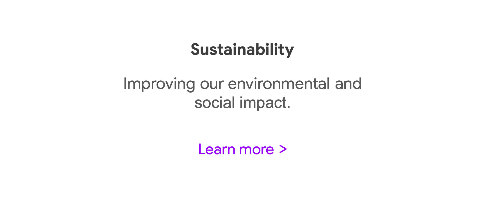

Un buen texto de enlace ayuda a las y los visitantes a navegar por tu sitio, y a Google a comprender de qué trata la página
que estás enlazando.

El texto de enlace debe ser:

Descriptivo: usa un texto de enlace que proporcione una idea básica de lo que trata la página enlazada.

    Evita los textos de enlace genéricos como “página”, “artículo” o “haz clic aquí”.

    En la mayoría de los casos, evita usar la propia URL como texto de enlace.

Conciso: el texto de enlace solo debe tener unas pocas palabras o una frase corta.

    Evita enlazar un párrafo completo o una oración larga.

Fácil de detectar: utiliza un formato que haga que tus enlaces se destaquen sobre el texto normal de tu sitio web.

    Si sólo puedes ver el enlace cuando colocas el mouse sobre él, podrías perderlo fácilmente, o incluso hacer clic de
    forma accidental.

Útil: usa texto de enlace solo cuando ayude a las y los visitantes a navegar por tu sitio para encontrar la información que
necesitan.

    Evita usar textos de enlace extensos sólo para favorecer a los motores de búsqueda.

    Evita llenar el texto de enlace con palabras clave.

**Precaución con el uso de enlaces externos** Usar enlaces que llevan a otros sitios web puede ser beneficioso, pero debes
evitar enlazar a sitios que podrían no tener buena reputación o incluir información que tu página no respalda.

Algunos/as usuarios/as pueden tratar de aprovechar los enlaces externos para el beneficio de su propio sitio web. Por
ejemplo, pueden agregar un enlace a su sitio en la sección de comentarios o los espacios para mensajes de una página
determinada. También, una aplicación agregada a un sitio, como un software de chat en vivo, podría incluir enlaces externos
no deseados.

En estos casos, puedes usar enlaces con el atributo nofollow, es decir, enlaces que cuentan con un código HTML que indica a
los motores de búsqueda que lo ignoren. Esto significa que los motores de búsqueda no asociarán tu página con el sitio
enlazado.

Si tu sitio incluye comentarios públicos o una sección de mensajes, es recomendable usar enlaces con el atributo nofollow
automáticamente para todos los comentarios y mensajes agregados por los y las usuarios/as. Este suele ser un proceso más
rápido y más eficiente que eliminar los enlaces externos uno por uno cada vez que aparecen en la sección de comentarios o
tableros de mensajes.

**Promueve tu sitio web** Una de las formas en que Google determina el ranking de un sitio web es analizando los sitios que
lo enlazan. Tanto la calidad como la cantidad de enlaces cuentan para definir el ranking de un sitio.

Crear contenido de calidad al que otras personas quieran vincularse es la mejor manera de promocionar tu sitio web y atraer
enlaces de entrada (inbound). Este es un proceso gradual que ocurre a medida que las personas descubren el contenido de un
sitio web y eligen enlazarlo desde el suyo. La promoción de tu sitio web puede facilitar este proceso para que las personas
encuentren más rápido tu contenido.

*Formas de promocionar tu sitio web* Éstas son algunas ideas para ayudarte a promocionar tu sitio web y atraer enlaces de
entrada:

    Publica entradas de blog sobre nuevos contenidos o servicios que ofrezcas.

    Comparte contenido de calidad en las redes sociales.

    Incluye artículos útiles, como guías de compra, en tu contenido de marketing por correo electrónico.

    Conéctate con otras comunidades en línea relacionadas con tu sitio, como foros o tableros de mensajes, grupos de redes
    sociales o sitios web similares al tuyo.

    Solo comparte contenido que sea interesante para tu público, en lugar de compartir todas las actualizaciones del
    contenido de tu sitio.

**Enlaces pagados** Google está en contra del uso de enlaces pagados, a menos que sean con fines publicitarios y estén
debidamente etiquetados. Comprar y vender enlaces para manipular los resultados de búsqueda no es una práctica aceptable y
puede afectar negativamente al ranking de un sitio. También puede conducir a enlaces de entrada de baja calidad, desde
sitios con reputación dudosa.

**Conclusiones principales** El uso de enlaces internos y externos ayuda a las y los visitantes a encontrar la información
que necesitan. Promocionar tu sitio web te ayudará a aumentar la calidad y cantidad de enlaces que lleven a tu sitio, lo que
podría mejorar su reputación.

#### Optimiza imágenes para un sitio web

Los motores de búsqueda usan imágenes como una forma de encontrar información en Internet de manera visual. Las imágenes
también son la forma en que las y los clientes comprenden tus productos y servicios de forma visual. ¿Recuerdas cuando
hablamos sobre las imágenes en las SERP de Google? Bueno, esas imágenes provienen en su mayoría de sitios web. Sí, es
posible lograr que las imágenes que subes a un sitio web se muestren en los resultados de Google Imágenes.

En este video, abordaremos las mejores prácticas para lograr que tus imágenes aparezcan en los resultados de Google. Verás
que estas recomendaciones son para los y las usuarios/as, no sólo para los motores de búsqueda. Cuando tus usuarios/as están
conformes, los motores de búsqueda suelen reconocerlo, y mostrarán tu sitio web, tus imágenes o tu contenido. Si bien cargar
imágenes a tu sitio web puede parecer un proceso simple, existen varios factores a considerar para que se adapten tanto al
público como a los motores de búsqueda. ¡Empecemos!

Una de las formas más efectivas de aumentar tu visibilidad en Google Imágenes es creando primero una gran experiencia de
usuario/a con imágenes en el sitio web. ¿Y cómo se logra? Primero, asegúrate de que el contenido visual es relevante al tema
de la página. Es importante mostrar imágenes que puedan aportar valor original a la página. Siempre que sea posible, coloca
imágenes de forma destacada en la página y cerca del texto más relevante. Cuando tenga sentido, considera colocar la imagen
más importante cerca de la parte superior de la página.

Para brindar una excelente experiencia a los y las usuarios/as, también asegúrate de que tus imágenes sean compatibles con
cualquier dispositivo. Esto significa que deben cargarse correctamente en computadoras, tabletas electrónicas y dispositivos
móviles. A veces, la imagen puede cambiar de tamaño en el móvil. ¿Se ve cortada? ¿Se ve de la misma forma que en tu
computadora?

Otra de las mejores prácticas con imágenes es incluir descripciones, subtítulos y nombres de archivos. Al extraer una imagen
de un sitio web para mostrarla en Google Imágenes, Google generará automáticamente un título y lo fragmentará para describir
la foto. Puedes crear un título de página descriptivo para facilitar esta acción. También debes considerar incluir
descripciones en las fotos. Esta acción ayuda a que Google entienda de qué se trata la foto. Del mismo modo, el nombre del
archivo puede darle pistas a Google sobre la temática de la imagen. Por ejemplo, “mi-nuevo-gatito-gris.jpg” es más
descriptivo que “IMG0023.jpg”.

Otra importante práctica para las imágenes es usar texto alternativo descriptivo. El texto alternativo es el texto que
describe una imagen. Mejora la accesibilidad para las personas que no pueden ver imágenes en una página web, como las y los
visitantes que usan lectores de pantalla o tienen conexiones con poco ancho de banda. Google usa texto alternativo junto con
algoritmos de visión artificial y con el contenido de las páginas para entender la temática de la imagen. Al escribir texto
alternativo, concéntrate en crear contenido útil, que contenga mucha información y que use palabras clave de manera
apropiada.

El texto alternativo también debe coincidir con contenido de la página. También debes evitar el exceso de palabras clave en
el texto alternativo. Puede provocar una mala experiencia de usuario/a y puede hacer que la Búsqueda de Google considere tu
sitio como spam.

Veamos un ejemplo de keyword stuffing en el texto alternativo para la foto de un cachorrito. El texto alternativo de keyword
stuffing se leería como “Cachorrito perro bebé cachorros perrito retriever labrador dálmata terrier comida barata para
cachorros comida para cachorros”. Un ejemplo de texto alternativo más claro sería “Perrito dálmata jugando con la pelota”.

Una cuarta recomendación es optimizar la velocidad. Las imágenes suelen ser los elementos que más incrementan el tamaño
general de las páginas, lo que puede provocar que se carguen más lento. Al cargar imágenes en un sitio web, normalmente no
debes cargar la imagen original. Se recomienda cambiar el tamaño de la imagen, a uno más apropiado para el sitio web sin
perder la calidad de la foto. Para determinar si las imágenes ralentizan la velocidad de carga de un sitio web, usa la
herramienta gratuita proporcionada por Google llamada Page Speed Insights. Esta herramienta analiza la página web y
proporciona información sobre su tiempo de carga. También ofrece sugerencias sobre cómo puedes reducir el tiempo de carga,
al mostrarte qué imágenes tardan más tiempo en cargarse.

Ahora ya sabes más sobre cómo lograr que las imágenes de un sitio web aparezcan en los resultados de Google Imágenes. Si
eres especialista en marketing digital o comercio electrónico que trabaja en un sitio web, redes sociales, publicidad en
línea, o en marketing por correo electrónico, los elementos visuales como las imágenes serán un aspecto importante de tu
trabajo. Recuerda, un poco de conocimiento sobre SEO puede tener un gran impacto. Aplica estas prácticas importantes para
incluir imágenes y asegurarte de que tu contenido se muestre en Google Imágenes y atraiga un tráfico mayor a tu sitio web.

#### Adapta tu sitio web a los dispositivos móviles

Adaptar tu sitio web a los dispositivos móviles significa hacer que pueda funcionar en un teléfono inteligente. En muchos
países, la cantidad de teléfonos inteligentes ha superado a las computadoras personales. En los Estados Unidos, por ejemplo,
el 95 % de las personas con teléfonos inteligentes los usan para buscar información. Tener un sitio web adaptado a los
dispositivos móviles es fundamental para poder tener una fuerte presencia en línea.

**¿Por qué adaptar un sitio web a los dispositivos móviles?**

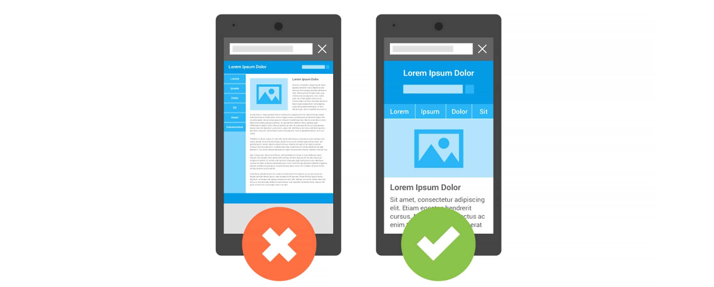

Si un sitio web no es compatible con dispositivos móviles, puede resultar difícil de ver y usar en un teléfono. Un sitio no
adaptado a dispositivos móviles hace que los y las usuarios/as deban ampliar la imagen o hacer zoom para poder leer el
contenido. Esto podría resultar frustrante y hacer que abandonen el sitio.

Cuando un sitio web es compatible con dispositivos móviles, resulta fácil de leer en un teléfono inteligente y esto
garantiza que las y los visitantes tengan una buena experiencia.

El trabajo para hacer que un sitio web se adapte a los dispositivos móviles depende de los recursos, el modelo de negocio y
la experiencia de una empresa. Muchos desarrolladores de sitios web, como Wix, adaptan el contenido automáticamente para los
dispositivos móviles. Comprueba siempre la versión móvil de tu sitio para asegurarte de que el contenido se lea bien y sea
fácil de navegar.

**Lo que debes saber al crear un sitio web adaptado a los dispositivos móviles.**

- Haz que sea fácil de usar para tus clientes.

Ten en cuenta los objetivos de tus clientes. ¿Quieren entretenerse con lo que escribes en tu blog? ¿Necesitan la dirección
de tu restaurante? ¿Quieren leer las reseñas de tus productos? Diseña tu sitio web de modo tal que sea fácil para ellos/as
hacer lo que desean.

Para ello, describe los pasos del recorrido que tus clientes quieren hacer dentro del sitio y asegúrate de que también
puedan seguir fácilmente estos pasos y llegar a lo que buscan usando un dispositivo móvil.

En el siguiente ejemplo, un/a cliente está tratando de comprar una lámpara. Primero, hace clic en un sitio web, después de
buscar una lámpara para comprar. Luego, navega a través de una selección de lámparas. Finalmente, compra la lámpara deseada.

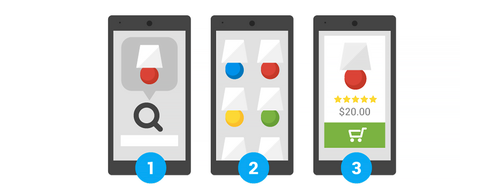

- Mide la efectividad de tu sitio web según la facilidad con que las y los clientes con dispositivos móviles pueden
  completar tareas comunes.

Haz una lista de las tareas comunes que tus clientes realizan en tu sitio web. Luego, haz que varias personas prueben hacer
esas mismas tareas. ¿Qué tan fácil fue completarlas? Concéntrate en la consistencia de tu interfaz y ofrece una experiencia
unificada en todas las plataformas.

- Utiliza un diseño web responsivo.

Un diseño web responsivo significa que el sitio web utiliza el mismo código tanto si la/el usuario está en una computadora
de escritorio, una tablet o un teléfono móvil. La pantalla se ajusta según el tamaño del dispositivo.

Google recomienda usar un diseño web responsivo en lugar de otros tipos de diseño. Uno de sus beneficios es que solo
necesitas tener una versión de tu sitio, en vez de dos (una para dispositivos móviles y otra para escritorio).

**Los 3 errores más importantes que debes evitar.**

- Olvidarte de tus clientes móviles

Recuerda que los buenos sitios móviles son útiles: ayudan a las y los visitantes a completar sus tareas. No te centres
únicamente en crear un sitio con formato móvil sin ofrecer una funcionalidad completa. Aunque un sitio con formato móvil
pueda verse bien en un teléfono inteligente, si no es tan funcional como en una computadora, puede limitar la experiencia de
las y los usuarios/as. Además, asegúrate de que el formato y la funcionalidad móvil sean inclusivos para quienes no tengan
acceso a una computadora y realicen la mayoría de sus tareas en un teléfono inteligente.

- Implementar el sitio móvil en un dominio diferente

Tener direcciones URL móviles separadas aumentará significativamente la cantidad de trabajo que tendrás que hacer para
mantener y actualizar tu sitio. También es posible que presente mayores problemas técnicos.

Puedes simplificar la administración de tu sitio web mediante el uso de un diseño web responsivo. Este diseño servirá tanto
para un sitio web de escritorio como para uno móvil con la misma dirección URL.

- Trabajar de forma aislada en lugar de buscar inspiración

Antes de comenzar a adaptar tu sitio web a los dispositivos móviles, revisa las páginas de tu competencia u otras similares
para inspirarte y encontrar la mejor forma de hacerlo. Descubre qué funciones son útiles y cuáles no en sus respectivos
sitios web.

**Prueba de optimización para móviles** La Prueba de optimización para móviles de Google utiliza GoogleBot para buscar tu
sitio web y determinar si es compatible con dispositivos móviles. Si no lo es, los resultados describirán cuáles son los
problemas que pueden afectar a tu página cuando se accede desde un teléfono inteligente. Es recomendable resolver estos
problemas en tu sitio web para que no afecte negativamente a la experiencia de tus clientes.

**Conclusiones principales** Tener un sitio web adaptado para dispositivos móviles es esencial. Un sitio web fácil de usar
en un teléfono inteligente hace que tus clientes también puedan alcanzar sus objetivos desde sus dispositivos móviles. Al
diseñar un nuevo sitio web, considera el uso de un diseño web responsivo. Este tipo de diseño es mucho más fácil de
administrar que tener un sitio web para computadoras de escritorio y otro para teléfonos inteligentes.

### Ayuda a Google (y a los y las usuarios/as) a comprender el contenido

#### Crea títulos y metadescripciones eficientes

Piensa en los resultados de la página del motor de búsqueda.

¿Qué elementos te ayudan a decidir en qué resultado hacer clic? ¿Es la URL? ¿Es el nombre que se muestra? ¿Es la descripción
de la página? ¿O es una combinación de las tres cosas? Como especialista en marketing digital, al crear una página nueva, tú
eliges el nombre de la página, o el texto de enlace que aparecerá en los resultados. También tienes un determinado control
sobre la descripción de la página.

En este video, analizaremos cómo crear títulos de páginas web efectivos y descripciones que atraigan a quienes buscan en
línea y a clientes potenciales. En general, cada página web tiene un elemento de título y la mayoría tiene una
metadescripción. El elemento de título de la página web proporciona tanto a los y las usuarios/as como a los motores de
búsqueda el tema de una página. La metadescripción proporciona un resumen del contenido de la página para los motores de
búsqueda. El título de una página puede ser de unas pocas palabras o una frase, mientras que la metadescripción puede ser de
una o dos frases, o incluso un párrafo breve.

Repasemos algunas recomendaciones para los títulos de las páginas. Al crear un título de página, debes lograr ofrecer una
descripción precisa sobre su contenido. Debe poder leerse de forma natural. Evita escribir un título que no tenga relación
con el contenido de la página. Además, evita crear un título por defecto como “Sin título” o “Nueva página 1”. Cuando un/a
usuario/a lee el título de una página y luego hace clic en el enlace, el contenido de la página web debe coincidir con el
título de la página. Si no coincide, es probable que vuelvan atrás a la página de resultados nuevamente.

Otra recomendación es asegurarse de que cada página tenga un título único. Esto ayuda al público a comprender el valor único
que brinda cada página. Por lo tanto, evita usar el mismo título en todas las páginas del sitio o en un grupo grande de
páginas. Un ejemplo de esto podría ser una empresa que usa “Servicios” como título para su página de servicios. Deberían
cambiarlo a un nombre que especifique el servicio que aborda el contenido de la página.

Una tercera recomendación es crear títulos breves pero descriptivos. Si el título es demasiado largo o se considera poco
relevante, el motor de búsqueda de Google podría mostrar solo una parte del texto en el título. Un ejemplo de un título poco
relevante incluye un exceso de palabras clave. Está bien incluir una palabra clave, pero intenta no repetir las mismas
palabras. Recuerda, el título siempre debe ser útil para los y las usuarios/as.

En general, incluso al seguir estas prácticas, Google puede mostrar textos de enlace que son diferentes al elemento de
título de una página. Esto puede suceder cuando nuestros sistemas determinan que es más valioso proporcionar otro contexto
ligeramente diferente para los y las usuarios/as, o si el elemento título en cuestión no se ajusta al espacio disponible.

Hablemos de las metadescripciones. Son importantes ya que la Búsqueda de Google podría usarlos en los resultados de tus
páginas en SERP. Ten en cuenta que decimos “podría”. Esto se debe a que la Búsqueda de Google también puede elegir usar una
sección relevante del texto de una página si coincide con la consulta de una persona en un buscador.

Estas son algunas recomendaciones para elaborar metadescripciones. Asegúrate de crear una metadescripción para cada página
del sitio web. Google mostrará un fragmento (snippet) de la metadescripción o de la página web en los resultados de
búsqueda. Escribir una metadescripción clara puede influir en el fragmento de la página que se muestra en los resultados de
búsqueda.

Una segunda recomendación al escribir una metadescripción es que debe resumir con precisión el contenido de la página.
Escribe una descripción que resulte informativa e interesante para el público cuando vean tu metadescripción en un resultado
de búsqueda. Ahora bien, no hay una longitud mínima o máxima para una metadescripción. Asegúrate de que contenga únicamente
la información relevante que necesitaría un/a usuario/a para determinar si la página le resultará útil.

Una tercera recomendación es usar descripciones únicas para cada página. Tener una descripción diferente para cada página
ayuda a las y los visitantes y a Google. Por ejemplo, si los resultados de búsqueda muestran varias páginas del mismo sitio
web.

Si trabajas para una empresa de comercio electrónico con miles de páginas web, escribir metadescripciones para cada página
tal vez no sea lo ideal. En este caso, podrías generar descripciones automáticas que se basen en el contenido de cada
página. Esta es una técnica más avanzada. Sin embargo, recuerda que en un sitio web grande, no todas las descripciones de
página se deben escribir de forma manual.

Ahora ya sabes lo importantes que son los títulos de las páginas y las metadescripciones para los motores de búsqueda y los
y las usuarios/as. Los ayudan a comprender mejor de qué se trata la página, y buscan que las personas hagan clic en el
enlace de la página. Si creas una página web con un contenido excelente, pero el título no refleja el tema de la página,
podría frustrar a quienes buscan en línea. Esta frustración se puede reflejar en las métricas, y la Búsqueda de Google
podría mostrar otros títulos de enlace en las SERP. Redacta siempre títulos efectivos, además de un excelente contenido de
página.

#### Controla los enlaces de título y fragmentos destacados (snippet)

Cuando ingresas una consulta en un motor de búsqueda, te encontrarás con una multitud de resultados a lo largo de muchas
páginas de resultados de motores de búsqueda (SERP). La mayoría de los motores de búsqueda tienen una estructura de
resultados similar. Los resultados generalmente contienen un enlace de título en negrita (el título del resultado de
búsqueda, que está enlazado con una página web) sobre un fragmento destacado o snippet (la descripción o la parte resumida
del resultado de búsqueda).

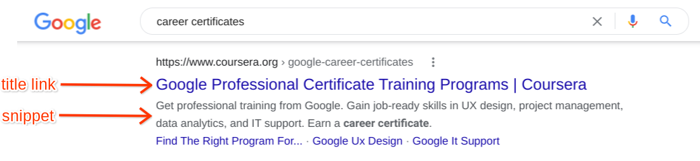

Como ya has  aprendido anteriormente, Google genera de forma automática estos resultados en función del elemento de título
de una página web y de su metadescripción o del texto que identifique con mayor relevancia dentro del contenido visible de
la página. Recuerda que el elemento de título de una página web proporciona al usuario/a y al motor de búsqueda el tema de
la página. Una metadescripción proporciona a los motores de búsqueda un resumen sobre lo que la página trata.

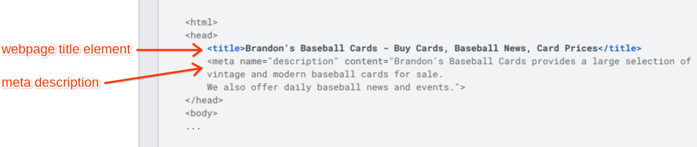

A continuación podrás ver algunas de las mejores prácticas para influir en los enlaces de título y fragmentos destacados,
que te ayudarán a captar a tu audiencia deseada.

**Influye en tus enlaces de título** Los enlaces de título proporcionan a los y las usuarios/as información rápida sobre el
contenido de un resultado de búsqueda y explican por qué éste es relevante para su consulta. Suelen ser la principal pieza
de información que las personas usan para decidir en qué resultado hacer clic.

Google genera enlaces de título tanto del contenido de una página web como de las veces que se hace referencia al sitio. Si
bien Google determina automáticamente estos enlaces de título, puedes influir en ellos y aumentar su efectividad de las
siguientes maneras:

*Lo que sí debes hacer:*

    Describir con precisión el contenido de cada página en los elementos de título. 

    Redactar títulos descriptivos pero concisos.

    Revisar que los títulos se lean de forma natural.

    Crear títulos únicos para cada página.

    Darle al título principal de cada página una mayor importancia y peso visual

*Lo que no debes hacer:*

    Usar textos en los elementos de título que no tengan relación con el contenido de la página.

    Usar textos predeterminados o genéricos en tus títulos, como “Inicio”, “Sin título” o “Nueva página 1”.

    Usar un único título en todos los elementos de título de las páginas de tu sitio.

    Crear títulos demasiado extensos o confusos.

    Usar texto repetido o reiterativo en tus títulos.

    Incluir palabras clave innecesarias o excesivas en tus títulos.

**Controla tus fragmentos destacados (snippet) creando metadescripciones de calidad** Google a veces utiliza la
metadescripción de una página web para generar un fragmento destacado o snippet en los resultados de búsqueda. Una
metadescripción informa y atrae a los y las usuarios/as con un resumen breve y relevante de lo que trata una página en
particular. Puede ayudar a convencer a quienes realicen las búsquedas de que la página es exactamente lo que están buscando.
Sigue estos consejos para escribir metadescripciones efectivas:

*Lo que sí debes hacer:*

    Resumir con precisión el contenido de la página.

    Incluir toda la información que los y las usuarios/as necesitan para determinar si la página les resultará útil y relevante.

    Crear descripciones únicas para cada página de tu sitio.

*Lo que no debes hacer:*

    Escribir una metadescripción que no tenga relación con el contenido de la página.

    Usar descripciones genéricas como “Esta es una página web” o “Página sobre ropa de mujer”.

    Completar la descripción con demasiadas palabras clave.

    Copiar todo el contenido de la página web y pegarlo en la etiqueta de metadescripción.

    Utilizar una única metadescripción en todas las páginas de tu sitio.

**Conclusiones principales** Los enlaces y fragmentos de título eficientes pueden incentivar a las personas a hacer clic en
tu página web. Si aplicas todo lo aprendido y creas los elementos de título y metadescripciones de la página web a
conciencia, podrás hacer que tu marca se destaque del resto.

#### Actividad de ejemplo: Optimiza los títulos y metadescripciones de una página web

Compara este ejemplo con tus títulos completos y metadescripciones. Revisa tu trabajo utilizando cada uno de los criterios
del ejemplo. ¿Qué cosas hiciste bien y en qué aspectos podrías mejorar? Estas respuestas te servirán de guía a medida que
avances en el curso.

Nota: el ejemplo representa dos títulos de páginas web y dos metadescripciones posibles. Es probable que los tuyos difieran
en algunos aspectos. Lo importante es que tus títulos y metadescripciones reflejen con precisión la URL y el contenido de la
página.

Ahora revisemos el título y la metadescripción de cada página:

**Página 1 – Quesos** Título: Quesos | Founders ’Dairy – Alimentos especiales de calidad premium

El título refleja con precisión la URL y el contenido de la página (quesos). También menciona el nombre completo del negocio
y describe su producto principal (“alimentos especiales de calidad premium”).

metadescripción: Quesos artesanales hechos con técnicas tradicionales. Compra nuestras mozzarellas, quesos suizos y cheddars
ahumados más vendidos.

La metadescripción fluye naturalmente y refleja el contenido de la página: quesos artesanales de Founders, incluido su
cheddar ahumado.

**Página 2 – Recetas** Título: Recetas familiares | Founders ’Dairy – Alimentos especiales de calidad premium

El título refleja con precisión la URL y el contenido de la página (recetas). También menciona el nombre completo del
negocio y describe su producto principal (“alimentos especiales de calidad premium”).

metadescripción: Recetas tradicionales de nuestra familia a la tuya. Prueba los macarrones con queso caseros hechos con
nuestro cheddar artesanal.

La metadescripción fluye naturalmente y refleja el contenido de la página: recetas de la familia Founders que utilizan sus
propios productos.

#### Crea el marcado de datos estructurados

#### Establece los detalles de tu negocio en Google

El panel de conocimiento de Google es una función de las páginas de resultados del motor de búsqueda de Google (SERP) que
muestra información de marcas y negocios en una sección separada de los resultados de búsqueda generales. Esta lectura
describe los paneles de conocimiento e indica los pasos que debes seguir para configurar los detalles de tu negocio en
Google.

El panel de conocimiento de Google Los paneles de conocimiento son cuadros de información que aparecen en Google cuando
buscas entidades como personas, lugares, organizaciones o cosas. Puedes comparar el panel de conocimiento con la tarjeta de
identificación personal de un individuo. Igual que una identificación, el panel de conocimiento reúne la información
esencial y oficial sobre un negocio o marca. Los paneles de conocimiento se generan automáticamente, y la información que
contienen proviene de varias fuentes distintas en línea.

Este ejemplo muestra los detalles del panel de conocimiento de Coursera en Google.

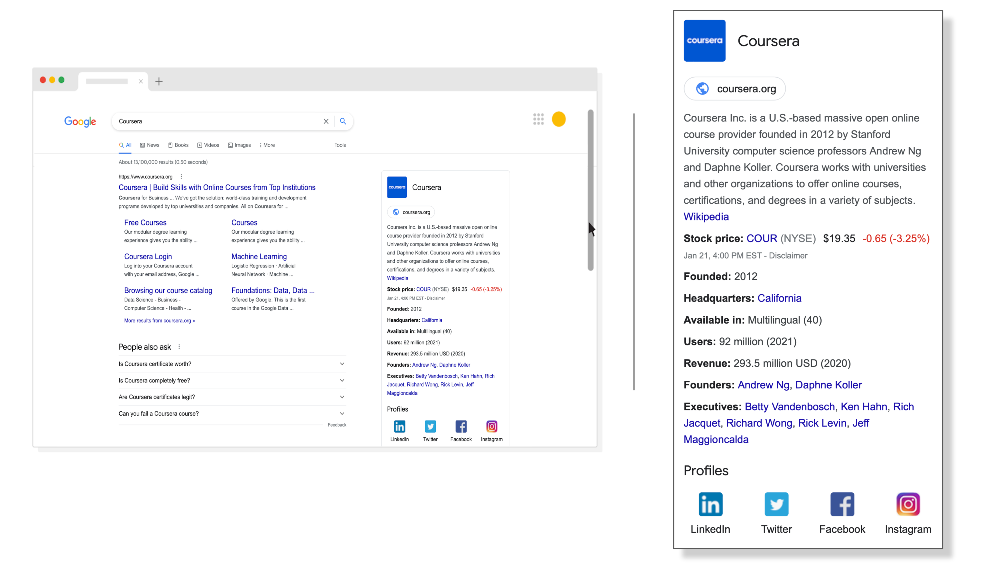

Como se observa en la imagen, los detalles del negocio pueden incluir:

    Enlace al sitio web oficial

    Logotipo del sitio

    Industria de la marca

    Descripción de la marca

    Enlaces de los perfiles en redes sociales

Incluir esta información hace que quienes quieran identificar el sitio oficial de una marca encuentren la información exacta
más fácilmente.

**Configura los detalles de un negocio en Google** Estos son los pasos que debes seguir para configurar los detalles
comerciales de una marca en los paneles de conocimiento de Google.

*Paso 1: Crea un Perfil de Negocio en Google.* Para quienes están a cargo de negocios físicos, como un restaurante o un
comercio minorista, el primer paso para establecer los detalles comerciales es crear un Perfil de Negocio en Google.

Perfil de Negocio en Google: una herramienta gratuita que permite a los negocios locales configurar la forma en que aparece
su información en la Búsqueda de Google y en Google Maps. Las y los propietarios pueden publicar su horario de atención, sus
productos y servicios, aceptar pedidos en línea y más. Puedes crear y administrar un perfil de negocio directamente desde
Google Maps  o la Búsqueda de Google .

*Paso 2: Verifica la propiedad del sitio web.* El siguiente paso es verificar la propiedad del sitio web en Google Search
Console . Search Console es una poderosa herramienta de Google que te ayuda a comprender mejor el rendimiento de tu sitio
web y te permite optimizar su visibilidad, entre otras cosas.

Verificar tu sitio web a través de Search Console es importante porque garantiza que tengas control sobre cómo se presenta
tu sitio web en Google y puedas acceder a datos sensibles de la Búsqueda de Google para tu sitio.

*Paso 3: Actualiza el panel de conocimiento de Google del sitio web.* Una vez que te verifiques como representante oficial,
puedes iniciar sesión en la cuenta de Gmail asociada con la entidad que representas y actualizar la información de tu panel
de conocimiento de Google.

Cuando actualizas estos detalles, se anula la información que los algoritmos de Google habían encontrado e ingresado por ti
de forma automática previamente.

*Paso 4: Agrega datos estructurados para obtener resultados enriquecidos.* Los resultados enriquecidos son los resultados de
búsqueda de Google que van más allá del enlace azul habitual. Pueden incluir carruseles, imágenes u otros elementos no
textuales. Como especialista en marketing digital, querrás asegurarte de que tu sitio web pueda obtener resultados
enriquecidos, ya que eso ayudará a que tu negocio se destaque.

Para ayudar a que tu negocio obtenga resultados enriquecidos, debes agregar datos estructurados. Los datos estructurados
tienen un formato estandarizado para proporcionar información sobre una página y poder clasificar su contenido. Cabe
recordar que añadir datos estructurados no te garantizará que se agreguen automáticamente los resultados enriquecidos a la
página de resultados de búsqueda de tu negocio.

Puedes obtener más información sobre la creación de datos estructurados leyendo el documento Comprende cómo funcionan los
datos estructurados en el sitio web del Centro de la Búsqueda de Google.

Una vez que hayas agregado datos estructurados, puedes verificar si funcionan ingresando la URL de tu sitio web en la página
“Prueba de resultados enriquecidos” de Google .

*Paso 5: Destaca los métodos de atención al cliente.* Asegúrate de incluir alternativas para que quienes visiten tu sitio
web puedan acceder a información útil de atención al cliente o comunicarse contigo a fin de satisfacer sus necesidades.
Estas alternativas podrían incluir tu número de contacto y dirección de correo electrónico, entre otras.

**Conclusiones principales** Mostrar información precisa sobre tu negocio te ayudará a ser reconocido/a rápidamente por
quienes utilicen los motores de búsqueda. Si logras hacerte ver, podrás dirigir a tu audiencia hacia tu sitio web para que
eventualmente realicen una compra, o completen otras acciones deseadas.

### Analiza el rendimiento de los resultados de la búsqueda y el comportamiento de los y las usuarios/as

#### Introducción a Google Search Console

Al trabajar en la optimización de motores de búsqueda para un sitio web, existe una herramienta gratuita que te ayudará a
comprender mejor cómo se posiciona el sitio web en la Búsqueda de Google. La herramienta se llama Google Search Console.
Search Console proporciona información sobre una variedad de métricas e informes sobre tu sitio web. Por ejemplo, puedes
consultar cuántas personas visitan el sitio web mediante la Búsqueda en Google, o puedes confirmar si Google está rastreando
tus páginas web. También puedes saber si el sitio presenta errores técnicos.

En este video, abordaremos cómo empezar a usar Google Search Console, y cómo un/a especialista en marketing digital
principiante puede usar esta herramienta. Para algunos de los siguientes videos y ejemplos de capturas de pantalla, hemos
usado una empresa llamada Happy Clothes. Es una empresa ficticia que usamos para probar herramientas de SEO y SEM.

Existen muchas funciones en Search Console. Algunas son más avanzadas que otras. Analicemos los primeros pasos que debería
seguir un/a principiante. Primero, debes agregar y verificar la propiedad del sitio web. La verificación es un proceso que
consiste en demostrar que el sitio web te pertenece. Y una vez que termines de verificar el sitio, Search Console comenzará
a recopilar datos, y obtendrás el acceso completo a la herramienta.

Luego de unos días, cuando la herramienta Search Console recopile suficientes datos del sitio web, el segundo paso que debes
seguir es asegurarte de que Google pueda encontrar y leer tus páginas. El informe de cobertura de indexación proporciona un
resumen general de todas las páginas de tu sitio web que Google indexó o intentó indexar. Repasa la lista disponible e
intenta corregir los errores y advertencias que haya.

Para el tercer paso, debes revisar otro informe llamado “Usabilidad móvil”. Este informe muestra los problemas que podrían
afectar a la experiencia de quienes navegan por el sitio desde un dispositivo móvil. El informe incluye información sobre
temas específicos, una lista de las páginas afectadas, y cómo solucionar cada problema.

El siguiente paso a considerar es enviar un sitemap a Search Console. Un sitemap es un archivo que proporciona información
sobre las páginas, videos y otros archivos en el sitio, y cómo se relacionan estos elementos. Los motores de búsqueda como
Google leen este archivo para rastrear el sitio de manera más eficiente.

No es necesario que tengas un sitemap ya que es probable que Google rastree tu sitio web de todas formas. Sin embargo, es
una buena práctica enviar el sitemap para mejorar el rastreo, especialmente si tu sitio web contiene más de 500 páginas.
También debes incluir un sitemap en caso de que Google tenga dificultades para rastrear tu sitio y no pueda encontrar las
páginas importantes.

Enviar un sitemap es una tarea de SEO bastante técnica. Sin embargo, muchas plataformas web, como WordPress, Wix, o Blogger
generan sitemaps automáticamente, disponibles para los motores de búsqueda. No hace falta que hagas nada. Si tu sitio web
está en una plataforma, confirma que lo estén haciendo por ti.

El quinto paso es monitorear el rendimiento de tu sitio. El informe “Rendimiento en los resultados de la búsqueda” muestra
el volumen de tráfico que recibes de la Búsqueda de Google. El informe desglosa el tráfico por consultas, páginas y países.
Para cada uno de estos puntos, puedes obtener tendencias sobre las impresiones, clics y otras métricas. Analizaremos los
informes de Search Console más adelante en este curso.

Analicemos el uso general de la herramienta Search Console como especialistas en marketing digital. El uso diario debería
ser mínimo. Recibirás un correo electrónico cuando ocurra algo inusual, como por ejemplo si el sitio web es hackeado o si
Google encuentra algún problema para rastrear tu sitio. Aproximadamente una vez al mes, consulta el panel de control de
Search Console. Comprueba rápidamente el estado de tu sitio web. Comprueba que no haya ningún error en el sitio. Además,
verifica que no haya bajas inusuales en la cantidad de clics. También debes consultar la herramienta Search Console cada vez
que añadas contenido nuevo a los sitios web. Si es necesario, envía un sitemap nuevo con el contenido agregado
recientemente. Unas horas después de agregar páginas nuevas, confirma que el número de las páginas indexadas esté
aumentando. Si estás trabajando en el contenido del sitio web, revisa las métricas y los informes de Search Console para
garantizar que el sitio web esté funcionando correctamente. De lo contrario, podría afectar el rendimiento de tu contenido.

¡Buen trabajo! ¡Realmente has aprendido mucho! Espero que sientas más confianza respecto a tu conocimiento sobre SEO y
Search Console.

#### Informes y métricas de Google Search Console

Unas de las funciones más beneficiosas de Google Search Console son sus informes y métricas. En este video, analizaremos
algunos informes populares que debes tener en cuenta. También veremos los términos y características de esos informes.

Empecemos con la página Descripción general. Esta es la página que verás después de iniciar sesión en la herramienta Search
Console. Si bien no es un informe, es una página importante de entender. La página Descripción general muestra un resumen de
la solidez de tu sitio, incluyendo problemas de seguridad, gráficos de métricas, y resúmenes de mejoras para el sitio, como
los datos estructurados. Debes consultar esta página periódicamente para garantizar que no haya problemas de seguridad o
errores que se deban corregir. Además, puedes confirmar que no haya una disminución del número de clics en el sitio web. Si
encuentras algún problema, debes investigar la causa.

El informe de Rendimiento en los resultados de búsqueda se centra en varias métricas relacionadas con el SEO. Veamos
rápidamente algunas de estas métricas. Las impresiones se refieren a cuántas veces alguien ha visto tu sitio con la
herramienta de Búsqueda de Google. Los clics son cuántas veces una persona que hace una búsqueda hizo clic en los resultados
de tu sitio web en las SERP. La tasa de clics es el porcentaje de personas que vieron tu anuncio e hicieron clic en él. La
posición media te indica en qué lugar se clasifica tu sitio en los resultados de la búsqueda. La posición uno es la posición
superior. Como puedes ver, todas estas métricas están conectadas. Por ejemplo, si tu sitio web recibe muchas impresiones
pero su posición promedio en las SERP es baja, es probable que no reciba muchos clics. Si el sitio web no está recibiendo
muchos clics, entonces su tasa de clics también será baja.

Otro informe a analizar es el informe “Enlaces”. Allí se muestra qué sitios web contienen enlaces al tuyo, cuál es el texto
de enlace y cuáles son tus páginas más enlazadas. Usa este informe para comprender mejor qué páginas web reciben la mayor
cantidad de enlaces de otros sitios web. Pregúntate, ¿por qué esta página recibe más enlaces que otras páginas? Además,
puedes usar el informe “Enlaces” para determinar si un sitio web se vincula con sitios útiles o sospechosos. Si se vincula a
sitios sospechosos, generalmente puedes ignorarlos.

El informe de cobertura muestra el estado del indexación de todas las páginas de tu sitio. Las páginas se agrupan en función
de si se pueden indexar o no. También se incluye una descripción de por qué las páginas se pueden indexar o no. Usa este
informe para analizar periódicamente los picos de errores o caídas en los recuentos de indexaciones para identificar
problemas de rastreo en tu sitio web.

Otro informe a analizar es el de “Acciones manuales”. Una acción manual es una forma que tiene Google de restringir o
eliminar páginas web que no cumplen con las Directrices de calidad para webmasters. Por lo general, las acciones manuales se
aplican a sitios web o páginas que intentaron manipular el índice de búsqueda. Un ejemplo de por qué se aplica una acción
manual a un sitio web es si se realizó la práctica de keyword stuffing. Si sigues la guía de calidad de Google, es probable
que a tu sitio web no se le aplique ninguna acción manual. Aún así, es importante consultar el informe de Search Console
para asegurarse.

El informe “Problemas de seguridad” muestra los indicios de que tu sitio fue hackeado o el comportamiento en tu sitio que
podría dañar a tus visitantes o a sus computadoras. Un ejemplo puede ser la instalación de un software no deseado en la
computadora de un/a visitante. Si ves un problema de seguridad en este informe, Google proporcionará los detalles del
problema y cómo solucionarlo.

Si bien hay otros informes en la herramienta Search Console, estos son algunos de los más populares e importantes. Como
principiante en el marketing digital, usarás estos informes para entender mejor cómo se desempeña una página web en la
Búsqueda de Google. También los usarás para identificar cualquier problema importante que tengas en tu sitio web, como por
ejemplo, si fue hackeado o si las páginas no están siendo indexadas. Google Search Console es una herramienta muy útil para
aprender e implementar estrategias de SEO.

¡Buen trabajo!

#### Aprende más sobre Google Search Console

Google Search Console es una herramienta gratuita que permite a las personas obtener información útil sobre el sitio web de
un negocio. La herramienta permite a los y las usuarios/as monitorear su sitio y dar respuesta a sus necesidades, lo que
aumenta el rendimiento general de la página y hace que los y las visitantes disfruten más de pasar tiempo allí.

Google Search Console tiene muchas funciones. Puedes ver un informe estadístico de tu sitio, realizar mejoras en HTML,
configurar sitemaps y muchas cosas más. Search Console te brinda control total sobre tu sitio web.

Si quieres obtener más información sobre Google Search Console, mira los siguientes videos. Centro de Búsqueda de Google:
Capacitación sobre Google Search Console

#### Más herramientas e informes en Google Search Console

Tal como se explica en uno de los videos, Google Search Console es una herramienta que te ayuda a comprender mejor el
rendimiento de tu sitio web. Te ayuda a administrar la presencia de tu sitio web en los motores de búsqueda y facilita que
más personas lo encuentren. Ahora descubrirás algunas de las herramientas e informes disponibles en Google Search Console.

**Informe “Sitemaps”** El informe “Sitemaps” de Google Search Console te permite enviar o actualizar tu sitemap (archivo que
proporciona información sobre las páginas, videos y otros archivos de un sitio, y cómo se relacionan entre ellos).

Un sitemap ayuda a Google a encontrar las páginas más importantes de tu sitio web que deseas que aparezcan en los resultados
de búsqueda. También ayuda a Google a comprender la relación entre las páginas de tu sitio.

Es posible que no necesites enviar un sitemap si tu sitio es pequeño y ya fue rastreado por Google. Sin embargo, enviar un
sitemap puede ayudar a Google a mejorar la forma en que rastrea tu sitio web, especialmente si es más grande o incluye más
de 500 páginas.

Algunas plataformas de sitios web, como WordPress, Wix y Blogger, crean automáticamente un sitemap para ti y lo ponen a
disposición de los motores de búsqueda. En esos casos, no es necesario enviarlo. Si la plataforma de tu sitio web no crea y
envía automáticamente un sitemap, puedes usar el informe “Sitemaps” en Google Search Console para hacerlo.

El informe “Sitemaps”, por su parte, te permite averiguar qué sitemaps se han enviado para tu sitio web, acceder a sus
estadísticas y monitorear cualquier error que Google pueda haber encontrado al procesar tus sitemaps.

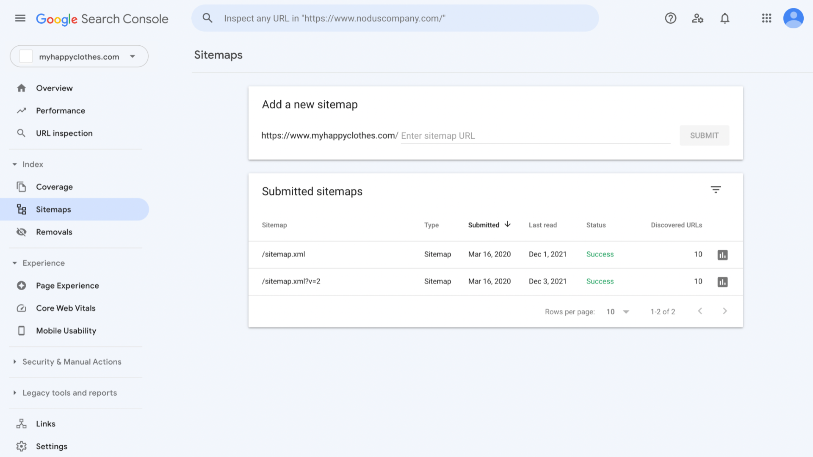

**Herramienta de inspección de URLs** Otra función que ofrece Google Search Console es la herramienta de inspección de URLs,
que proporciona información detallada de rastreo, indexación y servicio sobre tus páginas, directamente desde el índice de
Google. Te permite acceder a la información que tiene el índice de Google sobre una URL específica de tu propiedad. Te
permite, además, probar una página en tiempo real en tu sitio web.

La herramienta de inspección de URL detecta errores en la página, como errores de código HTML o JavaScript. También revela
otra información técnica. Esta herramienta es útil para solucionar cualquier error de rastreo que Google haya encontrado en
tu sitio. También es útil para corregir y volver a probar una página con errores.

**Cambio de dirección** Si trasladas tu sitio web de un dominio a otro, deberás informar a Google mediante la herramienta de
cambio de dirección. Por ejemplo, si la dirección de tu sitio web es example.com y decides cambiarla a example.org, debes
usar esta herramienta para informar a Google sobre la modificación. Al hacer esto, Google podrá migrar los resultados de
Búsqueda de tu antiguo sitio web al nuevo.

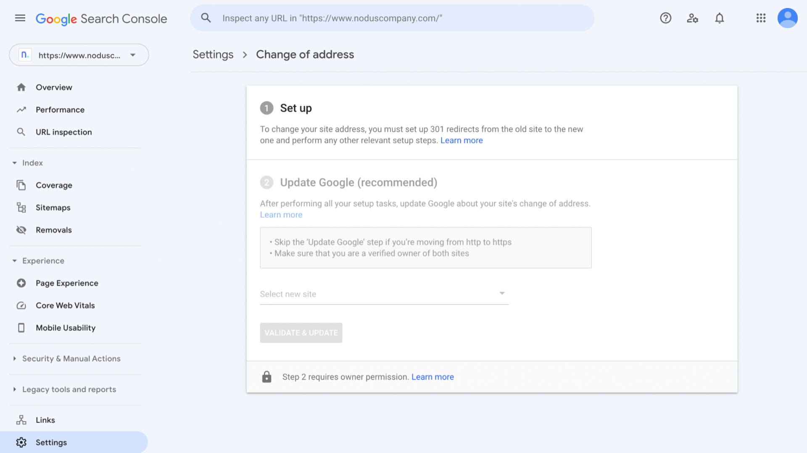

**Herramienta de retirada** En algunos casos, es posible que desees evitar que una página web de tu sitio aparezca en la
Búsqueda de Google. Una solución temporal es usar la herramienta de retirada, que te permite bloquear temporalmente ciertas
páginas de los resultados de la Búsqueda de Google y gestionar el filtro de Búsqueda Segura (Safe Search).

Sin embargo, el bloqueo temporal solo durará unos 6 meses. Para eliminar permanentemente la página de los resultados de la
Búsqueda de Google, deberás realizar una de las siguientes acciones:

    Retirar o actualizar el contenido de tu página.

    Bloquear el acceso al contenido solicitando una contraseña o usando otro método para restringir el acceso.

    Agregar un código a la página que le indique a los motores de búsqueda que no se debe indexar (este método es menos
    seguro que los otros).

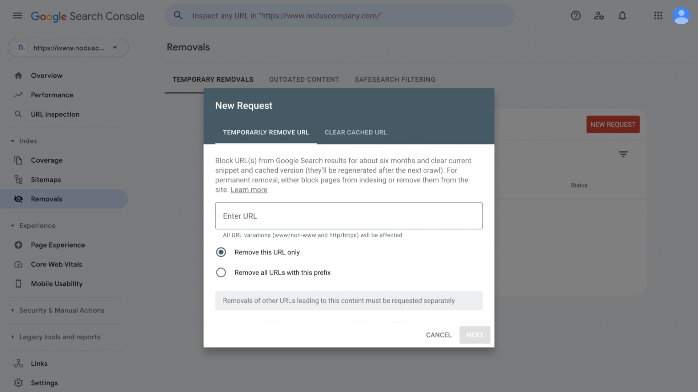

**Conclusiones principales** Google Search Console proporciona herramientas que te ayudan a monitorear y administrar el
rendimiento de tu sitio web. El uso de estas herramientas puede hacer que más personas encuentren tu sitio web.

#### Bing Webmaster Tools

En una lectura anterior, aprendiste sobre Google Search Console y las herramientas que ofrece. Ahora es el momento de
conocer un recurso alternativo llamado Bing Webmaster Tools. A continuación, aprenderás qué es, qué funciones tiene y cómo
usarlo.

**¿Qué es Bing Webmasters Tools?** Bing Webmaster Tools (o Bing WMT) es un servicio gratuito desarrollado por el motor de
búsqueda Bing de Microsoft, que permite a quienes trabajan en marketing digital y en desarrollo de sitios web agregar sus
páginas al rastreo e indexación de Bing para ver el rendimiento de su sitio. Básicamente, Bing Webmaster Tools es para el
motor de búsqueda de Bing, lo mismo que Google Search Console es para la Búsqueda de Google.

**¿Por qué usar Bing Webmaster Tools?** Es importante que las y los especialistas en marketing digital se mantengan
informados/as sobre otros motores de búsqueda y los recursos que ofrecen. Si bien Google y Google Search Console son
increíblemente populares, quienes trabajan en marketing digital también deben prestarle atención a otras oportunidades
adicionales para promocionar sus marcas. Bing es un claro ejemplo de esto, ya que cuenta con más de mil millones de visitas
cada mes. El uso de Bing Webmaster Tools para comercializar en Bing podría generar aún más tráfico a tu sitio web.

**¿Qué funciones ofrece Bing Webmaster Tools?** Bing Webmaster Tools ayuda a los usuarios/as a monitorear el rendimiento de
sus sitios web, mejorar la visibilidad de SEO e identificar de qué forma las y los clientes encuentran sus sitios.

Bing Webmaster Tools ofrece funciones similares a las de Google Search Console, que ya fueron explicadas más atrás en el
curso, como la verificación del sitio, el control de rastreo, los informes de sitemaps, la herramienta de inspección de
URLs, la herramienta de cambio de dirección y la herramienta de retirada.

Bing Webmaster Tools también ofrece otras funciones, que incluyen:

    Enlaces entrantes (backlinks): sus usuarios/as pueden acceder y analizar datos sobre sus páginas de referencia, dominios
    y textos de enlace.

    Investigación de palabras clave: sus usuarios/as pueden comprobar qué frases y palabras clave están siendo consultadas
    en los buscadores y sus volúmenes de búsqueda.

    Informe SEO: esta función recopila todos los errores encontrados en el sitio web.

    Site Scan: esta herramienta de auditoría de sitios bajo demanda rastrea una página y comprueba si tiene problemas técnicos
    comunes de SEO.

**Conclusiones principales** Explorar herramientas y recursos adicionales fuera de la comunidad de Google es fundamental
para convertirse en un/a especialista en marketing digital completo. Bing Webmaster Tools es un recurso para promocionar tu
marca con éxito en Bing. Al igual que con Google Search Console, el uso de Bing Webmaster Tools puede atraer a más personas
a tu sitio web.

#### Dave: Mi trayectoria profesional en SEO y SEM

Hola, mi nombre es Dave, soy especialista en compras y responsable de ayudar a los comercios minoristas a promocionar sus
productos en Google. Lo mejor de mi trabajo es ser un asesor de confianza para los minoristas con los que trabajamos. Me
gusta brindarles soluciones para ayudarlos a maximizar sus inversiones en las propiedades de Google.

Al terminar la secundaria, me uní al Cuerpo de Marines de los Estados Unidos. Estuve dos años en Tradepoint, en Carolina del
Norte. Estuve dos años en Londres, Inglaterra. Las habilidades que adquirí en el Cuerpo de Marines las pude implementar en
mi carrera profesional. Una de las primeras cosas que adquieres en el campamento es esta tarjeta. Se trata de una tarjeta de
honor, coraje y compromiso. Cada infante de marina lo recibe como un pilar de cómo deberías vivir la vida. El honor se
refiere a la integridad, responsabilidad y transparencia. El coraje se refiere a hacer lo correcto, de la manera correcta y
por las razones correctas. Dejé el Cuerpo de Marines en el año 2002 y desde entonces llevo esta tarjeta conmigo. Esto lo
traslado a mi trabajo actual al tratar de aplicar estos valores en todas las decisiones que tomo para mis clientes
minoristas.

Aprendí sobre comercio electrónico y marketing digital principalmente en Internet, al estudiar tácticas para atraer más
tráfico a los sitios web, ya sea de forma orgánica o de pago. Empecé a jugar al golf en la universidad, y me encantó. Quería
encontrar una forma de poder practicarlo más sin gastar mucho dinero. Y se me ocurrió que escribir sobre golf podría ser una
forma interesante, ya que hay mucho para leer al respecto. Está el Tour de Profesionales, las reseñas de los campos de golf,
los productos, aparatos y artilugios. Aprendí sobre marketing digital, SEO y SEM a través de blogs. En cierto punto,
empezamos a hacer publicidad, a vender productos mediante el marketing de afiliación. Una excelente manera de atraer tráfico
de buena calidad al sitio fue a través del programa Google Ads.

Mis palabras de aliento para quienes se sumergen en tanto contenido, es que hay una razón por la que estás aquí. Hay una
razón por la que haces esto ahora. Sigue hasta el final, porque estoy seguro que del otro lado, una vez que tengas el
certificado, se te abrirán oportunidades que no tenías cuando empezaste.

### Revisión: Aplica la optimización de motores de búsqueda (SEO)

#### Términos y definiciones del curso 2, semana 3

Acción manual: la forma en que Google penaliza o elimina sitios web que no cumplen con sus pautas de calidad.

Datos estructurados: código utilizado para describir mejor el contenido de una página web a los motores de búsqueda.

Elemento de título de la página web: texto que proporciona tanto a las o los usuarios como a los motores de búsqueda el tema de una página.

Enlace entrante (backlink): enlace que apunta a un sitio web desde otro sitio.

Enlace externo (external link): enlace en un sitio web que dirige a contenido en otros sitios.

Enlace interno: enlace en un sitio web que dirige a otras páginas en el sitio.

Enlace nofollow: enlace que presenta un código HTML que indica a los motores de búsqueda que lo ignoren.

Google Search Console: herramienta que ayuda a las y los usuarios/as a comprender mejor cómo funciona un sitio web en la búsqueda de Google.

Metadescripción: texto que proporciona a los motores de búsqueda un resumen de lo que trata la página.

Schema (esquema): tipo de código utilizado para marcar datos estructurados.

Sitemap: archivo que proporciona información sobre las páginas, videos y otros archivos en un sitio web, así como las relaciones entre ellos.

Texto alternativo: breve descripción escrita de una imagen con el propósito principal de ayudar a las personas con discapacidad visual.

Texto del enlace: texto visible en un hipervínculo.

## Marketing de motores de búsqueda (SEM) y publicidad gráfica

### Comprende el marketing de motores de búsqueda (SEM)

#### Te damos la bienvenida a la semana 4 curso 2

Te damos la bienvenida a la sección sobre cómo entender y aplicar marketing en buscadores y publicidad de display. En esta
sección, aprenderás sobre publicidad pagada en línea. En concreto, anuncios en los motores de búsqueda, sitios web y apps.

Te enseñaré cómo publicitar en los resultados del buscador de Google cuando alguien hace una búsqueda de un producto o
servicio. También, aprenderás cómo publicitar en otros sitios web con la red de display. Como marketer o analista de
e-commerce, es probable que uses publicidad en línea. Es una función común en esos roles y una habilidad importante para
tener.

Empezaré esta sección con el marketing de motores de búsqueda (SEM) y por qué un/a marketer debería aplicarlo. Los anuncios
de SEM se muestran cuando alguien consulta en el buscador. Luego, aprenderás sobre anuncios pagados en el buscador de Google
usando la plataforma de Google Ads. Obtendrás una visión general de los formatos más comunes de Google Ads. Y te enseñaré
sobre el proceso para crear un anuncio en Google Ads.

Aprenderás a crear la campaña, estrategias de puja y segmentación del público. También, cubriré los tipos de concordancia en
las palabras clave. Más tarde, te presentaré la subasta de anuncios, que determina dónde aparece un anuncio en los
resultados de búsqueda y cuánto pagarás si un usuario hace clic en él. Este es un proceso importante que sucede en cada
búsqueda con un anuncio de Google. Terminaremos esta sección con detalles sobre cómo crear un buen anuncio.

Finalmente, hablaremos de publicidad de display. Estos son anuncios en imágenes, que se muestran en sitios de toda la web.
Profundizaré en un tipo concreto de anuncios de display llamado anuncios de display responsivos. Hablaremos de las mejores
prácticas y cómo crear uno.

Anteriormente, conté mi experiencia con el SEO y cómo esto me ayudó a ampliar el alcance de mi marca. Años más tarde, lancé
una nueva empresa. Necesitaba una estrategia más rápida que el SEO para poner mi empresa en los resultados de búsqueda. Y
entonces los anuncios de SEM llegaron al rescate. Para mí fue un gran cambio porque, en menos de 24 horas, mi empresa estaba
en la cima de los resultados de búsqueda. Los anuncios de búsqueda me permitieron estar frente a mi público objetivo en el
momento exacto en que buscaban las soluciones que ofrecemos.

Me entusiasma enseñarte más sobre publicidad pagada en línea. ¿Quieres empezar? Genial. Entonces nos vemos en el próximo
video.

#### Comprende los beneficios del SEM

Hay dos formas de encontrar un negocio en las páginas de resultados: listados de búsqueda y anuncios pagados. La parte
pagada de una clasificación en las páginas de búsqueda se llama marketing de motores de búsqueda (SEM). Consiste en aumentar
la visibilidad de un producto o servicio en una página de resultados de un buscador mediante publicidad pagada. Como
especialista en marketing digital o analista de comercio electrónico, deberás configurar tus anuncios basados en el SEM. O
deberás revisar el rendimiento de tus anuncios para mejorar los anuncios existentes.

Si usas SEM, cuando un/a cliente potencial busca un producto o servicio que ofreces, sabes que pueden ver tu anuncio en la
página de resultados. Generalmente, no se te cobra por tu anuncio en los resultados de búsqueda, sino una vez que le hacen
clic en él. Aquí veremos cómo hacer marketing en los motores de búsqueda de Google. Hablaremos del motor de búsqueda y su
marketing con confianza. Pero también puedes hacer SEM en otros motores de búsqueda. Quienes trabajan en marketing pueden
usarlo en plataformas de comercio electrónico, donde la gente busca productos en el sitio de comercio electrónico. Son
motores de búsqueda basados en productos.

Para los objetivos de este video, veremos cómo funciona SEM con los motores de búsqueda. Este es un tipo de anuncio en línea
que usarás como especialista en marketing. Ahora que tienes un conocimiento básico de cómo funciona SEM, hablemos de los
modelos de pago. Con SEM, pagas cuando alguien hace clic en tu anuncio. Esto se llama "Publicidad de pago por clic" o
"Publicidad PPC". PPC es un tipo de modelo publicitario que permite que las empresas solo paguen cuando hacen clic en sus
anuncios.

Hay otros modelos además de "Publicidad de pago por clic". Un ejemplo es pagar por la cantidad de veces que alguien ve un
anuncio, llamado impresiones. Por eso muchos/as especialistas y empresas prefieren la Publicidad PPC. Solo pagan si alguien
hace clic en su anuncio.

Además, PPC garantiza que Google esté alineado con las y los anunciantes. Google muestra los anuncios adecuados a
usuarios/as que no tienen clics para poder recibir los pagos. Compara ese modelo de pago con un canal no digital como... una
revista. Al anunciar en una revista, hay que pagar un gran costo inicial. Además, no se pueden rastrear las acciones de un
lector.

Algo emocionante del marketing digital es poder optimizar un anuncio basado en las acciones de los y las usuarios/as. Esto
abre la posibilidad de servir mejor a las y los clientes potenciales. Una vez que decides hacer un anuncio basado en SEM,
¿dónde aparece? Por lo general, en la parte superior e inferior de las búsquedas de Google. Dónde y cuándo aparece depende
del tipo de anuncio que sea.

Por ejemplo, algunos anuncios SEM son de compras. Pueden aparecer en la parte superior de la página para búsquedas de
productos, o con otras propiedades de Google en línea como la pestaña de compras. Los anuncios de búsqueda local aparecen
cuando se busca un negocio, producto o servicio local. Puede que no haya anuncios en una página de búsqueda.

Ahora imagina a un especialista diciendo ¿por qué elegiría hacer SEM como estrategia de marketing digital? ¿Qué ventajas
tiene? Bueno, aquí hay algunas.

Una es que puedes llegar a más clientes que pueden comprarle a tu empresa. Te permite tener un sitio web, aplicación o
exposición de productos cuando alguien escribe ciertas cosas en las búsquedas. Por ejemplo, si tienes una empresa de
plomería en Phoenix y un/a cliente potencial busca plomeros en Phoenix, tu negocio les puede interesar.

Una segunda ventaja es que aparece de inmediato en las páginas de búsqueda.

Si un sitio web no tiene suficiente autoridad o reputación para recibir tráfico para determinados términos de búsqueda, el
SEM puede ayudar con la visibilidad adicional. La dificultad de aparecer en los resultados puede ser real para un nuevo
sitio web, ya que aparecer en los resultados rápidamente y crear autoridad y reputación en búsquedas competitivas toma
tiempo.

También aprenderás cuál de tus anuncios está impulsando las ventas. Si lanzas un sitio web comercial nuevo, quizá no recibas
muchos/as visitantes en él. Eso significará que tendrás menos datos analíticos. Eso dificultará determinar si los clientes
conectan más con ciertas páginas que otras, o medir si ciertas páginas logran la conversión a un ritmo más alto. Al usar
SEM, puedes dirigir el tráfico a páginas web específicas en tu sitio web para recopilar datos que podrán determinar qué
contenido está rindiendo bien y qué se puede mejorar.

Una cuarta ventaja de SEM es el control sobre donde envías a quienes buscan en línea.

Que una página web clasifique en los listados para una palabra clave, no significa que sea la mejor para lograr la
conversión. SEM te da control sobre qué página aparece en el buscador para una búsqueda específica. Por ejemplo, en una
empresa de plomería, los clientes buscan "reparación de calentadores de agua con fugas". Tu página clasifica en los listados
de Google para esta búsqueda. Sin embargo, querrás una página con formularios para completar o un número para reparaciones
de calentadores con fugas. Con SEM, adaptarás tu mensaje y usarás esta página más directa para búsquedas con palabras clave
relacionadas con fugas o reparaciones del calentador de agua.

Recuerda, una página de destino es cualquier página web en la que se ingresa al sitio. La página de destino debe abordar el
problema que el o la cliente potencial busca resolver. Como especialista en marketing o analista de comercio electrónico,
quizás debas configurar los anuncios de SEM. Y deberás revisar el análisis de anuncios, para mejorar los anuncios
existentes. Como con la optimización, el marketing de motores de búsqueda puede ser la habilidad más compleja que aprendas
como especialista en marketing. No te preocupes. Te enseñaremos los conocimientos básicos y, al final de este curso, sabrás
muchísimo sobre los anuncios SEM y de Google.

#### Términos comunes de SEM

El propósito de esta lectura es mostrarte cuáles son los términos básicos relacionados con el marketing de motores de
búsqueda (SEM) en Google Ads. Conocerlos te ayudará a entender  el contenido SEM de este curso.

**Common Advertising Terms** Publicidad digital: comunicación realizada por una empresa para promocionar su marca, producto
o servicio utilizando diversas plataformas y canales en línea.

Publicidad tradicional: anuncios no digitales, como periódicos, radio, televisión o vallas publicitarias.

**Términos comunes de SEM** Clics: interacción entre un/a usuario/a en línea y un anuncio. Los clics pueden ayudarte a
comprender si tu anuncio resulta atractivo para las personas que lo ven.

Impresiones: cada vez que un anuncio se muestra a un público objetivo.

Resultados orgánicos: resultados de búsqueda no pagados por los anunciantes.

Resultados pagados: resultados de búsqueda que los anunciantes pagan para mostrar cada vez que un/a usuario/a ejecuta una
búsqueda que contiene ciertas palabras clave.

Páginas de resultados de motores de búsqueda (SERP): páginas de resultados que aparecen cuando alguien realiza una consulta
de búsqueda.

Visitantes: número total de veces que las personas han estado en un sitio web o app como resultado de hacer clic en un
anuncio.

**Términos de publicidad digital** Página de destino: la primera página que una persona encuentra cuando accede a un sitio
web.

Nivel de optimización: estimación de qué tan bien está configurada una cuenta de Google Ads.

Segmentación geográfica: pueblos, ciudades o países en los que aparecerá un anuncio.

Para obtener una lista de todos los términos presentados en el Curso 2, consulta el glosario de términos al final del curso.

#### Formatos habituales de anuncios de SEM en Google Ads

Quizás te preguntes ¿cómo se ven los formatos de anuncios en Google Ads? ¿Y cuándo debes usar cada uno? En este video,
veremos diferentes tipos de anuncios Google Ads. Con los años, los anuncios que se muestran en el buscador de Google fueron
evolucionado. El objetivo fue siempre mostrar anuncios que satisfagan las necesidades de quienes buscan. Como especialista,
tú también usarás estos anuncios para cubrir las necesidades de tus clientes potenciales.

Veamos diferentes tipos de anuncios para los resultados del buscador. Los anuncios de texto son anuncios clásicos, con un
enlace en el título. Después del título, sigue una descripción corta. La descripción debe atraer a quien busca y explicarle
lo que encontrará en el sitio web si hace clic.

Los anuncios de compras son específicos para las empresas de e-commerce. Muestran productos relacionados con cada búsqueda.
A veces, las empresas usan estos anuncios para mostrar sus productos. Este tipo de anuncio difiere de los de texto, porque
muestra una foto del producto en la página de resultados.

Los anuncios de servicios locales son específicos para empresas de servicios, que apuntan a clientes locales. Como un
cerrajero, un fontanero, o un asesor inmobiliario. Para usar un anuncio de servicios locales, la empresa debe ser evaluada
por Google. Es decir que alguien de Google debe confirmar que sea una empresa legítima. Esto le da al negocio más
credibilidad frente a clientes potenciales.

Los anuncios de Google Maps sirven a empresas locales. Pero, a diferencia de los servicios locales, estos sirven a empresas
de productos. Por ejemplo, un anuncio de Google Maps funciona para un restaurante, una joyería o un gimnasio.

Los anuncios de llamadas solo son para búsquedas hechas desde dispositivos móviles. Se hicieron populares porque hoy las
personas usan más el teléfono que las computadoras para buscar productos y servicios. Estos anuncios permiten a clientes
potenciales hacer clic y llamar inmediatamente.

Muchos tipos de anuncios de Google cuentan con la opción de sumar lo que llamamos extensión de anuncio. Estas ofrecen
información adicional de la empresa, como un enlace adicional al sitio web, un número de teléfono o una dirección. Hay
varias extensiones de anuncios. Algunas de las que deberías conocer son las extensiones de enlaces a sitios, que incluyen
otros vínculos al sitio web, útiles para quien hace la búsqueda. Este es el caso de nuestro ejemplo de anuncios de texto.

Las extensiones de llamada permiten llamar a la empresa haciendo clic en tu anuncio. Otra extensión de anuncio es la
extensión de ubicación. Esta extensión permite a los clientes encontrar una empresa local y abrir su perfil en Google Maps.

La cuarta es la extensión de precios, usada por empresas de e-commerce. Muestra un producto específico y su precio. Si un
cliente potencial hace clic en el enlace, éste lo llevará a la página del producto. La quinta extensión es la de fragmentos
estructurados. Esta información destaca aspectos específicos de tus productos y servicios. Algunos ejemplos de encabezados
posibles son: servicios, marcas, comodidades, tipos y estilos.

Además de los motores de búsqueda tradicionales, hay quienes consideran también a YouTube como un motor de búsqueda. Tus
clientes podrían usar esa plataforma para realizar sus búsquedas. Y en ese caso, deberías publicitar allí. Una ventaja de
YouTube es que llega a clientes potenciales mientras estos buscan un producto o servicio.

A veces, están en la fase de Consideración del embudo de marketing. Por ejemplo, un concesionario puede publicitar a las y
los clientes potenciales mientras estos ven reseñas de automóviles. El SEM es una oportunidad publicitaria en constante
evolución. A medida que Google aprende más sobre cómo servir mejor a quien hacen una búsqueda, los tipos de anuncios y
extensiones también evolucionan.

Como marketer o analista de e-commerce, es crucial que sepas qué tipo de oportunidades de publicidad en línea hay
disponibles hoy.

#### Estrategias de puja de Google Ads

Cada campaña de Google Ads requiere una estrategia de puja. Determinar cuál es la correcta es clave para su éxito.

En esta lectura, te contaremos cuáles son los diferentes tipos de estrategias de puja que puedes elegir.

**¿Qué es una estrategia de puja?** Una estrategia de puja está diseñada para ayudar a lograr los objetivos de la campaña,
en función del presupuesto.

La estrategia de puja más básica es el costo manual por clic (CPC). Con las pujas manuales de CPC, estableces el costo
máximo por clic para tus anuncios.

Alternativamente, las estrategias de pujas automáticas permiten a Google Ads establecer automáticamente una puja en función
de la probabilidad de que un anuncio genere un clic o una conversión que te ayude a lograr un objetivo específico.

**¿Qué es la puja inteligente?** La puja inteligente es un subconjunto de estrategias de puja automatizadas. Estas
estrategias usan el aprendizaje automático para optimizar las conversiones o el valor de conversión con cada subasta. Tienen
en cuenta una amplia gama de señales, como el dispositivo que utilizan las personas, la ubicación, la hora del día, la lista
de remarketing, el idioma y el sistema operativo. Esto significa que, en función de estos factores y el contexto de cada
búsqueda, la estrategia de puja determina automáticamente si se debe o no pujar y por cuánto se debe hacerlo.

**Tipos de estrategias de puja.**

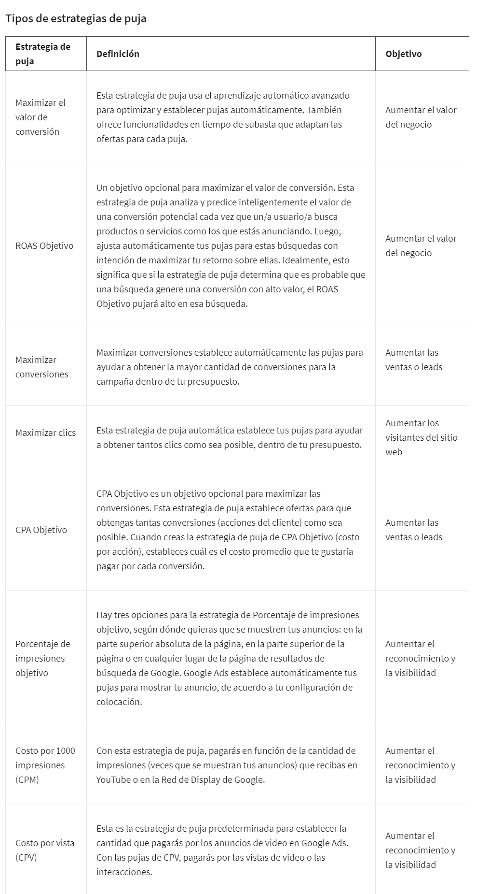

**Seleccionar una estrategia de puja**
Al crear una campaña, Google Ads te guía para elegir una estrategia de puja mediante una serie de preguntas orientadas a
determinar los objetivos de tu campaña. Esto te será útil si no estás familiarizado/a con estrategias específicas de puja.

Sin embargo, el sitio web ofrece la opción de seleccionar una estrategia de puja directamente. Las y los usuarios/as pueden
elegir estrategias de puja específicas de un menú desplegable.

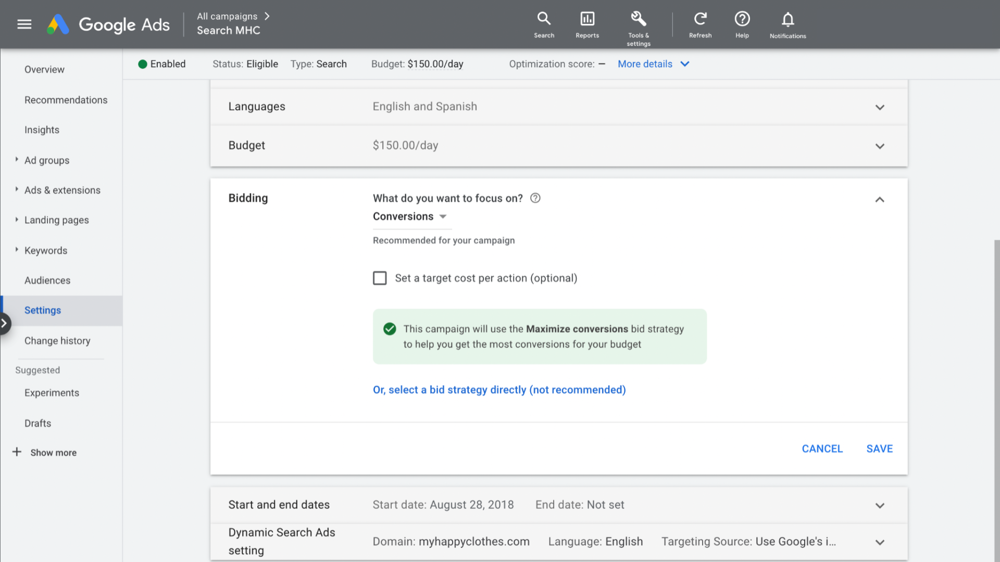

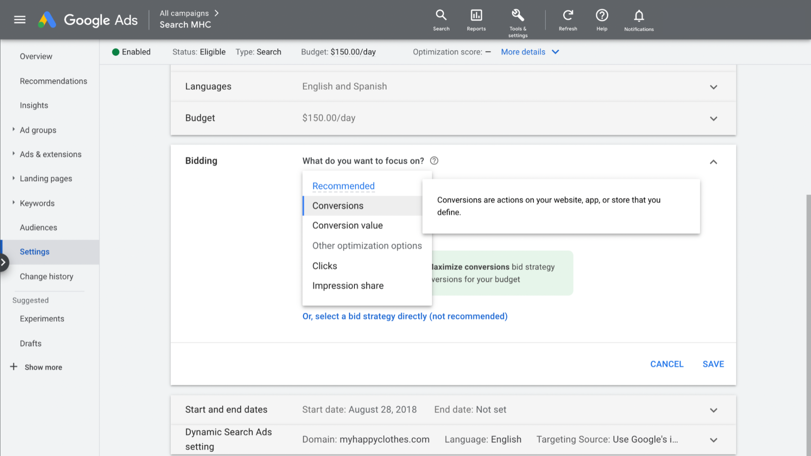

**Puntos clave** Con tantas opciones, elegir una estrategia de puja puede ser difícil. Para que tu decisión sea más fácil,
asegúrate de identificar primero tu objetivo y luego combinarlo con la estrategia adecuada. Elegir la estrategia correcta, a
menudo, requiere probar y equivocarse, así que no te preocupes si la estrategia que seleccionaste no funciona al principio.
Siempre puedes aplicar lo que has aprendido en intentos anteriores a tu próxima campaña.

#### Ginny - SEM y cómo atraer clientes

Hola, soy Ginny y trabajo como Coordinadora de Productos Publicitarios en Google. En este puesto, mi función es crear un
puente entre nuestra comunidad de anunciantes y las personas que trabajan en agencias, o en forma interna para sus empresas
o como consultores/as que hacen SEM para los clientes. También ayudo a responder sus preguntas, comprender sus
preocupaciones, o ayudarlos/las con los problemas que tengan con los productos particulares del SEM o las estrategias.
Además, comunico ese feedback a los equipos internos, los cuales trabajan en productos, en comunicaciones, y en estrategias
de marketing.

Algunos de los SEM con los que he trabajado son: Google Ads, Microsoft Advertising, redes sociales, como Facebook,
Pinterest, Instagram, Snap, y también Amazon. Y cada uno de ellos es un poco diferente. Hay una curva de aprendizaje con
cada canal, pero los fundamentos siguen siendo los mismos. Se trata de llegar al público y crear contenido con el cual se
identifique la audiencia.

Un ejemplo que recuerdo que fue bastante exitoso, y que demuestra la importancia de pensar en las audiencias, fue una
campaña para un programa de verano para estudiantes de secundaria en una universidad. Tuvimos que pensar en estudiantes de
secundaria que pudieran estar interesados/as en sus actividades de verano, pero también tuvimos que considerar a los padres
y madres que estaban buscando programas para sus hijos/as de secundaria. Por lo tanto, debimos utilizar diferentes enfoques
para estas dos audiencias y pensar en la asignación presupuestaria.

¿Quién aportará el dinero? ¿Quién va a a pagar la matrícula? Es probable que sean los padres o madres. Y así, no solo
tomamos en cuenta el enfoque de los mensajes. También consideramos el enfoque de la asignación presupuestaria. ¿Cuál
audiencia será la más valiosa para este anunciante?

Siempre es gratificante ver llegar a los leads, recibir llamadas. O, si venden por comercio electrónico, ver las primeras
ventas completarse y que se realicen los pagos de los carritos. Entonces, en este caso, al atraer a ambos públicos y tener
una estrategia real dirigida a estudiantes y padres/madres, aunque esa estrategia fue en gran parte dirigida hacia los
padres/madres, pudimos tender un puente y lograr esa conexión entre esas dos audiencias. La segmentación fue fundamental
para conseguir conversiones incrementales, o, en este caso, clientes potenciales y llevar adelante una campaña exitosa para
esta universidad.

Algunos de los mayores desafíos en el SEM es que está en constante cambio. Esa es la parte divertida. Constantemente tienes
que pensar de manera diferente en las estrategias y la forma en la que usas las herramientas. La automatización cada vez
juega un papel más importante en el SEM.

Una de las cosas más emocionantes sobre trabajar en el SEM es la gratificación inmediata y poder ver si se trata de leads,
ventas o descargas. Sea lo que sea, se trata de la acción que quieres que tomen tus clientes potenciales. Tener la
posibilidad de verlo suceder en tiempo real, o casi en tiempo real, es increíblemente satisfactorio y puedes ver el impacto
que estás haciendo en el negocio.

Al ver a las personas que creo que serán exitosas en el SEM, la primera característica que observo es la curiosidad. Tienes
que ser una persona curiosa, con ganas de aprender. Tienes que querer lidiar diariamente con cosas inesperadas.

### Entiende Google Ads

#### Cómo funciona Google Ads

Como hemos visto, hay muchos tipos de formatos de Google Ads, desde anuncios de búsqueda hasta de compras y de video. Pero
independientemente del formato que utilices, hay ciertos pasos que debes seguir al crear un anuncio en Google Ads.
Aprenderás esos pasos en este video.

El primer paso es definir tu meta de campaña. Una meta es aquello que quieres lograr con el anuncio ¿Quieres vender más?
¿Conseguir más leads? ¿Aumentar el tráfico al sitio web o incentivar a la gente a visitar tu tienda? La meta que elijas
definirá otras opciones de campaña. Por ejemplo, imagina que tu objetivo es aumentar el tráfico al sitio web. Es probable
que quieras seleccionar un tipo de puja como "maximizar clics". Así, tu inversión publicitaria hará que más personas hagan
clic en el anuncio. También puedes encontrar la palabra "objetivo" en lugar de "meta", como "define tu objetivo de campaña”.

Para Google Ads, estas palabras significan lo mismo. Recuerda, tu meta u objetivo, es lo que quieres lograr con tus anuncios
en última instancia.

El siguiente paso es elegir el tipo de campaña publicitaria. Esto determina dónde se mostrarán tus anuncios y cómo se verán.
La palabra “campaña” tiene un significado específico en Google Ads. Las campañas son anuncios que comparten un presupuesto,
orientación, etc. Las campañas se usan para ordenar las categorías de los productos y servicios que ofreces. Tu cuenta de
Google Ads puede tener varias campañas operando al mismo tiempo. Así que, el segundo paso es elegir el tipo de campaña para
tu anuncio Puede ser búsqueda, compras, locales o de video. Dependiendo de cuál campaña elijas, tus anuncios aparecerán en
varias ubicaciones. Por ejemplo, un anuncio de búsqueda saldrá en los resultados del buscador y uno de video saldrá en
YouTube. Un anuncio local podrá estar en Maps, en sitios web y en YouTube.

El tercer paso es establecer un presupuesto para tu campaña. Este presupuesto define el monto máximo que gastarás. Puedes
cambiarlo en cualquier momento. Pondrás un presupuesto promedio diario, que especifica cuánto quieres gastar cada día
durante un mes. Google Ads optimiza automáticamente tu gasto en los días del mes en que es más probable ganar clics y
conversiones, según tu estrategia de puja. Por ejemplo los días en que el tráfico de búsqueda es mayor. Esto significa que
algunos días no llegarás a gastar el presupuesto diario, pero en otros puedes excederlo. Sin embargo, nunca excederás tu
límite de presupuesto mensual.

El cuarto paso es elegir tu estrategia de puja. Al seleccionar una meta de campaña, verás una estrategia de puja
recomendada. Google Ads te permite elegir tu estrategia de puja para asegurar que tu campaña pueda cumplir tu meta
específica. Por ejemplo, podrías elegir enfocar tu puja en las conversiones. También puedes seleccionar una estrategia de
puja automatizada. Muchas personas usan el aprendizaje automático para mejorar el rendimiento del anuncio. Para Google Ads,
esto es un conjunto de instrucciones de software que ayudan al anuncio a lograr su meta. Una estrategia de puja automática
evita tener que pensar qué puja es mejor para alcanzar tus metas de rendimiento. En una estrategia de puja automatizada,
Google Ads establece pujas para tus anuncios, basándose en la mayor probabilidad de que el anuncio resulte en una conversión
o venta. El software de machine learning de este tipo de estrategias aprende durante la marcha. Si los anuncios llegan a más
personas, el desempeño de la puja muestra los montos futuros de puja.

El siguiente paso es seleccionar tu público objetivo. La segmentación ayuda a definir qué tan estrecha o amplia será la
audiencia. Es decir, quién te gustaría que viera tus anuncios. Sin segmentación, tus anuncios tendrán un alcance más amplio.
Definir la segmentación del anuncio te permite llegar a clientes concretos, interesados en lo que tienes para ofrecer.
¿Recuerdas a tus clientes tipo o ideales? Ahora es el momento de utilizarlos. Las formas más comunes de segmentación en
Google Ads incluyen: palabras clave, audiencias, ubicaciones, temas y dispositivos. Si bien puedes usar Google Ads para
obtener ideas de segmentación, lo más común es planificar y determinar las opciones antes de crear un anuncio. Planificar
con anticipación evita errores en el proceso de creación del anuncio.

El sexto paso, simplemente, es crear tu anuncio. El formato principal de los anuncios de texto son los anuncios de búsqueda
responsivos, y están compuestos por encabezados, descripción y URL de la página de destino. Luego, los motores prueban
automáticamente diferentes combinaciones para saber cuál funciona mejor. No olvides que crear tu anuncio es solo una parte
de la conversión de clientes. Tu página de destino debe mostrar lo que el cliente potencial espera ver al hacer clic en tu
anuncio. Porque si no lo hace, podrías perder a ese cliente potencial.

El séptimo paso es configurar tus conversiones. Para saber si el anuncio es exitoso, debes saber si los clientes potenciales
se convertirán en clientes que paguen. Este seguimiento, te permite conocer las acciones que quieres que el cliente haga en
tu sitio web. Al ver esos datos podrás evaluar la eficiencia de tus anuncios, la segmentación y las campañas en general. Una
forma de hacer seguimiento de conversiones es con Google Analytics. Para hacer este seguimiento, conectarás tu cuenta de
Analytics directamente con Ads. Aprenderás más sobre Google Analytics más adelante.

Antes de configurar cualquier conversión, deberás dar a los usuarios información clara y completa acerca de los datos que
estés recolectando sobre ellos. También, necesitarás su permiso para recopilar cualquier dato. Generalmente, este permiso se
obtiene con una ventana emergente y un botón de acuerdo. Cuando veas un aviso emergente sobre la recolección de datos,
también conocido como “banner de consentimiento de cookies”, por favor, léelo. Es posible que necesites usar algo similar si
haces seguimiento de las conversiones.

Son muchos pasos los que debes dar para crear un anuncio de Google. Al principio, todo esto puede resultarte un poco
abrumador. No hay problema. Una vez que conozcas la plataforma y crees algunos anuncios, comprenderás el proceso y sentirás
que todo es mucho más fácil. Piensa en eso.

#### Caso práctico: Cómo Studley’s Flower Gardens usa Google Ads para hacer crecer su negocio

El marketing de motores de búsqueda (SEM) y Google Ads ayudan a las empresas a poner sus productos y servicios frente a sus
clientes ideales. Las y los clientes potenciales usan Google y otros motores de búsqueda para buscar información sobre un
producto, un servicio o una marca. Y las Campañas de Búsqueda de Google Ads ayudan a poner el negocio frente a esa persona
justo cuando está buscando una solución.

En este caso práctico, conocerás cómo la empresa Studley’s Flower Gardens, con sede en Rochester, Nuevo Hampshire, utiliza
Google Ads para poner sus flores y plantas frente a sus clientes locales cuando están en línea.

**Más información de la empresa** Studley’s Flower Gardens, fundada en 1928, es una empresa familiar de floristería,
jardinería y paisajismo ubicada en el centro de Rochester, Nuevo Hampshire.

Además de una tienda, Studley’s también tiene un  sitio de comercio electrónico robusto. El amplio y visualmente atractivo
surtido de flores y plantas del sitio web ayuda a las y los clientes a encontrar y comprar sus productos en línea.

La publicidad en línea representa la mayor parte de su presupuesto de marketing. Alrededor del 65 % de su presupuesto
publicitario anual se destina a anuncios en línea, mientras que el 35 % restante va a publicidad en medios radiales y
televisivos locales.

**El desafío** Debido a que Studley’s es un pequeño emprendimiento local, enfrenta el desafío de competir, en las páginas de
resultados de motores de búsqueda de Google, con marcas con presencia nacional que atienden el mismo rubro. La optimización
de motores de búsqueda (SEO) puede ser particularmente difícil. Las marcas nacionales de flores cuentan con mayor
presupuesto y varios miembros del equipo se dedican a optimizar el contenido para lograr una mejor posición en el ranking de
los resultados de búsqueda.

Aunque Studley's aparece en las primeras páginas para algunas palabras clave relacionadas con su negocio, esto puede cambiar
de un momento a otro, dependiendo de lo que sus clientes potenciales buscan en la web. Al tratarse de una empresa pequeña,
Studley's no cuenta con el equipo ni el presupuesto necesarios para competir de manera consistente y mejorar su posición en
los resultados de búsqueda. Si aparece más abajo, es menos probable que los clientes la encuentren y compren, impactando en
sus ingresos.

**El enfoque** Para garantizar una presencia constante en los resultados de búsqueda de Google, Studley’s Flower Gardens usa
Google Ads. A diferencia de otros recursos de marketing, como una campaña de correo directo, Google Ads le permite a
Studley’s colocar sus anuncios frente a clientes muy específicos, que buscan sus productos o el nombre de la marca.

Mira, por ejemplo, las pujas de Studley’s por palabras clave relacionadas con el nombre de su negocio. Cuando alguien en
Rochester, New Hampshire, busca su nombre comercial, Studley’s apunta a aparecer entre los primeros resultados, para que sus
clientes potenciales puedan encontrar su sitio web de manera rápida y fácil.

Además, en lugar de tratar de administrar los anuncios de Google Ads por su cuenta, esta empresa familiar contrató a una
agencia de marketing. Los y las especialistas en marketing digital y en Google Ads analizan qué estrategias publicitarias
están funcionando bien y deciden cuáles deben mejorar o dejar de usar.

De esta forma, quienes lideran Studley’s no necesitan  dedicar tiempo a mantenerse al día con el último software de Google
Ads o los cambios en los productos, sino que pueden centrarse en lo que mejor saben hacer: administrar y hacer crecer su
negocio de floristería, jardinería y paisajismo.

**Los resultados** Al usar Google Ads, Studley’s Flower Gardens coloca anuncios frente a clientes potenciales justo cuando
necesitan flores y plantas.

Por ejemplo, cuando alguien busca la marca Studley’s, es probable que encuentre el anuncio en la página de resultados de
buscadores, además del sitio web en los listados de búsqueda. Cuando un/a cliente potencial busca “entrega de flores cerca
del negocio”, es probable que vea el anuncio, incluso si el sitio web no aparece en los listados de búsqueda de la
optimización de motores de búsqueda.

**Conclusión** El marketing de motores de búsqueda (SEM) y Google Ads pueden ayudar tanto a pequeños emprendimientos locales
como a medianas y grandes empresas. La segmentación geográfica, como en Rochester, New Hampshire, posibilita a Studley’s
publicar anuncios para sus clientes locales. Google Ads permite a los negocios más pequeños, que no pueden competir con la
optimización para motores de búsqueda (SEO), medirse contra las marcas más grandes.

Como futuro o futura especialista en marketing digital, ten en cuenta que tienes la oportunidad de ayudar a una pequeña
empresa como Studley’s. Si trabajas para una agencia de marketing, es posible que tengas que administrar anuncios de docenas
de clientes. Es gratificante saber que el trabajo que haces con el marketing de motores de búsqueda ayuda a las pequeñas
empresas y a emprendedores a atender a sus comunidades locales.

#### Identifica palabras clave y entiende la subasta de anuncios

Cuando haces publicidad en buscadores, las palabras claves son un elemento esencial. Debes dirigir tus mensajes al tipo
correcto de posibles clientes, para no perder ninguna oportunidad. Esto empieza con la investigación de palabras clave.
Recuerda: las palabras clave son el el tipo de palabras o frases que las y los clientes potenciales usan cuando buscan en
Google.

Al elegir palabras clave para Google Ads, no tienes que ingresar todos los tipos de palabra clave exactos. En su lugar,
puedes usar la concordancia de palabras clave. Los tipos de concordancia definen qué tanto la palabra clave debe coincidir
con la consulta del usuario/a. Para que se muestre el anuncio, hay tres opciones: Concordancia amplia, concordancia de frase
y concordancia exacta.

La concordancia amplia muestra tus anuncios cuando se busca con frases asociadas con tu palabra clave. Es posible que no
incluyan la palabra clave en sí. Por ejemplo, la frase “plan de dieta baja en carbohidratos” podrá aparecer en búsquedas de
“comidas sin carbohidratos” o “recetas bajas en calorías”.

Para encontrar coincidencias relevantes, la concordancia amplia tiene en cuenta las búsquedas recientes del usuario y
también el contenido de tu página de destino. Sí, los algoritmos de Google Ads revisan la página de destino del anuncio para
entender mejor el anuncio. La página de destino es crucial para el éxito con Google Ads. Para tipos de concordancia amplia,
se recomiendan las estrategia de puja automática.

El segundo tipo es concordancia de frase. Éstas incluyen el significado de tu palabra clave. La concordancia de frase es más
flexible que la exacta, pero es más específica que una concordancia amplia. Por ejemplo, si la palabra clave es “zapatos de
tenis”, el anuncio aparecerá en búsquedas de “zapatos para tenis”, “compra zapatos de tenis con descuento” o “zapatos rojos
de tenis”. Pero no aparecerá en “raquetas de tenis” o “zapatos de entrenamiento” o “¿puedo usar zapatos de correr para
tenis?”

El tercer tipo es la concordancia exacta. Aquí, los anuncios aparecen en búsquedas con el mismo significado o intención de
la palabra clave. De las tres opciones de concordancia, la exacta te da mayor control sobre quién ve tu anuncio. Por
ejemplo, si la palabra clave es “zapatos para hombre”, el anuncio puede mostrarse en búsquedas de “zapatos hombres” “zapatos
de hombre” o “zapato de hombre”. Pero no saldrá en búsquedas con “tenis de hombres” o “zapatos para niños”. ¿Entiendes lo
específico que es?

Todos los tipos de coincidencias pueden captar variaciones en las palabras clave, como plurales, faltas de ortografía,
sinónimos o el orden de las palabras. Esto significa que no hay necesidad de hacer listas de palabras largas y exhaustivas,
que incluyan todas estas variaciones en tu campaña.

Al elegir las palabras clave para tu anuncio, considera también las palabras clave negativas. Cuando agregas palabras clave
negativas excluyes de tus campañas ciertos términos. Esto evita búsquedas irrelevantes, que no tendrían buen rendimiento.
Google Ads se centra en palabras clave y busca siempre aumentar el rendimiento de tu cuenta. Puedes usar palabras clave
negativas para cualquier tipo de concordancia que vimos.

Veamos un ejemplo de palabras clave de concordancia amplia. Con esta concordancia, tu anuncio aún puede aparecer si la
búsqueda tiene alguna de tus palabras clave. Pero nota que, a diferencia de las palabras positivas, las negativas no
coinciden con variaciones. Por ejemplo, supongamos que “zapatos para correr" es una palabra negativa del tipo amplio. El
anuncio sale en “tenis azules” o “zapato para correr”, pero no en “zapatos para correr azules” o “zapatos correr” o “zapatos
para correr”.

Ahora, ¿por qué vemos toda esta información de palabras clave? Tus palabras clave deben relacionarse con el tema del anuncio
y la página de destino para la “subasta de anuncios”. La subasta de anuncios es cómo Google determina qué anuncios mostrar y
su orden para cada resultado con anuncios de texto. Su lugar en una búsqueda se llama posición de anuncio, un valor que
Google usa para definir la posición del anuncio.

Tres factores definen la posición del anuncio. El primero es tu puja. Es decir: cuánto quieres pagar cada vez que un cliente
hace clic en el anuncio. Cuanto más pagues, más arriba saldrá en los resultados. El segundo factor es la calidad del anuncio
y la página de destino. Con cada subasta, Google evalúa la relevancia del anuncio y su página de destino para la búsqueda
del usuario, así como la probabilidad de que éste haga clic en el anuncio. Una herramienta de diagnóstico en tu cuenta de
Google Ads, llamada nivel de calidad, te ayuda a identificar formas de mejorar la calidad de tu anuncio. El nivel de calidad
se muestra en una escala del 1 al 10. Esta puntuación es una guía para mejorar la efectividad del anuncio y no se usa en la
subasta.

El tercer factor en la posición del anuncio son sus extensiones. Es la información adicional del anuncio, como teléfono o
enlaces a tu sitio web. Debes usar todas las extensiones de anuncios

 relevantes para tu empresa. Juntos, estos tres factores determinan si tu anuncio aparecerá frente a clientes potenciales y
 cuándo. Considera que también hay otros factores para la posición del anuncio, como el contenido de búsqueda y otros
 resultados en la página.

Como puedes ver, es crucial elegir las palabras clave adecuadas para el anuncio. Si no, tus anuncios podrían aparecer ante
el tipo de público incorrecto y afectar la posición del anuncio. Con palabras claves que coincidan, la puja correcta, un
anuncio de calidad y una página de destino útil, será mucho más probable que tu anuncio esté en la parte superior del
buscador de Google.

#### Prácticas recomendadas para crear un anuncio de Búsqueda en Google

Veamos las mejores prácticas para crear un anuncio de búsqueda efectivo. Además de incentivar a las y los clientes
potenciales a hacer clic en el anuncio, ¿por qué querrías un anuncio efectivo? Un anuncio efectivo aparece más arriba en las
páginas de resultados y genera más clics y más conversiones. A veces, incluso, a un costo más bajo por clic que el de tu
competencia.

Aquí hay algunas prácticas recomendadas para crear tu anuncio de búsqueda en Google. Diseña tus mensajes enfocándote en las
necesidades y beneficios del usuario. Es decir, ofrece algo de valor a quien busca, y es más probable que responda. Piensa
en lo que la persona quiere de tu anuncio. ¿quiere credibilidad y confianza? Es posible que desees utilizar un lenguaje como
“Sitio oficial” o ¿quiere un rango amplio de productos? entonces incluye “Mira nuestro catálogo”

Este es un buen momento para usar los clientes tipo. Revisa los objetivos del cliente y tenlos en cuenta para tu anuncio.
Otra buena práctica es incluir al menos una de las palabras clave de tu grupo en tus encabezados. Recuerda, el encabezado es
el enlace que está en la parte superior del anuncio. La descripción está debajo del encabezado. Google probará
automáticamente distintas combinaciones de encabezados y descripciones, así que intenta que cada combinación sea fácil de
entender.

Es importante incluir palabras clave, porque en eso piensan los clientes potenciales. Si tu anuncio se conecta con lo que
buscan, es probable que den clic. Además, hay herramientas avanzadas que ponen la palabra clave en el encabezado desde la
configuración y personalizan automáticamente el contenido del anuncio. Conocerás estas técnicas avanzadas al aprender más
sobre Google Ads.

Una tercera práctica recomendada es evitar el lenguaje genérico de ventas. Frases como "llámenos hoy" crean una falsa
sensación de urgencia. Ten presente el beneficio del usuario. Si no hay un beneficio para el usuario, entonces ¿por qué
llamaría hoy? Las llamadas a la acción genéricas, como “regístrate hoy” o “reserva hoy” a menudo muestran menor interacción
con el anuncio. En vez del lenguaje de ventas genérico, usa llamados a la acción específicos.

Imagina que escribes contenido para una empresa que administra propiedades. En lugar de escribir “reserva ahora” en el
anuncio, escribe “reserva el alquiler vacacional de tus sueños”. Esto es más específico y se relaciona con los deseos del
cliente potencial.

Otra buena práctica es añadir todas las extensiones de anuncio que tengan sentido. Las extensiones de anuncios dan
información adicional de la empresa. Están diseñadas para que los anuncios sean más atractivos, al mostrar información útil.
Incluir extensiones hace que los anuncios se posicionen mejor en los resultados. Extensiones como ubicación, llamada o
instalación de la app, mejoran la experiencia para los usuarios móviles también. Son una manera fácil de destacar el anuncio
ante sus competidores. Puedes usar varias extensiones en tu anuncio, así que habilita todo lo que tenga sentido para tu
empresa. Cuando sea posible, intenta habilitar al menos cuatro. Google Ads determina la mejor combinación de extensiones,
subasta por subasta.

Una quinta práctica recomendada es optimizar tu página de destino. El anuncio y la página de destino trabajan juntos para
ofrecer una gran experiencia de usuario. Compara tus palabras clave y el contenido de la página de destino con la
experiencia general del usuario. Las palabras clave exactas no necesitan estar en la página de destino, pero la coherencia
debe ser clara de inmediato. Pregúntate: ¿Qué tan útil es la página de destino para quien da clic al anuncio? ¿La página
está bien organizada? ¿El texto se relaciona con una búsqueda? ¿La página es clara en sus direcciones?

También, debes hacer que tu página de destino sea confiable. Asegúrate de que cargue rápido. Si la carga de la página se
demora, los usuarios se frustrarán y se irán. Además, esto indica a Google que el anuncio y la página pueden no ser la mejor
opción.

Solo quiero decir: ¡Buen trabajo! Acabas de aprender buenas prácticas al crear un anuncio de búsqueda en Google. Piensa en
crear anuncios de Google como en un experimento. Si sigues las prácticas recomendadas, crearás anuncios diferentes. Luego
recibirás feedback y resultados. Y modificarás el contenido de los anuncios de menor rendimiento. Todo esto es un esfuerzo
para ofrecer los mejores anuncios y página de destino posibles a tus clientes potenciales. Cuanto más practiques, mejores
serán tus anuncios.

#### Estructura y organización de una cuenta de Google Ads

En un video, aprendiste sobre Google Ads, campañas y grupos de anuncios. Esta lectura te ayudará a aprender cómo se
organizan estos elementos dentro de Google Ads.

Google Ads es el programa de publicidad en línea de Google. A través de Google Ads, puedes crear anuncios en línea para
alcanzar a las personas exactamente cuando están interesadas en los productos y servicios como los que tú ofreces.

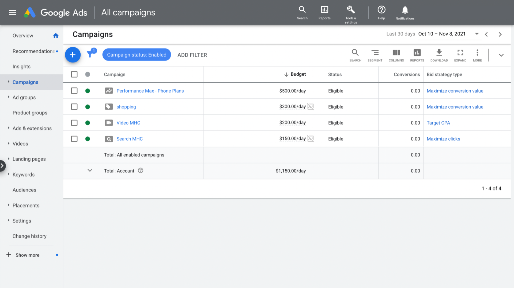

**Estructura de la cuenta de Google Ads:**

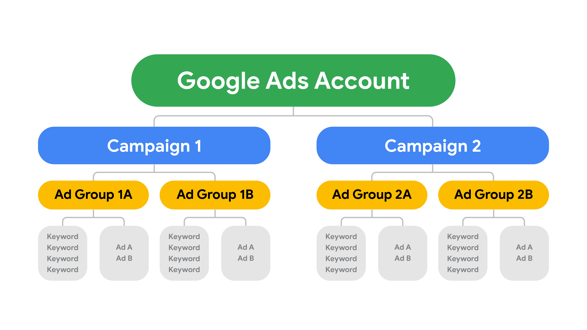

*Los siguientes elementos se presentan en el orden en que los encontrarás cuando definas  una campaña en Google Ads.*

Google Ads: es el programa de publicidad en línea de Google. A través de Google Ads, puedes crear anuncios en línea para
alcanzar a las personas, exactamente cuando están interesadas en los productos y servicios como los que tú ofreces.

Campaña: plan de acción sobre cómo se distribuirá un conjunto de uno o más grupos de anuncios que comparten un presupuesto,
una orientación por ubicación y otros ajustes. Las campañas se utilizan con frecuencia para agrupar las diferentes
categorías de productos o servicios que ofreces.

Presupuesto diario promedio: monto que decidiste gastar diariamente, en promedio, mientras dure tu campaña publicitaria.
Especifica aproximadamente cuánto estás dispuesto/a a  gastar por día durante el transcurso del mes.

Grupos de anuncios: la forma de organizar y segmentar los anuncios en grupos temáticos de palabras clave. Cada campaña se
compone de uno o más grupos de anuncios.

Formatos de anuncios: texto, videos, imágenes, anuncios de contenido digital y otros, que se muestran en los resultados de
búsqueda  para promocionar productos y servicios con Google Ads.

Puja: cantidad de dinero que deseas pagar cada vez que un/a cliente potencial haga clic en tu anuncio o te contacte se
conoce como puja.

Palabras clave:  palabras o frases que describen tu producto o servicio y ayudan a determinar cuándo y dónde puede aparecer
tu anuncio. Los anunciantes pujan entre sí, y los anuncios se clasifican en función de qué tan alto puja cada uno y qué tan
relevante es, entre otros factores.

#### Crea un anuncio de Google Ads

Ya aprendiste sobre Google Ads y sus diferentes formatos. Esta lectura te permitirá explorar los siete pasos que debes dar para crear un anuncio de búsqueda responsivo, según cuál sea tu objetivo.

Esta guía se basa en la interfaz de Google Ads, la cual ofrece orientación a lo largo del proceso.

Puedes optar por crear una campaña sin definir un objetivo de orientación, seleccionando la opción cuando se presenta en pantalla.

Siete pasos para crear una campaña de Google Ads

*Define tu objetivo de campaña:*

Tu objetivo es lo que quieres conseguir con el anuncio. Hay siete objetivos de campaña para elegir:

    Ventas: impulsa las ventas en línea, en la app, por teléfono o en la tienda

    Leads: atrae clientes potenciales (leads) y otras conversiones, alentando a las y los clientes a realizar determinadas acciones

    Tráfico al sitio web: anima a las personas a visitar tu sitio web

    Consideración del producto y la marca: anima a las personas a explorar tus productos o servicios

    Alcance y reconocimiento de marca: llega a un público amplio y crea reconocimiento

    Promoción de la app: aumenta las descargas o el conocimiento de tu app móvil

    Visitas a tiendas locales y promociones: incentiva a las y los clientes a visitar una tienda física

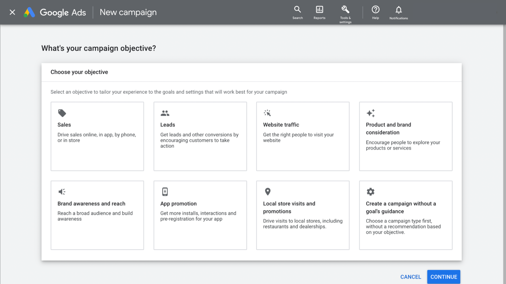

*Elige el tipo de campaña:*

A continuación, elige tu tipo de campaña. Las opciones incluyen:

    Búsqueda

    Performance Max

    Display

    Shopping

    Video

    Discovery

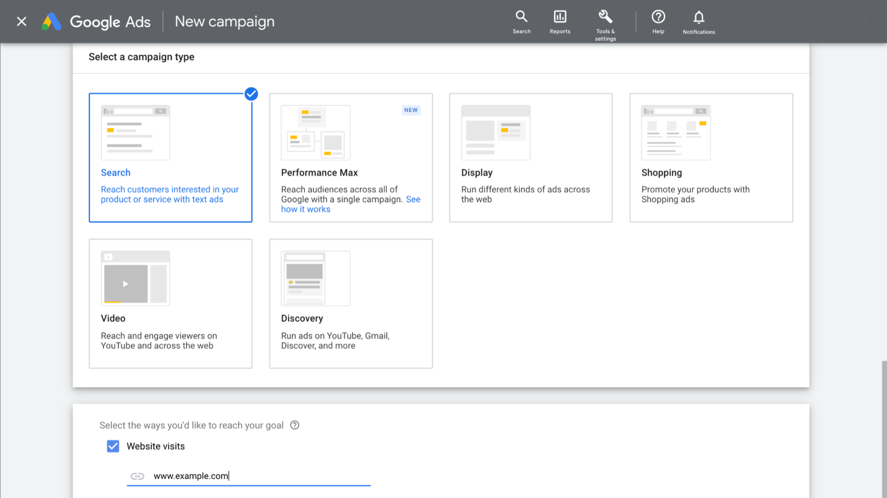

### Aplica la publicidad gráfica (Display)

### Revisión: Marketing de motores de búsqueda (SEM) y publicidad de display

### Revisión del curso: Atrae e involucra clientes con marketing digital
