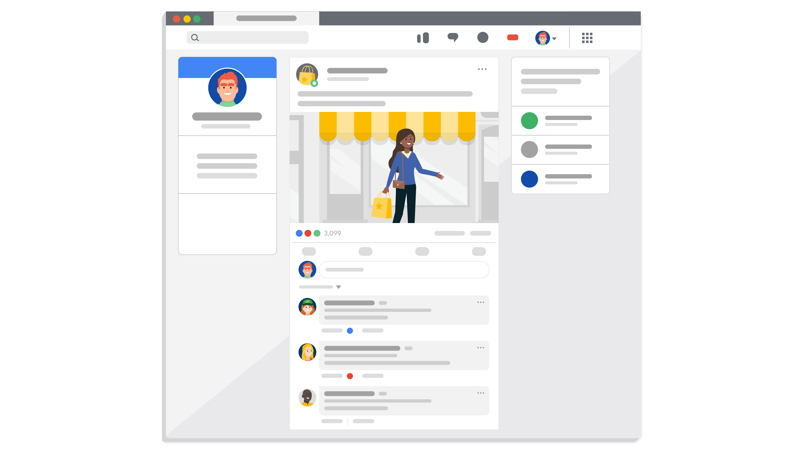
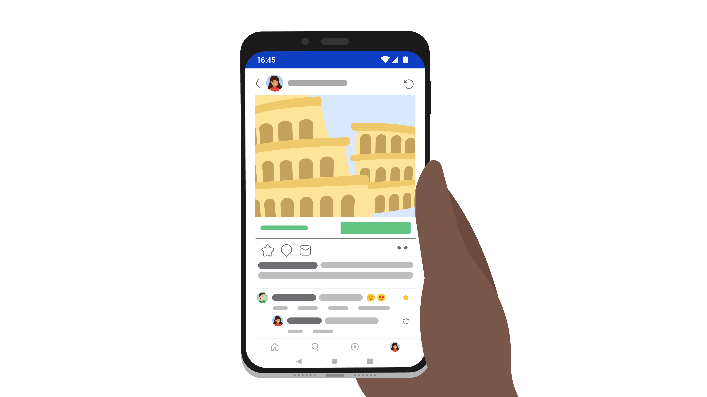
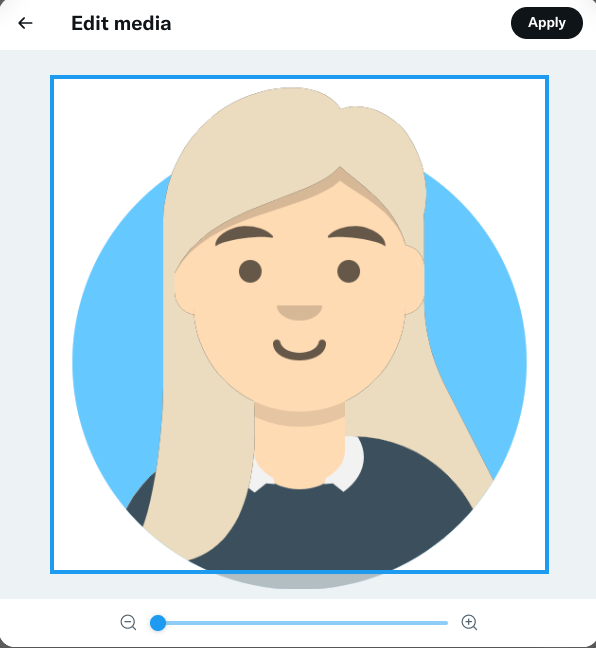
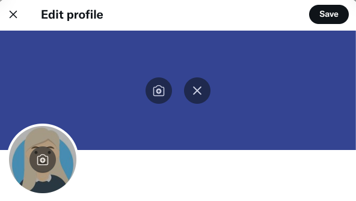
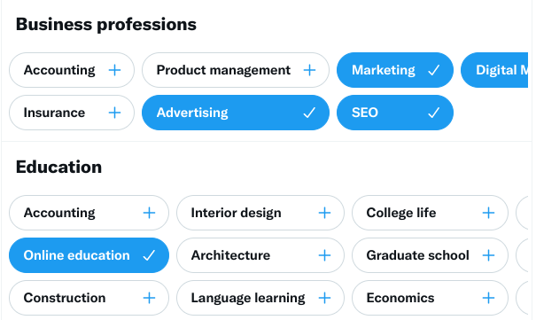
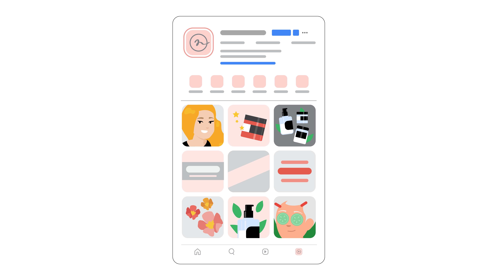
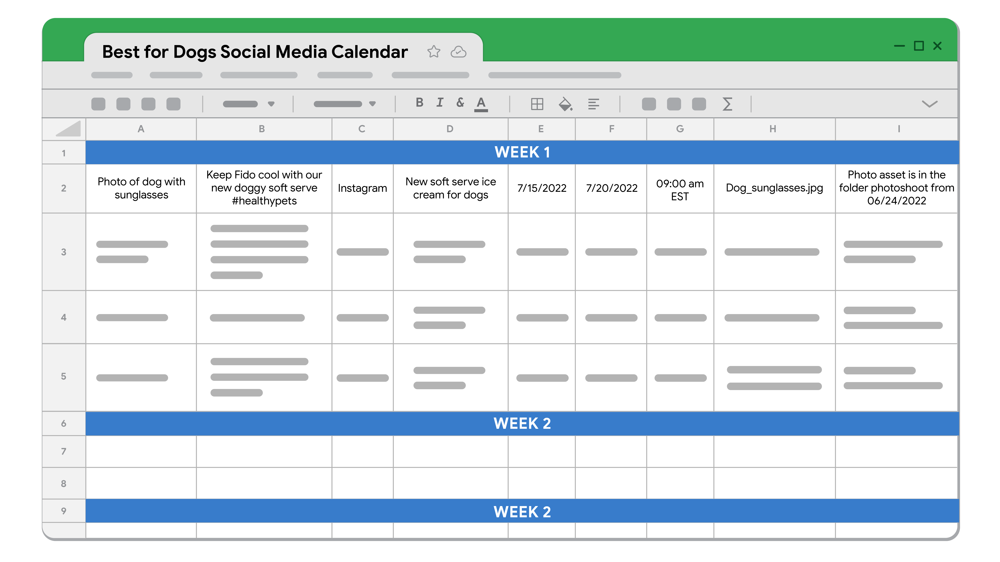

# De me gusta a leads: interactúa con las y los clientes en línea

## Introducción a “De Me gusta a Leads: interactúa con las y los clientes en línea”

### Primeros pasos en el curso

#### Introducción al curso 3

Curso 3: De Me gusta a Leads: interactúa con las y los clientes en línea, Hola, te doy la bienvenida.

En este curso, analizaremos cómo usar un canal de marketing digital grande y en crecimiento: las redes sociales. Más de 3500
millones de personas usan las redes sociales en todo el mundo. La gente pasa en promedio más de 2 horas por día en las redes
sociales. Con tantas personas usando las redes sociales diariamente, los mercados digitales tienen una gran oportunidad de
atraer y captar allí clientes potenciales.

Antes de empezar, permítanme presentarme. Mi nombre es Cindy y voy a ser tu instructora del curso. Soy Gerente de Marketing
de Productos en Google, y mi tarea es traer innovación al mercado para defender las necesidades de las y los clientes y
compartir la magia de los productos de Google.

Como Gerente de Marketing de Productos, uso el marketing en redes sociales para compartir ideas y soluciones que ayuden a
que mis clientes se conecten con sus usuarios/as y expandan sus negocios.

Anteriormente, aprendiste los fundamentos del marketing digital y cómo optimizar el SEO, SEM y mostrar publicidad, para
atraer y captar clientes en línea. En este curso analizaremos cómo usar el marketing de redes sociales para promocionar tu
negocio, producto o servicio.

Comenzaremos con los cinco pilares básicos del marketing en redes sociales. Cómo usar medios ganados, propios y de pago en
tu campaña en redes sociales. Cómo el marketing en redes sociales encaja en el embudo de marketing.

Luego analizaremos cómo crear una estrategia para tu campaña de marketing en redes sociales, con la definición de tus
objetivos de campaña y determinación de tu público objetivo. También verás cómo planificar y publicar contenido en el
momento correcto y con la frecuencia adecuada, y conocerás herramientas de administración de redes sociales para lograrlo.

Luego veremos cómo escuchar e involucrar a tu público en las redes sociales. Y analizaremos cómo escribir, adaptar, y
diseñar contenido para relacionarte con tus clientes.

Después, analizaremos cómo medir el éxito de tu campaña de redes sociales a través de las estadísticas. Identificarás
métricas importantes de redes sociales para seguir tu progreso y aprender a crear y presentar informes convincentes con tus
datos.

Por último, aprenderás a llevar a cabo una campaña de pago en las redes sociales. Veremos cómo usar el remarketing con tu
público y establecer un presupuesto de publicidad para las redes sociales.

Estaré feliz de guiarte a través de lo que viene en tu recorrido por el marketing digital.

### Comprende qué es el marketing en redes sociales

#### Te damos la bienvenida a la semana 1 curso 3

Como ya mencioné, en este curso hablaremos sobre el marketing en redes sociales.

Las redes sociales son cualquier herramienta digital que permita a los y las usuarios/as crear y compartir contenido y
hacerlo público. Con las miles de millones de personas que hay en las redes sociales en el mundo, es muy probable que tus
clientes actuales y potenciales también estén ahí.

Las personas usan plataformas como Facebook, Twitter, YouTube e Instagram para mantenerse en contacto con amigos, amigas y
familiares, compartir fotos y videos, investigar productos que quieren comprar, mantenerse al día con las noticias,
encontrar material entretenido para leer, y más.

Las redes sociales te dan la oportunidad de llegar a una gran cantidad de personas de distintas maneras. Más adelante,
hablaremos sobre qué es el marketing en redes sociales y cómo puede beneficiar a tus campañas de marketing.

Conocerás los cinco pilares básicos del marketing en redes sociales: estrategia, planificación y publicación, escucha e
interacción, informes y estadística, y redes sociales de pago.

Hablaremos sobre cómo los diferentes tipos de medios digitales se pueden relacionar con tu campaña en redes sociales y
aprenderás a usar las redes sociales para guiar a tus clientes a través del embudo de marketing: el recorrido que toma
un/a cliente potencial desde que conoce tu marca hasta que compra un producto y más.

¿Todo listo? ¡Empecemos!

#### Las ventajas del marketing en redes sociales

En este video, explicaré qué es el marketing en redes sociales y por qué es importante para el éxito de tus campañas de
marketing.

El marketing en las redes sociales es un proceso de creación de contenido para las diferentes plataformas de redes sociales
con el fin de impulsar la interacción y la promoción de un negocio o producto. El marketing en redes sociales permite que te
conectes con tus clientes y las/las ayudes a comprender mejor tu marca.

¿Por qué las redes sociales son una herramienta de marketing tan efectiva? Las razones son muchas. En primer lugar, las
redes sociales son un excelente medio para aumentar la conciencia de marca. La conciencia de marca se refiere a qué tan
conocido es un negocio o producto para las personas. Piensa en alguna vez que viste una publicación en las redes sociales de
una marca que no conocías y te llamó la atención. Si logras recordar qué marca era, eso es la conciencia de marca.

Las plataformas de redes sociales interactúan con más de la mitad de la población mundial. Según un estudio del centro de
investigaciones Pew, más del 70 por ciento de los y las usuarios de redes sociales revisan sus cuentas al menos una vez al
día. La gente usa estas plataformas para interactuar con amigos/as y familiares, y también con las empresas, así que podrías
conectar con tus usuarios/as siempre que estén en línea. Esto hace que las redes sean un lugar natural para dirigirse a tus
nuevos/as clientes.

Las redes sociales también ayudan a fortalecer las relaciones con tus clientes existentes. Te ofrecen la oportunidad de
generar más confianza, ayudar a que resuelvan sus problemas, y mostrarles que te preocupas por sus necesidades y opiniones.

Además, el marketing en las redes sociales puede ayudar a que tu negocio crezca, al conducir más tráfico a tu sitio web. Si
compartes el contenido de tu sitio web en tus plataformas de redes sociales, podrías dirigir a los y las usuarios hacia tu
sitio cada vez que publicas contenido nuevo. También puedes aumentar el tráfico del sitio si incluyes la dirección de tu
sitio web en todos tus perfiles de redes sociales, para que las personas que quieran conocer más sobre ti puedan hacerlo
fácilmente.

Las redes sociales también son uno de los canales de marketing más poderosos para generar clientes potenciales, como ya
aprendiste anteriormente. Los leads en redes sociales son las personas que realizaron alguna acción específica que las
transformó en clientes potenciales, como completar un formulario, suscribirse a una prueba gratuita, o hacer clic en un
enlace de un código de descuento. Muchas plataformas de redes sociales ofrecen formatos publicitarios específicamente
diseñados para obtener clientes potenciales.

Las redes sociales también te permiten conseguir información valiosa que puede ayudarte a definir tu estrategia de
marketing. Aprender sobre tu público objetivo, sus Me gusta, sus No me gusta, y sus intereses a través de las redes
sociales, puede ayudarte a adaptar tu estrategia de marketing a un público en específico. Las herramientas de estadísticas
de muchas plataformas de redes sociales te permiten reunir una gran cantidad de datos sobre tu público objetivo.

Además, las redes sociales te ofrecen la oportunidad de conocer a tu competencia. Investigar qué está haciendo tu
competencia puede ayudarte a incorporar lo que les está funcionando bien y mejorar lo que no.

Otro gran beneficio del marketing en las redes sociales es que es rentable. La mayoría de las plataformas de redes sociales
te permiten registrarte y crear un perfil de forma gratuita. Además, puedes llegar a los y las usuarios/as no solo basándote
en sus intereses y preferencias, sino también en la información personal y demográfica que deciden compartir en sus
plataformas de redes sociales. Esto reduce tu público a las personas específicas a las que deseas dirigirte, para evitar
gastar tu presupuesto en un público más amplio innecesariamente.

El marketing en redes sociales ha sido muy beneficioso para mis campañas en Google. Por ejemplo, recientemente lancé una
nueva función de un producto y era importante para mí conectarme con las personas que podrían considerarlo útil. Las redes
sociales me ayudaron a compartir información fácil de entender que aumentó la conciencia del producto entre el público y los
guió hacia un destino: en mi caso, el Centro de Ayuda de Google Ads, para que sigan leyendo sobre él.

Las empresas de todos los tamaños pueden beneficiarse de una presencia en las redes sociales, aunque las estrategias pueden
variar dependiendo de la empresa. En una empresa grande, podrías trabajar con un equipo de diseñadores, redactores, o
incluso con una agencia para crear el contenido. En una empresa pequeña, quizás tú estés haciendo gran parte del trabajo o
con un pequeño equipo interno.

Los beneficios que describí son solo algunas de las muchas razones por las que este canal de marketing es muy útil. Por esta
razón, el marketing en las redes sociales se convirtió en un elemento fundamental de muchas estrategias de desarrollo
comercial de las empresas.

A continuación, hablaremos sobre los principios básicos del marketing en redes sociales.

#### Cindy: un día en la vida de una gerente de marketing de productos

Hola, soy Cindy y soy Gerente de Marketing de Productos en Google. En un día normal, me enfoco en tres áreas clave.

En primer lugar, trabajo muy de cerca con mis agencias de investigación y mis equipos de venta para entender exactamente en
qué están pensando nuestros/as clientes. ¿Están enfrentando nuevos desafíos? ¿Qué les preocupa más?

También trabajo con otros/as Gerentes de Productos para entender del todo algunas de las nuevas innovaciones que llegan al
mercado. Son muchas las palabras técnicas y los documentos técnicos que debo entender, así que paso mucho tiempo
asimilándolos y leyéndolos para luego reunirme con mi Gerente de Productos para comprender bien todos los aspectos del
producto. Es muy importante poder comunicarse y conectarse con otras personas para fortalecer las relaciones y entender que
buscamos lo mismo.

Por último, paso un poco de tiempo desarrollando mi estrategia de marketing. Me siento e incorporo algunas de las
conversaciones que haya tenido más temprano en el día y preparo un documento que me permita pensar en cómo estructuro el
resto de mi semana o de mi mes.

Siento que cuanto más trabajes con productos diferentes y aprendas más sobre las distintas áreas, perfeccionarás cada vez
más tus habilidades como Gerente de Productos. Algunos productos pueden ser más complejos que otros, así que cuanta más
experiencia tengas trabajando con diferentes productos, más podrás mejorar tus habilidades de comunicación y tu capacidad
para llevar un producto al mercado.

A veces, las y los Gerentes de Marketing de Productos pueden pasar de ser colaboradores individuales a líderes de equipos.
Dirigen a otros/as Gerentes de Marketing de Productos. Piensan mucho en las estrategias y trabajan de manera conjunta con
diferentes equipos de otras áreas.

El principal consejo que doy para cualquiera que esté iniciando una nueva carrera es que tenga curiosidad y haga muchísimas
preguntas. No existen preguntas tontas. Mientras tengas curiosidad, tomes la iniciativa, y tengas el deseo y la motivación
de aprender, el cielo es el límite, como dicen. Y eso es lo que sucedió en mi carrera. Siempre he tenido el deseo de
aprender mucho, y gracias a eso he tenido oportunidades que nunca imaginé que tendría.

#### Los cinco pilares básicos del marketing en redes sociales

Antes hablamos sobre por qué las redes sociales son tan importantes para el marketing de tu empresa.

Hablemos ahora de los cinco pilares básicos del marketing en redes sociales: estrategia, planificación y publicación,
escucha e interacción, informes y estadísticas y redes sociales de pago.

Con estos pilares, puedes llevar a cabo una campaña de marketing en redes efectiva.

El primer pilar fundamental es la estrategia. Para construir una campaña exitosa de marketing en redes sociales, necesitas
desarrollar una estrategia efectiva. Tu estrategia definirá los objetivos principales de tu campaña. Quizás deseas usar el
marketing para aumentar la conciencia de marca, generar más tráfico y ventas en el sitio web, brindar soporte a las y los
clientes, crear una comunidad y mucho más. El propósito de tu campaña también dependerá de tus metas más grandes de
marketing y de los objetivos de tu negocio.

Tu estrategia también tendrá en cuenta las plataformas de redes sociales que usarás. Para decidir cuál de las plataformas
son las mejores para tu marca, necesitarás investigar las más visitadas por tu público objetivo. Además, tu estrategia
describirá qué tipo de contenido publicarás. Necesitas saber qué tipo de contenido prefiere tu público. Algunas personas
podrían estar interesadas en un contenido educativo o inspirador, mientras que otras tal vez prefieran entretenerse. También
necesitarás decidir el formato del contenido que publicarás, como imágenes, videos o artículos. Debes prepararte para
investigar e intentarlo muchas veces, para ver qué tiene mejor repercusión entre tu público y qué produce mejores
resultados.

Después de haber desarrollado tu estrategia de redes sociales, puedes seguir con el siguiente pilar: la planificación y
publicación. Es importante tener una presencia constante en las redes sociales, esto permite que tu marca sea vista y
descubierta por clientes potenciales. Programar publicaciones por adelantado asegura una presencia constante y hace que el
contenido que publiques tenga más probabilidades de atraer a tus clientes potenciales. Al planear tus publicaciones,
considera cuándo publicarlas y con qué frecuencia. ¿Cuándo es más probable que tu audiencia interactúe con tu contenido?
¿Qué tan seguido debes publicar para estar presente, pero sin sobrecargar a tu público? Usa las herramientas de
planificación de redes sociales para publicar tu contenido de forma automática y en el momento que quieras. Más adelante,
veremos cómo crear un calendario de redes sociales para planificar y publicar tu contenido.

Luego de publicar contenido en algunas plataformas de redes sociales, es hora de explorar el siguiente pilar del marketing
en redes sociales: interacción y escucha. A medida que publicas más en las redes sociales y tus seguidores crecen, las
menciones de tu marca aumentarán. Clientes potenciales y existentes harán comentarios sobre tus publicaciones, te
etiquetarán en sus posteos o te enviarán mensajes directos. La escucha social ayuda a entender cómo se sienten las personas
acerca de tu marca. La escucha social es el seguimiento y análisis de las conversaciones y tendencias relacionadas con tu
marca. La escucha social te ayuda a entender lo que la gente piensa de tu marca, y eso podría orientar tus esfuerzos futuros
de marketing y desarrollo de productos. También te ayuda a determinar tu enfoque con respecto a la participación del
público.

La interacción es cómo tu público interactúa con tu marca en las redes sociales. Es cuando las personas reaccionan a tus
publicaciones, haciendo cosas como darles un Me gusta o compartiéndolas. Estudiando la interacción descubrirás qué
contenidos tienen mejor repercusión entre tu público. La interacción también incluye cómo tú interactúas con tu público. Por
ejemplo: Si un/a cliente comenta que le encanta tu producto, responde agradeciéndole. Si un/a cliente necesita ayuda por un
problema, puedes decirle qué medidas tomarás al respecto. Interactuar con las personas de esta manera mejora sus
experiencias con tu marca.

Después de estar presente en las redes sociales por un tiempo, puedes seguir con el siguiente pilar básico: informes y
estadísticas. La estadística de redes sociales consiste en recopilar datos de tus redes sociales y analizarlos para tomar
decisiones de negocio. La estadística de redes sociales te dirá cómo se desempeña tu campaña. Puede ayudarte a descubrir
cosas como cuántas menciones positivas tuviste durante un mes en particular o cuánto más alcance estás teniendo en
diferentes plataformas de un mes a otro. El análisis de los datos que recolectas te puede ayudar a impulsar tu estrategia de
marketing en redes sociales. Después de haber recopilado y analizado los datos, puedes compartir los informes con las
personas interesadas para anunciar los resultados de tu campaña. Un informe de redes sociales es un documento que tiene
datos relevantes y un análisis de tus actividades en las redes sociales. Puedes crear varios informes que te ayuden a
monitorear diferentes métricas, como cantidad de seguidores, comentarios o clics. Esto puede mejorar el rendimiento de tus
campañas a lo largo del tiempo. Muchas plataformas de redes sociales hacen sus propias estadísticas y tienen sus propias
herramientas de informes. Veremos estas herramientas en otro curso.

Llegamos al último pilar del marketing en redes: las redes sociales de pago. Previamente, vimos las diferencias entre los
medios orgánicos y de pago. Aunque muchas tareas de marketing en redes sociales tienen contenido orgánico, quizás también
necesites desarrollar una estrategia de pago en redes. Serás capaz de controlar y dirigir mejor el marketing con las redes
sociales de pago que con los medios orgánicos. Las redes de pago te permiten llegar a un público más amplio que las
publicaciones orgánicas. Las redes sociales de pago también te ayudan a hacer crecer tu marca y ampliar tu presencia en las
redes sociales. Los datos que recopiles sobre el éxito de tus publicaciones orgánicas en las redes sociales te ayudarán a
definir tu estrategia de pago en redes.

Ahora ya conoces un poco sobre los cinco pilares del marketing en redes sociales: estrategia, planificación y publicación,
escucha e interacción, informes y estadísticas, y redes sociales de pago. En otras lecciones, hablaremos más en profundidad
sobre cada uno de estos pilares, y cómo puedes unirlos a todos para crear una campaña exitosa de redes sociales.

#### Redes sociales de pago, propias y ganadas

Ahora que ya conoces los cinco pilares básicos del marketing en las redes sociales, revisaremos los diferentes tipos de
medios digitales y cómo puede encajar cada uno de estos en tus campañas de redes sociales.

Antes aprendiste sobre los tres tipos de medios digitales: ganados, propios y de pago. Implementar los tres tipos de medios
en tu campaña de redes sociales puede aumentar la conciencia de marca, cambiar la forma en la que tu público se involucra
con ella y aumentar las ventas.

Repasemos lo que aprendiste hasta ahora sobre cada uno de estos tipos de medios y exploremos cómo incorporar los medios
ganados, propios y de pago en tus estrategias de redes sociales.

Empecemos por los medios ganados. Los medios ganados son una promoción personal o pública de una marca o producto. Los
medios ganados son el marketing generado por tus clientes. Cada vez que un/a cliente le cuenta a un/a amigo/a, publica en
una red social o un blog, o escribe una reseña sobre tu producto, produce medios ganados para tu marca.

Las redes sociales son uno de los canales de marketing más potentes para generar medios ganados. Los tipos de medios ganados
incluyen los comentarios y testimonios de clientes, menciones y comentarios en plataformas de redes sociales, material
compartido, retweets y me gusta en tus publicaciones, contenido sobre tu negocio en otros sitios web, publicaciones de blog
sobre tu negocio y contenido generado por usuarios/as relacionado con tu negocio.

El contenido generado por usuarios/as (UGC) es contenido creado por personas en lugar de por marcas. El contenido generado
por usuarios/as puede ser texto, videos, imágenes, reseñas, etc. Por ejemplo, imagina que diriges una campaña en redes
sociales para una empresa que vende calcetines. Si tus clientes publican sus propias fotos vistiendo los calcetines de tu
empresa en las redes sociales, eso sería contenido generado por usuarios/as y un ejemplo de medios ganados.

Una de las muchas ventajas de los medios ganados es que son orgánicos. Las redes sociales orgánicas son cualquier actividad
de redes sociales que no requiere una promoción pagada. Las redes sociales orgánicas forman la base de tu estrategia de
redes sociales.

Pasemos ahora a los medios propios. Los medios propios son todo el contenido digital sobre los que una marca tiene un
control total. Los sitios web son uno de los tipos más comunes de medios propios. Las fuentes de medios propios son los
sitios de blogs, los perfiles de redes sociales de tu marca como Facebook o Instagram y foros comunitarios.

Uno de los mayores beneficios de los medios propios es que le permiten a tu empresa controlar qué es lo que se dice sobre tu
marca en las redes sociales. Cuando tu marca tiene propiedad sobre un medio, decide qué tipo de contenido publicar, con qué
frecuencia publicarlo, y cómo los y las usuarios/as pueden interactuar con él.

Los medios propios también te permiten comercializar productos o servicios específicos en las redes sociales. Publicar
constantemente medios propios convincentes también puede generar más medios ganados.

Por último, están los medios de pago. Los medios de pago son cualquier forma de promoción digital por la que una marca paga
para publicar en línea. Recuerda que el quinto pilar del marketing en redes sociales son las redes sociales de pago. Las
redes sociales de pago son, por ejemplo: anuncios de imágenes, de videos, o de historias y el marketing de influencers.

Las redes sociales de pago permiten que tu marca pueda llegar a clientes que no te están buscando activamente. Se puede usar
para dirigirte a grupos específicos de personas que podrían estar interesadas en tus productos y servicios. Los medios de
pago también pueden ayudarte a promocionar tu contenido para generar más medios ganados y dirigir el tráfico a los medios de
tu propiedad.

Medios ganados, propios y de pago, todos serán componentes importantes de tus campañas de marketing en redes sociales.
Cuando se implementan todos juntos de forma estratégica, pueden mejorar la conciencia de marca, generar clientes potenciales
y aumentar las ventas.

Aprenderás más sobre cómo incorporar estos tipos de medios en tus campañas en redes sociales a lo largo de este curso.

#### El embudo de marketing en redes sociales

En cursos anteriores, viste cómo guiar a las y los clientes potenciales a través del embudo de marketing. Ahora hablaremos
sobre cómo aplicar estas estrategias en tus campañas de marketing en redes sociales.

Empecemos por repasar lo que aprendiste hasta ahora sobre el embudo de marketing. El embudo de marketing es una
representación gráfica de un proceso por el que la gente pasa, que va desde conocer una marca hasta convertirse en su
cliente fiel. Aprendiste que las etapas del embudo de marketing son la Conciencia: cuando un/a cliente potencial descubre
una marca por primera vez. Consideración: cuando la persona empieza a pensar en comprarle a la marca y busca activamente más
información al respecto. Conversión: cuando la persona decide hacer una compra, y Fidelidad: cuando el o la cliente decide
comprar nuevamente un producto de la marca.

La forma de abordar el embudo de marketing depende del canal de marketing. Usarás diferentes tácticas para el marketing
impreso (print), de SEO y por correo electrónico, por ejemplo, aunque estas estrategias se respaldarán mutuamente.

Veamos cómo el embudo de marketing puede ayudarte a guiar las interacciones con tus clientes y optimizar tus esfuerzos de
marketing a través de las redes sociales. El embudo de marketing en redes sociales comienza en la etapa de Conciencia, donde
las y los clientes potenciales empiezan a conocer tu marca. En esta etapa del embudo, tu objetivo es captar la atención del
público. Lo importante es que la gente recuerde tu marca y quiera aprender más sobre ti. Utilizar algunas palabras clave
puede ayudar a identificar el tema que tu público objetivo está buscando. Luego, puedes crear contenido para redes, como
guías, videos y blogs sobre esos temas.

Por ejemplo, tal vez tu empresa ofrece servicios de orientación profesional y te das cuenta de que la gente busca consejos
sobre cómo entrevistar a alguien. Podrías crear una guía con recomendaciones para entrevistas o un breve video tutorial con
consejos clave para las entrevistas. En esta etapa, debes crear contenido breve y simple, solo para ganar el interés del
público. También puedes usar anuncios de pago para mejorar la conciencia de tu marca en tus clientes objetivo. Al dirigirte
a un público específico o a un grupo de interés, llegarás de mejor manera a esas personas para llevarlas hacia la siguiente
etapa del embudo.

Durante la etapa de Consideración, tus clientes potenciales buscan más información para decidir si van a realizar una compra
o no. En este punto, pueden estar buscando reseñas o comparaciones de tus ofertas con las de tu competencia. Esta es tu
oportunidad para darles información más detallada sobre tu marca y diferenciarte de la competencia. Publicar contenido como
casos de éxito, testimonios de clientes, reseñas y tutoriales de productos más detallados pueden ayudar a construir la
confianza de las y los clientes potenciales en tu marca.

En marketing, la “regla de siete” dice que un/a cliente potencial debe ver un mensaje al menos siete veces antes de tomar
alguna acción. Las redes sociales facilitan estas comunicaciones. Cada vez que aparezcas en las redes de una persona, haces
que conozca cada vez más tu marca.

Después de haber llevado a tus clientes potenciales a través de las dos fases anteriores, y una vez que ya realizaron una
acción, como registrarse para recibir correos electrónicos o hacer clic en un anuncio, ya sabes que están interesados/as en
tu oferta. Durante la etapa de Conversión, capitalizas el interés que la gente ya te demostró. Durante esta etapa, se pueden
utilizar campañas de remarketing de pago para llegar a las personas que ya mostraron interés en tu marca. El remarketing,
también conocido como retargeting, es una estrategia en la que usas anuncios de pago para llegar a clientes que ya visitaron
tu sitio web, aplicación o perfil de redes sociales. También puede sutilmente animar a la gente a hacer una compra,
ofreciendo incentivos como descuentos o envíos gratuitos.

Después de haber adquirido un/a nuevo/a cliente, puedes pasar a la etapa de Fidelidad. ¿Sabías que cuesta cinco veces más
atraer un/a nuevo/a cliente que retener a los y las que ya tienes? Es por eso que la etapa de Fidelidad es fundamental.
Necesitas seguir reforzando las relaciones con tus clientes en esta etapa, para que puedas mantenerte en sus mentes. Enviar
anuncios de remarketing a clientes existentes en las redes sociales es una excelente forma de alentarlos para que vuelvan a
hacer una compra. También puedes mantener el contacto con tus clientes si haces que se sientan parte de la comunidad de tu
marca. Una forma de hacerlo es creando contenido de redes sociales que se relacione con la compra que ya hicieron. Por
ejemplo, si un/a cliente compra servicios de orientación profesional de tu empresa, podrías pedirle que comparta en tu foro
comunitario cuando consiga trabajo.

Repasemos lo que aprendiste sobre cómo guiar a tus clientes potenciales a través del embudo de marketing en redes sociales.
La etapa de Conciencia es el momento para captar la atención del público. La etapa de Consideración es tu oportunidad para
darles a las y los clientes potenciales información más detallada para diferenciarte de la competencia y ayudar a construir
su confianza en tu marca. La etapa de Conversión se produce cuando capitalizas los intereses que las  personas ya mostraron
en tu marca mediante el remarketing o la oferta de incentivos, y la etapa de Fidelidad está dedicada a seguir manteniendo
las relaciones con tus clientes para que puedas permanecer en sus mentes.

Estás llegando al final de esta sección. A continuación, haremos un cierre con lo que aprendiste hasta ahora, y hablaremos
sobre lo que viene en la próxima sección.

### Revisión: Introducción a “De Me gusta a Leads: interactúa con las y los clientes en línea”

#### Términos y definiciones del curso 3, semana 1

Analítica de redes sociales: proceso de recopilar datos de las plataformas de redes sociales y analizarlos para tomar
decisiones comerciales.

Contenido generado por el usuario (UGC): cualquier contenido creado por personas, en lugar de marcas.

Embudo de marketing: representación visual del proceso que atraviesan las personas desde que descubren una marca hasta que
se convierten en clientes fieles.

Escucha social: seguimiento y análisis de conversaciones y tendencias relacionadas con una marca.

Etapa de Conciencia: primera etapa del embudo de marketing, cuando un/a cliente potencial descubre por primera vez el
producto o servicio.

Etapa de Consideración: segunda etapa del embudo de marketing, cuando el interés de un/a cliente potencial sobre un producto
o servicio aumenta.

Etapa de Conversión: tercera etapa del embudo de marketing, cuando las y los especialistas en marketing capitalizan el
interés que las personas ya mostraron en las etapas previas.

Etapa de Fidelidad: cuarta etapa del embudo de marketing, cuando las y los clientes se convierten en clientes regulares y
promotores/as de la marca.

Informe de redes sociales: documento que muestra los datos y análisis relevantes sobre las actividades en redes sociales de
una marca.

Interacción: cómo interactúa una audiencia con una marca en las redes sociales.

Lead: cliente potencial.

Marketing en redes sociales: proceso de creación de contenido para diferentes plataformas de redes sociales para impulsar la
interacción y promover un negocio o producto.

Medios ganados: exposición digital positiva generada a través de recomendaciones personales o públicas.

Medios pagados: cualquier forma de promoción digital que una marca paga por publicar en línea.

Medios propios: contenido digital sobre el cual una marca tiene control total.

Pilares del marketing en redes sociales: los pilares que pueden ayudar a guiar una campaña efectiva de marketing en redes
sociales: estrategia, planificación y publicación, escucha e interacción, analítica e informes y redes sociales pagadas.

Reconocimiento (conciencia) de marca: cuán familiarizadas están las personas con un negocio o producto en particular.

Redes sociales orgánicas: cualquier actividad de redes sociales que no requiera una promoción pagada.

Redes sociales: cualquier herramienta digital que permite a los usuarios crear y compartir contenido públicamente.

Regla de siete: concepto de marketing que establece que un/a cliente potencial debe ver un mensaje al menos siete veces
antes de que esté listo para pasar a la acción.

Remarketing: una estrategia en la que un especialista en marketing utiliza anuncios pagados para dirigirse a los clientes
que visitaron un sitio web, app o perfil de redes sociales.

## Estrategia, planificación y publicación en redes sociales

### Determina tu estrategia de marketing en redes sociales

#### Te damos la bienvenida a la semana 2

En un escenario de redes sociales con gran variedad de plataformas, contenido y competencia, desarrollar una estrategia
cuidadosamente puede ayudarte a enfocar en los esfuerzos que mejor sirvan a tus objetivos. Esta parte del curso explorará
estos dos primeros pilares del marketing en redes sociales: la estrategia y planificación, y la publicación. Primero,
veremos cómo desarrollar una estrategia exitosa para tu campaña en redes sociales, incluyendo cómo definir tus metas,
identificar a tu público objetivo, eligir las plataformas de redes sociales, construir tu identidad de marca en redes
sociales y seleccionar tipos de contenido y formatos que refuercen tu marca. Luego veremos cómo planear y publicar con éxito
tu contenido. Discutiremos cómo determinar la frecuencia y el momento de publicación, implementar marketing en tiempo real,
crear y usar un calendario de redes sociales y utilizar herramientas de gestión de redes sociales. ¿Empezamos? Nos vemos en
el próximo video

#### Define los objetivos de tu estrategia en redes sociales

Antes de empezar cualquier campaña de marketing en redes sociales, necesitas tener una estrategia. Tu estrategia en redes
sociales es como una guía que te dice lo que quieres alcanzar cómo lo vas a hacer y cómo saber cuando lo lograste. El primer
paso para desarrollar tu estrategia de redes sociales es definir objetivos. En este video, veremos por qué es útil
establecer objetivos y cómo utilizar el método SMART para definirlos. Establecer objetivos para tu campaña es importante por
varias razones. En primer lugar, los objetivos te exigen responsabilidad. Al definir los objetivos de tu campaña en redes
sociales, te haces responsable de cumplirlos. Los objetivos también pueden guiar tu presupuesto. Cuando determines tus
objetivos, puedes definir las acciones necesarias para alcanzarlos y determinar el costo de cada una. Además, los objetivos
pueden ayudarte a medir el éxito. Analizar los datos relacionados con tus objetivos puede ayudarte a medir la efectividad de
tus esfuerzos y a identificar posibles áreas de mejora. Algunos objetivos comunes del marketing en redes sociales son: crear
reconocimiento de marca, gestionar la reputación de la marca, ventas y generación de leads, aumentar la interacción de la
comunidad, incrementar el tráfico web y obtener información del cliente y de la competencia. Determinar cuál objetivo
priorizar en tu estrategia depende de los objetivos de tu negocio. Los objetivos de redes sociales deben alinearse con los
objetivos de marketing generales de la empresa. Esto te ayudará a demostrar el valor de tu trabajo y obtener el apoyo de las
partes interesadas. Una vez que hayas establecido el objetivo general de tu estrategia de marketing en redes sociales, debes
volverlo SMART. El método de establecimiento de objetivos SMART puede ayudarte a definir y medir el éxito. Como dijimos
antes, SMART es un acrónimo de específico, medible, alcanzable, relevante y temporal. Analicemos cada palabra en términos de
los objetivos de tu campaña en redes sociales. ¿Qué significa un objetivo específico? Especificar lo que deseas alcanzar te
ayudará a determinar cuándo lo has logrado. Digamos que deseas mejorar el reconocimiento de tu marca en redes. Ese es un
objetivo tan amplio que es difícil saber exactamente qué tratas de lograr. ¿Estás tratando de aumentar tu número de
seguidores? o ¿quieres subir los "me gusta", compartidos y menciones? ¿Qué plataforma usas? Responder preguntas como éstas
te ayuda a que tus objetivos sean más específicos. A continuación, tu objetivo debe ser medible. Un objetivo es medible
cuando puedes determinar justamente que lo alcanzaste. Puedes saber si un objetivo es medible, si puedes responder cuánto,
cuántos y cómo sabré cuándo se alcanzó. Para que tu objetivo sea medible, determina qué métricas vas a usar. En el objetivo
del reconocimiento de marca, digamos que la métrica a usar es el número de seguidores en Instagram. Un ejemplo de un
objetivo medible relacionado con eso podría ser aumentar los seguidores en Instagram un 15% con respecto al último
trimestre. Una vez que hayas hecho tu objetivo específico y medible necesitas determinar si es alcanzable. Un objetivo
alcanzable es realista frente a cualquier dificultad. ¿Hay algo que pueda obstaculizar el aumentar los seguidores un 15%,
como la falta de tiempo, presupuesto u otros recursos? Recuerda que debes establecer objetivos desafiantes para impulsar el
crecimiento. Luego, decide si tu objetivo es relevante. ¿Tiene sentido intentar alcanzar este objetivo? Piensa cómo el
objetivo se alinea con otras metas de marketing, prioridades y valores de tu empresa. Un objetivo relevante beneficiará a tu
negocio. Por ejemplo, si tu marca quiere atraer a un público más joven, entonces tiene sentido tratar de aumentar tus
seguidores en plataformas como Instagram, cuya audiencia más grande está entre los 25 y 34 años. Por último, tu objetivo
debe ser temporal. Esto significa que tendrá una duración limitada. Si tu objetivo es temporal, puedes planificar horarios y
establecer hitos. Así que tu objetivo SMART final de reconocimiento de marca será algo como: Al final del trimestre,
aumentar seguidores en Instagram en un 15% con respecto al último trimestre. ¡Genial! Has aprendido que el primer paso en el
desarrollo de tu estrategia de redes sociales es definir tus objetivos. Discutimos la importancia de establecer metas en tus
campañas en redes y aprendiste a hacer tus objetivos de campaña SMART. Próximamente, hablaremos de otros elementos
relevantes de una estrategia de redes sociales.

#### Identifica tu público objetivo en las redes sociales

Una vez que establezcas los objetivos para tu campaña, el siguiente paso en la creación de tu estrategia de redes sociales
es definir tu público objetivo. Aprendiste que tu público objetivo es un grupo de personas que tienen más probabilidades de
comprar los productos de tu empresa. En este video, veremos cómo definir tu público objetivo en las redes sociales, es
decir, el grupo específico de personas que deseas que tu empresa alcance en las plataformas de redes sociales. Tu público
objetivo son las personas a las que más probablemente les interese el contenido, los productos y servicios que estás
ofreciendo. Son personas a las que quieres resolverles los problemas. Entender exactamente quién es tu público objetivo
orientará tu estrategia de marketing y te ayudará a decidir qué, dónde y cuándo vas a compartir contenido. Dirigirse a un
público específico también te ayuda a determinar dónde será mejor invertir tu tiempo y dinero. Ahora, veamos cómo hacer para
identificar a tu público objetivo. Es probable que tu público objetivo comparta algunas características comunes, como la
edad y la ubicación. Para determinar quién es tu público objetivo en las redes, empieza por recopilar información acerca de
tus clientes y seguidores actuales. Quizá puedas recopilar parte de esta información a través de otras personas en tu
organización, como el departamento de investigación, analistas, o incluso otros especialistas en marketing. Considera los
datos demográficos sobre tus clientes actuales, como su edad, ¿en qué década, generación o etapa de la vida se encuentran?
¿Son adolescentes, adultos jóvenes, padres o jubilados? Ubicación: ¿dónde vive la mayoría de tus clientes? Esto te ayudará a
entender a qué área geográfica orientarte y cuándo debes programar tus publicaciones en redes sociales y anuncios para
garantizar la mejor visibilidad. Idioma: ¿qué idiomas deberías usar para comunicarte con tu público objetivo? Algunas
personas podrían no hablar tu idioma o hablar en casa una lengua diferente al idioma dominante en su región geográfica.
Intereses: ¿qué les gusta hacer? ¿Qué los emociona? ¿Qué es lo que les importa? Necesidades: ¿cuáles son los problemas que
enfrentan tus clientes? ¿Qué problemas tienen que tu producto o servicio podría ayudar a resolver? Una vez que conozcas
estas características sobre tus clientes actuales, evalúa cómo las personas interactúan con tu marca en las redes sociales.
Piensa en preguntas como: ¿Qué opina la gente sobre tu marca, tus productos y servicios? ¿Qué le gusta y no le gusta de
ellos? ¿Por qué tu público te sigue? ¿De qué más están hablando en línea? Comprender el tipo de información que la gente
busca te ayudará a entender a tu público objetivo, identificar sus necesidades y determinar cómo interactuar con ellos en
las redes sociales. Puedes usar herramientas de escucha social para ayudarte a encontrar conversaciones sobre tu marca en
las redes sociales. Como mencioné anteriormente, la escucha social se refiere al seguimiento de tus plataformas de redes
sociales para detectar menciones y conversaciones sobre tu marca. En el próximo curso, veremos en detalle cómo usar la
escucha social para conocer a tu público objetivo. Ahora que tienes una idea de quién es tu público objetivo y cómo está
hablando sobre tu marca en las redes sociales, investiga qué plataformas de redes sociales usa. Para lograr el mayor
impacto, debes tratar de llegar a tu público objetivo donde esté más activo en las redes sociales. No tendría sentido
publicar regularmente en Pinterest, por ejemplo, si tu público objetivo pasa la mayor parte del tiempo en LinkedIn. Por
último, puedes aprender mucho sobre tu público objetivo observando lo que hace la competencia. Es probable que tu público
objetivo tenga algunas similitudes con el suyo. Puedes beneficiarte de observar sus tácticas. Considera preguntas como: ¿A
quiénes se dirige mi competencia? ¿Cómo está alcanzando a su público objetivo? ¿Qué está haciendo bien y no tan bien? ¿Con
qué frecuencia publica? ¿Qué formatos de contenido está usando? Cuando apuntas a un público objetivo sumamente específico,
puedes desarrollar contenido dirigido a él. Esto puede ayudarte a ganar su fidelidad. Seguiremos explorando cómo alcanzar a
tu público objetivo a lo largo de este curso.

#### Plataformas populares de redes sociales

Existen diversas plataformas de redes sociales, cada una de las cuales es capaz de lograr diferentes objetivos. En esta
lectura, aprenderás cómo es y para qué sirve cada tipo de plataforma y podrás revisar ejemplos concretos de cada una de
ellas.

**Common types of social media platforms(Plataformas populares de redes sociales)** Algunas plataformas de redes sociales
serán más adecuadas y efectivas para tu marca que otras y, al decidir cuál usar, debes asegurarte de elegir aquellas que
utilice tu público objetivo. Incluso si tu marca está presente en 20 redes sociales, deberás ofrecer contenido que se adapte
a la preferencia de las audiencias de cada plataforma individual, manteniendo, al mismo tiempo, la autenticidad de la voz de
tu marca.

Cada canal de redes sociales (es decir, Facebook, Twitter, Instagram, etc.) tiene un cierto número de usuarios activos
mensuales. Los usuarios activos mensuales son el número de clientes únicos que visitan una plataforma durante un mes. A
medida que las redes sociales evolucionan y cambian, esta cifra puede variar significativamente. Es importante que te
familiarices con los usuarios activos mensuales de cada canal, ya que esto  puede afectar la priorización y el enfoque de
tus estrategias de marketing en redes sociales. Visita este enlace para obtener más información sobre el número de usuarios
mensuales de cada plataforma de redes sociales.

**Redes sociales** Plataformas como Facebook o LinkedIn son conocidas como “redes sociales” porque permiten a las personas
interactuar entre sí. Las redes sociales se utilizan habitualmente  tanto por razones personales como profesionales.

Por ejemplo, Facebook es una excelente herramienta para las pequeñas empresas que desean mantenerse en contacto y compartir
actualizaciones con sus clientes. Es un buen lugar para que las marcas publiquen novedades acerca de nuevos productos o
servicios, ventas, horarios de atención y mucho más.

LinkedIn es una red social eficaz para quienes desean gestionar su identidad profesional y conectar con otras personas,
especialmente, del ámbito laboral. Las empresas (grandes y pequeñas) también utilizan LinkedIn para compartir
actualizaciones de sus negocios o proyectos nuevos, e incluso interactuar con y/o contratar a otros contactos profesionales.

Consejo profesional: Lo bueno de las redes sociales es que están diseñadas para fomentar que las personas compartan
distintos tipos de contenido, como imágenes, texto y enlaces externos. Si estás administrando una página de redes sociales
para tu marca, mantén tu contenido fresco, publicando regularmente.

**Microblogging/Blogging** El blogging se refiere a la autopublicación de contenido en línea. Microblogging es una forma de
blogging, pero en una escala más pequeña. Las plataformas de microblogging permiten a las y los usuarios de redes sociales
distribuir contenido breve, rápidamente y con mayor frecuencia. Twitter y Reddit son buenos ejemplos de estas plataformas.
Si bien con el blogging puedes escribir contenido extenso y detallado, el microblogging te permite presentar conceptos
breves e invitar a las audiencias a interactuar.

Debido a su formato, Twitter es una plataforma útil para optimizar el compromiso y la interacción con las personas, quienes
pueden usar la función de búsqueda para encontrar tuits sobre cualquier tema que deseen discutir. Las marcas suelen utilizar
la sección de “tendencias” estratégicamente, tuiteando contenido relevante basado en los temas sobre los que se está
hablando.

Reddit es una plataforma que fomenta la conversación en línea y el intercambio de publicaciones para crear un sentido de
comunidad. Dentro de Reddit, hay “subreddits”, que son comunidades especializadas que siguen un tema en particular. Existen
subreddits para todo tipo de temas, como determinados programas de televisión, pasatiempos, afiliaciones políticas o
religiosas, industrias y mucho más.

**Compartir fotos** Las plataformas para compartir fotos como Instagram y Pinterest ofrecen feeds de contenido visualmente
atractivos, donde es posible interactuar con el contenido publicado por otras personas o publicar el tuyo propio. Estas
redes sociales ofrecen a las personas la posibilidad de interactuar con su propia comunidad, pero también incluyen funciones
que les permiten interactuar con nuevos/as usuarios/as y contenidos.

Instagram es una red social para compartir fotos y videos. Es un excelente lugar para los negocios, porque incluye una
función que permite a las marcas publicar fotos y vincular el producto directamente a la imagen, para que las personas
puedan realizar compras desde la aplicación. Incluso, si tu marca está creando contenido para vender en Instagram, las fotos
son una excelente manera de mantener a las audiencias interesadas y comprometidas.

Pinterest es una plataforma útil para las empresas porque, a diferencia de Instagram, las marcas pueden vincular
directamente a sitios web o páginas de destino externas en los textos y respuestas. Las personas pueden guardar estas
publicaciones, en espacios conocidos como “tableros”. Por lo tanto, por ejemplo, si trabajas para una empresa de diseño de
interiores, puedes crear diseños de muestra, publicarlos en Pinterest y vincularlos a tu sitio web, donde las personas
pueden solicitar tus servicios.

Consejo profesional: Los servicios para compartir fotos ofrecen la posibilidad de guardar imágenes publicadas por otras
cuentas dentro de las aplicaciones, de modo que las personas pueden consultar el contenido que les ha gustado. Todos esos
datos se encuentran disponibles para quienes administran  las cuentas, así que asegúrate de revisar y ver qué está guardando
tu audiencia para que puedas seguir mostrándole contenido personalizado.

**Compartir videos** Las plataformas para compartir videos permiten a las personas subir y compartir videos, así como
transmitir en vivo sus propios videos por Internet. Las plataformas de intercambio de video se están volviendo cada vez más
populares en la mayoría de las industrias, debido a su poder informativo y a su capacidad para crear comunidades. Espacios
como YouTube, TikTok, Vimeo, Instagram Live y Facebook Live son excelentes ejemplos de plataformas para compartir videos.
Algunas son más adecuadas para videos largos, mientras que otras lo son para formatos cortos. Pero todas presentan enormes
ventajas para las empresas.

YouTube y Vimeo son ideales para videos de formato largo. Por ejemplo, una instructora de fitness puede dar una clase
completa de ejercicio en una plataforma como YouTube o Vimeo. Un carpintero puede mostrar sus habilidades con la madera y
persuadir a las personas para que compren su trabajo a través de un video en alguna de estas plataformas. Las posibilidades
son infinitas, pero ten en cuenta que la creación de video, especialmente de formato largo, es un tipo de contenido
especializado y requiere tiempo, así que no es adecuado para todo el mundo.

Si crees que el video de formato largo no es algo necesario para tu marca, quizás sea buena idea priorizar los videos cortos
como los que se ven en TikTok. TikTok es una red social reciente, que se está convirtiendo rápidamente en un gran activo
para el crecimiento de las marcas. Los videos de marca en TikTok pueden ser de contenido informativo, como videos cortos de
“cómo hacer”, o también llamados “de servicio”, pero también pueden ser del tipo “detrás de escena”, o videos para crear
comunidad, con canciones o bailes, y mucho más.

Instagram Live y Facebook Live son diferentes a las otras plataformas de video porque el contenido es en vivo, en lugar de
ser creado y luego subido. Estas plataformas se utilizan a menudo para videos de preguntas y respuestas, de modo que las
audiencias puedan hacerse una idea de lo que representas como marca.

#### Crea un perfil profesional en las redes sociales

Es posible que tengas una o más cuentas de redes sociales que uses para conectarte con familiares y amistades. Si bien estas
cuentas probablemente muestren mucho acerca de quién y cómo eres , es posible que no aporten detalles sobre tus intereses,
habilidades y experiencia laboral. Además, es probable que muestren contenido personal que quizás no quieras compartir con
contactos profesionales. Por esta razón, lo recomendable es crear cuentas de redes sociales separadas para uso personal y
profesional.

Aquí, hablaremos sobre cómo crear un perfil de Twitter para presentarte profesionalmente ante posibles futuros empleadores,
reclutadores y otros contactos laborales. Luego, en una próxima actividad, crearás tu propio perfil profesional de Twitter.

**Abrir una cuenta** Comienza por abrir una nueva cuenta en Twitter.com. Puedes registrarte a través de tu cuenta de Google
o Apple o mediante tu número de teléfono o dirección de correo electrónico. Se te guiará a través de una serie de pasos,
para que proporciones tu nombre completo, dirección de correo electrónico, número de teléfono, fecha de nacimiento y país.
Luego, deberás ingresar los códigos de verificación que te serán enviados por correo electrónico y teléfono, y se te pedirá
que crees una contraseña única para tu cuenta.

**Seleccionar una foto de perfil** La foto de perfil da a las personas una primera impresión de quién eres. Selecciona una
foto profesional y de alta calidad en la que tu rostro se vea bien. Evita las fotos sugerentes, humorísticas o grupales.
Asegúrate de elegir una imagen en la que vistas ropa profesional o con colores neutros. Además, procura que la foto refleje
cómo te ves regularmente. De esta manera, las empresas te reconocerán al entrevistarte.

**Selecciona una imagen de encabezado** A continuación, selecciona una imagen de encabezado para tu perfil. El encabezado es
la imagen de portada que aparece detrás de tu foto de perfil. Para lograr una imagen de encabezado de aspecto profesional,
se recomienda usar un color sólido, es decir, uniforme y sin efectos adicionales, o una imagen que te represente en el mundo
laboral. Es clave que la imagen de encabezado no llame tanto la atención como para opacar tu foto de perfil. Puedes subir tu
propia imagen o descargar una gratuita de una página de dominio público como Wikimedia Commons.

**Crea un nombre de usuario (handle)** Un nombre de usuario (handle) de redes sociales se conoce también como identificador.
En plataformas como Twitter, va después del símbolo “@”. Tu nombre de usuario es una forma en  que las personas pueden
identificarte y comunicarse contigo.

Cuando creas una cuenta con fines profesionales, es ideal que tu nombre de usuario en Twitter coincida con tu nombre real.
Por ejemplo, si tu nombre es Jane Smith, el identificador podría ser @JaneSmith. Si no está disponible, elige otro que suene
profesional y fácil de recordar. Evita usar números en el identificador; en su lugar, utiliza guiones bajos (por ejemplo,
@Jane_Smith). También puedes incluir el nombre de tu emprendimiento o marca.

**Escribe una biografía** La biografía en Twitter es una oportunidad para presentarte y resaltar tus logros en 280
caracteres o menos. Describe quién eres y qué haces. Puedes detallar tu formación académica, incluir trabajos o pasantías
actuales o anteriores, e incluso mencionar este programa de certificación. Ten presente que las biografías de Twitter se
pueden buscar, por lo tanto incluir palabras clave puede ser de ayuda para que tu perfil aparezca en los resultados de
búsqueda de posibles futuros empleadores, reclutadores y otros contactos laborales.

**Agrega tu ubicación** Incluir tu ubicación en el perfil también puede ayudar a las personas a localizarte. Si un/a
reclutador/a está buscando cubrir un puesto de marketing digital o comercio electrónico cerca de donde vives, mostrar tu
ubicación en el perfil aumentará la probabilidad de que aparezcas en sus búsquedas.

**Agrega enlaces** Agrega un enlace a tu sitio web, en caso de tener uno. También puedes incluir enlaces a tu blog,
portafolio de trabajos u otra cuenta de redes sociales. Esto permite que tus seguidores vean más de tu trabajo y también
aumenta el tráfico a tus otros sitios.

**Explora, sigue y tuitea** Una vez que el perfil esté configurado, llega el momento de comenzar a usarlo. Podrás:

Explorar temas que te interesen haciendo clic en el botón #Tendencias. Twitter selecciona hashtags populares, temas y
actualizaciones de noticias para ti, según tu actividad.

Elegir temas para seguir buscando en categorías relacionadas con tus intereses laborales, como “Negocios y Finanzas” y
“Profesiones”. Esto puede ayudarte a estar al tanto sobre las noticias y tendencias de la industria. También puedes seguir a
personas que te resultan interesantes o con quienes te gustaría ponerte en contacto y luego seguir a los perfiles de Twitter
que estas personas, asimismo, siguen. Esto puede brindarte una ventaja en el área profesional al permitirte acceder a
información valiosa.

Tuitea con regularidad y publica contenido relacionado con tus intereses y objetivos profesionales. El contenido que
funciona bien en Twitter incluye noticias de último momento, novedades sectoriales, GIFs y memes, contenido visual (como
infografías, imágenes y videos) y temas de tendencias. Asegúrate de que todos tus tuits sean profesionales y evita abordar
temas controversiales, como política y religión. No olvides que la importancia de las redes sociales es la interacción:
anímate a participar de conversaciones relevantes.

**Conclusiones principales** Si bien aquí te contamos cómo crear un perfil para uso profesional en Twitter, muchos de estos
conceptos se pueden utilizar para crear perfiles profesionales en otras plataformas de redes sociales. Si agregas enlaces a
tus cuentas profesionales de redes sociales en tu currículum, reclutadores y posibles futuros empleadores  podrán conocer
más acerca de ti. Además, las redes sociales te mantienen al tanto de las tendencias y noticias sectoriales y pueden
ayudarte a establecer contactos para abrir nuevas oportunidades de desarrollo.

#### Elige las plataformas de redes sociales para tu campaña

Llegar a tu público objetivo implica crear el contenido adecuado y publicarlo en el momento y en la plataforma apropiadas.
En este video abordaremos este último tema, de cómo elegir la mejor plataforma de redes sociales para tu campaña. Este es el
siguiente paso para ejecutar tu estrategia de redes sociales. Es importante seleccionar las plataformas cuidadosamente por
varios motivos. La plataforma adecuada te ayudará a a llegar a tu público objetivo. Publicar en una plataforma que atraiga a
las personas que son más propensas a estar interesadas en tus productos o servicios, puede aumentar el tráfico a tu sitio
web. Además, elegir plataformas estratégicamente tiene otra ventaja. Usarás tu tiempo y dinero en plataformas que son más
propensas a impulsar las ventas o el tráfico. Así que tendrás mejores resultados. Pero con más de 100 redes sociales en todo
el mundo, y las que surgen cada día, ¿cómo elegir la mejor para promocionar tu marca? Hablemos de algunas estrategias para
elegir redes sociales para tu campaña. Puedes empezar aprendiendo sobre las distintas plataformas y cómo se usan.
Anteriormente, hablamos de las redes sociales más populares hoy en día, por qué tipo de contenido son conocidas y a quién
están dirigidas. Dedica tiempo a estudiar las distintas plataformas para comprender cómo funcionan y cómo las personas se
comunican en ellas. Por ejemplo, Twitter se enfoca más en la información en tiempo real. También tiene un límite de 280
caracteres para los mensajes, a diferencia de la mayoría de las otras redes, que tienen un límite más alto. Por lo tanto,
Twitter es mejor para las noticias de último momento, publicar contenido muy breve, e interactuar directamente con personas
en tiempo real. También debes considerar tu público objetivo. ¿En qué plataformas de redes sociales está más activo? La
investigación que hiciste antes para definir tu público objetivo es útil aquí. Facebook puede tener más usuarios activos que
cualquier otra plataforma. Pero si tu público objetivo tiene menos de 25 años, entonces debes enfocarte en plataformas como
TikTok, que atraen a un público más joven. Luego, piensa en las objetivos de tus campañas de redes sociales. Deben alinearse
con los objetivos generales de tu empresa. ¿Quieres aumentar el reconocimiento de marca? ¿Generar leads? ¿Aumentar la
interacción de la comunidad? Cada plataforma ofrece diferentes ventajas y puede estar mejor preparada para ayudarte a
alcanzar estos objetivos. LinkedIn, por ejemplo, es una red donde profesionales publican su currículum, buscan empleo,
comparten su experiencia y establecen contactos entre sí. Podrías elegir LinkedIn si uno de tus objetivos es aumentar tu
autoridad de marca. También deberías considerar a tu empresa al elegir la plataforma. Tu producto y servicios, identidad de
marca, y tipo de negocio son factores a evaluar en tu decisión. Por ejemplo, un distribuidor de arte podría querer centrarse
en un canal bastante visual, como Instagram. Mientras que una empresa que produce videos educativos podría elegir una
plataforma basada en videos, como YouTube. Además, presta atención a las plataformas que están usando tus competidores.
¿Dónde están publicando? ¿Qué les genera más interacción? Si a tus competidores les va bien en ciertos canales, es probable
que a ti también te vaya bien. Del mismo modo, si tienen dificultades de interacción en ciertos canales, tú podrías
enfrentar los mismos desafíos. Una cosa más a considerar al elegir plataformas para tus campañas de redes sociales: son tus
recursos disponibles. Una campaña de marketing en redes sociales es un compromiso. Requiere de una inversión de tiempo,
dinero y energía. ¿Cuántas personas están disponibles para gestionar las redes en las que quieres estar? ¿Cuánto tiempo
puedes dedicar a cada plataforma? ¿Cuál es tu inversión publicitaria en todas las plataformas? Cada empresa puede tener
presupuestos y equipos de marketing de diferentes tamaños. Por lo tanto, es clave tener claridad de tus recursos disponibles
al elegir tus plataformas de redes sociales. Hablamos de la importancia de elegir las plataformas adecuadas para tus
campañas de redes sociales y exploramos algunas consideraciones para elegirlas como tu público objetivo, objetivos y
recursos. Estas consideraciones te ayudan a identificar las plataformas que mejor se adapten a tus necesidades. Espero que
puedas notar por qué crear una estrategia es esencial para el éxito de tus campañas en redes sociales.

#### Construye tu identidad de marca en las redes sociales

En el curso anterior, aprendiste a crear clientes tipo para elaborar contenido personalizado para tu audiencia. A medida que
leas sobre la construcción de identidad de marca, recuerda los conceptos aprendidos acerca de tus clientes y sus
características.

Repasa conceptos aprendidos Cuando se trata de crear identidad de marca en las redes sociales, hay muchas consideraciones a
tener en cuenta. Ya aprendiste varios de estos conceptos, así que utiliza esta parte del curso para repasar temas abordados,
como:

Objetivos de las redes sociales: Recuerda que tus objetivos deben ser SMART, lo que significa específicos, medibles,
alcanzables, relevantes y temporales.

Clientes tipo: Crear clientes ideales (customer persona) puede darte una idea de a quién estás tratando de llegar. Ponerles
nombre y asociar una foto con cada cliente tipo es una práctica común.

Prioriza tus plataformas de redes sociales: Elegir las plataformas adecuadas ayuda a optimizar el alcance de tu marca y
garantiza que utilices los recursos de la manera correcta.

Aunque estas consideraciones no son las únicas a tener en cuenta para conformar tu identidad de marca en las redes sociales,
pueden resultar muy útiles.

**¿Qué es una declaración de posicionamiento de marca?** Ahora que repasaste las tareas que completaste, estás en
condiciones de aprender más sobre las declaraciones de posicionamiento de marca. Una declaración de posicionamiento de marca
describe exactamente qué hace tu empresa, para quién y qué la diferencia de la competencia. A nivel interno, ayuda a
orientar a tu equipo. A nivel externo, da a conocer tu marca y sus objetivos.

*Crea una declaración de posición de marca* Para crear una declaración de posicionamiento de marca, es importante que
conozcas:

    Tu audiencia

    Los retos o necesidades de tus clientes

    El nombre de tu empresa

    Los productos, servicios o diferenciador (lo que te distingue de otras marcas)

    La misión de tu empresa

Cuando reúnas toda esa información, obtendrás una plantilla que se verá así:

Para [audiencia] que [desafío/necesidad del cliente], [Nombre de la empresa] proporciona [producto y diferenciador] porque
[promesa o misión de la marca].

**Escenario: EveryWay EveryWear** EveryWay EveryWear es un fabricante de ropa de trabajo cómoda, orientada a un público que
trabaja muchas horas haciendo presentaciones y ventas. Sus clientes quieren mantener cierta formalidad en la vestimenta,
pero sin sentirse atrapados en un traje todo el día.

Con esta información, ¿cómo estructurarías una declaración de posicionamiento de marca? Podría leerse así:

Para [los profesionales trabajadores] que necesitan un [armario elegante, profesional y funcional], [EveryWay EveryWear]
proporciona [ropa de algodón y cómoda para trabajar], porque [cuando trabajas muchas horas, la comodidad debe ser lo
primero].

Ahora, que conoces a tu audiencia y sabes cómo encontrarla, cuáles son tus objetivos y cuál es tu declaración de
posicionamiento de marca, querrás crear una imagen para tu marca.

**Diseña una identidad de marca** El siguiente paso para construir una identidad de marca es asegurar que la paleta de
colores, los logotipos y los elementos de diseño gráfico que vayas a usar tengan cierta coherencia con las páginas de tus
redes sociales y sean visualmente atractivos para la audiencia. Otra parte importante de la identidad de marca es la voz de
marca, que no se refiere a la voz física, sino a la personalidad distintiva que adopta una marca en sus comunicaciones. La
creación de tu voz es una parte clave en la creación de la identidad de marca.

Si tu negocio ya tiene pautas de marca, asegúrate de que tus publicaciones cumplan con ellas. Utiliza los colores, tamaños,
fuentes y logotipos que se detallan en esas pautas. Si tu empresa aún no las tiene, puede ser el momento de crearlas. Para
hacerlo, sigue estas recomendaciones:

*Estandariza los colores de tu marca en las páginas de redes sociales* Quieres que la gente sepa de inmediato que una imagen
específica pertenece a tu marca. Si alguien visita tus páginas o feeds de contenido, es importante que haya coherencia en
todas las plataformas que utilizas para tu marca. Esto se logra mediante el uso de las mismas paletas de colores y filtros
para todas las imágenes.

**Asóciate con influencers que reflejen la identidad de tu marca** El marketing de influencers puede ser una gran ayuda para
aumentar el reconocimiento de marca, generar interés y generar ventas. A medida que tu marca se asocie con influencers,
definirás gradualmente una identidad entre su audiencia y la tuya. Cuando colaboras con un/a influencer, ten presente que
las marcas de ambos se alinean entre sí.

**Crea una “voz” para tu marca** Es importante que las audiencias de las redes sociales puedan reconocer una publicación por
la voz de la marca, de la misma manera que lo harían por los colores, logotipos y elementos de diseño gráfico. Asegúrate de
crear una voz y atenerte a ella a lo largo del tiempo. Cambiar repentinamente de una voz humorística a una malhumorada, por
ejemplo, puede resultar desagradable para tus seguidores. Además, es importante que la voz de marca se refleje no solo en
los pies de fotos, sino que también en los textos que utilices en gráficos, videos, fotos y cualquier otro elemento visual.

### Ofrece variedad de contenido

#### Tipos de contenido en redes sociales

En la lección anterior, empezaste a aprender cómo desarrollar una estrategia para tus campañas de marketing en las redes
sociales. Vimos cómo identificar objetivos, indentificar tu público objetivo y elegir las mejores plataformas para tu
público y tus objetivos. En esta lección, llegaremos al siguiente pilar del marketing en redes sociales: cómo planificar y
publicar tus contenidos en redes sociales. Empecemos con los diferentes tipos de contenido que puedes publicar. Para que tu
estrategia de marketing en las redes sociales sea exitosa, necesitas producir contenido efectivo que genere interacción con
tu público objetivo. Para lograrlo, tu plan de contenido debe incluir una variedad de tipos de contenido. Cuando estás
desarrollando una publicación en las redes sociales, primero debes considerar a qué categoría de contenido se ajustará la
publicación. Las categorías te permiten agrupar tu contenido de marketing. Son temas amplios, que se usan para lograr un
objetivo en particular o para hacer que los y las clientes se sientan de una manera determinada. Estos temas abordan
diferentes aspectos de tu empresa y tu público objetivo. Las categorías de contenido de redes sociales más comunes incluyen
contenido de entretenimiento, educativo, inspirador, conversacional y promocional. Vamos a analizarlos en detalle. El
contenido de entretenimiento atrae a las personas que están en la plataforma para divertirse. Puede ayudar a tu público a
relacionarse con tu contenido y tu empresa. El contenido de entretenimiento para redes sociales incluye cosas como los
videos virales, chistes, cómics, concursos o sorteos y memes. Un meme es un elemento divertido o interesante como una
imagen, video o texto que se difunde ampliamente en línea, especialmente por las redes sociales. El contenido educativo
puede generar confianza en tu marca y posicionarte como un líder de la industria, con información y contenido relevante para
compartir: capacitaciones en video, infografías, investigación sectorial, casos prácticos, preguntas frecuentes, consejos y
publicaciones sobre cómo hacer algo son algunos ejemplos de contenido educativo. El contenido inspiracional, en general,
presenta personas reales que usan tus productos o servicios. Este contenido hace que tu marca parezca más auténtica y
refuerza su mensaje, sus valores y su visión. Para crear contenido inspiracional, podrías crear casos prácticos, buscar
reseñas y citas, compartir hechos y curiosidades, y contar historias personales. El contenido conversacional anima a tu
público a interactuar contigo. Puedes iniciar conversaciones con tu público sugiriendo un tema o punto de vista, y luego
invitarlo para unirse al diálogo. También puedes hacer una pregunta, invitar a las personas a completar una encuesta, a
llenar un espacio en blanco, o incluso pedir un consejo. El contenido promocional habla de tu producto o servicio con la
intención de promocionarlo frente a los clientes actuales y atraer nuevos seguidores. Dar cupones, descuentos o regalos
puede impulsar las ventas e incentivar a la gente a comprar cosas que quizás de otra manera no habrían comprado. Además de
elegir categorías de contenido para tu publicación, tienes que decidir su formato. Existen muchos formatos de contenido para
elegir en las redes sociales. Imágenes, videos, publicaciones escritas, historias, GIFs, enlaces, encuestas y videos en vivo
son algunos de los formatos de contenido que encontrarás en las redes sociales hoy. Veamos algunos de los más populares. Los
videos pueden ser un gran formato para llamar la atención de tu audiencia y son más fáciles de consumir que una gran
cantidad de texto. Con los teléfonos inteligentes, grabar videos es muy fácil y conveniente, además, resultan más atractivos
que las fotos. Contenidos de video como guías prácticas, recorridos y demostraciones de producto pueden dirigir tráfico a tu
sitio web y aumentar las ventas. Las fotos son los tipos de contenido que se publican con más frecuencia en las plataformas
de redes sociales. A diferencia de la mayoría de los videos, las imágenes pueden asimilarse instantáneamente. Las imágenes
dan a las y los usuarios de redes sociales una impresión inmediata de tu marca. Infografías, GIF animados, fotos de
subtítulos, y las capturas de pantalla son algunas de las muchas formas efectivas de usar fotos en las redes sociales.
Publicaciones escritas como artículos, blogs, y guías brindan al público información sobre tus productos, servicios y
empresa. El contenido escrito también puede ser sumamente valioso para comenzar conversaciones que te ayuden a conocerte
mejor con tus clientes. Las historias son imágenes y videos cortos que duran un periodo de tiempo relativamente breve, por
lo general de 1 a 7 días, antes de desaparecer. Puedes agregar elementos como stickers, filtros, y sonido para ayudarte a
expresar con creatividad la personalidad de tu marca. Usa historias para actualizar a tu audiencia sobre eventos, ofertas y
otros anuncios. Los videos en vivo permiten a las empresas transmitir conversaciones, presentaciones, preguntas y
respuestas, seminarios web y otros eventos virtuales. Estos eventos de transmisión en vivo le dan al público la oportunidad
de hacer preguntas, comentar e interactuar inmediatamente frente a lo que están experimentando. La visualización en vivo
también le da a la gente un sentido de comunidad. Ahora, ya aprendiste sobre algunas categorías de contenido comunes en las
redes sociales, como entretenimiento, educativo, inspiracional, conversacional y promocional. También aprendiste algunos de
los formatos que se usan con mayor frecuencia en las redes sociales, como videos, imágenes, publicaciones escritas,
historias y videos en vivo. La clave para crear contenido efectivo es elegir el formato que mejor se adapta a tu categoría
de contenido. A continuación, hablaremos más sobre cómo planificar y publicar contenido en las redes sociales.
​

#### Anna: Usa medios ganados, propios y pagados en campañas de marketing en redes sociales

Hola, soy Anna. Soy Gerente de Programas Senior en Google. Trabajo en Google Developers Studio y superviso la estrategia
social para todas nuestras cuentas orientadas a desarrolladores. Hay alrededor de 70 en Twitter, LinkedIn, Instagram,
Facebook, YouTube y blogs. El propósito de nuestras cuentas de redes sociales apunta, realmente, a mejorar las relaciones
con desarrolladores y simplificarles la vida. Por eso, a medida que cambiamos nuestra tecnología, hacemos actualizaciones o
tenemos diferentes anuncios, nuestro trabajo en redes sociales es mantener a la gente actualizada, ayudar y responder a sus
preguntas, y realmente asegurarnos de que tienen todos los recursos que necesitan para trabajar. Entonces, medios ganados,
la definición está en el nombre. Son los medios de comunicación que "ganaste", es decir, piensa en el negocio que puedes
crear, que sucede orgánicamente. Es una conversación que está sucediendo en el mundo real. Es algo similar a las relaciones
públicas donde no creas ese contenido, pero haces que periodistas o bloggers escriban sobre ti. Estás tratando de hacer que
la gente tenga una conversación sobre tu marca. Si puedes hacer que tu producto llegue al influencer adecuado y que
orgánicamente empiece a hablar de ti, entonces eso puede ayudarte a crear un gran boca a boca y hacer que te conozca un
nuevo público al que no hubieras podido llegar de otra manera. Así que en Google Developers Studio, parte de lo que hacemos
es reunir a una comunidad de desarrolladores en eventos. Parte de mi trabajo es llegar a la mayor cantidad de
desarrolladores relevantes posibles y hacerles saber acerca del evento y los anuncios que se harán en el mismo. Hacer que
los desarrolladores observen nuestro contenido y conversen sobre lo que están viendo es exactamente lo que queremos,
¿verdad? De esto estamos hablando, es ese negocio que está por surgir naturalmente. Con los medios propios, como los canales
te pertenecen, tienes la ventaja de ser tan creativa/o como puedas, y puedes controlar la narrativa de lo que se está
publicando en nombre de tu marca, sea tu marca personal o la empresa que estás dirigiendo. Puedes tener tus cuentas de
Twitter, Facebook, Instagram, tus redes sociales. Todas estas son diferentes redes de distribución que posees y controlas lo
que se publica en ellas. Con los medios pagados, estás garantizado que tienes un público específico al que quieres llegar y
pagas para llegar a él. Lo bueno de los medios pagados es que con redes sociales como Facebook o Instagram, en especial para
un negocio local, un presupuesto limitado puede realmente tener un gran impacto. Y algunas de las cosas que podemos hacer
con los medios orgánicos, medios propios, es probar el mejor tipo de mensajes y recursos creativos. Cuando algo comienza a
difundirse y generar tracción, podemos usar medios pagados para impulsar ese contenido. Y eso es realmente una gran ventaja
de cómo puedes usar tus canales propios y tomar decisiones inteligentes sobre dónde poner tu dinero en medios pagados. Hay
tantas redes sociales diferentes, y cada una de ellas ofrece diversos beneficios. Aun así, una vez que encontraste tu nicho
y sabes dónde está tu público y realmente posees ese canal, la combinación de usar medios ganados, propios y pagados en ese
canal te llevará mucho pero mucho más lejos que si solo estabas usando un tipo específico de táctica en ese canal. Mi mejor
consejo para alguien que recién está comenzando en marketing en redes sociales es ir por ese lado y hacerlo. Y recuerda que
tus canales propios son un reflejo de tu marca. Si estoy revisando el currículum de alguien, por supuesto que iré y miraré
sus perfiles de redes sociales y observaré cómo los está gestionando, qué tipo de decisiones de contenido está tomando, qué
mirada tiene para la fotografía y la creatividad. Así que no debes tener una gran experiencia de marca para impresionarme,
pero sí me gusta ver qué tipo de decisiones tomas en tus propias cuentas y cómo ayudaste a otras organizaciones en las redes
sociales.

#### Cómo adquirir medios ganados

Recuerda que el término medios ganados se refiere a cualquier exposición digital positiva, generada a través de
recomendaciones personales o públicas.

**Ejemplos de medios ganados** Los medios ganados son importantes para las empresas porque se basan en la promoción boca a
boca de amistades, familiares, publicaciones de influencers no pagadas, reseñas de productos y mucho más. Si alguien aprecia
tanto tu producto como para publicar sobre él de forma gratuita, no solo estás obteniendo sin costo esa publicidad positiva,
sino que tu audiencia está mostrando que cree en ti. Es, probablemente, la acción de marketing más difícil de lograr, porque
no tienes control sobre ella. Algunos ejemplos de medios ganados son:

    Reseñas de clientes

    Publicaciones de blog sobre tu producto

    Contenido compartido y/o republicado por otras personas

    Menciones de tu producto en las redes sociales

**Estrategia efectiva de medios ganados** Aunque no puedes controlar los medios ganados, hay acciones que pueden ayudar a
conseguir que se publique, comparta, repostee, mencione y/o se hagan reseñas sobre tu producto o servicio. Lo más
importante, cuando se trata de medios ganados, es crear contenido atractivo. Cuanto más atractivo sea tu contenido, más
probable es que tu audiencia lo comparta. Luego, cultiva las relaciones que puedas tener con otras marcas, medios de
comunicación y periodistas. Si lo haces con éxito, tu marca podría conseguir publicidad positiva como resultado. A
continuación, asegúrate de proporcionar un servicio al cliente más que satisfactorio. Cuando logras generar una buena
experiencia y una conexión significativa con tu audiencia, ya se trate de seguidores, clientes o usuarios, aumentan las
posibilidades de que ésta difunda tu marca entre otras personas. Por último, incentiva a otras personas dentro de tu
organización a compartir, compartir y compartir. Cuantas más lo hagan, más personas lo verán y es más probable que luego
también lo compartan.

**Conclusiones principales** Obtener medios ganados, que ya sabes que son cualquier exposición digital positiva, generada a
través de recomendaciones personales o públicas, es la táctica de marketing más difícil, dado que tienes poco control sobre
ella. Si quieres adquirir más medios ganados, genera contenido atractivo; cultiva las relaciones con marcas, medios de
comunicación y periodistas; ofrece un servicio al cliente satisfactorio e incentiva a los miembros de tu organización a
compartir contenido sobre tus productos.

#### Caso práctico: Cómo Name Glo adquiere medios ganados

Como recordarás, los medios ganados son cualquier exposición digital positiva, generada a través de recomendaciones
personales o públicas. A continuación, conocerás el caso de una empresa real con sede en Nueva York llamada Name Glo, que
es muy efectiva a la hora de obtener medios ganados en las redes sociales.

**Más información de la empresa.**

es un estudio ubicado en la ciudad de Nueva York que se dedica a la fabricación de luces de neón personalizadas. Con la
misión de iluminar la vida de las personas con sus diseños únicos, Name Glo ofrece sus productos tanto a particulares como
a empresas para celebrar eventos sociales, decorar hogares o ambientes de trabajo o mejorar la imagen de un negocio. Una
de las especialidades de Name Glo son las luces de neón con texto personalizado, como nombres de personas o empresas y frases
motivacionales o llamativas.

Las fundadoras de Name Glo, Lena Imamura y Sas Simon, sostienen que parte del éxito de su empresa se debe a la difusión que
sus diseños tienen en Instagram.

**El desafío: Adquirir medios ganados** Al tratarse de una pequeña empresa, Name Glo no cuenta con los mismos recursos o el
tiempo que tiene una gran organización para dedicar al marketing digital. Lena y Sas, las fundadoras, se encargan ellas
mismas de administrar las redes sociales de la empresa y de planificar  estrategias de marketing. Actualmente, todo su
contenido y crecimiento en redes sociales es orgánico, lo que significa que no han invertido en publicidad pagada. Esto
implica que sus publicaciones no son patrocinadas y no se ejecutan como anuncios, lo que hace que su éxito sea aún más
destacable. La estrategia de marketing de Name Glo se enfoca en adquirir medios ganados.

**El enfoque: Crear un producto digno de publicar** Name Glo involucra a sus clientes en cada etapa del proceso de creación,
desde la generación de ideas hasta la planificación y la producción. Esto hace que sus clientes sientan como si estuvieran
formando parte de una experiencia, en lugar de simplemente adquirir un producto hermoso, y se sientan particularmente
comprometidos con el proyecto.

Dado que Lena y Sas saben no cuentan con dinero para invertir en campañas, su objetivo es crear un producto único y de alta
calidad que las personas quieran fotografiar y publicar en las redes sociales. Muchas/os de quienes compraron una luz de
neón personalizada de Name Glo quieren mostrarla de la mejor manera posible. Por eso, las fotos que  comparten en sus
cuentas de redes sociales suelen ser de alta calidad. Y otra ventaja de esta estrategia: Lena y Sas no necesitan ambientar
lugares para sacar fotos con accesorios e iluminación, lo que les ahorra tiempo y dinero.

Cuando un/a cliente publica una foto de la luz que compró a Name Glo, la empresa la reproduce en una historia de Instagram
y, la mayoría de las veces, también en su feed de contenido.

**Los resultados** La estrategia orgánica de redes sociales orgánica de Name Glo  dio como resultado altas conversiones y un
aumento constante en clientes y ventas en los pocos años que llevan operando. Lena y Sas atribuyen esto al nivel de
satisfacción de sus clientes con el producto.

El crecimiento de Name Glo también se debe al tipo de clientes que tiene la empresa, que incluye a diseñadores/as de
interiores con una gran cantidad de seguidores en las redes sociales. Muchos de ellos y ellas encargan piezas a Name Glo con
la intención de hacer que un espacio se sienta realmente especial. Luego, publican las fotos del espacio en sus redes
sociales, y Name Glo cosecha los beneficios.

Además, cuando un/a cliente está muy satisfecho/a con un producto de Name Glo, es frecuente que luego se lo recomiende a sus
amistades y familiares, en especial a quienes abren nuevos negocios. Así, los productos de Name Glo terminan en esos
negocios como decoración.

**Colaboración para el éxito** En algunas ocasiones, trabajar de forma colaborativa con artistas y marcas resultó ser una
estrategia efectiva para Name Glo. Por ejemplo, la compañía se asoció con la tienda de venta de plantas en línea The Sill
para fabricar una serie de luces de neón inspirada en la planta tropical Monstera. Cada vez que alguien recibía una planta
de The Sill hecha en luz de neón y publicaba una imagen en redes sociales etiquetaba a Name Glo. Como resultado, Name Glo
tuvo un gran aumento en los seguidores de Instagram que, de otra manera, no habrían oído hablar de la marca.

También tuvieron éxito con una acción de colaboración cuando les ofrecieron crear una experiencia de neón arcoiris en la
tienda insignia de Bergdorf Goodman, en la ciudad de Nueva York. Debido a la experiencia que ayudaron a crear, los
contenidos de Name Glo se compartieron entre 10 y 15% más que lo habitual.

**Conclusión** Name Glo es un excelente ejemplo de cómo impulsar el crecimiento y el éxito de una empresa sin invertir en
publicidad. En lugar de eso, la compañía logró un gran éxito, centrándose en adquirir medios ganados. Para ello, creó un
producto atractivo, que permite a las personas sentirse involucradas en su creación desde el inicio. Como resultado, quedan
tan satisfechas que quieren publicarlo y compartirlo con sus amistades y familiares.

Todas las marcas quieren generar medios ganados, y estos son especialmente importantes para marcas con presupuestos
limitados de publicidad y marketing. Para ser efectivas, las marcas deben intentar crear una impresión duradera en sus
clientes, a través de una comunicación frecuente, la colaboración y un producto final memorable. Si hace esto, es probable
que aumenten sus seguidores en las redes sociales, lo que puede resultar en mayores conversiones.

### Planifica cuándo publicar

#### Determina la frecuencia y el momento adecuados para las publicaciones

Ya hablamos sobre la creación de una estrategia de redes sociales, incluimos la definición de tu público objetivo, la
elección de las mejores plataformas para tu campaña, y los tipos de contenido multimedia que puedes publicar en redes
sociales. Ahora, hablaremos sobre cómo planificar y hacer tus publicaciones. En este video, aprenderás a gestionar el
horario y la frecuencia de tus publicaciones en las redes sociales. Tener una presencia consistente en las redes sociales te
permite visibilizar tu marca y que la descubran las y los clientes potenciales. Aun así, "más" no necesariamente significa
"mejor" cuando se trata de publicar en las redes sociales. Quieres que la audiencia tenga presente tu marca, pero a su vez
no quieres publicar con tanta frecuencia que abrume tus feeds y ahuyente a tus seguidores. La frecuencia con que publicas en
las redes sociales depende de una serie de factores. En particular, de cada plataforma en sí misma y de cómo funciona. Por
ejemplo, Twitter ofrece a sus usuarios/as la opción ver sus publicaciones en un feed cronológico de contenido. Cuando los
usuarios personalizan sus feeds de contenido de esta manera, el feed muestra el último contenido publicado. Para plataformas
con feeds de contenido cronológicos, publicar varias veces por día te da la oportunidad de llegar a tu público objetivo con
diferentes zonas horarias y en varios momentos a lo largo del día. Si Twitter es una plataforma relevante para tu marca,
podrías apuntar a publicar varias veces al día. Deberás planificar la frecuencia de tus publicaciones de manera diferente en
plataformas que se basan principalmente en los algoritmos. Los algoritmos de redes sociales son una forma de ordenar las
publicaciones en el feed de contenido de un usuario basado en la relevancia, en vez del orden cronológico de publicación.
Eso significa que estas plataformas priorizan el contenido que una persona ve primero en su feed de contenidos según la
probabilidad de que en realidad lo quiera ver. Para las plataformas basadas en algoritmos, como Facebook e Instagram, es
mejor publicar contenido de calidad con menos frecuencia, ya que demasiadas publicaciones pueden resultar en una caída de la
interacción. En estas plataformas, tu ritmo de publicación variará dependiendo de tu marca. La frecuencia que funciona mejor
para tu marca podría ser una vez al día, mientras que para otros podría ser varias veces a la semana. Estas son solo las
pautas generales. Encontrar la mejor frecuencia para la publicación requerirá un poco de prueba y error. La frecuencia con
la que publicas también debe decidirse mediante la prueba y el análisis de tus resultados y los recursos que tienes a
disposición. Hablaremos acerca de pruebas y análisis en detalle más adelante en este curso. Además de considerar la
frecuencia de tus publicaciones, debes pensar sobre el momento para publicar. El momento óptimo para publicar, en una
plataforma dada, variará. Publicar a primera hora de la mañana por lo general resulta muy eficaz, ya que es cuando la gente
se pone al día con el feed de contenido en sus redes sociales. También es bueno publicar a la hora del almuerzo, ya que la
gente dispone de un receso en su agenda. Justo después del horario laboral, también es un momento efectivo para publicar,
porque a la gente le gusta saber lo que se perdió durante el día. Para encontrar los mejores momentos y publicar para tu
marca especialmente, deberás considerar una serie de factores. En primer lugar, tendrás que saber cuándo tu público objetivo
está activo en línea. Al investigar cuándo tus seguidores están activos/as en determinada plataforma y luego publicar en
esos momentos, maximizas las posibilidades de que tu contenido llegue a ellos y ellas. Considera la zona horaria de tu
público objetivo y programa tus publicaciones en consecuencia. También puedes decidir cuándo publicar analizando aquellas de
tus publicaciones que hayan tenido mejor desempeño. Revisa los horarios del día y los días de la semana en los que
publicaste contenido exitoso para determinar si puedes identificar algún patrón. Puedes recopilar datos sobre tus
publicaciones de mayor rendimiento y acerca de la actividad de tu público en línea con herramientas de analítica, que
trataremos en otro curso más adelante. Al determinar cuándo publicar contenido, también debes considerar la temporada del
año y los días festivos. Por ejemplo, es más probable que los consumidores reserven sus vacaciones en enero. Si eres una
agencia de viajes, este es un buen momento para publicar imágenes atractivas de destinos turísticos. También debes
considerar los eventos actuales al planificar tus publicaciones. Si, por ejemplo, ocurre un desastre natural o un conflicto
nacional, deberás prepararte para descartar ciertas publicaciones y mostrarte sensible a estos eventos o agregar una
publicación para mostrar tu apoyo. Recapitulemos lo que vimos acerca de la frecuencia y el tiempo de tus publicaciones en
las redes sociales. Para determinar el mejor momento para publicar en las redes, deberás considerar aspectos como cuándo tu
público objetivo está activo en línea, patrones en tus publicaciones y temporadas con mejor desempeño, días festivos y
eventos actuales. Cuándo y con qué frecuencia publicar en las redes sociales difiere para cada empresa y cada plataforma,
pero si se siguen las prácticas recomendadas que tratamos aquí y se analizan los datos, puedes optimizar tu calendario de
publicación para lograr mejores resultados. Más adelante, veremos los calendarios de las redes sociales y cómo pueden
ayudarte a organizar, programar y publicar todas tus publicaciones.

#### Marketing en tiempo real

En la era de las redes sociales, el ciclo de noticias es rápido y cambiante. A continuación, aprenderás cómo hacer marketing
en tiempo real para que tu contenido permanezca fresco e interesante para tu audiencia, mientras el ciclo de noticias en las
redes sociales cambia.

**La importancia del marketing en tiempo real** El marketing en tiempo real (RTM) es una técnica de marketing que se realiza
en el momento en el que ocurre un evento relevante . Este tipo de marketing se implementa principalmente en las redes
sociales, debido a la rapidez con la que se generan los comentarios y las interacciones. Si millones de personas están
hablando sobre una noticia importante en las redes sociales, las marcas desearán ser parte de la conversación para aumentar
las interacciones. Aprovechar estos momentos puede tener un impacto positivo para las marcas y ser la oportunidad para que
las empresas se conecten con sus audiencias y adopten una posición en diferentes discusiones. Ahora bien: ¿qué se necesita
para que una marca haga un buen marketing en tiempo real?

**RTM efectivo** Un RTM efectivo puede ser sumamente poderoso para tu marca. Para hacerlo de manera exitosa, tu contenido
debe ser:

Relevante: ¿Qué sucede en este momento? ¿Cuáles son los temas que más se hablan ahora mismo en las redes sociales?

Inteligente: ¿Cómo puedes presentar el contenido de una manera que muestre la personalidad y el ingenio de tu marca?

Fresco: Si el tema de tendencia ocurrió el miércoles y te pusiste al día el jueves, ¿sigue siendo lo suficientemente fresco
como para generar interacciones?

Orientado: ¿Es esta tendencia o evento actual de interés para tu audiencia?

Llamativo: ¿Qué se necesita para que la gente vea tu publicación y se involucre con ella inmediatamente?

**Estrategias de RTM** Ahora, que tienes una idea de lo que hace que una publicación en tiempo real sea atractiva, sigue
estas tácticas para aprovechar las tendencias y hacer con éxito marketing en tiempo real:

Escucha siempre. La persona responsable de las redes sociales de una empresa suele ser la primera en conocer las tendencias
que resultan relevantes para un plan de marketing en tiempo real, por lo que es importante mantener contacto fluido con el
equipo de redes sociales. Si trabajas dentro del área, intenta estar presente en las redes sociales con la mayor frecuencia
posible para que puedas captar cualquier tendencia que valga la pena aprovechar.

Utiliza los recursos de tu marca. Si tienes un equipo de diseño y un equipo de edición, solicita su ayuda para crear
publicaciones rápidas e ingeniosas de la mejor calidad posible.

Aprovecha a las y los influencers de las redes sociales. Si tu marca colabora con influencers en las redes sociales, pídeles
que ayuden a amplificar tus piezas de RTM republicándolas o interactuando con ellas.

Conoce dónde se está desarrollando la conversación. Puede haber momentos donde un tema de conversación suceda en una
determinada red social, pero no en otra. Asegúrate de participar de la conversación en la plataforma en la que está
ocurriendo.

Promociona algunas de tus publicaciones. Dado que los algoritmos determinan cuándo y a quién se muestran tus publicaciones
orgánicas en diferentes plataformas, tu publicación de RTM puede no llegar a una audiencia lo suficientemente grande a
tiempo para seguir siendo relevante. Esta podría ser una buena oportunidad para promocionar la publicación y generar más
engagement y potenciales nuevos seguidores. Una publicación promocionada es una publicación en la pagas a la plataforma para
que sea más visible.

**Conclusiones principales** En las redes sociales, la gente puede perder el interés en los temas rápidamente, debido a la
naturaleza acelerada del ciclo de noticias. Para mantenerse relevante y aumentar el engagement es importante aprovechar
estos momentos a través del marketing en tiempo real. La clave es crear contenido que sea relevante, inteligente, fresco,
orientado y llamativo.

#### Utiliza un calendario de redes sociales

Como ya vimos, definir cuándo y con qué frecuencia publicar contenido es clave en tu estrategia para las redes. Una vez que
determines el momento y la frecuencia con la que te gustaría publicar contenido en las diferentes plataformas, un calendario
de redes puede ayudar a organizar y programar tus publicaciones. Un calendario de redes sociales contiene todas tus
publicaciones en las redes. Esta herramienta te ayudará a gestionar y organizar tu agenda de publicaciones de diversas
formas. Un calendario te permite programar las publicaciones con anticipación. Esto te ahorra tiempo y te permite ordenar
las publicaciones. Además, al planificar tus publicaciones con anticipación, te permite evitar que queden lagunas en la
cobertura. También te permite organizar todo el contenido para tus publicaciones desde una ubicación centralizada. Puede
ayudarte a asegurar que todos tus recursos de contenido, como imágenes, videos o enlaces, se adjunten a las publicaciones
correctas. También puedes compartir tu calendario de redes sociales con otras partes interesadas, para que revisen o
aprueben tus contenidos antes de su publicación. Programar publicaciones con anticipación te permite planear en torno a los
eventos nacionales y culturales, y días festivos que sean importantes para tus clientes. Por ejemplo, puedes planear
publicar y celebrar el Mes de la Herencia Nacional Hispana, el Día de la Mujer o el Día de los Veteranos, según lo que sea
relevante para tu organización. Este tipo de calendario te ayuda a evitar errores en tus publicaciones. Revisar tus
publicaciones en el calendario de redes con anticipación te permite copiar, editar, revisar si hay errores de ortografía o
tipeo, verificar hechos y corroborar que los enlaces e imágenes sean correctos. Puedes crear tu calendario en una hoja de
cálculo o pegar una tabla en el documento. Puedes comenzar con una plantilla, incluso usar el software de gestión de redes
sociales para crear tu calendario. Cada entrada en un calendario de redes sociales incluye la combinación de algunos de
estos elementos: la fecha y hora en que se publicará, el tema de la publicación, la plataforma donde se harán las
publicaciones, los textos publicitarios (copy), enlaces a recursos, como fotos o videos; y cualquier documento o información
relacionada. Una vez que elijas una herramienta o plantilla de formato, puedes comenzar a desarrollar tu calendario. Usa
estos pasos para guiarte, primero identifica las plataformas de redes en las que deseas publicar. Ya vimos algunas
estrategias sobre cómo hacerlo. Saber dónde tu público pasa más tiempo en línea puede ayudarte a decidir sobre las
plataformas y crear estrategias de contenido específicas. Luego, revisa tus plataformas de redes sociales y contenido
actuales, evalúa factores como qué publicaciones reciben mayor interacción, cuándo tu público está más activo en línea y qué
tácticas fueron las más exitosas en el pasado. Esto te ayudará a identificar áreas de mejora y nuevas oportunidades. Luego,
decide qué datos deseas que tu calendario de contenido de redes registre. Estos pueden usarse para hacer un seguimiento de
la información, como plataformas, fechas, horas, texto, recursos visuales y enlaces a posts. Podrás usar los datos
recopilados para analizar tendencias, analizar lo que sirve y lo que no, y perfeccionar tus campañas en redes sociales.
Luego, crea una biblioteca de contenido para todos tus recursos, como imágenes, videos y archivos de audio. Puedes organizar
los recursos en sistemas de almacenamiento de archivos como Google Drive o Dropbox y agregar enlaces en una hoja de cálculo
o documento. Podrás compartir fácilmente estos enlaces con otros miembros del equipo e insertarlos en tu calendario. También
podrás establecer un proceso de trabajo y revisión. Piensa en cuándo y con qué frecuencia quieres publicar en cada
plataforma, quién revisará y aprobará las publicaciones y cómo desarrollarás nuevos contenidos. Ahora, podrás comenzar a
elaborar y programar tus publicaciones. Organizar y planificar proactivamente tu trabajo puede mejorar el resultado de tus
campañas. Los calendarios de redes sociales son una excelente herramienta para ayudarte a alcanzar estos objetivos. Más
adelante, practicarás crear tu propio calendario de redes sociales.

#### Crea un calendario de redes sociales

Si estás siguiendo este curso en el orden apropiado, es posible que ya hayas visto el video sobre cómo crear un calendario
de redes sociales, donde se detalla cada paso que debes dar para crear y usar un calendario de redes sociales. En síntesis,
estos pasos son:

    Identificar plataformas de redes sociales

    Revisar y monitorear las plataformas y el contenido actuales

    Decidir a qué datos quieres darles seguimiento

    Crear una biblioteca de contenido, que contenga todos los materiales publicables

    Establecer un flujo de trabajo y proceso de revisión

    Crear y programar las publicaciones

Aquí, verás cuáles son algunos de los beneficios de usar Google Sheets como calendario de redes sociales. Luego, aprenderás
a agregar contenido a un calendario utilizando plantillas.

**Usa Google Sheets como calendario de redes sociales** Google Sheets es completamente personalizable y de uso gratuito.
Puedes crear un calendario que se adapte a las necesidades de tu empresa, especialmente si no tienes un gran presupuesto.

A continuación, verás un ejemplo de un calendario para la empresa de comida para perros Best for Dogs.

Este calendario de redes sociales incluye información detallada para que cualquier persona del equipo de Best for Dogs pueda
entender fácilmente lo que se debe publicar ese día. Información como el concepto, el texto, el canal, el tema, la fecha de
publicación, la ubicación de los recursos publicables y otros datos importantes ayudan a que el proceso de publicación sea
lo más fluido posible. Para comprender mejor Google Sheets, debes practicar el uso de sus funciones. Puedes acceder a esta
plantilla haciendo clic aquí. Después de abrirla, haz clic en “Usar plantilla” para hacer una copia. (Para descargar una
versión de Excel de la plantilla, ve a la sección Recursos para obtener información adicional, a continuación).

[text](1_Create-a-social-media-calendar.xlsx)

Nota: Las pestañas de agosto y septiembre en la parte inferior indican diferentes meses, en caso de que desees planificar
con anticipación. Para crear un nuevo mes, haz clic con el botón derecho en la pestaña Plantilla en blanco y luego en
“duplicar”. Después, haz clic en el botón derecho de nuevo, selecciona “renombrar” y escribe el nombre del mes. ¡Ya tienes
todo listo para completarlo!

Consejo profesional: Hootsuite ofrece un planificador social interno que se integra directamente con Google Sheets. Puedes
encontrar más información a continuación.

#### Ejemplo de actividad: Crea un calendario de redes sociales

#### Herramientas de gestión de redes sociales

#### Redacta y publica posteos a través de Hootsuite

#### Ejemplo de actividad: Usa Hootsuite para crear y programar tuits

### Revisión: Estrategia, planificación y publicación en redes sociales

## Escucha e interacción en redes sociales

## Analítica e informes de redes sociales

## Redes sociales de pago
