# Creatividad en la bandeja de entrada: marketing por correo electrónico

## Introducción a ”Creatividad en la bandeja de entrada: marketing por correo electrónico”

### Primeros pasos en el curso curso 4

CURSO 4: Creatividad en la bandeja de entrada: marketing por correo electrónico Bienvenido al siguiente curso de marketing
por correo electrónico del Certificado de Carrera de Google en Marketing Digital y Comercio Electrónico. El marketing por
correo electrónico es una forma valiosa y comprobada de llegar a clientes. Existe desde que se envió el primer correo
electrónico comercial en 1978. Desde entonces, solo ha ganado popularidad, se estima que hay más de 4 mil millones de
usuarios/as de correo en el mundo y el marketing por correo tiene un retorno de la inversión (ROI) de $42 por cada $1.
Entonces, si gastas $1, generarás un promedio de $42 de ganancia Aprenderás mucho más al respecto más adelante. Soy Miriam,
y seré tu guía en el marketing por correo electrónico. Reproduce el video desde ::47 y sigue la transcripción0:47 Trabajo
con marketing por correo desde hace más de 10 años. Mi parte favorita es lo creativo/a que puedes ser mientras conectas con
los y las lectores/as. Espero que, para cuando este curso termine, aprendas a amarlo tanto como yo. Si estás siguiendo estos
cursos en orden, ya habrás aprendido mucho sobre marketing digital y comercio electrónico. Primero, viste los fundamentos, y
luego viste dos tipos de marketing muy importantes: el de motores de búsqueda y en redes sociales. Estás abriéndote paso a
una carrera exitosa en marketing digital y comercio electrónico, y deberías estar muy feliz por eso. El marketing por correo
electrónico es el proceso de enviar mensajes a una lista de suscriptores/as para compartir información, impulsar ventas o
crear una comunidad. Aquí aprenderás a identificar diferentes tipos de marketing por correo y las mejores prácticas para
redactar correos eficientes. Aprenderás a medir y analizar los resultados de la campaña para crear listas de correos y usar
herramientas de marketing para automatizar el proceso. Nos vemos en el próximo video, y discutiremos lo que necesitas saber
para ser un/a especialista de marketing por correo electrónico.

### ¿Qué es el marketing por correo electrónico?

#### Vídeo: VídeoTe damos la bienvenida a la semana 1

Me alegra que me acompañes en este viaje, en el que hablaremos sobre el marketing por correo electrónico. Quizás sea muy
importante darte una explicación sólida de lo que esto es y cómo se benefician las empresas. ¿Sí? Bien. Empecemos por ahí.
Veremos cómo los correos electrónicos tienen más vida útil de la que parece. Te presentaré un concepto muy importante del
marketing por correo electrónico: la información. Te sorprenderá saber cuántas plataformas pueden crear una campaña con
facilidad, y conocerás estadísticas sobre los correos, como cuánta gente los usa. Una pista… quizá sea más gente de la que
piensas. El análisis es muy importante en el mundo del marketing digital. Las y los especialistas usan todo tipo de análisis
antes, durante y después de las campañas. En las próximas lecciones, aprenderás sobre las auditorías FODA y PESTEL, dos
técnicas muy útiles para crear campañas de marketing por correo, y conocerás la importancia de establecer objetivos SMART
para crear una campaña de marketing por correo electrónico efectiva. Los objetivos SMART te darán una visión clara de lo que
quieres lograr como marca. Por último, nos enfocaremos en lo que deberías hacer y lo que no deberías hacer en el marketing
por correo electrónico. Como todos queremos que tus futuras campañas sean súper exitosas, te diremos qué hacer y qué no
hacer en el marketing por correo electrónico. Por ejemplo, en esta parte del curso, verás que probar todos los tipos de
enlaces, imágenes, longitudes y diseños beneficiará a tus suscriptores/as y a tu campaña general. Empecemos. Nos vemos en el
siguiente video en el cual conocerás la importancia del marketing por correo electrónico para el éxito de un negocio.

#### Vídeo: Vídeo¿Qué es el marketing por correo electrónico?

Más de 4 mil millones de personas, o más de la mitad del planeta, usa el correo electrónico. No hay muchas otras cosas más
que usa el 50% de la población mundial. Eso explica por qué el marketing por correo electrónico es tan efectivo. Y, como ya
mencioné, el marketing por correo tiene un retorno de la inversión (ROI) de $42 por cada $1 gastado. Así que, si gastas un
dólar, obtendrás un promedio de $42 de ganancia. En este video, analizaremos cómo los siguientes factores hacen que el
marketing por correo sea tan eficiente. Su vida útil, la información que obtienes de él, la facilidad de uso, y la gran
cantidad de usuarios/as de correo electrónico. Como ya mencioné, el marketing por correo es cuando una empresa envía un
mensaje a nombre de su marca a una lista de sus suscriptores/as con el fin de informar, impulsar las ventas y crear una
comunidad para su marca. Es una herramienta muy eficiente para promocionar servicios, productos, bienes, e historias a
clientes potenciales, nuevos/as y existentes. Y crear campañas de marketing por correo electrónico también puede ser muy
divertido. Me encanta la moda. Uno de mis proyectos de marketing por correo favoritos consiste en escribir una campaña de
correo para entusiasmar a otros compradores/as sobre los nuevos estilos de la temporada en tiendas de ropa de talla grande.
Disfruté mucho de ofrecerles descuentos a consumidores/as que son como yo. Hice un gran trabajo porque me divertí. Para
darte una idea clara de la eficiencia del marketing por correo, vamos a hablar de números. Como especialista en marketing
digital o comercio electrónico, escucharás seguido el término retorno de la inversión, o ROI. El ROI es una relación entre
los ingresos netos o dinero generado, y la inversión o dinero gastado. El ROI se usa para evaluar la eficiencia de una
inversión. Si tienes un ROI alto, seguramente hiciste mucho más dinero del que gastaste, y tu campaña fue efectiva.
Entonces, a $42 ganados por cada dólar gastado, te daría un ROI estimado del 4200%. El marketing por correo demostró ser
inmensamente eficiente. Aparte del gran volumen de usuarios/as de Internet, otro aspecto en el que demostró ser igual de
efectivo es la vida útil del correo electrónico. El correo electrónico existe desde hace casi medio siglo, y si bien puede
verse un poco diferente de aquel de 1978, cuando se envió el primer correo electrónico, el concepto general se mantuvo
igual. La Asociación de Marketing Directo descubrió que el 51% de las personas usa el mismo correo electrónico durante más
de 10 años. Eso significa que, como especialista en marketing, una vez que tienes a alguien en tu lista de suscriptores,
cabe la posibilidad de que sea tu cliente por 10 años. Otro aspecto del marketing por correo muy efectivo es el uso de la
información recopilada antes y después de las campañas. Se trata de información que se descubre a través de la investigación
o análisis de datos y que puede ser utilizada para beneficiar a tu estrategia directamente. Si usas alguna plataforma de
automatización de marketing por correo como MailChimp, HubSpot u otra, tu información está a solo unos clics de recolectarse
y analizarse para aprender de ella. Si no conoces estas herramientas, no te preocupes, las descubrirás más adelante. Por
último, el marketing por correo es tan eficiente gracias a su facilidad de uso. Cuando se trata del marketing por correo,
muchas plataformas, programas y herramientas trabajarán por ti. Estas herramientas, como HubSpot, MailChimp, y Salesforce,
automatizan el proceso para que no tengas que saberlo todo cuando se trata de diseño, formato e hipervínculos. Sin importar
que hayas sido un/a experto/a en reenviar correos por 30 años, o acabas de recibir tu primer correo hace unas semanas,
tendrás la guía necesaria para convertirte en un/a gran especialista en marketing por correo. Y además, el proceso se
automatiza cada vez más con el tiempo. En 1978, enviar el primer correo electrónico requería de una amplia capacitación,
conocimiento y experiencia al respecto. Por suerte para nosotros, ya no es así. No te enseñaremos a enviar un correo desde
una computadora del tamaño de un autobús de los años '70. Pero sí te enseñaremos a usar el correo electrónico de manera
efectiva. Prepárate. Repasemos. El marketing por correo es eficiente por: la cantidad de personas que usan el correo, la
larga vida útil del correo, la información incorporada, y su facilidad de uso.

#### Vídeo: VídeoTaylor - Trabajos y tareas de marketing por correo electrónico de nivel inicial

¡Hola! Me llamo Taylor y soy Estratega de Cuentas en Google. Me encargo de hacer consultorías para pequeñas y medianas
empresas. También trabajo como estratega en cuanto a su estrategia de marketing digital, las ayudo a mantener en el día a
día su presencia en Google Ads, además de mantenerme al tanto de cómo va todo con su estrategia de marketing y sus
estrategias digitales. Comencé a trabajar en marketing por correo electrónico porque, cuando terminé mis estudios, solía
gestionar establecimientos y pequeñas empresas como cines, salas de conciertos y eventos artísticos. Y el marketing por
correo electrónico es una excelente manera de usar la información que ya tienes de tus clientes o de personas que ya
conocieron tus productos o mostraron interés, para comunicarte directamente con ellos/as. Fui la cofundadora de un colectivo
artístico y organizamos muchos espectáculos multimedia. Solíamos tener bandas tocando y artistas visuales actuando al mismo
tiempo y diferentes lugares donde los y las artistas que formaban parte del colectivo mostraban su trabajo. El marketing por
correo electrónico era una gran herramienta porque aquellos/as artistas eran poco conocidos. Eran menos conocidos por el
gran público, así que tomábamos los correos electrónicos de las personas que ya nos habían comprado entradas en el pasado,
volvíamos a ponernos en contacto y a interactuar con ellos/as por correo electrónico para difundir los eventos nuevos. A fin
de cuentas, el marketing se trata de comunicación y una de las mejores formas en que podemos comunicarnos con nuestros/as
clientes es a través del correo electrónico, donde podemos hacerle llegar a cada destinatario/a el mensaje que queremos
darle, y de la manera en que quiere recibirlo. Creo que es importante que las empresas usen el marketing por correo
electrónico para interactuar con sus clientes porque consiste en información que ya expresaron interés en recibir. Ya te
dieron su correo electrónico, ya sea porque hicieron una compra o porque manifestaron que quieren saber más sobre lo que
tienes para ofrecer. Así que ya pasaron por esa parte y ahora puedes comunicarles tu mensaje como empresa, con tus propias
palabras, de una manera en la que ya sabes que han respondido bien. Obtener respuestas a partir de una campaña de marketing
por correo es muy gratificante porque a veces puede parecer un juego de adivinanzas. Ver que alguien te responde te hace
sentir que de verdad hiciste un buen trabajo y que los mensajes que envías están teniendo repercusión, que son siendo bien
recibidos y que de verdad te están ayudando a lograr el objetivo de tu negocio o cualquier iniciativa por la que hayas
decidido enviar un correo. El mejor consejo que puedo darle a alguien que está buscando ingresar a esta industria es que no
le tema al fracaso. Hay un montón de posibles errores que pueden ocurrir al enviar mensajes, como problemas de comunicación,
o campañas que pueden no funcionar y puede que no tengan el rendimiento que esperabas. Pero no le tengas miedo a eso.
Simplemente sigue probando e intercambiando ideas y todo saldrá bien.

#### Vídeo: VídeoMiriam - Síndrome del impostor

¡Hola! Soy Miriam y soy Gerente de Marketing de Producto. Y, en Google, ayudo a simplificar conceptos complejos sobre Google
Ads y su tecnología para ayudar a las empresas a entender cómo usarlos. El síndrome del impostor es simplemente sentir que
no perteneces y puede ocurrir en todos los ámbitos de la vida, en cualquier momento. Yo era una profesional de nivel inicial
sin experiencia y nunca me habían enseñado que debía hacer pasantías, ni cómo prepararme, durante mi formación, para obtener
este tipo de trabajo. Así que realmente no sabía lo que estaba haciendo. Entonces, cuando tuve la entrevista, la
entrevistadora estaba muy frustrada conmigo y, básicamente, me preguntó: “¿Tienes alguna experiencia?”. Y yo le respondí que
no. A lo que me respondió: “No quiero capacitarte, no tengo tiempo”. Fue una gran decepción. Y siempre me dio un poco de
miedo volver a intentarlo. Hasta que me llegó una oportunidad de trabajar como consultora. Me dedicaba a editar y gestionar
contenido y escribir para blogs, y tuve la oportunidad de editar contenido para una empresa de tecnología. Así fue como me
invitaron a unirme a Google como especialista en marketing de producto y pensé: “¡Vaya! Voy a probar esto por primera vez y,
en realidad, no tengo idea de cómo hacerlo”. Había visto a otras personas hacerlo y tenía una idea de lo que era, pero no
estaba segura ni tenía una educación formal sobre el tema. Estaba asustada. Pero, aun así, me dije que debía intentarlo.
Siempre me interesó este campo. Y que alguien te diga que no tienes suficiente experiencia o que no sabes lo que haces no
significa que esa persona tenga razón. Sin importar tus antecedentes, es normal experimentar el síndrome del impostor. Somos
seres humanos y es parte de nuestra naturaleza. El mundo necesita diferentes puntos de vista y está bien ser diferente. Y,
aunque yo piense que no estoy a la altura, recibo comentarios excelentes y la gente vuelve a acudir a mí y me dicen que no
están de acuerdo con todo eso de que no estoy a la altura, que no hago lo suficiente, que no soy tan inteligente, que no
tengo el título adecuado, o que no estoy vestida adecuadamente. Otras personas ni piensan en esto. Estos son desafíos que
cada uno/a se pone. Cuando somos presos/as del síndrome del impostor, esta es mi recomendación: recuerda que las personas
que te rodean también dudan de sí mismas. Y, si todos dudan de sí mismos y todos tienen sus defectos, al final estás a la
misma altura que todos los demás, y perteneces tanto como ellos/as.

### Preparación para tu campaña

#### Llevar a cabo auditorías PESTEL y FODA

Al crear una estrategia de marketing, lo mejor es invertir un tiempo significativo en pensar la estrategia. Así como un/a
chef profesional no tira ingredientes al azar en una sartén y espera crear el mejor plato del mundo, un/a especialista en
marketing exitoso/a no envía correos sin una dirección o táctica real y espera buenos resultados. Con el propósito de crear
una estrategia de marketing, deberás llevar a cabo diferentes tipos de análisis en primer lugar. Hacer un análisis minucioso
antes de enviar un correo ayuda a que tus esfuerzos de marketing sean más efectivos. Esos resultados te ayudarán a crear el
contexto para tus campañas por correo. Es decir, al crear contexto para tus campañas, debes ser consciente de tu entorno, a
nivel interno y externo para poder optimizar tu éxito y alcanzar tus metas. Tal como tuviste que trabajar para entender la
demografía de tus clientes potenciales, debes trabajar para entender tus recursos internos y el entorno externo.
Internamente, necesitas contexto sobre tu equipo y tus recursos. Tendrás que considerar quién eres como marca para poder
asegurarte de aprovechar tus fortalezas y ser fiel a tu objetivo. El primer tipo de análisis o auditoría, llamado FODA,
garantizará que lo hagas. En una escala más externa, deberás saber lo que sucede a tu alrededor, así tu marca no resulta
insensible o inconsciente. El segundo tipo de análisis o auditoría, llamado PESTEL, te ayudará con eso. Puedes hacerlos por
escrito en un pedazo de papel o en un documento en tu computadora. O si trabajas en equipo, puedes usar una pizarra o un
documento compartido. Siempre disfruté colaborar con los demás en este tipo de auditorías porque cuantas más voces
participen, más diversos serán los resultados. El primero de estos análisis se llama FODA. Realizar una auditoría FODA te
ayudará a identificar el contexto interno de tu empresa. FODA es un acrónimo para Fortalezas, Debilidades, Oportunidades, y
Amenazas. Y, aunque lo usamos en un contexto de marketing por correo, puede ser útil en varios aspectos. Como especialista
en marketing digital, puedes usarlo para campañas de marketing generales, estrategia social y de SEO, y muchas otras cosas.
Al ejecutar una auditoría FODA, empieza con las fortalezas. ¿Qué aspectos de los recursos de marketing de la empresa hacen
que se destaque? ¿Qué tiene de especial el equipo de marketing? ¿El diseño llamativo y la innovación? ¿Tu equipo de
marketing se luce en la redacción? Escribe todo en lo que tu empresa se destaca internamente. Sigamos con las debilidades.
¿En qué puede mejorar tu empresa o equipo de marketing? Tal vez como tu equipo es muy talentoso en el diseño y la redacción
publicitaria, no priorizaste tanto la estrategia. Anótalo. El tercer aspecto de la auditoría FODA son las oportunidades.
¿Qué recursos, eventos, o contactos ayudarían a tu equipo a crear una campaña increíble? ¿Qué tipo de oportunidades puedes
transformar en algo más grande? Tal vez un/a colega tiene un contacto en otro país que puede ayudarte a crear conciencia
internacional de la marca. Por último, tenemos las amenazas. Como con las oportunidades, busca recursos, eventos, contactos
y oportunidades que puedan ser perjudiciales para tu marca. Tal vez te enteraste de una nueva competencia que está creando
exactamente el mismo producto que tu empresa. Después de hacer tu análisis FODA, mira los resultados. ¿Cuál es tu análisis
de los resultados? ¿Qué aprendiste de ellos? ¿Sabes mejor en qué te luces y en qué podrías mejorar un poco? ¿Cómo
aprovecharás esa información para crear una campaña efectiva? Si todos en tu equipo hicieron un análisis, compara los
resultados. Expliqué que el FODA era una forma de crear contexto interno para tu campaña. Lo que quiero decir es que te
ayudará a reflexionar sobre tu equipo y tus recursos para saber qué tienes disponible a nivel interno. Para el PESTEL, por
otro lado, analizarás lo externo. Investigarás lo que pasa externamente en tus alrededores para averiguar qué estrategias
serán efectivas y de qué estrategias querrás mantenerte alejado/a. Vamos a repasarlo una vez más. Una auditoría FODA analiza
el contexto interno de tu marca, y una auditoría PESTEL analiza el contexto externo. Entonces, ¿a qué se refiere la
auditoría PESTEL? PESTEL se refiere a los factores políticos, económicos, sociales, tecnológicos, ecológicos, y legales que
pueden afectar a tu estrategia de marketing por correo electrónico. Primero, considerarás cuestiones políticas o hechos que
suceden en los mercados con los que trabajas. ¿Hay disturbios políticos en el país donde haces envíos? ¿O se aprobó una
nueva ley que podría afectar a tu empresa? Y eso es algo que querrás mencionar. Considera los factores económicos. La gente
en diversas ubicaciones geográficas puede priorizar gastar dinero en ciertos productos y quizás puedas enviar correos con
productos de relevancia para esos/as clientes. Luego, considera los factores sociales. Trata de estar actualizado/a respecto
a las referencias culturales populares y el uso de las redes sociales. Considera las tasas de crecimiento de la población,
ubicación geográfica, aspectos culturales, edad y niveles educativos de la gente a la que te podrías estar dirigiendo.
Tendrás que asegurarte de tener una estrategia inclusiva para todos y todas. Estos factores afectarán tu forma de hacer
marketing para las y los clientes. Los siguientes factores a considerar son los tecnológicos. El mundo está en constante
evolución, y el marketing por correo electrónico no es una excepción. Como ya dije, se ve diferente a lo que era 40 años
atrás. Por ejemplo, hoy en día, se le puede pedir a los dispositivos inteligentes de la casa que lean los correos en voz
alta. Considera eso al elaborar tu estrategia. También debes considerar los factores legales. Esto significa que debes
pensar en todas las leyes de los mercados a los que te diriges. Según los requisitos y las restricciones legales regionales,
algunas tácticas de marketing pueden ser ilegales. Por último, considera los factores ecológicos externos que pueden afectar
a tu estrategia. Los factores ecológicos a considerar son el cambio climático, la sustentabilidad y los desastres naturales.
Después de estas auditorías, estarás más cerca del próximo paso de tu estrategia de marketing, crear objetivos SMART. Lo
analizaremos en breve. Nos vemos pronto.

#### Más información sobre cómo llevar a cabo auditorías PESTEL y FODA

Si ya viste el video sobre FODA Y PESTEL, notarás que este artículo tiene el mismo contenido y te proporciona una guía para consultar, a medida que vayas creando tu estrategia.

**¿Qué son las auditorías FODA Y PESTEL?**
Antes de comenzar a construir tu lista de suscriptores/as o enviar correos electrónicos, deberás hacer algunos análisis para asegurarte de que tus estrategias de marketing por correo electrónico sean relevantes, efectivas y agreguen valor a tus suscriptores/as. FODA y PESTEL pueden ayudarte a crear una campaña exitosa de marketing por correo electrónico.

Una auditoría FODA identifica las fortalezas, debilidades, oportunidades y amenazas de una empresa.

Una auditoría PESTEL identifica los factores políticos, económicos, sociales, tecnológicos, ecológicos y legales que pueden afectar a tu estrategia de marketing por correo electrónico.

Tendrás que llevar a cabo estas auditorías antes de diseñar tu campaña, pero también es una buena idea repetir estos procesos durante el desarrollo de tus campañas. Probablemente querrás realizar las auditorías con los miembros del equipo para asegurarte de que no se omita nada. Comienza con una hoja de papel, un documento digital como documentos de Google o una pizarra. Utiliza distintos títulos para separar claramente cada sección para que tus documentos o notas se puedan entender con claridad.

**FODA**
Al comenzar tu auditoría, repasa cada parte del acrónimo y responde preguntas como:

Fortalezas:

¿En qué aspectos de los recursos de marketing se destaca la empresa?

¿Qué tiene de especial el equipo de marketing? (ejemplos: diseño llamativo, ideas innovadoras, buena redacción)

¿En qué aspectos se destaca internamente tu empresa?

Debilidades:

¿ Qué podría mejorar tu empresa y/o equipo de marketing?

¿Qué aspectos de tu marca has estado descuidando?

¿Qué podrías priorizar y a que podrías dedicarle más tiempo?

¿Qué tipo de capacitación se requiere para completar las tareas necesarias?

¿En qué aspectos estás teniendo un bajo rendimiento?

Oportunidades:

¿Qué recursos, eventos o contactos ayudarían a tu equipo a crear una campaña exitosa?

¿Qué tipo de oportunidades puedes aprovechar para mejorar tu proceso o resultados?

Amenazas:

¿Qué eventos, contactos y oportunidades podrían ser perjudiciales para tu marca?

¿Tienes competidores?

¿Tienes los recursos necesarios para completar las tareas?

Después de realizar tu análisis FODA, reflexiona sobre los resultados. ¿Qué pensamientos o tendencias generales identificas en los resultados? ¿Qué aprendiste sobre tu empresa? ¿Cómo puedes usar esta información para crear una campaña eficaz?

**PESTEL**
Después de tu análisis FODA, concéntrate en los factores externos realizando una auditoría PESTEL. Al igual que hiciste con FODA, realiza la auditoría con tu equipo en un entorno colaborativo, como en un bloc de notas compartido, un documento de Google, un tablero que se pueda borrar, u otra cosa que funcione bien para tu equipo. A medida que avances en cada parte de la auditoría, plantéate las siguientes preguntas, como también cualquier otro tema que consideres importante para tu empresa.

Político:

¿Ha habido cambios recientes en los organismos de gobierno?

¿Existen disturbios políticos en un país al que acabas de comenzar a realizar envíos?

¿Hay alguna nueva legislación que pueda afectar a tu negocio?

Económico:

¿Cuál es el estado actual de la economía local e internacional en las áreas a las que prestas servicios?

¿En qué gastan su dinero las personas de distintas ubicaciones geográficas?

Social:

¿Qué eventos culturales se han llevado a cabo en los lugares en los que prestas servicios?

¿Cuáles son los niveles educativos de tus clientes potenciales?

¿Cuáles son las tradiciones y normas culturales de las personas a las que prestas servicios?

¿Cómo interactúan las personas entre sí en las regiones en las que prestas servicios?

Tecnológico:

¿Cómo está cambiando la tecnología la forma de consumo de las personas?

¿Cómo está cambiando la tecnología la interacción entre las personas?

¿Cómo ha cambiado la tecnología en los últimos 6 meses? ¿Y en el último año?

Ecológico:

¿Qué significa ser una empresa sustentable?

¿Qué tan importante es el cambio climático para tus clientes potenciales?

¿Ha habido desastres naturales recientes en las regiones a las que podrías prestarles servicios?

Legal:

¿Cuáles son las regulaciones y leyes en las regiones en las que opera tu empresa?

¿Qué diferencias existen entre las leyes y regulaciones de las distintas regiones?

Tal como reflexionaste sobre los resultados de tu análisis FODA, haz lo mismo con tu auditoría PESTEL. Cuando hayas obtenido los resultados de tus auditorías FODA y PESTEL, puedes usarlos para crear estrategias de campaña inteligentes y bien pensadas. Cuanta más investigación e intercambio de ideas hagas antes de comenzar, más información tendrás disponible para crear una campaña exitosa.

#### Establecer objetivos SMART

Ya sabes por qué el marketing por correo es tan importante para los negocios y cómo hacer auditorías FODA y PESTEL para
crear tus estrategias de campaña. Ahora veremos lo necesario para crear una estrategia de marketing. En el video anterior,
vimos cómo fijar objetivos SMART. Recuerda que como especialista en marketing digital, deberás establecer siempre objetivos
que sean específicos, medibles, alcanzables, relevantes y de duración limitada. Podrás crear objetivos SMART para tu campaña
de marketing general. Pero también podrás ser más específico/a con ellos y establecerlos para las redes sociales, SEO o
marketing por correo. ¿Cómo se ven los objetivos SMART en una campaña de marketing por correo? Primero, analicemos ser
“específico” en una campaña de marketing por correo. Significa que cuando llegues a destino, sepas que lo has hecho. Si tu
objetivo es específico, quizás responda a algunas de estas preguntas. ¿Qué quiero lograr? ¿Por qué esto es un objetivo?
¿Tiene alguna razón, propósito o beneficio específico? ¿Quién está involucrado/a? ¿Quién es el o la destinatario/a? ¿A dónde
debe dirigirse el objetivo? ¿Cuáles son los requisitos y limitaciones? Tu objetivo debe ser lo suficientemente específico
para saber si se logró. Digamos que creas una campaña por correo electrónico para una empresa de tecnología basada en
aplicaciones. Quieres hacer crecer la marca, pero eso no es un objetivo específico. ¿Qué significa hacer crecer una marca?
¿Cómo sabrás que creció si no fuiste específico con tu objetivo? Quizás tu objetivo sea agregar una cierta cantidad de
personas a tu lista de suscriptores/as durante tu campaña de marketing por correo. Luego está “medible”. Para asegurarte de
que tus objetivos sean medibles, pregúntate qué evidencia probará si esto fue exitoso o no. Volviendo al ejemplo anterior,
digamos que tu equipo decide que debes aumentar las descargas de aplicaciones para demostrar que se necesita tu producto.
¿Cuántas descargas son suficientes? ¿Cien, mil, diez mil? Elige un número que puedas rastrear y medir durante el camino.
Puedes saber si un objetivo es medible al preguntar cuánto, cuántos y cómo sabré cuándo se logró. A veces un simple sí o no
responderá si alcanzaste tu objetivo, pero a veces eso no será suficiente. En ese caso, deberás confiar en las métricas. Más
adelante, conocerás las métricas que se usan para recopilar y analizar datos. Estas te ayudarán a determinar si estás
alcanzando tus objetivos o no. Por ahora, debes saber que usas esas métricas para medir algo. Por ejemplo, si conduces tu
auto desde Los Ángeles hasta Nueva York, la distancia que conducirás es de 2789.4 millas. Millas es la métrica que usas para
medir la distancia. Un ejemplo de métrica de marketing por correo es el ROI o retorno de la inversión. Como dije antes, el
marketing por correo tiene un ROI promedio de 4200%, o 42 dólares por cada dólar gastado. Eso es un ejemplo de métrica. La A
en tu objetivo SMART de marketing por correo representa “alcanzable”. Quieres asegurarte de que tu objetivo sea realista
porque tu objetivo es lograr tu objetivo. Sin embargo, tú quieres que tu objetivo sea desafiante porque quieres ver algún
tipo de progreso positivo o cambio. Volvamos al ejemplo de la empresa de tecnología basada en aplicaciones. Si tu empresa
tiene, normalmente, 300 descargas a la semana y quieres impulsarlas para obtener más de tu campaña de correo electrónico,
¿cuántas descargas más son alcanzables pero desafiantes? Un objetivo inalcanzable podría ser triplicar tus descargas
semanales en el primer mes. Podría suceder, pero no sería tan probable para tu empresa, según sus cifras actuales. Entonces,
¿cuál es un objetivo más alcanzable? Quizás un crecimiento semanal de 1.5 veces más, o 450 descargas por semana, en un mes
de campaña. Ahora que tenemos un objetivo específico, medible y alcanzable, debemos asegurarnos de que sea relevante. Es
decir, ¿tiene sentido alcanzar este objetivo? Piensa en cómo tu objetivo de marketing por correo electrónico se alinea con
los valores y objetivos generales de la empresa. ¿Tiene sentido este objetivo con lo que estás tratando de hacer como
empresa? ¿Coincide con las necesidades y prioridades de tu organización? Por último, asegúrate de que tu objetivo sea de
duración limitada. Significa que tiene una fecha límite. Sin eso, no tienes manera de saber si estás progresando a buen
ritmo. Ten en cuenta que el tiempo y las métricas van de la mano, porque el tiempo también puede ser una métrica. Veamos
cómo se ve el objetivo si le agregamos una fecha límite. Hasta ahora, sabemos que el objetivo es aumentar las descargas
semanales de la aplicación 1.5 veces más, o 450 descargas por semana. Digamos que lo haremos a través de una campaña de
marketing por correo donde el llamado a la acción es que los y las suscriptores/as descarguen la aplicación si aún no la
tienen. Y que compartan el correo electrónico con amigos/as que quizás tampoco la tengan. Si decimos que esta campaña se
ejecutará por tres meses, ahora le hemos agregado una fecha límite. Nuestro objetivo es aumentar las descargas de la
aplicación a 450 descargas por semana en tres meses. Al final de los tres meses, sabremos si llegamos a 450 descargas
semanales o más, o no, porque nuestro objetivo era específico, medible, alcanzable, relevante y de duración limitada. Espero
que ahora te sientas bien sobre fijar objetivos SMART. Nos vemos pronto.

#### Cómo crear una estrategia de marketing por correo electrónico

Una estrategia de marketing por correo electrónico es un conjunto de procedimientos que quienes se especializan en marketing
identifican y monitorean para lograr los objetivos deseados a través de la publicidad por correo electrónico. Este artículo
proporciona una descripción general de las secciones de una estrategia de marketing por correo electrónico.

Ten en cuenta que este artículo brinda sólo un panorama general. Muchas de las secciones se analizarán con más detalle a lo
largo del curso.

Desarrolla tu estrategia de marketing por correo electrónico No existe una sola manera de crear una estrategia de marketing
por correo electrónico. Puedes registrar la estrategia escribiendo en un papel o bien, puedes usar un procesador de textos
como Microsoft Word o Documentos de Google. Lo más importante es incluir los pasos que  suelen encontrarse en otras
estrategias exitosas. Las secciones de una estrategia de marketing por correo electrónico incluyen:

Fijar los objetivos.

Elegir un proveedor (o servicio) de marketing por correo electrónico.

Construir la lista de suscriptores/as de marketing por correo electrónico.

Evaluar las pautas de la marca.

Determinar la frecuencia de envío de correos electrónicos.

Definir los métodos de medición del rendimiento.

Exploremos cada uno de estos pasos uno por uno.

**Fijar los objetivos:**

El primer paso para crear una estrategia de marketing por correo electrónico es definir tus objetivos de correo electrónico.
Estos objetivos suelen estar alineados con tus objetivos de negocio, lo que significa que tus correos electrónicos también
ayudarán a lograr los objetivos generales de tu negocio.

Algunos objetivos comunes son:

Mejorar la exposición de tu marca.

Incrementar el tráfico al sitio web.

Aumentar las ventas.

Adquirir nuevos/as clientes.

Construir relaciones con las/los clientes existentes.

Potenciar la fidelidad de marca y el número de clientes fieles.

Definir primero tu objetivo de marketing por correo electrónico te ayudará a elegir las opciones de correo electrónico más
relevantes en los siguientes pasos de la estrategia.

**Elegir un proveedor de marketing por correo electrónico:**

Un proveedor (o servicio) de marketing por correo electrónico es una empresa que ofrece servicios de marketing por correo
electrónico o correo electrónico masivo. Elegir el proveedor adecuado puede afectar significativamente el éxito de tu
campañaAlgunos proveedores populares de marketing por correo electrónico son:

MailChimp

HubSpot

Salesforce

Constant Contact

Al decidir qué servicio es mejor para tu marca, deberás tener en cuenta los siguientes factores:

Costo

Capacidad de entrega

Proceso de reporte

Gestión de listas de correo electrónico

Características de las plantillas

**Construir la lista de suscriptores/as de marketing por correo electrónico:**

A continuación, determina cómo crearás y mantendrás una lista de suscriptores/as leales. La creación de listas de correo
electrónico es un proceso continuo. Para crear una lista de correo electrónico, puedes:

Crear un formulario de registro en tu sitio web.

Realizar una lista de registro física.

Compartir un formulario de registro en las redes sociales.

Una vez que crees una lista de registro, podrás dividirla en grupos más pequeños según criterios como intereses, ubicación o
historial de compras, en un proceso conocido como segmentación. Esto te ayudará a dirigirte a grupos específicos para
objetivos puntuales.

**Evaluar las pautas de la marca:**

Cuando una empresa quiere establecer una identidad de marca distintiva, suele crear una lista de reglas y estándares que
transmiten cómo debe representarse su marca. Estas reglas son las pautas de marca de la empresa y se aplican a todo el
contenido producido por la compañía, incluidos los correos electrónicos.

En tu estrategia de marketing por correo electrónico, identifica pautas de marca específicas que sean relevantes para tus
campañas. Estas pautas pueden incluir lo siguiente:

Fuentes

Colores

Diseños

Ilustraciones

Logotipos

Si tu servicio de marketing por correo electrónico te permite crear plantillas para tus correos, puedes aplicar detalles de
pautas específicas para todos los correos electrónicos que envía tu marca y así obtener una identidad consistente.

**Determinar la frecuencia de envío de correos electrónicos:**

Definir la frecuencia con la que se compartirán tus correos electrónicos te ayudará a planificar qué tan seguido tus
suscriptores/as recibirán los correos en su bandeja de entrada. Más adelante en el curso, obtendrás más información sobre
cómo establecer la frecuencia de los correos electrónicos y cómo crear un cronograma de envíos.

**Determinar los métodos de medición del rendimiento:**

Luego de comenzar tus campañas de marketing por correo electrónico, deberás analizar cuán exitosas son. Las herramientas que
puedes usar se basan en los recursos que tienes a disposición. La mayoría de los proveedores de marketing por correo
electrónico ofrecen informes básicos que rastrean métricas importantes, como cuántos correos electrónicos se abrieron, las
cancelaciones de suscripciones y la tasa de clics (CTR). Algunos servicios también monitorean la tasa de rebote, que es el
porcentaje de correos electrónicos que no han llegado correctamente a los y las destinatarios/as. También puedes ejecutar
una prueba de capacidad de entrega (deliverability) que determine si tus correos electrónicos están llegando a los y las
destinatarios/as previstos/as.

Asegúrate de indicar en tu estrategia de marketing por correo electrónico cuál de estas herramientas será más efectiva para
analizar el éxito de tu campaña. También asegúrate de indicar en qué momento planeas recopilar y evaluar tu campaña a través
de estos métodos de medición del rendimiento.

**Conclusiones clave:**

Determinar los pasos y procedimientos de una estrategia de marketing por correo electrónico puede ayudarte a desarrollar una
campaña exitosa, organizada y bien pensada. Estos pasos te guiarán en tu esfuerzo por crear correos electrónicos que ayuden
a lograr tus objetivos de marketing.

### Qué hacer y qué no hacer en el marketing por correo electrónico

#### Vídeo: VídeoQué hacer y qué no hacer en el marketing por correo electrónico

Espero que te sientas con más confianza para crear un plan de marketing por correo electrónico. Ya casi tienes todo para
probarlo por tu cuenta. Antes de hacerlo, queremos asegurarnos de que tengas ciertas pautas para seguir. Cuando se trata de
crear un estrategia de marketing por correo, muchas de tus decisiones dependerán de hacia quién te diriges y qué funciona
mejor para ellos/as. Pero antes, te damos algunas cosas para hacer y para no hacer probadas y reales, que todo/a
especialista en marketing debe saber. Primero mencioné cuántos/as usuarios/as de correo electrónico hay en el mundo.
¿Cuántos correos crees que se envían por día? Algunos/as expertos/as estimaron que se envían más de 300 mil millones de
correos todos los días. Eso es un montón de correos. Saber cuántos correos se envían cada día es importante para tu marca
para priorizar la calidad sobre la cantidad. Intenta fijar un estándar y define lo que significa la calidad para tu marca o
equipo y respétalo. Si a la gente le gustan tus correos, los esperarán con ansias, incluso si llegan una vez por semana.
Quizás para ti la calidad significa algo que enriquece sus vidas en algún aspecto. Quizás solo quieres enviarles imágenes
interesantes o bonitas a tus clientes o lectores/as, y eso equivale a calidad para ti. Quizás la calidad consiste en
enseñarles algo. Si tu empresa se enfoca en la salud mental, tal vez quieras darles a tus clientes un nuevo recurso o
ejercicio para que comiencen cada lunes por la mañana. Cuando priorizas la calidad sobre la cantidad, te aseguras de no
abrumar a tu lector/a o cliente. No les envíes spam. Por si no lo sabes, el spam son los mensajes no solicitados y el correo
basura no deseado enviado de forma masiva a una lista de destinatarios/as. Evita siempre que tus correos se vean o suenen
como spam y no te preocupes por aparecer en las bandejas varias veces por semana solo para que te recuerden. El spam usa
frases dramáticas y demasiado buenas para ser verdad. Si usas ese lenguaje seguramente terminarás en las carpetas de spam y
tus correos nunca se recibirán. Continuamos. La próxima cosa que sí debes hacer es muy importante. Segmentar tus listas.
Esto se refiere a dividir una lista de suscriptores/as de correo en grupos más pequeños según criterios como intereses,
ubicación o historial de compras. Aprenderás a hacerlo más adelante, pero lo básico es que la segmentación es una gran
estrategia porque te permite enviar correos personalizados a personas específicas para garantizar que los disfruten. Por
ejemplo, si comercializas un producto que ves que se vende mejor con gente que se identifica con cierto género, puedes
segmentar tu lista de suscriptores/as por género. Por ejemplo, mujeres, hombres, género no binario y otros géneros con los
que la gente se autopercibe. O digamos que quieres ofrecer un 10% de descuento para clientes como regalo de cumpleaños.
Podrías segmentar la lista por mes y enviarles correos a las y los clientes que cumplen años en un mes dado. Un tipo de
segmentación que es muy popular es la segmentación por zona horaria. Algunos/as especialistas creen que es mejor llegar a
las bandejas de entrada de las y los clientes por la mañana. Pero tus clientes no viven en la misma zona geográfica. Es por
esto que puedes segmentar por zona horaria y asegurarte de llegar a las bandejas de entrada en el momento óptimo. No le
envíes el mismo correo a cada suscriptor/a, podrías terminar perdiendo a tus valiosos/as suscriptores/as, ya que si sienten
que reciben correos con los que no se identifican, podrían no leerlos e incluso darse de baja. El correo perfecto no se crea
solo. Requiere tiempo, precisión, edición, trabajo de diseño, y lo más importante, pruebas. Prueba varios formatos,
longitudes, enlaces e imágenes en tus correos. Sería casi imposible hacer todo bien en el primer intento. Quizás notes que
tu público apenas hizo clic en los enlaces que incluiste. Intenta entonces vincular el contenido de manera diferente o dar
más contexto para los enlaces en los próximos correos. Fíjate qué funciona y no tengas miedo de probar cosas nuevas. Lo
único que no deberías probar es aferrarte al mismo formato sin probar nada nuevo. Espero este video te haya dado claridad y
contexto sobre cómo crear una estrategia de marketing exitosa, pero recién estamos comenzando.

#### Vídeo: VídeoAaron - Qué hacer y qué no hacer en el marketing por correo electrónico

Mi nombre es Aaron y soy Gerente de Marketing de Crecimiento aquí en Google. Trabajo con nuestros servicios de marketing
propios y administrados para transmitir noticias, información y otros recursos útiles a las personas sobre las diferentes
herramientas que Google ofrece actualmente. Cuando comencé con el marketing por correo electrónico, solía trabajar mucho con
campañas muy específicas, por lo que ayudaba a definir cómo debían ser los recursos creativos, cómo debía ser el texto
publicitario, cómo debíamos experimentar y qué debíamos probar para mejorar nuestras métricas de éxito y, finalmente, poner
esas campañas en circulación, por supuesto. Una práctica que recomendaría es que, antes de lanzar una campaña de correo
electrónico, siempre pienses e intentes filtrar tus propios pensamientos sobre las campañas, para asegurarte de que el
contenido que les estás ofreciendo a tus consumidores/as esté personalizado para ellos/as, para que puedan tomarlo y usarlo
casi de inmediato en su día a día y lo valoren más. Sabemos que, cuando una persona recibe un correo electrónico, suele
estar abrumada por la gran cantidad de campañas de todas las empresas que existen en el mundo que llegan a sus bandejas de
entrada. Cuanto más rápido puedas transmitir el mensaje a los y las usuarios/as y cuanto más rápido puedas demostrarles lo
que te gustaría que hicieran con esa información, mejor. Cuando estás elaborando tu estrategia de correo electrónico, lo más
importante, en mi opinión, es hacer pruebas constantemente. Incluso si ya leíste las prácticas recomendadas que hay en
Internet o los consejos de tus amigos/as, eso puede aplicarse a ciertos públicos objetivo, pero casi todos tenemos un grupo
ligeramente diferente de personas específicas a las que tratamos de alcanzar, y las prácticas recomendadas pueden no
identificarse muy bien con tu público objetivo en particular. Algo que te conviene hacer siempre son las pruebas A/B, para
asegurarte de que tienes diferentes variantes para tus correos electrónicos y tus campañas y que estás observando bien de
cerca las métricas de éxito que definiste para esa campaña, para que sepas cuál funciona mejor y puedas construir sobre esa
base para el futuro. Por último, debes asegurarte de que tus correos electrónicos no se vuelvan obsoletos y estáticos con el
transcurso del tiempo. Incluso si encuentras un tipo de correo electrónico que funciona muy bien con tu público objetivo,
tienes que asegurarte de experimentar e integrar constantemente nuevas tecnologías e innovaciones para mantenerte siempre
actualizado/a y asegurarte de ofrecer las mejores opciones y el mejor contenido para los y las usuarios/as que estás
contactando. A medida que exploras los puestos de nivel inicial de marketing por correo electrónico, busca exponerte a
correos de distintas empresas, a las que puedas seguir para aprender más sobre este mundo. Observa cómo sus correos varían
en estilo, contenido, longitud, y fíjate cuáles te gustan más o con cuáles interactúas más. Eso te ayudará mucho a entender
cómo quieres que sean eventualmente tus propios correos, para que la gente como tú reciba correos electrónicos que les
resulten útiles.

#### Lenguaje ético de correo electrónico

El objetivo final de una campaña de marketing por correo electrónico es lograr tus objetivos de negocio y de marketing. Para
conseguirlo, debes crear correos electrónicos que las/los clientes quieran abrir, leer y con los cuales quieran interactuar.
Una forma importante de lograr una campaña exitosa es asegurarte de estar llevando a cabo un marketing por correo
electrónico ético. El marketing por correo electrónico ético implica crear estrategias que  aporten un verdadero valor a tu
público y, al mismo tiempo, mantengan los principios morales que respalda tu negocio. Hay muchas consideraciones a tener en
cuenta al redactar correos electrónicos de manera ética, pero una de ellas es elegir el lenguaje con cuidado. Este artículo
aborda cómo llevar a cabo el marketing por correo electrónico ético mediante el uso de un lenguaje apropiado.

**Usar un lenguaje ético:**

Como especialista en marketing por correo electrónico, el lenguaje que utilizas afecta la forma en la que tus comunicaciones
son recibidas: nunca querrás usar el lenguaje para estafar o enviar spam a los y las usuarios/as. Los correos electrónicos
que no siguen un lenguaje de marketing ético pueden quedar atrapados en los filtros de spam, y eso significa que pueden no
llegar nunca a las bandejas de entrada de las/los clientes. Incluso si lo logran, pueden crear sensaciones negativas en tus
lectores/as, lo que hará que desconfíen de tu empresa y tus tácticas. Esto puede poner en riesgo la voz y la integridad de
tu marca. Si tus palabras son manipuladoras, exageradas, poco éticas o desesperadas, la voz y la integridad de tu marca
pueden estar en riesgo.

**Usar un lenguaje fiable y honesto:**

Tus suscriptores/as siempre deben sentir que pueden confiar en ti. El uso de un lenguaje genuino en la voz de tu marca
genera confianza en tu público. Asegúrate de seleccionar frases que sean agradables y que hagan que tus clientes se sientan
cómodos. Considera excluir palabras y frases que transmitan apuro o urgencia. Un simple “10% de descuento” atraerá más a los
y las lectores/as que algo como “URGENTE: actúa ahora”.

Algunos ejemplos de palabras que los filtros de spam reconocen son:

Actúa ya

Presenta ahora tu solicitud

Urgente

Oferta exclusiva

Información importante sobre

Esto no durará

Sé sincero/a acerca de lo que estás ofreciendo

Elige frases y palabras que indiquen exactamente lo que ofrece el correo electrónico. Si se trata de un 50% de descuento
adicional en artículos que están en oferta, indícalo. Tu público no debería sentir que les estás ocultando algo.

Entonces, si estás usando palabras muy exageradas o desesperadas, es posible que los correos electrónicos ni siquiera
lleguen a tu público. Y, si logran llegar, no querrás arriesgarte a que tu público piense que lo estás engañando.

Algunos ejemplos de frases exageradas son:

La mejor oferta de todos los tiempos

Oferta fantástica

Dinero gratis

Sin trampas

Sin cargos

Estas son frases que deberías evitar para que tus clientes no se sientan engañados/as.

Usa un lenguaje que agregue valor

Usa palabras que le aporten cierto valor al contenido, para que tu público tenga una razón para abrir tus correos
electrónicos e interactuar con ellos. Tu público nunca querrá sentir que les estás rogando que abran un correo electrónico o
realicen una compra, por eso es mejor evitar el lenguaje desesperado. Usar frases como “creemos que te gustará esto” o
“hicimos esto pensando en ti” les recuerda a los y las lectores/as que los correos electrónicos son para ellos/as y que
deben disfrutarlos.

Evita frases como:

Por favor, léelo

Necesitamos tu ayuda

Necesitas ver esto

**Conclusiones clave:**

La mayoría de las personas no tiene la intención de enviar correos electrónicos no deseados, por lo que puede ser frustrante
si estos correos terminan en carpetas de spam. Ahórrate esa frustración usando un lenguaje fiable y honesto, siendo sincero
con lo que ofreces, y usando un lenguaje que le agregue valor al contenido. Y si no tienes la seguridad de estar eligiendo
el lenguaje más ético, ¡haz algunas pruebas! Luego, analiza tus resultados para ver a qué responde mejor tu público.

### Revisión: Introducción a “Creatividad en la bandeja de entrada: marketing por correo electrónico”

#### Términos y definiciones del curso 4, semana 1

Análisis FODA: Auditoría que identifica las fortalezas, debilidades, oportunidades y amenazas de un negocio o proyecto..

Análisis PESTEL: Auditoría que identifica los factores políticos, económicos, sociales, tecnológicos, ecológicos y legales que pueden afectar una estrategia de marketing.

Estrategia de marketing por correo electrónico: Conjunto de procedimientos que un anunciante identifica y sigue para lograr sus objetivos de marketing a través de la publicidad por correo electrónico.

Insight: Información que se descubre a través de la investigación o el análisis de datos y sobre la que se puede actuar en beneficio de una estrategia de marketing.

Marketing por correo electrónico: Proceso de enviar mensajes a una lista de suscriptores/as existentes para compartir información, impulsar las ventas o crear una comunidad.

Proveedor de marketing por correo electrónico: Empresa que ofrece servicios de marketing por correo electrónico o de correo electrónico masivo.

Retorno de la inversión (ROI): Relación entre los ingresos netos (dinero ganado) y la inversión (dinero gastado).

Segmentación: Práctica de dividir una lista de suscriptores/as de correo electrónico en grupos más pequeños según criterios como intereses, ubicación o historial de compras.

SMART: Método de definición de objetivos que puede ayudar a establecer y medir el éxito de los objetivos de una campaña. Es el acrónimo en inglés de “specific” (específico), “measurable” (medible), “attainable” (alcanzable), “relevant” (relevante) y “time-bound” (de duración limitada).

Spam: Correo basura no solicitado y no deseado enviado en bloque a una lista amplia de destinatarios.

## Tipos de marketing por correo electrónico

### Correos electrónicos que dan la bienvenida a nuevos/as suscriptores/as

#### Te damos la bienvenida a la semana 2 curso 4

¡Hola! Voy a enseñarte algo que te ayudará a sacar tu mejor versión como especialista en marketing por correo electrónico.
En la próxima sección, te equiparemos para que puedas redactar correos efectivos. Explorarás lo que debes incorporar en
estos correos, y te mostraré ejemplos de textos que llaman la atención. Recuerda que el contenido de tu correo cambiará
según lo que esperas lograr para tu marca. Hay diferentes tipos de correos para alcanzar distintos objetivos. Empezaré por
los tipos de correos comunes usados en campañas de marketing. Comencemos con los correos de adquisición, que se usan para
conseguir nuevas/os clientes. Luego, están los correos de bienvenida, que envías para presentarte como marca y dar la
bienvenida a nuevas/os clientes. Despúes, los boletines informativos, que son los correos que usas para contar historias o
dar a conocer ofertas relevantes o anécdotas de la empresa. Luego, veremos los correos promocionales. Estos se envían cuando
se desea informar sobre las ventas o promociones actuales. Por último, están los correos de retención, que son los que te
ayudan a que las/los clientes regresen. Practicarás cómo elaborar correos electrónicos por si alguna vez debes crear
campañas de marketing por correo. Las próximas lecciones implicarán mucho aprendizaje. ¿Todo listo? Nos vemos luego.

#### Tipos de marketing por correo electrónico: Correos electrónicos de adquisición

Antes comenté que cada tipo de correo electrónico ayudará a lograr una meta distinta para tu marca. Veamos uno de esos tipos
de correo. Como marca, es muy probable que uno de tus objetivos sea ganar más clientes. ¿Cuál es la estrategia para ganar
clientes? ¿Cómo logran las marcas captar el interés de la gente para que tome acción? ¿Cómo convierten las marcas a un/a
cliente potencial en un/a cliente existente? En el marketing por correo, la respuesta es los correos electrónicos de
adquisición. Como su nombre lo indica, son correos enviados para adquirir o atraer nuevas/os clientes y son esenciales para
el crecimiento de una empresa. Para relacionar esto con el embudo de marketing, serían parte de la sección Conciencia. Es la
parte del embudo en la que intentas generar entusiasmo en torno a tu marca, investigas tu mercado y haces crecer tu negocio
con nuevas/os clientes. Un secreto para un buen correo de adquisición es dar a las/los clientes potenciales algo antes de
que lo quieran. Y no significa que tenga que ser algo material. Puedes ofrecer guías descargables, catálogos de productos,
documentos en PDF o pruebas gratuitas. Puedes felicitarlos indirectamente o decirles algo positivo, algo que los/las haga
sentir bien. También puedes dar a conocer novedades o brindar información valiosa, o puedes ofrecer un vistazo a lo que tu
producto proporcionará. Otro aspecto del marketing por correo basado en adquisición que puede hacer la diferencia entre una
campaña exitosa y una campaña fallida es el texto. A veces, en los correos de adquisición, una empresa se dirige a alguien
que muestra cierto interés en el producto, pero que aún no se decidió del todo a adquirirlo. Sin embargo, la mayoría de las
veces, los correos se envían a nuevos destinatarios que nunca entraron en contacto con la marca. Usar un texto ingenioso,
único e inclusivo puede marcar la diferencia. El texto del correo electrónico se refiere al cuerpo de tu correo electrónico
y al asunto. Así que, teniendo en cuenta estos factores, ¿cómo es un correo de adquisición efectivo? Repasemos algunos
ejemplos interesantes. Este correo, de una empresa de edición de videos y fotos en redes sociales, ofrece un tutorial sobre
cómo llamar la atención con videos de redes. Es un buen ejemplo porque enseguida puedes ver que ofrece algo nuevo a sus
clientes potenciales, incluye detalles específicos sobre cómo el público puede usar temas, como la época del año y el humor,
para crear contenidos más atractivos. Es breve y directo. Su texto de correo es ágil y vibrante, y el uso de la línea
"Spring into action with videos" es un juego de palabras. Insta a las/los clientes a aprovechar una nueva temporada y hacer
algo de inmediato con sus posteos. A continuación, esta empresa de cosméticos ofrece un correo interactivo que invita a
elegir productos que se ajusten a las necesidades de cuidado de la piel. Al hacer que el correo sea interactivo, la empresa
proporciona información valiosa y personalizada a potenciales clientes, y les ofrece ayuda para poner en práctica lo que han
aprendido al hacer la compra. Este correo es efectivo porque usa un llamado a la acción claro en todo el mensaje. El banner
superior ofrece al/la cliente un 10% de descuento si compra uno de estos productos "ahora". Y hay un botón pequeño "Compra
ahora" debajo de cada artículo. No solo recibe un descuento, también recibe un breve tutorial sobre el cuidado de la piel.
Por último, el asunto que acompaña a este correo electrónico dice: "Nuestra principal pregunta más frecuente" y funciona
como un anzuelo, que incentiva a las personas a hacer clic y ver si es una pregunta que ellas también se hicieron. Esta es
una buena táctica para que la gente abra sus correos, algo que la acerca un paso más a convertirse en cliente. Ahí lo
tienes. Esa es una breve introducción a los correos de adquisición, Y hay mucho más por explorar.

#### Tipos de marketing por correo electrónico: Correos electrónicos de bienvenida

Hasta el momento, nos familiarizamos con los correos de adquisición. Ahora, veremos un tipo diferente de correo, el de
bienvenida. Los correos de bienvenida se envían a nuevas/os clientes o suscriptoras/es. Imagínalo como la primera impresión
virtual que das a alguien. Si recibieras a alguien en tu casa por primera vez, ¿cómo lo harías? Podrías ofrecerle agua o un
bocadillo. Si organizas tu primera reunión en tu lugar de trabajo, elegirías la sala de conferencias más adecuada para tus
colegas. Te asegurarías de que fuera grande, cómoda y, quizá, hasta prepares algún tipo de presentación, ¿verdad? Con la
misma consideración que pondrías al recibir a alguien en tu hogar, debes enviar tus correos de bienvenida. Estos entran en
la etapa de Consideración del embudo de marketing. Recuerda que esta es la sección del embudo en la que las personas ya
eligieron suscribirse a tus correos electrónicos. Así que están buscando más información. Al suscribirse, estas personas
decidieron que quieren recibir más información sobre tu empresa. Es un buen momento para mostrar a tus clientes potenciales
productos o o servicios que podrían ser de su interés. Así que, cuando redactes los correos de bienvenida, pregúntate qué
quieres que la gente sepa de tu marca y qué aspectos de su identidad sientes que deben incluirse. Un buen correo de
bienvenida incluye un tono coloquial y cálido. Y un breve resumen que explique lo que hace que tu marca sea única o cuente
su historia. También debe incluir una llamada a la acción. Por si no lo sabes, es un estímulo que busca inducir a las/los
clientes qué hacer a continuación. Puede ser cualquier cosa: frases para comprar un producto o incluso solo un botón en un
correo que diga "Comienza" y que dirige a las personas a tu página para que se registren. Que tu llamada a la acción sea
sutil o más directa dependerá de con qué interactúan tus suscriptores/as más habitualmente. Las empresas envían estos
correos para agradecer a suscriptores y clientes por una compra. También los pueden enviar al descargar su app, incentivando
a usarla por primera vez. A veces, las empresas los envían para promocionar la compra de un producto incluyendo un código de
descuento. Veamos un correo de bienvenida efectivo para darte una idea. Este ejemplo de una empresa de utensilios de cocina
muestra exactamente cómo debería ser. Para empezar, ofrece incentivos como un código de envío gratuito. Saben que es más
probable que hagas clic en "Comprar vajilla" ahora que te han ofrecido un código de envío gratuito. Esta es una gran
táctica. También incluye una carta sobre la historia de la empresa escrita por el fundador. Esto agrega un tono personal,
que hace que se sienta coloquial y cálido, especialmente en la nota del fundador, donde se menciona la meta de la marca de
hacer que todas las comidas sean especiales. El correo termina con llamadas a la acción ya que pide que los sigas en las
redes sociales y compres en su tienda en línea. ¡Listo! Ya sabes que un buen correo de bienvenida incluye un tono coloquial
y cálido, un resumen que dice lo que hace que tu marca sea única o cuenta su historia, y una llamada a la acción. Nos vemos
luego. Veremos otro tipo de correo.

### Correos electrónicos que atraen suscriptores/as

#### Tipos de marketing por correo electrónico: Boletines informativos

Seguimos avanzando en nuestro recorrido por los diversos tipos de marketing por correo electrónico. Hasta ahora, aprendimos
sobre correos de adquisición y de bienvenida. En este video, voy a compartir uno de los tipos más efectivos de correos
electrónicos: el todopoderoso boletín informativo. Son correos que se envían a suscriptores/as de forma regular, incluyen
noticias y contenido informativo relevantes para la empresa y de interés para sus suscriptores. Es un gran modo para
promocionar tu producto, generar confianza, demostrar tu experiencia, informar, educar y entablar relaciones duraderas con
tus clientes. Los boletines informativos entran en varias etapas del embudo de marketing porque se usan en muchas etapas de
las campañas de marketing. Pueden entrar en la etapa de Consideración cuando tus suscriptores/as están recién conociendo tu
marca. Y en la etapa de Conversión cuando ya decidieron que les gusta y quieren concretar una compra. Y la etapa de
Fidelidad, cuando vuelven por más productos y contenidos. Son un elemento versátil del marketing por correo electrónico.
Para usar los boletines informativos de manera eficaz, presta atención al crearlos. Incluye solo contenido relevante que
creas que tu audiencia disfrutará. En este punto en tu campaña, ya investigaste quién es tu público así que ya tienes esta
información. Los boletines informativos deben incluir menciones de temas de tendencias, cultura pop o situaciones de
actualidad, para que el contenido se perciba actualizado y novedoso. Debe incluir texto llamativo e ingenioso para
destacarse entre las docenas de correos que tus lectores/as reciben a diario. No profundizaremos en el diseño, aunque es un
aspecto importante del boletín informativo efectivo. Quieres algo claro que se sea acorde con la imagen de tu marca.
Ampliemos estos conceptos. Cuando se trata de incluir información pertinente, piensa si hay grandes noticias sobre tu
empresa para contar. ¿Estás lanzando un nuevo producto o servicio? ¿Hay una actualización que tus suscriptores/as querrán
conocer? Y claro, el contenido del boletín no siempre tiene que ser sobre tu marca. Por ejemplo, una empresa de bienestar
que vende productos relacionados con la salud mental puede incluir recursos externos, como artículos con ejercicios de
respiración para reducir la ansiedad de terapeutas reconocidos. Habrá casos en los que no necesariamente quieras dirigir el
tráfico a otros sitios web. Solo asegúrate de seleccionar cuidadosamente lo que incluyes. Algunos de los mejores boletines
contienen artículos que no tratan de vender un producto, sino de estilo de vida relevante para sus suscriptores/as. Al
incluir esa información, asegúrate de cubrir temas de tendencias en tu boletín. A los/as consumidores/as les interesan las
tendencias. Para mantenerte relevante en cuanto a lo que es importante para los/las consumidores/as, es clave mantener el
contenido actualizado y fresco. Tu estilo de escritura y tono son una parte fundamental para que tus suscriptores/as se
sienten conectados con tu marca. Asegura que el estilo de escritura y el tono que uses sea atractivo para la marca, y, sobre
todo, sea genuino. Debe quedar claro que tu intención es agregar valor para tus suscriptores/as. Esto es fundamental para la
construcción de relaciones entre tú y tu base de suscriptores/as. ¿Están escribien un boletín para un hospital? Querrás usar
un estilo empático acorde con la imagen de tu marca para que la gente se sienta cómoda. Pero si el boletín es para una
empresa de transporte compartido, podrías usar un estilo más informal y divertido. Quiero compartir un gran ejemplo de un
boletín de noticias. Es de una empresa de muebles y el boletín se envía cada dos meses. Veamos lo que lo hace efectivo. Este
boletín cumple con todo lo que ya mencioné: publicita los productos de la empresa, muestra su experiencia en muebles, y
construye una relación duradera entre la marca y sus suscriptores/as porque se envía regularmente, comunica y entrega
información valiosa a sus suscriptores/as. En este ejemplo, puedes ver un titular que dice "Elige una silla", que establece
un tono atractivo. El texto debajo se refiere a un evento de actualidad que forzó a mucha gente en el mundo a quedarse en su
casa por un período prolongado. Luego, ofrecen una silla para cada tipo de suscriptor/a. Debajo del título para el
trabajador remoto, hay una imagen de una silla de oficina que conecta a una página donde puedes comprarla. Debajo del título
de "nueva incorporación familiar", hay una silla mecedora suave para la habitación del bebé. Bajo el título de "camastro de
piscina" hay un camastro para exteriores con un enlace para comprar. Hay otros tipos de sillas también, pero entiendes la
idea. Hicieron un gran trabajo publicitando sus productos y estableciendo su experiencia con la mejor silla para cada
persona. El texto debajo de las sillas comunica y brinda información valiosa sobre los niveles de comodidad, dimensiones, y
más detalles del producto. En general, este boletín informativo es una manera divertida e interactiva de difundir
información sobre las diversas sillas. Si algún día tienes que escribir un boletín informativo, tómate tu tiempo y piensa
muy bien acerca de lo que esperas dar a tus lectores/as. Recuerda, el objetivo es publicitar tus productos, generar
confianza y demostrar experiencia, construir relaciones duraderas, y comunicar y brindar información valiosa a tus clientes.
Nos vemos en breve por aquí.

#### Crea un texto publicitario (copy) atractivo para un boletín informativo

Redactar correos electrónicos de marketing requiere de mucha práctica y paciencia. Este programa no te enseñará todas las
habilidades necesarias para ser un/a profesional en el ámbito de la escritura, pero los consejos a continuación te ayudarán
a prepararte y asegurarte de que tengas éxito  al crear tus correos electrónicos.

**Escribe para agregar valor:**

Como especialista en marketing digital, tu objetivo es persuadir a las personas para que abran, lean y hagan clic en los
enlaces de tus correos electrónicos. Para lograr esto, debes crear contenido que resulte atractivo. Cada correo electrónico
que envíes debe proporcionar algún tipo de valor agregado a tu base de suscriptores/as ya sea presentando nuevos productos o
servicios, entreteniendo o enseñando algo nuevo. Cada elemento de tus correos electrónicos tiene que ser seleccionado
cuidadosamente y tener una intención específica.

*Asunto:*

Un asunto es el primer texto que los destinatarios ven después de su nombre cuando aparece un correo electrónico en su
bandeja de entrada. El asunto es la primera impresión que genera el correo electrónico, por lo que es importante que resulte
convincente.

Cuando escribas el asunto, ten en cuenta lo siguiente:

Sé breve.Tu asunto debe contener entre 6 y 10 palabras en total. Si es demasiado largo, es posible que tus suscriptores/as
no puedan verlo completo.

Despierta la curiosidad de las personas. Escribe un asunto que invite a la gente a interesarse por el contenido del correo
electrónico. Si estás enviando correos electrónicos a una lista de personas que agregaron productos a su carrito, pero lo
abandonaron en algún momento durante el proceso de pago, puedes incluir un asunto como: “Estos artículos son demasiado
buenos como para que se queden en tu carrito”.

Si estás ofreciendo algo, comunícalo con claridad. Ya sea que se trate de una experiencia, una nueva información, un
descuento u otra cosa, asegúrate de que tus suscriptoresas sepan que obtendrán un beneficio al abrir tu correo electrónico.

Considera personalizarlo. Si utilizas una herramienta de marketing por correo electrónico, tendrás la posibilidad de
personalizar los envíos al agregar los nombres de las personas a las que están dirigidos. Esta es una excelente manera para
que los/las suscriptores/as sientan como si les estuvieras hablando directamente. Según el sistema que utilices, la forma en
que lo hagas puede variar, así que infórmate sobre la herramienta específica que estás usando.

*Texto de vista previa:*

El texto de vista previa es otro aspecto importante de los correos electrónicos de marketing. El texto de vista previa se
encuentra junto al asunto de un correo electrónico en la bandeja de entrada y proporciona información adicional sobre el
contenido. Aunque es secundario al asunto, puede verse en la bandeja de entrada sin necesidad de abrir el correo. El texto
de vista previa le dice a las personas exactamente qué esperar al abrir el correo electrónico.

Cuando escribas el texto de vista previa:

Asegúrate de incluir la información más importante del correo electrónico. ¿Cuál es la idea principal que estás buscando
comunicar? Ese debería ser tu texto de vista previa.

Asegúrate de que esté alineado con lo que transmite el asunto. Es importante que el asunto y el texto de vista previa sean
coherentes y complementarios para llamar la atención de los/las suscriptores/as y motivarlas/os a abrir el correo
electrónico.

A veces, puede resultar efectivo mantener cierto misterio. Redactar un texto de vista previa que genere curiosidad sobre el
contenido puede ser una forma efectiva de hacer que las personas abran un correo electrónico. Por ejemplo, un texto de vista
previa como “La receta que no sabías que necesitabas…” podría ser una forma efectiva de despertar la curiosidad de tus
suscriptores/as sobre el contenido del correo electrónico. Sin embargo, antes de hacerlo, recuerda cuáles son tus objetivos
y evalúa si esto tiene sentido para tu marca.

Mantenlo entre 35 y 50 caracteres. Tu texto de vista previa debe ser lo suficientemente breve como para que tus
suscriptores/as lo lean rápidamente.

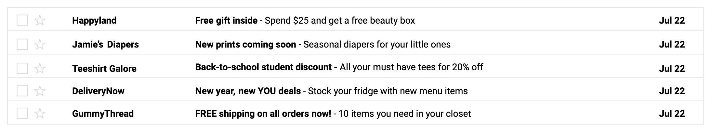

**Cuerpo del correo electrónico:**

El cuerpo del correo electrónico es donde estará la mayor parte del contenido. Puedes experimentar con diferentes enfoques
en el cuerpo del correo electrónico, ya que lo que funciona para otras empresas puede no ser adecuado para tu marca.

Al redactar el cuerpo del correo electrónico:

Utiliza la segunda persona. Esto significa escribir tus correos electrónicos como si estuvieras hablando con tu audiencia.
De esta manera, el correo electrónico parecerá personal y específicamente diseñado para tus suscriptores/as. Usar la segunda
persona, o tutear, ayuda a crear la sensación de que quien escribe te está hablando directamente a ti. Esto genera un
sentido de conexión con quienes te leen, haciéndoles sentir que forman parte del mensaje y están involucrados con él. Una
frase como “Aquí hay un descuento para ti” es más poderosa que “Aquí hay un descuento para nuestros/as lectores/as”.

Siempre que sea posible, separa bloques de texto con espacios en blanco. De esta manera, tu correo electrónico no parecerá
abrumador. Trata de ser breve, incluir párrafos cortos y elementos visuales entre el texto.

Incluye una llamada a la acción convincente. Quienes te lean tendrán mayor predisposición a hacer lo que les pidas si lo
haces de forma clara. Si quieres que compren un producto, incentívalos/as para que hagan exactamente eso. En ocasiones, los
correos electrónicos pueden tener varias llamadas a la acción, especialmente en los boletines informativos, donde es
probable que se compartan varios productos, servicios o enlaces.

**Conclusiones principales:**

Escribir contenido persuasivo es una gran parte del marketing por correo electrónico, y lleva tiempo perfeccionarlo. Si
sigues los consejos proporcionados aquí, tendrás muchas más posibilidades de aumentar tus tasas de apertura. Al redactar el
asunto, el texto de vista previa y el cuerpo de un correo electrónico, es importante ser cuidadoso y tener un enfoque
intencional. También es recomendable probar diferentes textos de correo electrónico para ver a qué responde mejor tu
audiencia.

#### Tipos de marketing por correo electrónico: Correos electrónicos promocionales

Hasta ahora, aprendimos mucho sobre el marketing por correo electrónico. Vimos los correos de adquisición, de bienvenida y
boletines informativos. Pero queda mucho que aprender. En este video, hablaremos sobre otro tipo de correos electrónicos,
los promocionales. Los correos promocionales se envían para informar a tus suscriptores/as sobre tus productos o servicios.
Hay muchas razones para enviar correos promocionales. Tal vez porque tu marca está realizando una venta general en todo el
sitio, quieres celebrar los cumpleaños de tus clientes ofreciéndoles 10% de descuento en su pedido, estás conmemorando el
quinto aniversario de tu marca, estás lanzando un nuevo producto, concurso o sorteo o quizá estás ofreciendo contenido
descargable gratuito para unas vacaciones. Independientemente del motivo para enviar tu correo electrónico, los objetivos
siempre serán acelerar el proceso de compra, incentivar a los/las suscriptores/as a tomar acción o atraer nuevas/os clientes
y existentes. Debido a estas metas, los correos electrónicos entran en las etapas de Consideración y Fidelidad del embudo.
Las promociones dan a tus suscriptores/as y clientes una razón para regresar y volver a comprar algo. Como los correos
promocionales pueden presentarse de diferentes maneras, no hay reglas estrictas sobre lo que deberían implicar o incluir.
Aun así, he aquí algunos consejos para usar como guía al redactar un correo promocional. Mantén el enfoque del correo en la
promoción, mantenlo conciso y anuncia la promoción en el asunto. Pon el foco de tu correo electrónico en la promoción en sí,
en lugar centrarlo en las características o detalles del producto. Si hay más características o detalles que esperas
incluir, vincúlalos a los productos para que tu audiencia haga clic a través de una página de destino y siga leyendo. El
correo promocional debe ser breve, así que hazlo corto y conciso. El cuerpo se refiere al texto en el contenido principal de
tu correo electrónico. Una persona debe poder leer tu correo promocional en apenas un par de minutos. Además, tu público no
necesita leer mil palabras sobre tu marca y sus productos o servicios porque este ya tiene algún interés en los productos de
tu marca, y el texto del cuerpo no es el único elemento a considerar. Los estudios de marketing muestran que el 47% de los
correos se abren en función de solo su asunto, lo que significa que debes invertir un tiempo considerable en elaborar el
asunto. Asegúrate de que comunique la promoción. Esto no significa que siempre tiene que decir "código de 20% de descuento
en el interior", pero debería dar una pista de que hay algo único y relevante dentro, relacionado con la promoción. Incluir
la promoción en tu asunto da una idea al público de qué esperar. Esto puede generar entusiasmo, crear anticipación, y, por
último, hacer campañas más efectivas. ¿Cómo es un ejemplo de buen correo promocional? Este ejemplo de una app de entrega de
comida a domicilio es un excelente correo promocional porque sigue las reglas que describí. No hay detalles innecesarios
sobre los productos o la propia marca. El foco del correo es el banner de arriba, con un código para una entrega gratuita en
una orden de scones frescos de la panadería de la cadena. Si decides tomar esta oferta, solo tienes que hacer clic en el
botón "Ordenar ahora" para concretar la compra. El asunto, entrega gratuita de algo dulce, deja claro que hay algún tipo de
promoción dentro del correo. Repasemos rápidamente: al crear un correo promocional, debes asegurar que tu correo electrónico
se centre en la promoción en sí más que en el producto. Deberá ser breve y conciso, y tendrás que mencionar la promoción en
el asunto. Ahora, que entiendes la importancia de un correo promocional efectivo, mantengamos el ritmo.

### Correos electrónicos que mantienen a las/los clientes

#### Tipos de marketing por correo electrónico: Correos electrónicos de retención

Hasta aquí exploramos los correos electrónicos de adquisición, de bienvenida, promocionales, y boletines informativos. ¿Cuál
es el siguiente paso? Aquí exploraremos los correos de retención. Son aquellos que se envían a un cliente actual con la
intención de mantenerlo como cliente. En los correos de retención es clave tener en cuenta el momento. Cuando se envían en
el momento justo, son muy eficaces y, si te comprometes a enviarlos, puedes hacer que más clientes vuelvan una y otra vez.
Por eso entran en la etapa de Fidelidad del embudo de marketing. En esta etapa tratas con clientes activos. El objetivo es
mantener contentos a los clientes, porque, si lo están, tu marca también está contenta. Hay muchos tipos de correos que
entran en la etapa de Fidelidad. Por ejemplo, si un cliente coloca un artículo en su carrito online pero no lo compra, esa
empresa envía un correo de seguimiento. Este correo de retención se llama correo electrónico de carrito abandonado, e
incentiva a comprar el artículo dejado. Si después de que un cliente hace una compra, una empresa envía un correo
electrónico de seguimiento pidiendo su opinión sobre su experiencia de compra, también es una forma de correo de retención.
Pedir la opinión de los clientes ayuda a que se sientan escuchados, y asegura que se hagan las mejoras necesarias. Si una
empresa nota que los usuarios no interactúan con sus boletines o promociones, pueden enviarles una oferta especial para
incentivarlos a interactuar un poco más. Eso también es un correo de retención. Sin importar qué tipo de correo de retención
envíes, hay cosas a tener en cuenta al redactarlos. Recuerda, el objetivo es que los clientes actuales regresen. Hay cosas
que puedes hacer para asegurar que vuelvan. El correo de retención debe incluir: personalización, una clara llamada a la
acción, y un gran uso del lenguaje empático y coloquial. Tal vez te preguntes qué es personalización. En marketing por
correo, significa que conoces a tus clientes y escribes tus correos electrónicos basándote en quiénes son. Muchas
herramientas de marketing por correo electrónico te permiten segmentar tu lista, para que desarrolles contenido diseñado
para ciertos grupos de personas. Lo veremos más adelante, pero, por ahora, la segmentación consiste en dividir una lista de
contactos en grupos más pequeños según criterios para que el correo sea relevante para los suscriptores. Después de
segmentar tu lista de contactos, ¿cómo desarrollas ese contenido personalizado? A veces, es tan simple como usar el nombre
en los correos y en los asuntos, un truco que brindan las herramientas de automatización. Otra gran táctica es enviar un
correo de seguimiento con consejos de uso del producto que se compró. Muestra que te preocupas por cada cliente, y que
puedes anticipar sus desafíos y necesidades. Deja en claro lo que buscas en tus correos electrónicos, con una llamada a la
acción obvia. ¿Esperas que tus clientes vuelvan a comprar? Puedes dejar un código de descuento. ¿Envías un correo a clientes
existentes sobre el nuevo programa de fidelización? Pide que se registren. Una de las mejores formas de mantener a un
cliente es escuchándolo y apoyándolo. Es igual para seres queridos, colegas y todos con los que tenemos contacto. La empatía
es igual de importante para la relación de la marca con el cliente. Preguntar "¿Qué te pareció y cómo fue tu experiencia?"
hace que el cliente sepa que su opinión importa, y eso podría hacer que regrese. Ahora bien, es posible usar este tipo de
expresiones en un correo que puedes enviar para recibir feedback. Agregar "¿Qué te pareció?" al final del correo con una
escala a elegir del 1 al 10 también funciona. Además de recibir comentarios, asegúrate de decir "gracias" para dejar en
claro que estás agradecido. Ayúdalos a sentirse apreciados, porque tú estás agradecido por sus compras, y ellos deberían
saberlo. Veamos un ejemplo de un buen correo de retención. Este correo de retención de un sitio de alquiler y alojamiento
vacacional es muy bueno, e incluye lo visto. Para empezar, es personalizado, porque crearon aspectos destacados
individualizados para todos los hospedajes. Cuando un cliente hace clic en el botón, "Get your host highlights", se lo
enviará a su perfil para ver un aspecto destacado que es específico para él. Incluyen una llamada a la acción clara, que es
para que el cliente haga clic en el botón, y vea lo destacado. Por último, el tono y estilo de escritura es increíblemente
amigable, y muestra mucha gratitud. Con frases como, "no podemos agradecerte lo suficiente", demuestran que tu marca
reconoce qué afortunada es al tener a cada uno de sus clientes. Ahí lo tienes. Personalizaron el correo, incluyeron una
llamada a la acción clara, y usaron un lenguaje empático y amigable, todas las claves para un correo electrónico efectivo.

#### Ejemplo de actividad: Escribe asuntos y texto de vista previa

Evaluación del ejemplo

Compara el ejemplo con los asuntos y textos de vista previa completados. Revisa tu trabajo utilizando cada uno de los
criterios del ejemplo. ¿Qué hiciste bien? ¿En qué aspectos podrías mejorar? Las respuestas a estas preguntas te servirán de
guía, a medida que avances en el curso.

Nota: El ejemplo representa una posible forma de completar la actividad. Es probable que tus asuntos y textos de vista
previa difieran en ciertos aspectos. Lo importante es que sean claros, concisos y atractivos para que las personas abran los
correos electrónicos que les envías.

Revisemos cada uno de los tres correos electrónicos:

Correo 1: Boletín informativo de una clínica veterinaria

Asunto: Qué saber sobre la enfermedad dental de las mascotas

Al igual que el cuerpo del correo electrónico, el asunto es directo e informativo. Identifica de manera precisa el tema del
boletín informativo y sugiere que la información que contiene es relevante para las personas que tienen una mascota y para
quienes reciben el correo.

Texto de vista previa: Además: Los mejores consejos para mantener los dientes de tu mascota saludables

El texto de la vista previa se alinea con el asunto al indicar que existen formas de tratar o prevenir la enfermedad dental
de las mascotas. Al prometer compartir información importante, incentiva a quien recibe el correo a abrir el mensaje.

Correo 2: Correo electrónico promocional de masaje terapéuticof

Asunto: Tómate un tiempo para ti, {{ fname }}

El asunto coincide con el tono de conversación del mensaje. Al alentar a las personas a reservar tiempo para sí mismas, se
las incentiva a aprovechar el descuento de masajes que se presenta en el mensaje. Además, la inclusión del nombre del/la
suscriptor/a en el asunto agrega un toque personalizado que resulta apropiado para este tipo de negocio.

Texto de vista previa: Obtén un 20% de descuento en masajes exclusivos en junio

El texto de la vista previa explica una forma en que las personas pueden tomarse un momento para sí mismas, reservando un
masaje exclusivo con descuento. También describe los detalles esenciales de la promoción (qué, cuándo y cuánto), para que
quien recibe el mensaje sepa qué esperar al abrir el correo electrónico.

Correo 3: Correo electrónico de retención de un taller de automóviles

Asunto: Es hora de hacer la revisión de tu automóvil

El asunto es conciso y coincide con el tono, algo formal, del mensaje. También es claro y directo al describir el propósito
del correo electrónico.

Texto de vista previa: Haz una cita hoy

El texto de vista previa coincide con el tono del asunto. También les dice a quienes reciben el mensaje que pueden programar
el servicio requerido a través del correo electrónico, lo que los/las incentiva a abrirlo.

#### Crear correos electrónicos accesibles

Los correos electrónicos son una herramienta de marketing efectiva, pero es esencial asegurarse de que el contenido sea
accesible para todas las audiencias. Esto incluye a las personas con discapacidades sensoriales que afectan uno o más de los
sentidos.

En esta lectura, aprenderás sobre la accesibilidad y conocerás algunas de las prácticas recomendadas para diseñar correos
electrónicos efectivos para todas las audiencias, especialmente para personas con discapacidades relacionadas con la
audición, la visión o ambos sentidos.

*¿Por qué es importante la accesibilidad?*

El término accesibilidad se refiere al diseño de productos, dispositivos, servicios o entornos para personas con
discapacidades. Los correos electrónicos con un diseño poco accesible pueden no transmitir información auditiva y visual.
Por ejemplo, si envías correos electrónicos con videos con información narrada oralmente, podrías incluir una opción para
mostrar subtítulos o una transcripción para garantizar que las personas con discapacidades auditivas puedan entender el
contenido. Los subtítulos o las transcripciones también pueden ser útiles para cualquier persona que se encuentre en un
entorno donde no pueda escuchar fácilmente el sonido, como en un autobús o en un café ruidoso y lleno de gente, o que no
pueda reproducir sonido sin molestar a los demás, como en una biblioteca.

Los correos electrónicos inaccesibles pueden ser confusos o difíciles de entender para muchas personas con discapacidades
auditivas y visuales. Enviar constantemente correos electrónicos inaccesibles puede impactar negativamente en la imagen  de
marca y, a largo plazo, disminuir la tasa de apertura y la tasa de clics. Esto puede traducirse en  una menor interacción y
una oportunidad perdida para obtener ingresos.

*Tecnologías de asistencia:*

Las personas con discapacidades pueden usar tecnologías de asistencia para realizar tareas que, de otro modo, serían
difíciles o imposibles para ellas. Algunos ejemplos de tecnologías de asistencia incluyen inventos conocidos como las sillas
de ruedas, que ayudan a las personas con discapacidades motrices  a trasladarse, y los audífonos, que permiten o mejoran la
audición de las personas.

Existen tecnologías de asistencia menos conocidas para los medios digitales basados en texto e imágenes. Las aplicaciones de
ampliación de pantalla y los lectores de pantalla son las formas más populares de tecnología de asistencia para acceder a
los correos electrónicos. Una aplicación de ampliación de pantalla ayuda a las personas a ver el contenido más fácilmente al
ampliar el texto y las imágenes en una pantalla de computadora o dispositivo digital. Un lector de pantalla es una
aplicación que convierte texto, botones, imágenes y otros elementos de la pantalla en voz o Braille.

Los lectores de pantalla pueden identificar el contenido de un correo electrónico y cualquier código invisible conectado a
los elementos del correo electrónico, como encabezados, imágenes o enlaces. Cuando el lector de pantalla lee en voz alta el
código invisible, identifica el tipo de elemento y la descripción del correo electrónico. Por ejemplo, en los correos
electrónicos es posible agregar un código invisible a las imágenes,  conocido como texto alternativo. El texto alternativo
es una breve descripción escrita de una imagen con el propósito principal de ayudar a las personas con discapacidad visual.
El texto alternativo no se muestra visualmente en el correo electrónico, sino que es leído en voz alta por un lector de
pantalla. Además, los elementos estructurales, como los encabezados, proporcionan a quienes usan el lector de pantalla
información sobre la jerarquía del contenido en el correo electrónico.

Prácticas recomendadas para diseñar correos electrónicos accesibles Los correos electrónicos accesibles proporcionan
claridad y facilidad para que las personas naveguen el contenido del correo electrónico. A continuación, se presentan
algunas prácticas recomendadas y consideraciones que se organizan en categorías  en función de estos elementos.

*Formato:*

Organiza los encabezados cuidadosamente. Los encabezados tienen un código invisible llamado etiquetas de encabezado. Cuando
un lector de pantalla lee un encabezado, describe el tamaño del encabezado.

Evita el uso de palabras en mayúsculas y el uso excesivo de cursiva o subrayado. Esto puede dificultar el procesamiento de
la información por los lectores de pantalla, lo que significa que la información no se está comunicando con claridad.

*Fuentes:*

El tamaño de la fuente de texto debe ser de al menos 14. Las fuentes pequeñas pueden ser difíciles de leer para las personas
con visión reducida. Las fuentes más grandes permiten identificar caracteres y palabras más fácilmente. Para los
encabezados, considera agregar negrita o usar una fuente más grande.

Usa fuentes simples. Las fuentes sin serifas o trazos decorativos al final del tallo de una letra se llaman fuentes sans
serif. Estas tipografías tienen un estilo minimalista, suelen incorporar un espaciado de letras más amplio y son más fáciles
de leer. Esto es útil para las personas con visión reducida u otros tipos de discapacidades de procesamiento visual, como la
dislexia.

Ten cuidado al usar emoticones. Un emoticón es una pequeña ilustración basada en texto utilizada en mensajes electrónicos y
páginas web. Si bien pueden ser visualmente interesantes, pueden ser difíciles de entender y de ver para quienes tienen
alguna discapacidad visual. Por esta razón, evita el uso de emoticones en los asuntos y para representar información
importante.

*Colores:*

Utiliza colores contrastantes para el texto y el fondo. Tener un contraste significativo entre los colores del texto y del
fondo ayuda a las personas con visión reducida a identificar las palabras. La combinación más efectiva es el texto negro
sobre fondo blanco.

No te apoyes únicamente en los colores para comunicar el significado. Apoyarte únicamente en colores específicos de texto o
imagen para comunicar un mensaje puede ser confuso para las personas daltónicas.

*Imágenes:*

Utiliza texto en las imágenes solo si es necesario. Utilizar el texto en las imágenes como el único método para transmitir
información importante puede ser confuso para las personas con visión reducida.

Incluye texto alternativo en todas las imágenes que sean necesarias para transmitir tu mensaje. Si una imagen es
informativa, procesable o necesaria para la experiencia del usuario/a, incluye texto alternativo preciso que describa la
imagen.

Omite el texto alternativo para las imágenes decorativas. Incluir texto alternativo para elementos decorativos como
logotipos, imágenes de estilo de vida e íconos puede ser confuso para quienes utilizan lectores de pantalla.

*Enlaces:*

Asegúrate de que el propósito del texto con hipervínculo sea claro. En el texto con hipervínculo, declaraciones como “Haz
clic aquí”, “Accede” y “Comienza ya” hacen que un correo electrónico sea difícil de entender cuando se usa un lector de
pantalla. En su lugar, usa un lenguaje que denote acción. Por ejemplo, el texto con hipervínculo para una tienda minorista
en línea podría ser “Más información sobre nuestros productos”, en lugar de “Haz clic aquí”.

**Conclusiones principales:**

Considerar las prácticas recomendadas para la accesibilidad es esencial para que puedas diseñar correos electrónicos que
sean útiles para toda tu audiencia. Asegúrate siempre de tomarte el tiempo necesario para verificar que tu diseño de correo
electrónico sea accesible. Es posible hacerlo probándolo con la herramienta de lector de pantalla, la cual se incluye en la
mayoría de las computadoras en la pestaña de accesibilidad, o utilizando un verificador de accesibilidad en línea.

#### Correo no deseado (spam): Cuándo no enviar correos electrónicos

Enviar correos electrónicos a tu lista de suscriptores/as con demasiada frecuencia puede impactar negativamente en tu
negocio. ¿Te has preguntado cada cuánto tus suscriptores/as quieren recibir un correo electrónico? En esta lectura,
aprenderás a determinar la frecuencia adecuada de envíos para tu negocio.

**Consideraciones a la hora de establecer la frecuencia:**

En 2021, se enviaron casi 320 mil millones de correos electrónicos en todo el mundo diariamente. Desde entonces, ese número
sigue aumentando. Asegurarte de que tus suscriptores/as no se sientan abrumados/as o bombardeados/as con correos
electrónicos es una parte importante de tu estrategia de marketing. Debes determinar la frecuencia de envíos con una
cuidadosa consideración. Si envías correos electrónicos a tus suscriptores/as todos los días y ellos están tratando de
reducir la cantidad que reciben en su bandeja de entrada, es posible que quieran cancelar la suscripción.

Cuando evalúes la frecuencia con la que enviarás los correos electrónicos a tus suscriptores/as, plantéate las siguientes
preguntas:

¿Cuántos suscriptores/as hay en tu lista? Determina la frecuencia en función de los siguientes parámetros:

Menos de 500: Envía un correo electrónico una vez al mes.

500–10,000: Envía un correo electrónico una vez por semana.

10,000 o más: Envía correos electrónicos dos veces por semana.

¿Para qué sirve este correo electrónico? Si tu objetivo es dar a conocer algo, como un nuevo producto, es posible que solo
necesites enviar un correo electrónico.

¿Qué tipos de correos electrónicos planeas enviar? Por ejemplo, los boletines informativos se deben enviar con más
frecuencia que los correos electrónicos promocionales sobre ventas o descuentos.

¿Qué tipos de contenido hay en tus correos electrónicos? Si estás incluyendo contenido casi idéntico en varios correos
electrónicos, tal vez no necesitas enviarlos más de una vez. Por ejemplo, si el foco del mensaje se relaciona con la
temporada de descuentos, podrías  enviar un par de correos electrónicos: uno cuando comiencen las rebajas y otro cuando
estén a punto de terminar.

**Pregunta a tu audiencia:**

Según cómo recopiles las direcciones de correo electrónico, puede haber formas de preguntarles a tus suscriptores/as cuáles
son sus preferencias. Por ejemplo, si el registro lo hacen a través de un sitio web, puedes incluir una encuesta rápida
consultándoles con qué frecuencia desean recibir correos electrónicos. Otra alternativa es  que, tras registrarse, les
envíes un correo electrónico de bienvenida preguntándoles. Además, si los/las suscriptores/as seleccionan “Cancelar
suscripción”, podrías incluir una encuesta que les permita optar por recibir correos electrónicos con menos frecuencia (por
ejemplo, una vez al mes, una vez por semana, etc.). Esto puede reducir el número de personas que se den de baja.

**Conclusiones clave:**

Al momento de gestionar la frecuencia de los correos electrónicos, lo último que deseas hacer es abrumar a tus
suscriptores/as, porque esto puede hacer que nunca abran tus correos electrónicos o incluso que cancelen la suscripción.
Antes de comenzar a enviar correos electrónicos, considera el tamaño de tu lista, qué tipos de correos electrónicos
enviarás, qué contenido tendrán y para qué sirven tus correos electrónicos.

### Resumen: Tipos de marketing por correo electrónico

#### Términos y definiciones del curso 1, semana 2

Accesibilidad: Tener en cuenta las diferentes necesidades cuando se crean o modifican productos, servicios o instalaciones, de modo que puedan ser utilizados por cualquier persona, tenga o no una discapacidad.

Aplicación de ampliación de pantalla: Tecnología que ayuda a ver el contenido más fácilmente al ampliar el texto y las imágenes en una pantalla de computadora o dispositivo digital.

Asunto: El primer texto que los destinatarios y las destinatarias ven después del nombre del remitente cuando un correo electrónico llega a su bandeja de entrada.

Boletín informativo: Correo electrónico enviado a un grupo de suscriptores/as de forma regular, que contiene noticias y contenido informativo relevante para la empresa y de interés para la audiencia.

Correo electrónico de adquisición: Correo electrónico enviado para conseguir nuevos/as clientes.

Correo electrónico de bienvenida: Correo electrónico enviado a nuevos/as clientes o suscriptores/as.

Correo electrónico de retención: Correo electrónico enviado a un/a cliente actual con la intención de mantener la relación comercial.

Correo electrónico promocional: Correo electrónico enviado para informar a los/as suscriptores/as acerca de productos o servicios nuevos o existentes.

Cuerpo del correo electrónico: Texto en el contenido principal de un correo electrónico.

Lector de pantalla: Aplicación que convierte texto, botones, imágenes y otros elementos de la pantalla en voz o Braille.

Llamada a la acción (Call to action o CTA): Estímulo que busca inducir a las/los clientes sobre qué hacer a continuación.

Segmentación: Práctica de dividir una lista de suscriptores/as de correo electrónico en grupos más pequeños según criterios como intereses, ubicación o historial de compras.

Texto alternativo: Breve descripción escrita de una imagen con el propósito principal de ayudar a las personas con discapacidad visual.

Texto de correo electrónico (copy de correo electrónico): Texto en el asunto, texto de vista previa y correo electrónico.

Texto de vista previa: Texto junto al asunto de un correo electrónico en la bandeja de entrada que proporciona información adicional sobre lo que hay dentro del correo electrónico.

## Herramientas útiles para el marketing por correo electrónico

### Listas de correo electrónico

#### Te damos la bienvenida a la semana 3 curso 4

Hola de nuevo. Ya comprendes en general el marketing por correo electrónico y el tipo de correos que se utilizan en las
campañas. Ahora, veremos todos lo relacionado con la automatización y cómo escribir correos eficaces. Primero, repasaremos
las mejores prácticas para crear listas de correo electrónico. Conocerás cómo obtener nuevas suscripciones utilizando la Red
de Display de Google, anuncios en Facebook y SEO. Una vez que hayas creado tu lista, la vas a querer segmentar. Lo explicaré
más adelante. En un video anterior vimos que la segmentación es dividir una lista de suscriptores/as en grupos más pequeños
según intereses, ubicación o historial de compras. Hay cuatro formas para categorizar tus listas: geográficas, demográficas,
psicográficas y de comportamiento. Al segmentar tus listas, tendrás los conocimientos y recursos para escribir correos
eficaces y podrás practicar. Te mostraré herramientas de automatización como HubSpot y Mailchimp que facilitarán tu trabajo,
y te ayudarán a evitar errores en tu marketing por correo electrónico y arreglarlos si es necesario. Será una lección con
mucho material para practicar tus nuevas habilidades. Debes familiarizarte con estos conceptos porque como especialista
posiblemente usarás todo esto a diario. ¿Todo listo? Nos vemos en el siguiente video.

#### Crea tu lista de correo

Lo más importante en el marketing por correo electrónico son los/as destinatarios/as. Después de todo, sin una lista, tus
correos no tienen a dónde ir. En este video, descubriremos las tácticas que usan las empresas para crear sus listas. Este
tipo de marketing es más que nada de generación de leads, y su objetivo es recopilar direcciones de correo de clientes
potenciales. Cuando obtienes una dirección, generas un lead que puede convertirse en una venta. Y como el propósito del
marketing por correo es convertir posibles suscriptores/as en clientes, los leads son importantes. Cuando empiezas a generar
leads, construyes tu lista de correo. ¿Qué puedes hacer para obtener leads? Estas son algunas estrategias: avisos en el
sitio web, anuncios de Display en la Red de Display de Google o a través de Creatio, SEMrush y Taboola. Anuncios en redes
como Facebook, SEM, referencias y marketing por correo electrónico. Una forma de crear tu lista gratis es pedir a tus
clientes su correo electrónico en tu sitio web. A las y los especialistas les gusta porque no requiere más presupuesto y
puede marcar la diferencia. Las personas visitan sitios web por alguna razón, y si visitan el tuyo, significa que les
interesa tu marca. Así que es bueno agregar un mensaje en tu página de inicio para que den su correo electrónico. Puedes
ofrecerles algo a cambio, como un código de descuento o contenido gratuito. Un aviso en el sitio web es un banner que pide a
quien lo visita que haga algo. Otra forma es mediante anuncios de Display. Son anuncios en sitios y aplicaciones en forma de
banner compuestos por fotos, texto o videos. En el marketing por correo, deberá incluir el correo electrónico, o un vínculo
a una página de destino para registrarse. Al ingresar un correo, se genera un lead que se agrega a la lista automáticamente.
Los anuncios de Display ayudan a crear listas, pero recuerda que tienen un costo. Hay organizaciones que no tienen
presupuesto para crear listas. En esos casos es mejor usar tácticas que no generan gastos. Puede que trabajes en una empresa
con presupuesto para crear listas. Recuerda que cuando alguien crea un sitio o un blog, puede optar por la Red de Display de
Google, y, de ser así, los anuncios aparecerán en su sitio. Esos son anuncios de Display. Otra forma de conseguir
direcciones de correo para tu lista es con anuncios en redes sociales. Si usas redes sociales, probablemente ya los conoces.
Si no las utilizas, puedes volver al curso anterior para conocer más al respecto. “Anuncios en redes sociales” es un
publicidad de pago en plataformas de redes sociales dirigidas a los/as usuarios/as. Algunos redes ofrecen formatos de
anuncios para generar leads. Por ejemplo, Facebook. Son similares a anuncios de Display con texto, imágenes y una URL que
dirige a un sitio con información o para comprar productos. Sin embargo, tienen un formulario para que las personas envíen
su nombre, correo electrónico, o lo que se elija pedir. Y, en lugar de mostrarse en un sitio web o blog, lo hacen en las
redes sociales. Por ejemplo, si una editorial busca crear una lista de correos con anuncios de Facebook puede dar un
incentivo a quienes se registren, por ejemplo, permitir descargar un capítulo de su libro más reciente sin costo. Para ello,
solo deben registrarse con un correo y aceptar los Términos y condiciones. Ya aprendiste de marketing en buscadores. Pero
veamos cómo se relaciona con tu campaña de marketing por correo. SEM es el aumento de la visibilidad de un sitio en un motor
de búsqueda por medio de anuncios pagados. Si usas google.com para buscar, verás anuncios pagados antes de los resultados
orgánicos. Es un ejemplo de marketing de buscadores. Una forma de crear tu lista con SEM, es incluir un descuento o un
incentivo en tu anuncio, para atraer a quienes se suscriban de inmediato. Otra forma es utilizar SEM para generar leads de
marketing por correo. Así, cada cliente que navegue por un sitio web, podrá ver tu anuncio con el formulario incluido,
completarlo ahí y suscribirse a tu lista. Otra forma de obtener más correos sin costo es confiar en las referencias y
reenvíos de tus clientes. Se trata de información de boca a boca que anima a tus clientes a invitar a familiares, amistades
y contactos a hacerse clientes. Piensa en lo mucho que confías en tu mejor amigo o amiga o en un tu familia. Si te dijeran
que hay algo que te va a gustar les creerías. Las referencias son muy valiosas ya que hay una probabilidad cuatro veces
mayor de que las personas compren algo cuando se lo recomiendan. Si tienes un programa de fidelidad o referencias, puedes
ofrecer puntos, descuentos, o créditos en la próxima compra, a cambio de que compartan un enlace de referencia, o reenvíen
un correo a sus amistades. El objetivo es conseguir nuevas suscripciones y clientes, y las referencias y reenvíos te
ayudarán a lograrlo. Mientras hablamos de cómo crear tu lista, es importante analizar la ética en torno al manejo de la
información de identificación personal de PII. PII es cualquier dato que pueda ayudar a identificar a una persona
específica. Cuando las personas comparten información, es importante generar confianza y usarla solo para el propósito
informado. Cuando comparten información, confían en que tu empresa la usará correctamente. Como especialista en marketing,
debes actualizarte sobre las leyes de tu país relativas a la PII. Ahora, repasemos. Para generar leads o crear tu lista
aplica estas tácticas. Usa avisos de sitio web, anuncios de Display en la Red de Display de Google o por Creatio, SEMrush y
Taboola, anuncios en redes sociales como Facebook, marketing de buscadores, referencias y marketing por correo electrónico.
Veremos más sobre listas en esta sección, así que quédate conmigo.

#### Segmenta tu lista de correo

Si hicieras una fiesta, no invitarías a alguien que supieras que no quiere venir, ¿verdad? Lo mismo pasa si incluyes en tu
lista de correo a quien que no le interesa tu contenido. En este video, conocerás los conceptos de segmentación de listas de
correo y sus beneficios. La segmentación es dividir una lista en grupos más pequeños con base a criterios como intereses,
ubicación o historial de compras. Al hacer la lista, deberás segmentarla. Al usar la segmentación, una empresa podrá ofrecer
contenido relevante a cada grupo de suscriptores/as. Cuanto más personalizado sea el correo, más probable será que guste el
contenido y se generen ventas y fidelidad a la marca. Puedes segmentar tu lista en función de algunos criterios. La mayoría
de las empresas segmentan por geografía, características psicográficas, demográficas y de comportamiento. Reproduce el video
desde ::57 y sigue la transcripción0:57 Veamos qué significa cada una. Al segmentar por geografía, puedes hacerlo por
ubicación, clima, población, idioma o entorno. Esta segmentación se centra en la ubicación de sus suscriptores/as. Si tu
marca ofrece envíos gratis, en todos los pedidos de octubre, pero solo en tu país, debes segmentar por país para que las/los
clientes internacionales no se confundan. Y no querrás enviar un correo en mandarín a un país de habla alemana, ¿cierto? Si
quieres enviar correos en varios idiomas, considera segmentarlos por idioma. Digamos que trabajas para una empresa de ropa
en Asia. Por las diferencias en el clima de una región a otra, tal vez quieras segmentar tus correos por entorno o clima. En
Asia hay muchas regiones geográficas variadas como desierto, selva y tundra. Las/los clientes que viven inviernos fríos,
como en Japón, China, Rusia y Corea les puede interesar el nuevo abrigo de tu empresa. Pero en zonas tropicales, como
Vietnam y Tailandia puede que no. Otra forma de segmentar es por características psicográficas. Se basa en las actividades,
intereses y opiniones de los clientes. Incluye factores como estilos de vida, valores y hobbies. Si usas marketing digital
para un supermercado local, puedes segmentar por preferencias dietéticas. ¿Hay suscriptores/as veganos/as o que prefieran
productos sin gluten? Segmentar de esta manera te ayudará a enviar contenido útil y específico, mientras te aseguras de no
enviar algo poco atractivo u ofensivo. En una compañía de salud y bienestar, sus suscriptores/as ciclistas querrán conocer
más sobre las ciclovías más famosas del mundo. Si tienes suscriptores/as que prefieren correr, podrás enviar una lista de
senderos para correr, gracias a la segmentación. La siguiente categoría para segmentar tu lista es la demografía. Estos
datos incluyen información como edad, género, nivel de ingresos y estado familiar. Segmentar por demografía es excelente
porque se basa en información consistente, y los datos psicográficos están sujetos a cambios frecuentes. Si llevas el
marketing por correo de una empresa de viajes, y tienes una propuesta de escapada romántica querrás incluirla en tu boletín
informativo. Es un ejemplo en el cual es importante saber qué suscriptores/as están en una relación o no, si están
casados/as, viven en pareja, o tienen una familia. En ese caso puedes segmentar por estado familiar. O digamos que una banda
famosa de los 80 vuelve a salir de gira por primera vez en 20 años. La sala de conciertos para la que haces marketing quiere
anunciar que actuarán en su espacio, Sin embargo, puede que a sus suscriptores/as más jóvenes no les interese. Gracias a la
segmentación por grupos de edad solo te diriges a suscriptores/as a los/las que les puede interesar. Finalmente, veamos la
segmentación por datos de comportamiento, que refieren a las acciones que toma o no tu cliente cuando compra en tu sitio
web. Es una de las categorías más importantes, porque te da una idea de cómo un/a cliente se relaciona con tu marca y
producto específico. Los hábitos de compra, de gasto, de navegación, la fidelidad a la marca y la interacción con tu sitio
web son datos para segmentar tu lista en base al comportamiento. En una tienda deportiva, conocer si una persona visita el
sitio por primera vez o hace tiempo que es cliente, te ayudará a enviar el mensaje el indicado. Enviar un correo a un/a
cliente nuevo/a que le de la bienvenida y un 10% de descuento, está perfecto. Para un/a cliente habitual, debes enviar uno
que diga, hola de nuevo, ten 10% de descuento en tus artículos favoritos. Para recompensar a tus clientes frecuentes del
sitio web, segmenta tu lista en función de la fidelidad a la marca. Así, solo tus clientes más fieles recibirán las mejores
ofertas. Antes de continuar, recapitulemos. Vimos cuatro categorías comunes de segmentación en marketing, geográficas,
psicográficas, demográficos y de comportamiento, y que cuando eliges una categoría, puedes desglosarla aún más y dirigirla
al público objetivo de manera más específica.

#### Segmenta listas con Constant Contact

La segmentación es la acción de dividir una lista de suscriptores/as de correo electrónico en grupos más pequeños según
criterios como intereses, ubicación, interacción o historial de compras. Cuando segmentas listas de correo electrónico,
puedes dirigirte y atraer a diferentes públicos para que cada persona obtenga contenido que le resulte relevante, lo que
puede generar mejores resultados para tu negocio.

Cuando envías un correo electrónico, quieres que quienes lo reciben lo abran, lean, interactúen con él y tomen la acción que
quieres que tomen. Si se identifican con el contenido y sienten que les aporta valor de alguna manera, es mucho más probable
que completen esas acciones.

En esta lectura, obtendrás una comprensión general sobre cómo usar una herramienta llamada Constant Contact para segmentar
tus listas.

*Constant Contact:*

Constant Contact es una herramienta de marketing en línea que ofrece muchas funciones. Esta lectura se centra en el uso de
Constant Contact para la segmentación del correo electrónico. Constant Contact ofrece una prueba gratuita de 6 meses para
estudiantes del Certificado de Carrera de Google en Marketing Digital y Comercio Electrónico, de modo que puedan practicar
el uso de la herramienta durante las siguientes dos actividades.

*Segmentación en Constant Contact:*

Para empezar, es importante entender la diferencia entre listas, segmentos y etiquetas. Para obtener más información, mira
este video de Constant Contact: Tutorial: Diferencias entre listas, etiquetas y segmentos. Una vez que comprendas cómo
funcionan las listas, los segmentos y las etiquetas en Constant Contact, puedes comenzar a segmentar.

A continuación, crea una cuenta. Puedes registrarte para la prueba gratuita de 6 meses a través de este enlace. O, si ya
sabes que vas a usar Constant Contact durante un largo periodo, puedes registrarte como un cliente de pago.

Si ya tienes una lista puedes importarla en el programa, si no,  puedes crear una con solo unos pocos contactos. Visita la
página de contactos para comenzar a crear y agregar listas.

Haz clic en “Agregar contactos” para acceder a las diversas formas de sumar personas a tu lista. Si vas a agregar contactos
uno por uno, haz clic en “Crear un contacto nuevo”. Si tienes una hoja de cálculo o un archivo que contenga tus contactos,
puedes cargarlo haciendo clic en “Cargar desde un archivo”. También existen algunas otras opciones.

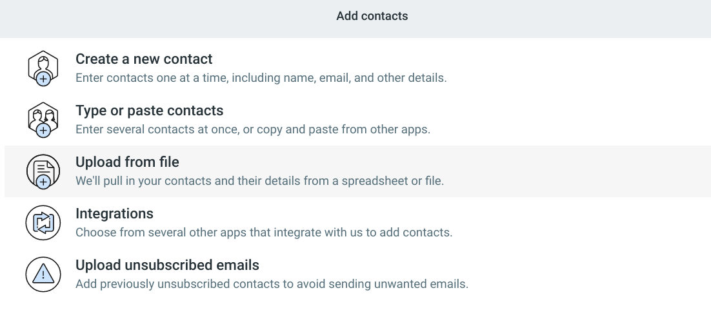

Una vez que hayas creado o cargado tus listas, haz clic en “Segmentos” en la barra de navegación, justo debajo de
“Contactos”. Aquí, puedes comenzar a enviar correos electrónicos segmentados basados en la interacción, o bien puedes hacer
clic en “Crear un segmento”. Se te redirigirá a una nueva página donde podrás asignar un nombre a tus listas y decidir cómo
quieres segmentarlas. Haz clic en el menú desplegable “Agregar un bloque” y selecciona una de las opciones. A partir de ahí,
puedes desglosarlo aún más.

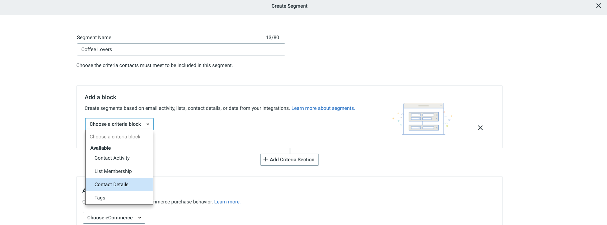

Constant Contact te permite usar identificadores muy específicos. Por ejemplo, si quieres enviar un correo electrónico
promocional a suscriptores/as que aman el café y cumplen años en marzo, puedes hacerlo.

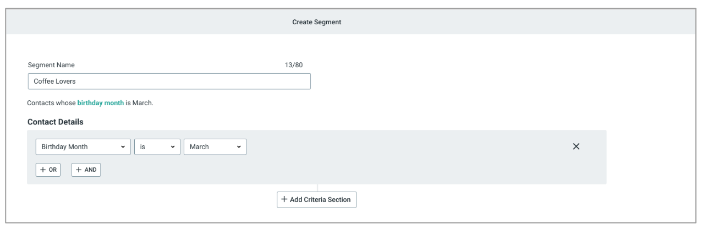

Una vez que hayas hecho los ajustes, haz clic en “Guardar” y se creará la lista. Vuelve al panel “Segmentos” para consultar
las listas que creaste.

**Recursos adicionales:**

Una vez que hayas creado tus segmentos, puedes conocer más acerca de la creación y el envío de correos electrónicos a través
de Constant Contact con el Tutorial:

[Crea un correo electrónico.]([https://](https://knowledgebase.constantcontact.com/email-digital-marketing?catsubsort=true&lang=es&t=tutorial#Create_Add_Content))

Para obtener más información sobre otras funciones, como la segmentación por clic, mira el Tutorial:

[Uso de la segmentación por clic en un correo electrónico.]([https://](https://knowledgebase.constantcontact.com/email-digital-marketing?catsubsort=true&lang=es&t=tutorial#Segment_Your_Lists))

#### Actividad: Segmenta una lista de correo electrónico con Constant Contact

Compara el ejemplo con tu lista de correo electrónico segmentada. Revisa tu trabajo usando cada uno de los criterios del
ejemplo. ¿Qué hiciste bien? ¿Qué puedes mejorar? Usa las respuestas a estas preguntas como guía a medida que avanzas en el
curso.

Tu cuenta de Constant Contact debe contener lo siguiente:

Una lista de contactos cargados desde la hoja de cálculo “Lista de contactos”

Un nuevo campo personalizado creado para el rango de edad elegido, de modo que los títulos de todos los encabezados de
columna en la hoja de cálculo coincidan con los nombres de campo correspondientes

Una lista de correo electrónico a la que hayas asignado un nombre para facilitar la identificación de los contactos que
contiene la lista

Tres segmentos de lista que contengan los siguientes datos de contacto:

Personas que viven en estados del suroeste de Estado Unidos (California, Nuevo México, Arizona, Nevada, Texas o Utah)

Personas que tienen entre 36 y 55 años (36–45 o 46–55)

Personas que cumplen años en abril

### Cómo escribir un correo electrónico eficaz

#### Escribe correos electrónicos efectivos

Si bien ahora los correos de marketing se enfocan más en el diseño, lo más importante sigue siendo el contenido. Si creas el
mejor diseño, pero el texto publicitario no es convincente, informativo o no agrega valor, no será útil para quien lo lea.
Si no sabes por dónde empezar, no te preocupes. Escribir correos requiere de práctica. En esta sección verás algunas de las
mejores prácticas y sugerencias que te ayudarán a mejorar. Hablemos de la línea de asunto. Es lo primero que se leerá antes
de entrar al correo electrónico. Entonces, lo más importante es que responda a la pregunta: ¿qué ofreces? Al tratarse de tu
línea de asunto, prioriza la claridad y no el atractivo. Y si crees que es clara, puedes agregar un poco de emoción. Por
ejemplo, si tengo una empresa de audiolibros y podcast, el propósito de su correo es presentar el negocio al público.
Entonces me pregunto, ¿qué ofrezco y cómo puedo contarlo con claridad? La línea de asunto puede decir algo como: Libros para
tus oídos, que explica la misión de la empresa de forma concisa. O, Amantes de los libros, acá estamos para que quede claro
cuál es el público objetivo de la empresa. Pasemos al cuerpo del mensaje. El cuerpo del mensaje es el texto con el contenido
principal del correo. Debes considerar lo siguiente. ¿Cómo ayudará el contenido a quien lo lee? ¿Qué historias puedes
contarles? Después de responder esas preguntas prioriza escribir en segunda persona, personaliza el correo electrónico,
habla de los beneficios en lugar de las características y sé breve. Asegúrate de dirigirte directamente a tus lectores/as
usando la segunda persona. La segunda persona se usa para dar instrucciones, ofrecer consejos o brindar una explicación.
Significa que siempre usarás los pronombres, tú, tu, y tuyo, como yo lo estoy haciendo ahora. La única vez en la que no te
referirás a tu público con tú, tu o tuyo, será cuando uses su nombre. Las herramientas de automatización te permiten una
etiqueta de combinación o personalizada para que los correos electrónicos sean más personales. Una etiqueta de combinación
(merge) o de personalización es un código para insertar datos únicos del/a usuario/a de su lista de correo en correos. Estas
etiquetas variarán en función de qué programas uses. Sin entrar en detalles, es tan simple como escribir dos corchetes, F,
el nombre y dos corchetes más para que el programa incluya el nombre del/a lector/a. Si hablamos del cuerpo del mensaje de
mi empresa, Escribiría: Hola, dos corchetes, espacio, F, nombre, espacio, dos corchetes, ¿Cuál es tu libro favorito? Lo
tenemos. Y si la persona se llama Angélica, verá, Hola, Angélica, ¿cuál es tu libro favorito? Lo tenemos. Después de crear
un título claro e ingenioso y de personalizar el primer mensaje, debo explicarle quien lee por qué le puede interesar mi
empresa. Puedo hacerlo hablando de los beneficios en lugar de las características del producto o servicio. Así, el cuerpo
del mensaje podría decir Hola, Angélica. ¿Cuál es tu libro favorito? Lo tenemos. Si te gustaría escuchar tus libros, cuenta
con nosotros. Escúchalos camino al trabajo o en el gimnasio, o cuando quieras, te lo mereces. Por último, debes ser breve.
No tienes que dar detalles específicos sobre tu empresa, producto o servicio. Un correo electrónico corto y conciso
mantendrá el interés de quien lo recibe sin que sienta que debe leer mucho. Después del cuerpo, incluye una llamada a la
acción. Puede ser un botón para probar un producto o visitar tu sitio web. Para generar confianza, al final del correo
electrónico incluye un botón que diga: Pruébalo gratis ahora. Tenemos actividades para que puedas practicar, pero te sugiero
que lo hagas por tu cuenta. Es divertido. Mientras, recuerda que para tu línea de asunto, pregúntate qué ofreces a los/as
lectores/as. Mientras escribes, pregúntate ¿Cómo ayuda esto a tus lectores/as? ¿Qué historias puedes contarles? Y concluye
con una llamada a la acción clara de lo que quieres que hagan. Nos vemos aquí más tarde.

#### Más consejos para escribir correos electrónicos efectivos

Redactar un correo electrónico perfecto puede ser una tarea difícil, por mucha experiencia que tengas en marketing digital.
Es una habilidad que requiere mucha práctica, y pruebas hasta llegar a descubrir qué le gusta a tu público. A medida que
aprendas sobre la creación de correos electrónicos eficaces en esta lección, ten en cuenta que te llevará tiempo llegar a
dominar la redacción de correos electrónicos de marketing. Si crees que ya tienes lo que hay que tener para escribir un buen
correo electrónico, utiliza estos contenidos para perfeccionar aún más tus habilidades.

**El propósito de tu correo electrónico:**

Cuando te prepares para enviar correos electrónicos a tus suscriptores/as, debes tener un propósito en mente. Para empezar,
pregúntate por qué estás enviando un correo electrónico. Quizás es para anunciar el lanzamiento de un producto nuevo, educar
a las personas mediante consejos y trucos relevantes, ofrecer un código de descuento o anunciar una promoción, entre muchas
otras razones. Asegúrate de que haya una motivación detrás de cada correo electrónico. Hacerlo te permitirá darle más
contexto. Si sabes por qué quieres enviarlo, te resultará más fácil decidir qué vas a escribir.

**La narrativa en tu correo electrónico:**

Ahora que conoces la importancia de tener un propósito detrás de tu correo electrónico, puedes decidir cómo debería ser la
narrativa. No hay problema si no tienes mucha experiencia en redacción, narración o marketing. Lo que deberás hacer es
pensar cada correo desde la perspectiva de tus lectores/as. Pregúntate: “¿Qué tipo de narrativa quieren leer?”.

Si estás enviando un correo electrónico para anunciar el lanzamiento de un producto, una buena opción será contar la
historia de cómo surgió la idea. ¿A quién se le ocurrió la idea del producto? ¿Qué motivó su creación? ¿Cuánto tiempo llevó
hacerlo? ¿Qué problema viene a resolver? Considera agregar todos estos detalles en el correo, de modo que a quien lo lea le
interese la narrativa y se identifique con ella de alguna manera.

Si tu objetivo es educar mediante un boletín informativo semanal que incluya consejos, trucos, usos de productos, artículos
y más, trata de desarrollar un tema para cada semana. Este tema le dará a tu correo electrónico una narrativa general.
Utiliza recursos y enlaces internos y externos relacionados, para que el boletín informativo sea coherente.

Si estás anunciando una promoción en tu sitio web, quizás te convenga explicar a qué se debe la promoción y en qué
beneficiará a quien lo lee. ¿Estás celebrando el cumpleaños de la empresa u otro día festivo? ¿Estás tratando de liquidar el
inventario actual para poder traer productos nuevos? ¿Es una promoción de fin de temporada? Crear una narrativa sobre los
motivos de la promoción puede ayudarte a convertir clientes potenciales en clientes fieles.

**El tono de tu correo electrónico:**

El tono de tu correo electrónico variará según el propósito y la narrativa. A medida que reflexiones sobre ello, piensa cuál
es el tono que se adapta mejor a estos dos factores. El tono siempre debe ser cortés y el contenido útil, pero no dudes en
agregar algunas otras cualidades en función de tu objetivo.

Volviendo a los ejemplos anteriores, si está anunciando el lanzamiento de un nuevo producto, considera usar un tono
divertido y entusiasta, e incluye un lenguaje que entusiasme a quien lo lea.

Para tu boletín informativo semanal educativo, considera usar un tono profesional y simple. Para comunicar que eres
especialista en este tema, puedes usar un lenguaje que te confiera autoridad y credibilidad.

Si estás anunciando una promoción o el cumpleaños de tu marca, tal vez tu tono sea animado y agradecido. Puedes usar un
lenguaje que muestre gratitud hacia tus clientes.

Consejo: Leer tus correos electrónicos en voz alta te ayudará a entender lo que sienten las personas al leerlo. Además,
podrás decidir si te gusta el tono que estás usando.

Nota: Independientemente de tu propósito y tu narrativa, tienes que asegurarte de que el tono se adapte a la voz de tu marca
para que a quien lo lea le resulte familiar y se sienta a gusto.

**Conclusiones clave:**

Determinar el propósito, la narrativa y el tono del correo electrónico antes de comenzar a escribir te ayudará a mantener el
rumbo mientras lo haces. A medida que lo redactes, debes volver al propósito, la narrativa y el tono con los que empezaste y
asegurarte de que el texto siga alineado con ellos.

#### Actividad: escribe un correo electrónico de retención efectivo

Evaluación del ejemplo

Compara el ejemplo con el correo electrónico de retención que completaste. Revisa tu trabajo usando cada uno de los
criterios del ejemplo. ¿Qué hiciste bien? ¿En qué aspectos puedes mejorar? Usa las respuestas a estas preguntas como guía a
medida que avanzas en el curso.

Revisa cada sección del correo electrónico:

El asunto dice qué ofreces y capta la atención.

El cuerpo incluye un lenguaje personalizado y atractivo que presenta la aplicación. Describe sus características, incluye la
prueba gratuita que se ofrece y sus beneficios. Es claro, conciso, coloquial y se dirige a quien lo lee en segunda persona.

La llamada a la acción dice qué hacer a continuación, según el objetivo de la campaña. Tiene una longitud de dos a cinco
palabras y está formateada de modo que destaque.

El cierre es sincero y expresa tu gratitud por el interés demostrado.

### Herramientas para marketing por correo electrónico

#### Herramientas útiles para el marketing por correo electrónico curso 4

En marketing digital, la automatización es la clave para el éxito de una campaña. La automatización te ayuda a llegar a tu
público y mostrarle solo el contenido que le gusta. Las herramientas de automatización ayudan a generar leads o a convertir
a extraños en clientes. Con la automatización, se pueden enviar mensajes personalizados a cada persona. La automatización en
el marketing de correos usa software, programas y tecnología para gestionar los procesos automáticamente. La automatización
hace que el proceso de marketing de correo sea más simple. Asegura que tu campaña esté organizada y funcionando, y permanece
en segundo plano para que puedas enfocarte en otras tareas. La automatización impactó en nuestra vida de muchas maneras.
Cuando conduces un auto en lugar de caminar, administras tu dinero con un software en vez de manualmente, lavas ropa en una
máquina y no a mano, o haces cualquier otra cosa de tu vida cotidiana. La automatización simplifica la vida, es igual con el
marketing por correo. Como especialista, debes familiarizarte con las herramientas, porque son básicas para el éxito de tu
campaña. Esto se debe en parte a que se encargan de que tus correos electrónicos no pierdan tu toque personal. Con la
automatización, puedes rastrear tus correos fácilmente. Y la clave para el éxito es qué tan específicos pueden ser tus
correos. Con la automatización, puedes crear eficazmente tu lista, segmentarla, enviar correo de bienvenida y de adquisición
a nuevos/as suscriptores/as, hacer un seguimiento con boletines informativos, correos promocionales y de retención usando
plantillas, y seguir las interacciones y el comportamiento de cada suscriptor/a. Y según la herramienta que use tu
organización, todas esas capacidades, acciones, ideas y más estarán en el mismo lugar: tu herramienta de automatización. Más
adelante, aprenderás sobre herramientas de automatización específicas como Hubspot, Mailchimp y Salesforce, pero hay muchas
más opciones para automatizar el marketing. Sin importar cuál uses, todas las herramientas son importantes y te ayudarán en
tu marketing por correo electrónico.

#### Cómo elegir una herramienta de marketing por correo electrónico

Como en otros trabajos, en el marketing por correo hay desafíos que resolver. ¿Qué plantillas usar para tu campaña? ¿Qué
diseño? ¿Qué tono usar en los correos electrónicos? ¿Cómo tratar cada aspecto de tu campaña de marketing por correo, enviar
un gran volumen de correos y dar seguimiento a todo? Por suerte, hay herramientas que agilizan el proceso. Herramientas de
automatización como HubSpot, Mailchimp y Salesforce son opciones para enviar correos. Aunque aún debes profundizar en el
proceso de automatización, estas herramientas harán mucho por ti manteniéndose en segundo plano, y te permitirán
concentrarte en otros aspectos, como la planificación y los textos publicitarios. En este video, verás una introducción a
algunas herramientas líderes en la industria. Hablaré de HubSpot, Mailchimp y Salesforce Marketing Cloud. Vamos. HubSpot es
una de las herramientas más comunes para la automatización debido a su versión sin costo que ofrece funciones robustas. A
través de la personalización, puedes ofrecer diferentes experiencias con base en tu cliente tipo y público clave. Al ser
personalizable, HubSpot permite pruebas A/B efectivas y marketing por correo electrónico, invaluables al momento de
descubrir con qué correos electrónicos interactúan los/las clientes. Otra herramienta de automatización es Mailchimp por su
interfaz de usuario y editor de plantillas de correo, hace de la automatización un proceso eficaz. Sus herramientas incluyen
recorridos preconstruidos, que ofrecen flujos de trabajo personalizables para los casos más comunes de automatización.
Salesforce Marketing Cloud es líder en la industria de muchas maneras. Cuando se trata de automatización, la plataforma
Salesforce es elegida porque ofrece una personalización avanzada. Es un poco más compleja que las demás, pero tiene más
capacidades como la personalización de la interfaz. Esta es una mirada general de algunas herramientas de automatización de
marketing de correo electrónico. Profundizaremos en las siguientes lecturas. Espero que ya tengas las bases para entender
los pros y los contras de cada una. Y si te unes a un organización que usa una herramienta que no conozcas, no te preocupes,
podrás aplicar lo que aprendas aquí en muchas otras herramientas de automatización. La forma en que funcionan y el desempeño
son similares. Solo debes conocer sus funciones específicas, y puedes hacerlo visitando sus sitios web.

#### Enviar correos electrónicos en HubSpot

Esta lectura proporciona una comprensión general sobre cómo elaborar un correo electrónico en una herramienta de marketing
digital líder. Su objetivo no es guiarte hasta crear una  campaña de marketing por correo electrónico, sino brindarte una
descripción general de la herramienta. En la parte inferior de esta lectura, hay enlaces a recursos donde podrás obtener más
información sobre ella.

**Funciones de HubSpot:**

HubSpot permite administrar toda la actividad de marketing en un solo lugar. Puedes usar HubSpot para numerosas tareas de
marketing por correo electrónico.

La siguiente imagen ilustra los pasos a seguir para crear una campaña de marketing por correo electrónico con HubSpot. En
primer lugar, estableces un objetivo para tu negocio. A continuación, debes gestionar tu base de datos de contactos y
segmentarla. Luego, creas correos electrónicos personalizados y específicos y decides cuándo cada persona debe recibirlos,
seleccionando el tiempo de espera entre cada correo. Después, pruebas tus correos y analizas el rendimiento.

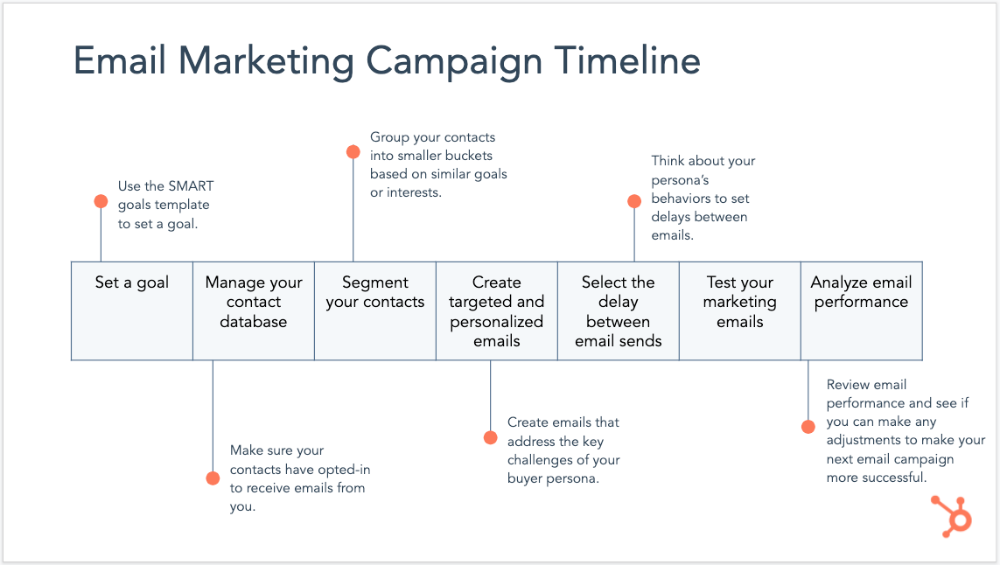

HubSpot ofrece sus herramientas de marketing por correo electrónico sin costo alguno. Crea una cuenta y comienza a
investigar. Luego, sigue leyendo para aprender a crear un correo electrónico en HubSpot.

**Redacción de un correo electrónico:**

Crear un correo electrónico que atraiga a tus suscriptores/as es una parte importante de una campaña exitosa. Herramientas
como HubSpot ayudan a facilitar ese proceso. A continuación, aprenderás sobre las funciones de HubSpot que pueden ayudarte a
redactar un correo electrónico efectivo.

Creación del correo electrónico

Una vez que hayas creado una cuenta en HubSpot y hayas iniciado sesión, ve a Marketing > Correo electrónico.

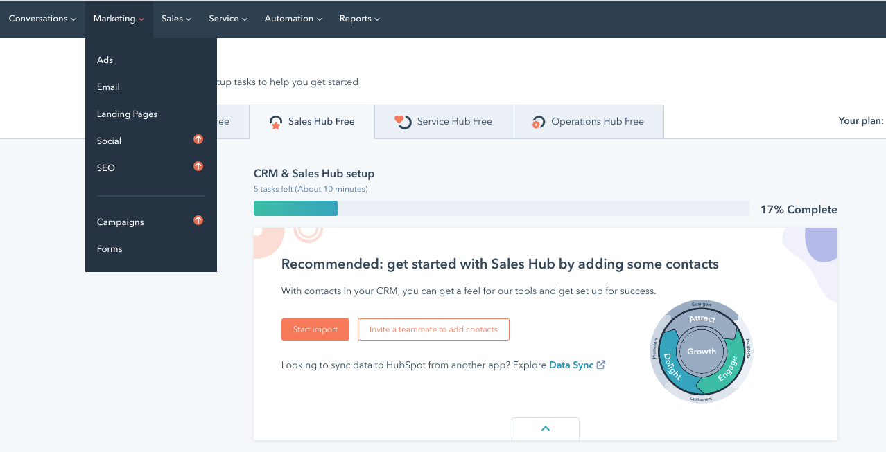

A continuación, haz clic en Crear correo electrónico y selecciona una plantilla. El uso de una plantilla te permite tener un
aspecto uniforme y un diseño profesional en cada uno de tus correos electrónicos. Si optas por usar una plantilla, puedes
personalizarla agregando elementos desde el panel Contenido en el lado izquierdo de la página. Arrastra y suelta imágenes,
botones, íconos de redes sociales, texto, videos y más.

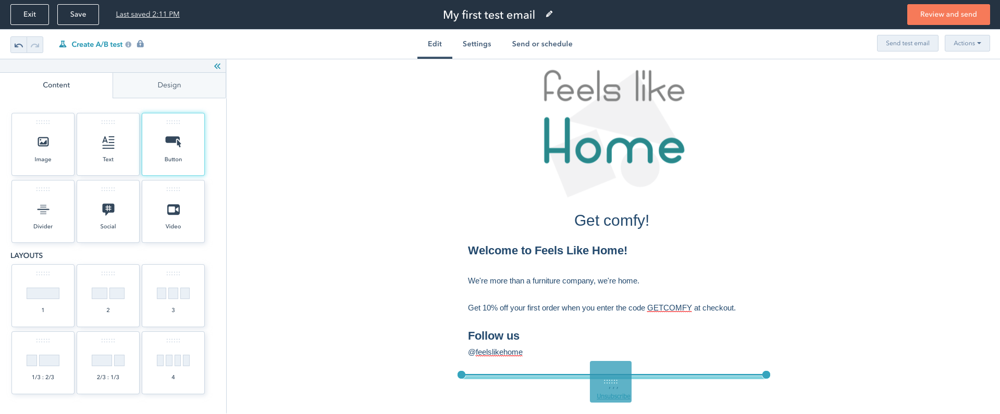

Una vez colocados en la herramienta de editor, cada elemento puede personalizarse y adaptarse para que se vea como tú
quieras. Para mover elementos después de que se hayan colocado en el panel, desplaza el cursor sobre ellos y haz clic en el
borde azul. Luego, arrástralos a nuevas posiciones.

Prueba y explora estas funciones para comprender los elementos personalizables. Por ejemplo, si quieres agregar un botón que
dice “Comprar ahora”, puedes ajustar el texto publicitario, la longitud del botón, el espacio alrededor del botón y mucho
más.

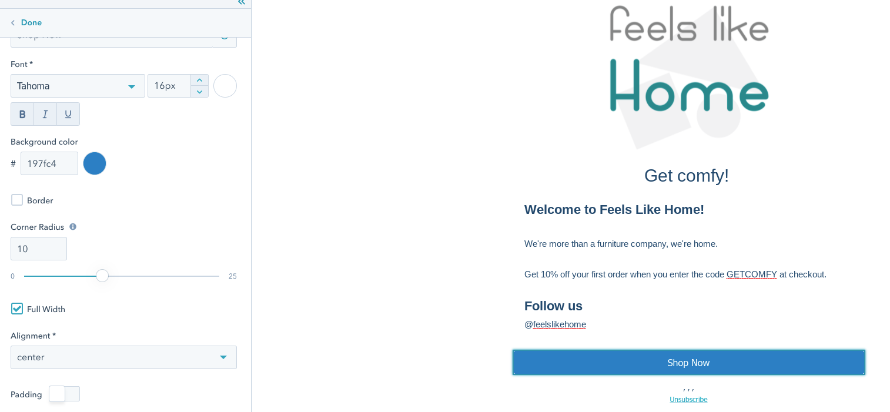

A continuación, haz clic en el panel Diseño y cambia los esquemas de color, las fuentes, los encabezados, el espaciado y
otros elementos. Para que aparezca el panel Configuración de sección, haz clic en el área gris que se encuentra justo fuera
del contenido del correo electrónico. Esto te permitirá agregar varias columnas y personalizar el espaciado y los patrones
para esa sección del correo electrónico.

Mientras que varios elementos se personalizan en el panel izquierdo, el texto se puede personalizar a través de la barra de
herramientas en la parte superior de la página.

Para deshacer cualquier error que hayas cometido, usa el ícono de deshacer en la esquina superior izquierda del editor de
correo electrónico.

Para leer sobre personalización, edición de pies de página de correo electrónico, configuración avanzada y más,
<https://knowledge.hubspot.com/email/create-marketing-emails-in-the-drag-and-drop-email-editor>

**Vista previa y envío del correo electrónico:**

Antes de enviar el correo electrónico, obtén una vista previa haciendo clic en el menú desplegable Acciones y selecciona
Vista previa. En la pestaña Dispositivos, puedes obtener una vista previa del correo electrónico en dispositivos móviles y
de escritorio. Incluso puedes optar por verlo como lo haría cada contacto. Para ello, haz clic en el menú desplegable Vista
previa como contacto específico.

Para leer más acerca del envío de correos electrónicos de prueba y la configuración de pruebas A/B, visita
<https://knowledge.hubspot.com/email/run-an-a/b-test-on-your-marketing-email> Una vez que hayas probado tu correo
electrónico, estará todo listo para enviarlo. En la parte superior de la pantalla, haz clic en el botón Enviar o programar.
Haz clic en el menú desplegable “Enviar a” y agrega las listas a las que quieras enviarlo. Para asegurarte de excluir a las
personas a las que no quieres que se les envíe el correo electrónico, agrégalas en el menú desplegable “No enviar a”.

Puedes enviar tu correo electrónico en el momento, o bien programarlo para más tarde.

#### Actividad: crear un correo electrónico en HubSpot

Evaluación del ejemplo

Compara los ejemplos con las visualizaciones de datos que completaste. Revisa tu trabajo usando cada uno de los criterios
del ejemplo. ¿Qué hiciste bien? ¿En qué aspectos puedes mejorar? Usa las respuestas a estas preguntas como guía a medida que
avanzas en el curso.

Nota: Los ejemplos representan tres versiones posibles del correo electrónico de bienvenida de Odos. Usan algunas de las
opciones de diseño y formato disponibles en el editor de correo electrónico de HubSpot. Es probable que tu correo
electrónico sea diferente en algunos aspectos. Lo importante es que hayas adquirido experiencia en el uso de una herramienta
de marketing por correo electrónico estándar de la industria.

Cada ejemplo incluye el logotipo de Odos, el texto completo del correo electrónico de bienvenida y una o dos imágenes de
archivo que se relacionan con el contenido del mensaje. Los diseños de página son muy similares, pero usan distintas
opciones de formato y diseño gráfico para crear resultados diversos.

Versión 1

Diseño de página

El logo, la primera imagen de archivo y la sección “Odos + Tú = la pareja perfecta” se apilan verticalmente.

El botón de ancho completo “Explorar marcos” actúa como un divisor entre las dos secciones principales del correo
electrónico.

La sección “Más formas de probar Odos” usa el diseño número 2, con dos elementos de texto apilados a la derecha y un solo
elemento de imagen a la izquierda.

Diseño gráfico y formato

La línea de asunto usa un token de personalización (“¡Te damos la bienvenida, Brian!)”.

El correo electrónico utiliza una fuente con serif (Georgia) tanto para los encabezados como para el texto del párrafo.

La paleta de colores audaces se ajusta a la personalidad de la marca y complementa la primera imagen de archivo.

El color del cuerpo es rosa claro, lo que permite que el texto se destaque.

El fondo enmarca el cuerpo del mensaje con un color frambuesa más oscuro.

El patrón de fondo a lunares anima el diseño y coincide con el tono lúdico del mensaje.

Versión 2

Diseño de página

El logo, la única imagen de archivo y la sección “Odos + Tú = la pareja perfecta” se apilan verticalmente.

El botón “Examinar marcos” es de ancho completo y actúa como un divisor entre las dos secciones principales del correo
electrónico.

Un divisor sólido (50% de ancho) crea una separación adicional.

La sección “Más formas de probar Odos” utiliza el diseño número 2, con un solo elemento de texto en cada sección.

Diseño gráfico y formato

La línea de asunto usa un token de personalización y un emoji de gafas (“¡Te damos la bienvenida, Brian! [emoji]”).

El correo electrónico utiliza una fuente sin serif (Trebuchet MS) tanto para los encabezados como para el texto del párrafo.

La paleta de colores complementa el fondo de la imagen de archivo.

El color del cuerpo es blanco, lo que permite que el texto se destaque.

El fondo enmarca el cuerpo del mensaje con un azul grisáceo medio.

El patrón de fondo de confeti anima el diseño y coincide con el tono lúdico del mensaje.

Versión 3

Diseño

El logo, la única imagen de archivo y la sección “Odos + Tú = la pareja perfecta” se apilan verticalmente.

El botón “Examinar marcos” no es de ancho completo.

La sección “Más formas de probar Odos” utiliza el diseño número 2, con un solo elemento de imagen a la derecha y dos
elementos de texto apilados a la izquierda.

Diseño y formato

La línea de asunto usa un token de personalización y un emoji de gafas (“¡Te damos la bienvenida, Brian! [emoji]”).

El correo electrónico utiliza una fuente serif (Merriweather) para los encabezados y una fuente sans serif (Tahoma) para el
texto del párrafo.

La paleta de colores complementa las gafas plegadas en la imagen de archivo.

El color del cuerpo es blanco hacia la parte superior del mensaje y naranja pálido hacia la parte inferior. El cambio de
color divide las dos secciones principales del correo electrónico.

El fondo es de un tono de naranja ligeramente más oscuro.

El patrón de fondo de líneas anima el diseño y coincide con el tono lúdico del mensaje.

#### Enviar correos electrónicos en Mailchimp

En esta lectura, obtendrás una comprensión general sobre cómo elaborar un correo electrónico en una herramienta de marketing digital líder. El objetivo de esta lectura no es guiarte hasta crear una campaña de marketing por correo electrónico. En la parte inferior de esta lectura, hay enlaces a recursos donde podrás obtener más información sobre esta herramienta.

Funciones de Mailchimp

Mailchimp es una plataforma de automatización de marketing que permite a las empresas llegar a su público objetivo a través de campañas de correo electrónico. Mailchimp es líder en la industria por muchas razones. Permite a las/los especialistas en marketing administrar, segmentar y maximizar el público para una mayorpersonalización. También ofrece una herramienta de creación de correos electrónicos personalizables que viene con una gran variedad de plantillas y herramientas de diseño. Por último, contiene herramientas avanzadas de generación de informes que ayudan a realizar un seguimiento del rendimiento y los resultados de la campaña.

Redacción de un correo electrónico

Crear un correo electrónico para interactuar con tus suscriptores/as es una parte importante de una campaña exitosa, y herramientas como Mailchimp ayudan a facilitar ese proceso. En Mailchimp, puedes crear un correo electrónico regular y, luego, mediante una lista de verificación de creación de campañas, agregar destinatarios, ajustar la configuración y elegir tu plantilla. Pero, primero, tendrás que registrarte para obtener una cuenta gratuita <https://login.mailchimp.com/signup/>

Creación del correo electrónico

Una vez que hayas configurado tu cuenta de Mailchimp, haz clic en el botón Crear. Luego, selecciona Correo electrónico. Elige entre Regular, Texto plano o Plantilla. Después, ingresa el nombre de tu campaña.

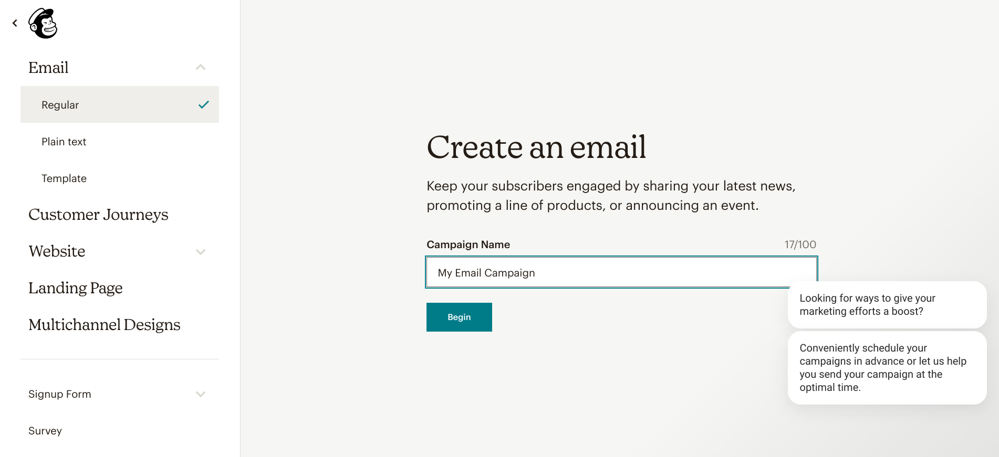

Este nombre solo aparecerá en Mailchimp y ninguno de tus contactos podrá verlo. Haz clic en Comenzar para empezar a crear y completa los pasos. Aparecerá una marca de verificación verde a medida que lo vayas haciendo.

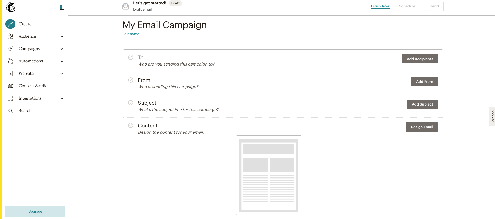

Haz clic en Agregar destinatarios para seleccionar el público al que deseas enviar este correo electrónico. Selecciona tu Público elegido en el menú desplegable y, si quieres agregar un determinado segmento o etiqueta, no dudes en hacerlo desde el menú “Segmento o Etiqueta”. Personaliza este correo electrónico haciendo clic en Personalizar el campo “para”.

Para ajustar el correo electrónico del remitente que aparecerá en las bandejas de entrada, haz clic en Editar el campo “de”. Puedes cambiar el nombre y la dirección de correo electrónico que aparece en los campos Nombre y dirección de correo electrónico si es necesario. Guarda esos ajustes y ve a la sección Asunto.

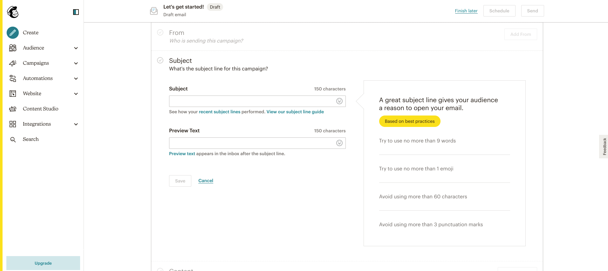

En la sección Asunto, puedes configurar el asunto y previsualizar el texto. Haz clic en Guardar.

A continuación, tendrás que diseñar tu correo electrónico. Haz clic en Diseñar correo electrónico. Mailchimp tiene varias plantillas prediseñadas entre las que puedes elegir haciendo clic en el panel Diseños. Cuando elijas una, podrás personalizar la plantilla para tu marca y tu mensaje. Agrega una nueva imagen haciendo clic en el botón Imagen en el panel de diseño en el lado izquierdo y agrega también elementos como cuadros de texto, videos, imágenes, botones nuevos y más, desplazando el cursor sobre los signos más en la plantilla.

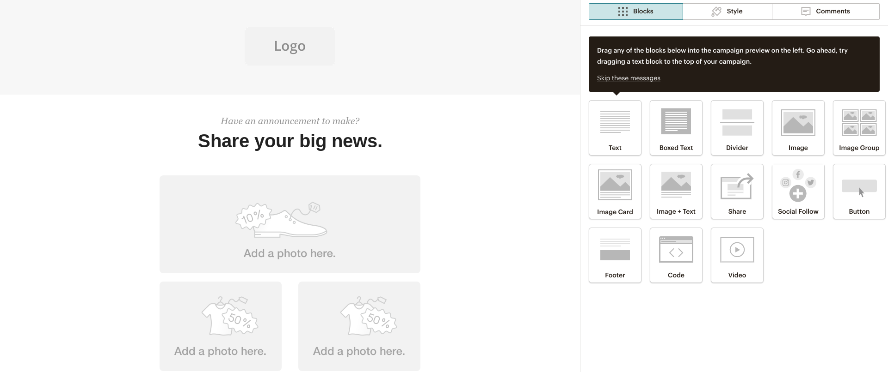

Previsualización y envío del correo electrónico

Para previsualizar tu correo electrónico, haz clic en Vista previa. Mira las imágenes del monitor de la computadora y del teléfono para obtener una vista previa en dispositivos móviles y de escritorio.

Haz clic en Continuar y volverás a la pantalla de la lista de verificación. Controla que haya una verificación verde junto a cada paso para asegurarte de que esté todo listo para enviar el correo. Puedes desplazarte hacia abajo y examinar cualquier otra configuración que quieras cambiar.

Una vez que hayas completado las secciones Para, De, Asunto y Contenido del correo electrónico, puedes optar por programar el envío o enviarlo enseguida. Haz clic en el botón Programar o Enviar. Ten en cuenta que la función de programación solo se incluye con el plan Essentials de Mailchimp o superior.

Para obtener más información sobre las funciones de correo electrónico de Mailchimp, visita los siguientes recursos adicionales.

#### Actividad: Opcional - Configura una campaña en Mailchimp

Compara los ejemplos con las visualizaciones de datos que completaste. Revisa tu trabajo usando cada uno de los criterios
del ejemplo. ¿Qué hiciste bien? ¿En qué aspectos puedes mejorar? Usa las respuestas a estas preguntas como guía a medida que
avanzas en el curso.

Nota: Los ejemplos representan tres versiones posibles del correo electrónico de Homework Helpers. Usan algunas de las
opciones de diseño, formato y diagramación disponibles en el creador de correo electrónico de Mailchimp. Es probable que tu
correo electrónico sea diferente en algunos aspectos. Lo importante es que hayas adquirido experiencia en el uso de una
herramienta de marketing por correo electrónico estándar de la industria.

Cada ejemplo incluye el logotipo de Homework Helpers, el texto completo del correo electrónico y una o dos de las imágenes
proporcionadas. Los diseños de los mensajes son muy similares, pero usan distintas opciones de formato y diseño para crear
resultados diversos.

Versión 1

Diseño de página

El logo, el primer bloque de texto y el botón se apilan verticalmente (usando un diseño de texto).

Para las secciones “Quiénes somos” y “Qué hacemos”, se usa un diseño de texto e imagen.

Las imágenes se recortan en formato cuadrado de modo que se ajusten al diseño.

La sección “Comentarios de los padres” está apilada verticalmente.

Los divisores separan las secciones del mensaje.

Diseño gráfico y formato

El asunto utiliza un emoji (pila de libros).

El correo electrónico usa una fuente sans serif (Lato) tanto para los encabezados como para el texto del párrafo.

Para llamar la atención, el primer botón es más grande que los demás. Los otros botones usan un estilo de contorno, pero
todos tienen forma de píldora.

La paleta de colores audaces se ajusta a la personalidad de la marca y complementa el logo:

El color del cuerpo es verde claro, lo que permite que el texto se destaque.

El fondo enmarca el cuerpo del mensaje con un verde más oscuro.

Versión 2

Diseño de página

A excepción de la última sección, todo el texto y las imágenes se apilan verticalmente (usando tanto texto como diseños de
texto e imagen).

Las imágenes no están recortadas.

La sección “Comentarios de los padres” utiliza un bloque de texto sin formato para el encabezado y un diseño de texto de
columna para los testimonios.

Los divisores separan las secciones del mensaje.

Diseño gráfico y formato

El asunto utiliza un emoji (pila de libros).

El correo electrónico utiliza una fuente sans serif (Arimo) tanto para los encabezados como para el texto del párrafo.

El texto del párrafo tiene un espaciado doble a lo largo del mensaje y usa negritas en las secciones con colores de cuerpo
azules.

Todos los botones son cuadrados y usan un estilo de relleno. Para llamar la atención, el primer botón es más grande que los
demás.

El cuerpo blanco permite que el texto y las imágenes coloridas se destaquen. El fondo enmarca el cuerpo del mensaje con un
gris neutro.

Versión 3

Diseño

Todo el texto y las imágenes se apilan verticalmente (usando texto y diseños de texto e imagen).

Además del logo, en el mensaje se utiliza una imagen sin recortar.

La sección “Comentarios de los padres” utiliza un bloque de texto sin formato para el encabezado y un diseño de texto de
columna para los testimonios.

Un divisor separa las secciones “Quiénes somos” y “Qué hacemos”.

Diseño y formato

En el asunto, se usa un emoji (cuaderno).

El correo electrónico usa una fuente sans serif (Raleway) tanto para los encabezados como para el texto del párrafo.

El primer botón es blanco con texto azul, lo que lo ayuda a destacarse contra el fondo más oscuro. Los otros dos botones son
azules con texto blanco. Todos los botones son redondeados y usan un estilo de relleno.

Los colores de fondo audaces (tonos de cian y azul) separan la sección del cuerpo y se adaptan a la personalidad de la
marca. El fondo es un gris neutro, lo que permite que el cuerpo del mensaje se destaque.

### Errores del marketing por correo electrónico

#### Errores del marketing por correo electrónico curso 4

Aunque el marketing por correo electrónico funciona para mantener actualizados a tus clientes, es importante tener en cuenta
que a veces hay errores. Te daremos algunos consejos para que cuando eso ocurra no afecte la relación con tus
suscriptores/as. Cuando envías correos a tus destinatarios/as, no puedes editarlos en tiempo real. Una vez enviados, están
fuera de tus manos. Algunos errores más comunes son enviar enlaces rotos, un correo a la lista incorrecta un correo
desactualizado, o con errores en la personalización, tipográficos o en el copy. Lo bueno es que puedes prevenir e
identificar errores antes de enviar los correos. Primero hablemos de los enlaces rotos. Es un hipervínculo dirigido a un
sitio web que no existe por alguna razón. Si envías un correo de marketing con enlace a un sitio web, archivos PDF o algo
más y se recibe un mensaje de error, tu enlace está roto. Y para asegurarte de que no suceda verifica dos veces el
hipervínculo antes de enviar el correo. Siempre ayuda tener otra mirada sobre tu correo electrónico. Pide ayuda a colegas
para asegurar que esté bien. Supongamos que envías un enlace a un blog en un correo, pero la URL tenía un error, ¿cómo se
corrige? Puedes redirigir a los/as suscriptores/as para que el enlace con el error los lleve a la URL correcta. O dejarlo y
triplicar la verificación la próxima, porque aún las y los especialistas cometen errores. Otro error común es enviar un
correo a la lista incorrecta Tus listas se segmentarán en función de datos demográficos, de comportamiento, características
psicográficas y geografía. Si quieres enviar un correo a tu lista de personas de 18 a 25 años porque es probable que compren
un artículo determinado, pero sin querer lo enviaste al grupo de 40 a 55 enviaste el correo equivocado. Para evitar que esto
ocurra en el futuro, debes crear algún tipo de control de calidad o proceso de control de calidad (CC) para tus correos de
marketing. El CC es un proceso con el que un negocio busca que la calidad del producto se mantenga o mejore. Crea una lista
de verificación para chequear que usas el formato, contenido y etiquetas correctos y todo lo que quieras controlar. Si
cometes el error de enviar el correo electrónico errado o desactualizado, no te asustes, puedes seguir unos pasos para
arreglarlo. Por supuesto, lo mejor es evitar que ocurra. Para ello debes manejar con fluidez tus herramientas de sistemas
automatizados y software. Sin importar la herramienta que uses, debes conocerla al detalle, para disminuir la probabilidad
de enviar un correo incorrecto. Pero si sucede, para arreglarlo, necesitas enviar un correo electrónico de seguimiento. Tal
vez puedas crear una plantilla de disculpa con la herramienta de automatización, para enviarlo lo antes posible. Deberás
hacerlo relevante para cada situación específica. Digamos que enviaste un correo con una oferta especial de un producto, que
ya estaba agotado porque la oferta había sido la semana anterior. Este error amenaza tu credibilidad, y debes disculparte
con tus clientes. En el correo electrónico de disculpa, tendrás que admitir el error, disculparte y ofrecer algo para
solucionar las cosas. Tu correo de seguimiento puede decir algo como, lo sentimos, nos equivocamos. Enviamos un correo
electrónico sobre un producto en oferta, pero está agotado. Para compensarte, te ofrecemos 10% de descuento en toda la
tienda solo por hoy. Tus suscriptores/as probablemente perdonarán el error y van a apreciar el descuento. Quizás el error
más común de todos es enviar un correo con errores tipográficos. Como otros errores comunes, estos ponen en duda tu
credibilidad, y te perjudican especialmente si se producen en las etiquetas de personalización. Decir: Aquí hay un regalo
para ti, Juan, es mucho más efectivo que escribir mal la etiqueta y que diga, aquí hay un regalo para ti, corchete, nombre,
corchete. Para evitar errores tipográficos, gramaticales o de personalización haz una revisión con un corrector ortográfico
en línea como Grammarly. Lee tus correos varias veces y envíalos a tu casilla para verificar que escribiste bien las
etiquetas de personalización. A veces los correos automatizados terminan en la carpets de spam en lugar de en la bandeja de
entrada. Puede ser porque no te adheriste a las leyes relativas al spam de tu país o porque tu correo electrónico parece
spam. Los correos se pueden marcar como spam si tienen muchas imágenes grandes. Toma nota de esto y primero y envíate un
correo electrónico de prueba y revisa que no tenga demasiadas imágenes. Ya conoces los errores más comunes en el marketing
por correo electrónico Espero que los puedas evitar en tu carrera de especialista en marketing digital.

#### Cómo corregir los errores en el marketing por correo electrónico

Como especialista en marketing digital, cometerás algunos errores como todo el mundo. Pero lo que importa es cómo reaccionas
ante ellos. En esta lectura, aprenderás cómo recuperar la confianza de los/as usuarios/as después de cometer un error.

**Errores en el marketing por correo electrónico:**

En algún momento, como especialista en marketing digital, es probable que envíes correos electrónicos a una gran cantidad de
personas. Esto significa que, si hay un error en tu correo electrónico, varias personas lo perciban. Eso está bien, siempre
y cuando sigas los siguientes pasos para corregir y abordar el error. Luego, cuando obtengas tu primer empleo como
especialista en marketing digital, puedes tener este material a mano y usarlo para resolver algún error.

**Plan de contingencia:**

Aprovecha el conocimiento de especialistas de la empresa.

¿Alguna de las personas del equipo cometieron el mismo error? En ese caso, ¿qué hicieron? Estas personas podrán ofrecerte
valiosos consejos que te ayudarán a resolver el problema.

Considera si debes enviar una versión corregida del correo electrónico.

Un pequeño error de ortografía o un error tipográfico en el correo electrónico quizás no justifican un seguimiento o una
explicación; sin embargo, un error más grave, como una fecha de lanzamiento de producto incorrecta o una fecha de promoción,
sí podría justificarlo.

Si envías un correo electrónico de seguimiento, aclara cuál es el cambio mediante el uso de negritas u otro color de texto.

Si el error fue muy grave, ofrece un incentivo.

Algunos ejemplos de incentivos pueden ser envíos gratuitos, extensión de una promoción, un código de descuento, entre otros.

Si el error es un enlace roto, redirige el enlace incorrecto al correcto lo antes posible.

Esto puede no ser beneficioso para las personas que ya hayan hecho clic en el enlace, pero sí beneficiará a aquellas que aún
no lo hayan hecho.

Si existe la posibilidad de que alguien se haya enojado u ofendido por el mensaje que enviaste, es posible que tengas que
pedir disculpas en las redes sociales o a través de una declaración pública.

Todo dependerá del tamaño de la empresa, la gravedad del error y el protocolo interno si existiera. Piensa si la empresa es
lo suficientemente grande como para tener un plan de acción para situaciones como esta o si es más bien pequeña y, por lo
tanto, la tarea de manejar el problema recae en ti. Una vez que lo determines, puedes tomar las medidas necesarias.

**Conclusiones clave:**

En caso de que envíes un correo electrónico con un error, tendrás que decidir cómo repararlo. La acción que tomes variará
según la situación: la forma en que reacciones a un error tipográfico en tu correo electrónico frente a la forma en que
actúes ante un enlace roto será diferente. Por lo tanto, cuando envíes un correo electrónico, asegúrate de tener un plan de
contingencia completo con anticipación.

#### Actividad: escribe un correo electrónico de disculpa

Compara el ejemplo con el correo electrónico de disculpa que completaste. Revisa tu trabajo usando cada uno de los criterios
del ejemplo. ¿Qué hiciste bien? ¿En qué aspectos puedes mejorar? Usa las respuestas a estas preguntas como guía a medida que
avanzas en el curso.

Nota: El ejemplo representa una forma posible de completar la actividad. Es probable que tu correo electrónico de disculpa
sea diferente en algunos aspectos. Lo importante es que, en el correo, admitas los errores, pidas disculpas a tus
suscriptores/as e intentes corregir la situación.

Revisemos cada parte del mensaje:

**Asunto:**

El asunto aclara que el correo electrónico se envía a modo de seguimiento de un mensaje anterior. También incluye la fecha
de lanzamiento correcta, de manera que las/los clientes puedan obtener esa información incluso si no abren el mensaje.

**Cuerpo del mensaje:**

El cuerpo del mensaje inicia con una disculpa. Explica lo que sucedió, pero también describe acciones concretas que la
empresa tomó para remediar la situación. Además, aclara la fecha de lanzamiento correcta e incluye el enlace a la página
para hacer el pedido anticipado del juego. El formato dirige la atención hacia las correcciones (y la promoción con
descuento) para asegurarse de que quienes lo reciban no dejen de leerlas.

El tono del mensaje es tranquilo, pero sincero. Quien lo escribe usa el tema del juego (los viajes en el tiempo) para hacer
autocrítica con un poco de humor. Es importante destacar, sin embargo, que el humor no eclipsa la disculpa.

**Llamada a la acción:**

La llamada a la acción es breve y describe una acción específica que la persona que lee puede tomar para canjear el
descuento para el pedido anticipado.

**Cierre:**

El cierre expresa aprecio por quienes lo reciben y termina con la promesa de hacerlo mejor en el futuro.

### Revisión: Herramientas útiles para el marketing por correo electrónico

#### Términos y definiciones del curso 4, semana 3

Anuncios en redes sociales: Anuncios pagados en plataformas de redes sociales dirigidos a usuarios/as de redes sociales.

Automatización de marketing: Práctica de usar software, programas y tecnología para crear e implementar aplicaciones para
automatizar tareas de marketing.

Aviso del sitio web: Banner digital que invita a quienes visitan un sitio web a realizar una determinada acción.

Control de calidad: Proceso a través del cual una empresa busca garantizar que la calidad del producto se mantenga o mejore.

Cuerpo del correo electrónico: Texto en el contenido principal de un correo electrónico.

Datos de comportamiento: Información sobre las acciones que toma o no una persona al comprar en un sitio web.

Datos demográficos: Información específica del/la cliente, como edad, identidad de género, ingresos, tamaño de la familia,
ocupación, nivel de educación y ubicación.

Datos psicográficos: Información basada en las actividades, intereses y opiniones de las personas.

Enlace roto: Enlace que conduce a una página web que ya no existe.

Etiqueta de combinación (merge tag): (Consultar la etiqueta de personalización)

Etiqueta de personalización: Código que permite insertar datos de usuario únicos de una lista de correo en los correos
electrónicos.

Generación de leads: Práctica de recopilar la dirección de correo electrónico de un/a cliente potencial.

Marketing de motores de búsqueda (SEM): Consiste en generar tráfico a un sitio web a través de anuncios de pago que aparecen
en los resultados de los buscadores.

Red de Display de Google: Grupo de sitios web, videos y aplicaciones donde pueden aparecer anuncios.

Referencia de clientes: Una iniciativa boca a boca que anima a las personas a presentar a sus familiares, amigos y demás
contactos para que se conviertan en clientes.

Segmentación: Práctica de dividir una lista de suscriptores/as de correo electrónico en grupos más pequeños según criterios
como intereses, ubicación o historial de compras.

Tasa de apertura: Porcentaje de usuarios/as o clientes que abren un correo electrónico.

## Recopilar y analizar datos de campañas de correo electrónico

### Introducción a las métricas

#### Te damos la bienvenida a la semana 4

En esta sección, veremos todos los aspectos de recopilación y análisis de datos de tu campaña marketing por correo
electrónico. Los datos son importantes porque enviar correos electrónicos es solo el principio. Medir si tu campaña de
marketing tuvo éxito o no es una gran parte de tu campaña también. Cuando hablamos de campañas de marketing por correo
electrónico, ¿cómo puedes saber si la tuya fue exitosa? Primero, debes entender cómo se conjugan los datos, las métricas los
KPI y los informes. Aprenderás que estos conceptos te ayudan a confiar en las decisiones que tomas, permiten tener una
estrategia más productiva, ayudan a definir el público objetivo, y abren oportunidades para tu organización. Luego, veremos
las métricas de marketing por correo electrónico que usan los/as especialistas para medir el éxito de un proyecto. Estas son
la tasa de apertura, la tasa de clics por apertura, la tasa de cancelación de suscripciones, la tasa de quejas, la tasa de
conversión, la tasa de reenvío, la tasa de crecimiento de la lista, la tasa de rebote y el ROI de la campaña. Después, verás
prácticas recomendadas para presentar resultados a las partes interesadas. Las partes interesadas son personas de tu
organización, que estarán involucradas de alguna manera en la campaña. Podrían ser tu jefe, tus compañeros/as de equipo o
colegas de otros departamentos. ¡Comencemos! Nos vemos en un rato.

#### Conceptos útiles en los resultados de marketing por correo electrónico

Hay muchos conceptos que es importante saber sobre los resultados de campañas por correo electrónico. Términos como datos,
métricas, indicadores clave de rendimiento o KPI, e informes son palabras que probablemente uses a diario como especialista
en marketing. Y puede ser confuso distinguirlas. En este video, vamos a entender cómo se relacionan todos estos conceptos.
Aprenderás que el seguimiento y la evaluación de tu campaña te ayudarán a entender cómo atender a tu público, lo que llevará
a su crecimiento. Cuando sabes lo que funciona, puedes dejar de hacer cosas o hacer más de lo que funciona. Saber recopilar
datos, seguir métricas y KPI, y revisar informes te ayudará a analizar resultados y transformarlos en ideas. Estos
resultados ayudan a que confíes en las decisiones que tomas. Refuerzan la productividad, para no perder el tiempo con
tácticas que no funcionan. Te ayudan a definir y segmentar tu público y abren oportunidades para tu organización Piénsalo de
esta manera: muchos datos generan métricas, las métricas generan KPI y los KPI generan informes. Comencemos con los datos.
Los datos son una colección de hechos o información. Estos hechos, números, o información se utilizan para orientar o
planear algo. Cuando piensas en cuántas personas visitan tu sitio, cuántas compras se hicieron después de enviar un correo
promocional, o incluso el desglose por edad de tu público, todos esos son datos sin procesar. ¿Cómo conviertes los datos en
métricas? Como viste anteriormente, las métricas son datos con un contexto adicional. Si los datos son un número, piensa en
las métricas como una medición cuantitativa de esos números o datos. Las métricas ayudan a comprender los datos sin
procesar. Se refieren a las mediciones cuantificables usadas para seguir y evaluar un objetivo de negocio. Por ejemplo, si
miras un panel de automatización de marketing por correo electrónico y ves 40 visitas al sitio desde una campaña de correo,
este es un ejemplo de datos. Solo cuando lo ves como una métrica se convierte en información útil. Si miras un poco más de
cerca, verás que el 40% es la tasa de apertura, eso es una métrica. Aprenderás más sobre tasas de apertura luego, pero es el
porcentaje de usuarios/as que abren tu correo. En el marketing por correo electrónico, no puedes personalizar datos según tu
organización, pero sí puedes personalizar qué métricas priorizar en función de los objetivos de tu organización. Algunas
métricas importantes son: tasa de apertura, de clics por apertura, de cancelación de suscripciones, de rebote y de reenvío.
Recuerda que los KPI son medidas utilizadas para evaluar el éxito que tiene una empresa en el logro de un objetivo de
negocio o de marketing. Los KPI son métricas, pero no todas las métricas son KPI, ya que los KPI son las métricas que tú
consideres importantes para determinar el éxito de tu campaña. Puedes decidir que el ROI y la tasa de conversión son las dos
métricas que tu empresa necesita priorizar para medir el éxito. Mientras que no prestarás atención a la tasa de apertura. A
veces es útil pensar sobre cómo se conjugan estas métricas. Tal vez tengas KPI secundarios que, al priorizarlos, te ayuden a
lograr tus metas. Por ejemplo, si tus ventas están bajas, pero tu tasa de conversión está bien, quizá debas enfocarte en la
tasa de apertura, para que los/as suscriptores/as abran el correo. Si lo abren, están un paso más cerca de comprar y tus
ventas podrían aumentar. Un informe de marketing por correo electrónico es una colección de KPI. Suele incluir imágenes
efectivas como gráficos, tablas y figuras. Puedes usar el informe de la campaña para extraer insights. ¿Qué aprendiste? ¿Qué
indican las cifras? Los informes suelen incluirse en presentaciones para las partes interesadas. Los datos, métricas, KPI e
informes son sumamente importantes en el marketing por correo electrónico porque ayudan a orientar tu camino como
organización. Responden preguntas como: ¿Te encuentras donde quieres estar? ¿Vas en la dirección correcta o deberías ajustar
tus tácticas en función de la conducta del público? Poder responder esas preguntas para tu organización es invaluable.

#### Ivana - Aprovechar los datos e insights en el marketing por correo electrónico

¡Hola! Mi nombre es Ivana y soy Especialista en Rendimiento en Google. Como tal, ayudo a los anunciantes a usar las
soluciones de Google para hacer publicidad, de modo que puedan crear campañas que maximicen los resultados de sus negocios.
A decir verdad, nunca me imaginé que me convertiría en especialista en marketing digital, porque mi formación profesional es
como fotógrafa y licenciada en Bellas Artes. Pero, una vez que comencé a trabajar en ese campo, me di cuenta de que, en
realidad, aquello no era lo que me apasionaba. Necesitaba encontrar un trabajo, por supuesto. Me postulé a varios puestos
distintos, y no sabía exactamente qué iba a hacer ni qué me iba a gustar. Sin embargo, tuve suerte, porque conseguí un
puesto como emprendedora junior en una startup digital. Me sorprendió lo creativo que era el marketing, porque tienes que
pensar en el público objetivo, tienes que pensar en el mensaje correcto, tienes que trabajar con distintas capacidades de
segmentación en función de la plataforma que estés usando. ¿Cómo aprovechas cada canal para encontrar a las personas a las
que realmente deseas dirigir tu mensaje? Todos esos aspectos son muy creativos. Cuando haces campañas de marketing por
correo electrónico, es muy importante aprovechar los datos y distintos indicadores. Debes tener en cuenta tanto como sea
posible la información que recopilaste de tus suscriptores/as, así como la información sobre otros aspectos, como la
estacionalidad. Si sabes, por ejemplo, la fecha de nacimiento de tus suscriptores/as, podrías enviarles un correo
electrónico durante el mes de su cumpleaños o antes de ese mes para ofrecerles servicios de planificación de eventos que
podrían usar para organizar un festejo de cumpleaños. Para cualquier tipo de campaña, es muy importante tomar decisiones
basadas en datos. En el marketing por correo electrónico, específicamente, a veces un correo no funciona porque quizás lo
enviaste en el momento equivocado del día o en el día equivocado de la semana, o tal vez el asunto no estaba personalizado
para el/la suscriptor/a, por lo que no lo encontró atractivo y no lo abrió. Tienes que ser capaz de probar esas hipótesis.
La mejor manera de hacerlo es a través de pruebas A/B. Supongamos que, por ejemplo, creo que la gente no abrió mi correo
electrónico porque el asunto no estaba personalizado y mi hipótesis es que, si lo hubiera personalizado, mucha más gente
habría decidido abrirlo. Lo que puedo hacer es dividir la lista de suscriptores/as para la próxima campaña de correo
electrónico. Entonces, una opción puede llevar insertado el nombre del/a suscriptor/a y, en la otra, el asunto puede ser el
mismo para todos, sin cambiar nada más. El contenido del correo es el mismo, el resto del asunto es el mismo, así que todo
es igual en ambos casos, salvo por ese detalle. Si observo que hay una diferencia significativa en las tasas de apertura,
entonces puedo determinar con cierta seguridad que insertar, por ejemplo, el nombre del/a suscriptor/a en el asunto ayuda o
no a mejorar el rendimiento de mi campaña de correo electrónico. Una parte muy importante de hacer marketing digital y
marketing por correo electrónico es dedicar el tiempo suficiente a interpretar los resultados. Se necesita mucha creatividad
para pensar cuál de estas hipótesis vas a probar a continuación, pero es muy divertido observar los resultados e integrar lo
que aprendiste para optimizar tus futuras campañas.

#### Utiliza las métricas en el marketing por correo electrónico

Las métricas son una parte integral de cada campaña de marketing por correo electrónico. En esta lectura, encontrarás
ejemplos de cómo las empresas utilizan las métricas para aprender sobre los comportamientos y preferencias de su audiencia,
lo que las ayuda a ajustar sus estrategias, en función de sus necesidades.

**Baja en la tasa de apertura:**

To Your Health es un fabricante de vitaminas personalizadas. Las personas completan una encuesta en la que responden cuáles
son sus objetivos y necesidades de salud y bienestar, y la marca desarrolla un producto a medida y se los entrega.

Además, envía un boletín informativo a quienes estén suscritos a su lista de correo electrónico. Después de algunos meses,
desde To Your Health notaron que las tasas de apertura del boletín fueron disminuyendo de manera constante, semana a semana.
Al revisar sus análisis, encontraron que la tasa de apertura pasó de un aceptable 25% a un número mucho menor: 18%. Luego de
discutirlo con el equipo, determinaron que necesitaban tomar medidas para abordar el problema.

En primer lugar, la empresa decidió dedicar más tiempo a investigar y redactar asuntos que fueran más efectivos. En este
sentido, optó por utilizar frases más atractivas e ingeniosas para entusiasmar a las/los clientes con sus correos
electrónicos. Luego, la empresa decidió enviar dos boletines informativos diferentes: uno para clientes actuales y otro para
los/las nuevos/as. De esa manera, el contenido se ajusta a las necesidades específicas de cada grupo de suscriptores/as.

La estrategia de cambiar los asuntos incentiva a las personas a hacer clic para abrir el correo electrónico, mientras que la
táctica de enviar correos electrónicos más específicos asegura que sigan abriéndolos y disfrutando del contenido
semanalmente.

**Altas tasas de clics por apertura:**

FoodNow es una firma que ofrece servicio de entrega de alimentos a domicilio. Las personas llenan una caja de compras
personalizada en línea. que se entrega durante la semana en la que se hizo el pedido. Tras elegir los productos que van en
sus cajas, las/los clientes reciben un correo electrónico de confirmación. En él, FoodNow invita a sus clientes a hacer clic
en un enlace que redirige a su sitio web. Desde ahí, las personas pueden agregar los mismos productos para la próxima
semana, de manera de no tener que editar nuevamente la caja. Recientemente, luego de notar que la tasa de clics por apertura
pasó del 3% al 6% en las últimas seis semanas, decidieron incluir algunas sugerencias adicionales en los correos
electrónicos.

Debido a que en FoodNow notaron que sus clientes estaban interactuando más con sus correos electrónicos y haciendo clic en
sus enlaces, la empresa decidió aprovechar esta oportunidad para incrementar sus ventas.

Para eso, FoodNow agregó un enlace de “artículos sugeridos para ti” en los correos electrónicos de confirmación, que permite
a las/los usuarios agregar no solo los artículos que ya hayan comprado, sino también otros productos que podrían ser de
interés.

**Aumento en la cancelación de suscripciones:**

Blake's Beans es una importante empresa de café que tiene varias sucursales. Como parte de su campaña de marketing por
correo electrónico, envía todo tipo de correos electrónicos a su lista de suscriptores/as. Tras analizar las métricas del
último mes, notaron un aumento en la cancelación de suscripciones y una disminución en el crecimiento de la lista. Esto
supone un problema, porque significa que sus lectores/as no están leyendo ni disfrutando de sus correos electrónicos. En la
compañía observaron que, cada vez que enviaban correos electrónicos, cerca del 3% de las personas cancelaba la suscripción.
En el último mes, su lista apenas creció un 1%.

Para entender cuáles eran los motivos, incluyeron una encuesta muy breve en su página de cancelación de suscripción,
solicitando comentarios sobre cómo podrían prestar un mejor servicio. Esto no recuperará a sus antiguos/as suscriptores/as,
pero responderá a las preguntas sobre por qué se fueron en primer lugar. También, decidieron iniciar un programa de
referidos con el que incentivan a sus clientes actuales a invitar a sus amistades a registrarse para recibir correos
electrónicos. Si uno/a de sus referidos/as se suscribe, ambos/as, la/el cliente actual y su referido/a, reciben un cupón con
un 10% de descuento. De esta manera, verán un crecimiento en la lista.

**Conclusiones principales:**

Ahora sabes cómo se ve cuando las empresas ajustan sus campañas en función de las métricas. Como se mencionó, analizar las
métricas es una forma efectiva de entender la manera en que la audiencia quiere interactuar con tu marca. A veces, como en
los ejemplos de baja tasa de apertura y aumento de cancelación de suscripciones, tendrás que modificar tu estrategia para
solucionar un problema. En otras situaciones, como se demostró en el ejemplo de alta tasa de clics por apertura, notarás que
tu audiencia disfruta interactuar contigo y puedes capitalizarlo.

Independientemente de lo que digan las métricas, es importante agregar un enfoque personal a tu estrategia. Tener en claro
que deseas aumentar tus tasas de apertura en un 5% es genial, pero debes planificar cómo alcanzar ese objetivo.

### Las métricas más comunes del marketing para correo electrónico

#### Las métricas más comunes del marketing por correo electrónico

Recuerda que las métricas son medidas cuantificables usadas para hacer seguimiento y evaluar un objetivo de negocio. Debes
recordarlo mientras vemos cuáles son las métricas más comunes del marketing por correo electrónico. Así seas tú quien
determina los KPI en tu empresa, o bien ya estén establecidos para ti, necesitarás conocer la importancia de cada métrica.
En este video veremos la tasa de apertura, de clic por apertura y de cancelación de suscripciones. Comencemos. La tasa de
apertura es el porcentaje de usuarios/as que abren el correo electrónico. Probablemente no la calcules tú porque utilizas
una herramienta automatizada. Pero puedes calcularla al dividir el número de personas que abren el correo electrónico entre
el número de personas que lo recibieron. Esta tasa es importante porque indica el interés de tus suscriptores/as. Una tasa
alta podría indicar que el asunto de tus correos es efectivo y una tasa baja podría indicar lo contrario. Si tu organización
no se enfoca en lograr altas tasas de apertura, no es la única. A algunas empresas les interesa más saber cómo los
suscriptores/as interactúan con el correo. Aquí entra la tasa de clic por apertura. Es el porcentaje de destinatarios/as que
hicieron clic en enlaces del correo comparado con el total de aperturas únicas. Para calcular la tasa de clics por apertura,
divide el total de clics entre las aperturas únicas. Esta métrica se suele usar en las pruebas A/B, en la que se envían dos
versiones de un correo simultáneamente para ver cuál tiene mejor respuesta. Gran cantidad de especialistas prestan mucha
atención a la tasa de clics por apertura. Digamos que quieres crear interés en tu empresa de limpieza mediante correos
electrónicos. Envías dos versiones de un correo con diferentes imágenes hipervinculadas. El que tenga una tasa de clics por
apertura más alta determinará tus decisiones futuras sobre qué imágenes agregar. Cuanto más interactúe el público con tu
contenido, más prosperará tu campaña. Y si no interactúa, quizá pueda darse de baja. Aquí aparece la tasa de cancelación de
suscripciones. que, como su nombre lo indica, es el porcentaje de destinatarios/as que se dan de baja de tu lista después de
abrir un correo. Esta métrica te dice si estás enviando contenido que tu público disfruta. Pero, a veces, los/as usuarios/as
optan por no abrir tus correos, en lugar de cancelar la suscripción. Si no abren los correos, es un problema diferente de si
se dan de baja. Para calcular esta tasa divide el número de bajas entre el número de correos entregados. Las tasas de
apertura, de clic por apertura y cancelación de suscripciones son buenos indicadores en tu campaña. Tú y tu equipo deciden
si estas son las métricas que deben priorizar como KPI.

#### Las métricas más comunes del marketing por correo electrónico: Parte 2

En esta sección aprenderás sobre las métricas que las empresas analizan para ver si una campaña es exitosa o no. Estamos
abordando las tasas de apertura, clic por apertura, cancelación de suscripciones, conversión, rebote, quejas y más. En este
video nos enfocaremos en las últimas tres: tasa de conversión, tasa de rebote y tasa de quejas. La tasa de conversión es el
porcentaje de destinatarios/as que hicieron clic en un enlace y realizaron la acción deseada, como hacer una compra. La tasa
de conversión responde la pregunta: ¿El público respondió como querías? Lograr una conversión alta es importante para las
empresas porque significa que venden más productos o servicios sin aumentar el presupuesto. La tasa se calcula al dividir el
número de conversiones entre el número de clics. Normalmente, las herramientas analíticas te dan este número. Google
Analytics, del que aprenderás más en otros videos, proporciona estadísticas de marketing y perspectivas analíticas. Es una
gran herramienta para entender a tus clientes mediante métricas como la tasa de conversión. Por ejemplo, si quieres saber la
tasa de conversión de una campaña de correo electrónico para tu empresa de limpieza debes comprobar cuántas personas
reservaron el servicio desde tus correos. Es más probable que un/a suscriptor/a realice la acción deseada si recibe tu
correo. Allí entra en juego la tasa de rebote: es el porcentaje de correos enviados que no se pudieron entregar a los
destinatarios. Se puede calcular tomando el total de correos rebotados y dividiéndolo por el número de correos enviados,
multiplicado por 100. Las tasas de rebote pueden variar y sufrir cambios. Para saber cómo te está yendo, verifica los
estándares de tu industria. Si tu tasa de rebote es mayor que el promedio, quizá debas investigar un poco. Los correos
pueden rebotar porque la dirección es incorrecta o está inactiva o porque hay un error de importación en tu lista. Para
evitar altas tasas de rebote, verifica tu dominio. Controla que tu herramienta de automatización esté actualizada y funcione
bien con tu lista para eliminar los correos inactivos y asegúrate de tener el permiso de tus suscriptores/as para enviar
correos. La tasa de quejas es el porcentaje de destinatarios/as que se quejan por recibir tus correos. Puedes calcularla al
dividir el número de quejas entre el total de correos enviados a los suscriptores/as. Los/as expertos/as suelen considerar
0.01% como el estándar de la industria. Dado que tu empresa de limpieza es pequeña, quizá monitorees esta métrica porque
probablemente no recibas muchas quejas. Esta métrica te ayuda a evaluar si tus suscriptores/as están contentos/as y es bueno
asegurarte de no estar molestándolos/as o haciendo algo mal. Si fuera así, podrías perder suscriptores/as. Las tasas de
conversión, de rebote y de quejas son información importante para el éxito general de tu campaña.

#### Las métricas más comunes del marketing por correo electrónico: Parte 3

En el marketing por correo, el crecimiento se mide de muchas formas. La definición de una organización puede ser diferente
de la de otra. Una empresa puede analizar la tasa de crecimiento de su lista; otra, la tasa de reenvío; y otra puede hacer
un seguimiento del retorno de la inversión o ROI para saber si el trabajo que realiza genera un aumento en las ventas. Para
saber qué indicadores tienes que analizar, debes conocer las métricas más comunes del marketing por correo electrónico. En
este video, hablaremos del ROI, de la tasa de crecimiento de la lista y de la tasa de reenvío. Empecemos por el ROI.
Recuerda que es la proporción de dinero ganado y dinero gastado. Puedes calcularlo al dividir los ingresos totales entre la
cantidad total de dinero gastado y multiplicarlo por 100. Digamos que tu empresa de limpieza ganó $800 (USD) desde la
primera campaña de correo electrónico, y crees que gastó cerca de $200 (USD) en ella, tu ROI será del 400%. Esta importante
métrica te indica si tu estrategia de marketing por correo electrónico es productiva. El ROI del marketing por correo
electrónico suele ser alto porque el gasto total es muy bajo. Siempre es útil conocer este número, especialmente al crear
informes y presentaciones para las partes interesadas. Un monto en dólares demuestra a tu organización la efectividad de tu
campaña. Es importante tener en cuenta que quizá no revises el ROI tan frecuentemente. Puedes hacer un seguimiento de las
otras métricas cada día o semana, pero el ROI se revisa mensual, trimestral o anualmente. En el video anterior, mencioné que
el marketing por correo electrónico tiene un ROI promedio de 42:1. Así que por cada US$ 1 gastado, recupero US$ 42. ¡Un
retorno de la inversión bastante alto! Pero no te desanimes si tu ROI no es tan alto. Cada situación es diferente y quizá
estés enfocado en otras métricas. El retorno depende de varios factores, como el volumen de ventas, el valor promedio del
pedido, la tasa de conversión de sitio web, etcétera. Por eso, las empresas y diferentes industrias tienen distintos
márgenes de retorno de las campañas. Para la tasa de crecimiento de la lista, el cálculo es un poco más avanzado. Se toma el
número de nuevos/as suscriptores/as menos el los/las que se dieron de baja se divide eso entre el total de direcciones de
correo en tu lista y se multiplica por 100. Si ganas seis suscriptores/as y pierdes dos, la tasa de crecimiento de tu lista
es del 4%. Es útil monitorear este número porque si tus correos son de calidad, una alta tasa de crecimiento puede generar
mayores ventas y un mayor ROI. Otra forma de hacer crecer la audiencia de tu marca es mediante reenvíos. La tasa de reenvío
es el porcentaje de destinatarios/as que hacen clic en “Compartir” para publicar en redes sociales o reenvían el correo a
otras personas. Se calcula al dividir el número de reenvíos o publicaciones entre el total de correos entregados. Una tasa
de reenvío es una métrica muy valiosa porque cuando un correo se reenvía, se generan nuevos leads. ¿Y qué mayor elogio para
tu marca que tus suscriptores/as quieran compartirte con otros/as? Espero que ayudes a tu empresa, o futura empresa, a crear
estrategias y crecer con las métricas y KPI que aprendiste.

#### Conoce más sobre las métricas más comunes del marketing por correo electrónico

Las y los especialistas en marketing digital pueden querer realizar un seguimiento y analizar diferentes tipos de métricas
por correo electrónico para hacer una presentación a miembros de su equipo y a las partes interesadas. La elección de las
métricas a rastrear dependerá tanto de los objetivos generales de la marca así como de los objetivos específicos de la
campaña. Una vez que tengas esa información, podrás decidir qué métricas son las más relevantes. En videos anteriores, se
presentaron cuáles son las métricas más comunes del marketing por correo electrónico. En esta lectura, repasaremos esos
indicadores para que tengas un recurso de referencia.

Las métricas más comunes

Las y los especialistas en marketing digital confían en las herramientas para hacer un seguimiento de las métricas y crear
informes que les ayuden a obtener insights de sus campañas. Sin embargo, es posible calcular estas métricas por tu cuenta,
si alguna vez necesitas hacerlo. A continuación, repasarás cuáles son las métricas más comunes, junto con la forma para
calcularlas.

La tasa de apertura es el porcentaje de personas que abren tu correo electrónico. Conocer cuál es tu tasa de apertura es
importante, porque indica qué tan involucrados/as o comprometidos/as están tus suscriptores/as. Una tasa de apertura alta
puede significar que estás escribiendo asuntos efectivos, mientras que una tasa de apertura baja puede sugerir que necesites
repensar tus asuntos.

    Porcentaje de personas que abrieron el correo electrónico de entre el total que recibieron el correo electrónico

La tasa de clics por apertura es el porcentaje de destinatarios/as de correo electrónico que hicieron clic en uno o más
enlaces enviados. Esta métrica se usa con frecuencia en las pruebas A/B, en las que se envían dos versiones de un correo
electrónico al mismo tiempo para determinar qué versión funciona mejor. Las y los especialistas en marketing digital
generalmente prestan mucha atención a la tasa de clics por apertura.

    Porcentaje de clics totales entre el total de aperturas únicas

La tasa de cancelación de suscripciones es el porcentaje de destinatarios/as de correo electrónico que se dan de baja de una
lista de envío después de abrir un correo electrónico. Esta métrica es útil porque indica si estás enviando contenido que tu
audiencia disfruta.

    Porcentaje de cancelaciones de suscripción entre el total de correos electrónicos entregados

La tasa de quejas es el porcentaje de quejas que las y los destinatarios envían a los proveedores de correo electrónico
sobre tu correo electrónico. Esta métrica puede ayudarte a medir qué tan satisfechos/as están tus suscriptores/as. Es
importante asegurarte de que no te estás ganando quejas o críticas negativas.

    Porcentaje de quejas de entre el total de correos electrónicos entregados a la lista de suscriptores/as

La tasa de conversión es el porcentaje de destinatarios/as de correo electrónico que hicieron clic en un enlace en tu correo
electrónico y completaron una acción deseada, como hacer una compra.

    Porcentaje de conversiones de entre el total de clics

La tasa de reenvío es el porcentaje de destinatarios/as que hacen clic en el botón “share” (“compartir”) para publicar en
las redes sociales o que hacen clic en el botón “forward” (“reenviar”) para enviar a otras personas. Una tasa de reenvío es
una métrica muy valorada cuando se reenvía un correo electrónico, significa que estás generando nuevos leads.

    Porcentaje de reenvíos entre el total de correos electrónicos entregados

La tasa de crecimiento de la lista es la velocidad a la que crece tu lista de suscriptores/as. Es útil hacer un seguimiento
de este indicador, dado que una alta tasa de crecimiento de la lista puede traducirse en un mayor volumen de ventas.

    (Número de suscriptores/as nuevos/as menos el número de cancelaciones de suscripciones) dividido por el total de
    direcciones de correo electrónico, multiplicado por 100.

La tasa de rebote es el porcentaje de correos electrónicos enviados que no se pudieron entregar en la bandeja de entrada
del/a destinatario/a. Si encuentras que tu tasa de rebote es más alta que el promedio de la industria, es posible que debas
investigar un poco. Un correo electrónico rebotado es causado por direcciones de correo electrónico incorrectas o inactivas
o por un error de importación con tu lista de correo electrónico.

    (Número total de correos electrónicos rebotados dividido por los correos electrónicos enviados) multiplicado por 100

El retorno de la inversión (ROI) de la campaña es la relación entre la ganancia neta (dinero ganado) y la inversión
realizada (dinero gastado). Esta métrica es importante, dado que te indica si tu estrategia de marketing por correo
electrónico es productiva.

    (Ingresos totales dividido por el gasto total) multiplicado por 100

**Conclusiones principales:**

Existen diversas métricas para utilizar en el marketing por correo electrónico. Según la campaña que estés llevando
adelante, puede que algunas sean más relevantes que otras. Lo importante es que entiendas que extraer insights a partir de
tus métricas es clave para lograr tus objetivos de marketing.

### Resultados de marketing por correo electrónico

#### Crea un informe de marketing por correo electrónico

Después de analizar tus métricas y evaluar el éxito de la campaña, querrás compartir los datos con el equipo de marketing y
las partes interesadas. Ellos/as estarán interesados en saber qué tan efectivas son tus campañas de correo electrónico y si
estás usando tu tiempo sabiamente. Este es el momento para comunicarles esa información. Para ello, crearás un informe de
marketing por correo electrónico. Este informe es esencialmente una colección de los KPI que presentas a tu equipo y partes
interesadas para informarles sobre tu campaña. En este video, aprenderás cómo crear un informe efectivo. Este informe les
muestra a las partes interesadas qué hace tu campaña por la empresa. El informe responde preguntas como: ¿En qué beneficia
tu campaña a la empresa? ¿Nuestra estrategia de marketing está fallando en algo? ¿Cómo podemos mejorarla? ¿Podemos destinar
más dinero a ciertos aspectos de nuestra campaña ahora? Y muchas más. Al presentar informes a las partes interesadas,
conviene que estos sean concisos, gráficos, atractivos y que muestren el crecimiento. Ser conciso demuestra que valoras el
tiempo de las partes interesadas. Solo incluye los detalles necesarios para contar la historia de tu campaña. Evita la jerga
y el lenguaje técnico para que todos entiendan tu informe, aunque no estén familiarizados con las métricas. Usar gráficos es
una forma efectiva de contar tu historia. Los gráficos muestran lo que las palabras no siempre logran, y representan lo que
dices visualmente, para que la gente lo entienda. Por ejemplo, mostrar un gráfico de barras con muchos saltos y caídas, es
más eficaz que mostrar un texto que explique estos movimientos. Puedes utilizar el informe del software de automatización,
pero, si quieres adaptar la presentación a tu gusto, puedes usar programas como Google Slides, PowerPoint o Canva. Utilizar
imágenes, diagramas, y gráficos también lo hace más interesante y atractivo. Ser atractivo/a es importante si buscas captar
el interés y la atención de las partes interesadas. Mantén la atención de tu público presentando los datos de diversas
formas. Usa videos, testimonios o estudios de caso. Cuenta una historia o anécdota relacionada con los datos del informe, y
pide al público que participe mediante preguntas o encuestas. Pero no solo debes entretener al público, tienes que mostrarle
que estás agregando valor a la empresa gracias a tu campaña. Incluye las áreas clave de rendimiento. Te ayudarán a demostrar
los resultados que lograste. Describe los objetivos que fijaste para el proyecto y lo que esperas lograr al terminar. Si
estás presentando un informe a un/a socio/a o colega sobre tu empresa de limpieza, y sabes que el objetivo general era
aumentar la lista de suscriptores/as durante la campaña, explica cómo lo hiciste. Luego, describe cómo lograste esos
objetivos frente a tus KPI. Revisa cómo definiste el éxito de tu proyecto al principio y resalta los resultados que lograste
y que demuestran este éxito. Digamos que tu objetivo era aumentar la tasa de crecimiento un 400% en cuatro meses. La tasa de
crecimiento de la lista es tu KPI. Incluye si lograste esa meta o no. Agrega todo en una lista con viñetas para que esté
organizado, y sea claro y conciso. Quizá también aprendiste algunas lecciones difíciles. Analiza lo aprendido durante el
proyecto y lo que se puede mejorar. Puedes tener habilidades como orador/a, pero, con estos consejos, tendrás mejores
herramientas. Nos vemos más tarde.

#### Karan - Consejos para realizar presentaciones efectivas a las partes interesadas

Mi nombre es Karan y soy líder en Estrategia Digital del Equipo de Crecimiento Acelerado en Google. Básicamente, describo
nuestro programa de Crecimiento Acelerado como la incubadora interna de Google o el programa de aceleración de startups para
clientes con alto potencial. Cada vez que encontramos a alguien que acaba de recibir una ronda de inversión, está entrando
en la temporada alta, expandiéndose a nuevas ubicaciones, contratando nuevos representantes de ventas o algo similar y
quiera crecer con Google, lo seleccionamos, lo incorporamos a nuestro programa y le damos acceso a versiones beta, recursos
y consultores para ayudar al negocio a crecer rentable y exitosamente con los productos de Google. Hacer una presentación
ante las partes interesadas puede ser desafiante. Yo también pasé por la experiencia de estar sudando antes de entrar a una
reunión para conversar con estas personas. Pero, muchas veces, lo que me ayudó a superarlo fue entrar a la sala y tener una
conversación real con estas personas antes de pasar a la acción y a todos los temas geniales que preparé para ese día. ¿Cómo
va todo? ¿Cómo les está yendo? ¿Qué es lo más emocionante que les pasó hoy? Se trata de iniciar un poco de charla. Eso quita
algo de presión al hecho de hablar con las partes interesadas porque, recuerda, a fin de cuentas, también son personas
reales. Sentir que te preparaste bien es la clave a la hora de entrar a la sala para hacer una presentación frente a las
partes interesadas. Te hace sentir a gusto, te ayuda a relajarte y te hace sentir que todo va por buen camino porque sabes
de qué vas a hablar, has pensado en las objeciones que podrías recibir a algunas de las ideas que estás presentando, y
puedes trabajar con todas las personas presentes para establecer acciones claras y los próximos pasos a seguir. Me encanta
preparar una agenda para saber cuáles son exactamente los temas específicos que quiero cubrir en cada reunión. Y me gusta
saber quién está en la sala para asegurarme de que puedo personalizar el contenido para las personas con las que voy a
hablar de modo que sea relevante para ellas. Es muy importante preparar a las partes interesadas antes de entrar a la sala.
Una de mis tácticas favoritas es, antes de la presentación, reunirme individualmente de antemano con cada una de esas
personas y decirle: “Voy a hablar de esto. ¿Te gusta la presentación? Quiero saber qué opinas antes de presentárselo al
resto del equipo”. De esta manera, pruebo la predisposición de las personas antes de entrar a la sala, me aseguro de que
estén de acuerdo con mis ideas y sé si van a respaldar lo que voy a decir antes de empezar la presentación. El seguimiento
que viene después es tan importante como la propia presentación. En general, me gusta enviar un correo de seguimiento
detallado con todo lo que hablamos y saber si quedó claro cuáles son los ejes de acción de la presentación, a quién le
corresponde cada tarea, para qué fecha debe completarla y cuándo haremos el seguimiento de cada acción. Y dejo todo lo que
hablamos por escrito, de manera que todo el mundo esté al tanto y que no haya dudas sobre qué hay que hacer después de la
presentación. Presentar resultados inesperados o poco satisfactorios a las partes interesadas puede ser un tema complicado.
Mi mayor consejo es que abordes el problema de frente, que seas tú quien saque el tema y reconozcas el mal rendimiento antes
de que otros lo señalen. Y que aportes medidas y soluciones tangibles para compensar el mal rendimiento. Así, no parecerás
una persona reactiva, sino una proactiva que dice: “Sé lo que pasó, ocurrió por estos motivos y tomaremos estas tres medidas
para lograr nuestros objetivos”. Además, así dejas en claro que eres parte del equipo y que, por más que no esté saliendo
todo como estaba planeado, tienes un plan de acción para remediarlo. Otro consejo que le daría a un especialista en
marketing digital al preparar su primera presentación es que no intente abarcar demasiado. Menos es más. Piensa en los
puntos clave que quieres que los demás conozcan al terminar esta presentación. Ya sea que se trate de que las personas
comprendan cierta información, se les asigne alguna tarea o, simplemente, sepan cómo va todo en este momento. Debes tener en
claro cuál es tu objetivo final para la presentación, saber qué quieres que la gente sepa al finalizar y, a partir de ahí,
trabajar en retrospectiva y asegurarte de que todo sea claro y explícito en tu presentación.

#### Consejos para realizar presentaciones efectivas

Si te intimida hacer presentaciones, no estás solo/a. Hablar en público puede poner nerviosas a muchas personas. Pero, como
ocurre con la mayoría de las cosas, cuanto más lo hagas, más natural te resultará. Con el tiempo y la práctica, ganarás
seguridad para hablar en público. En esta lectura, aprenderás algunos consejos para liderar presentaciones efectivas que
mantengan la atención de tu audiencia.

Consejo 1: Habla con claridad y lentitud

Si sientes nervios al hacer la presentación, es posible que hables demasiado rápido. Querrás que tu audiencia pueda entender
todo lo que dices. Por lo tanto, es de ayuda mantener un ritmo constante, claro y lento mientras hablas. También puedes
considerar usar algún tipo de técnica de ritmo o pausa para ayudarte a mantener una velocidad constante mientras hablas,
como tomar una pausa corta después de cada oración.

Consejo 2: Haz pausas

Las pausas demuestran seguridad y ayudan a marcar el ritmo de tu presentación. Entre los momentos ideales para hacer una
pausa están los que se dan al plantear una pregunta a la audiencia o cuando se va a pasar a una nueva sección o eje
temático. Agregar una pausa significativa también es una forma de asegurarse de no estar hablando demasiado rápido.

Consejo 3: Haz contacto visual

Mientras realizas la presentación, trata de hacer contacto visual con tu audiencia. Puede ser de utilidad hacer contacto
visual con una persona durante tres a cinco segundos antes de pasar a otra persona. Esto te ayudará a conectar con tu
público y a este, a mantener la atención.

Si mirar a alguien a los ojos te incomoda, aquí hay otra recomendación que puedes probar: mira la frente de una persona, en
lugar de mirarla directamente a sus ojos. O bien, trata de mirar a cada persona a la altura de los ojos, pero mira
directamente a la pared detrás de esta, mientras escaneas a la audiencia. Esto hará que parezca que estás haciendo contacto
visual con la audiencia sin hacerlo realmente.

Al realizar una presentación de forma virtual, asegúrate de mirar directamente a tu cámara web. Esto ayudará a que la
audiencia sienta como si la estuvieras mirando a los ojos. Otro punto a tener en cuenta: en lo posible, ubica tus notas a un
lado de la pantalla de tu computadora para que no estés mirando hacia abajo durante la presentación.

Consejo 4: Cuenta una historia

Si estás utilizando herramientas digitales para crear una presentación, como Google Slides o PowerPoint de Microsoft, piensa
en tu presentación como una historia con un principio, un desarrollo y un desenlace. Cada diapositiva debe ayudar a avanzar
la historia que estás contando. Para contar una historia efectiva y atractiva es útil incluir ejemplos reales, como reseñas,
fotografías o videos cortos de interacciones de clientes. La narración de historias es más poderosa que compartir una lista
de insights de la investigación, porque tu audiencia puede observar las emociones, los puntos débiles y las bondades de tu
producto desde el punto de vista de un usuario real.

Consejo 5: Sé conciso/a

Si bien es útil usar historias y datos para mantener a tu audiencia atenta, asegúrate de que todo lo que compartas agregue
valor. Presenta la información de manera concisa y ve al grano. Según un estudio, la capacidad del ser humano para prestar
atención es, en promedio, de ocho segundos. Esto significa que tienes muy poco tiempo para enganchar a tu audiencia y
mantener su atención.

Consejo 6: Conoce a tu audiencia

El tono y el contenido de tu presentación deben ser adecuados para la audiencia a la que te estás dirigiendo. Por ejemplo,
tu presentación podrá ser más informal cuando estés frente a un grupo de colegas que cuando estés con clientes externos/as.
Del mismo modo, deja que tu audiencia te conozca. Sé quien eres y deja que tu personalidad brille. Esto te ayudará a
transmitir más autenticidad y a fortalecer la confianza generada con tu audiencia.

#### Ejemplo de actividad: Presenta datos del marketing por correo electrónico a las partes interesadas

Compara el ejemplo con tu presentación terminada. Revisa tu trabajo utilizando cada uno de los criterios del ejemplo. ¿Qué
hiciste bien? ¿En qué aspectos podrías mejorar? Las respuestas a estas preguntas te servirán como guía a medida que avances
en el curso.

Nota: El ejemplo representa una posible versión de la presentación. Es probable que la tuya difiera en algunos aspectos. Lo
importante es que tu presentación explique los datos claramente y los interprete de una manera que sea relevante para la
audiencia.

Repasemos las diapositivas 5–8, una a la vez:

Diapositiva 5: Tasas de apertura por categoría de correo electrónico

Resumen: Las notas de quien presenta resumen los datos de la tabla y explican por qué son relevantes: entre las tres
categorías de correo electrónico (boletines informativos, anuncios de nuevos espectáculos y promociones), los correos
electrónicos promocionales tienen un mejor rendimiento en los tres segmentos de suscriptores/as (asistentes recientes,
anteriores y quienes nunca asistieron). Examinar los datos de correos electrónicos promocionales en mayor profundidad podría
proporcionar una respuesta más específica a la pregunta de qué tipo de contenido tiene un mejor rendimiento en cada
segmento.

Diapositiva 6: Tasas de apertura por tipo de promoción

Resumen: Las notas de quien presenta explican lo que los datos de correo electrónico promocional significa para cada
segmento de suscriptores/as: las/los asistentes recientes muestran una ligera preferencia por los descuentos por pedido
anticipado, las/los asistentes anteriores están divididos entre promociones de última hora y dos por uno (BOGO), y las
personas que nunca han asistido a un espectáculo se involucran más con los correos electrónicos BOGO. Esta información da
una respuesta parcial a la pregunta de qué tipo de contenido de correo electrónico tiene mejor rendimiento en cada segmento.

Diapositiva 7: Tasas de clic por apertura por tipo de promoción

Resumen: Las notas de quien presenta explican por qué los datos de la tasa de clics por apertura son importantes: indica el
porcentaje de suscriptores/as que abren correos electrónicos y están haciendo clic en los enlaces enviados. También
consideran cómo se comparan los datos de la diapositiva 7 con los datos de la diapositiva 6.

Entre la lista de suscriptores/as que nunca han asistido a un espectáculo, las tasas de clic por apertura son más altas para
las promociones BOGO. Este resultado es consistente con los datos de tasa de apertura. Del mismo modo, las/los asistentes
recientes tienen más probabilidades de abrir y participar con descuentos de preventa. Mientras que las/ los asistentes
recientes abren correos electrónicos de promociones de última hora y los correos electrónicos BOGO a una tasa similar, es
ligeramente más probable que utilicen  las promociones de última hora.

Diapositiva 8: Conclusión y recomendaciones

Resumen: La diapositiva de conclusión se basa en el análisis de las diapositivas 5–7 a fin de recomendar el contenido del
correo electrónico al que se le debe dar prioridad para cada grupo.

### Revisión: Recopila y analiza los datos de las campañas de marketing por correo electrónico

#### Términos y definiciones del curso 4, semana 4

Datos: Una colección de hechos o información.

Indicador clave de rendimiento (KPI): Medida que se usa para analizar el éxito de una empresa, en su esfuerzo por alcanzar
un objetivo de negocio o marketing.

Informe de marketing por correo electrónico: Colección de KPIs presentados al equipo y a las partes interesadas para
informarles sobre el progreso de una campaña.

Métricas: Mediciones cuantificables que se utilizan para rastrear y evaluar un objetivo de negocio.

Parte interesada: Alguien con un interés o una preocupación por un proyecto y sus resultados.

Prueba A/B: Método de prueba en el que se comparan dos versiones de contenido con una sola variable diferente para
determinar cuál produce mejores resultados.

Retorno de la inversión (ROI): Relación entre los ingresos netos (dinero ganado) y la inversión (dinero gastado).

Tasa de apertura: El porcentaje de usuarios/as o clientes que abren un correo electrónico.

Tasa de cancelación de suscripciones: Porcentaje de destinatarios/as de correo electrónico que se dan de baja de una lista
de envío después de abrir un correo electrónico.

Tasa de clics por apertura: Porcentaje de destinatarios/as de correo electrónico que hicieron clic en uno o más enlaces en
un correo electrónico.

Tasa de conversión: Porcentaje de usuarios/as o visitantes del sitio web que completaron una acción deseada, como hacer clic
en el enlace en un correo electrónico o comprar un producto.

Tasa de crecimiento de la lista: Tasa a la que crece una lista de suscriptores/as de correo electrónico.

Tasa de quejas: Porcentaje de quejas que las/los destinatarios envían a los proveedores de correo electrónico por haber
recibido un correo electrónico.

Tasa de rebote de correo electrónico: Porcentaje de correos electrónicos enviados que no ingresaron en la bandeja de
entrada.

Tasa de reenvío: Porcentaje de personas que hacen clic en el botón “compartir” para publicar en redes sociales o que hacen
clic en el botón “reenviar” para enviar a otras.

## Ejecuta tu propia campaña de marketing por correo electrónico

### Configurar una campaña de marketing por correo electrónico

#### Vídeo: VídeoTe damos la bienvenida a la semana 5 curso 4

¡Hola! Te doy la bienvenida a una nueva sección que será más interactiva. En las siguientes actividades, verás cómo es crear
y ejecutar una campaña de marketing por correo electrónico. Te plantearé un escenario ficticio en el cual serás especialista
de marketing por correo electrónico de una tienda de muebles en línea. Tendrás actividades como crear objetivos SMART, crear
diferentes tipos de correos, segmentar listas de correo, analizar datos y métricas, y presentarles los datos a las partes
interesadas. Algún día, tendrás que ejecutar campañas por correo electrónico, así que esta práctica te ayudará cuando te
encuentres en tu nuevo rol como especialista en marketing. ¿Comenzamos? Nos vemos en el siguiente video.

#### Vídeo: VídeoPrepara el terreno para tu campaña de marketing por correo electrónico

En este video, te presentaré una empresa ficticia donde trabajarás como su nuevo/a coordinador/a de marketing por correo
electrónico. Deberás hacer varias actividades de marketing por correo electrónico para que te sientas en total confianza con
tus habilidades de marketing. Esto te ayudará a tener más seguridad en tu rol como especialista de marketing. Comencemos.
“Feels Like Home” es una tienda de muebles de lujo que opera principalmente en línea, tiene una tienda física en Nueva York
y una fábrica en Oslo, Noruega. Te acaban de contratar como su nuevo/a coordinador/a de marketing por correo electrónico, y
tienes un equipo con otros cinco coordinadores/as. Te encargarás de la próxima campaña de correo electrónico mientras los
demás gestionan otras tareas. “Feels Like Home” ya tiene buena presencia en línea, porque allí es de donde surgen la mayoría
de sus pedidos. Tienen anuncios en la Red de Display de Google, en las redes sociales, y en los motores de búsqueda. Te
contrataron porque lanzarán una nueva línea de muebles para otro tipo de público. La línea “For All” tiene muebles con
precios mucho más bajos, pero con la misma calidad. Al lanzar esta línea, esperan dirigirse a clientes con ingresos más
bajos y aumentar su base de clientes. “Feels Like Home” ya envía campañas de correo a su base actual de clientes. Tu
objetivo será aprovechar esos suscriptores/as actuales y otros nuevos para promocionar la línea For All. Para que sea más
fácil, no tendrás que crear elementos de diseño o imágenes de marca en tus correos. Tendrás plantillas para crear correos,
segmentar listas de correo, presentar los datos a las partes interesadas y más. Considerando estos detalles, realizarás
varias autoevaluaciones que te serán de gran ayuda. Al final, podrás reflexionar sobre tu trabajo. Solo tú verás estas
actividades y serás responsable de dar lo mejor de ti. En cada actividad, te brindaremos los detalles necesarios para que la
realices con seguridad. Puedes volver a ver este video si necesitas un repaso de “Feels Like Home” como empresa.

#### Lectura: LecturaPrepárate para completar una campaña de marketing por correo electrónico

Escenario

Para esta parte del curso, deberás consultar el escenario presentado en un video anterior. Feels Like Home es una empresa
minorista de muebles de primer nivel, con una fuerte presencia en línea, una tienda física en la ciudad de Nueva York y una
fábrica en Oslo, Noruega. Te contrataron como la nueva persona que se ocupará de coordinar el marketing por correo
electrónico, y tu equipo está formado por otros cinco coordinadores/as de marketing digital. Eres el responsable de la
próxima campaña de correo electrónico, mientras que los miembros de tu equipo trabajan en otras tareas de marketing digital.

Feels Like Home está lanzando una nueva línea de muebles que tendrá piezas con artesanías de calidad a un precio mucho más
bajo que el de la competencia. Intentará dirigirse a las/los clientes que normalmente no gastan tanto dinero en muebles para
hacer crecer su base de clientes.

Durante este curso de marketing por correo electrónico, deberás aplicar los conceptos adquiridos para completar varias
actividades. A continuación, encontrarás una breve descripción de cada una de ellas.

Crear objetivos SMART

Para esta actividad, deberás usar los conceptos aprendidos sobre los objetivos SMART, a fin de crear tus propios objetivos
para la campaña Feels Like Home. Te daremos dos objetivos de ejemplo generados por el equipo de Feels Like Home que deberás
transformar en objetivos SMART.

Segmentar una lista de correo electrónico

Ya has aprendido mucho sobre la segmentación de listas de correo electrónico. En esta actividad, deberás segmentar una parte
de una lista de suscriptores/as de correo electrónico. Tus suscriptores/as han respondido a una lista de preguntas. Deberás
utilizar esa información para segmentarlos/as en tres temas diferentes.

Completar una serie de correos electrónicos

En esta actividad, deberás analizar y aplicar lo que has aprendido sobre los diferentes tipos de correos electrónicos para
completar una serie de correos que le darán la bienvenida a nuevos/as suscriptores/as a tu lista. Estarás a cargo de
redactar un correo de bienvenida, un boletín informativo y un correo promocional, en los que deberás incluir líneas de
asunto, el cuerpo de texto del correo y llamadas a la acción bien definidas.

Analizar las métricas de la campaña de correo electrónico

En la actividad sobre el análisis de métricas de la campaña de correo electrónico, deberás revisar un panel con los
resultados de tu campaña de marketing. Luego, tendrás que responder algunas preguntas basadas en los resultados.

Crear una presentación para las partes interesadas

En esta actividad, que deberás presentar a las partes interesadas, utilizarás el escenario y los conocimientos incorporados
para aprender a resumir los resultados de tu campaña utilizando la herramienta Presentaciones de Google. Te proporcionaremos
el contenido de cada diapositiva y deberás crear notas para un/a presentador/a, que ayuden a acompañar las imágenes.

Conclusiones clave

Al final de este curso, habrás creado una campaña completa de marketing por correo electrónico de principio a fin. No dudes
en consultar los videos, las lecturas y las actividades anteriores para orientarte durante este proceso.

### Objetivos SMART en campañas de marketing por correo electrónico

#### Actividad de ejemplo: crear objetivos SMART para una campaña de correo electrónico

Compara el ejemplo con tus objetivos SMART terminados. Revisa tu trabajo utilizando cada uno de los criterios del ejemplo.
¿Qué hiciste bien? ¿En qué aspectos puedes mejorar? Usa las respuestas a estas preguntas de guía a medida que avanzas en el
curso.

Nota: El ejemplo representa dos objetivos SMART posibles para el escenario de Feels Like Home. Es probable que tus objetivos
no coincidan en todos los casos. Lo importante es que cumplan con la mayor cantidad posible de criterios SMART.

Repasemos cada objetivo SMART:

Objetivo SMART 1:

El objetivo original indica que Feels Like Home aumentará su lista de suscriptores/as de correo electrónico a finales de
septiembre. Sin embargo, no se indica cómo lo harán, si es posible, o por qué es importante. El objetivo SMART aborda todas
estas preguntas, lo que aumentará las posibilidades de que Feels Like Home pueda alcanzar su objetivo:

“Aumentar la lista de suscriptores/as de correo electrónico en 12,000 personas a fines de septiembre al asociarse con
especialistas en redes sociales y medios pagados y lanzar un programa de referencias por correo electrónico que ofrezca
descuentos a los/las suscriptores/as existentes”.

Específico: Feels Like Home creará un programa de referencias por correo electrónico que ofrece descuentos a los/las
suscriptores/as existentes.

Medible: el objetivo indica cuánto quieren incrementar la lista, por lo que está claro cómo medirán el éxito.

Alcanzable: tienen un plazo de seis meses para alcanzar este objetivo y la cantidad de potenciales suscriptores/as nuevos/as
es razonable ya que lanzarán una línea de productos completamente nueva. Sin embargo, es posible que se necesite más
información para determinar su viabilidad.

Relevante: agregar suscriptores/as nuevos/as a su lista de correo electrónico significa poder tener más conversiones
potenciales, lo que respalda el objetivo de incorporar clientes nuevos/as.

De duración limitada: la fecha límite es en septiembre.

Objetivo SMART 2:

El objetivo original indica que Feels Like Home aumentará la tasa de conversión mensual. Sin embargo, no se indica cómo lo
hará, si es posible, por qué es importante o cuándo lo hará. El objetivo SMART aborda todas estas preguntas, lo que
aumentará las posibilidades de que Feels Like Home pueda alcanzar su objetivo:

“Incrementar la tasa de conversión mensual de correo electrónico en un 2% en los seis meses posteriores a su lanzamiento,
segmentando la lista de correo electrónico para la línea de productos For All”.

Específico: Feels Like Home segmentará su lista de correo electrónico para la nueva línea de productos For All.

Medible: el objetivo indica cuánto quieren incrementar la lista, por lo que está claro cómo medirán el éxito.

Alcanzable: el objetivo es alcanzable porque tienen un plazo de seis meses luego del lanzamiento para lograrlo y la cifra de
2% está alineada con los puntos comparativos de la industria. Sin embargo, es posible que se necesite más información para
determinar su viabilidad.

Relevante: incrementar la tasa de conversión de los/las suscriptores/as de correo electrónico existentes respalda
directamente el objetivo de negocio de expandir la base de clientes en un 30% en el plazo de un año.

De duración limitada: la fecha límite es seis meses después del lanzamiento.

### Embudos de venta y segmentación

#### Lectura: LecturaActividad de ejemplo: Segmentar una lista de correo electrónico

#### Lectura: Lectura¿Cómo te fue con la segmentación?

#### Lectura: LecturaActividad de ejemplo: completar una serie de correos electrónicos

### Análisis y presentación

### Revisión: Ejecuta tu propia campaña de marketing por correo electrónico

### Revisión del curso: Creatividad en la bandeja de entrada: marketing por correo electrónico
