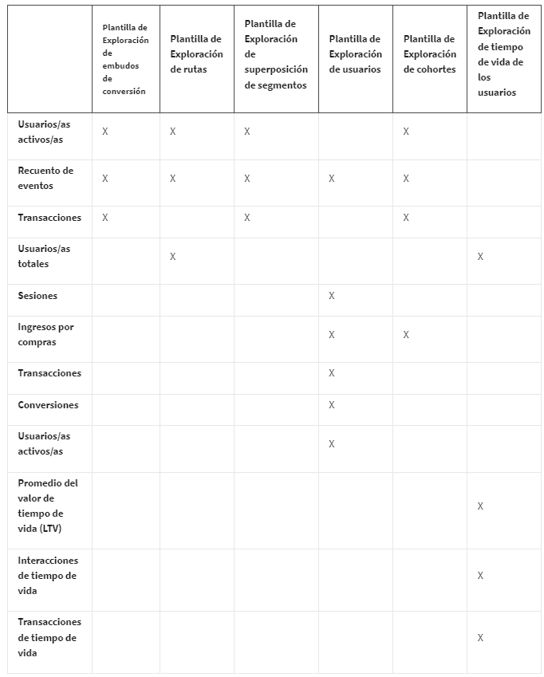
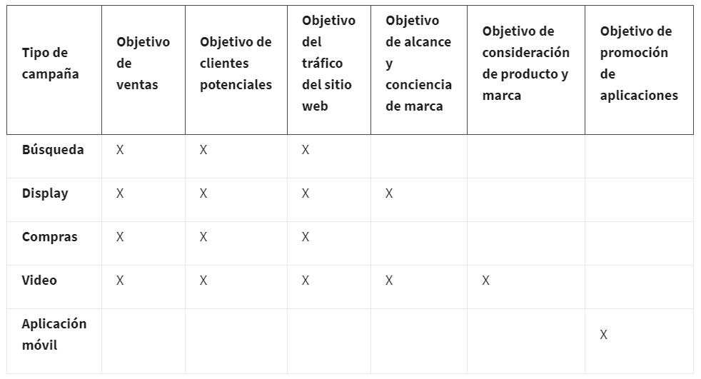

# Evaluar para el éxito: Analítica y medición de marketing

## Introducción a “Evaluar para tener éxito: analítica y medición de marketing”

### Primeros pasos en el curso curso 5

#### Introducción al curso 5

Hola. Qué gusto que estés por aquí. En este curso aprenderás todo sobre las analíticas de marketing, cómo medirlas y cómo
usarlas de manera efectiva. La analítica y la medición marcan la diferencia entre esperar que una campaña sea exitosa y usar
datos en tiempo real para garantizar que lo sea. Antes de empezar, quisiera presentarme. Mi nombre es Michael y seré tu
instructor en este curso. Soy Ejecutivo de Cuentas Senior y brindo apoyo a pequeñas y medianas empresas. Las ayudo a
desarrollar estrategias de adquisición de clientes mediante el uso de productos y servicios de Google. Sé muy bien que la
analítica de marketing es clave para hacer crecer un negocio de comercio electrónico. Me apasiona este tipo de negocio, que
ha sido mi centro de atención desde que trabajo con Google. Descubrí mi pasión por la analítica y la medición al lanzar mi
ONG, Hands for Harmony, en Nueva Orleans, Luisiana. Usé herramientas como Google Analytics para entender cómo la gente
encontraba mi sitio web. Fue muy valioso contar con estos datos cuando lancé una campaña de marketing para aumentar el
conocimiento del público sobre la organización. No importa si lo que buscas es aumentar el reconocimiento de marca o los
ingresos por ventas. Medir y monitorear los objetivos de rendimiento te ayuda a maximizar el ROI de cualquier campaña de
marketing. En este curso, conocerás herramientas y prácticas para la analítica de marketing. Descubrirás lo útil que puede
ser un software de analíticas en el trabajo de un/a especialista en marketing o asistente de comercio electrónico. Harás una
planificación de medios y establecerás objetivos de rendimiento. También, aprenderás a usar métricas de Google Analytics y
Google Ads para monitorear campañas de marketing y el ciclo del cliente. Con los resultados de pruebas A/B, verás cómo un/a
especialista en marketing toma decisiones sobre públicos objetivo, anuncios de respuesta directa y en qué enfocarse durante
una campaña. Por último, luego de analizar datos de rendimiento, crearás visualizaciones y presentaciones de insights para
compartir con otras personas. Al final de este curso, serás capaz de trabajar y contribuir a una variedad de proyectos de
marketing digital. También podrás monitorear métricas importantes en distintas etapas de la adquisición de clientes. Y, como
sabes, la adquisición de clientes es la fuerza que impulsa el comercio electrónico.

### Planificación de medios

#### Te damos la bienvenida a la semana 1 curso 5

En tu vida cotidiana, seguro ves cómo planear marca una diferencia en los resultados. Las campañas de marketing requieren
planear para obtener mejores resultados. Aquí aprenderás a crear planes de medios para campañas y fijar objetivos de
rendimiento para medir su éxito. Hay muchas herramientas de software para gestionar las campañas y el rendimiento. Conocerás
las capacidades de generar informes en Google Ads y Google Analytics, y verás las métricas en estas herramientas para hacer
un seguimiento del rendimiento. Las métricas o cifras te indican si la campaña es exitosa. Pasa al siguiente video para
saber más.

#### Planificación de medios y objetivos de rendimiento

Hola, es genial verte aquí para aprender. Aprender nuevas habilidades es como un proyecto de construcción: se hace un
progreso continuo al construir un edificio alto. Aprenderás sobre planificación de medios y objetivos de rendimiento. Al
construir, los planos ayudan a ver el edificio antes de empezar la obra. En marketing, la planificación de medios explica
una campaña antes de ejecutarla. Los planos arquitectónicos presentan dimensiones como alto y ancho que se utilizan al
construir; los planos de medios requieren valores, como número de clics e impresiones, que deben alcanzarse al ejecutar la
campaña. El número de impresiones indica las veces que se muestra un anuncio; el número de clics mide las respuestas. Estos
son objetivos de rendimiento. Los objetivos de rendimiento tienen un valor numérico medible. Pueden aplicarse a objetivos de
marketing o campañas específicas en una planificación de medios. En esos casos, suelen llamarse objetivos de marketing. Un
ejemplo del poder de la planificación de medios con un objetivo de marketing claro: Google tenía como objetivo llegar al
público negro y latino de Estados Unidos. Su planificación de medios requería destinar 15% del presupuesto a medios
culturales. Ese fue el objetivo de rendimiento, que generó campañas más inclusivas. Una campaña se dirigió a eventos con
gran audiencia entre el público negro. La defensa de marca aumentó en un 13% entre adultos negros de 35 a 49 años. Otra
campaña para patrocinar los Grammy Latinos generó un aumento del 14% en adultos de habla hispana de 18 a 49 años, que podían
considerar comprar un teléfono Pixel 5. El plan fue el inicio para lograr estos resultados. En thinkwithgoogle.com puedes
leer el artículo completo llamado Inside Google Marketing: Our Approach to Inclusive Media Planning and Buying. Hablemos de
objetivos de rendimiento de campañas específicas. El más importante de una campaña es el retorno de la inversión
publicitaria (ROAS). El ROAS es la relación entre los ingresos generados y el gasto en publicidad. Es un objetivo de
rendimiento que está en la planificación de medios. Ya sabes por qué la planificación de medios es importante para una
campaña exitosa, ahora elegirás los medios según el presupuesto y objetivo de rendimiento. Para obtener mejores resultados,
crea un plan de medios y tendrás además conocimientos y habilidades.

#### ¿Qué es la planificación de medios?

Aquí verás más sobre las planificaciones de medios. Pero antes debes saber qué contienen. Un plan de medios contiene
detalles sobre dónde, cuándo y con qué frecuencia aparecerá un anuncio en los diferentes canales, como radio, televisión,
periódicos, revistas, búsqueda pagada y redes sociales. Como este programa es para marketing digital, tu planificación de
medios se enfocará en medios digitales. Para recordarlo, las llamaremos planificaciones de medios digitales. Al crear una
planificación de medios digitales:
debes considerar el público objetivo. Pregúntate: ¿A quién debo llegar?
cuánto puedes gastar o cuál es el presupuesto, cuánto se destina a qué medios, o el mix de medios,
la duración de la campaña.
Finalmente, averigua cuáles son los indicadores clave de rendimiento (KPI), los objetivos de rendimiento y las
métricas que usarás para medir el rendimiento deseado.

Repasemos las definiciones de objetivos de negocio y marketing y KPI, ya que son la base. Un objetivo de negocio es una
meta, logro o resultado que se desea. Por ejemplo: aumentar ingresos o ganancias, ganar cuota de mercado y mejorar el
servicio al cliente. Un objetivo de marketing es una meta del plan o estrategia de marketing que apoya un objetivo de
negocio. Por ejemplo: aumentar el reconocimiento de marca y el tráfico hacia el sitio web, generar leads y aumentar el valor
del cliente. Un indicador clave de rendimiento (KPI) sirve para evaluar cuán exitoso es un negocio en sus esfuerzos por
alcanzar un objetivo de negocio o marketing. Como los KPI son numéricos, se usan como metas de rendimiento para los
objetivos de marketing. Pero, como no son suficientemente específicos para campañas individuales, es probable que debas
crear un objetivo de rendimiento más para cada campaña. Estos objetivos de campaña se incluyen en la planificación de medios
digitales. Al crear objetivos de rendimiento para campañas, considera medir el rendimiento a nivel de marketing general. Si
están bien alineados, los objetivos de rendimiento de la campaña deberían coincidir con una meta de marketing e incluso con
una meta de negocio relevante. El retorno de la inversión publicitaria (ROAS) es un objetivo de rendimiento que suele estar
en la planificación de medios digitales. Veamos un ejemplo. Si el objetivo de negocio de hacer crecer los ingresos es
prioritario, la empresa puede aprobar planes para aumentar estos ingresos. Un objetivo de marketing que apoye esta meta de
negocio podría ser un esfuerzo de marketing específico a través de un mix de medios. Aquí puede fijarse un objetivo de
rendimiento de ROAS. Si estás trabajando en tres campañas de publicidad digital, podrías establecer una meta de rendimiento
para cada campaña. Al monitorear el ROAS de cada canal, tus mediciones ayudarán a lograr el ROAS establecido para el
esfuerzo de marketing en general. Hasta ahora, hemos hablado del ROAS como un número sin ningún valor asignado. Te explico
cómo calcular el ROAS. Pondré un ejemplo simple de un negocio que vende un solo producto. El ROAS sería el número de
productos vendidos por el costo por unidad, dividido por la inversión publicitaria. Si cuesta US$80 de publicidad para
vender US$100 de producto, el ROAS es 3.75. Por cada dólar gastado en publicidad, la ganancia es de $3.75. El ROAS se
informa como una proporción. En este caso, el ROAS es de 3.75:1. También puede presentarse como porcentaje. En este caso, es
del 375%. En resumen, el ROAS puede expresarse como número, proporción o porcentaje. Agreguemos números al ejemplo anterior.
Si el objetivo de negocio es aumentar los ingresos en un 10% y el ROAS del objetivo de marketing es de 5:1, puedes asignar
metas de ROAS individuales a cada canal. Por ejemplo, empieza con un ROAS de 3:1 para anuncios de búsqueda, ROAS de 4:1 para
anuncios de display, y un ROAS de 2:1 para anuncios en redes sociales. Se usan los resultados de campañas anteriores para
fijar metas de ROAS de nuevas campañas. Es común fijar el mismo ROAS o uno ligeramente inferior al valor logrado en campañas
anteriores. Si no hay datos históricos, puedes hacer una estimación y ajustar los objetivos después de ver las métricas
iniciales de la campaña. Se permiten cambios dinámicos. La relación entre métricas de rendimiento y objetivos de marketing
muestra la importancia de los objetivos de rendimiento en la planificación de medios. El camino entre ellos debería estar
claramente delineado. En el ejemplo, los objetivos individuales de ROAS funcionarían juntos para lograr un ROAS general de
5:1. Más tarde podrás practicar crear una planificación de medios digitales que con público objetivo, presupuesto, mix de
marketing, duración, KPI y objetivos de
rendimiento.

#### Michael - Comprender a través del análisis y la medición

Me llamo Michael, soy Ejecutivo de Cuentas Senior en Google en nuestro comercio electrónico y director del equipo de
consumidores. Y mi función se diseñó para asociarnos con ejecutivos del nivel C que trabajan en su comercio electrónico y
estrategia de marketing digital. Encontré mi camino en el marketing digital y tuve la oportunidad de trabajar con pequeñas y
medianas empresas, especialmente cuando yo era un estudiante de pregrado en la universidad de Nueva Orleans. En mi último
año, me preguntaba qué haría después de la universidad y recuerdo que, en una clase de negocios, nuestro profesor señaló que
había una pasantía en Google que sería en la ciudad. Así es como nos lo plantearon. Me pareció una oportunidad increíble y
me inscribí y tuve la suerte de trabajar con pequeñas y medianas empresas y ayudarlas a incorporarse. En especial, en la
configuración de Gmail, además de nuestras soluciones gratuitas, y tener la oportunidad de ver un mundo nuevo para estas
empresas fue revelador y sorprendente, en particular porque fue unos años después de Katrina. Así que ver a estas empresas
encontrar una voz en línea con la cual pudieran contar su historia al mundo fue gratificante para mí, algo a lo que me
aferré de inmediato y me di cuenta de que este sería el camino a seguir en el futuro. Mi especie de lema es "escucha". Se
trata de escuchar y hacer preguntas más profundas, impactantes, reflexivas en lugar de profundizar o ir directamente a
vender. Sucede muy rápido. Se lo digo a los/las colegas todo el tiempo. A menudo me cuesta creer que hayan pasado casi nueve
años, pero cuando comencé en Google como asociado de estrategia de cuentas, tuve la oportunidad, que ya es mucho, de
comenzar desde cero. Tuve suerte de trabajar con negocios y dueños/as que eran nuevos/as en Google y, en especial, nuevos/as
en usar Google Ads y nuestras soluciones de marketing digital. Fue una experiencia increíble porque pude apreciar lo
importante que era el dinero que los/las dueños/as de estos negocios aportaban a Google. Para un/a dueño/a que gastaba US$5
al día con nosotros, eso significaba tanto o más que lo que significaba para algunas de las empresas que gastaban más de
5000. En este curso, aprenderás sobre medición de marketing y analítica y puede ser bastante desalentador al principio. Sé
que dudé de mí mismo cuando comencé a aprender más acerca de este tema, pero es muy importante y y algo que, sin duda,
usarás a diario en tu trabajo. Una de las partes más valiosas del marketing digital y del comercio electrónico es comprender
realmente los números y poder identificar lo que ayuda a que tu negocio crezca. Eso va a venir del poder mirar las
analíticas, específicamente las de Google Analytics, comprendiendo su estrategia de medición a medida que más
consumidores/as compran en línea y pasan por diferentes puntos de contacto en su recorrido general como consumidores/as. Ser
capaz de utilizar y tener una estrategia clave como la analítica o la medición, te ayudará a avanzar y comprender a tu
consumidor/a en general y a saber cómo está llegando a tu negocio y a comprar en él.

#### Cuadro de aviso de la discusión: Elige un mix de medios para llegar a otras y otros estudiantes

¿Cómo crearías una planificación de medios digitales para llegar al público de tus compañeros/as? Recuerda que una
planificación de medios digitales contiene detalles sobre dónde, cuándo y con qué frecuencia aparecerá un anuncio en todos
los canales de medios digitales, incluidos los anuncios pagados de búsqueda, visualización, video, compras y redes sociales.

¿Cómo influiría el contenido más popular entre tus compañeros/as en las decisiones de medios que tomarías?

Identificación del público objetivo:

Definir el grupo demográfico: edad, género, ubicación geográfica, intereses, comportamientos en línea, etc.

Segmentar aún más dentro del público objetivo si es necesario.

Investigación de palabras clave:

Realizar una investigación exhaustiva de palabras clave relacionadas con el contenido o productos/servicios que se están
promocionando para optimizar las estrategias de búsqueda pagada.

Selección de canales de medios digitales:

Anuncios pagados de búsqueda (Google Ads, Bing Ads): Utilizar las palabras clave investigadas para dirigirse a usuarios
activos que buscan información relevante.

Anuncios de visualización (Google Display Network, redes de anuncios): Mostrar anuncios gráficos o de vídeo en sitios web
relevantes para aumentar la visibilidad de la marca.

Anuncios de redes sociales, así como segmentar audiencias específicas según intereses, demografía, comportamientos, etc.

Asignación de presupuesto:

Distribuir el presupuesto entre los diferentes canales de manera equitativa o según la efectividad histórica de cada canal.

Definición de calendario y frecuencia:

Establecer fechas de inicio y finalización de la campaña.

Determinar la frecuencia de los anuncios en función de la etapa del embudo de ventas y la capacidad presupuestaria.

Creación de contenido y creatividades:

Desarrollar anuncios y contenido creativo que resuene con el público objetivo y sea adecuado para cada canal seleccionado.

Optimización continua:

Monitorear el rendimiento de los anuncios en tiempo real.

Realizar pruebas A/B para mejorar la efectividad de los anuncios y el contenido.

Medición y análisis de resultados:

Utilizar herramientas de análisis web y de plataformas publicitarias para evaluar el rendimiento de la campaña.

Analizar métricas clave como impresiones, clics, conversiones, retorno de la inversión (ROI).

#### Pasos a seguir en la planificación de medios

Aquí encontrarás más información sobre el contenido que debe tener una planificación de medios digitales y cuáles son los
pasos generales para crearla.

Contenido de una planificación de medios digitales Aprendiste en un video que una planificación de medios digitales contiene
detalles sobre dónde, cuándo y con qué frecuencia aparecerán los anuncios en los canales digitales, e incluye la siguiente
información:

Público objetivo

Presupuesto

Mix de medios

Duración

Indicadores clave de rendimiento (KPI)

Objetivos y métricas de rendimiento

A continuación, se describen cada uno de ellos, junto con la función que desempeñan en una planificación de medios
digitales.

Público objetivo

Un público objetivo es el grupo de personas más propenso a adquirir los productos o servicios que se anuncian. A veces, el
público objetivo se define mediante una combinación de clientes tipo que ayudan a los/los especialistas en marketing a
determinar cómo llegar a las personas utilizando los mensajes, ofertas y productos adecuados. Una planificación de medios
digitales debe aprovechar al máximo los/las clientes tipo. Este plan también puede incluir datos demográficos del público,
como edad, ingresos, dispositivos utilizados y medios preferidos para el contenido consumido. Sin embargo, la información
demográfica podría no estar disponible en todos/as los/las clientes tipo.

Propósito: un público objetivo se documenta en una planificación de medios digitales por razones puramente económicas y
estratégicas, dado que quieres invertir un presupuesto limitado de campaña en las personas que son más propensas a realizar
una compra.

Presupuesto

Las campañas suelen contar con un presupuesto fijo asignado a partir de un presupuesto de marketing más amplio. Gastar más
de lo asignado para una campaña suele requerir una mayor justificación y aprobación.

Propósito: el presupuesto se documenta en una planificación de medios para ayudar a evitar gastar de más o de menos en un
canal específico durante una campaña.

Mix de medios

Un mix de medios especifica cuánto del presupuesto se destinará a cada canal de medios en una campaña. Si se desconocen los
montos reales, puedes especificar porcentajes del presupuesto en el mix de medios. Por ejemplo, podrías asignar US$20,000 o
el 30% del presupuesto a las redes sociales. Ambas opciones son aceptables en la planificación de medios.

Propósito: un mix de medios es fundamental para la planificación de medios porque permite tomar las decisiones correctas en
cuanto al contenido, basadas en un presupuesto asignado para cualquier canal específico.

Duración

La duración, también conocida como periodo de publicidad activa, se refiere a cuánto tiempo durará una campaña y es fácil de
documentar. Pero, si estás ejecutando una campaña con publicidad de pago por clic (PPC), este elemento se vuelve más
complejo, porque deberás asegurarte de que tu presupuesto sea suficiente para toda la duración de la campaña. En este tipo
de campañas, la duración depende en gran medida del presupuesto.

Propósito: la duración o periodo de publicidad activa en una planificación de medios digitales determina cuánto tiempo
durará la campaña.

Indicadores clave de rendimiento (KPI)

Un indicador clave de rendimiento o KPI es una medida o métrica utilizada para evaluar la eficacia de una campaña. En una
planificación de medios digitales, es importante incluir indicadores clave de rendimiento ( KPI) para cada canal de medios
con el fin de poder medir el éxito de la campaña. Por ejemplo, en una lección previa, aprendiste que cada canal puede tener
su propio retorno de la inversión publicitaria (ROAS), el cual es un indicador clave de rendimiento (KPI) importante para
evaluar su éxito.

Propósito: los KPI en una planificación de medios documentan cómo medirás el éxito de la campaña para cada canal.

Objetivos y métricas de rendimiento

Un objetivo de rendimiento es una meta que tiene un valor numérico medible. Establecer objetivos de rendimiento es
fundamental para definir el éxito de una campaña. Si las métricas cumplen o superan los objetivos de rendimiento
establecidos, se considera que la campaña ha sido exitosa. La tasa de clics (CTR), que se calcula dividiendo el número de
clics entre el número de impresiones, es una de las métricas más utilizadas para evaluar el desempeño de los anuncios.

Propósito: incluir objetivos de rendimiento en una planificación de medios te permite medir sistemáticamente el rendimiento
y el éxito de cada canal durante una campaña.

Pasos para armar una planificación de medios digitales

Asumiendo que los objetivos de negocio y marketing ya han sido creados, estos son los pasos generales a seguir en la
planificación de medios digitales:

Confirmar los objetivos de negocio: suponiendo que ya han sido establecidos, identifica y confirma cuáles son.

Confirmar los objetivos de marketing: suponiendo que ya han sido creados, identifica y confirma cuáles son.

Realizar investigación de mercado (opcional): si no se ha identificado claramente el público objetivo, un estudio de mercado
puede ayudarte a hacerlo. Por ejemplo, una investigación de mercado puede determinar tanto los clientes tipo como el público
objetivo.

Definir los objetivos de la campaña: ten claridad sobre lo que se espera lograr con la campaña. Los objetivos de la campaña
suelen estar relacionados con una meta de negocio o de marketing de nivel superior. Por ejemplo, si se necesita hacer crecer
las ventas en una región específica, el objetivo de una campaña puede ser aumentar el reconocimiento de la marca mediante
anuncios dirigidos a las personas de esa región.

Seleccionar los canales de medios: los canales de medios seleccionados para una campaña deben estar alineados con las
preferencias de medios del público objetivo. Después de identificar qué canales tienen la prioridad más alta, se puede crear
un mix de medios.

Determinar y documentar todos los elementos de la planificación de medios: luego de determinarlos elementos necesarios para
una planificación de medios digitales, puedes utilizar un documento o herramientas de software para ayudarte a crear el
plan.

Formato de una planificación de medios digitales

Una planificación de medios digitales puede tener muchos formatos. Puedes utilizar documentos, hojas de cálculo o incluso
herramientas especializadas. Recuerda que el formato que decidas usar no es tan importante como su contenido.

Plantillas de planificaciones de medios digitales

Si estás utilizando un documento para planificar tu estrategia de medios digitales, existen varias opciones de plantillas de
planificación de medios disponibles. También puedes crear tu propio formato de organización. A continuación, te mostramos un
ejemplo de una tabla básica que puede ayudarte con la planificación de medios. El contenido del ejemplo se encuentra en
cursiva.


En una planificación de medios digitales, también puedes incluir una imagen de referencia de un embudo de marketing para
mapear los objetivos de rendimiento y las métricas a las etapas del embudo. Esto ayuda a las personas a visualizar lo que tu
campaña está tratando de lograr en cada etapa. La siguiente ilustración es un ejemplo.


Herramientas de planificación de medios

Si utilizas un software para hacer tu planificación de medios, hay muchas opciones entre las que puedes elegir. Un artículo
del blog de HubSpot identifica doce soluciones especializadas de planificación de medios disponibles en su lista de
Herramientas esenciales para la planificación de medios.

<https://blog.hubspot.com/marketing/media-planning-tools>

Conclusiones clave

La planificación de medios debe incluir datos sobre dónde, cuándo y con qué frecuencia aparecerá un anuncio en todos los
canales seleccionados. Documentar los indicadores clave de rendimiento (KPI) y las métricas de cada canal es esencial para
medir el éxito de la campaña. La planificación de medios se puede realizar mediante documentos o herramientas
especializadas. El formato organizativo de un plan de medios puede variar, y hay muchas plantillas disponibles.

### Objetivos de rendimiento

#### Establece objetivos de rendimiento

Viste que un objetivo de rendimiento es un objetivo con un valor numérico medible. Los objetivos de rendimiento y sus
métricas definen el éxito. Sin ellos, el beneficio de una campaña es solo una corazonada o conjetura. Aquí hay tres ejemplos
de objetivos de rendimiento basados en objetivos de negocio y marketing. Supón que un objetivo de negocio de una empresa de
comercio electrónico es aumentar la adquisición de clientes en un 20% en tres meses. La adquisición de clientes es el
proceso de ganar nuevos/as clientes. Para una empresa de comercio electrónico, esta depende del tráfico del sitio. Cuanto
más tráfico haya, más probabilidad habrá de ganar clientes. Se hace una campaña para crear más tráfico y aumentar la
adquisición de clientes. En la campaña se fija un objetivo de rendimiento del 20% de aumento de nuevas visitas semanales que
coincide con el objetivo de negocio. Para ver si cumples con el objetivo de rendimiento, analizas las métricas de nuevas
visitas y comparas los números de referencia anteriores. Al llegar al 20%, logras tu objetivo de rendimiento, pero puede
necesitarse más de uno para lograr el objetivo de negocio. En el caso anterior, ¿qué pasa si hay nuevos/as visitantes, pero
se van? Eso se llama rebote. La tasa de rebote es el número de rebotes entre el total de sesiones. Si aumentan los/las
visitantes nuevos/as, pero la tasa de rebote es alta, quizá no se logre aumentar la adquisición en un 20%. Intenta fijar
otro objetivo de rendimiento para reducir la tasa de rebote en un 50%. Supervisa las métricas de rendimiento de nuevos/as
visitantes y tasa de rebote. Los aumentos semanales de nuevos/as visitantes no se compensan con la tasa de rebote alta, y
los/las visitantes recurrentes se mantienen o aumentan junto con los/las nuevos/as visitantes. En el segundo ejemplo, se
fija un objetivo de negocio para obtener US$50,000 en ventas incrementales. Se crea un objetivo de marketing para más
retorno de la inversión de marketing (ROI) por dos veces su valor actual. Para establecer un objetivo de rendimiento con
presupuesto adicional de campaña, haz un par de cálculos. Primero indica cuántos pedidos más necesitas para obtener
US$50,000 más en ventas incrementales. Para este cálculo, se puede usar el valor promedio de pedido (AOV), que es la suma de
los importes de pedidos individuales, dividida por el número de pedidos. Si asumimos que el AOV es US$148, divide el
objetivo de ventas incrementales de 50,000 por el valor promedio del pedido de 148, que da los pedidos adicionales (338). El
objetivo de rendimiento es entonces de 338 pedidos adicionales. Si el ROI de marketing es de 2 y quieres duplicarlo, el ROAS
deberá ser de 4:1 para que coincida. Puedes calcular el presupuesto incremental necesario al dividir la cantidad de ventas
incrementales entre el ROAS. Divide las 50,000 ventas incrementales entre el ROAS objetivo, 4. Deberás pedir US$12,500 de
presupuesto adicional para impulsar ventas adicionales. En el ejemplo, el objetivo de marketing es aumentar el volumen de
conversión en redes sociales en un 25% en seis meses. El volumen de conversión es el total de conversiones o valor monetario
total de ellas durante un tiempo. Una conversión ocurre cuando un/a cliente potencial concreta una acción deseada. Si mides
el volumen de conversiones por el total de ellas, fija un objetivo de rendimiento de canal. Por ejemplo, en seis meses
puedes intentar aumentar en un 10% las conversiones y sesiones referidas de Instagram. Si mides el volumen de conversión
como valor monetario, deberás asignar valores monetarios a distintos tipos de conversiones, como leads o compras. Se puede
fijar y ver en herramientas como Google Ads. Aquí, un objetivo de rendimiento sería una cantidad monetaria tras seis meses.
Por ejemplo: US$100,000 de conversiones y sesiones referidas desde Instagram. ¡Felicidades! Aprendiste a crear objetivos de
rendimiento a partir de objetivos de negocio y de marketing. Los ejemplos son detallados, así que míralos de nuevo para
repasar o hacer otras actividades del curso. Pondrás en práctica cómo crear objetivos de rendimiento. También podrás
trabajar en la dirección inversa: a partir de un informe de una campaña finalizada podrás ver las métricas de rendimiento e
identificar objetivos de negocio o marketing.

#### Angela - Integrar y utilizar de manera conjunta los datos, las analíticas y las métricas para mejorar el rendimiento

Me llamo Ángela y soy Responsable de Estrategia Digital en Google. Me asocio con diferentes pequeñas y medianas empresas, y
las ayudo a hacer crecer sus negocios e ingresos a través de Google Ads. Me encanta trabajar con diversos tipos de clientes
todos los días. Logro entender sus modelos de negocios, cómo ganan dinero, sus márgenes de producto, e incluso participo en
el desarrollo de algunos productos que las/los clientes hacen en función de los datos que les ayudo a recopilar y analizar.
Luego toman esa información y amplían su mercado. Los objetivos de rendimiento son aquellos que le importan al cliente, lo
que hace la/el cliente o usuario/a hace cuando llega al sitio web o cuando llega a la tienda. Es esa interacción o esa
acción la que medimos para saber si ciertas cosas funcionan en el mundo del marketing. Los objetivos de rendimiento varían
para cada cliente, de acuerdo a cómo ganan dinero y cuáles son sus objetivos de marketing. Un cliente, tal vez una empresa
de comercio electrónico, está tratando de vender productos, por lo que nuestras métricas de rendimiento serían agregar al
carrito o acción de compra en el sitio web, así como las vistas de la página del producto. Las/los clientes de comercio
electrónico tienen números duros o un retorno de la inversión publicitaria que necesitan alcanzar. Y, por lo general,
medimos las compras, el valor de compra, así como también impresiones y clics para entender si esa campaña fue exitosa o no.
Otra/o cliente en este espacio podría ser un cliente de aplicaciones donde solo intentan obtener descargas, por lo tanto
tenemos una métrica diferente en torno a eso, para instalaciones de aplicaciones, descargas, apertura inicial. El objetivo
de la medición del rendimiento es entender los diferentes puntos de datos que provienen del marketing digital. Y los datos
nunca mienten, ¿cierto? Así que, si puedes medir y atribuir el crédito a múltiples canales publicitarios, tus objetivos de
rendimiento te ayudarán a medir y atribuir el éxito del marketing a los ingresos del negocio. Mi consejo para quienes se
inician en el marketing digital es que comprendan diferentes modelos de negocio, ya sea un/a cliente de comercio electrónico
y cuáles son sus márgenes de ganancia y cómo ganan dinero, o un cliente de generación de leads que necesita llamadas
telefónicas y tiene un equipo de ventas dedicado a trabajar esos leads. Todos los matices de cómo las/los clientes ganan
dinero influyen en su presupuesto de marketing y lo que hacen con él, así que es importante comprender primero cómo gana
dinero la/el cliente, y, a partir de ahí, puedes darle buenos consejos de marketing.

#### Objetivos de rendimiento relacionados con el costo

El video de este curso que cubrió los objetivos de rendimiento se centró en cómo utilizar el retorno de la inversión publicitaria (ROAS), pero hay muchos otros tipos de objetivos de rendimiento relacionados con el costo a considerar. Esta lectura describe los objetivos de rendimiento para las estrategias de puja que se presentaron anteriormente en el programa. La puja inteligente permite a Google Ads monitorear los objetivos para garantizar que las estrategias estén optimizadas a fin de alcanzarlos. Tanto la puja inteligente como la puja manual utilizan objetivos de rendimiento para métricas como:

Costo por adquisición (CPA)

Costo por clic (CPC)

Nota: Con la puja inteligente, puedes usar estrategias de costo por adquisición (CPA) objetivo y de costo por clic (CPC) mejorado. Una estrategia de costo por clic (CPC) mejorado combina la puja manual de costo por clic (CPC) con el costo por adquisición (CPA) o el retorno de la inversión publicitaria (ROAS) objetivos.

Reduce el costo por adquisición (CPA) para mejorar el valor de la campaña

Nota: Los objetivos de rendimiento variarán según la campaña. La información relacionada con el costo proporcionada a continuación es solo con fines ilustrativos.

El costo por adquisición es el costo promedio pagado por cada conversión. Si dispones de datos comparativos de campañas anteriores, puedes utilizar el valor promedio del costo por adquisición como objetivo de rendimiento. Luego, puedes optimizar tu campaña para tratar de lograr un costo por adquisición más bajo y así mejorar el valor de tu campaña.

Si no cuentas con datos históricos de campañas, puedes intentar usar un valor promedio del sector como punto de partida. Los valores promedio del sector son los valores típicos que se encuentran en toda una industria. Algunos ejemplos de valores promedio de costo por adquisición incluyen los anuncios de búsqueda de la industria automotriz, los anuncios de Facebook del sector textil y el costo por adquisición del comercio electrónico.

Imagina que trabajas para una empresa de bienes raíces, pero no tienes datos de campañas anteriores. Después de investigar, descubres que el costo por adquisición promedio de la industria para los anuncios de búsqueda del sector inmobiliario es de US$41.14, por lo que estableces tu costo de adquisición objetivo en US$40 (línea roja en el cuadro a continuación). Tu presupuesto para anuncios de búsqueda es de US$10,000, por lo que intentarás conseguir al menos 250 conversiones para alcanzar o superar el costo por adquisición objetivo de US$40. Cualquier número de conversiones por debajo de la línea roja superaría tu objetivo.

Número de conversiones para mejorar = Presupuesto/CPA = US$10,000/US$40 = 250


Si una conversión se define como un/a cliente potencial que solicita información sobre servicios inmobiliarios, necesitarás que al menos 250 personas realicen esa acción después de ver tus anuncios de búsqueda. Si más de 250 personas realizan esa acción, habrás mejorado el valor de tu campaña por encima del promedio del sector.

Utiliza el gasto diario para gestionar el costo por clic (CPC)
Nota: Los objetivos de rendimiento variarán según la campaña. La información relacionada con los costos proporcionada a continuación es solo con fines ilustrativos.

El costo por clic (CPC) es una métrica utilizada en la publicidad de pago por clic (PPC). Una forma de controlar los costos es gestionar el costo por clic en función de cada campaña. Puedes asignar más presupuesto a las campañas de pago por clic que tengan mayor prioridad.

Si estás publicando anuncios de búsquedas nacionales para varias regiones, pero la región de ventas del noroeste tiene mayor prioridad que la del suroeste, puedes asignar más presupuesto a la campaña de pago por clic para la región del noroeste. Suponiendo que el costo por clic máximo sea de US$0.50 para ambas regiones, puedes asignar un gasto diario mayor en la región del noroeste para lograr más clics en esa área. Por ejemplo si estableces un gasto diario de US$200 para la región del noroeste y US$100 para la región del suroeste, se aplicarán los siguientes cálculos:

Número de clics en la región noroeste = Gasto diario/costo por clic (CPC) = US$200/US$0.50 = 400 clics

Número de clics en la región suroeste = Gasto diario/costo por clic (CPC) = US$100/US$0.50 = 200 clics


El gráfico muestra el número de clics frente al gasto diario para un costo por clic de 50 centavos. Los datos de dos puntos de comparación son 400 clics con un gasto diario de US$200 y 200 clics en un gasto diario de US$100 son dos puntos de datos para la comparación.

Basándote en la diferencia en el gasto diario, el número de clics por los que estás dispuesto/a a pagar en la región del noroeste (punto de datos azul más oscuro) es mayor que el número de clics por los que estás dispuesto/a a pagar en la región del suroeste (punto de datos azul más claro). Puedes controlar el gasto diario a lo largo de la campaña para gestionar los resultados de rendimiento en cada región.

Conclusiones clave

Comprender el costo por adquisición (CPA), el retorno de la inversión publicitaria (ROAS) y el costo por clic (CPC) te ayudará a gestionar las campañas. El gasto diario o el costo por clic se ajustan para maximizar el número de conversiones. Con la puja inteligente, una estrategia de costo por clic mejorado combina la puja manual con un costo por adquisición o un retorno de la inversión objetivos.

#### Ejemplo de actividad: Establece objetivos de rendimiento

Compara el ejemplo con tu plantilla de objetivos de rendimiento terminada. Revisa tu trabajo utilizando cada uno de los criterios del ejemplo. ¿Qué hiciste bien? ¿En qué aspectos podrías mejorar? Las respuestas a estas preguntas te servirán como guía a medida que avances en el curso.

Revisa cada cálculo:

Las tasas de conversión se calculan con la siguiente fórmula: Conversiones/Clics totales x 100 = Porcentaje de tasa de conversión

Por lo tanto, las tasas de conversión del tercer trimestre de Baba’s se calculan utilizando las siguientes ecuaciones:

Correo electrónico: 90/1,200 x 100 = 7.5%

Redes sociales: 30/900 x 100 = 3.33%

Las tasas de clics se calculan utilizando la siguiente fórmula:

Clics totales/Impresiones totales x 100 = Tasa de clics

Por lo tanto, las tasas de clics del tercer trimestre de Baba’s se calculan utilizando las siguientes ecuaciones:

Correo electrónico: 1,200/80,000 x 100 = 1.5%

Redes sociales: 900/90,000 x 100 = 1%

Repasemos los criterios para los objetivos de rendimiento del cuarto trimestre:

Cada objetivo de rendimiento incluye la tasa de conversión o la tasa de clics, métricas que son relevantes tanto para el objetivo de negocio de aumentar los ingresos como para los objetivos de marketing de incrementar las tasas de conversión y de clics.

Cada objetivo de rendimiento indica el aumento deseado de la tasa de conversión o de clics, por lo que está claro cómo se medirá el objetivo.

Cada objetivo de rendimiento apunta a un aumento alcanzable de las tasas de conversión y clics, basado tanto en los puntos de referencia del sector como en los datos de rendimiento del tercer trimestre (por ejemplo, un aumento de entre 0.5 y 1.2 puntos porcentuales).

Ten en cuenta que tus objetivos de rendimiento pueden diferir ligeramente de los del ejemplo. Los objetivos de rendimiento que estableciste son aceptables si son relevantes, medibles y alcanzables.

Además, considera que tus objetivos de rendimiento para el cuarto trimestre no necesitan sumar el porcentaje deseado de aumento en todos los canales. Debido a que se te pidió establecer metas para dos de otros posibles canales, tus objetivos de rendimiento pueden contribuir hacia un objetivo de marketing combinado sin necesariamente satisfacerlo por completo. Por caso, para la tasa de clics en el ejemplo, los objetivos de rendimiento del cuarto trimestre para el correo electrónico y las redes sociales son aumentos de 0.8 y 0.6 puntos porcentuales, respectivamente. Sumando estos  resultados se obtiene un aumento combinado del 1.4 puntos porcentuales, pero esto es menor que los cinco puntos porcentuales especificados en el objetivo de marketing para todos los canales. Es de suponer que otros canales contribuirían para cubrir la diferencia y cumplir con el objetivo de marketing general.

### Introducción a las herramientas para las analíticas de marketing

#### Habilidades en analíticas de marketing

¡Hola! Vas avanzando bien en el curso. Sigue así. Al iniciar el programa, aprendiste cuáles son las habilidades que se
demandan en comercio electrónico y marketing digital. Si sigues los cursos en el orden recomendado, ya viste las habilidades
para estrategias publicitarias y de marketing, crear anuncios de búsqueda, display y redes sociales, ejecutar campañas de
correo, ampliar el alcance del cliente y el reconocimiento de marca, e involucrar a clientes. Otras habilidades pueden
clasificarse bajo la categoría de analítica. Por ejemplo, fijar y supervisar el rendimiento de la campaña, analizar
métricas, identificar tendencias, optimizar la interacción del cliente, y obtener datos para otras campañas. La analítica de
marketing puede aplicarse al recorrido del cliente, sitio web, aplicación o campaña. Depende del proceso de supervisión de
KPI y objetivos de rendimiento. En una campaña, el equipo puede fijar objetivos, hacer pruebas, supervisar métricas, hacer
ajustes y repetir el proceso hasta lograr los objetivos deseados. Se requieren herramientas de software para la analítica de
marketing. Aquí usarás Google Analytics y Google Ads para analizar métricas y medir el rendimiento de la campaña. Verás cómo
las herramientas como Google Ads se usan para hacer pruebas en páginas, anuncios y grupos objetivo, y cómo otras, como
Google Optimize, se conectan a un sitio para probar contenidos. Este tipo de pruebas se llaman A/B. También se les llama
prueba dividida o prueba de categorías. Es una prueba en línea de dos variantes que indica cuál funciona mejor. Funciona
así: hay dos versiones de una respuesta directa. Un objetivo de una prueba A/B puede ser ver qué página y respuesta
funcionan mejor según el número de clics. En la prueba, se divide el tráfico por igual entre ambas páginas. Es decir, el 50%
del tráfico se dirige aleatoriamente a una página y el resto se dirige aleatoriamente a la otra. Una respuesta directa
funciona mejor que la otra porque recibe más clics. Como resultado, se elige el anuncio que recibió más clics. Los equipos
eligen herramientas según sus capacidades, funciones y costos. Algunas herramientas son para supervisar eventos, como
análisis de clics, ver elementos visuales y gráficos, o ver paneles de control. Hay herramientas para analíticas más
avanzadas. Las que usarás con frecuencia dependerán de la empresa, el equipo y las necesidades del proyecto. Disponte a usar
herramientas que no conozcas. No importa qué herramientas usa tu equipo, es bueno saber qué hacen o no las herramientas
antes de usarlas. Al conocer las capacidades de las herramientas que usas podrás elegir las métricas indicadas para tu
proyecto. Recuerdo mi primera vez con Google Analytics. Había muchos informes y no sabía por dónde empezar. Con el tiempo
logré usar informes clave y aprendí de mis clientes qué métricas eran importantes para ellos. Hice preguntas para entender
cómo usan las analíticas para sus negocios de comercio electrónico. Al ganar más experiencia con herramientas como Google
Analytics también podrás responder a esas preguntas. Con las métricas indicadas, tú y tu equipo podrán aprender y compartir
las ideas más útiles.

#### Introducción a Google Analytics

Hay muchas herramientas para la analítica. Aquí te presentaré la demostración de Google Analytics disponible para cualquiera
con cuenta de Google. Es una muestra de los informes posibles antes de verlos por tu cuenta. Se muestran datos en vivo de
Google Merchandise Store y de Flood It!, una aplicación de Google Play. Al acceder a la demostración, eliges qué propiedad
ver. En Google Analytics, una propiedad es un sitio, aplicación o página web asociados a un ID de medición único que
habilita la recopilación de métricas. Una cuenta de Google Analytics contiene una o varias propiedades. Una única propiedad
puede contener métricas combinadas para un sitio y una aplicación, pero varias propiedades son útiles si se tiene varios
sitios web y aplicaciones o segmentos de usuarios/as muy distintos en un solo sitio o aplicación. Al crear una nueva
propiedad, se indica el sitio, aplicación o página para crear un nuevo ID de medición y recopilar métricas. Inicia sesión en
la cuenta de demostración: elige Propiedad Google Analytics 4: Google Merchandise Store. No importa la propiedad que elijas
para la demostración, si haces clic en el menú desplegable de tu vista actual, verás las propiedades de la cuenta y hacer
clic en Abrir para ver otra. Ahora hay propiedades UA y GA4. Las propiedades UA son de una versión anterior de GA que toma
solo métricas del sitio. Dado que Google Analytics 4 toma métricas de sitios y aplicaciones, la nueva cuenta debe usar
propiedades GA4. Google Merchandise Store también tiene un proyecto de atribución para ellas. La atribución es el acto de
asignar crédito por conversiones de anuncios, últimos clics u otros puntos de contacto a lo largo del recorrido de un/a
usuario/a hacia la conversión. Es decir, la atribución da el crédito correspondiente. Una conversión puede ser una macro o
microconversión. Una macroconversión suele ser una compra finalizada. Una microconversión es un proceso de respuesta que
indica que un/a cliente potencial se dirige a una macroconversión. Las microconversiones son los otros puntos de contacto en
la definición anterior de atribución. Los proyectos de atribución organizan las macro y microconversiones. Veamos informes
en la propiedad GA4 de Google Merchandise Store. En Informe panorámico en la parte superior, haz clic en las pestañas para
ver datos resumidos de los/las usuarios/as, nuevos/as usuarios/as, tiempo de interacción promedio y total de ingresos. Ve
hacia abajo y verás insights, adquisición de usuarios/as y tráfico, tendencias del usuario, mejores campañas, páginas más
vistas, eventos principales, conversiones principales, productos más vendidos y conversiones por plataforma. La información
automatizada es interesante: cambiará con la variación de mediciones, pero puedes ver cuando hay picos o cambios
imprevistos. Por ejemplo, puedes ver un pico imprevisto de conversiones. El menú en tiempo real muestra la actividad de
usuario actual en el sitio. Puedes ver los/las usuarios/as por dispositivo y geografía, por fuente, audiencia y página, y
puedes ver los eventos y conversiones. El menú de ciclo de vida da información del ciclo de vida del cliente. El submenú
Adquisición tiene detalles de usuarios/as y la adquisición de tráfico. Haz clic en Resumen para ver un resumen. El submenú
Interacción tiene detalles sobre eventos, conversiones, páginas y pantallas. Si haces clic en Conversiones y vas abajo,
verás las cifras de eventos begin_checkout y purchase para ver un cálculo de cuántos usuarios/as abandonan carritos de
compra sin hacer una compra. El submenú Monetización tiene detalles sobre compras en el sitio y la aplicación. Por último,
el submenú Retención tiene información sobre retención de usuarios/as y valor del tiempo de vida durante 120 días. La
retención de usuarios mide cuántos nuevos/as usuarios/as volvieron al sitio web en un tiempo. El valor del tiempo de vida
del cliente es el ingreso promedio generado por clientes en un tiempo. El menú Usuario muestra datos demográficos y
dispositivos de usuarios/as del sitio. Haz clic en Resumen para ver usuarios por país, ciudad, sexo, intereses, edad o
idioma. En Tecnología, haz clic en Resumen para usuarios por plataforma, sistema operativo, dispositivo, navegador,
resolución de pantalla, versión de la aplicación y modelo de dispositivo móvil. Estos son los aspectos principales de los
informes GA4 de Google Merchandise Store. Ahora sabes cómo ubicar y navegar por varias métricas en Google Analytics. En
otras actividades del curso, usarás la demostración de nuevo, para examinar las métricas más de cerca.

#### Recursos para obtener más información sobre Google Analytics

En este curso, el video que presenta la cuenta de demostración de Google Analytics ofrece una visión general de las características y capacidades de monitoreo de Google Analytics. Para obtener más información sobre cómo utilizar Google Analytics, te recomendamos revisar los recursos de capacitación en línea que se describen en esta lectura, los cuales son gratuitos.. No obstante, si buscas más oportunidades de formación en línea, debes tener en cuenta que algunas pueden tener costo.

Capacitación en línea gratuita
Lee las siguientes descripciones para encontrar la propuesta de formación más adecuada para ti.

Nota: Los recursos de capacitación gratuitos que se enumeran son para Universal Analytics, Google Analytics 4 (GA4) o ambos. A medida que más organizaciones migren a Google Analytics 4, se agregarán más capacitaciones para esta nueva versión.

Centro de Ayuda de Google Analytics: capacitación y soporte

El sitio de <https://support.google.com/analytics/answer/4553001?hl=en> contiene una lista de temas importantes y recursos que puedes explorar. Te recomendamos marcarlo como favorito en tu navegador para tenerlo a mano. Algunos de los recursos que puedes consultar son:

<https://analytics.google.com/analytics/academy/> (Universal Analytics solamente) cursos de Google Analytics para principiantes, usuarios avanzados y experimentados.

<https://www.youtube.com/user/googleanalytics> : videos y ayuda sobre los productos de Google Analytics.

<https://www.blog.google/products/marketingplatform/analytics/>: artículos de actualidad sobre Google Analytics.

<https://marketingplatformacademy.withgoogle.com/google-analytics-360>: seminarios web y tutoriales en vivo y a pedido para Google Analytics.

Skillshop

en <https://skillshop.withgoogle.com/> la plataforma de capacitación en línea de Google para sus herramientas y soluciones, podrás tomar cursos a tu ritmo. Al inscribirte, tendrás acceso a una variedad de recursos educativos en línea que podrás completar cuando te resulte conveniente.

<https://skillshop.exceedlms.com/student/catalog/list?category_ids=1173-google-analytics>: rutas de aprendizaje para Google Analytics 4 o Universal Analytics.

<https://skillshop.exceedlms.com/student/path/2938-google-analytics-individual-qualification>: cubre conceptos básicos y avanzados de Google Analytics.

Capacitación en línea de pago

Algunos ejemplos de cursos de capacitación que requieren pago para acceder son:

<https://www.udemy.com/topic/google-analytics/>

<https://www.linkedin.com/learning/search?keywords=ga4&upsellOrderOrigin=homepage-learning_nav-header-logo&trk=learning-serp_learning-search-bar_search-submit>

#### Ejemplo de actividad: Familiarízate con Google Analytics

<https://support.google.com/analytics/answer/6367342#access&zippy=%2Cin-this-article>

Compara el ejemplo con tu presentación terminada. Revisa tu trabajo utilizando cada uno de los criterios del ejemplo. ¿Qué hiciste bien? ¿En qué aspectos podrías mejorar? Las respuestas a estas preguntas te servirán como guía a medida que avances en el curso.

Métricas de adquisición

Si revisaste las métricas de adquisición de usuarios por tu cuenta, es posible que no hayas pasado por alto la opción “Primera fuente del usuario”, donde Google Analytics desglosa la fuente de los nuevos usuarios. Los datos incluyen fuentes de servicios de búsqueda personalizados de Yahoo y Baidu. Al ingresar cualquiera de estos motores de búsqueda en el campo de búsqueda, se muestra una lista detallada.

A continuación se presentan los resultados de Google y Bing


A continuación se presentan los resultados de Yahoo. Observa los dominios de país de los servicios de búsqueda personalizados:

sg.search.yahoo.com (Singapur)

fr.search.yahoo.com (Francia)

in.search.yahoo.com (India)

se.search.yahoo.com (Suecia)

uk.search.yahoo.com (Reino Unido)

au.search.yahoo.com (Australia)

ca.search.yahoo.com (Canadá)

co.search.yahoo.com (Colombia)

us.search.yahoo.com (Estados Unidos)

es.search.yahoo.com (España)

ch.search.yahoo.com (China)

dk.search.yahoo.com (Dinamarca)

hk.search.yahoo.com (Hong Kong)

pe.search.yahoo.com (Perú)

pl.search.yaho3333o.com (Polonia)


Métricas de interacción

Si revisaste las métricas de interacción por tu cuenta, es posible que no hayas pasado por alto la importancia de las métricas para los eventos. Calculaste el número de usuarios/as con abandono del carrito utilizando las métricas de los eventos begin_checkout y purchase. También calculaste el porcentaje de reducción del carrito utilizando las métricas para los eventos add_to_cart y remove_from_cart. Estas métricas son importantes de monitorear para futuras promociones o esfuerzos de remarketing. ¡Imagina aumentar las ventas volviendo a captar a estos/as usuarios/as!


Métricas de monetización

Si navegaste por las métricas de monetización por tu cuenta, es posible que hayas notado lo útil que es la página de Resumen. Desde allí, pudiste encontrar la cantidad de compradores por primera vez y cuáles fueron los artículos más vendidos. Estas métricas son importantes para monitorear el crecimiento. ¡Imagina aumentar el número de compradores por primera vez a través de una promoción enfocada en los artículos más populares!


#### Introducción a Google Ads

Google Ads es la plataforma de Google de publicidad en línea. Con Google Ads, un/a especialista en marketing crea anuncios
en línea para llegar a públicos específicos interesados en los productos o servicios que ofrece su empresa. Si no conoces
Google Ads, aquí te explicaré qué es. Al trabajar en una campaña en Google Ads, debes saber qué puedes ver en el panel, cómo
encontrar una campaña y sus métricas, cómo acceder y actuar según las recomendaciones que da Google Ads y cómo ver los
informes. Al iniciar sesión en Google Ads, verás un panel o resumen de todas las campañas. Deberías poder encontrar tu
campaña listada en la tarjeta de campañas en borrador o en la tarjeta de campañas en el panel. Las campañas activas se
enumeran con enlaces. Haz clic en un enlace individual para ver la configuración de una campaña. La página de resumen
muestra cómo van las campañas en general. Aquí encontrarás tendencias generales, volúmenes de clics, palabras clave más
buscadas y anuncios con el mejor rendimiento. Puedes hacer clic para iniciar una nueva campaña. También puedes ver los datos
de todas las campañas yendo a la página Campañas. Todas las campañas se enumeran junto con sus métricas como clics y
conversiones. Puedes ajustar el marco de tiempo de las métricas para aumentar o reducir el rango en el que evalúas las
métricas. Es importante la columna de presupuesto. Ahí verás el presupuesto gastado y las limitaciones de presupuesto de la
campaña. Si vas a la página Recomendaciones, verás un porcentaje que sirve como nivel de optimización. Cuanto más cerca esté
al 100%, mejor funciona la publicidad. Puedes consultar las recomendaciones en esta página para tomar medidas en uno o
varios anuncios y mejorar la puntuación de optimización de publicidad. Si tienes más de una campaña, el nivel de
optimización es acumulativo para todas las campañas. Cada recomendación se muestra como una tarjeta de puntuación con un
impacto previsto. Si un impacto previsto beneficia a una campaña, puedes hacer clic en él para ver detalles de la
recomendación. Desde ahí puedes elegir aplicar esa recomendación a la campaña. La última página de esta presentación es la
página Informes. En esta puedes obtener informes del rendimiento de la campaña. Puedes usar plantillas de informes o crear
un informe personalizado eligiendo las métricas que deseas incluir. Haz clic para abrir una plantilla. Por ejemplo, el
informe de página de destino muestra las métricas de rendimiento, conversiones, días para la conversión, y más de cada
página de destino. Estas métricas de rendimiento son útiles para poner anuncios. Aquí termina la introducción a Google Ads.
Ahora sabes cómo mirar el panel para consultar un resumen de las campañas, ver las métricas de una o todas las campañas,
aplicar recomendaciones a campañas para mejorar el nivel de rendimiento publicitario y usar la función de informes.
Aprenderás a supervisar métricas específicas más adelante.

#### Recursos para obtener más información sobre Google Ads

En este curso, el video introductorio a Google Ads brinda una descripción general de las características de Google Ads y de las funciones de monitoreo del rendimiento de las campañas. Para obtener más información sobre cómo utilizar Google Ads, consulta los recursos de capacitación en línea descritos en esta lectura. Las listas en esta lectura corresponden a formación en línea gratuita. Si deseas, puedes buscar oportunidades de capacitación adicionales, pero puede que debas pagar para acceder a ellas.

Capacitación en línea gratuita
Lee las siguientes descripciones para encontrar la propuesta de formación más adecuada para ti.

Centro de Ayuda de Google Ads: Capacitación y soporte de análisis

Recomendamos marcar como favorito el sitio web del <https://support.google.com/analytics/answer/4553001?hl=en> que contiene una lista de temas clave que puedes consultar.

Skillshop

En Skillshop, la plataforma de formación en línea de Google para sus herramientas y soluciones, podrás tomar cursos a tu ritmo. Al registrarte, tendrás acceso a una variedad de cursos en línea que podrás completar cuando te resulte más conveniente. La capacitación ofrecida para Google Ads incluye información específica sobre:

<https://skillshop.exceedlms.com/student/catalog/list?category_ids=313-google-ads-search>
<https://skillshop.exceedlms.com/student/catalog/list?category_ids=4997-google-ads-discovery>
<https://skillshop.exceedlms.com/student/catalog/list?category_ids=311-google-ads-display>
<https://skillshop.exceedlms.com/student/catalog/list?category_ids=315-google-ads-video>
<https://skillshop.exceedlms.com/student/catalog/list?category_ids=314-shopping-ads>
<https://skillshop.exceedlms.com/student/catalog/list?category_ids=3926-google-ads-apps>
<https://skillshop.exceedlms.com/student/catalog/list?category_ids=2823-google-ads-measurement>

Puedes ver los siguientes tutoriales en video:

<https://skillshop.exceedlms.com/student/path/240366-google-ads-tutorial-series-search>
<https://skillshop.exceedlms.com/student/path/240650-google-ads-tutorial-series-display>
<https://skillshop.exceedlms.com/student/path/256579-google-ads-tutorial-series-video>
<https://skillshop.exceedlms.com/student/path/261131-google-ads-tutorial-series-shopping-ads>

Capacitación en línea de pago

Algunos ejemplos de cursos de capacitación que requieren pago para acceder son:

<https://www.udemy.com/topic/google-ads/>
<https://www.linkedin.com/learning/topics/google-ads-2>
<https://www.coursera.org/search?query=google%20ads&>

#### Otras herramientas de la analítica del marketing

Has visto Google Analytics y Google Ads como ejemplos de herramientas y plataformas de analítica del marketing. En esta parte del curso, encontrarás herramientas similares y enlaces para obtener más información. A excepción de las soluciones de código abierto, que son gratuitas, existen diversos planes de suscripción y distintos precios para cada herramienta o plataforma.

Nota: Este programa de certificación no promueve ni apoya ninguna de las herramientas enumeradas. El propósito es brindarte una muestra de otras herramientas disponibles en el mercado.

Herramientas para la analítica del marketing

A continuación, hay una lista de varias herramientas para la analítica del marketing:

<https://clicky.com/>
<https://usefathom.com/>
<https://www.gosquared.com/>
<https://heap.io/>
<https://www.kissmetrics.io/>
<https://mixpanel.com/>
<https://oribi.io/features>
<https://statcounter.com/>
<https://www.visitor-analytics.io/en/?fp_ref=adam48>
<https://www.w3counter.com/>
<https://www.woopra.com/>

Suites de marketing con analítica

Entre las suites de software de marketing que ofrecen funciones de analítica se incluyen:

<http://www.awstats.org/>
<https://count.ly/web-analytics>
<https://matomo.org/>
<https://www.openwebanalytics.com/>
<https://plausible.io/>

Plataformas publicitarias

A continuación, algunas plataformas publicitarias y enlaces para obtener más información:

<https://www.buysellads.com/>
<https://www.media.net/>
<https://www.adbutler.com/>

#### Tim - Usar datos de la analítica del marketing

Hola. Soy Tim y soy Gerente de Desarrollo de Socios Estratégicos en Google para análisis de marketing. Antes de unirme al
equipo de Google y de trabajar en análisis de marketing, era un patinador olímpico. La transición de ser un atleta y luego
pasar al espacio académico fue algo aterradora. Creo que estaba fuera de mi zona de confort en ese momento porque, durante
mi época de entrenamiento, tomé una pausa en mis estudios. Así que fue una gran transición y un cambio brusco. Pero creo que
mucho de lo que aprendí como atleta me ayudó a enfrentar esos desafíos. Dentro de mi rol en Google, trabajo de cerca con
terceros externos que aplican modelos de mix de marketing, y actúo como una especie de conducto entre Google y los datos que
proporcionamos a nuestros socios externos, así como los equipos de cuentas, analistas y otras personas del lado del
proveedor que interpretan y miden esos datos. El mix de marketing es un modelo estadístico que usan los/las anunciantes para
medir la efectividad de su planificación general de medios. Incorporamos componentes en mix de marketing como televisión,
radio, medios impresos o plataformas digitales como buscadores, videos en línea de YouTube, por ejemplo, y les da a los/las
anunciantes un ranking sobre el rendimiento de sus diferentes canales de medios. Los datos principales que usamos como
entradas para el análisis de marketing son las calificaciones de TV, los clics de búsqueda, las impresiones de búsqueda y
las impresiones en línea y digitales. Y combinamos eso con los datos de ventas para construir un modelo estadístico que
arroja cuánto está generando cada medio de comunicación y cada vehículo de marketing para una marca en particular. Y creo
que esa es la parte más interesante del trabajo. Tienes que tomar esa información y, luego, verla en el contexto de ese/esa
anunciante, hacer lo mejor que puedas para darle sentido y comenzar a profundizar. De acuerdo, veo que este número en
particular para la TV es mayor que este número específico para un canal digital. ¿Por qué sucede eso? ¿Cómo se ejecutó en el
mercado? ¿Cuál fue el público objetivo? Ahí es cuando confías en tu equipo y en tu gerente y otras personas para entender
todo eso. Como trabajo multifuncional pensamos: estos son los datos que me da el modelo, ¿Cómo puedo hacerlos procesables?
¿Cómo puedo hacerlos relevantes? Y luego, ¿cuál es el contexto empresarial u otras consideraciones que van a conducir esa
llamada a la acción? Definitivamente, vi ejemplos de modelos en los que un resultado previsto es totalmente contrario a lo
que el/la anunciante espera. Durante un año, trabajé en un producto de bienes de consumo empaquetados que tiene una base de
usuarios/as bastante amplia, e hice una campaña dirigida a un grupo de afinidad específico. Eso terminó aumentando el costo
por punto de esa ejecución de medios. Descubrimos que no funcionó muy bien porque intentaban aplicar un caso de uso
específico para un producto que tiene un carácter general y una base de mercado muy amplia. Y creo que simplemente estaban
muy limitados y al recibir los resultados del modelo; y analizar los datos subyacentes les permitió hacer una mejor
estrategia para esa marca en particular. Afortunadamente, cuando cambiaron su estrategia para el año siguiente, notaron un
rendimiento mucho mayor al que vieron el año anterior, cuando hicieron la campaña segmentada. Mi mejor consejo para las
personas que comienzan ahora en su carrera de análisis de marketing es: sean flexibles, ágiles y tengan capacidad de
adaptación. El marketing es una industria que evoluciona rápidamente. Si bien los fundamentos de medición siguen siendo los
mismos, lo que realmente ves e interpretas cambia rápidamente. Así que sé ágil, sigue aprendiendo y enfócate en los datos y
en los datos subyacentes, cuestionando esos datos y tratando de entender el por qué detrás del qué.

#### Big data para la analítica y automatización del marketing

Hola. Empecemos con una pregunta: ¿Quisieras saber qué deparará el futuro para tu profesión? El marketing se transforma con
el auge del big data, la analítica predictiva y la IA. ¿Cómo será el marketing del futuro? Aquí te presento algunas
posibilidades. Los/las especialistas en marketing observan varias tendencias. Dos tienen que ver con la analítica y otras
dos con la automatización. El big data posibilita esto. El big data es un campo de analítica que sistemáticamente mina y
extrae información de conjuntos de datos muy grandes para obtener insights. El big data también se refiere a los conjuntos
de datos grandes. Las empresas financieras lo usan para analizar riesgos. Los fabricantes, para optimizar cadenas de
suministro. Veamos cómo se usa el big data en el marketing. La primera tendencia es la analítica en tiempo real: monitorea
los datos inmediatos para tener insights y responder rápido a eventos. Los/las especialistas en marketing solo pueden
ajustar una campaña al ritmo en que hacen seguimiento de los datos. Cuanto más detallados sean los datos, mejor. Si se reúne
big data y se filtra más rápidamente, los/las especialistas en marketing pueden responder a los aspectos de bajo rendimiento
de una campaña de inmediato o en tiempo real. Si la analítica les dice que un público objetivo no responde, pueden ajustar
el mensaje de ese público de inmediato. El big data también desempeña un papel en la analítica predictiva. Con datos
históricos, la analítica predice qué podría suceder. Si esta se aplica a modelos creados con historiales de navegación
colectivos, los/las especialistas en marketing pueden indentificar el público correcto para una campaña exitosa, desde el
inicio. La analítica predictiva ayuda también a elegir una página óptima o un anuncio sin hacer una prueba A/B, lo que
ahorra tiempo y dinero. El marketing automatizado usa analítica en tiempo real para automatizar las actividades. Por
ejemplo, ajusta automáticamente un mensaje de bajo rendimiento. Así, aumenta el impacto de campañas de marketing multicanal.
El marketing automatizado puede ser muy efectivo al promover y mantener programas de fidelización. La inteligencia
artificial (IA) es un campo que desarrolla máquinas y software inteligentes que simulan el pensamiento o trabajo humano. Las
campañas multicanal son difíciles de gestionar por la cantidad de contenido que debe crearse para cada canal. Si la IA puede
usarse para crear y personalizar contenido, los/las marketers pueden dar experiencias en contexto específico a los/las
usuarios/as; una experiencia optimizada en comercio electrónico convierte más navegadores en compradores. Estas tendencias
se están integrando a plataformas y sistemas. La automatización y la inteligencia artificial son un nuevo estándar. Por
ejemplo, Google Ads ofrece pujas automáticas, y su puja inteligente usa aprendizaje automático para analizar datos en tiempo
real y mostrar el mensaje correcto a la/el cliente adecuado/a. Algo es seguro: a medida que estas tendencias crezcan, habrá
nuevos puestos en marketing. Probablemente acertarás si dices que el futuro de la analítica ya llegó.

#### Cómo prepararse para un futuro sin cookies en el mundo de la publicidad y el comercio electrónico

Una cookie (galleta) es un dulce horneado. También es un archivo pequeño que se guarda en las computadoras para almacenar las preferencias del usuario y otra información. En esta lectura, se describe cómo las cookies se han utilizado tradicionalmente en la publicidad y el comercio electrónico, y cómo también han planteado preocupaciones en torno a la privacidad de las personas. Has aprendido que el futuro del marketing dependerá de la analítica predictiva y en tiempo real, las campañas autónomas y la inteligencia artificial. Lo que también es cierto es que las y los especialistas en marketing tendrán que prepararse para un futuro sin cookies, a medida que las y los usuarios se muestran más firmes a la hora de proteger su privacidad. Algunos navegadores ya han implementado limitaciones, y muchos de estos tienen planes para eliminar gradualmente el uso de ciertos tipos de cookies.

Cómo se utilizan las cookies
Desarrolladas por primera vez en 1994, las cookies fueron creadas para guardar la configuración de las y los usuarios en los sitios web. Pueden utilizarse para monitorear cómo llegan las personas a un sitio y de qué forma interactúan con él. Inicialmente, en los primeros tiempos del comercio electrónico, las cookies eran específicas de cada proveedor y ayudaban a las empresas a seguir el estado de las sesiones de las y los usuarios. Con el tiempo, las cookies también comenzaron a ser utilizadas por los equipos de marketing y de análisis de datos para recopilar información sobre quienes visitaban un sitio web.

Remarketing
El remarketing es el proceso de utilizar anuncios o correos electrónicos de seguimiento para interactuar con un/a cliente potencial que ha visitado un sitio web pero no ha realizado una compra. La información de usuario guardada en las cookies de los navegadores permite a las empresas relacionarse con estas personas para el remarketing.

Herramientas de analítica
Las cookies mantienen un registro de la sesión del usuario y de la información del dispositivo, permitiendo a herramientas como Google Analytics recopilar información sobre el inicio de sesión y la fuente de tráfico. Los eventos configurados en Google Analytics para el monitoreo de sitios web o apps móviles resumen y comunican esta información. Los recuentos de conversiones en Google Ads también se basan en cookies para determinar con qué anuncios o listas de productos interactúan los usuarios.

Recopilación de datos de terceros
Como se mencionó con anterioridad, las cookies fueron diseñadas originalmente para ser específicas de un dominio o sitio web. En otras palabras, los datos del usuario almacenados en una cookie estaban destinados solo para su uso en un sitio web específico. Una cookie establecida por el propietario del sitio web se denomina cookie de origen y utiliza el dominio del sitio web.

Sin embargo, las cookies de terceros utilizadas en publicidad tienen la capacidad de recopilar y rastrear una mayor cantidad de información sobre las personas. En contraste con las cookies desarrolladas por el propietario del sitio web, las cookies de terceros, como su nombre lo indica, son distribuidas por herramientas de terceros y utilizan el dominio del anunciante, en lugar del dominio del sitio web. Un ejemplo de ello es cuando un tercero muestra un anuncio de banner y entrega una cookie  a los usuarios. Como estos anuncios persisten en varios sitios web visitados por las y los usuarios, esa cookie sigue recopilando información, la cual puede no ser anónima y ser vendida por los terceros que recopilan dicha información. Estas cookies de terceros representan una de las principales preocupaciones en torno a la privacidad. Algunos terceros son capaces de enviar literalmente cientos de cookies en la primera visita de un usuario, y la mayoría de ellas se utilizan para rastrear sus comportamientos.

Alternativas a las cookies
La publicidad y el comercio electrónico tendrán que evolucionar para adaptarse a un mundo sin cookies. Para hacer frente al desafío de la privacidad que plantean estos nuevos tiempos, las y los tecnólogos están desarrollando alternativas como la publicidad basada en intereses y los nuevos métodos para el remarketing de sitios web.

Publicidad basada en intereses (IBA)
La publicidad basada en intereses o IBA se basa en comportamientos de navegación generalizados en lugar de en los comportamientos de navegación de individuos específicos para la segmentación de los anuncios.

El aprendizaje federado de cohortes (FLoC) es un mecanismo que permite agrupar a las personas con intereses similares de búsquedas sin el uso de un identificador único por navegador.. Los anunciantes pueden así observar los comportamientos de navegación de las personas de una cohorte en lugar de por sus actividades individuales. Los anuncios se pueden personalizar en función de la cohorte de la que forme parte una persona.

Los mecanismos de programación aún están en fase de desarrollo. Lo más probable es que leas sobre otras propuestas para implementar la IBA hasta que se adopte ampliamente una solución que funcione.

Servidores de confianza para remarketing de sitios web
Para el remarketing de sitios web, las y los especialistas en marketing deben ser capaces de  crear y gestionar audiencias preferidas sin utilizar cookies de terceros. Aunque se están discutiendo muchas opciones, una alternativa podría ser un servidor de confianza que tenga permiso para almacenar cierta información para un proceso de puja de campañas publicitarias.

Conclusiones clave
Las cookies darán paso a nuevas soluciones. En publicidad y comercio electrónico, estas soluciones deben permitir a las y los especialistas en marketing interactuar selectivamente con las y los  usuarios mientras mantienen su derecho a la privacidad. La creatividad y la automatización ayudarán a las organizaciones de marketing a hacer la transición hacia un futuro sin cookies.

Recursos para obtener información adicional

Consulta los siguientes enlaces  para profundizar en los temas abordados en esta lectura:

<https://www.dbswebsite.com/blog/website-cookies-and-data-privacy/> este artículo de blog describe los diferentes tipos de cookies y cómo se utilizan.

<https://blog.google/products/ads-commerce/2021-01-privacy-sandbox/> este artículo de blog describe los avances tecnológicos para la navegación sin cookies.

<https://github.com/WICG/floc> introducción al FLoC en GitHub.

### Repaso: Introducción a “Evaluar para tener éxito: analítica y medición de marketing”

Términos y definiciones del curso 5, semana 1

Adquisición de clientes: Proceso de conseguir nuevas/os clientes.

Analítica en tiempo real: Monitoreo de datos inmediatos para obtener información y responder a los eventos con rapidez.

Analítica predictiva: Monitoreo de datos históricos para predecir lo que podría suceder.

Aprendizaje federado de cohortes (FLoC): Mecanismo que permite agrupar a las personas con intereses similares de búsquedas
sin el uso de un identificador único por navegador. Puede utilizarse para publicidad basada en Internet como sustituto a las
cookies.

Atribución: Determina cuáles contenidos y canales son responsables de generar leads, conversiones o registros.

Big data: Campo de la analítica de datos que extrae sistemáticamente información de grandes conjuntos de datos.

Bucket testing: (consultar Pruebas A/B).

Cookie: Pequeño archivo almacenado en dispositivos que rastrea el comportamiento de quienes navegan en Internet y analiza el
tráfico.

Conversión de macros: Transacción de compra completada.

Costo por adquisición (CPA): Costo promedio de adquirir un/a cliente potencial.

Costo por clic (CPC): Lo que paga un anunciante cuando alguien hace clic en un anuncio de PPC.

Duración: Cuánto tiempo durará una campaña.

Gasto presupuestario: Cuánto se asigna o se gasta en una campaña.

Indicador clave de rendimiento (KPI): Medida que se usa para medir el éxito de una empresa en su esfuerzo por alcanzar un
objetivo de negocio o marketing.

Inteligencia artificial (IA): Campo que desarrolla máquinas y software inteligentes que simulan el pensamiento o trabajo
humano.

Marketing automatizado: Utiliza analítica en tiempo real para automatizar las actividades de marketing.

Microconversión: Una respuesta completa que indica que un usuario se está moviendo hacia una transacción de compra
completada.

Mix de medios: Combinación de canales digitales que los especialistas en marketing utilizan para alcanzar sus objetivos y
cómo se dividen su presupuesto entre ellos.

Objetivo de marketing: Meta en un plan o estrategia de marketing que respalda un objetivo de negocio.

Objetivo de negocio: Meta, logro o resultado deseado para un negocio.

Objetivo de rendimiento: Meta que tiene un valor numérico medible.

Planificación de medios: Contiene detalles sobre dónde, cuándo y con qué frecuencia aparecerá un anuncio en todos los medios
de comunicación.

Propiedad: Sitio web, aplicación móvil o página web que está asociada con un ID de medición único en Google Analytics para
habilitar la recopilación de métricas.

Proyecto de atribución: Organización para conversiones macro y micro en Google Analytics.

Prueba A/B: Método de prueba en el que se comparan dos versiones de contenido con una sola variable diferente para
determinar cuál produce mejores resultados.

Pruebas divididas: (consultar Pruebas A/B).

Público objetivo: Grupo de personas con más probabilidades de comprar los productos o servicios de una empresa.

Remarketing: Estrategia en la que una empresa utiliza anuncios de pago para dirigirse a las/los clientes que visitaron un
sitio web, aplicación o perfil de redes sociales.

Retorno de la inversión publicitaria (ROAS): Cantidad de ingresos que se obtienen en relación con cuánto se gastó en
publicidad.

Valor del tiempo de vida del cliente (Lifetime Value LTV o CLV): Ingresos promedio generados por cliente durante un cierto
periodo de tiempo.

Valor promedio del pedido (AOV): Suma de los montos de los pedidos individuales divididos por el número de pedidos.

Ventas incrementales: Ventas durante un periodo de tiempo que están por encima de lo que una empresa normalmente en ese
lapso.

Vuelo: (consultar duración).

## Usar las métricas de Google Analytics y Google Ads

### Métricas de Google Analytics

#### Te damos la bienvenida a la semana 2 curso 5

¡Hola de nuevo! Si sigues este curso en orden, seguro ya conoces Google Analytics y Google Ads. En esta parte del curso,
verás cómo empezar a recopilar mediciones en estas herramientas y monitorear métricas. Para los videos de esta lección, se
necesita un nivel de acceso de las herramientas para visualizar métricas y editar informes. En Google Analytics, este es el
rol de Lector, en Google Ads, es el nivel de acceso estándar. Las lecturas y referencias aportan más datos sobre la
configuración de cuenta y otras tareas que requieren mayores niveles de privilegios administrativos. Estas lecciones se
crearon con la última versión de las herramientas. Hay tareas similares que pueden hacerse en una versión anterior, pero la
navegación, las opciones de menú y, a veces las funciones, son diferentes. Para monitorear métricas, aprenderás a crear
exploraciones en Google Analytics, y paneles de control y cuadros de evaluación en Google Ads. Para ingresar datos,
aprenderás a vincular una cuenta de Google Ads con Google Analytics para ver los datos publicitarios en Google Analytics. Y
para la salida de datos, aprenderás a exportar datos desde Google Ads y Google Analytics para poder analizarlos más. Como
las herramientas de analítica recopilan mucha información, se deben realizar informes selectivos para enfocarse en las
métricas más importantes para tu estrategia de marketing digital. Querrás asegurarte de estar usando las métricas correctas
para encontrar la información más precisa y convincente.

#### Empieza a usar Google Analytics

Los videos de este curso muestran una cuenta de prueba de Google Analytics que ya está en funcionamiento para un sitio web y una aplicación móvil. Esta lectura te dará una descripción general de lo que se requiere para configurar una nueva cuenta de Google Analytics, con el fin de monitorear un sitio web o aplicación.

Nota: La información en esta lectura se proporciona únicamente a modo de referencia. No debes configurar una cuenta de Google Analytics para completar ninguna de las actividades de este curso. Seguirás utilizando la cuenta de prueba de Google Analytics.

Pasos avanzados
Estos son los pasos avanzados para configurar Google Analytics:

Crear una cuenta y propiedad nueva

Crear un flujo de datos

Habilitar el etiquetado

Habilitar la recopilación de datos

Crear una cuenta y propiedad nueva

Para crear una cuenta nueva, ve a la página de <https://marketingplatform.google.com/about/analytics/>  y selecciona Comenzar hoy.

Cuando creas una cuenta nueva, ingresa o selecciona la siguiente información:

Nombre de la cuenta

Nombre de la propiedad

Zona horaria

Moneda

Información comercial (opcional)

Crear un flujo de datos

Después de aceptar los términos del contrato de servicio, puedes elegir el tipo de flujo de datos que quieres monitorear en un sitio web o aplicación móvil:

Web: si seleccionas Web, ingresa la URL de la página de inicio y un nombre de flujo único.

Aplicación para Android: si seleccionas la aplicación para Android, ingresa el nombre del paquete y el nombre de la aplicación.

Aplicación para iOS: si seleccionas la aplicación para iOS, ingresa el identificador del paquete y el nombre de la aplicación.

A continuación, se le asignará un identificador de medición al flujo de datos.

Habilitar el etiquetado

Para las instrucciones de etiquetado, elige si deseas agregar una nueva etiqueta a la página o usar una ya existente.

Selecciona la opción de usar una etiqueta de la página existente solo si estás añadiendo una propiedad de Google Analytics 4 (GA4) a un sitio web que ya tiene una etiqueta para Universal Analytics (UA). La etiqueta existente se convierte en una etiqueta de sitio conectada para enviar datos a la propiedad Google Analytics 4.

Si agregas una nueva etiqueta, puedes elegir usar la etiqueta global de sitio o Google Tag Manager.

Habilitar la recopilación de datos

Por último, para habilitar la recopilación de datos, implementa la etiqueta global de sitio o la etiqueta de Tag Manager.

Si implementas la etiqueta global de sitio manualmente, deberás copiar y pegar la etiqueta de sitio que aparece en la sección "head" del HTML de cada página que quieres monitorear.

Una etiqueta de sitio se ve algo así:

```code

<!-- Global site tag (gtag.js) - Google Analytics -->
<script async src="https://www.googletagmanager.com/gtag/js?id=G-3T28EEHGZS"></script>
<script>
  window.dataLayer = window.dataLayer || [];
  function gtag(){dataLayer.push(arguments);}
  gtag('js', new Date());

  gtag('config', 'G-3T28EEHGZS');
</script>

// code
```

Recursos para obtener información adicional
Consulta los siguientes artículos para obtener instrucciones sobre cómo configurar Google Analytics.

<https://support.google.com/analytics/answer/9304153?hl=en>: instrucciones para configurar Google Analytics 4 (recomendado para cuentas nuevas)

<https://support.google.com/analytics/answer/1008015?hl=en>: instrucciones para configurar Universal Analytics (te dará soporte continuo de sitios web que utilizan UA).

#### Etiquetado global de sitios web y Google Tag Manager

Quizás te preguntes cómo las herramientas de análisis son capaces de monitorear el rendimiento de un sitio web. Las herramientas como Google Analytics solo pueden monitorear los sitios web que se etiquetaron para que tengan permitido hacerlo. En otras palabras, la etiqueta, o pieza de código, debe ejecutarse en cada sitio web para que estas herramientas los puedan reconocer. Esta lectura describe dos métodos de etiquetado: usar una etiqueta global de sitio o usar Google Tag Manager.

Etiquetado global de sitio
La etiqueta global de sitio de Google, gtag.js, es una etiqueta única que se puede implementar en un sitio web. Se agrega al elemento head del HTML de la página de cada sitio web. El elemento head contiene los metadatos de una página, información que no es visible, pero que es importante para la gestión del sitio web. Esta etiqueta global admite varios productos de Google, además de Google Analytics. Después de agregar esta etiqueta, también se pueden activar otros productos para el sitio como Google Ads, por lo que se pueden recopilar métricas para el tráfico proveniente de esta herramienta.

La ventaja principal de usar el etiquetado global de sitio es que está diseñado para que se use con todos los productos y servicios de Google. Para monitorear el tráfico de otras plataformas de publicidad o de medios, o para permitir el monitoreo con otras herramientas de análisis, se requieren etiquetas adicionales. Utiliza Google Tag Manager para trabajar con estas etiquetas adicionales en plataformas que no sean de Google.

Google Tag Manager
Para un etiquetado más universal, la solución de Google es Google Tag Manager, un sistema de gestión de etiquetas (TMS) que permite la implementación y administración de muchas etiquetas para múltiples plataformas y sistemas de publicidad de una manera simple y centralizada. Después de que se haya agregado un pequeño fragmento de código de Tag Manager a un sitio web, las etiquetas de análisis y medición se pueden implementar en muchas plataformas desde la interfaz de la web de Tag Manager.

Etiquetas de Google Analytics 4 en Google Tag Manager

Google Tag Manager admite las propiedades de Google Analytics 4 con dos etiquetas:

Google Analytics: Configuración de GA4

Google Analytics: Evento de GA4

La etiqueta Configuración de Google Analytics inicia la recopilación de datos para una propiedad de Google Analytics 4 y debe agregarse a todas las páginas. Esto permite mediciones básicas de Google Analytics 4, que incluyen eventos automatizados y eventos de medición mejorados, siempre que la función de medición mejorada esté habilitada durante la fase de configuración.

La etiqueta Evento de Google Analytics 4, que puede agregarse a interacciones o páginas web particulares, permite enviar eventos personalizados a la propiedad Google Analytics 4. Los eventos personalizados permiten el monitoreo de métricas más allá de las que se enviaron automáticamente para cada evento o las que se habilitaron al activar la medición mejorada.

Conclusiones clave
Las principales diferencias entre el uso de la etiqueta global de sitio de Google y Google Tag Manager son:

La etiqueta global de sitio funciona solo con las herramientas de Google, mientras que Google Tag Manager funciona con cualquier etiqueta HTML o JavaScript.

Todas las etiquetas se implementan mediante el código JavaScript, pero Google Tag Manager ofrece la característica adicional de una interfaz gráfica centralizada para implementarlas.

Recursos para obtener información adicional

Puedes consultar los siguientes enlaces para obtener más información sobre el uso de la etiqueta global de sitio o Google Tag Manager:

<https://support.google.com/tagmanager/answer/7582054?hl=en> Tag Manager y gtag.js
<https://support.google.com/tagmanager/answer/9442095> Etiquetas de Google Analytics 4
<https://support.google.com/tagmanager/answer/6107124?hl=en&ref_topic=6333310> Implementar Universal Analytics con Tag Manager

#### Trabaja con Google Analytics: monitorear métricas

Ya viste y exploraste los informes en la cuenta de prueba de Google Analytics. En este video verás cómo Google Analytics recopila información y qué es lo que la información recopilada te dice. Todo empieza con los eventos. Google Analytics recopila datos cuando ocurre un evento. Si se fija una propiedad de GA4 para un sitio o una aplicación, los eventos se activan automáticamente para recopilar información. Esta información tiene propiedades básicas del/a usuario/a, las acciones que toma e información de la sesión. Algunos ejemplos de eventos que se fijan automáticamente son la primera visita: cuando un/a usuario/a visita por primera vez el sitio; e inicio de sesión: cuando el/la usuario/a interactúa con el sitio web. Se pueden activar otros eventos habilitando la medición mejorada. Algunos ejemplos de métricas mejoradas son la vista de página: cuando se carga una página; descarga de archivos: cuando un/a usuario/a hace clic en un enlace a un archivo; y vista de los resultados de búsqueda: cuando se hace una búsqueda en un sitio. Los tipos de eventos finales son los que los activa un/a desarrollador/a de forma programática para un sitio. Ejemplos: compartir, que recopila datos cuando un/a usuario/a comparte contenido, agregar al carrito, cuando un/a usuario/a agrega un artículo al carrito, y compra, cuando un/a usuario/a realiza una compra. Quizás no te encargues de crear eventos, pero debes saber buscarlos. En la cuenta de prueba, puedes ver una lista de eventos de una propiedad GA4. Haz clic en el ícono Configurar en el panel de navegación; selecciona Eventos. La lista de eventos se ordena alfabéticamente; se ven algunos que se describen como Agregar a carrito. Cada evento activado tiene dimensiones asociadas a él. Las dimensiones son los atributos del evento que determinan las métricas recopiladas. Puedes usar dimensiones para ver cómo los/las usuarios/as llegan al sitio web o aplicación. Por ejemplo: ¿llegan a través de una búsqueda o al hacer clic en un enlace enviado por correo electrónico? Las dimensiones también recopilan los dispositivos que fueron usados para visitar un sitio web. Al recopilar métricas especializadas, se agregan dimensiones personalizadas. Un ejemplo de cuándo una dimensión personalizada es necesaria es al agregar etiquetas UTM a las URL. UTM hace referencia al módulo de monitoreo de Urchin, que se llama así por la empresa de software Urchin, que desarrolló este método. Un UTM es una etiqueta de texto agregada a una URL para monitorear su contenido. Así funciona con una campaña publicitaria: En el primer ejemplo, "utm_source" es la fuente del tráfico hacia la página de descuentos; y "utm_campaign" es el nombre de la campaña. Aquí, las etiquetas UTM habilitan el monitoreo de usuarios/as que hacen clic en el enlace a la página de descuentos desde Twitter. En el segundo ejemplo, "utm_medium" monitorea el medio publicitario, como correo electrónico. Puedes monitorear otros medios reemplazando el correo electrónico con otro tipo de publicidad, como un boletín informativo. En la cuenta de prueba, hay una lista de dimensiones personalizadas. Haz clic en el ícono Configurar en el panel de navegación. Selecciona Definiciones personalizadas. Estarás en la página predeterminada de Dimensiones personalizadas. Aquí verás las dimensiones personalizadas para etiquetas UTM. Previamente viste dos métricas importantes para la conciencia de marca: cantidad de veces compartidas y de impresiones. Si usas Google Analytics para monitorear la conciencia de marca, verás que el evento Compartir está activado para rastrear enlaces compartidos y las etiquetas utm_source y utm_campaigns se agregan a las URL. También verás que las dimensiones personalizadas de las etiquetas UTM están configuradas en Google Analytics. Por último, verás que el evento Vista de páginas está activado para monitorear las impresiones de las páginas de contenido de marketing. Antes en el programa, viste que la tasa de conversión es una métrica importante en las campañas de correo. La tasa de conversión es el porcentaje de destinatarios/as que usaron un enlace del correo y realizaron una compra. Para monitorear estas tasas de una campaña de correo con Google Analytics, el evento Compra debe estar configurado. Confirma que las etiquetas utm_medium y utm_campaign hayan sido agregadas a las URL que compartes en los correos electrónicos. Y confirma que sus dimensiones personalizadas estén configuradas en Google Analytics. Puedes ver la información personalizada de la campaña en el informe de adquisición de tráfico en Adquisición.
Reproduce el video desde :4:24 y sigue la transcripción4:24
En la cuenta de prueba, desplázate hacia abajo hasta más de la mitad del informe y cambia de Fuente de sesión por medio a Medio de sesión en el menú desplegable. Correo electrónico figura como un medio. Luego, encuentra la columna Conversiones y cambia Todos los eventos a Compra en el menú desplegable.
Reproduce el video desde :4:50 y sigue la transcripción4:50
Puedes ver el número de conversiones de correos en la fila Correo electrónico. Para calcular la tasa conversión de la campaña de correo, divide las conversiones de correos entre el total de conversiones, que se muestra en negrita en el encabezado Conversiones. Estos ejemplos muestran cómo se recopilan métricas de campañas de redes sociales y correo electrónico. Con UTM y dimensiones personalizadas, es posible rastrear el impacto de las redes sociales o correo electrónico en una campaña, cuando se vuelve a publicar o se reenvía muchas veces cierto contenido. Los requisitos individuales variarán según la campaña, y lo que ves en Google Analytics cambiará según lo que quieras medir. Estos son ejemplos en la cuenta de prueba. Vimos mucha información técnica de Google Analytics. Mira el video de nuevo si te perdiste de algo. Saber cómo se recopilan los datos te dará más confianza al trabajar con métricas.

#### Trabaja con Google Analytics: crear exploraciones

Hasta ahora has trabajado con los informes generales en Google Analytics. En este video, aprenderás sobre la función Exploraciones para crear informes personalizados. Las exploraciones te permiten hacer consultas rápidas de datos para comprobar algo que puede estar pasando. La galería de plantillas de Google Analytics te ayudará a comenzar. La galería tiene plantillas de exploraciones de formato libre, embudos, rutas, segmentos, cohortes y tiempo de vida de usuarios/as. Estos estilos se llaman técnicas. La técnica de formato libre usa una tabla o gráfico para visualizar datos. La exploración de embudos visualiza los pasos de usuarios/as hacia una conversión. La exploración de rutas visualiza los pasos de las/los clientes para ir de una etapa a otra durante su recorrido. La superposición de segmentos muestra cómo los segmentos de usuario/a se relacionan. La exploración de cohortes muestra los datos de los/las usuarios/as agrupados según sus atributos en común. El tiempo de vida muestra su valor y comportamiento a través del tiempo. Para ver cómo funcionan las exploraciones en la cuenta de prueba, abre una exploración existente que tenga a Demo como propietario. Después, crea una copia. En tu copia, puedes jugar con los segmentos, dimensiones y métricas para ver qué sucede en una exploración. Abramos una exploración de prueba con la propiedad GA4 de Google Merchandise Store. Haz clic en el ícono Explorar. Haz doble clic en la exploración del embudo de comportamiento de venta de la lista cuyo propietario es Demo. Es una exploración solo de lectura que desglosa usuarios/as según su dispositivo en cada paso del proceso de pago. Haz clic en el ícono Copiar para crear una copia de la exploración y poder modificarla.
Reproduce el video desde :2:1 y sigue la transcripción2:01
Ahora puedes modificar la copia de la exploración. Por ejemplo, si prefieres ver un desglose de qué medio trajo a las personas al sitio la primera vez que pasaron por el proceso de compra, haz clic en la X para eliminar Categoría de dispositivo. Arrastra Primer medio del usuario desde Dimensiones y suéltalo en el campo de Desglose.
Reproduce el video desde :2:28 y sigue la transcripción2:28
Ahora verás los datos actualizados en la exploración. Puedes comparar el comportamiento de compra del tráfico directo y pagado: arrastra Tráfico directo desde Segmentos y suéltalo en Comparaciones de segmentos. Repite el proceso: arrastra Tráfico pagado y suéltalo en Comparaciones de segmentos. Los datos se actualizarán automáticamente para mostrar la comparación. Como has visto, al crear una exploración con una plantilla, puedes arrastrar elementos desde la categoría de segmentos, dimensiones o métricas de la columna Variables, y soltarlos en la Configuración de pestaña para poder verlos. Pero si eliges la opción En blanco al crear una exploración en vez de una plantilla, no tendrás ningún elemento en la columna Variables. Volvamos atrás para salir de esta exploración y elige la opción En blanco. Aquí debes hacer clic en los íconos + para crear las variables y luego arrastrarlas y soltarlas en la columna Configuración de la pestaña para verlas. Creemos nuevos segmentos. Debes seleccionar qué dimensiones quieres incluir. Por ejemplo, haz clic para ampliar la categoría Personalizado para ver opciones. También debes elegir qué métricas incluir. Por ejemplo, haz clic para ampliar la categoría Evento y ver las opciones. Las variables estarán vacías hasta que las agregues. Los pasos para crear y trabajar con las exploraciones son muy detallados, así que mira este video de nuevo si necesitas repasar algo. Puedes hacer copias de otras exploraciones de prueba y practicar con ellas para tener una mejor idea de lo que muestran. Luego, podrás crear tus propias exploraciones desde cero. Con tantas variables, las exploraciones van a satisfacer tu curiosidad, y te ayudarán a visualizar métricas y a descubrir información valiosa.

#### Configuración de variables y pestañas en las exploraciones de Google Analytics

Como aprendiste en el video de este curso sobre las Exploraciones, al crear una exploración en Google Analytics 4, puedes elegir las variables con las que deseas trabajar y la configuración de la pestaña que se mostrará en la exploración. Esta lectura te dará una visión general de estas características.

Variables de Exploraciones
En las exploraciones, una variable se refiere a los segmentos, dimensiones y métricas que se configuraron en tu cuenta de Google Analytics. Si utilizas una plantilla para crear una nueva exploración, ya tendrás habilitado un conjunto predeterminado de variables. Puedes agregar variables adicionales para usar en tu exploración, si así lo deseas.

Un segmento es un subconjunto de datos analíticos que presenta una característica en común. Por ejemplo, un segmento de usuario podría estar compuesto por usuarios/as de un país o ciudad en particular. Además de los segmentos de usuario, también se pueden crear segmentos de evento y segmentos de sesión. Un segmento de evento es un subconjunto de todos los eventos configurados. Recuerda que un evento es lo que desencadena la recopilación de datos en Google Analytics. Por ejemplo, podría estar compuesto solo por los datos recopilados de los/las usuarios/as que usan un dispositivo en particular. Un segmento de sesión es un subconjunto de todas las sesiones. Por lo general, una sesión comienza cuando un/a usuario/a empieza a interactuar con un sitio web o aplicación. Por ejemplo, se puede crear un segmento de sesión para las sesiones generadas por una campaña publicitaria en particular. Puedes crear hasta 10 segmentos en una Exploración.

Una dimensión es un atributo o una característica de los datos. Por ejemplo, la dimensión Ciudad indica la ciudad desde la que se originó un evento configurado. Puedes aplicar hasta 20 dimensiones en una Exploración.

Una métrica es una medida cuantitativa que incluye cálculos como un promedio o una proporción. Por ejemplo, la métrica de recuento de Evento es la cantidad de veces que ocurre un evento individual. Puedes aplicar hasta 20 métricas en una Exploración.

Segmentos

La siguiente tabla resume los segmentos predeterminados habilitados para cada plantilla de Exploración disponible en tu cuenta de prueba de Google Analytics.

Nota: Se proporciona la siguiente tabla y su información porque trabajarás con la cuenta de prueba de Google Analytics en las próximas actividades. Si no estás utilizando la cuenta de prueba de Google Analytics, los segmentos podrían definirse de manera diferente. Después de seleccionar una plantilla, haz clic en el ícono + si deseas definir un nuevo segmento para la Exploración.


Dimensiones

La siguiente tabla resume las dimensiones predeterminadas habilitadas para cada plantilla de Exploración disponible en tu cuenta de prueba de Google Analytics.

Nota: Se proporciona la siguiente tabla y su información porque trabajarás con la cuenta de prueba de Google Analytics en las próximas actividades. Si no estás utilizando la cuenta de prueba de Google Analytics, las dimensiones habilitadas de forma predeterminada podrían ser diferentes. Después de seleccionar una plantilla, haz clic en el ícono + de Dimensiones si deseas seleccionar y habilitar otras dimensiones para la Exploración.


Métricas

La siguiente tabla resume las métricas predeterminadas habilitadas para cada plantilla de Exploración disponible en la cuenta de prueba de Google Analytics.



Nota: Se proporciona la siguiente tabla y su información porque trabajarás con la cuenta de prueba de Google Analytics en las próximas actividades. Si no estás utilizando la cuenta de prueba de Google Analytics, las métricas habilitadas de forma predeterminada podrían ser diferentes. Después de seleccionar una plantilla, haz clic en el ícono + de Métricas si deseas seleccionar y habilitar otras dimensiones para la Exploración.

Configuración de pestañas en Exploraciones

La configuración de la pestaña cambiará según la técnica (plantilla) que elijas. La configuración de la pestaña principal en una exploración es la Técnica, que es la misma que el tipo de plantilla que se utiliza. Como ya se mencionó, puedes crear hasta 10 segmentos en una Exploración. Aun así, solo se pueden aplicar 4 segmentos a una sola técnica al mismo tiempo.

Revisa los recursos al final de esta lectura para buscar la configuración específica de cada técnica; por ejemplo, haz clic en el enlace Exploración de embudos de conversión para encontrar una lista y una explicación de cada configuración para su visualización.

Conclusiones clave

Las exploraciones en Google Analytics te permiten crear vistas personalizadas de los datos recopilados y las métricas. Tienes control absoluto para elegir con qué variables trabajar y la configuración de la pestaña que se mostrará en una exploración.

Recursos para obtener información adicional

Puedes consultar los siguientes enlaces para obtener más información sobre el uso de las Exploraciones de Google Analytics 4:

Comienza con Exploraciones <https://support.google.com/analytics/answer/7579450?hl=en&ref_topic=9266525#zippy=%2Cin-this-article>: presenta Exploraciones y cómo se utilizan.

Exploración de embudo de conversión <https://support.google.com/analytics/answer/9327974?hl=en&ref_topic=9266525>: proporciona instrucciones para crear una Exploración de embudo de conversión y sus ejemplos.

Exploración de rutas <https://support.google.com/analytics/answer/9317498?hl=en&ref_topic=9266525>: proporciona instrucciones para crear una Exploración de rutas.

Superposición de segmentos <https://support.google.com/analytics/answer/9328055?hl=en&ref_topic=9266525>: proporciona instrucciones para analizar la superposición de segmentos.

Exploración de usuarios <https://support.google.com/analytics/answer/9283607?hl=en&ref_topic=9266525#zippy=%2Cin-this-article>: proporciona instrucciones para explorar los comportamientos y actividades de los/las usuarios/as.

Exploración de cohortes <https://support.google.com/analytics/answer/9670133?hl=en&ref_topic=9266525#zippy=%2Cin-this-article>: proporciona instrucciones para crear una Exploración de cohortes. Una cohorte es un grupo de usuarios/as que comparten una característica en común.

Tiempo de vida de los usuarios <https://support.google.com/analytics/answer/9947257?hl=en&ref_topic=9266525>: proporciona instrucciones para analizar las métricas de tiempo de vida de los/las usuarios/as.

Exploración de formato libre <https://support.google.com/analytics/answer/9327972?hl=en#zippy=%2Cin-this-article>: proporciona instrucciones para crear una Exploración de formato libre y visualizar los datos en una tabla o un gráfico.

#### Actividad de Ejemplo: Crear una Exploración en Google Analytics

<https://developers.google.com/events>

Line break
Compara el ejemplo con tu presentación finalizada. Revisa tu trabajo utilizando cada una de las secciones del ejemplo. ¿Qué hiciste bien? ¿Dónde puedes mejorar? Utiliza tus respuestas a estas preguntas a modo de guía a medida que avanzas en el curso.

Nota: El ejemplo se creó a través de métricas de Google Merchandise Store recopiladas entre el 15 de octubre y el 15 de diciembre de 2021. Los datos se utilizaron para completar el ejemplo y descubrir si existe la siguiente tendencia: ¿los/las usuarios/as activos y las compras en Google Merchandise Store aumentan cuando se generan eventos de desarrolladores?

Eventos de desarrolladores

Se seleccionaron los siguientes eventos de desarrolladores para analizarlos y se agregaron a la plantilla de actividad:

8 y 9 de diciembre de 2021 - Cloud Learn - Global

2 de diciembre de 2021 - Día de la demostración de GFSA Women Founders 2021 - Global

2 de diciembre de 2021 - Gaming Day en Google Open Source Live - Global

Exploración de formato libre de usuarios/as activos/as

La Exploración de formato libre de usuarios/as activos se ve reflejada en el siguiente gráfico de líneas.


Esta visualización mostró una anomalía positiva significativa (pico) el 3 de diciembre de 2021 que podría estar relacionada con los dos eventos de desarrolladores que se llevaron a cabo el 2 de diciembre de 2021 (si los/las usuarios/as visitaron la tienda al día siguiente):

2 de diciembre de 2021 - Fundadoras Mujeres de la GFSA: Demo Day 2021

2 de diciembre de 2021 - Día del juego en Google Open Source Live

Se marcó la columna de Anomalías en la tabla de la plantilla de actividad para estos dos eventos.

El comportamiento de los datos en ese pico reveló detalles adicionales, como se muestra a continuación. Esta información se agregó a la sección de Observaciones de la plantilla de actividad.


Exploración de formato libre de compras

La Exploración de formato libre de compras dio como resultado el siguiente gráfico de líneas, sin anomalías detectadas durante el día de los dos eventos de desarrolladores el 2 de diciembre de 2021.


Las anomalías se detectaron el 29 de noviembre y el 6 de diciembre, pero lo más probable es que no estén relacionadas con los eventos por falta de proximidad, ya que tienen una separación de 2 a 4 días. Por ejemplo, la anomalía que ocurrió el 6 de diciembre probablemente no esté relacionada con el evento Cloud Learn que comenzó dos días después, el 8 de diciembre de 2021. Estas observaciones se agregaron a la sección Observaciones de la plantilla de actividades.

Conclusiones

Según el análisis de la exploración, se llegó a la conclusión de que no había relación entre los/las usuarios/as activos/as y las compras en Google Merchandise Store y los eventos de desarrolladores. No se recomendó tomar ninguna acción adicional para continuar monitoreando estas métricas durante los eventos de desarrolladores.

### Métricas de Google Ads

#### Trabajar con métricas de Google Ads

En una lección previa de Google Ads, viste las capacidades del panel de control y cuadros de evaluación. Aquí aprenderás a trabajar con métricas individuales. En la página de la campaña, podrás seleccionar las métricas que quieres ver. Seleccionar métricas es útil para verlas en las diferentes etapas del embudo de marketing. En este video, aprenderás a seleccionar y mostrar métricas que se suelen evaluar en las etapas de Conciencia, Consideración y Conversión del embudo de marketing. Esta es la página de la campaña en Google Ads. En la etapa de Conciencia del embudo de marketing, las métricas que probablemente monitorees sean clics e impresiones. La columna Clics muestra los clics de una campaña. La columna Impresiones muestra cuántas veces las/los clientes potenciales vieron los anuncios de la campaña. Si estas columnas no aparecen, puedes agregarlas. Estas métricas están en la sección Rendimiento, que puedes ampliar para marcar las casillas de clics e impresiones. Tras aplicar los cambios, aparecerán las columnas Clics e Impresiones. En la etapa de Consideración del embudo de marketing, es probable que monitorees el porcentaje de clics (CTR) y la tasa de interacción. El CTR es un porcentaje solo de clics, mientras que la tasa de interacción es un porcentaje de clics, deslizamientos y cualquier otras interacciones con imágenes, texto o extensiones. En la sección de métricas de rendimiento, puedes hacer clic para agregar estas métricas. Tras aplicar los cambios, aparecerán las columnas CTR y Tasa de interacción. Por último, en la etapa de Conversión del embudo de marketing, seguramente monitorees la cantidad de conversiones, costo, valor de conversión por costo y tasa de conversión. Recuerda: una conversión sucede cuando un/a cliente potencial realiza una acción deseada. En la mayoría de los casos, la acción es hacer una compra. El costo es la inversión en los anuncios de la campaña. El valor de conversión por costo calcula el retorno de la inversión (ROI). Se calcula al dividir el total del valor de conversión entre el costo total de interacciones. Y la tasa de conversión es el promedio de conversiones por interacción publicitaria. Para agregar estas métricas, amplía la sección Conversión de la página. Tras seleccionar las casillas, haz clic en Aplicar. Aparecerán las columnas adicionales de estas cuatro métricas. Esto tuvo demasiada información, pero ahora puedes comenzar a trabajar mejor con Google Ads u otras herramientas similares. Monitorear métricas y presupuestos de campaña, y el progreso de clientes potenciales por las etapas del embudo de marketing son las habilidades básicas de los puestos de marketing que buscarás.

#### Empieza a usar Google Ads

Los videos de este curso te mostrarán cómo usar una cuenta de Google Ads que ya está activa. Esta lectura ofrece una descripción general de lo que se requiere para configurar una cuenta nueva de Google Ads.

Nota: La información en esta lectura se proporciona únicamente a modo de referencia. No debes configurar una cuenta de Google Ads para completar ninguna de las actividades de este curso.

Requisitos previos
Antes de configurar una cuenta de Google Ads, necesitas:

Una cuenta de Google (puedes usar una cuenta de Google existente o <https://support.google.com/accounts/answer/27441?hl=en> seguir estos pasos para crear una nueva)

Un sitio web de tu empresa

Si no tienes un sitio web, aún puedes usar las campañas inteligentes. La función de campañas inteligentes te permite anunciarte en la Búsqueda de Google, Google Maps, Gmail, YouTube y otros sitios asociados de Google sin tener un sitio web establecido.

Nota: Esta lectura no cubre la creación de anuncios. Para obtener más información sobre la creación de anuncios, consulta el Curso 2: Atrae e involucra clientes con el marketing digital.

Pasos para crear una cuenta
Deben completarse los siguientes pasos para configurar una cuenta nueva de Google Ads:

Determina un objetivo de campaña.

Elige el tipo de campaña.

Configura los ajustes y las características de la campaña según el tipo de campaña elegido.

Decide si usarás un grupo de anuncios.

Crea un anuncio.

Ingresa la información de facturación e incluye un método de pago.

Pasos del 1 al 3: Objetivos, tipos y configuraciones de campaña

Al crear una campaña, selecciona tu objetivo principal. Por ejemplo, si tu objetivo principal es aumentar la cantidad de personas que visitan tu sitio, seleccionarás el objetivo del tráfico del sitio web.

La siguiente tabla resume las categorías de objetivos utilizados en varios tipos de campañas. La configuración de la campaña variará y dependerá del tipo de campaña que selecciones.



Pasos 4 y 5: Grupos de anuncios y anuncios

Un grupo de anuncios contiene uno o más anuncios que se dirigen a un conjunto de palabras clave. Los grupos de anuncios son extremadamente útiles para organizar anuncios basados en palabras clave y poder seleccionar los más adecuados para una campaña en función de las palabras clave más relevantes. Menos grupos de anuncios pero de mayor tamaño, divididos por objetivos de negocio, consolidan el tráfico web y aumentan la cantidad de impresiones por anuncio.

Paso 6: Facturación

Los métodos de pago de tu cuenta dependerán de la moneda y del país donde está registrada tu empresa.

Al crear un anuncio, se requiere la siguiente información de facturación:

País de facturación: determina las otras opciones de facturación

Zona horaria

Tipo de cuenta (empresarial o individual)

Nombre y dirección de facturación de la cuenta

Nombre, número de teléfono y dirección de correo electrónico del contacto principal de la cuenta

Información sobre el método de pago

Recursos para obtener información adicional

Puedes consultar los siguientes enlaces para obtener más información sobre la configuración de Google Ads:

Crear una cuenta de Google Ads: cómo registrarse <https://support.google.com/google-ads/answer/6366720?hl=en#zippy=%2Cexpert-mode>: comienza con este artículo para obtener instrucciones sobre cómo crear una cuenta nueva y configurar tu primera campaña publicitaria.

Elegir el tipo de campaña correcto <https://support.google.com/google-ads/answer/2567043>: describe los diferentes tipos de campaña y por qué elegir uno por sobre el otro.

Acerca de los objetivos de campaña de Google Ads <https://support.google.com/google-ads/answer/7450050>: describe los objetivos disponibles para elegir.

Cómo funcionan los grupos de anuncios <https://support.google.com/google-ads/topic/3121942?hl=en&ref_topic=3121941>: es la página de destino que contiene enlaces a temas específicos relacionados con los grupos de anuncios.

Guía de registro de Google Ads: configurar la facturación <https://support.google.com/google-ads/answer/6366753?hl=en&ref_topic=6375057>: indica cómo funciona la facturación de Google Ads.

#### Paneles de control, registros de logros e informes en Google Ads

El video de este curso sobre las métricas de Google Ads ya presentó de qué forma se utilizan. En esta lectura verás cómo puedes crear paneles de control en Google Ads para monitorear las métricas que más te interesan.

Paneles de control de Google Ads

La página de descripción general de Google Ads cuenta con un panel de control predeterminado para monitorear las métricas publicitarias clave. También puedes crear paneles de control adicionales. Si estás colaborando con otros/as en un proyecto, puedes agregar cuadros de evaluación, gráficos, tablas de informes y anotaciones en cualquier panel de control nuevo.

Ejemplos de paneles de control

Haz clic en los siguientes enlaces para ver ejemplos de paneles de control en la Galería de informes de Data Studio:

Estado de la cuenta <https://datastudio.google.com/c/reporting/52d495b8-11ef-40e2-adbc-87f830f29ffd/page/C34BB/preview>: estos son ejemplos de paneles de control para ver el estado de la cuenta, que incluyen vistas del rendimiento general de la cuenta y el rendimiento de campañas individuales, como campañas de búsqueda, de visualización, de video, de compras y de aplicaciones móviles.

Rendimiento del grupo de anuncios <https://datastudio.google.com/c/u/0/reporting/7cebf387-dfa9-4a16-b5a6-02ce25577ae8/page/azjBB/preview>: este es un ejemplo de un panel de control con opciones seleccionables para mostrar las métricas de rendimiento de una campaña, tipo de campaña, grupo de anuncios o dispositivo.

Rendimiento por día <https://datastudio.google.com/c/u/0/reporting/1fc09d59-f3dd-411f-a9f8-af3f7fc42409/page/azjBB/preview>: este ejemplo es similar al del panel de rendimiento del grupo de anuncios, pero muestra las métricas de cada día.

Resultados según tipo de anuncio <https://datastudio.google.com/c/u/0/reporting/3f407199-05e6-426c-bff3-05fca61d214c/page/azjBB/preview>: este es un ejemplo de un panel de control con opciones seleccionables que muestra los clics y la tasa de clics (CTR) para la búsqueda responsiva y los anuncios expandidos de texto para una campaña, grupo de anuncios o dispositivo.

Rendimiento de palabras clave <https://datastudio.google.com/c/u/0/reporting/6f03414c-71cf-44ae-a402-62076221b604/page/azjBB/preview>: este es un ejemplo de un panel de control con opciones seleccionables que muestran las tasas de conversión y las coincidencias de palabras clave para una campaña, tipo de coincidencia, grupo de anuncios o dispositivo.

Pasos para crear un panel de control

Sigue los siguientes pasos para crear un nuevo panel de control en Google Ads:

Inicia sesión en tu cuenta de Google Ads.

Haz clic en el ícono Informes.

Selecciona Paneles de control.

Para crear un nuevo panel de control, haz clic en el ícono más.

Registros de logros

Por lo general, los registros de logros se utilizan para visualizar indicadores clave de rendimiento (KPIs) en un panel de control.

Nota: Los registros de logros de la página Resumen de Google Ads son diferentes a los de las tarjetas que se encuentran en la página Recomendaciones. Consulta la lectura <https://www.coursera.org/learn/ec5/supplement/fDkEp/view-and-apply-recommendations-in-google-ads-r-249>  Ver y aplicar las recomendaciones en Google Ads, de este curso para obtener más información sobre las tarjetas de la página Recomendaciones.

Ejemplos de registros de logros

Los siguientes son ejemplos de registros de logros que se muestran en la página Descripción general.


Pasos para agregar un registro de logros a un panel de control

Completa los siguientes pasos para agregar un registro de logros a un panel de control:

Desde el panel de control, haz clic en el ícono más.

Haz clic en el ícono del Registro de logros que se encuentra encima del panel de control.

Ingresa un nombre y una descripción para el registro de logros.

Elige las medidas que deseas utilizar.

(Opcional) Ingresa un filtro que te gustaría agregarle a los datos.

(Opcional) Agrega condiciones para el formato condicional.

(Opcional) Personaliza los datos que se muestran en tu registro de logros; marca las casillas de verificación para incluir elementos como un minigráfico, cambio porcentual y cambio absoluto.

Haz clic en Agregar.

Informes
También puedes crear una tabla o un gráfico a través del Editor de informes incorporado y luego agregarlo a un panel de control.

Pasos para agregar una tabla o gráfico a un panel de control

Completa los siguientes pasos para agregar una tabla o un gráfico a un panel de control:

Desde el panel de control, haz clic en el ícono más.

Haz clic en el ícono Informes ubicado encima del panel de control.

Selecciona primero Informe y luego Crear informe.

Haz clic en Crear informe y selecciona Tabla para crear una tabla o selecciona el tipo de gráfico que deseas crear:

de barras

de columnas

de serie temporal

circular

de dispersión

Arrastra una dimensión y suéltala en una sección etiquetada. La dimensión que selecciones determinará las métricas disponibles en el siguiente paso.

Arrastra las métricas, como clics o conversiones, y suéltalas en una sección etiquetada para incluir los datos en la tabla o el gráfico.

Asigna un nombre para tu informe y haz clic en Guardar.

(Opcional) Ingresa una descripción para el informe.

Haz clic en Aplicar.

Recursos para obtener información adicional

Para obtener más información sobre cómo crear, editar y agregar un panel de control, registro de logros o informe en Google Ads, consulta los siguientes recursos:

Panel de control: Definición <https://support.google.com/google-ads/answer/7069876?hl=en>: describe la funcionalidad y las características del panel de control.

Cómo crear y editar paneles de control <https://support.google.com/google-ads/answer/6379084?hl=en>: brinda instrucciones para crear un panel de control y agregarle un registro de logros o un informe personalizado.

Cómo crear informes personalizados en el editor de informes <https://support.google.com/google-ads/answer/7489070?visit_id=637786554968327770-1139811846&rd=1>: proporciona instrucciones para crear un informe personalizado para que puedas agregar a un panel.

#### Revisa y aplica las recomendaciones en Google Ads

Anteriormente en este curso, viste un video sobre Google Ads y la página de Recomendaciones para campañas. Si necesitas repasar, puedes volver a reproducir el video Introducción a Google Ads.

Para resumir, hay un nivel de optimización en la página Recomendaciones. Cuanto más se acerque el nivel al 100%, mejor optimizada estará tu cuenta para que funcione de buena manera. Para mejorar el nivel de optimización de tu publicidad, puedes revisar las recomendaciones y los impactos previstos en la página Recomendaciones y aplicar uno o más de ellos a tus campañas.

Esta lectura describe los tipos de recomendaciones que brinda Google Ads y cómo aplicarlas a tus campañas.

Nota: Las recomendaciones se adaptan a tipos específicos de campañas, por lo que puede que no encuentres una recomendación específica para ti si no estás ejecutando una campaña que las necesite. Además, las recomendaciones se basan en las tendencias de Google, junto con el rendimiento pasado de tu cuenta y la configuración de la campaña. Es posible que no veas las recomendaciones de inmediato si tu cuenta es nueva o tus anuncios recién comenzaron a publicarse.

Categorías de recomendaciones

Existen cinco categorías de recomendaciones. Cada una de ellas se explica a continuación. Para una visión más completa de todas las recomendaciones disponibles, consulta los recursos adicionales del final de esta lectura.

Anuncios y extensiones

Las recomendaciones para los anuncios ayudan a maximizar el rendimiento, como la tasa de clics (CTR) de un anuncio. Crear un anuncio de búsqueda responsivo es un ejemplo de una recomendación de anuncio. Agregar extensiones de ubicación o de imagen son ejemplos de recomendaciones de extensiones. Las extensiones permiten que los/las anunciantes agreguen elementos adicionales para complementar el texto de los anuncios. Por ejemplo, cuando una extensión de imagen aparece en una página de resultados de búsqueda, a las/los clientes potenciales se les muestra el título, la descripción y una URL junto con la imagen real. Cuando aparece una extensión de ubicación en una página de resultados de búsqueda, se muestra tu dirección o un mapa con tu ubicación. Las extensiones de ubicación e imagen pueden ayudar a mejorar la tasa de clics de los anuncios.

Palabras clave y segmentación

Las recomendaciones de palabras clave incluyen acciones como suspender las palabras clave de bajo rendimiento, eliminar las duplicadas o agregar nuevas. Los ejemplos de recomendaciones de segmentación son mostrar todos los productos disponibles en lugar de solo algunos, o llegar a nuevos/as clientes mostrándoles anuncios a más usuarios/as.

Puja y presupuestos

Las recomendaciones de puja pueden ayudarte a conseguir la estrategia de puja correcta para cumplir con tus objetivos de negocio. Las recomendaciones de presupuesto pueden ayudarte a maximizar el uso de tu presupuesto, como por ejemplo ajustando las segmentaciones de retorno de la inversión publicitaria (ROAS), cambiando a una estrategia de puja automatizada o adaptando los presupuestos de campañas que están configuradas para maximizar las conversiones.

Reparaciones

A través de las recomendaciones de reparaciones se identifican problemas con la configuración o la administración de tu campaña para que puedas solucionarlos.

Campañas automatizadas

Las recomendaciones de campañas automatizadas te ayudan a maximizar el rendimiento al pasar a realizar campañas totalmente automatizadas, como las de Smart Shopping o Smart Display.

Cómo gestionar las recomendaciones

La mayoría de los/las anunciantes no aplican todas las recomendaciones que Google Ads les presenta en la página Recomendaciones. Si aplicaras todas las recomendaciones, te sería más útil implementar un proceso automatizado. ¿Por qué es necesario revisar las recomendaciones? Si bien algunas se pueden aplicar de inmediato, otras en realidad no serán las mejores para tu campaña, o requerirán una planificación o pruebas adicionales para poder implementarse con éxito. Un buen enfoque para administrar tus recomendaciones es revisar cada una y decidir si:

las aplicarás de inmediato;

planeas aplicarlas más adelante;

las descartarás (por ahora).

Las aplicarás de inmediato

La mayoría de las recomendaciones se muestran con el botón Aplicar. De todas formas,  dicho botón solo se suele usar para implementar las recomendaciones sobre el mantenimiento básico de la página. Esto incluye las recomendaciones clasificadas como reparaciones, aunque también puede incluir modificaciones en el texto de un anuncio o sugerencias como implementar una rotación de anuncios optimizada para mostrar de forma automática tus mejores anuncios en el momento de la subasta. Para las recomendaciones que quieres aplicar de inmediato, puedes considerar habilitar la configuración para aplicar automáticamente y ahorrar tiempo.

A continuación, se muestra un ejemplo de una tarjeta de recomendación con una sugerencia para implementar la rotación de anuncios optimizada. Esta es una recomendación que podrías aplicar de inmediato.


Planeas aplicarlas más adelante

Muchas recomendaciones tendrán sentido para tu campaña, pero puede que no te sientas cómodo/a aplicándolas sin antes probarlas. Estas son recomendaciones que puedes planear para aplicarlas más adelante. Por ejemplo, si tu cuenta aún no utiliza una estrategia de puja de costo por adquisición (CPA) objetivo, pero sabes que quieres comenzar a usarla, tendrás que asegurarte de que el seguimiento de conversiones esté configurado correctamente antes de aplicar esta recomendación. Puedes elegir pasar gradualmente a una estrategia de puja de CPA objetivo, en lugar de aplicarla a toda la cuenta de inmediato.

Las descartarás

A veces, aparecerán recomendaciones que no estás listo para implementar. Por ejemplo, si estás utilizando costo por adquisición (CPA) objetivo y estableces un valor vinculado a tus conversiones, es posible que veas una recomendación para usar el retorno a la inversión publicitaria (ROAS) objetivo en su lugar. De todas formas, si se verifica la precisión del valor vinculado a tus conversiones, no querrás pasar a ROAS objetivo de inmediato, sino que preferirás esperar hasta que se confirme la precisión del número de conversiones. Este tipo de recomendaciones se pueden descartar. Hay veces que simplemente no quieres aplicar las recomendaciones a tu cuenta. Es una buena idea revisarlas y descartarlas, ya que Google Ads aprende continuamente qué tipo de recomendaciones son las más adecuadas para tu cuenta. Cada recomendación que descartes ayudará a mejorar las recomendaciones futuras.

Efecto de las recomendaciones sobre el nivel de optimización
Si planeas aplicar una recomendación más adelante, no la descartes solo para mantener más alto tu nivel de optimización. El nivel de optimización asociado con tu cuenta no es una medida precisa de cómo se está desempeñando. Es una indicación de qué tan optimizada considera Google que está tu cuenta. Es normal ver que tu nivel de optimización baja si planeas implementar una recomendación más adelante.

Además, si no haces clic en el botón Aplicar en una recomendación, pero tomas medidas para aplicarla de otra forma, esta se considerará aplicada y tendrá un efecto positivo en tu nivel de optimización. Por ejemplo, si implementas enlaces de sitio en el Editor de Google Ads a partir de la sugerencia de una recomendación, se considerará que ya fue aplicada.

Conclusiones clave

Las recomendaciones de Google Ads se basan en datos históricos que ayudan a predecir si tus anuncios funcionarán bien. Son sugerencias para ayudar a mejorar el rendimiento de la campaña y mantenerla relevante y actualizada. Algunos ejemplos son: sugerir nuevas palabras clave, una estrategia de puja alternativa o nuevas versiones de los anuncios. Puedes aplicar algunas recomendaciones de inmediato, pero muchas de ellas requieren una planificación adicional antes de su implementación. Es mejor revisarlas y decidir qué recomendaciones aplicarás de inmediato y cuáles planeas aplicar más tarde o descartar por el momento.

Recursos para obtener información adicional

Para obtener más información sobre las recomendaciones en Google Ads, consulta los siguientes recursos:

Tipos de recomendaciones <https://support.google.com/google-ads/answer/3416396>: presenta una lista más completa de las recomendaciones disponibles.

Cómo aplicar o descartar recomendaciones <https://support.google.com/google-ads/answer/10169817>: describe cómo aplicar o descartar una recomendación y realizar un seguimiento de su rendimiento.

#### Actividad de ejemplo: Revisa y aplica las recomendaciones

Compara el ejemplo con tu plantilla de actividad finalizada. Revisa tus resultados y los del ejemplo. ¿Qué hiciste bien? ¿Dónde puedes mejorar? Utiliza tus respuestas a estas preguntas de guía a medida que avanzas en el curso.

Decisiones que son diferentes a los resultados del ejemplo

Si alguna de las decisiones en tu plantilla de actividad no coincide con las del ejemplo, piensa por qué elegiste un camino diferente. ¿Omitiste una parte determinada del análisis que se incluyó en el ejemplo? ¿Tenías información adicional que en el ejemplo no se consideró?

Nota: Las decisiones que se muestran en el ejemplo son las mejores para cada situación. Sin embargo, en la vida real a veces decisiones distintas pueden ser igual de válidas. Cuando los datos respaldan tus decisiones, puedes tener la seguridad de que estás alineado/a con ellos. Del mismo modo, puedes sentirte cómodo/a al cambiar de opinión para apoyar una decisión diferente si alguien presenta datos convincentes para hacerlo.

### Entrada y salida de datos: Cómo vincular y exportar datos

#### Vincular Google Ads con Google Analytics

Se pueden ver datos de otras plataformas en Google Analytics al vincular cuentas. Al hacerlo, puedes ver los datos en Google Analytics sin tener que pasar de una plataforma a la otra. Las plataformas ajenas a Google que se pueden vincular son Databox, Firebase, HubSpot, MailChimp y muchas más. Aquí te enseñaré a vincular una cuenta de Google Ads con Google Analytics. Al vincular una cuenta de Google Ads con Google Analytics tendrás una visión más completa del embudo de marketing en un solo lugar, desde los clics en la etapa de Conciencia hasta la tasa de conversión en la etapa de Conversión. Hay distintos ciclos de ventas para los productos en sitios de comercio electrónico. Puede haber tendencias por temporada que causen que las venta se disparen o caigan. Otros productos pueden necesitar más tiempo para ser comprados por clientes. Cuando la gente toma decisiones de compra, pueden visitar el sitio varias veces, abandonar el carrito y solo volver luego de ver un anuncio. Otra ventaja de vincular Google Ads con Google Analytics es combinar los datos de conversión de Google Ads con los datos demográficos de la audiencia en Google Analytics. Así sabrás en qué audiencia destinar un mayor presupuesto en futuras campañas. Para vincular una cuenta de Google Ads, debes contar con una cuenta administrativa. También debes tener el rol de Editor para la propiedad de Google Analytics. La cuenta de Google que uses debe ser la misma en ambas plataformas. Puedes vincular en ambas direcciones. En decir, puedes iniciar sesión en Google Ads y vincular con Google Analytics, o al revés. Vincular de Google Ads a Google Analytics es más fácil, así que aquí aprenderás eso. Para vincular una cuenta de Google Ads, haz clic en el ícono Vincular. Selecciona Cuentas vinculadas y abre los detalles de Google Analytics. Haz clic en tu cuenta de Google Analytics en la lista para vincular las cuentas. La vinculación es bidireccional. Ahora verás las métricas de esta cuenta de Google Ads al iniciar sesión en Google Analytics. También verás las métricas de Google Analytics en el informe de campañas de Google Ads. Aprendiste que la atribución consiste en otorgar crédito de las conversiones. En Google Analytics, los/las especialistas suelen elegir el modelo multicanal de último clic, que atribuye el 100% de la conversión al último canal en el que un/a cliente hizo clic antes de convertirse. Tras vincular tu cuenta de Google Ads con Google Analytics, también puedes seleccionar un modelo de preferencia de anuncios que atribuye el 100% de la conversión al último canal de Google Ads en el que un/a cliente hizo clic antes de convertirse. Tras vincular la cuenta de Google Ads con Google Analytics, puedes comparar modelos de atribución en Google Analytics. En las campañas, puedes comparar distintas atribuciones en paralelo para ver diferentes perspectivas de conversión. Ve al informe Comparación de modelos en la sección Publicidad de Google Analytics. Verás la diferencia de atribución entre el modelo multicanal de último clic y el de preferencia de anuncios. Aquí aprendiste sobre los datos ingresados a Google Analytics, en particular aquellos provenientes de Google Ads. Ahora podrás explorar los datos de salida. Verás cómo exportar datos de ambas herramientas a hojas de cálculo en otra lección.

#### Vincular datos para obtener mejor información

En el video de este curso, además de mostrar cómo vincular una cuenta de Google Ads a Google Analytics, se mencionan un par de beneficios para:

Comprender mejor el embudo de marketing.

Definir mejor la audiencia para hacer remarketing.

Esta lectura te dará más detalles sobre estos beneficios y te mostrará qué obtienen de ellos quienes se especializan en marketing.

Mejor comprensión del embudo de marketing

Google Analytics puede considerarse como un panel único y sencillo. Este término se utiliza para describir un software que ofrece una forma integrada de ver los datos. Después de vincular las cuentas, puedes utilizar tu cuenta de Google Analytics como un lugar central para ver y analizar las métricas de Google Ads. Esto resulta muy útil cuando tratas de entender cómo las/los clientes potenciales avanzan a través del embudo de marketing. Para acceder a las métricas de publicidad vinculadas en Google Analytics, haz clic en el ícono Publicidad en el panel de navegación.


Resumen publicitario

El resumen publicitario contiene paneles de datos, etiquetados con preguntas específicas que se alinean con determinadas etapas del embudo de marketing:

¿Qué canales generan más conversiones? (Conversión)

¿Qué puntos de contacto toman las/los clientes para convertirse? (Consideración y conversión)

¿Cómo funcionan tus canales bajo un modelo de atribución diferente? (Conversión)

Otro panel del resumen publicitario te permite ver la información identificada por Google Analytics, como los picos de conversión de las campañas, tal como se muestra a continuación.


Comparación de modelos

En el video sobre métricas vinculadas, aprendiste a comparar modelos de atribución en Google Analytics después de vincular una cuenta de Google Ads. Cuando seleccionas Comparación de modelos en el menú Atribución, puedes ver una comparación de las conversiones desde diferentes perspectivas de puntos de contacto. Esto es útil para obtener una comprensión más detallada del embudo de marketing.

Los modelos multicanales le atribuyen un porcentaje de cada conversión a todos los canales publicitarios que tuvieron puntos de contacto. Los modelos multicanales utilizan alguna de las siguientes reglas para darle crédito a una conversión:

Atribución basada en datos: atribuye conversiones basadas en datos históricos sobre cómo las personas buscaron tu empresa e interactuaron con tus anuncios. La atribución basada en datos analiza todo el recorrido del/a cliente que lleva a un/a usuario/a a convertirse y le otorga cierto crédito de conversión a cada paso de ese recorrido.

Último clic: le atribuye el 100% de la conversión al último canal en el que un/a cliente hizo clic o interactuó antes de convertirse.

Primer clic: le atribuye el 100% de la conversión al primer canal en el que un/a cliente hizo clic o interactuó antes de convertirse.

Lineal: distribuye la atribución de una conversión de igual manera en todos los canales en los que un/a cliente hizo clic o interactuó antes de convertirse.

Según la posición: le atribuye un 40% de la conversión al primer canal, otro 40% al último canal y el 20% restante se reparte entre los demás puntos de contacto del recorrido.

Declive en el tiempo: le atribuye una conversión a cada canal tomando como base una semivida de 7 días. En otras palabras, un clic efectuado ocho días antes de una conversión obtiene la mitad del crédito que un clic hecho un día antes.

Nota: A partir del 26 de enero de 2022, las propiedades de Google Analytics 4 tienen habilitada la atribución basada en datos como modelo multicanal predeterminado.

El modelo de preferencia de anuncios atribuye el 100% de una conversión al último canal de Google Ads en el que el/la cliente hizo clic antes de convertirse.

El modelo que elijas para ver las métricas dependerá del tipo de preguntas que estés tratando de responder. Supongamos que deseas saber cómo impactan tus campañas publicitarias de visualización y búsqueda entre sí. Puedes ver y comparar el número de conversiones para cada canal a través de los modelos de primer y último clic. Si el número de conversiones de cada modelo es similar, entonces es probable que las campañas no se afecten entre sí. Pero si el canal de visualización tiene significativamente más conversiones en el modelo de primer clic que en el del último clic, entonces podrías investigar cuántas veces un anuncio de display es el primer punto de contacto o un punto intermedio, antes de realizar una conversión de anuncio de búsqueda del último clic. Para investigar aún más, puedes mirar los datos de las rutas de conversión.

Rutas de conversión

Las rutas de conversión te permiten ver el primer y el último punto de contacto antes de que se realice la conversión y los puntos intermedios. Por ejemplo, si examinas la ruta de conversión de la fila 29 mostrada a continuación, los/las usuarios/as realizaron una búsqueda, hicieron clic en un enlace de referencia y volvieron a hacer una búsqueda antes de realizar una compra.


Rutas de conversión para Google Merchandise Store en Google Analytics, incluidos los múltiples puntos de contacto de la búsqueda orgánica y las referencias.

En la situación anterior de comparación de modelos, el canal de visualización tuvo más conversiones en el modelo del primer clic que en el modelo del último clic. En las rutas de conversión, puedes investigar más en profundidad analizando todas las instancias de Display. Esto te permitirá comprender mejor el impacto que los anuncios de display tienen en las conversiones de anuncios de búsqueda.

Cómo definir mejor la audiencia para hacer remarketing

La vinculación de datos viaja en ambas direcciones. Si la publicidad personalizada está habilitada en Google Ads, también puedes utilizar los datos del público de Google Analytics y llegar a las/los clientes adecuados para hacer remarketing. La publicidad personalizada se basa en los datos de interés o de comportamiento del/a usuario/a con el objetivo de determinar el público adecuado para los anuncios. Si las cuentas están vinculadas, las audiencias creadas en Google Analytics se exportarán a Google Ads de forma automática.

Nota: Para recopilar información de sesión para los/las usuarios/as en los públicos configurados, las señales de Google también deben activarse para la propiedad Google Analytics 4. Si deseas obtener instrucciones sobre cómo activar las señales de Google, consulta el artículo que figura al final de esta lectura.

Ver audiencias configuradas
Para ver los públicos que se configuraron en Google Analytics:

En el panel de navegación izquierdo, haz clic en el ícono Configurar.

Haz clic en Públicos.

Aparecerá una lista de públicos similar a las que se muestran a continuación.


Nota: Todos/as los/las usuarios/as y compradores/as son audiencias predefinidas en Google Analytics. Para crear un público nuevo, debes tener la función de Editor para la propiedad GA4.

Crear un público nuevo

Para crear un público nuevo en Google Analytics:

En el panel de navegación izquierdo, haz clic en el ícono Configurar.

Haz clic en Públicos.

Haz clic en Nuevo público.

Si deseas obtener una explicación de qué configuraciones deben establecerse al crear una nueva audiencia, consulta el artículo que aparece al final de esta lectura.

Conclusiones clave

La vinculación de datos entre Google Ads y Google Analytics te dará mejor información sobre tus clientes potenciales a medida que van avanzando a través de las etapas del embudo de marketing. Cuando las audiencias configuradas en Google Analytics están disponibles en Google Ads, tus anuncios de remarketing también llegarán a los/las usuarios/as correctos de manera más efectiva.

Recursos para obtener información adicional

Puedes consultar los siguientes artículos de la Ayuda de Google para obtener más información sobre la vinculación de cuentas y datos:

Vincular Google Ads y Analytics <https://support.google.com/analytics/answer/9379420?hl=en&ref_topic=10595462>: describe la vinculación para las cuentas de Google Ads y Google Analytics.

Acerca de la atribución y el modelo de atribución <https://support.google.com/analytics/answer/10596866>: describe cómo varios anuncios trabajan en conjunto en el camino hacia lograr las conversiones.

Acerca de la atribución basada en datos <https://support.google.com/google-ads/answer/6394265>: describe el modelo de atribución basado en datos de Google Ads y cómo habilitarlo.

Crear, editar y archivar audiencias <https://support.google.com/analytics/answer/9267572>: describe cómo crear una audiencia nueva.

Audiencias sugeridas <https://support.google.com/analytics/answer/10427338?hl=en&ref_topic=9303474>: identifica audiencias clave para empresas minoristas y de comercio electrónico.

Habilitar el remarketing con datos de Google Analytics <https://support.google.com/analytics/answer/9313634?hl=en&ref_topic=9303474>: describe cómo habilitar el remarketing en Google Ads mediante los datos de Google Analytics.

Activar las señales de Google para las propiedades de Google Analytics 4 <https://support.google.com/analytics/answer/9445345>: proporciona instrucciones para habilitar las señales de Google para una propiedad de Google Analytics 4.

#### Actividad de ejemplo: explora los datos vinculados en Google Analytics

<https://support.google.com/analytics/answer/6367342#access&zippy=%2Cin-this-article%2Csecciones-de-este-art%C3%ADculo>

Compara el ejemplo con tu presentación finalizada. Revisa tu trabajo utilizando cada una de las secciones del ejemplo. ¿Qué hiciste bien? ¿Dónde puedes mejorar? Utiliza tus respuestas a estas preguntas a modo de guía a medida que avanzas en el curso.

Puntos de contacto de videos

Nota importante: Debido a que en esta actividad estás sustituyendo los puntos de contacto de videos orgánicos por los de videos de pago, es posible que el número de conversiones e ingresos no represente lo que realmente verías con los anuncios de pago reales.

Cuando buscaste instancias de video en la lista de eventos de conversión de compras, seguramente hayas encontrado algunas similares a las que se muestran a continuación, en donde se puede ver la palabra “video” resaltada. Todas las instancias que encontraste las fuiste documentando al completar la tabla en la plantilla de la actividad.


Nota: Los puntos de contacto de video (y los números de fila) que observaste pueden ser diferentes de los que se muestran aquí. De todas formas, los datos que observaste tendrán el mismo formato.

Datos del punto de contacto

Registraste tus respuestas a las preguntas sobre los puntos de contacto en la plantilla de la actividad. Compara tus respuestas con las del ejemplo, para obtener información sobre los datos de los puntos de contacto que se te pueden haber pasado.

#### Exportar datos de Google Ads y Google Analytics

Los datos de Google Ads y Google Analytics pueden exportarse a archivos CSV para analizarlos en hojas de cálculo. Los datos de Google Analytics también pueden exportarse a otras plataformas como BigQuery, el almacén de datos de Google en la nube. Aquí verás cómo exportar datos a archivos CSV. CSV (valores separados por comas) es un formato de archivo en el que se coloca una coma entre cada valor de datos del archivo. Al abrir un archivo CSV, cada valor ocupa una celda única de la hoja de cálculo. Más adelante, verás el contenido de un CSV exportado a una hoja de cálculo. Empecemos con Google Ads. Un motivo para exportar datos de una campaña en Google Ads es para preservar un archivo de datos de otras campañas para analizarlos y compararlos. Así se exportan los datos de campañas de Google Ads: primero, ve a la lista de campañas actuales y pasadas. Antes de seleccionar una campaña, verifica el periodo de los datos que deseas ver y modifícalo si es necesario. El periodo predeterminado es de los últimos 30 días. Puedes ir a una fecha anterior cambiando la fecha de inicio. Las columnas de datos deben incluir todos los datos que deseas exportar. Si deseas agregar otra columna de datos, haz clic en el ícono Columnas. Luego de confirmar que el informe de la campaña tiene lo que necesitas, marca la casilla de la campaña y elige descargar los datos como un archivo CSV. También se pueden exportar los datos en otros formatos de archivo, como PDF.
Reproduce el video desde :1:39 y sigue la transcripción1:39
Así se ven los datos de la campaña en el archivo CSV. En Google Analytics, puedes compartir un informe. Para hacerlo, copia el enlace al informe y compártelo con otras personas. Quienes reciban el enlace deben tener el rol de Lector en Google Analytics para ver los datos. Si quieres compartir el resumen del informe, haz clic en el ícono Compartir, copia el enlace y pégalo en un correo, mensaje o presentación para compartir con otras personas. También puedes exportar los datos a un archivo CSV o PDF. El procedimiento es similar a exportar datos de Google Ads. Para exportarlos, elige Descargar archivo en lugar de Compartir enlace. Así se ven los datos en el resumen del informe en el archivo CSV. Al exportar datos de herramientas de analítica como Google Ads y Google Analytics, preservas los datos para futuros análisis. Puedes compararlos con los datos de otras campañas. Podrías revelar descubrimientos con un análisis de tendencias históricas.

#### Cady: Lo que un análisis de métricas puede decirte

Hola, soy Cady. Soy Líder de Analítica en Google. Un/a Líder de Analítica en Google ayuda a anunciantes con mediciones, pruebas e información de datos para ayudar a que construyan su negocio. La parte favorita de mi trabajo es ayudar tanto a mi equipo como a los/las anunciantes a resolver problemas. Acuden a mí porque no entienden algo que sucede o tienen alguna pregunta que intentan responder. Entonces, debo ver los datos para tratar de ayudarlos a resolver su problema. Y muchas veces trabajo en cosas nuevas por primera vez y aprendo algo nuevo, para después ayudar a mis anunciantes y a mi equipo a que lo aprendan también. Hay muchos datos disponibles cuando se trata de publicidad digital que brindan a los/las clientes, equipos de cuentas y agencias información sobre cómo mejorar. Hay muchos datos disponibles a lo largo de toda la experiencia, desde ir a Google hasta el sitio web de un/a cliente, y siempre podemos buscar formas de mejorar a lo largo del camino. Hay oportunidades de conversión en el sitio del cliente que facilitan que las personas lo exploren o completen un formulario. En cada paso, hay una oportunidad para analizar los datos y buscar formas de mejorar el rendimiento. Trabajé con un cliente que veía que había mucho tráfico que venía de Google, pero que por alguna razón u otra ese tráfico no se convertía. Ayudamos a evaluar el sitio para entender dónde se quedaban las personas en su embudo de conversión y cómo hacerlo más simple, directo y fácil de seguir para las/los clientes para ayudar a aumentar esa tasa de conversión y generar más pedidos. Algunas de las cosas que les recomendamos cambiar fueron simplificar su proceso de pago y no hacer tantas preguntas en los formularios para facilitar y agilizar el proceso de las/los clientes, hacer una llamada a la acción en la página de forma clara y destacada y dejarles muy en claro a sus clientes cuál es el siguiente paso o qué tienen que hacer para completar el proceso. Y con solo unos cambios en su sitio web, vimos un gran aumento en sus ventas. Si trabajas en comercio electrónico, vas a interactuar con los datos a diario. Harás pruebas de textos de anuncios, de páginas de destino, de creativos de video. Las pruebas son un componente central de la publicidad digital y consultarás esos datos para tomar decisiones y hacerles recomendaciones a tus clientes. Para quienes estén comenzando con el marketing digital, mi recomendación es que profundicen mucho en los datos. Algunas personas se pueden sentir intimidadas. Trabajé con muchas personas que odiaban las hojas de cálculo. Pero es muy importante usar los datos que tenemos a nuestra disposición y buscar información útil. Es útil para tu equipo. Es útil para tu cliente. Podría ayudarte a destacar entre tus colegas. Así que no te alejes de los datos. No les tengas miedo. Los números no dan miedo. Las hojas de cálculo no dan miedo.

### Revisión: Utiliza las métricas de Google Analytics y Google Ads

#### Términos y definiciones del curso 5, semana 2

Atribución basada en datos: Mide la interacción del/a cliente con el contenido de marketing en todos los canales para comprender qué lo motiva a actuar.

Atribución entre canales: Un modelo en Google Analytics que atribuye un porcentaje de una conversión a todos los canales publicitarios con puntos de contacto.

Campaña inteligente: Herramienta automatizada de gestión de campañas dentro de Google Ads que ayuda a impulsar  los negocios.

Dimensiones: Atributos o características de un evento que determinan las métricas recogidas en Google Analytics.

Evento: Actividad que hace que la recopilación de datos se produzca en Google Analytics.

Métrica: Medición cuantificable que se utiliza para rastrear y evaluar un objetivo de negocio.

Publicidad personalizada: Un tipo de publicidad que se basa en los datos de interés o comportamiento de los/las usuarios/as para determinar la audiencia adecuada para los anuncios.

Rutas de conversión: Función de Google Analytics que permite a un/a especialista en marketing ver el primer y el último punto de contacto antes de la conversión y los puntos de contacto intermedios.

Segmento: Subconjunto de datos analíticos que presenta una característica común; los ejemplos son un segmento de usuario, un segmento de evento o un segmento de sesión.

Sistema de gestión de etiquetas (TMS): Permite el despliegue y la gestión de muchas etiquetas para múltiples plataformas y sistemas de publicidad de una manera simple y centralizada.

UTM: Etiqueta de texto agregada a una URL para ayudar a monitorear ese contenido.

Valores separados por comas (CSV): Formato de archivo en el que se coloca una coma entre cada valor de datos en el archivo.

Variables: Segmentos, dimensiones y métricas configurados en una cuenta de Google Analytics.

## Medir el éxito de las campañas de marketing

### Metas en evolución: Ajusta los objetivos de medios y rendimiento

#### Vídeo: VídeoTe damos la bienvenida a la semana 3

¡Hola de nuevo! Hablemos del éxito. La gente ama el éxito porque se siente bien. Si creas una campaña de marketing exitosa, te sentirás bien. Pero el éxito va más allá. Una forma común de medir el éxito es el avance de las/los clientes potenciales durante su recorrido como cliente. El éxito definitivo se mide por el número de ventas completadas. Las métricas ayudan a determinar el éxito de estas iniciativas y campañas. El retorno de la inversión es una métrica, y quizás la escuchas con más frecuencia por su acrónimo en inglés, ROI. Para las campañas se usa el retorno de la inversión publicitaria, que se conoce como ROAS. Un negocio debe generar ganancias para perdurar. Por eso, estas métricas son tan importantes. Aprenderás a usar estas métricas para medir el éxito. Para aumentar los retornos, se realizan pruebas que determinan las opciones con mejores resultados. Se conocen como pruebas A/B, o pruebas divididas o bucket tests. Ayudan a tomar decisiones que influyen en el éxito de una campaña. Aprenderás más en los próximos cursos. Finalmente, verás casos de campañas de marketing con diferentes niveles de éxito. Aprenderás mucho de estos casos, que describen las prácticas recomendadas. También aprenderás de casos que muestran fracasos y qué no hacer. ¡El éxito es bueno! Te lo deseo en este curso y en el resto del programa.

#### Cálculos del retorno de la inversión (ROI) y del retorno de la inversión publicitaria (ROAS)

¿Cómo mides el éxito del marketing? Acabas de conocer los términos retorno de la inversión (ROI) y retorno de la inversión publicitaria (ROAS). Las/los especialistas en marketing usan estos cálculos para determinar el éxito de una campaña. Ahora puedes aprender cómo se calculan. Empecemos por el ROI. El ROI mide las ganancias generadas de una campaña de marketing. Más específicamente, es la relación entre los ingresos netos y la inversión. El ROI se puede calcular de dos maneras. En el primer método, debes restar los costos de marketing del crecimiento total de ventas durante el periodo de ejecución de la campaña y luego dividir el resultado por el costo de marketing. El crecimiento de las ventas es un aumento positivo comparado con las ventas anteriores. En otras palabras, es el cambio positivo o aumento en las ventas. Por ejemplo, si el crecimiento fue de US$200,000 y el costo de marketing fue de US$55,000 el ROI de marketing es 200,000 menos 55,000, o 145,000 dividido por 55,000. El ROI es de 2.6. Si consideras 1 el punto de equilibrio del ROI, o cuando el crecimiento es igual al costo, un ROI mayor que 1 es positivo. Cuanto más alto sea el ROI, mejor. El otro método para medir el ROI utiliza el valor del tiempo de vida del cliente, o LTV. El LTV es el ingreso promedio generado por cliente durante cierto periodo de tiempo. Las herramientas de análisis de software pueden ayudar con la medición del LTV. GA4 informa sobre el LTV para usuarios/as adquiridos a través de diferentes canales durante el período de adquisición que especifiques, de hasta 120 días. Esto te permite monitorear el comportamiento de tus clientes durante varios meses para comprender el impacto de una campaña. El LTV está en el informe general de adquisiciones. Una tendencia positiva del LTV indica un aumento del ROI. Ahora, pasemos del ROI al retorno de la inversión publicitaria o ROAS. El ROAS se calcula dividiendo los ingresos generados por los gastos en publicidad. Los objetivos de rendimiento se crean y se vinculan a objetivos de marketing y de negocios. Los objetivos del ROAS para canales digitales se crean en relación con el ROAS general en un mix de medios. Un objetivo de marketing de 5:1 ROAS generalmente produce ROAS de rendimiento relacionados para cada canal, como un ROAS 3:1 para búsqueda y un ROAS 4:1 para display. Los resultados por canal contribuyen al ROAS general en todos los medios.
Reproduce el video desde :2:39 y sigue la transcripción2:39
Si estás monitoreando el análisis de una campaña, podrías preguntarte cuándo es necesaria tu intervención. Si el ROAS no está alcanzando tu objetivo, ¿qué puedes hacer? Esta no es una lista completa, pero aquí hay algunas cosas que puedes hacer. Puedes alargar la duración de la campaña. La medición de las conversiones es un proceso fluctuante y tedioso. El ROAS puede ser temporalmente más bajo que el objetivo debido a cambios en el mercado. Puede que no tengas control sobre ellos, así que ten paciencia. Una buena práctica es evaluar el ROAS después de un mínimo de 50 conversiones. Fija los objetivos del ROAS por grupos de productos, en lugar de un ROAS general. Supongamos que una tienda vende vestidos, trajes, indumentaria de gala y esmóquines y desea un ROAS general de 4:1, pero inicialmente no logra alcanzarlo. En lugar de aferrarse a ese ROAS general, puede dividir el objetivo por categorías como ropa formal y casual. El ROAS por categorías proporciona un indicador más preciso para medir el éxito.
Reproduce el video desde :3:39 y sigue la transcripción3:39
Revisa el objetivo ROAS inicial.
Reproduce el video desde :3:42 y sigue la transcripción3:42
Si el ROAS no se estableció con base en campañas anteriores o se creó con márgenes muy optimistas, puedes crear uno más realista en función de los datos que tienes ahora. Por último, si es necesario, puedes ajustar la estrategia de puja automática para ver si cumples con el ROAS objetivo. Solo aplica para campañas automatizadas. Como viste, el ROAS es una métrica efectiva del rendimiento. Calcularlo te ayudará a evaluar el éxito y rendimiento de la campaña. Puede llevar práctica y tiempo, pero medir el ROI de marketing y el ROAS se convertirá en parte de tu trabajo. Ambos son vitales en el análisis de marketing.

#### Determina el retorno de la inversión (ROI) de un proyecto de marketing

En un video anterior, aprendiste una fórmula sencilla para calcular el retorno de la inversión publicitaria (ROAS): ROAS = Ingresos generados/inversión publicitaria. También aprendiste que el valor del tiempo de vida del cliente (LTV), también conocido como CLV, se refiere al ingreso promedio generado por una/un cliente durante cierto periodo de tiempo.

Tanto el ROAS como el LTV te permiten obtener una estimación de tu retorno de la inversión (ROI) para una campaña. El ROAS te brinda una forma de medir el rendimiento a corto plazo de tu campaña. Responde a la pregunta básica: “¿La campaña generó más ingresos de los que se gastaron en ella?”. El LTV, en tanto, responde a una pregunta más estratégica: “¿La campaña aumentó o promovió la ‘fidelización’ de las/los clientes para que hicieran compras adicionales?”. Cuando consideras tanto el ROAS como el LTV, estás asignando un valor a los aspectos numéricos y estratégicos del ROI para tu esfuerzo de marketing.

En el video se presentó una fórmula sencilla para calcular el ROAS basado en los ingresos. También se abordaron estrategias para mejorar el ROI en caso de que el ROAS no cumpla con tus expectativas. En esta lectura, obtendrás más información sobre el uso del LTV como medida del ROI para una campaña de marketing.

El retorno de la inversión (ROI) usando el valor del tiempo de vida del cliente (LTV)

La definición del valor del tiempo de vida del cliente (LTV) no establece un periodo específico de tiempo para calcular el promedio de ingresos generados por cliente, aunque el periodo de meses es el más comúnmente utilizado en el sector minorista. Cuando el periodo de tiempo va desde el pasado hasta el presente, se denomina valor total del tiempo de vida del cliente (LTV total). En cambio, si incluye fechas futuras, se lo conoce como valor previsto del tiempo de vida del cliente (pLTV). Como el pLTV se basa en transacciones y comportamientos de las/los clientes para predecir un LTV futuro, se vuelve más preciso con cada compra adicional e interacción que ocurre.

El uso del pLTV es un método común para estimar el impacto de los esfuerzos de marketing digital antes de que se produzca cada venta. Por ejemplo, al hacer su primera compra, se puede utilizar el rendimiento histórico de clientes similares para predecir la cantidad de ingresos que generará un/a cliente recién registrado/a a lo largo del tiempo.

Consejo profesional: al determinar el retorno de la inversión (ROI) de las campañas completadas, utiliza el valor total del tiempo de vida del cliente (LTV total) en lugar del valor previsto del tiempo de vida del cliente (pLTV). Reserva el uso del pLTV para predecir el ROI de las campañas que aún están en curso.

Dos formas en que puedes usar el LTV para medir el éxito o el ROI de una campaña completada son:

LTV por canal

Relación LTV/CAC (LTV:CAC)

Valor del tiempo de vida del cliente (LTV) por canal

Puedes medir el valor del tiempo de vida del cliente (LTV) de una campaña, para cada canal, de la misma manera que mides el retorno de la inversión publicitaria (ROAS). Antes, debes habilitar la atribución de conversiones por canal.

Para cada canal de tu campaña, calcula lo siguiente:

LTV = Valor promedio de pedido (AOV) x frecuencia de compra
La comparación del valor del tiempo de vida del cliente (LTV) para cada canal brinda información sobre el retorno de la inversión (ROI) por canal.

Relación LTV/CAC

También aprendiste que el costo de adquisición de clientes (CAC) es el costo promedio de adquirir un/a cliente que paga. El LTV y el CAC se usan para calcular una relación LTV/CAC. Esta proporción es útil para determinar si el valor obtenido al agregar nuevos/as clientes durante una campaña es suficiente para cubrir el costo de adquirirlos. Cuanto mayor sea la proporción, mejor será el retorno de la inversión (ROI).

Puedes calcular la relación LTV/CAC para una campaña o canal utilizando la siguiente fórmula:

Relación del LTV al CAC = LTV/CAC

Un resultado de 2 o más normalmente se considera bueno. Un resultado ideal es alrededor de 3. Un resultado por debajo de 2 podría ocurrir si estás invirtiendo más intencionalmente para ganar cuota de mercado. Sin embargo, si ese no es el caso, es posible que debas reducir el presupuesto de inversión para bajar el costo de adquisición de clientes (CAC) y aumentar la relación LTV/CAC. Si el resultado es superior a 3, tu retorno de la inversión (ROI) es sólido y tienes un flujo de ingresos constante y robusto. Con un resultado superior a 3, presumiblemente tendrías suficiente presupuesto para expandir tu negocio. Por ejemplo, si tu objetivo es diversificar los tipos de productos asociados con tu marca, podrías respaldar ese objetivo con campañas publicitarias que estén adecuadamente financiadas.

Modelos de mix de marketing

Los modelos de mix de marketing, también llamados modelos de mix de medios, son modelos estadísticos utilizados para predecir la efectividad y el retorno de la inversión (ROI) de la inversión publicitaria. Estos modelos se basan en, al menos, dos años de datos históricos de campañas anteriores. Desde que se desarrollaron por primera vez en la década de 1960, se han vuelto más confiables para predecir el ROI de las campañas, debido a las recientes ventajas de la inteligencia artificial (IA) y el aprendizaje automático. Los modelos reales están más allá del alcance de esta lectura, pero es importante que te familiarices con estos términos.

Conclusiones clave

El retorno de la inversión publicitaria (ROAS) y el valor del tiempo de vida del cliente (LTV) son un buen punto de partida cuando se trata de determinar el retorno de la inversión (ROI) a corto plazo de una campaña. Los modelos de mix de marketing pueden ayudar a predecir el ROI de las campañas, pero construirlos requiere habilidades técnicas adicionales, como programación y conocimientos de estadística.

#### Actividad de ejemplo: Toma decisiones sobre el presupuesto de la campaña

Compara el ejemplo con tu presentación terminada. Revisa tu trabajo utilizando cada una de las secciones del ejemplo. ¿Qué hiciste bien? ¿En qué aspectos podrías mejorar? Las respuestas a estas preguntas te servirán como guía a medida que avances en el curso.

Si uno o más de tus cálculos no coinciden con los resultados del ejemplo, puedes ver las fórmulas detalladas aquí para entender qué puede haberte faltado.

Retorno de la inversión publicitaria (ROAS)

Fórmula: ROAS = Ingresos/inversión publicitaria

ROAS de la campaña = US$502,358/US$250,000 = 2.01 o 201%

ROAS para anuncios de búsqueda = US$320,943/US$187,500 = 1.71 o 171%.

ROAS para anuncios de display = US$56,288/US$32,000 = 1.76 o 176%.

ROAS para anuncios en redes sociales = US$70,101/US$15,000 = 4.67 o 467%.

ROAS para anuncios de shopping = US$55,026/US$15,500 = 3.55 o 355%.

Valor promedio de pedido (AOV)

Fórmula: AOV = Ingresos / número de pedidos

AOV de la campaña = US$502,358/6,237 = US$80.55

AOV para anuncios de búsqueda = US$320,943/2,494 = US$128.69

AOV para anuncios de display = US$56,288/2,039 = US$27.61

AOV para anuncios en redes sociales = US$70,101/802 = US$87.41

AOV para anuncios de shopping = US$55,026/902 = US$61.00

Valor del tiempo de vida del cliente (LTV)

Fórmula: LTV = Valor promedio de pedido (AOV) x frecuencia de compra

LTV de la campaña = US$80.55 x 1.6 = US$128.88

LTV de anuncios de búsqueda = US$128.69 x 1 .5 = US$193.04

LTV de anuncios de display = US$27.61 x 2 = US$55.22

LTV de anuncios en redes sociales = US$87.41 x 1.5 = US$131.12

LTV de anuncios de shopping = US$61.00 x 1.5 = US$91.50

Relaciones LTV/CAC

Fórmula: LTV:CAC = LTV/CAC

Relación LTV/CAC de la campaña: US$128.88/US$65 = 1.98

Relación LTV/CAC de los anuncios de búsqueda: US$193.04/US$112 = 1.72

Relación LTV/CAC de los anuncios de display: US$55.22/US$ 31 = 1.78

Relación LTV/CAC de los anuncios en redes sociales: US$131.12/US$28 = 4.68

Relación LTV/CAC de los anuncios de shopping: US$91.50/ US$25 = 3.66

Porcentajes de nuevas/os clientes que realizan compras

Fórmula: Porcentaje de nuevos/as clientes que realizan compras =

(Número de nuevos compradores de cuenta únicos / número de cuentas nuevas) x 100

Campaña: (3,818/20,790) x 100 = 18.37%

Anuncios de búsqueda: (1,663/8,420) x 100 = 19.75%

Anuncios de display: (1,020/5,816) x 100 = 17.53%

Anuncios en redes sociales: (535/3,959) x 100 = 13.51%

Anuncios de shopping: (601/2,595) x 100 = 23.16%

### Creación y análisis de pruebas A/B

#### Introducción a las pruebas A/B

En el marketing hay muchas opciones en cuanto a contenido y estrategia. Las respaldadas y probadas por datos guían las mejores decisiones. Una prueba A/B puede ayudarte a elegir el mejor contenido o estrategia de marketing para tu negocio. La prueba A/B (prueba dividida o bucket test) es una prueba en línea con dos versiones y una división aleatoria del 50% de los/las usuarios/as entre ellas para determinar la opción más efectiva. Casi todas las pruebas A/B envían aleatoriamente el 50% de sus usuarios/as a una versión y el resto a la otra. Por ejemplo, una prueba A/B puede dirigir el tráfico web de una página a dos versiones distintas. Las respuestas de las páginas se controlan en la versión de mejor rendimiento, según las métricas elegidas. Una prueba A/B se realiza en páginas web publicadas. Se puede realizar una prueba A/B en páginas que no estén activas mientras que haya un gran número de usuarios/as para tener un resultado estadísticamente significativo. Digamos que deseas probar dos versiones de un anuncio de un programa de fidelización. En una versión aparece una celebridad y en la otra aparece un descuento. ¿Qué versión resultará en más conversiones o personas que se registren en el programa?
Reproduce el video desde :1:17 y sigue la transcripción1:17
La prueba A/B te dirá qué versión es mejor según la población analizada durante un periodo corto. En esta prueba específica hay un mayor número de conversiones con el descuento. Una prueba A/B toma datos estadísticos y determina cuál opción es más efectiva. El análisis estadístico usado durante una prueba A/B depende de si se utilizan métricas discretas o continuas para la comparación. Las métricas discretas tienen valores específicos, se cuentan o son binarias, como encendido/apagado o verdadero/falso. Ejemplos de valores específicos son la proporción de clics o CTR, la tasa de conversión y de rebote. Ejemplo de conteos: usuarios/as nuevos/as y recurrentes. Y una métrica binaria puede ser si una persona hizo clic o no en una acción. Las métricas continuas se miden y cambian con el tiempo. Algunas métricas continuas son los ingresos por usuario, al duración promedio de la sesión y valor promedio de la orden. Se llaman continuos porque la medición cambia con cada sesión u orden. La conclusión clave es que los datos estadísticos son importantes para las pruebas A/B. Tu software de pruebas A/B realizará el análisis estadístico en una muestra de usuarios/as amplia para ser informativo. Con la prueba A/B, por lo general, ensayas si una versión mejorará una métrica comparada con la versión original. Cuando planees la prueba, es útil documentar el rendimiento previo, el resultado esperado y la métrica de rendimiento que usarás. Puede que tu empresa tenga una plantilla que facilite registrar datos para cada prueba. Hay muchos softwares disponibles para pruebas A/B. Con Google Ads puedes hacer pruebas A/B en anuncios. Especialistas en marketing de rendimiento identifican las mejores páginas con pruebas A/B. Google Optimize te permite realizar pruebas A/B en tu sitio web para entender qué atrae a tus visitantes. Hubspot realiza pruebas A/B en correos y páginas de destino. Optimizely ofrece pruebas A/B en puntos de contacto del recorrido del/a cliente. Intellemize ayuda a personalizar páginas web con aprendizaje automático y lo que podría considerarse como una prueba A/B continua. Estas herramientas no son las únicas, pero las mencionamos para que veas la gran variedad de soluciones disponibles. Más allá de la herramienta, si realizas pruebas A/B podrás cumplir con los objetivos de rendimiento, aumentar las conversiones y ofrecer mejores experiencias de cliente a través de páginas rediseñadas y probadas. Tus decisiones valen oro.

#### Realización de pruebas A/B en Google Ads

¿Puerta número 1 o 2? Las sorpresas son divertidas. Pero, si realizas una campaña, no querrás sorpresas al cambiar un anuncio. Aprenderás que una prueba A/B evalúa si una versión nueva de un anuncio o página web mejorará las métricas en comparación con la original. Este video mostrará cómo configurar una prueba A/B en Google Ads para comparar el rendimiento de dos anuncios distintos.
Reproduce el video desde ::30 y sigue la transcripción0:30
En una versión de anuncios puedes probar cambios en la URL, títulos o llamada a la acción.
Reproduce el video desde ::38 y sigue la transcripción0:38
Por ejemplo, puedes probar cambiar un título de “Válido hasta agotar stock” a “Oferta de ahorro por tiempo limitado” para evaluar cómo impacta en las ventas en anuncios de múltiples campañas. Incluso, podrían evaluarse cambios que sean mínimos en una llamada a la acción de “Compra hoy” a “Compra ahora”. Pero no todos los cambios requieren de una prueba. Es razonable hacer pequeños cambios en los textos de los anuncios sin probarlos primero. Tomemos el ejemplo de los títulos, de nuevo. Así es cómo configurarías una prueba A/B con anuncios distintos en Google Ads. Supongamos que el título actual es “Válido hasta agotar stock”. En la página campañas de Google Ads, selecciona todas, y haz clic en “Crear experimento” en el panel. Luego, haz clic en el ícono "más" para crear una nueva variación del anuncio. Selecciona si esta variación se aplica a todas las campañas o selecciona aquellas donde quieres el cambio. Supongamos que esta variación se aplica a todas. Ahora, selecciona que estás actualizando el texto y la edición es para los títulos. Por último, escribe “Oferta de ahorro por tiempo limitado” como texto del título en la variación.
Reproduce el video desde :2:2 y sigue la transcripción2:02
Nombramos esta versión como "Grandes ahorros". Deja las fechas de inicio y fin por defecto para una duración de 30 días y la división predeterminada del 50% para la prueba. Para crear la variación, haz clic en “Crear variación”. Una vez finalizada la prueba A/B para esta versión, verás los resultados en la tabla de variaciones.
Reproduce el video desde :2:25 y sigue la transcripción2:25
Aquí puedes ver cómo se organizan los resultados en la tabla.
Reproduce el video desde :2:30 y sigue la transcripción2:30
Verás métricas como clics e impresiones si te mueves horizontalmente por la tabla. Cada métrica tendrá un porcentaje positivo o negativo, lo que indica el cambio que hubo entre las variaciones probadas. Presta atención a los porcentajes con estrellas azules al lado.
Reproduce el video desde :2:50 y sigue la transcripción2:50
Las estrellas indican que hubo un cambio estadístico significativo entre las dos versiones probadas. Si ves muchas métricas con estrellas, considera dejar la nueva variación fija en el anuncio. Esta fue una introducción a las pruebas A/B por medio de variación de anuncios en Google Ads. También puedes probar estrategias de puja por medio de Google Ads. Consulta la ayuda de Google Ads para obtener más información sobre las pruebas con estrategias de puja. Por último, como mencioné, recuerda que no es necesario probar cada cambio o variación, ya que las pruebas A/B requieren tiempo y dinero. Es importante ser estratégico/a y selectivo/a con los anuncios que quieres probar. Son decisiones únicas para cada equipo.

#### Prueba A/B de variaciones de anuncios y estrategias de puja en Google Ads

Durante este curso se presentó un video que muestra cómo realizar una prueba de variación de anuncios en Google Ads, específicamente del tipo A/B. En esta plataforma, podrás probar diversas variaciones de anuncios de display de texto y de búsqueda responsivos. Esta lectura, revisa los pasos necesarios para configurar una prueba de variación de anuncios, así como otra forma de prueba A/B que permite evaluar distintas estrategias de puja automática para que puedas determinar cuál es la mejor opción.

Nota: Todas las pruebas se realizan utilizando las funciones borradores y experimentos en Google Ads.

Pasos para configurar y probar las variaciones de anuncios
Esta es una descripción general de los pasos que debes seguir para configurar y probar una variación de anuncio de texto o de búsqueda responsivo en la sección Borradores y experimentos de Google Ads:

Decide si la variación es para todas las campañas o solo para algunas.

Selecciona si la variación es para anuncios de texto o de búsqueda responsivos.Nota: Desde el 30 de junio de 2022, ya no se pueden crear ni editar anuncios de texto expandido en Google Ads. En su lugar, se usan anuncios de búsqueda responsivos.

Filtra los anuncios por el componente del anuncio de texto que se probará, como los títulos o las descripciones.

Modifica el texto del componente del anuncio de texto que se va a probar.

Asigna un nombre a la variación.

Elige las fechas de inicio y finalización de la prueba A/B.

Configura la división; casi siempre 50%.

Guarda la configuración. La prueba se ejecutará automáticamente en la fecha de inicio elegida.

Variaciones de anuncios de texto
Las siguientes son descripciones de los componentes de los anuncios de texto. Puedes crear una variación para cualquiera de estos elementos y probar su rendimiento frente a la versión original.

URL final
También conocida como URL de destino, la URL final es la dirección de la página a la que las personas llegan después de hacer clic en un anuncio. Si tu URL original es <www.website.com/miembros>, una posible variación podría ser <www.website.com/recompensas>.

URL final para móviles
La URL final para móviles es la URL de la página a la que las personas llegan después de hacer clic en un anuncio desde un dispositivo móvil, como una tablet o un teléfono celular. Si tu URL original es <www.website.com/m/miembros>, una posible variación podría ser <www.website.com/m/recompensas>.

Título
Un título, también llamado encabezado, es el texto que aparece en la parte superior de un anuncio. Google Ads permite hasta tres títulos con un límite de 30 caracteres para cada uno. Si el título original es “Actúa ahora mientras haya disponibilidad”, una posible variación podría ser “Grandes ahorros, solo por tiempo limitado”.

Ruta de visualización
La ruta de visualización es la URL que aparece debajo de un título en un anuncio de texto expandido. Google Ads permite hasta dos rutas con un límite de 15 caracteres que se muestran para cada una. Si tu ruta de visualización original es <www.website.com/hombres/zapatos>, una posible variación podría ser <www.website.com/zapatos/hombres>.

Descripción
Una descripción aparece en un anuncio de texto expandido. Google Ads permite hasta dos descripciones con un límite de 90 caracteres para cada una.

Supongamos que tu descripción original es “Los más destacados zapatos deportivos, de exteriores, casuales y de vestir. Envío gratuito en compras de US$75 o más”. Una variación podría ser “Envío gratuito con cualquier compra de US$75. Las marcas más destacadas de zapatos: atléticos, de exteriores, casuales y de vestir”.

Variaciones de anuncios de búsqueda responsivos
Los anuncios de búsqueda responsivos muestran los títulos y las descripciones que más se ajustan en función de las consultas de búsqueda de las personas. Cuantos más títulos y descripciones se configuren, Google Ads tiene más oportunidades de publicar anuncios que coincidan con las búsquedas de tus clientes potenciales, lo que puede mejorar el rendimiento de los anuncios. Las variaciones de prueba pueden permitirte seleccionar los títulos y las descripciones que atraigan a más clientes.

Pasos para configurar y probar estrategias de puja alternativas
Puedes utilizar borradores y experimentos de campañas para comparar tu estrategia de puja actual con una alternativa. Por ejemplo, puedes hacer una prueba para comparar la puja automática de costo por adquisición (CPA) objetivo con cambios de puja manual. Esto te permitirá determinar si las pujas automáticas te ayudarán a mejorar el rendimiento de una campaña.

Aquí hay una descripción general de los pasos para configurar y probar una estrategia de puja alternativa en la sección Borradores y experimentos de Google Ads; por ejemplo, puedes comparar una estrategia de puja de CPA objetivo (una prueba) frente a una estrategia de puja de costo por clic (CPC) máximo (una campaña actual).

Asigna un nombre a la prueba.

Elige las fechas de inicio y finalización de la prueba A/B. Ten presente que una prueba de estrategia de puja se debe ejecutar durante cuatro a seis semanas.

Configura la distribución; casi siempre 50%.

Decide si la prueba será una distribución basada en búsquedas o en cookies.

En una distribución basada en búsquedas, los/las usuarios/as se dividen uniformemente entre las campañas actuales y las experimentales o de prueba.

En una división basada en cookies, los/las usuarios/as que realizan búsquedas repetidas se dirigen de nuevo a la misma campaña. Una división basada en cookies puede producir resultados de prueba más precisos, especialmente para campañas de remarketing enfocadas en los/las usuarios/as que regresan.

1. Guarda la configuración. La prueba se ejecutará automáticamente en la fecha de inicio elegida.

Prácticas recomendadas para probar estrategias de puja alternativas
Las pruebas A/B en las estrategias de puja deben utilizar una campaña actual y activa para hacer comparaciones. Elige una campaña que tenga un presupuesto adecuado para dividirlo entre las variantes y una audiencia lo suficientemente grande para realizar una comparación estadística de los resultados. Para obtener más información sobre los datos estadísticamente significativos para pruebas A/B, consulta la lectura sobre el monitoreo de los resultados de las pruebas A/B. Elige solo una campaña con la que estés dispuesto/a a experimentar, porque la prueba puede afectar el rendimiento de la campaña actual. Y, finalmente, enfoca la prueba en un solo cambio o variable. Probar varios cambios al mismo tiempo no te permitirá saber con certeza cuál fue la variable responsable del cambio en el rendimiento.

Recursos para obtener información adicional
Consulta los siguientes enlaces para profundizar sobre cómo probar las variaciones de anuncios y las estrategias de puja en Google Ads:

Acerca de los borradores de campaña y experimentos <https://support.google.com/google-ads/answer/6318732?hl=en>: este artículo proporciona una descripción general de los borradores de campañas y experimentos.

Configura una variación de anuncio <https://support.google.com/google-ads/answer/7439892?hl=en>: este artículo proporciona instrucciones para configurar una variación de anuncio.

Pon a prueba tus estrategias de puja automática <https://support.google.com/google-ads/answer/6167141?hl=en>: este artículo describe cómo probar las estrategias de puja.

#### Cómo planificar las pruebas A/B

Como ya has aprendido, una prueba A/B compara dos variantes del mismo contenido para determinar cuál produce mejores resultados. Un plan de pruebas A/B te ayudará a estructurar esta evaluación al describir la información clave sobre la prueba y sus métricas de éxito. En esta lectura, aprenderás a preparar un plan efectivo para realizar una prueba A/B.

Define el problema
Puedes realizar pruebas A/B en casi cualquier contenido digital o elemento de diseño. Pero, sin importar lo que elijas probar, desde el título de un anuncio hasta el color de un botón, primero debes identificar un problema u objetivo específico. Puede ser que desees mejorar las bajas tasas de conversión o encontrar una manera de satisfacer una nueva necesidad de tus clientes. Incluso, si el problema o el objetivo parece grande, lo mejor es comenzar con pequeños cambios. Comprender cómo los ajustes menores impactan en el rendimiento te dará una base para probar cambios más ambiciosos.

Elementos de un plan de pruebas A/B
Aunque los detalles específicos de un plan de pruebas A/B pueden diferir según la empresa o la herramienta utilizada, los fundamentos necesarios para crear un plan efectivo suelen ser similares. A continuación, se presentan algunos ejemplos de elementos comunes que puedes encontrar en la mayoría de las planificaciones de pruebas A/B.

Hipótesis
Una vez que tengas una idea clara de lo que deseas lograr, es el momento de crear una hipótesis. En una prueba A/B, la hipótesis describe el “por qué”, “qué” y “cómo” de la evaluación. También hace una predicción sobre el resultado. Para ser efectiva, una hipótesis debe estar respaldada por investigaciones o datos y centrarse en un solo problema.

En términos generales, la hipótesis debe describir lo siguiente:

El problema o insight que abordará la prueba

Lo que planeas cambiar para abordar el problema

El impacto esperado o el resultado del cambio

Por ejemplo, imagina que una empresa quiere aumentar el porcentaje de destinatarios/as de correo electrónico de marketing que hacen clic para ir a su sitio web. Después de examinar los datos, determinan que los/las suscriptores/as son más propensos a hacer clic en los elementos que aparecen cerca de la parte superior de un correo electrónico. La hipótesis de prueba A/B podría ser:

“Debido a que descubrimos que los/las clientes son más propensos/as a hacer clic en elementos que se ubican cerca de la parte superior de un correo electrónico, esperamos que al cambiar la posición de un enlace nuestra tasa de clics por apertura mejore en un 15%”.

Una hipótesis sólida facilita la presentación de los resultados de la prueba y el intercambio de ideas con las partes interesadas. Pero el proceso de crear una hipótesis es igual de importante. Esto se debe a que te obliga a indicar el motivo de la prueba en términos concretos. Si te resulta difícil crear una hipótesis convincente, puede que necesites recopilar más datos antes de ejecutar la prueba.

Variantes
Con una hipótesis en su lugar, tu equipo puede comenzar a planificar las variantes. Las variantes son las diferentes versiones del contenido presentado a los/las usuarios/as durante una prueba A/B. La variante A representa el contenido original, mientras que la B generalmente difiere de alguna manera significativa. Sin embargo, suele ser una buena idea limitar el número de modificaciones a una sola variante. Hacer demasiados cambios a la vez puede dificultar la interpretación de los resultados de la prueba.

Por ejemplo, en marketing por correo electrónico, podrías considerar la posibilidad de mover el enlace en la variante B a la parte superior del mensaje. No obstante, si esta versión también incluye un nuevo texto de llamada a la acción (CTA) y convierte el enlace en un botón, ¿cómo podrías medir el impacto de cada cambio individualmente? Una forma de obtener resultados claros y accionables es limitar los cambios en cada variante.

Nota: Es importante destacar que incluso una prueba “fallida” puede proporcionar datos valiosos. Si la variante B no produce la mejora esperada, no necesariamente significa que tu hipótesis sea incorrecta. En este caso, sería conveniente probar diferentes variantes para alcanzar el resultado deseado.

Métricas
Antes de comenzar las pruebas, deberás decidir cómo medir los resultados. Aunque probablemente harás un seguimiento de varias métricas para cada prueba, algunas serán más importantes que otras. En el ejemplo de marketing por correo electrónico, la métrica principal es la tasa de clics por apertura (porcentaje de destinatarios/as que hicieron clic en uno o más enlaces después de abrir un correo electrónico). Pero también podrías hacer un seguimiento de la tasa de conversión para averiguar qué porcentaje de personas que hicieron clic en ese enlace finalmente concretaron una compra.

Rendimiento actual y mejora esperada
También debes ponerte de acuerdo sobre qué definirá el éxito de tu campaña. ¿Qué tan grande es la mejora que deseas o esperas de la prueba? ¿Un aumento del 5% es suficiente? ¿Y del 10%? El objetivo que establezcas puede ser ambicioso, pero también debe ser realista de acuerdo según los datos disponibles.

Otros detalles de la prueba
Además, un plan de pruebas A/B puede contener otros detalles esenciales. Es importante tener en cuenta que distintas empresas pueden contener diferentes tipos de información en sus planes de pruebas A/B, pero un plan básico podría incluir:

Una breve descripción de la prueba y su propósito

El canal que se está probando (por ejemplo, Google Ads, Google Optimize, etc.)

El tipo de recurso que se está probando (por ejemplo, anuncio gráfico, texto publicitario de botón, etc.)

La duración de la prueba (fecha de inicio y finalización)

El número de usuarios/as por variante

El nivel de confianza (la probabilidad estimada de que los resultados de la prueba se mantengan consistentes si esta se extendiera por un periodo de tiempo más prolongado)

Conclusiones clave
Las pruebas A/B son una herramienta valiosa para mejorar el marketing digital y el rendimiento del comercio electrónico. Un plan de pruebas A/B te ayuda a organizar tus esfuerzos y resultados, lo que puede llevar a mejoras más eficientes. Con una hipótesis basada en datos, versiones cuidadosamente seleccionadas y un plan para medir el éxito, es más probable que alcances tus objetivos.

#### Actividad de ejemplo: Plan para crear una prueba A/B

Compara el ejemplo con tu plan de pruebas A/B terminado. Revisa tu trabajo utilizando cada uno de los criterios del ejemplo. ¿Qué hiciste bien? ¿En qué aspectos podrías mejorar? Las respuestas a estas preguntas te servirán como guía a medida que avances en el curso.

Tasa de conversión actual

Según la información proporcionada en el escenario, la tasa de conversión actual para la campaña de Google Ads del hotel es del 2%.

Tasa de conversión esperada

Según la información proporcionada en el escenario, la tasa de conversión esperada para la campaña de Google Ads del hotel es del 7%.

Hipótesis

Insight de la investigación: Recientemente, el hotel realizó una investigación sobre su público objetivo. El insight de este relevamiento los llevó a la conclusión de que su público objetivo estaba compuesto por clientes que buscaban ofertas.

Cambio: Con base en este insight, el hotel cree que sería una buena idea cambiar el título del anuncio para centrarse en las ofertas.

Impacto: Después de hacer este cambio, el hotel espera que la tasa de conversión aumente en 5 puntos porcentuales.

Título de la variante B

Dado que el hotel desea presentar su promoción actual, el ejemplo utiliza el título “Descuentos de hasta 20%” para atraer a las/los clientes que buscan ofertas. La extensión del texto es de 23 caracteres (incluidos los espacios), lo que se encuentra dentro del límite de 30 caracteres.

#### Otras herramientas disponibles para hacer pruebas A/B

Aprendiste sobre cómo realizar pruebas A/B en Google Ads, pero hay otras herramientas que ofrecen capacidades para hacer este tipo de evaluaciones. En esta lectura, se enumeran herramientas similares y enlaces para encontrar más información sobre ellas. También se presenta una lista de verificación de procesos generales para ayudarte a estructurar tus estrategias de pruebas A/B y definir las pruebas adicionales que se pueden realizar.

Nota: Este programa de certificación no promueve ni respalda ninguna de las herramientas enumeradas. El propósito de esta lectura es proporcionar una muestra de las herramientas de pruebas A/B disponibles.

Otras herramientas de pruebas A/B
Esta es una lista de otras herramientas de pruebas A/B:

AB Tasty <https://www.abtasty.com/>: los precios están disponibles por presupuesto personalizado.

Convert <https://www.convert.com/>: se encuentra disponible una prueba gratuita.

Crazy Egg <https://www.crazyegg.com/ab-testing>: se encuentra disponible una prueba gratuita (se requiere información de facturación).

Google Optimize <https://optimize.withgoogle.com/>: el uso de Google Optimize es gratuito mientras que Google Optimize 360 requiere una suscripción de pago.

Instapage <https://instapage.com/products/conversion-optimization>: se encuentra disponible una prueba gratuita (se requiere información de facturación).

Optimizely <https://www.optimizely.com/products/intelligence/web-experimentation/>: los precios están disponibles bajo pedido.

Unbounce <https://unbounce.com/product/features/unlimited-ab-testing/>: se encuentra disponible una prueba gratuita (se requiere información de facturación).

VWO <https://vwo.com/>: se encuentra disponible una prueba gratuita.

Lista de verificación de procesos generales para las pruebas A/B
Independientemente de la herramienta que elijas utilizar, aquí te presentamos una lista de verificación de procesos generales que puedes usar para estructurar tus estrategias de pruebas A/B.

Elige una variable para probar.

Identifica el objetivo de la prueba.

Detecta con claridad el control y la variante.

Verifica que tu prueba sea la única A/B que se ejecuta para una campaña o página web.

Divide los grupos de muestra al azar (puede ser gestionado por la plataforma de pruebas A/B).

Determina el tamaño requerido de la muestra (puede ser gestionado por la plataforma de pruebas A/B).

Establece el nivel de confianza para la significación estadística (puede ser gestionado por la plataforma de pruebas A/B).

Selecciona una plataforma de pruebas A/B.

Prueba ambas versiones al mismo tiempo.

Permite que la prueba se ejecute el tiempo suficiente para recopilar la cantidad necesaria de datos.

Revisa los resultados de la prueba en función de tu objetivo para la prueba.

Define sobre las acciones apropiadas a tomar con base en los resultados de la prueba.

Planifica pruebas A/B adicionales, en caso de ser necesario.

Pruebas adicionales
Anteriormente se te presentaron las pruebas A/B para una única variación o variante. Por ejemplo, aprendiste que podrías realizar una prueba para comparar dos versiones del mismo anuncio o página de destino. Muchas herramientas que ofrecen pruebas A/B básicas también ofrecen pruebas adicionales. Es importante conocer las capacidades de las herramientas que elijas para que puedas ejecutar las pruebas que necesites. Además, existen otros dos tipos de pruebas: las de redireccionamiento y las multivariadas.

Pruebas de redireccionamiento
Una prueba de redireccionamiento te permite comparar páginas web distintas entre sí. Esto es diferente de una prueba A/B básica en la que se prueban los cambios realizados en un mismo sitio. En una prueba de redireccionamiento, las variantes se identifican por una URL o ruta y no por determinado elemento de la página, como un banner. Las pruebas de redireccionamiento son útiles si deseas probar dos páginas de destino completamente diferentes o si participas en el rediseño completo de un sitio web.

Pruebas multivariadas
Una prueba multivariada, a veces denominada prueba multivariable, se utiliza para probar de forma simultánea variantes de dos o más elementos en una página para determinar qué combinación genera mejores resultados. Esto es diferente de una prueba A/B básica en la que haces la prueba con un solo ajuste. Una prueba multivariada identifica la variante más efectiva para cada elemento, pero también proporciona información sobre cómo las versiones trabajan juntas cuando se combinan. Esto te permite identificar la mejor combinación de variantes.

Conclusiones clave
Las pruebas A/B son fundamentales en el marketing y pueden ayudarte a crear mejores experiencias de compra en línea para tus clientes. Ya sea que desees probar anuncios, páginas web, publicaciones en redes sociales o cualquier otro contenido, existen diversas herramientas de pruebas A/B con diferentes capacidades y precios. Para seleccionar la herramienta adecuada para tu marca, puedes comparar tus necesidades de pruebas con las características y planes ofrecidos.

#### Monitorea los resultados de las pruebas A/B en Google Ads

Algunas personas disfrutan de profundizar en los números, mientras que otras pierden interés cuando se trata de ellos. Si trabajas en el campo del performance marketing, aprenderás a sentirte a gusto utilizando datos numéricos para tomar decisiones sobre el rendimiento de tu campaña. Al monitorear los resultados de las pruebas A/B para variaciones de anuncios o estrategias de puja en Google Ads, se te presentarán algunos resultados estadísticos. Esta lectura te proporcionará una introducción a estos resultados para que puedas analizar los datos de tus pruebas de forma efectiva. Con base en los números, podrás decidir cuáles de los cambios que probaste son relevantes y beneficiosos para tus campañas.

Estadísticas en Google Ads
Al monitorear los resultados de las pruebas, encontrarás los siguientes términos estadísticos:

Nivel de confianza

Intervalo de confianza (derivado de un margen de error)

Significación estadística

A continuación, compartimos qué significan estos términos y qué indican sobre una prueba.

Nivel de confianza
¿Qué tan confiado/a estás con los resultados de una prueba? Por ejemplo, un nivel de confianza del 95% significa que si realizaras la misma prueba A/B 100 veces, obtendrías los mismos resultados 95 veces de esas 100. Por lo general, se selecciona un nivel de confianza antes de recopilar cualquier dato. La mayoría utiliza un nivel de confianza del 95%. Por defecto, Google Ads utiliza este nivel de confianza para las pruebas. Para que se alcance ese nivel de confianza, se requiere la participación de un mínimo de usuarios/as en la prueba. Es por eso que normalmente se recomienda realizar una prueba durante al menos cuatro semanas para obtener un resultado que esté en un nivel de confianza del 95%.

Intervalo de confianza (y margen de error)
Debido a que no es posible ejecutar una prueba en toda una población de usuarios/as, los resultados comparativos de una prueba A/B son un estimado de los resultados que obtendrías si pudieras probar a toda esa población. El margen de error es la diferencia estadísticamente calculada entre el resultado de la prueba y el resultado teórico que podrías haber obtenido si hubieras ejecutado la prueba con muchas más personas. El intervalo de confianza es el rango de valores posibles después de tener en cuenta el margen de error. Este rango se obtiene de sumar y restar el margen de error al resultado de la prueba. Por ejemplo, si el resultado de tu prueba es una diferencia del 5% entre las variantes y el margen de error es del 2%, el intervalo de confianza sería del 3% al 7%. La diferencia entre las variantes probadas podría ser tan baja como el 3% o tan alta como el 7%. Cuando Google Ads enumera un rango esperado de resultados, está informando el intervalo de confianza.

Significación estadística
La significación estadística implica determinar si el resultado de tu prueba podría deberse a casualidades aleatorias o no. Cuanto mayor sea la significación, menor será la probabilidad de que se deba a la casualidad. Google Ads realiza los cálculos estadísticos en segundo plano con un nivel de confianza del 95% y te indica si un resultado es estadísticamente significativo. Una estrella azul que aparece junto a un resultado indica que hubo un cambio estadísticamente significativo entre las dos variaciones probadas.

Ejemplo de un experimento
Como se muestra a continuación, la prueba de variación de anuncios Huge Savings (o prueba A/B) en Google Ads resultó en menos clics e impresiones. El número de clics, 250, representó una disminución del 8%, mientras que el número de impresiones, 12,139, una baja del 11%. La caída en el número de impresiones se señaló con una estrella azul para indicar que el resultado fue estadísticamente significativo a un nivel de confianza del 95%. Dado que tanto los clics como las impresiones muestran una tendencia a la baja, no se elegiría aplicar esta variación a tus anuncios de búsqueda responsivos.


Los resultados de pruebas de variación de anuncios Huge Savings en Google Ads muestran una disminución estadísticamente significativa en la columna Impresiones, identificada con una estrella azul.

Durante cuánto tiempo ejecutar una prueba
Como se mencionó con anterioridad, usualmente se necesita de al menos cuatro semanas para ejecutar una prueba y obtener resultados estadísticamente significativos. Si necesitas más orientación, en línea hay calculadoras disponibles de tamaño de muestra para pruebas A/B. Una de estas calculadoras de AB Tasty te permite ingresar el número promedio de visitantes diarios y el número de variaciones para calcular una duración posible para una prueba.

Además, debes ejecutar una prueba el tiempo suficiente para tener en cuenta las fluctuaciones normales en las ventas de comercio electrónico. Por ejemplo, si es normal que tu negocio de comercio electrónico tenga las mejores ventas los domingos y las peores ventas los sábados, ejecutar una prueba durante al menos dos semanas, y preferiblemente más, reduce el impacto que estos cambios tendrán en los resultados. De la misma manera, si una promoción de ventas ocurre durante una prueba, ejecutarla por más tiempo ayuda a evitar que esa promoción distorsione los resultados de la prueba. Si no se permite ejecutar la prueba el tiempo suficiente, una prueba de variación de anuncios puede parecer que funciona mejor de lo que normalmente lo haría, porque una promoción puede cambiar el comportamiento de los/las usuarios/as durante unos días o incluso semanas.

Recursos para obtener información adicional
Consulta los siguientes enlaces para profundizar  en el monitoreo de tus pruebas A/B para la variación de anuncios y estrategias de puja en Google Ads:

Monitorea las variaciones de tus anuncios <https://support.google.com/google-ads/answer/7438745?hl=en&ref_topic=3119078>: este artículo describe cómo monitorear el rendimiento de las variaciones de anuncios e interpretar los resultados.

Monitorea tus experimentos de campaña <https://support.google.com/google-ads/answer/6318747>: este artículo describe cómo monitorear el rendimiento de un experimento de campaña en una tarjeta de puntuación.

Para probar una calculadora de tamaño de muestra para pruebas A/B que incluya una función para estimar la duración requerida para una prueba estadísticamente válida, consulta el siguiente enlace:

Calculadora de tamaño de muestra <https://www.abtasty.com/sample-size-calculator/>: utiliza esta calculadora para estimar cuántos/as usuarios/as necesitas y por cuánto tiempo debes ejecutar una prueba A/B.

#### Jordan - Interpreta los resultados de la prueba A/B test

Soy Jordan y trabajo en Marketing de Google en Experimentación e Informes. Eso significa que trabajo con equipos de productos en Google para optimizar sus productos utilizando investigación y datos. Una prueba A/B es una manera de comparar claramente dos versiones diferentes de tu contenido de marketing. Imagina que tienes una versión A y una versión B de algo que deseas promocionar, y quieres descubrir cuál de los dos funciona mejor. Una prueba A/B te permite comparar y descubrir a qué responden mejor tus clientes. Los especialistas en marketing digital usan pruebas A/B de diferentes formas. Por ejemplo, en el texto o las imágenes que usan en sus anuncios, en la estructura o formato de un correo electrónico, o en la manera en que están formulando su sitio web. Puedes hacer una prueba A/B de todo esto para comparar diferencias y ver a cuál responden mejor tus clientes. Por lo tanto, hay algunos pasos que deberás tomar en cuenta con el fin de hacer una prueba A/B. El primero es asegurarte de tener una hipótesis sólida sobre lo que hacen tus usuarios/as y cómo puedes optimizarlo para tus clientes. La segunda es querer crear las diferentes versiones para atender las necesidades de tus usuarios/as. Tener una hipótesis sólida te permite tener información clave acerca de tus clientes, y esto puede ser más difícil de desarrollar de lo que piensas. Se trata más de pensar en quién es tu cliente y la idea que deseas obtener, en lugar de qué herramienta aplicar para implementar la prueba. Una vez que ejecutes tu prueba A/B, entonces podrás sacar algunas conclusiones basadas en la medición y análisis de los diferentes resultados de rendimiento. Las pruebas A/B te permiten obtener información causal sobre las preferencias de tus clientes. Una información causal significa que, al variar un aspecto específico de la opción A o B que estamos probando, podemos comparar y sacar conclusiones de que esa variación en particular llevó a una mejora o un empeoramiento. Y esto es muy efectivo porque te permite optimizar el contenido de marketing, ya sea un correo electrónico, un anuncio o, incluso, partes de tu sitio web, para ayudar a atraer al tipo correcto de usuarios/as para su producto. Sin pruebas A/B, en realidad, no sabemos qué podría causar un cambio en particular en el comportamiento de nuestras/os clientes. Podría ser la hora del día, el contenido que estamos usando, o podría ser una multitud de otros factores. Pero, mediante el uso de las pruebas A/B, podemos aislar una variable específica sobre otra para obtener algo de esa información causal. Me encantan las pruebas A/B, y me encantan porque nos permiten obtener conclusiones sobre las que podemos seguir iterando continuamente. Lo que significa que, una vez que descubrimos un aspecto del comportamiento de nuestros/as usuarios, podemos luego identificar otras motivaciones que podrían influir en su comportamiento.

#### Caso práctico: Cómo Good Boy Studios mejora la adquisición de clientes con la prueba A/B y la analítica

Aprendiste cómo las pruebas A/B te permiten probar las variaciones de anuncios para mejorar las tasas de conversión. Las pruebas A/B también son útiles al diseñar o mejorar un sitio web o una aplicación móvil. Este caso práctico describe cómo  Good Boy Studios <https://www.gbs.pet/>, con sede en Stamford, Connecticut, combina el poder de Firebase y Google Analytics para llevar a cabo pruebas A/B destinadas a mejorar la adquisición de clientes en su app móvil.

Nota: Firebase es una plataforma de desarrollo de aplicaciones que ayuda a desarrolladores a crear aplicaciones que sean agradables para la gente. Google Analytics está integrado en las características de la plataforma Firebase y ofrece informes ilimitados hasta para 500 eventos definidos en Firebase. Al utilizar los informes de Google Analytics, los/las desarrolladores/as pueden comprender claramente el comportamiento de los/las usuarios/as en las apps diseñadas en Firebase. Con esta información, pueden tomar decisiones sobre cómo comercializar la aplicación o cómo optimizar su rendimiento. Para obtener más información sobre Firebase y cómo trabaja con Google Analytics, consulta la página de producto de Firebase <https://firebase.google.com/> y la documentación de Firebase <https://firebase.google.com/docs/analytics>.


Antecedentes de la empresa

De acuerdo a la Asociación Americana de Productos para Mascotas, las ventas de la industria de productos para mascotas en los Estados Unidos fueron de US$90.5 mil millones en 2018 y crecieron a más de US$123 mil millones en 2021.


Cuando Viva Chu, fundador de Good Boy Studios, adoptó a su labradoodle Coder, no imaginó que este hecho daría lugar a una idea para desarrollar aplicaciones y una plataforma de marketing enfocada en las necesidades de los dueños de mascotas en la era digital.


A las personas les gusta publicar contenido creativo de sus mascotas en las redes sociales e incluso crear identidades digitales para personificar a sus amigos peludos. Aprovechando esta tendencia, Good Boy Studios lanzó una aplicación llamada Pet Parade que permite a personas ganar tarjetas de regalo al compartir las fotos de sus mascotas. Los/las dueños/as también pueden participar en concursos patrocinados por empresas locales, mediante los cuales pueden ganar premios reales. Las presentaciones y los votos se recopilan en la aplicación Pet Parade, y los/las ganadores/as se anuncian en los sitios web asociados o en las tiendas locales.

La aplicación Pet Parade allanó el camino para que Good Boy Studios se convierta en una plataforma líder de marketing digital en la industria de los productos para mascotas. Hoy en día, las empresas de alimentos, suministros y atención médica para mascotas utilizan la plataforma de audiencia de datos demográficos de mascotas de Good Boy Studios para obtener insights y segmentar los públicos.

El desafío
La última aplicación de Good Boy Studios, PetStar™, permite crear videos musicales de mascotas a partir de fotos subidas. Las personas pueden crear y compartir enlaces a sus videos de forma gratuita, o suscribirse a un servicio premium para descargar archivos de video terminados a sus propios dispositivos. El servicio premium también brinda acceso ilimitado a las canciones más populares de la biblioteca de música de la empresa. Para acceder a las canciones de la biblioteca que no son gratuitas, se solicita a los/las usuarios/as que se suscriban al servicio premium.

Good Boy Studios utiliza un embudo de marketing para la adquisición de clientes, al igual que muchas empresas. Este embudo se compone de varios puntos de contacto que reflejan los pasos que los/las usuarios/as deben seguir para crear un video musical en la aplicación  PetStar™. Cada uno de estos pasos se define como un evento en Firebase y se monitorea mediante una exploración de embudo en Google Analytics. Cuantos más pasos complete un/a usuario/a hacia un video terminado, mayores serán las posibilidades de que se produzca una conversión al servicio premium. Para la app PetStar™, los eventos de Firebase que se monitorean en la exploración de embudo de Google Analytics incluyen:

Evento 1: Hacer clic para crear un video

Evento 2: Subir la foto de la mascota

Evento 3: Marcar el centro de la cabeza de la mascota

Evento 4: Establecer marcadores para los ojos de la mascota

Evento 5: Establecer un marcador para la nariz de la mascota

Evento 6: Establecer múltiples puntos para definir los movimientos de la boca de la mascota

Evento 7: Seleccionar una canción para el video musical (y, según la canción que se elija, posiblemente suscribirse al servicio premium)

Evento 8: Grabar el video

Evento 9: Previsualizar el video

Evento 10: Compartir un enlace al video con otras personas en las redes sociales

Evento 11: Descargar el video (y suscribirse al servicio premium)

A continuación, se muestra un conjunto de marcadores de la boca creados en la app en el evento 6.


Tal como suele observarse en un embudo de marketing, no todas las personas que comienzan a crear un video en la aplicación PetStar™ realmente lo terminan. Usando Google Analytics, Good Boy Studios encontró que muchas personas abandonaban la aplicación durante el evento 6, donde se establecen los marcadores para la boca de una mascota, y durante el evento 8, al momento de grabar un video.

El enfoque
Good Boy Studios está implementando pruebas A/B para identificar las estrategias más efectivas para aumentar el número de usuarios/as que finalizan exitosamente la creación de un nuevo video. El objetivo de la empresa es reducir la tasa de abandono, especialmente en el evento 6, cuando se establecen los marcadores de la boca de la mascota, y en el evento 8, cuando las personas graban su video.

Los resultados
Good Boy Studios está modificando su aplicación PetStar™ con base en el análisis de los datos de las pruebas A/B.

Incorporación de notificaciones de usuario

Para ayudar a reducir la cantidad de personas que abandonan la aplicación en el evento 6, cuando se establecen los marcadores para la boca de una mascota, Good Boy Studios comenzó a usar la función de pruebas A/B en Firebase, para probar diferentes notificaciones y consejos para la colocación de los marcadores. Con el objetivo de determinar qué aumenta la finalización de los videos en un plazo de 24 horas después de que los/las usuarios/as abren la aplicación por primera vez, la empresa está probando interacciones como:

Pedir al/la usuario/a que verifique que la boca de la mascota esté cerrada antes de establecer un marcador.

Ofrecer consejos mediante el uso de un ícono de bombilla.

Permitir al/la usuario/a hacer zoom donde se colocó un marcador.

En una prueba A/B, se probaron dos consejos:

Variante A: Consejo - “Cuando coloques la boca de tu mascota, amplía para hacer un acercamiento y tener más control sobre cada punto”.

Variante B: Consejo: “Asegúrate de que la boca de tu mascota esté cerrada para obtener los mejores resultados”.

A continuación, se muestran los resultados de la prueba A/B en Firebase.


El consejo representado en la prueba A/B como variante A mejoró la finalización del evento de marcar la boca de la mascota en un 44% sobre la línea de base sin consejo. El consejo representado en la prueba A/B como variante B mejoró la finalización del evento de marcar la boca de la mascota en un 25% sobre la línea de base.

El conjunto completo de resultados de la prueba A/B todavía no se ha recabado, pero Good Boy Studios está en una buena posición para determinar qué combinación de notificaciones y consejos para el/la usuario/a generará el mayor aumento para la finalización del evento (marcador de la boca de la mascota) y la terminación general del video.

Agregar un indicador de GRABACIÓN DE CANCIÓN
Good Boy Studios también descubrió usando pruebas A/B de múltiples variantes que agregar un indicador de GRABACIÓN DE CANCIÓN en la parte superior de la aplicación cuando las personas están grabando un video musical era lo más efectivo para reducir el abandono en el evento 8. Los/las usuarios/as reciben feedback instantáneo de que están produciendo con éxito su primer video.


En la exploración de embudo de Google Analytics a continuación, la tasa promedio de terminación de la grabación fue del 67.15% después de que se añadió el indicador de GRABACIÓN DE CANCIÓN. La mejora fue más dramática para los/las usuarios/as de iOS con una tasa de terminación del 70.01%. La exploración del embudo de base (no se muestra) tuvo una tasa promedio de terminación de la grabación del 62%.


La exploración del embudo de Google Analytics muestra una tasa promedio de terminación de la grabación del 67.15%, y de 70.01% y 63.21% para los/las usuarios/as de iOS y Android, respectivamente.

Conclusión
Las pruebas A/B y los análisis ayudan a las empresas a comercializar y mejorar sus aplicaciones. Para Good Boy Studios, las pruebas A/B en Firebase y las exploraciones de embudos en Google Analytics ofrecen claras ventajas para monitorear y mejorar la tasa de conversión. A medida que la empresa continúa evaluando dónde los/las nuevos/as usuarios/as se están quedando atascados en el embudo, sus desarrolladores/as pueden mejorar las notificaciones y los consejos para quienes utilizan la aplicación. Este proceso será continuo para aumentar las tasas de terminación del video y de conversión, así como para aumentar la adquisición de clientes en general en el servicio premium.

### ¿Qué logra una campaña de marketing exitosa?

#### Indicadores de una campaña de marketing exitosa

Las métricas pueden monitorearse durante una campaña. ¿Cómo puedes concluir si la campaña fue exitosa o no? La información que uses para medir su éxito depende de los objetivos de marketing y de lo que se pretende abordar con la campaña. Pero el principal factor de éxito será si alcanzas los objetivos de rendimiento. Veamos dos ejemplos para comprender estos indicadores. En el primer caso, el objetivo general es aumentar los leads. Estos se midieron como microconversiones. La microconversión es una respuesta que indica que un/a cliente potencial avanza finalmente hacia un proceso de compra. La meta de la microconversión fue aumentar las suscripciones por correo en un 20%. A partir de la experiencia previa, se sabe que quienes se inscriben en una lista tienen 50% de posibilidad de realizar una compra. Por lo tanto, se fijó un objetivo de macroconversión del 60% de las personas que se registran para que completen una compra, una mejora del 10%. Después, se fijaron objetivos similares en conversiones del chatbot y las visitas al blog. Como el chatbot era nuevo, se estableció una meta de al menos 20 chats durante la campaña. Las visitas al blog aumentaron un 40% recientemente, entonces el objetivo fue aumentar un 20% las nuevas visitas. Se fijaron objetivos de macroconversión. Los objetivos fueron que el 30% de chats completaran la compra y el 10% de las visitas al blog hicieran lo mismo. Los resultados muestran que la campaña aumentó la suscripción al correo en un 21%, pero no pareció tener ningún efecto sobre las compras realizadas, que no variaron. En el chatbot, ambos objetivos de macro y microconversión se cumplieron. En el blog, ninguno de los dos objetivos se alcanzaron en gran medida. ¿La campaña fue un éxito? Según las métricas, no del todo. Hubo resultados negativos en la campaña, pero otros que tuvieron mucho éxito. Varias cuestiones quedaron claras. El chatbot debe continuar debido a la conversión lograda. Los mensajes del correo hay que revisarlos para mejorar las conversiones. Por último, no hay que dedicar tiempo ni energía a las campañas en el blog. En el segundo ejemplo, el objetivo era subir las ventas al duplicar el valor promedio del pedido. Es decir, el valor promedio del pedido era de US$50 antes de la campaña y el objetivo era subirlo a US$100. Esto también sirvió como meta de rendimiento. La campaña de marketing digital incluyó respuestas directas para que las/los clientes pudieran hacer clic y ver productos adicionales antes y durante el pago. También hubo un anuncio de promoción con envío gratuito para compras de US$100. Las métricas monitoreadas fueron: ingresos por ventas, cantidad de pedidos, el valor promedio de los pedidos y el costo por venta para mantener el ROI bajo control. Las métricas secundarias de interés fueron los pedidos por ubicación, los productos más vendidos que contribuyen a órdenes más grandes y la proporción de pedidos de nuevas/os clientes frente a clientes recurrentes. Aunque el valor promedio del pedido aumentó un 45%, pasando a US$95, por debajo del objetivo de rendimiento de duplicarlo, la tendencia general mostró una campaña muy exitosa. Los ingresos de ventas en línea aumentaron un 15%, el número de pedidos subió a 170, el costo por venta subió en un 3%, las órdenes por región no cambiaron. Los productos más vendidos que contribuyeron a la suba del valor de los pedidos fueron los electrodomésticos de cocina y electrónica y la proporción de pedidos de nuevas/os clientes frente a recurrentes subió de 1 a 1.4. En resumen, los ejemplos de este video muestran que las métricas siempre se fijan según los objetivos de la campaña. El éxito se evaluó con métricas muy diferentes. Las herramientas de análisis son útiles para ver métricas y recopilar datos. Estos te servirán para evaluar y definir el éxito de cualquier campaña. La efectividad de la campaña variará, pero el conocimiento adquirido siempre tendrá valor.

#### Cuadro de aviso de la discusión: Evalúa el éxito de una campaña de marketing

Últimamente, te has enfocado en cómo utilizar los insights para medir el éxito de las campañas de marketing. El principal factor de éxito de una campaña es si los/las especialistas en marketing fueron capaces de cumplir con los objetivos de rendimiento que se establecieron. Ahora, es el momento de practicar la medición del éxito de una campaña de marketing, lo que te ayudará a sentirte más cómodo/a pensando como un/a especialista en marketing digital.

Para este tema de debate, ten en cuenta el siguiente objetivo de marketing y rendimiento planteado por una empresa que vende artículos para el hogar:

Objetivo de marketing: aumentar los ingresos en línea duplicando el valor promedio de pedido de US$40 a US$80.

Como una estrategia para aumentar los ingresos en línea, la empresa de artículos para el hogar emitió un anuncio promocional para que sus clientes gasten US$200 en las próximas 24 horas para recibir el envío gratuito.

Entre las métricas monitoreadas están las siguientes:

Ingresos por ventas en línea

Número de pedidos

Costo por venta

Pedidos por geografía

Productos más vendidos

Relación de pedidos de nuevos/as clientes frente a clientes que regresan

Los resultados de la campaña muestran lo siguiente:

Valor promedio de pedido: un aumento de US$40 a US$55

Ingresos por ventas en línea: un aumento del 38.5% en comparación con el mismo día de la semana anterior.

Número de pedidos: aumentó en 70 (1%) en comparación con el mismo día de la semana anterior.

Costo por venta: un aumento del 2%.

Pedidos por geografía: sin cambios.

Productos más vendidos: baño/cocina.

Relación de pedidos de clientes nuevos/as frente a clientes que regresan: un aumento de 1 a 1.2.

¿Tuvo éxito la campaña? Si no fue así, ¿qué pudo haberse hecho de una manera diferente?

Escribe una respuesta que tenga de 3 a 4 oraciones (60–80 palabras). Luego, entra al foro de debate y, aplicando lo que aprendiste, comenta al menos dos mensajes de otras/os compañeros/as.

La participación es opcional

### Revisión: Medir el éxito de las campañas de marketing

#### Términos y definiciones del curso 5, semana 3

Costo de adquisición de cliente (CAC): Costo promedio de adquirir un/a cliente que pague.

Duración del ROAS: Resultado de multiplicar el número de nuevos/as clientes por el LTV total y dividir el resultado por la inversión publicitaria.

Intervalo de confianza: El rango de valores posibles después de contabilizar el margen de error.

LTV total: ingresos promedio generados por las/los clientes durante un periodo de tiempo que incluye el pasado hasta el presente.

Margen de error: Diferencia calculada estadísticamente entre un resultado de prueba y el resultado teórico que podría haberse obtenido en una prueba con muchos más usuarios/as.

Métricas continuas: Indicadores que se miden y cambian con el tiempo.

Métricas discretas: Indicadores que tienen valores específicos, se pueden contar o son binarios como la configuración de activado/desactivado o verdadero/falso.

Modelos de mix de marketing (Marketing mix modeling): Modelos estadísticos que utilizan los anunciantes para predecir la efectividad y el ROI de un gasto publicitario.

Modelos de mix de medios (Media mix modeling): (consultar Modelos mix de marketing).

Nivel de confianza: Probabilidad de que el rango de resultados de un experimento contenga todos los resultados en caso de que la prueba durara más, la mayoría de las investigaciones seleccionan un nivel de confianza del 95%.

Relación LTV/CAC: El LTV total (valor total del tiempo de vida del cliente) dividido por CAC (costo de adquisición de cliente).

Prueba de redireccionamiento: Método de prueba en el que dos anuncios o páginas web con diferentes URL se miden entre sí para determinar cuál produce mejores resultados.

Pruebas multivariables: (consultar Pruebas multivariadas).

Pruebas multivariadas: Método de prueba en el que se comparan dos o más versiones de un contenido con múltiples variables para determinar qué combinación produce mejores resultados.

Retorno de la inversión (ROI): Relación entre los ingresos netos (dinero ganado) y la inversión (dinero gastado).

Retorno de la inversión en marketing (ROMI): Métrica calculada restando el costo de marketing del crecimiento total de las ventas y dividiendo el resultado por el costo de marketing.

Significación estadística: Una determinación de si un resultado de la prueba podría deberse a una casualidad aleatoria o no.

Valor del tiempo de vida del cliente (Lifetime Value LTV o CLV): Ingresos promedio generados por cliente durante un cierto periodo de tiempo.

Valor previsto del tiempo de vida del cliente (pLTV): Ingresos promedio previstos generados por las/los clientes durante un periodo que incluye el futuro.

## Compartir métricas y datos con las partes interesadas

### Anticipa lo que tienen que saber las partes interesadas

#### Vídeo: VídeoTe damos la bienvenida a la semana 4

#### Vídeo: VídeoTrabajar con las partes interesadas

#### Lectura: LecturaCómo relacionarse con las partes interesadas

#### Lectura: LecturaActividad de ejemplo: Completa un plan de comunicación con las partes interesadas

#### Cuestionario práctico: Pon a prueba tus conocimientos: Necesidades de las partes interesadas y estrategias de comunicación

### Prepara métricas y datos para compartir

### Prepara visualizaciones de datos

### Presenta los datos clave a las partes interesadas

### Revisión: Compartir métricas y datos con las partes interesadas

### Revisión del curso: Evaluar para el éxito: analítica y medición de marketing
