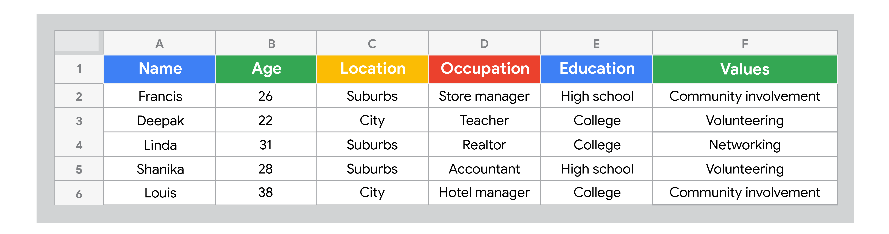

# Consigue la venta: crea, lanza y administra tiendas de comercio electrónico

## Introducción a “Consigue la venta: construye, lanza y administra tiendas de comercio electrónico”

### Primeros pasos en el curso

#### Introducción al curso 6

Consigue la venta: construye, lanza y administra tiendas de comercio electrónico. Actualmente, las compras en línea son más populares que nunca, y los números siguen creciendo. En poco más de una década, el mercado global del comercio electrónico creció más del 600%. El comercio electrónico cambió por completo el mundo minorista y continúa haciéndolo. También trajo consigo muchos nuevos puestos de trabajo, como los que estás buscando al tomar este programa. Aprendiste mucho sobre marketing digital en cursos anteriores. Ahora, en este curso, nos enfocaremos en el comercio electrónico, específicamente, en la venta en línea. El comercio electrónico utiliza el marketing digital para atraer y retener clientes. También utiliza el embudo de marketing que aprendiste antes, que incluye la Conciencia, Consideración, Conversión y Fidelidad. En muchos sentidos, el marketing digital y el comercio electrónico coinciden. Pero el comercio electrónico incluye otras funciones y responsabilidades fuera del marketing digital, como la gestión de productos, ejecución de pedidos, envíos, y servicio al cliente. Conocerás más sobre esos temas después. Antes de empezar, me presentaré. Soy Cindy, Líder de Excelenccia en Ventas aquí, en Google. El objetivo de mi equipo es ayudar a vendedores/as a través de la práctica, el coaching y la retroalimentación. Antes de este cargo, trabajé en un equipo que ayudó a varias marcas a lanzar sus propios canales de comercio electrónico y a vender directamente a los/las consumidores/as. Nuestro objetivo era asegurarnos de que nuestros/as socios/as de marca pudieran crear y capturar demanda en línea. Trabajo en marketing digital y comercio electrónico hace más de seis años, y, aunque no fue sencillo, llegué aquí. Mis estudios fueron en ingeniería biomédica. Pero cuando estaba a punto de empezar la escuela de medicina, tuve un momento de pánico y me di cuenta de que no podía estar cerca de sangre y agujas. Un mentor me animó a solicitar un puesto de marketing en una gran empresa de bienes de consumo. Después de trabajar para grandes marcas, descubrí que quería aprender más sobre marketing digital. Es cuando comencé en Google. Comencemos por revisar lo que lo vimos hasta ahora. Primero, exploraste cómo atraer e involucrar clientes en línea. Descubriste formas para llegar a más clientes potenciales y a mantenerlos/as interesados/as en tu negocio. Después, descubriste el potencial del marketing por correo electrónico. Aprendiste que el correo electrónico es una forma de conectar a las/los clientes con tu marca. Después de eso, conociste la forma de usar las redes sociales como herramienta de marketing. Aprendiste a conectar con las/los clientes en sus canales preferidos.
Reproduce el video desde :2:49 y sigue la transcripción2:49
También conociste cómo captar su atención con redes sociales y publicidad para hacer crecer tu negocio. Por último, viste la importancia del análsis de marketing y medición. Conociste cómo tomar decisiones basadas en datos. Fue mucho aprendizaje. Hiciste un trabajo increíble al llegar hasta aquí.
Reproduce el video desde :3:11 y sigue la transcripción3:11
En este curso, descubrirás qué es el comercio electrónico y cuáles son los beneficios de la venta en línea. Conocerás los términos de comercio electrónico y te familiarizarás con las herramientas y plataformas disponibles para vender en línea. Aprenderás sobre tiendas de comercio electrónico y cómo funcionan. Verás cómo impulsar tráfico valioso a una tienda de comercio electrónico con publicidad y campañas. Después, aprenderás a involucrar a las/los clientes y crear experiencias personalizadas en línea. Finalmente, aprenderás sobre el proceso de pago y cómo hacer llegar los productos a las/los clientes. Espero poder guiarte mientras exploramos el creciente campo del comercio electrónico. Hay mucho que aprender y me emociona acompañarte en este viaje. A continuación, conocerás de qué se trata el comercio electrónico. ¿Comenzamos? Vamos.

### Qué tienes que saber acerca del comercio electrónico y por qué es importante

#### Te damos la bienvenida a la semana 1 curso 6

Hola de nuevo. Hagamos un resumen de lo que verás en las siguientes lecciones. Primero, aprenderás cómo funciona el comercio electrónico y qué tipo de productos o servicios puedes vender en línea. También, conocerás cuáles son los beneficios de vender en línea, los términos básicos del comercio electrónico y los puestos de nivel inicial a los que podrías postularte. Después, aprenderás a hacer un estudio de mercado, a identificar a tu público objetivo y a investigar productos. Y, finalmente, aprenderás sobre abastecimiento de productos y marketing de marca en comercio electrónico. ¿Qué te parece? Comencemos.

#### ¿Qué es el comercio electrónico?

¿Quieres aprender sobre comercio electrónico? En este video aprenderemos de qué se trata y lo que te permite hacer. Luego, veremos ejemplos de los productos que puedes comprar o vender con comercio electrónico. Primero, veremos qué significa el comercio electrónico. Se define como la compra y venta de bienes o servicios a través de Internet. También se lo conoce como e-commerce. Te permite agregar productos o servicios a tu sitio web y recibir pagos en línea de tus clientes. En una tienda minorista tradicional, también conocida como tienda física, haces compras en persona al elegir productos de los estantes y ves el producto de cerca o incluso te lo pruebas. También puedes pedir ayuda en la tienda para encontrar un producto. Luego lo llevas a la caja y pagas antes de salir de la tienda. En las de comercio electrónico, la visita es en línea, después de buscar un producto en Google o de hacer clic en un anuncio en redes. Compras al navegar por las páginas web, agregas algo a tu carrito de compras virtual, y luego pagas por el producto con un sistema de pago digital. Cuando tu pedido está listo, se envía a tu dirección o a una ubicación para que lo recojas. Los tipos de productos en línea pueden variar ampliamente, pero a menudo entran dentro una de estas cuatro categorías: bienes físicos, bienes digitales, servicios o software. Si piensas en comercio electrónico, pensarías en algo como zapatos que compras en línea y los recibes en casa. Estos se consideran bienes físicos, dado que algo que puedes tocar y sostener. Otros ejemplos de bienes físicos podrían ser libros, electrodomésticos o fundas para teléfonos. Otro ejemplo podría ser un libro electrónico que compras en línea y descargas en tu dispositivo. Eso se considera un producto digital. Otros tipos de productos digitales son fotos digitales, archivos de música digitales o cursos en línea, como este. También podrías pensar en algo como clases en línea. Ese es un ejemplo de servicio. Otros servicios son coaching de salud, consultoría de negocios o servicios profesionales, como diseño gráfico. Por último, puede que pienses en Adobe Photoshop, un programa de software que compras en línea y lo descargas. Eso se considera un producto de software. La mayoría de nosotros sabemos lo que es ser un/a cliente. Ahora exploramos cómo es ser quien hace la venta. Puedes usar tu propia experiencia y crear una mejor para las/los clientes que visitan tu tienda sin importar qué productos vendes. Es todo por ahora. Hasta el próximo video.

#### Los beneficios de vender en línea

Ya aprendiste qué es el comercio electrónico, cómo funciona, y los productos que puedes vender en línea. Ahora veremos por qué una empresa elige vender en línea. Cómo cambió la forma de comprar de las personas en los últimos años. Las personas investigan los productos en línea antes de comprarlos, incluso desde su teléfono móvil. Usan Internet para averiguar qué productos están disponibles, elegir los que necesitan y hacer su compra final. En este proceso, pueden interactuar con una marca en múltiples canales en diferentes puntos durante el proceso de compra. Por ejemplo, en redes sociales, en una aplicación móvil, en un sitio web, en un chat en línea o al visitar una tienda física, solo por nombrar algunos. El recorrido del cliente es más como una carretera sinuosa que un camino recto de A a B. Y este recorrido involucra cada vez más la búsqueda de productos en Internet. Por eso es importante para cualquier negocio hoy en día vender en línea. Ahora, analicemos las ventajas de vender en línea y cómo un negocio elige hacerlo. Una tienda física tiene una ubicación específica, a donde las/los clientes van a comprar. Por lo general, abre en cierto horario y se limita por el número de clientes que llegan a su ubicación. Una tienda de comercio electrónico permite hacer compras en línea desde cualquier lugar y momento. Con el comercio electrónico puedes llegar a más clientes porque no requiere que las personas vivan cerca para llegar. Solo necesitan un dispositivo con Internet para poder comprar. Ese es uno de los beneficios de vender en línea. El comercio electrónico incluye dos tipos de negocios. Uno vende sus productos solo en línea. El otro vende en línea, así como en una tienda física. También se llama tienda física (click-and-mortar). Una tienda de comercio electrónico solo en línea te ahorra gastos generales ya que no necesitas el espacio comercial o personal de la tienda tradicional. Puedes comenzar a vender nuevos productos más rápidamente porque no necesitas almacenarlos en las tiendas. Te puedes adaptar a las necesidades de las/los clientes al mejorar su experiencia con base en datos. Otra ventaja es que puedes llegar a clientes que buscan productos específicos que no están disponibles en tiendas locales. Por ejemplo, un libro específico para una clase o un traje de baño en época de invierno. Vender en línea permite que un negocio crezca incluso si es difícil atraer clientes localmente. Un desafío para el comercio electrónico es que las/los clientes no pueden ver o probar productos, como en la tienda, por lo que hay una mayor tasa de devoluciones. También se debe considerar el costo de envío. Si el negocio ofrece envíos sin costo, una ventaja que muchas personas esperan, los costos adicionales reducirán los beneficios de la empresa. Las tiendas de comercio electrónico no ofrecen servicio al cliente en persona como las tiendas físicas. Ahora, veamos las razones por las que las tiendas físicas podrían incluir ventas en línea, y se se convertirían en tiendas en línea. Por ejemplo, piensa en un negocio que ya tiene tiendas físicas, como una que vende suministros de oficina. ¿Por qué hacer que sus productos estén disponibles en línea? Porque la mayoría de sus clientes compran en línea primero, incluso si compran en la tienda. Según Google, los/las compradores/as van primero en línea en más del 60% de las ocasiones de compra. Se quieren asegurar de que un negocio tiene lo que quieren antes de ir a la tienda. Algunas personas van a la tienda para probar un producto personalmente, pero terminan comprándolo en línea. Compran en línea porque necesitan tiempo para decidir cuál es el producto adecuado. Puede que busquen un mejor precio en línea del que hay en las tiendas o tal vez quieran averiguar si hay más opciones disponibles en línea, como otros tamaños o colores. Lo que nos lleva a otros beneficios de vender en línea. El comercio electrónico te permite vender muchos más productos, de los que entrarían en una tienda. Las compras en línea impulsan el tráfico en la tienda si las/los clientes pueden comprar y recoger el pedido en la tienda. Puede que compren más artículos mientras están en la tienda. Además, permite a las/los clientes recibir su pedido el mismo día sin esperar a que se envíe a su dirección. También ahorra en costos de envío. Tu propia experiencia al comprar productos te dará razones por las que eliges comprar en línea o en la tienda. Por ejemplo, ¿necesitabas el producto el mismo día? ¿Estaba disponible en una tienda cercana a ti? ¿Querías comprar desde casa? ¿Querías probar el producto o recibir ayuda en persona? Todas son razones para considerar cuando se trata de servir a tus clientes. Tanto las tiendas físicas como las de comercio electrónico son valiosas. Pero cada vez más, las personas esperan poder explorar el inventario y comprar productos en línea, incluso si tienes una tienda física. Por esa razón, el comercio electrónico es importante para cualquier negocio. Ahora, que conocemos los beneficios de vender en línea, veremos los fundamentos del comercio electrónico.

#### Henry: Mi trayectoria profesional en el comercio electrónico

Soy Henry, y soy Líder de Estrategia Digital en el Equipo de Crecimiento Acelerado de Google. Llegué al marketing digital casi por accidente. Hacía ventas por televisión, y allí había algo de marketing digital involucrado a través de video digital y productos de video bajo demanda, y fue entonces cuando me familiaricé con la industria y empecé a aprender más sobre diferentes temas en el sector de la publicidad digital. Cuando estaba aprendiendo sobre marketing digital y enseñándome a mí mismo acerca de diferentes aspectos del marketing digital, terminé dejando la posición que estaba desempeñando para empezar mi propio negocio. Dirigí un negocio llamado Sunny Pickup, que era básicamente un servicio de lavandería bajo demanda. No es un negocio típico de comercio electrónico porque no vendíamos un producto, sino que teníamos un servicio tecnológico que permitía recolectar la ropa sucia de la gente, lavarla, secarla, doblarla y devolverla en 24 horas. Definitivamente era un tipo de negocio conveniente basado en servicios que permitía a las personas usar la tecnología para facilitar sus vidas. Y cuando estaba empezando mi propia empresa, definitivamente había muchas tareas de marketing digital que, como dueño del negocio, tenía para hacer. Y, por supuesto, cuando eres el dueño del negocio, básicamente supervisas todo lo que sucede en él. Parte de esto lo aprendí a través de algunos líderes y mentores que desarrollé en la industria, pero definitivamente usé mucho contenido en línea para aprender algunos conceptos básicos en términos de Google Ads, Google Analytics, como cuáles son los bloques fundamentales de construcción del marketing digital, cómo impactan en los negocios y qué necesitan hacer las empresas para maximizar esas oportunidades. Vender en línea tiene muchas ventajas. Diría que una de las principales es, definitivamente, el margen de beneficio. Dirigir un sitio web, definitivamente, es mucho menos costoso que administrar una tienda física. Así que, cuando diriges un negocio y estás tratando de ganar dinero, un punto en el que siempre puedes enfocarte es en reducir costos, y vender en línea es definitivamente una vía para eso. Vender en línea también es muy importante cuando se trata de la cantidad de personas a las que potencialmente les puedes vender. En una tienda física, básicamente, estás limitado por el área geográfica en la que opera tu tienda. La mayoría de la gente no recorrerá tres o cinco millas para hacer alguna compra. Pero, cuando vendes en línea, básicamente el mundo es tuyo. Cualquiera puede acceder a un sitio web desde cualquier lugar en el mundo y potencialmente comprar tu producto. La información que puedes obtener sobre tus clientes a través de los canales en línea es mucho más impactante que los datos que puedes recopilar de tus ventas personalmente. Una de las cosas que puedes ver en línea es cómo la gente reacciona con los diferentes productos que vendes. ¿Las personas miran este producto durante mucho tiempo? ¿Lo miran por poco tiempo? ¿No les interesa? ¿Dónde están haciendo clic? ¿Dónde van a dejarlos? ¿Por qué ya no les interesa? Estos son temas que puedes usar para desarrollar tu estrategia de producto y también tu estrategia publicitaria. Por último, hay desafíos mayores a nivel general que pueden afectar la venta en línea. La mayoría de las ventas en los Estados Unidos y en el mundo aún ocurren en tiendas físicas, pero se pueden ver fuertes tendencias año tras año para impulsar más las ventas en línea, en especial las relacionadas con la pandemia y todo lo que está sucediendo en el entorno macroeconómico. Definitivamente querrás ir a donde va el comportamiento de los/las consumidores/as. No querrás luchar contra ese comportamiento. La pandemia jugó un papel realmente instrumental al cambiar la forma en que los/las consumidores/as quieren interactuar con sus marcas o empresas favoritas. Antes, a la gente le entusiasmaba mucho más ir a las tiendas, probar nuevos productos, probarse ropa nueva, o lo que fuera. Pero ahora más y más personas solo quieren probarse las cosas en casa. Saben que pueden devolver los productos si hay un problema y cada vez más personas solo quieren lidiar con la comodidad del entorno en su hogar en vez del ajetreo y el bullicio de estar en espacios concurridos. Creo que el futuro del comercio electrónico será definitivamente muy competitivo, pero creo que ofrecerá una gran cantidad de oportunidades para muchas personas y en rubros diferentes. Hay un montón de personas fuera de las empresas de tecnología, a través de agencias, propietarios/as únicos/as, a través de dueños/as de empresas que están superándose a sí mismos/as y desarrollando una carrera de manera efectiva y creciendo a través del comercio electrónico, y eso seguirá aumentando con el tiempo.

### Términos, herramientas y estrategias del comercio electrónico

#### Conoce los fundamentos del comercio electrónico

Ahora, que sabes por qué el comercio electrónico es importante, es hora de ver lo básico. En este video, veremos los términos comunes, las herramientas y las plataformas usadas en el comercio electrónico. También obtendrás una visión general de los roles de nivel inicial disponibles en el comercio electrónico. Comencemos con la terminología básica que más se usa. Debes comprender algunos términos relacionados con cómo navegan las/los clientes en un sitio web. Primero, una tienda de comercio electrónico recibe visitas en su sitio web. Esas visitas constituyen el tráfico de un sitio web. El tráfico es el número de visitas que recibe un sitio web.
Reproduce el video desde ::44 y sigue la transcripción0:44
La primera página que ve un/a visitante en un sitio web se llama página de destino. Esta podría ser una página de inicio, de producto o cualquier otra.
Reproduce el video desde ::56 y sigue la transcripción0:56
Cuando un/a cliente visita un sitio web, quieres que haga una acción, como comprar un producto o suscribirse a una lista de correo. Una llamada a la acción es una instrucción que le indica al/a cliente qué hacer a continuación. Por ejemplo, una llamada a la acción es el botón "Añadir al carrito". O un enlace que diga: "Regístrate para recibir correos electrónicos" en la página de inicio. Después, la/el cliente agrega un producto a su carrito de compras digital. Esto es el equivalente virtual de un carrito de compras físico. Lleva un seguimiento de todos los elementos que la persona planea comprar. Cuando la/el cliente termina de comprar, puede comenzar el proceso de pago en línea. Podrá completar su compra ingresando su información de pago durante el proceso de pago. Se hace a través del proveedor de servicios de pago, que es una forma segura de procesar transacciones en línea. El proveedor permite que la tienda de comercio electrónico acepte y procese múltiples tipos de pagos, como tarjetas de crédito, de débito, o servicios de pago de terceros. Cuando un/a cliente realiza una compra, esta acción se registra como una conversión, que es la realización de una actividad que contribuye al éxito de un negocio. Tal vez recuerdes lo que viste sobre conversiones antes. La conversión ocurre cuando un/a cliente completa la acción que solicitaste, como registrarse en una lista de correo electrónico, completar un formulario de contacto, o pasar cierto tiempo en el sitio. Pero en el comercio electrónico, la conversión más frecuente se refiere al proceso de convertir a un/a visitante en un/a cliente que paga. Sucede cuando un/a cliente hace una compra en tu sitio y completa el proceso de pago. Ahora, que conoces los términos básicos del comercio electrónico, exploremos las herramientas y plataformas que puedas encontrar. Una tienda de comercio electrónico se basa en un plataforma que es un software que te permite vender productos o servicios en línea. Una plataforma que usan muchas tiendas de comercio electrónico es Shopify. Con una plataforma como esta, puedes administrar tu sitio web, hacer campañas de marketing, administrar los envíos y abastecimiento, configurar servicios de pago, análisis de revisión y más. Todo en un solo lugar. Además de todo esto, también puedes usar herramientas de negocios como Salesforce, que te ayuda a administrar y monitorear varios aspectos de tu empresa, como ventas, marketing, analítica y servicio al cliente. Puedes usar herramientas específicas, según la necesidad que tengas para un proyecto, como publicidad, redes sociales o marketing por correo electrónico. Son herramientas que viste anteriormente. También es importante saber cómo usar software básico de oficina. Las herramientas con las que necesitas familiarizarte pueden variar según el puesto que ocupes. Revisemos los roles de nivel inicial más comunes en comercio electrónico, para que sepas qué te puede interesar. Algunos puestos de nivel inicial a los que puedes postularte son analista de comercio electrónico, especialista de comercio electrónico, asistente de comercio electrónico o especialista en marketing digital. Estas funciones incluyen agregar o actualizar productos en un sitio web de comercio electrónico, ayudar con campañas en línea, medir el éxito de la empresa a través de la analítica, gestión de campañas de correo, monitoreo de redes sociales de la empresa, ejecutar anuncios pagados y más. El conocimiento y las habilidades recién adquiridos te ayudarán a prepararte para uno de estos puestos de nivel inicial. Vas por buen camino en el aprendizaje del comercio electrónico.

#### Conoce más sobre los fundamentos del comercio electrónico

Ahora, que conoces los fundamentos del comercio electrónico, tienes todo listo para aprender más sobre este sector de rápido crecimiento. Esta lectura te ayudará a familiarizarte con los términos, las plataformas, las herramientas y los puestos laborales disponibles en el comercio electrónico.

Por qué es importante el comercio electrónico
El comercio electrónico creció considerablemente en 2020 en todo el mundo, consolidándose como una alternativa cada vez más popular para la compra y venta de productos y servicios e incrementando su participación en las ventas minoristas de las tiendas físicas (brick-and-mortar). Solo en 2020, las ventas aumentaron hasta casi cinco veces más rápido que en el periodo anterior debido a los cambios en el mercado global.

Cuanto más crece el comercio electrónico, más oportunidades pierden las empresas de atraer nuevos/as clientes y hacer crecer su negocio si no venden sus productos o servicios en línea. El comercio electrónico es beneficioso para empresas de cualquier tamaño, ya sea una startup, una empresa pequeña o un minorista importante.

Estos son algunas de las ventajas del comercio electrónico:

Permite a las empresas vender productos a clientes de todo el mundo, ya que casi cualquier persona puede visitar la tienda en línea.

Reduce los gastos generales y los costos de inicio, ya que no requiere de una tienda física.

Facilita la venta de una amplia gama de productos, ya que no requiere espacio físico para exhibirlo.

Permite a las/los clientes investigar los productos disponibles en la tienda antes de visitar una ubicación física.

Permanece abierto las 24 horas, los 7 días de la semana, para que las personas puedan comprar cuando quieran.

Posibilita a las empresas personalizar la experiencia de las/los clientes en función de los datos o las preferencias guardadas, de modo que puedan proporcionar un mejor servicio y aumentar la interacción con las personas en línea.

Proporciona datos sobre el comportamiento de las/los clientes, de modo que las empresas puedan mejorar su tienda de comercio electrónico.

Términos básicos del comercio electrónico
Estos son algunos términos básicos que debes conocer para dar tus primeros pasos en el mundo del comercio electrónico:

Comercio electrónico (e-commerce): Compra y venta de bienes o servicios a través de Internet.

Tienda de comercio electrónico: Tienda que vende sus productos en línea.

Plataforma de comercio electrónico: Aplicación de software que permite vender productos o servicios en línea.

Sitio web responsivo: Sitio web que está diseñado para funcionar en todo tipo de dispositivos, incluyendo computadoras, teléfonos móviles y tabletas.

Dominio: La parte central de la URL o dirección de Internet de un sitio web, como google.com.

Página de destino: La primera página que una persona encuentra cuando accede a un sitio web

Llamada a la acción (call to action o CTA): Estímulo que busca inducir a las/los clientes a hacer algo a continuación.

Conversión: Realización de una actividad que contribuye al éxito de un negocio.

Carrito de compras digital: Equivalente virtual de un carrito de compras físico.

Proveedor de servicios de pago: Forma segura de procesar transacciones en línea

Herramientas para el comercio electrónico
En comercio electrónico, se utilizan diversas herramientas, entre ellas las plataformas, que son una solución específica. Las herramientas que necesites utilizar dependerán de la empresa para la que trabajes y de cuáles sean tus responsabilidades. Es recomendable que explores algunas de estas soluciones por tu cuenta, ya que te permitirá familiarizarte con su funcionamiento y facilitará el aprendizaje de nuevas herramientas en el trabajo.

Aunque las herramientas mencionadas en esta lectura son algunas de las opciones más populares, existen muchas otras opciones igualmente buenas. Además, debido a la naturaleza en constante cambio y rápido crecimiento del comercio electrónico, es habitual encontrarse con nuevas plataformas y herramientas que se lanzan regularmente. Por esta razón, la lista de las plataformas y herramientas más populares está en constante evolución. 

Aunque no es obligatorio, visitar los sitios web de las siguientes herramientas y plataformas de comercio electrónico puede ser una buena oportunidad para que te familiarices con algunas de las diferentes soluciones que puedes utilizar en tu trabajo.

Plataformas de comercio electrónico

Como aprendiste en un video previo, una tienda de comercio electrónico generalmente se construye en una plataforma de comercio electrónico, es decir, una aplicación de software para vender productos o servicios en línea. El uso de una plataforma hace que sea más fácil comenzar a vender en línea, dado que no necesitas tener habilidades de desarrollo de software. Las plataformas de comercio electrónico suelen incluir herramientas integradas de marketing, análisis de datos, gestión de inventario, logística y otros aspectos del negocio.

Aquí hay algunas de las plataformas de comercio electrónico más populares:

Shopify <https://www.shopify.com/>

Wix <https://www.wix.com/>

BigCommerce <https://www.bigcommerce.com/>

Squarespace <https://www.squarespace.com/>

WooCommerce <https://woocommerce.com/>

Magento Open Source <https://business.adobe.com/products/magento/open-source.html>

Shopify, Wix, BigCommerce y Squarespace son plataformas de software como servicio (SaaS), es decir, un software basado en la web disponible por suscripción. Con una plataforma SaaS, no necesitas saber HTML ni contar con habilidades de desarrollo web. Simplemente, puedes elegir entre las opciones disponibles en la plataforma.

WooCommerce y Magento Open Source son dos ejemplos de plataformas de código abierto, es decir, cuyo software permite a las personas acceder y editar el código fuente original. Esto significa que puedes personalizar el sitio web como más te guste. No obstante, debes tener en cuenta que para realizar este tipo de cambios en una plataforma de código se requiere ciertas habilidades de desarrollo web o la capacidad de contratar a alguien para que realice estos cambios por ti.

Otras herramientas para el comercio electrónico

Además de trabajar en una plataforma de comercio electrónico, es probable que utilices otras herramientas para hacer tu trabajo. Estas herramientas pueden resultar útiles para comunicar y compartir información con tu equipo, gestionar proyectos o campañas de marketing, revisar análisis, hacer un seguimiento de problemas de servicio de atención al cliente y más.

Aquí hay algunos tipos de herramientas de comercio electrónico que podrías utilizar, junto con algunos ejemplos de cada tipo:

Sistema de administración de relaciones con clientes (customer relationship management, CRM): estas herramientas ayudan a las empresas a administrar y monitorear diversos aspectos del negocio, como las ventas, el marketing, las analíticas y el servicio de atención al cliente. Estos son algunos ejemplos:

Salesforce <https://www.salesforce.org/>

Oracle <https://www.oracle.com/index.html>

HubSpot <https://www.hubspot.com/>

Colaboración en equipo: estas herramientas ayudan a los equipos de trabajo a mantenerse organizados, dado que facilitan la comunicación interna. Algunas funciones que pueden incluir son  correo electrónico, videollamadas, almacenamiento en la nube, mensajería, uso compartido de archivos y más. Aquí hay algunos ejemplos:

Google Workspace <https://workspace.google.com/>

Microsoft Teams <https://www.microsoft.com/en-us/microsoft-teams/group-chat-software>

Slack <https://slack.com/>

Publicidad digital y publicidad de pago por clic (PPC): estas herramientas ayudan a los equipos de trabajo a administrar sus campañas publicitarias en línea. Algunos ejemplos son:

Search Ads 360 <https://marketingplatform.google.com/about/search-ads-360/>

AdRoll <https://www.adroll.com/>

Marketing digital: estas herramientas facilitan la gestión de campañas de marketing por correo electrónico, redes sociales u otros canales. Algunos ejemplos son:

HubSpot <https://www.hubspot.com/>

Hootsuite <https://www.hootsuite.com/>

Sprout Social <https://sproutsocial.com/>

Optimización de motores de búsqueda (SEO): estas herramientas ayudan a monitorear y mejorar el rendimiento de un sitio web en los resultados de búsqueda. Algunos ejemplos son:

Central de la Búsqueda de Google <https://developers.google.com/search>

Semrush <https://developers.google.com/search>

Analítica: estas herramientas ayudan a las empresas a analizar el tráfico de su sitio web, las ventas y otros datos.

Google Analytics <https://marketingplatform.google.com/about/analytics/>

Adobe Analytics <https://business.adobe.com/products/analytics/adobe-analytics.html>

Tableau <https://www.tableau.com/>

Puestos laborales de comercio electrónico de nivel inicial
A medida que el comercio electrónico continúa creciendo, también lo hace el número  de trabajos disponibles en este mercado de alta demanda. Al completar este programa de certificado de carrera, estarás mejor preparado/a para postularte a un puesto laboral de nivel inicial en este sector.

Aquí hay algunos ejemplos de posiciones de nivel inicial en comercio electrónico:

Analista de comercio electrónico

Especialista en comercio electrónico

Asistente de comercio electrónico

Coordinador/a de comercio electrónico

Gerente/a de productos de comercio electrónico

Estos son algunos ejemplos de posiciones de nivel inicial en marketing digital que puedes encontrar en una empresa de comercio electrónico:

Especialista en marketing digital

Coordinador/a de marketing digital

Especialista en optimización de motores de búsqueda 

Especialista en marketing de motores de búsqueda

Gerente/a de redes sociales

Especialista en marketing por correo electrónico

Existe una gran variedad de funciones y puestos laborales en el campo del comercio electrónico. Por lo tanto, al buscar trabajo, te recomendamos mirar diversos puestos de trabajo para el adecuado. Aunque tus responsabilidades pueden variar incluso dentro del mismo puesto, la descripción de la posición puede brindar información detallada acerca de cuáles serán las tareas a cumplir. Además, durante la entrevista laboral, es importante hacer preguntas específicas sobre las funciones del puesto.

Para obtener una comprensión más clara de las responsabilidades y requisitos de cada rol, se pueden buscar ofertas de trabajo en sitios como LinkedIn o Indeed. Esto puede ayudarte a determinar qué tipo de rol es el más adecuado para ti.

Otros roles de nivel inicial en el comercio electrónico

Hay muchos otros roles disponibles en el comercio electrónico que pueden requerir capacitación o experiencia, más allá de la información que recibirás en este curso.

Aquí encontrarás algunos ejemplos:

Desarrollador/a web

Soporte de TI

Coordinador/a de logística

Coordinador/a de operaciones digitales

Gerente/a de proyectos

Redactor/a digital

Diseñador/a gráfico digital

Analista financiero

Analista de datos

Especialista en atención al cliente

Conclusiones clave

Para comenzar a trabajar en el sector del comercio electrónico, es útil conocer cuáles son los términos básicos, las herramientas y las plataformas que comúnmente se usan en la industria, de modo que puedas comunicarte con posibles empleadores/as, compañeros/as de equipo y partes interesadas. También te servirá obtener una visión general de los puestos laborales de nivel inicial disponibles en el sector para que puedas comenzar a pensar qué tipo de roles podrían ser más adecuados para ti.

#### Jaylin: El rol de un/a especialista en comercio electrónico de nivel inicial en una gran empresa grande y en una pyme

Hola, mi nombre es Jay. Trabajo para Google como Estratega de Cuentas de Google Ads específicamente para las agencias, lo que significa que me asocio a ellas y las ayudo (a ellas y a sus principales clientes) a utilizar Google Ads de una manera que beneficie y haga crecer las cuentas de sus clientes. Gran parte de la experiencia que tengo en marketing digital proviene de ayudar a algunas de mis amistades con sus pequeñas empresas y emprendimientos en Instagram u otras redes sociales similares. Durante mi experiencia en marketing digital con algunas de mis amistades, antes de sumarme a Google, descubrí que lo que más me entusiasmaba y motivaba era la libertad creativa para explorar distintas y ideas y enfoques. Me encanta probar y pensar en cosas nuevas, probar y entusiasmar a la gente sobre cosas que también me entusiasman, así que muchos de esos fueron proyectos apasionantes. Cuando se trata de ser un/a estratega de nivel inicial, las tareas comunes que podrías encontrarte haciendo son: imagínate hablando por teléfono o a través de una videoconferencia. Las conversaciones con mis clientes de comercio electrónico pueden variar dependiendo de las etapas en las que nos encontremos. Pero, generalmente, buscamos comprender mejor en qué punto están en términos de presupuesto disponible, en qué medida sus resultados coinciden con sus expectativas, y luego evaluar cómo estamos progresando en relación a nuestros objetivos reales. Estos objetivos pueden ser el objetivo de marketing, como “Queremos vender X cantidad más de cualquier producto”, o pueden estar relacionados con un objetivo comercial específico, como “Queremos vender X cantidad más de este producto en rojo, en lugar del negro, púrpura y verde, que quizá también se ofrezca". Y luego, a partir de ahí, optimizar en torno a esos objetivos y expectativas dentro de las cuentas. Muchos de estos temas diversos para clientes diferentes van a venir con fechas de vencimiento específicas, por lo que también será importante entender realmente el valor de tu tiempo y dónde colocarlo para asegurarte de que las cosas se hagan de manera adecuada y según el plazo establecido. Uno de los beneficios de trabajar para una empresa más grande es la amplitud y el alcance de los temas que tenemos a disposición. Google, como cualquier empresa grande, abarca muchas cosas diferentes. Es fácil pensar en ti mismo/a como un/a empleado/a enfocado/a a una sola cosa, aunque no necesariamente tiene que ser así. Hay mucho por ahí, y debes ser capaz de usar las herramientas que has adquirido a lo largo de tu tiempo en donde sea que lo inviertas, para luego seguir creciendo y tal vez extender tus alas hacia algo nuevo. Si trabajas en una empresa pequeña como estratega de comercio electrónico, tendrás la capacidad de adentrarte en los detalles de los tipos de cosas que en verdad impulsan la estrategia de comercio electrónico. Esto puede ser un costo por clic o las tasas de interacción, o cuántas personas visitaron tu sitio. Cuando se trata de una pequeña empresa, estas son las cosas con las que tienes mucho más tiempo para involucrarte a fin de influir realmente en el cambio porque, primero, tienes solo un negocio por el que preocuparte y, dos, porque tienes una comprensión mucho más profunda de ese negocio, dado que eres directamente parte de él. No importa si es una empresa grande o pequeña, eres tú quien dicta tu trayectoria profesional. Dicen que el mejor momento para empezar fue ayer y el segundo mejor para empezar es ahora, así que bien podrías comenzar a ponerlo en marcha, ¿verdad? Y, con suerte, este certificado cerrará esa brecha entre donde estás y a donde quieres ir, ya que cuentas con muchos de los de los recursos que tienes en tu kit herramientas.

#### Estrategias esenciales de comercio electrónico

El 50% de las personas de entre 26 y 41 años, también conocidas millennials, realizan la mayoría de sus compras en línea, según una encuesta elaborada por Morning Brew-Harris. Las ventas en línea siguen creciendo a un ritmo acelerado para todos los grupos de edad. En esta lectura, te proporcionaremos una visión general de los elementos esenciales de una estrategia de comercio electrónico para atraer clientes en línea en un mercado altamente competitivo.

Estrategia de comercio electrónico
Una estrategia de comercio electrónico es un plan de trabajo para promocionar una tienda en línea y aumentar sus ventas. Es fundamental que cada negocio en línea desarrolle y ejecute una estrategia de comercio electrónico. A continuación, incluimos una descripción general de los métodos de descubrimiento, es decir, aquellas técnicas y herramientas utilizadas para ayudar a las personas a encontrar una empresa o una marca en línea.

Perfil de negocio
Anteriormente, aprendiste sobre el Perfil de Negocio de Google, el cual permite a cualquier empresa personalizar cómo aparece su información comercial en el buscador de Google y en Google Maps. Ten en cuenta que Google Maps también se aplica a negocios en línea que tienen tiendas locales en áreas seleccionadas. Un Perfil de Negocio permite a empresas de cualquier tamaño comunicar que existen y que están abiertas al público.

Redes sociales orgánicas
Según una encuesta realizada por Sprout Social, el 40% de las/los clientes en línea encuentran nuevas marcas a través de su red personal, mientras que el 32% de las/los clientes en línea lo hacen por medio del boca a boca. Estos son ejemplos de redes sociales orgánicas. Además, con la creciente popularidad de YouTube y el auge de TikTok, gran parte del contenido de redes sociales orgánicas proviene de videos.

Búsqueda de pago, display, redes sociales y anuncios de shopping
Una estrategia de comercio electrónico suele incluir búsqueda de pago, display, redes sociales y anuncios de shopping, dado que una combinación de contenido orgánico y pagado genera mejores resultados. Los anuncios pagados ofrecen el beneficio de tener un control directo sobre la marca, el texto publicitario, las páginas de destino, las estrategias de puja y el rendimiento. Asimismo, son responsables de una parte significativa de los ingresos de las empresas de comercio electrónico. Aunque algunas personas que utilizan las redes sociales bloquean el contenido de marca en sus feeds, los anuncios pagados en redes sociales siguen siendo una herramienta útil dentro de una estrategia de comercio electrónico. Desde una perspectiva de contenido, los anuncios de shopping en Facebook e Instagram pueden ser bastante efectivos, llegando a lograr el interés de algunos/as usuarios/as sin siquiera darse cuenta de que se trata de un anuncio pagado.

Marketing de influencers
Un pequeño, aunque creciente, número de clientes en línea encuentra nuevas marcas a través de las/los influencers a quienes siguen. Se estima que alrededor  del 35% de las/los clientes en línea lo hacen. Las/los influencers pueden ayudar a las marcas o productos a llegar a clientes adecuados/as con un mensaje que se adapte a los intereses del público. Una campaña de influencers pagados puede ser parte de una estrategia de comercio electrónico, pero ten en cuenta ciertas prácticas que limitan su impacto:

Algunas campañas de marketing encubierto publican contenido que parece ser de boca en boca sin revelar que forma parte de una campaña publicitaria patrocinada. Esto hace que el público desconfíe un poco de las/los influencers.

Algunos/as clientes compran productos que un/a influencer recomienda solo cuando este/a muestra evidencia de uso personal. Por ejemplo, cuando publica fotos de envases vacíos para demostrar que de verdad usó el producto que está recomendando.

Algunos/as influencers pueden tener seguidores falsos impulsados por bots (un bot interactúa con los sistemas, pero no es un usuario humano). Tener un gran número de seguidores no siempre significa necesariamente que haya mucha interacción.

Anuncios en tiendas
Por último, en un negocio híbrido, que atiende tanto a clientes en una tienda física como en línea, los anuncios en la tienda que resalten los beneficios, la comodidad y el ahorro de costos en la compra en línea pueden ser muy efectivos para atraer ventas en línea de clientes ya existentes en la tienda. Como incentivo, algunos negocios optan por ofrecer inventario especial (tamaños o colores difíciles de encontrar) y un inventario de liquidación con un descuento mayor solo para clientes en línea.

Innovación en comercio electrónico
Una estrategia de comercio electrónico también debe ser innovadora para mejorar el valor del negocio. Algunos de estos cambios podrían incluir:

Mejorar la comunicación y el seguimiento de envíos con las/los clientes

Más logística local, a veces llamada micrologística

Uso de redes y servicios de logística

Uso de envío directo por parte de mayoristas para reducir el inventario de los minoristas

Devoluciones “en la acera” (hace referencia a la posibilidad de devolver un producto adquirido, sin bajarse del automóvil)

Diversificación de métodos de pago

Conclusiones clave

Una estrategia de comercio electrónico es fundamental para lanzar, hacer crecer y mantener un negocio en línea. A medida que más personas compren a través de este canal, la calidad de los productos, el precio, la velocidad de entrega y las políticas de devolución impactarán en sus decisiones de compra. Para que una estrategia de comercio electrónico tenga éxito, debe incorporar tantos métodos de descubrimiento e innovaciones como sea posible.

### Primeros pasos en el comercio electrónico

#### Investigación de mercado

Ya aprendiste sobre términos básicos, herramientas y estrategias utilizadas en el comercio electrónico. Ahora veremos el primer paso para crear un negocio de comercio electrónico exitoso: la investigación de mercado. ¿De qué se trata? Es la recolección de información sobre las necesidades y preferencias de los/las consumidores/as. ¿Por qué es importante este proceso? Porque la información ayuda a determinar el potencial de crecimiento y éxito de la tienda de comercio electrónico en un determinado negocio e industria. Yo comencé mi carrera en investigación de mercado. La investigación te ayuda a entender más a tu público objetivo, como quiénes son, dónde compran, qué más consideran comprar. La investigación de mercado te ayuda a llegar al público que quieres con el mensaje correcto en el momento adecuado. Si trabajas en un comercio electrónico de una pequeña empresa, es posible que estés directamente involucrado/a en hacer investigación de mercado. Si trabajas en una empresa más grande, puede haber un equipo específico encargado para hacerlo. Te involucres o no en hacer la investigación de mercado, los resultados te ayudarán a entender mejor a tus clientes y a interactuar con ellos/as. Hay dos tipos de investigación de mercado. La primera es la investigación primaria, o la que ya hiciste.
Reproduce el video desde :1:16 y sigue la transcripción1:16
La investigación primaria puede incluir encuestas, entrevistas, observación directa o grupos focales. Los resultados son valiosos porque puedes reunir información muy específica para tu negocio. Sin embargo, se necesita un mayor presupuesto y más tiempo. El segundo tipo de investigación es la secundaria, o la que otras personas hicieron. Se trata de reunir información de fuentes publicadas, como información de consumidores/as, encuestas, entrevistas u otros recursos para realizar investigaciones secundarias. La investigación secundaria es la opción más asequible debido a que la información ya está disponible en línea u otras fuentes publicadas. También requiere menos tiempo ya que no hay que hacer la investigación inicial. La desventaja es que lo que encuentres puede no ser tan específico para un negocio en particular como quisieras, o el mercado puede haber cambiado desde que se completó el estudio. Usemos una analogía para describir cómo estos tipos de investigación son diferentes. Si envías una encuesta preguntando a la gente por su fruta preferida, eso sería reunir investigación primaria. Puedes preguntar personalmente por la información que quieres saber. Si buscas en línea los tipos de fruta más populares, y encuentras un gráfico con el resultado de un estudio, eso sería investigación secundaria. Alguien más reunió los datos y publicó los resultados, que puedes usar en tu investigación. Ahora que entiendes la investigación primaria y secundaria, pasemos a los tipos de información que debes reunir cuando haces una investigación de mercado. Hay tres áreas en las que debes enfocarte: el tamaño del mercado, el público objetivo y la competencia. Primero, veamos tamaño del mercado, que es la cantidad de clientes potenciales en una industria específica. Para definir el tamaño del mercado, debes responder estas preguntas: ¿Hay suficiente demanda para el tipo de producto que vendes? Si es así, ¿cuánta competencia existe ya en el mercado? ¿Hay oportunidad para el crecimiento? En segundo lugar, debes considerar tu público objetivo, el grupo que más probablemente comprará tus productos. ¿Tu público objetivo quiere comprar este tipo de producto? ¿Está en su rango de precios o presupuesto? Y, finalmente, debes entender a la competencia, o a los demás vendedores que ya están en el mercado. ¿Quiénes son tus competidores más importantes? ¿Cómo se puede diferenciar tu negocio del de la competencia y ofrecer un mejor producto o experiencia? Todas estas preguntas te ayudan a comprender mejor a tu industria y a tus clientes. Los resultados de tu investigación te ayudarán a decidir mejor en todas las áreas de tu negocio, incluyendo los tipos de productos que vendes, los precios que estableces y cómo comercializas. Conocerás por qué la investigación de mercado es importante y cómo hacerla. También, aprenderás a identificar a tu público objetivo. Nos vemos en el siguiente video.

#### Primeros pasos en la investigación de mercado

Como viste previamente, la investigación de mercado es uno de los primeros pasos para crear un negocio de comercio electrónico exitoso. En esta lectura, obtendrás más información sobre cómo dar los primeros pasos en la investigación de mercado.

Introducción a la investigación de mercado
La investigación de mercado es el proceso de recopilar información sobre las necesidades y preferencias de las/los consumidores. Es un proceso importante porque te ayuda a determinar el potencial de crecimiento y éxito dentro de un negocio o una industria específicos. También puede ayudarte a adaptar tus políticas de marketing, publicidad y negocios para satisfacer las necesidades y los deseos de tu público objetivo. Tu público objetivo es el grupo de personas con más probabilidades de comprar tus productos o contratar tus servicios.

Tipos de investigación de mercado
Hay dos maneras de recopilar información de investigación. La primera es la investigación primaria, que es la que realizas por tu cuenta (o contratando a una persona para que lo haga por ti). Puede incluir la realización de encuestas o entrevistas, la observación directa de alguien que interactúa con un producto o la realización de un grupo focal, o focus group.

El segundo tipo de investigación de mercado es la investigación secundaria, que es la que utiliza información que fue recopilada por alguien más. Implica reunir información de fuentes publicadas, como informes de insights de consumidores/as, encuestas o entrevistas publicadas, entre otros recursos.

Como la investigación secundaria requiere menos tiempo y dinero, suele ser el mejor lugar para comenzar. No hace falta que busques consumidores/as que participen en tu investigación ni que les pagues. Si bien es posible que tengas que pagar por el acceso a la información de estas fuentes publicadas, el costo tiende a ser mucho menor de lo que pagarías para llevar a cabo una investigación primaria.

Al comenzar con la investigación secundaria, obtendrás una visión general de la industria y una mejor comprensión de las necesidades y las preferencias de los/las consumidores/as. Así, tendrás una idea más clara de hacia dónde enfocar tus esfuerzos al realizar una investigación primaria para recopilar información que no estaba disponible en la investigación secundaria.

La investigación primaria requiere de más tiempo, dinero y esfuerzo, pero puede proporcionar información muy específica para un negocio en particular. También brinda información más actualizada, ya que el mercado puede haber cambiado desde que se realizó la investigación secundaria.

Preguntas de investigación de mercado
Antes de comenzar a realizar una investigación, es útil averiguar qué tipo de información se necesita. Esto dependerá de los objetivos de investigación de mercado de la empresa, como el lanzamiento de una marca nueva, la entrada a un nuevo mercado, el cambio de marca de un producto antiguo o algún otro objetivo. Los objetivos de la investigación de mercado podrían ser conocer más sobre el tamaño del mercado, el público objetivo o la competencia, o tal vez los tres. 

Si tu empresa ya ha realizado investigaciones de mercado, es posible que ya puedas acceder a parte de esta información. En ese caso, quizá no sea necesario que investigues todas estas áreas. O bien, tu objetivo puede ser averiguar si el mercado cambió desde la última vez que la empresa realizó una investigación de este tipo. En ese caso, puede ser necesario comenzar la investigación desde el principio, averiguando todo lo posible sobre el tamaño del mercado, el público objetivo y la competencia.

Estas son algunas preguntas que pueden ayudar a guiar tu investigación de mercado:

¿Existe una demanda lo suficientemente grande para el producto o servicio que estás tratando de vender?

¿Hay espacio para crecer en el mercado?

¿Tu público objetivo quiere comprar este tipo de producto o servicio?

¿El producto o servicio está dentro de tu presupuesto o rango de precios?

¿Cuánta competencia hay?

¿Quién es la competencia?

¿En qué puede diferenciarse tu negocio de la competencia?

Fuentes para la investigación secundaria
La investigación secundaria es, frecuentemente, la mejor forma de comenzar a investigar el mercado, ya que permite obtener una comprensión básica de la industria específica. Además, representa la opción más económica y permite recopilar información de forma más rápida que la investigación primaria.

Estos son algunos ejemplos de fuentes que puedes consultar para realizar investigaciones secundarias:

Datos, estadísticas y recursos gubernamentales

Recursos de asociaciones de pequeñas empresas

Agencias de investigación

Publicaciones de la industria

Revistas especializadas

Investigaciones publicadas por la competencia

Búsquedas en Internet de información sobre la competencia

Transcripciones de llamadas exitosas de la competencia

Google Trends

Consejo profesional: Primero revisa la fecha de publicación para asegurarte de que los datos sean lo suficientemente recientes como para ser relevantes.

Fuentes para la investigación primaria
La investigación primaria consiste en recopilar tu propia información haciendo preguntas u observando a alguien que interactúa con un producto. Implica más tiempo que la investigación secundaria, pero también puede ofrecer insights más específicos para tu negocio.

Estos son algunos ejemplos de fuentes a las que puedes acudir para realizar investigaciones primarias:

Entrevistas

Encuestas

Datos de analítica

Grupos de enfoque o focus groups

Observación directa de las personas que interactúan con un producto

Visita a una tienda física (si es posible) o a la tienda en línea de la competencia

Con qué frecuencia realizar investigaciones de mercado
La investigación de mercado no es algo que se hace una vez y luego nunca se revisa. El mercado puede cambiar con el paso del tiempo. Por ejemplo, los hábitos sociales o culturales pueden evolucionar, las necesidades y los deseos de las/los consumidores pueden cambiar o nuevos competidores pueden ingresar  al mercado. El mercado también puede cambiar de manera muy abrupta a causa de algún evento importante. 

Por eso, es importante revisar regularmente la investigación de mercado con regularidad. La frecuencia con la que la realices dependerá de las necesidades de tu negocio. Algunas empresas realizan investigaciones de mercado anualmente o cada un par de años. Otras, solo cuando surge una necesidad específica, como la decisión de lanzar un nuevo negocio, presentar un producto nuevo, expandir una categoría de productos existente o identificar las razones detrás de una desaceleración en los negocios.

Beneficios de la investigación de mercado
Con la información que recopiles a través de las investigaciones tanto primarias como secundarias, podrás tomar decisiones que ayudarán a aumentar las posibilidades de éxito de la empresa. La investigación de mercado puede beneficiar a tu negocio de varias formas.

Estas son algunas de las maneras en que puedes beneficiarte gracias a una investigación de mercado:

Optimización de las campañas de marketing y publicidad

Aumento del retorno de la inversión (ROI)

Asignación de tiempo y presupuesto en esfuerzos que pueden producir resultados significativos

Alcance a más clientes

Aumento de las ventas

Mejora de las relaciones con las/los clientes

Conclusiones clave

La investigación de mercado es un proceso valioso que ayuda a las empresas a comprender las necesidades y preferencias de las/los consumidores en relación con una industria específica. Puedes realizar investigaciones de mercado mediante métodos de investigación primaria o secundaria, y recopilar la información que necesitas para tomar decisiones comerciales y de marketing.

#### Actividad de ejemplo: Realiza un análisis de la competencia

Compara el ejemplo con el análisis de la competencia completo. Revisa tu trabajo utilizando cada uno de los criterios del ejemplo. ¿Qué hiciste bien? ¿En qué aspectos podrías mejorar? Las respuestas a estas preguntas te servirán como guía a medida que avances en el curso.

El ejemplo incluye lo siguiente:

Una lista con tres competidores

El ejemplo enumera tres competidores que venden toallas de baño sustentables y otros productos relacionados:

Sustainable Home, Inc.

Organic Cotton Home and Bath

Bath & Bamboo Shop

Información general sobre cada competidor

El ejemplo incluye información general sobre cada competidor en las siguientes columnas:

Sitio web: el modelo incluye el sitio web (URL) de cada competidor. Por ejemplo, el sitio web de Bath & Bamboo Shop es www.bathbambooshop.com.

Tipos de productos que se venden: el ejemplo enumera los tipos de productos que vende cada competidor, que se enumeran en el menú de navegación del sitio web. Por ejemplo, el menú de navegación de Bath & Bamboo Shop indica que vende sábanas, toallas y ropa de bebé hecha de bambú y algodón orgánico.

Historia: el ejemplo incluye un resumen de la historia detrás de la empresa, según lo descrito en la página “Acerca de” o “Nuestra historia” en el sitio web de cada competidor. Por ejemplo, la historia de Bath & Bamboo Shop es que la empresa tiene la misión de usar materiales saludables para la tierra y colaborar con fabricantes de comercio justo.

Información sobre la estrategia de contenido de cada competidor

El ejemplo incluye información sobre los tipos de contenido del sitio web y las plataformas de redes sociales para cada competidor en las siguientes columnas:

Contenido del sitio web: el ejemplo enumera el tipo de contenido web que cada competidor presenta en su sitio web. Por ejemplo, Bath & Bamboo Shop presenta artículos, una página de preguntas frecuentes y un catálogo.

Plataformas de redes sociales: el ejemplo enumera las plataformas de redes sociales que la empresa usa para interactuar con sus clientes. Por ejemplo, Bath & Bamboo Shop utiliza Instagram, Facebook, Twitter y YouTube para compartir contenido y conectar con sus clientes.

Información sobre la estrategia de marketing de cada competidor

El ejemplo incluye información sobre la estrategia de marketing para cada competidor en las siguientes columnas:

Promoción de ventas actual: el ejemplo enumera la promoción de ventas actual que la competencia propone en su sitio web. Por ejemplo, Bath & Bamboo ofrece una oferta de 20% de descuento en el primer pedido.

Incentivo de registro de correo electrónico: el ejemplo incluye información sobre cualquier incentivo u oferta especial disponible para las personas que se suscriban a los correos electrónicos de la empresa. Por ejemplo, Bath & Bamboo ofrece ofertas exclusivas, información sobre nuevos diseños y artículos sobre sostenibilidad a sus suscriptores de correo electrónico.

Programa de recompensas: el ejemplo describe el programa de recompensas de la competencia, si corresponde. Por ejemplo, Bath & Bamboo ofrece un programa de recompensas que permite a sus clientes ganar puntos de fidelidad. No todos los competidores ofrecen un programa de recompensas.

Información sobre las políticas de servicio al cliente, envío y devolución de la competencia

El ejemplo incluye información sobre la política de servicio al cliente, envío y devolución para cada competidor en las siguientes columnas:

Servicio al cliente: el ejemplo enumera las diferentes formas en que las personas pueden ponerse en contacto con el servicio al cliente. Por ejemplo, Bath & Bamboo Shop permite a las/los clientes ponerse en contacto con ellos por teléfono, correo electrónico, formulario de contacto, chat en vivo o las redes sociales.

Envío: el ejemplo incluye información sobre las opciones de envío disponibles y si existen o no costos asociados con cada una de ellas. Los tres competidores ofrecen una opción de envío gratuito, así como un envío más rápido, o exprés, por una tarifa adicional. Dos competidores brindan envío internacional por una tarifa adicional. Por ejemplo, Bath & Bamboo ofrece envío terrestre gratuito en todos los pedidos de US$50 o más dentro de los Estados Unidos. También ofrece envío exprés e internacional por una tarifa adicional.

Política de devolución: cada competidor permite a las/los clientes devolver el producto y obtener un reembolso del precio de compra. Dos competidores, incluido Bath & Bamboo Shop, ofrecen devoluciones dentro de los 60 días. Otro ofrece devoluciones dentro de los 30 días. Un competidor también menciona una tarifa adicional por productos lavados o usados.

Información del producto para tres toallas de baño (una de cada competidor)

El ejemplo incluye información sobre un producto (una toalla de baño) de cada competidor. La información se enumera en las siguientes columnas:

Título del producto (toalla de baño): esta celda indica el título del producto, que por lo general se encuentra al comienzo de la página del producto. Por ejemplo, el título del producto (toalla de baño) elegido en el sitio web de Bath & Bamboo Shop es “toalla de baño de bambú de lujo”.

URL de la página del producto (toalla de baño): esta celda enumera la URL de la página del producto en el sitio web del miembro de la competencia. Por ejemplo, la URL de la toalla de baño de Bath & Bamboo Shop es <www.bathbambooshop.com/toallas-baño/toalla-baño-bambu-lujo>.

Materiales orgánicos o sustentables: esta celda describe el tipo de materiales utilizados para fabricar el producto. Por ejemplo, la toalla de baño Bath & Bamboo Shop está confeccionada en un 40% por bambú y en un 60% por algodón.

Tipos de imágenes del producto: esta celda describe los tipos de imágenes que aparecen en la página del producto. Por ejemplo, Bath & Bamboo Shop incluye imágenes que presentan diversos colores, un primer plano de la textura y toallas dobladas en la encimera de un baño.

Tipos de videos del producto: esta celda describe los tipos de videos que aparecen en la página del producto. Por ejemplo, Bath & Bamboo Shop incluye un video del producto que muestra cómo se obtienen los materiales.

Reseñas de clientes: esta celda enumera las opciones disponibles para que las/los clientes dejen una reseña en la página del producto. Por ejemplo, Bath & Bamboo Shop permite a las/los clientes calificar un producto, dejar una reseña por escrito y cargar sus propias imágenes o videos.

Precio regular: esta celda indica el precio regular del producto en el sitio web del competidor. Por ejemplo, el precio de la toalla de baño de Bath & Bamboo Shop es de US$20.

#### Identifica tu público objetivo

Ahora, que ya entiendes el concepto de investigación de mercado, veamos un punto clave: cómo identificar a tu público objetivo. Como vimos, el público objetivo es el grupo de personas más probable que compre los productos de tu empresa. Saber quién es tu público objetivo te ayudará a tomar decisiones basadas en las necesidades de este. Tu marketing de marca, campañas de marketing y estrategia de precios pueden beneficiarse de saber a quién quieres llegar. Identificar a tu público objetivo te ayuda a enfocarte en las personas que probablemente compren tu producto. Así tendrás una estrategia efectiva para gastar tu presupuesto o crear una marca con la que tus clientes se identifiquen. Mientras más específico, mejor. Por ejemplo, un minorista que vende trajes personalizados asequibles define a su público objetivo como hombres de entre 30 y 45 años. Esto reduce su base de clientes, pero aún es bastante amplia. ¿Qué pasaría si el minorista realizara más investigaciones descubriera que sus clientes eran hombres de entre 30 y 45 años, con ingresos de US$100,000 o que tienen un título avanzado? Su enfoque se vuelve más claro. Luego, el minorista lo reduce aún más al descubrir que una gran mayoría de sus clientes son hombres que viajan con frecuencia por trabajo. Entonces, el minorista sigue investigando y hace preguntas como: ¿Dónde compran estos hombres? ¿Ellos deciden qué ropa comprar o alguien más influye en su decisión? ¿Necesitan empacar varios trajes cuando viajan? Al hacer preguntas sobre su público objetivo, el minorista debe ser consciente de sus sesgos y considerar que otros grupos de clientes también comprarán con ellos. Personas que no son hombres y usan traje, a quienes han identificado como público objetivo. Por eso es importante usar los datos para comprender quiénes son tus clientes. Todos estos factores son útiles para entender a tus clientes. Al hacer investigación de mercado, debes estudiar los datos demográficos así como todo las cosas que son importantes para tus clientes. Algunos datos demográficos importantes a considerar incluyen edad, ubicación, nivel de ingresos, nivel de educación y ocupación. Otros factores a considerar incluyen personalidad, intereses, pasatiempos, valores, estilo de vida y comportamiento. Cuanto más sepas de tu público objetivo, más fácil será construir tu negocio y estrategias en torno a sus necesidades. Eso es todo por ahora, nos vemos más tarde.

#### Más información sobre cómo identificar a tu público objetivo

Conocer a los/las propios/as clientes es importante para cualquier modelo de negocio, incluido el comercio electrónico. Una forma de hacerlo es investigar a tu público objetivo o al grupo de personas con más probabilidades de comprar los productos de tu empresa o contratar tus servicios. Ya aprendiste acerca de la investigación de mercado y la identificación de tu público objetivo. Ahora, es el momento de considerar los pasos específicos que puedes tomar para identificar a tu público objetivo.

Utiliza insights de la investigación de mercado
La información que recopilas a través de la investigación de mercado puede ayudarte a comprender a qué tipos de clientes puede interesarles más comprar tus productos o contratar tus servicios.

Para identificar a tu público objetivo, necesitarás datos demográficos sobre tus clientes y sus características personales. Si no tienes suficiente información sobre tus clientes potenciales, es posible que debas realizar una investigación de mercado adicional.

Hay muchas otras preguntas que podrías hacerte sobre tus clientes, además de las que mencionamos en esta lectura. Tendrás que elegir las preguntas que sean más pertinentes para los objetivos de tu empresa y los productos o servicios que vendes.

Puedes recopilar este tipo de información mediante encuestas, entrevistas, analíticas y otros métodos.

Datos demográficos
Estos son algunos ejemplos de datos demográficos que puedes recopilar para obtener más información sobre tus clientes potenciales:

Edad

Ubicación

Identidad de género

Familia

Nivel de educación

Nivel de ingresos

Ocupación

Características personales
También puede resultar útil hacer preguntas que proporcionen información sobre las características personales de tus clientes y sus objetivos.

Estos son algunos ejemplos de preguntas que puedes hacer sobre sus hábitos de compra:

¿En qué tiendas les gusta comprar?

¿Qué las/los motiva a hacer una compra?

¿Quiénes influyen en sus decisiones de compra?

¿A dónde van para obtener consejos o información?

¿Qué sitios de redes sociales usan?

¿Qué tipo de medios consumen con regularidad?

Estos son algunos ejemplos de preguntas que puedes hacerte sobre lo que es importante para tus clientes, así como sobre sus intereses, pasatiempos, estilo de vida y valores:

¿Qué hacen en su tiempo libre?

¿Cuáles son sus pasatiempos?

¿Qué causas apoyan?

¿Qué es lo que les importa? 

Estos son algunos ejemplos de preguntas que puedes hacer sobre los objetivos y las barreras de tus clientes:

¿Qué objetivos quieren alcanzar?

¿Cuáles son las barreras para lograr estos objetivos?

¿De qué manera tu producto o servicio podría ayudarlos/las a alcanzar sus objetivos?

Analiza clientes existentes
Otro paso en la identificación de tu público objetivo es analizar los datos que tienes sobre clientes existentes. Por ejemplo, Google Analytics incluye datos demográficos para los visitantes de tu sitio, incluida su ubicación, género, intereses, edad e idioma. También puedes acceder a datos de tus clientes a través del sistema de administración de relaciones con clientes (CRM), un software que ayuda a un negocio a administrar y monitorear sus interacciones con clientes existentes y potenciales. Los sistemas CRM, como Salesforce, recopilan datos sobre las/los clientes de una empresa.

Las reseñas y los comentarios de tus clientes también pueden darte una mejor idea de quién es tu público objetivo. Por ejemplo, puedes revisar las reseñas publicadas en las cuentas de redes sociales de la empresa, leer las transcripciones de chat en línea del equipo de servicio al cliente o explorar las reseñas de productos escritas por clientes.

Para recopilar más información sobre tus clientes actuales y potenciales, puedes crear una encuesta y publicarla en tu sitio web o cuentas de redes sociales, o bien enviarla a tus suscriptores de correo electrónico. Ofrecer un incentivo para completar la encuesta podría aumentar la tasa de respuesta.

Identifica patrones
Una vez que tengas suficientes datos sobre tus clientes existentes y potenciales, deberás organizarlos y buscar tendencias. Como viste en un curso anterior, usar una hoja de cálculo puede ayudarte a organizar, ordenar y filtrar datos para descubrir las características principales que comparte un grupo de clientes.

La siguiente hoja de cálculo, por ejemplo, organiza los datos de una empresa por nombre, edad, ubicación, hogar, educación y principal preocupación de sus clientes. Según los datos de la columna Edad, la mayoría de las/los clientes de esta empresa tienen entre 20 y 30 años.

Si bien todas las empresas tienen al menos un público objetivo, es común que estas tengan más de uno, sobre todo aquellas que venden una variedad de productos o servicios.

Es importante que evites excluir a un grupo de clientes solo porque sus características no coinciden con las de la mayoría. Este grupo más pequeño de clientes puede ser un público objetivo importante que tu empresa podría considerar.

Describe a tu público objetivo
Una vez que hayas investigado a tus clientes existentes y potenciales e identificado patrones, puedes comenzar a describir los grupos de clientes que descubriste.

La empresa de venta minorista de trajes a medida que usamos a modo de ejemplo en uno de los videos describe a su público objetivo de la siguiente manera:

Hombre de entre 30 y 45 años

Ingresos de US$100,000 o más

Profesional con estudios de posgrado

Muy poco tiempo libre debido a viajes de trabajo frecuentes

Usa LinkedIn y Twitter

Las decisiones de vestuario están influenciadas por su pareja y la política de vestimenta de su empresa

Necesita varios trajes para el trabajo

Su pareja se encarga de comprar la mayor parte de sus prendas

Su principal motivación para comprar un traje a medida es impresionar a sus clientes

Comprar un traje a medida en línea le resulta más fácil que tomarse el tiempo de visitar a un sastre

La empresa de venta minorista de trajes a medida también identificó otro público objetivo compuesto por un grupo de clientes más pequeño, pero significativo. La empresa describió a este público objetivo de la siguiente manera:

Mujer o persona no binaria de entre 40 y 60 años

Ingresos de US$100,000 o más

Profesional de nivel ejecutivo con estudios de posgrado

Tiene muy poco tiempo libre porque tiene horarios de trabajo muy extendidos

Usa LinkedIn y Facebook

Las decisiones de vestuario están influenciadas por sus colegas y medios sobre moda

Necesita varios trajes para el trabajo

Toma sus propias decisiones de compra y elige sus propias prendas

Su principal motivación para comprar un traje a medida es expresar poder en el lugar de trabajo

Comprar un traje a medida en línea le resulta más cómodo que visitar a un sastre que suele confeccionar trajes para hombres

Cómo llegar al público objetivo
Ahora, que el fabricante de trajes a medida identificó los grupos de clientes en su público objetivo, puede usar esta información para tomar mejores decisiones de marketing y publicidad. Por ejemplo, podría optar por incluir imágenes de productos en su sitio web donde aparezcan mujeres y personas no binarias usando trajes a medida, en lugar de mostrar solo hombres. También puede incluir una guía de talles que aplique a todos los géneros. Además, puede cambiar su presupuesto de publicidad para invertir más en sitios de redes sociales u otros canales que sus clientes usan con frecuencia.

Conclusiones clave
Identificar el público objetivo te ayudará a entender quiénes son tus clientes y cómo alcanzarlos de manera más efectiva. Para identificar a tu público objetivo puedes obtener insights a partir de una investigación de mercado, analizar a tus clientes existentes, identificar patrones y describir los grupos de clientes que conforman tu público objetivo.

#### Cómo hacer investigaciones de productos

Ya aprendiste a identificar a tu público objetivo, las personas más propensas a comprar tus productos. Ahora, vamos a examinar más de cerca la investigación de productos. Usaremos algunos de los conceptos que aprendiste sobre investigación de mercado y los aplicaremos a productos específicos que vende la empresa. Lanzar un nuevo producto lleva tiempo, esfuerzo y dinero. Por eso es importante saber si hay suficiente demanda del producto antes de invertir en él. La demanda se refiere a qué tan dispuestas están las personas a comprar determinado producto en un periodo de tiempo. Investigar la demanda de un producto ayuda a responder preguntas como: ¿Hay suficiente demanda de este producto como para venderlo? Si es así, ¿hay alguna razón para creer que este nivel de demanda continuará? Si la demanda es baja o nula, la empresa tendría que crear demanda para ese producto si todavía quiere venderlo. O bien, decidir que no vale la pena venderlo. Si la demanda es muy alta, es señal de que la competencia es intensa y los costos de publicidad serán más altos. O bien, puede indicar que la competencia tiene poco inventario o que el producto es nuevo en el mercado. Usemos el ejemplo de los trajes que vimos antes para explorar cómo funciona el proceso de investigación de la demanda. Imagina que trabajas para este minorista como especialista en comercio electrónico. La empresa quiere aumentar los ingresos por pedido al alentar a sus clientes a agregar productos adicionales a su carrito. Pueden pedirte que investigues la demanda de cinturones, camisas y corbatas.
Reproduce el video desde :1:37 y sigue la transcripción1:37
¿Cómo investigarás estos productos? Puedes usar herramientas como Google Trends para conocer el nivel de demanda de estos productos. Con Google Trends, puedes comparar varios productos y descubrir el nivel de interés en ellos a lo largo del tiempo. Puedes reducir tu búsqueda a una región o estado específico donde se encuentra tu público objetivo, o buscar de modo más amplio en todo el país o en todo el mundo.
Reproduce el video desde :2:4 y sigue la transcripción2:04
Para tener una idea de cómo el interés en un producto cambia con el tiempo, establece un intervalo para cubrir los últimos cinco años. Te ayudará a determinar si la demanda es estable, crece o disminuye.
Reproduce el video desde :2:18 y sigue la transcripción2:18
El gráfico te mostrará los picos de demanda o si hay estacionalidad.
Reproduce el video desde :2:24 y sigue la transcripción2:24
Google Trends te mostrará el interés en un producto a lo largo del tiempo para una región específica, pero también debes considerar cómo se aplica a tu público objetivo. ¿Es el tipo de producto que compraría? ¿Cumple con sus necesidades o resuelve un problema? Hacer estas preguntas sobre tu público objetivo y usar herramientas como Google Trends ayudará a determinar la demanda de un producto, pero también querrás asegurarte de que el producto sea rentable. Examinemos cómo determinar la rentabilidad de un producto poco después de su lanzamiento. Imagina que la empresa para la que trabajas ha estado vendiendo una nueva línea de trajes los últimos seis meses. Ahora quiere saber si vale la pena seguir vendiendo los nuevos cinturones. Como parte de tu trabajo, se te ha pedido que proporciones información sobre cómo está funcionando la nueva línea de productos. Una forma de determinar si vale la pena vender un producto es calcular los beneficios netos del producto. El beneficio neto es la cantidad de dinero que queda después de cubrir los gastos. Con las ganancias netas, la pregunta a responder es: ¿Puedes vender el producto a un precio competitivo y aún así ganar suficiente dinero? Puedes calcular el beneficio neto determinando el total de ingresos para un producto y, luego, restando los gastos totales. El primer paso es calcular el total de ingresos. Puedes hacerlo al multiplicar el número de productos vendidos por el precio de venta promedio.
Reproduce el video desde :3:53 y sigue la transcripción3:53
El segundo paso es averiguar los gastos totales. Estos deben incluir todos los costos asociados con el producto. Por ejemplo, debes incluir el costo de los bienes vendidos, embalaje, envío, abastecimiento, publicidad, costos de devolución y gastos adicionales. El último paso es restar el total de gastos de los ingresos totales. El resultado es tu ganancia neta.
Reproduce el video desde :4:21 y sigue la transcripción4:21
Veamos el ejemplo que usamos antes para demostrar cómo funciona esto.
Reproduce el video desde :4:26 y sigue la transcripción4:26
Por ejemplo, digamos que el minorista vendió 500 trajes en US$800 cada uno en los últimos seis meses. 500 trajes por US$800 cada uno es igual a US$400,000. Ese es el ingreso total por el producto. Los gastos totales incluyen el costo de los bienes, embalaje, envío, abastecimiento, publicidad, el costo de los productos devueltos y cualquier gasto adicional. Eso suma US$280,000. Ahora que conoces los ingresos totales y total de gastos, puedes calcular el beneficio neto: US$400,000 menos US$280,000 es igual a US$120,000.
Reproduce el video desde :5:13 y sigue la transcripción5:13
Después, puedes continuar al calcular el margen de beneficio neto, que convierte las ganancias netas en un porcentaje. Esto facilita comparar la rentabilidad de distintos productos, sin importar lo que cuesten.
Reproduce el video desde :5:30 y sigue la transcripción5:30
El margen de beneficio neto toma tu ganancia neta y la divide por total de ingresos, y luego multiplica el resultado por 100.
Reproduce el video desde :5:39 y sigue la transcripción5:39
El margen de beneficio neto para el ejemplo de los trajes es del 30%. En general, cuanto mayor sea el margen de beneficio neto, mejor. Sin embargo, un margen más bajo aún puede ser rentable si el producto genera ventas suficientemente altas y los costos de publicidad son bajos. Ahora, consideremos otro aspecto para determinar cómo funciona un producto. Como vimos en el curso previo sobre análisis, el retorno de la inversión publicitaria o ROAS es una métrica importante para medir el éxito de tu publicidad. Después de lanzar un producto, es útil seguir el ROAS durante un periodo de tiempo para determinar si la empresa invirtió bien en publicidad. Te recordamos que el ROAS se puede calcular como el número de productos vendidos, multiplicado por el costo por unidad, dividido por la inversión publicitaria. Calculemos el ROAS de la nueva línea de trajes para tener una idea de qué tan bien se desempeña la publicidad. Por ejemplo, supongamos que se vendieron 450 trajes por US$800 cada uno para clientes que hicieron clic en anuncios de la empresa. Eso significa que los ingresos publicitarios son de US$360,000. El costo total de la publicidad fue de US$45,000 en los últimos seis meses. Ahora puedes tomar los ingresos, que se recalculan en US$360,000, y dividirlos por el costo, US$ 45,000. El resultado es tu retorno de la inversión publicitaria, que es ocho. Recuerda que los beneficios netos te ayudan a determinar si el producto en su totalidad es rentable, mientras que el ROAS te ayuda a determinar si la publicidad del producto es rentable. Es bueno considerar ambos para determinar si vale la pena vender un producto. ¡Buen trabajo! Vas en el buen camino para comprender y aplicar estrategias para el comercio electrónico.

#### Abastecimiento de productos

Anteriormente, vimos cómo investigar productos para asegurarnos de que tengan éxito en el mercado. Un paso en ese proceso fue calcular el margen de beneficio neto. Eso incluye tener en cuenta el costo de embalaje, envío y abastecimiento. Estos costos dependen en gran medida de cómo la empresa decide obtener sus productos. El abastecimiento de productos, o cómo una empresa los adquiere para su venta, es un factor clave en cómo opera un negocio de comercio electrónico. Por ejemplo, imagina una negocio que quiere vender colchones en línea. Hay tres opciones principales de abastecimiento. Primero, la empresa puede diseñar y crear sus colchones personalizados, ya sea de manera interna o mediante la asociación con un fabricante. Esto requiere una gran cantidad de tiempo, gastos y compromiso por adelantado. Sin embargo, el beneficio es que le da a la empresa más control sobre el diseño y la calidad de sus productos. También le permite a la empresa crear un producto único que cumpla con necesidades específicas del mercado. Además, puede permitir mayores márgenes de beneficio, ya que la empresa es propietaria del producto. Segundo, la empresa se puede asociar con una compañía proveedora o de venta mayorista, para vender colchones hechos por otras compañías. Esta opción permite a la empresa vender productos de marcas que las/los clientes ya conocen. Otro beneficio es que es menos costoso en términos de tiempo y dinero que diseñar productos personalizados. Por último, la compañía puede externalizar su abastecimiento de pedidos mediante la asociación con una empresa distribuidora. El envío directo es un método en el que los productos se envían desde el proveedor al consumidor. Es lo más rápido para llevar un producto al mercado, ya que la distribuidora maneja las necesidades de inventario, envío y abastecimiento. La compañía no tiene que comprar colchones por adelantado, almacenarlos en un depósito, o enviarlos a sus clientes. La desventaja del envío es que las ganancias suelen ser menores. Y la reputación de una empresa depende de la calidad del trabajo del transportista. A los/las clientes les puede gustar el producto en sí, pero no estarán contentos/as si llega dañado o en el color equivocado. Como viste, el modelo de abastecimiento de productos que elige una empresa impacta en varios aspectos de su negocio. Estos incluyen la disponibilidad del producto e inventario, los márgenes de ganancias, las opciones de envío y las necesidades de almacenamiento. El modelo de abastecimiento también influye en el control que una empresa tiene en la reputación de su marca. Más tarde hablaremos sobre el marketing de marca. Pero, mientras, conocerás más sobre investigación de productos y abastecimiento. Ya recorriste un largo camino, continúa con el gran trabajo.

#### Investigación y abastecimiento de productos

Abastecerte de productos para tu tienda en línea puede representar un gran desafío. Hay muchos aspectos que debes considerar antes de decidir qué productos venderás. Esta lectura te ayudará a determinar qué productos tienen más sentido para tu tienda.

Viabilidad del producto
Dado que el propósito de una tienda en línea es vender, deberás investigar la viabilidad de cada producto antes de decidir si quieres agregarlo a tu tienda en línea. La viabilidad del producto es el potencial de ventas de un producto específico. Por lo tanto, al determinar la viabilidad del producto de los artículos que deseas vender, considera estos dos aspectos:

La demanda: ¿Hay una demanda lo suficientemente alta de este producto como para que valga la pena venderlo?

Margen de ganancias: ¿Podrás vender este producto a un precio competitivo y, al mismo tiempo, obtener ganancias?

Abastecimiento de productos
Como recordarás de un video anterior, el abastecimiento de productos se refiere a cómo una empresa adquiere los productos que vende a sus clientes. Existen varias maneras de abastecerse y, antes de comenzar a vender, deberás identificar cuál es la mejor para tu negocio.

Crea tus propios productos en casa
Una forma de abastecerse de productos es crear tus propios productos. Esto requiere de mucho tiempo, dinero y otros recursos, pero, si puedes comprometerte con ello, tendrás más control sobre la calidad de tus productos.

Abastecerte de productos de un fabricante
Otro enfoque es abastecerte de productos de un fabricante. Si optas por este camino, tendrás menos control sobre la calidad de los productos y es posible que tus ganancias sean menores. Sin embargo, también es posible que puedas hacer un envío directo de los productos desde la fábrica, lo que te permitirá ahorrar tiempo y recursos. El envío directo es un método de entrega en el que los productos se envían desde el proveedor directamente al cliente.

Abastecerte de productos de un mayorista
Si optas por abastecerte con un mayorista, les comprarás los productos directamente a un precio más bajo y los venderás al costo que te parezca más conveniente. Esta estrategia de abastecimiento significa que serás responsable del envío de los artículos, pero es posible que obtengas un mayor margen de ganancias. Al abastecerte con un mayorista, también es posible que este pueda hacer el envío directo de los productos.

A la hora de considerar estas opciones y decidir cómo te abastecerás de productos, considera las ventajas y desventajas de cada una en relación con los siguientes aspectos:

Control de calidad: ¿Qué tan importante es la calidad general del producto para tu tienda y la reputación de tu marca?

Márgenes de ganancia: ¿Qué tan importantes son para ti las ganancias en general? ¿Cómo afecta cada opción de abastecimiento de productos a tus ganancias?

Envío y logística: ¿Podrás encargarte del envío de los pedidos o necesitarás contar con un depósito y empleados/as?

Tiempo invertido: ¿Qué tan importante es el tiempo para tu negocio? ¿Te llevará demasiado tiempo hacer tus propios productos?

Pronóstico de la demanda
Antes de abastecerte de productos, deberás considerar si tus consumidores/as querrán esos bienes. El pronóstico es el proceso de predecir la demanda futura de productos. En otras palabras, cuando realizas un pronóstico, estás formulando una hipótesis sobre qué tan popular podría ser un artículo en tu sitio web. Esto es importante porque te ayuda a analizar si vale la pena el riesgo financiero para ciertos productos. También puede ayudarte a comprender mejor las tendencias estacionales, lo que te permite saber cuántas unidades de cada producto necesitarás en stock.

Realizar un pronóstico incluye tomar medidas como el uso de paneles de analíticas y datos de ventas para consultar tus productos más vendidos, reseñas negativas, cantidades vendidas durante un periodo específico, picos o caídas de ventas estacionales y reseñas de productos.

Agrega accesorios para aumentar los ingresos
Cuando estás investigando productos y haciendo pronósticos de inventario, una buena manera de aumentar tus ingresos por pedido es agregar accesorios que complementen dichos productos. Esta estrategia puede ser muy efectiva: cuando les recuerdas a tus clientes que, si compran un producto, puede que necesiten otro que lo complemente, es posible que gasten más dinero en tu tienda. Por ejemplo, si tu tienda en línea vende productos electrónicos y estás ofreciendo la computadora portátil más novedosa y popular, de seguro te convendrá vender también cables de carga, fundas, protectores de pantalla, discos duros externos y más.

Conclusiones clave
A la hora de determinar qué productos debes incluir en tu tienda, hay muchas cuestiones a considerar. Hacer una investigación exhaustiva para determinar la viabilidad del producto, el método de abastecimiento y la previsión te ayudarán a prepararte para el éxito.

#### Marketing de marca en el comercio electrónico

Ya aprendiste mucho sobre comercio electrónico hasta ahora. También, acerca de marketing de marca en lecciones anteriores. Ahora verás más sobre el marketing de marca y cómo se relaciona con varios aspectos del comercio electrónico. El marketing de marca promociona un producto o servicio identificándolo con una marca en particular. El marketing de marca no solo es el logotipo o nombre de la empresa. En esencia, es cómo las/los clientes sienten acerca de una empresa y los productos que vende. Se trata de cómo tratan a sus clientes, y cómo resuelven las situaciones cuando hay un error. Es la historia detrás de cómo nació una empresa, y de cómo las/los clientes se identifican con los valores de la compañía. Casi todos los aspectos de una tienda de comercio electrónico reflejan la identidad de marca. Aunque no podremos abarcar todos esos aspectos, veremos en detalle algunos de ellos. Comencemos con el sitio web de la empresa. La apariencia de un sitio web es parte de la identidad de marca. El diseño del sitio web, las fotografías, el estilo de fuentes y la paleta de colores impactan en qué las/los clientes sienten acerca de una marca. Lo mismo pasa con la voz y el tono que se usa en el sitio web, y también con el diseño y la redacción utilizados en todos los canales de publicidad y marketing. Otra pieza del marketing de marca es la calidad de los productos que vende una empresa. ¿Las/los clientes sienten que pueden confiar en esos productos? ¿Los productos facilitan sus vidas? ¿Se ajustan a sus estilos de vida? La calidad también es importante cuando se trata de servicio al cliente. Por ejemplo, ¿pueden las personas obtener fácilmente la ayuda que necesitan? ¿Qué pasa si algo sale mal? Por ejemplo, digamos un/a cliente recibe un producto dañado. La forma en que una empresa responde y la rapidez con la que lo hace impactará en su marca. Una empresa que se preocupa por su marca hará lo necesario para hacer las cosas bien. Se asegurará de que el/la/ cliente esté satisfecho/a con el resultado final. Si eso sucede, incluso una experiencia negativa puede tener un impacto positivo en cómo el/la cliente se siente acerca de una marca. Incluir información útil en el sitio web también puede impactar en la marca de una manera positiva. Por ejemplo, el sitio web debería hacer que sea fácil para las/los clientes completar un formulario de contacto si tienen preguntas o inquietudes. También debería incluir enlaces para obtener información útil, como preguntas frecuentes o artículos de autoayuda que permitan a las/los clientes solucionar problemas por su cuenta. Y debería también incluir instrucciones claras y fáciles de entender para devoluciones y cambios. Una política de devolución generosa puede mejorar la percepción de las/los clientes. Si una empresa respalda los productos que vende, las personas tendrán más confianza. Es más probable que se sientan seguras al comprar un producto si hay una opción para devolverlo o cambiarlo. El sitio web también debe contar la historia de cómo empezó la compañía, y qué es importante para ella. La narración de historias es importante en el marketing de marca. Las/los clientes quieren entender los valores que una empresa defiende. Quieren saber cómo la empresa está haciendo una diferencia en el mundo. Las investigaciones indican que el 77% de los/las consumidores/as compran a marcas que comparten sus valores. Las/los clientes quieren sentirse bien por su compra. Conocer la historia de una empresa e identificarse con sus valores puede ayudar a fortalecer la relación con una marca. La marca de una empresa se debe centrar en sus clientes.
Reproduce el video desde :3:52 y sigue la transcripción3:52
Por eso es importante que una empresa sepa quién es su público objetivo, para crear una marca alrededor de las necesidades de sus clientes. ¿Los valores de la empresa coinciden con los de sus clientes?
Reproduce el video desde :4:6 y sigue la transcripción4:06
Y, ¿las acciones de la empresa lo demuestran? Por ejemplo, una empresa de suministros para mascotas cuyos/as clientes pueden donar una parte de sus ingresos para apoyar la adopción de mascotas. Las/los clientes se sentirán bien al saber que una parte de su compra ayudará a mascotas necesitadas. El marketing de marca es acerca de establecer una conexión emocional con las/los clientes, al darles la mejor experiencia posible. Se trata de compartir la historia de la empresa, atender bien a las/los clientes, y conectar con los valores de ellas y ellos.
Reproduce el video desde :4:41 y sigue la transcripción4:41
En la siguiente sección, revisaremos los temas que cubrimos hasta ahora. Luego, aprenderás acerca de lo que implica construir una tienda de comercio electrónico.

#### Actividad de ejemplo: Identifica los valores de la marca

Compara el ejemplo con la hoja de trabajo de valores de marca completa. Revisa tu trabajo utilizando cada uno de los criterios del ejemplo. ¿Qué hiciste bien? ¿En qué aspectos podrías mejorar? Las respuestas a estas preguntas te servirán como guía a medida que avances en el curso.

Nota: El ejemplo identifica algunas de posibles ideas para los valores de la marca y sugerencias sobre cómo demostrar estos valores. Sin embargo, es probable que tus respuestas sean diferentes. Lo importante es que hayas podido identificar los valores de la marca y proporcionar sugerencias sobre cómo la marca puede poner sus valores en acción.

Revisemos la hoja de trabajo de valores de marca:

Identifica los valores de la marca

La disposición de las notas de Jamboard por tema facilitó la identificación de los valores de la marca. Si bien las notas podrían representar más de cinco valores de marca, estos son los cinco identificados en el ejemplo:

Integridad: muchas notas mencionan la integridad y el cumplimiento de los compromisos. Por ese motivo, se identificó la integridad como uno de los valores de la marca.

Notas relacionadas con la integridad. Las notas tienen el siguiente texto: Actúa con integridad. Tiene mucha integridad. Es alguien que hace lo que promete. Cumple con su palabra.

Fiabilidad: múltiples notas describieron a la marca como “alguien con quien puedes contar”. Por ese motivo, se identificó la fiabilidad como uno de los valores de la marca.

Notas relacionadas con la fiabilidad. Es alguien con quien puedes contar. Es alguien en quien se puede confiar. Es alguien que está ahí para ti. Es confiable: siempre está ahí cuando lo necesitas.

Protección del medio ambiente: muchas notas mencionan una preocupación o pasión por proteger el medio ambiente. Por ese motivo, se identificó la protección del medio ambiente como uno de los valores de la marca. 

Notas relacionadas con la protección del medio ambiente. Le apasionan el reciclaje y el compostaje. Tiene conciencia ecológica. Asume la responsabilidad de sus propias acciones y cómo impactan al medio ambiente. Se preocupa por el planeta. Defiende el medio ambiente.

Marca la diferencia: varias notas mencionaron que la marca buscaba marcar una diferencia en el mundo y en la vida de otras personas. Por ese motivo, se identificó “Marca la diferencia” como uno de los valores de la marca.

Notas relacionadas con “Marca la diferencia”. Marca una diferencia en la vida de otras personas. Marca una diferencia en el mundo. Se preocupa por hacer del mundo un lugar mejor para la próxima generación. Trata bien a la gente.

Pasión por la naturaleza: varias notas mencionaron un amor por el aire libre y la naturaleza. Por ese motivo, se identificó la pasión por la naturaleza como uno de los valores de la marca.  

Notas relacionadas con la pasión por la naturaleza. Busca llevar la naturaleza al interior de la casa. Le encanta la naturaleza. Le gusta pasar tiempo en la naturaleza. Encuentra inspiración en la naturaleza.

Sugiere maneras de demostrar los valores de la marca

1. Donar una parte de las ventas a una organización sin fines de lucro que apoye el cuidado del medio ambiente.

Como las/los clientes se preocupan por el medio ambiente, la marca puede alentar esta actitud donando una parte de sus ventas para proteger el medio ambiente. Puede ayudar a las/los clientes a sentirse bien con su compra al hacerles saber que están protegiendo al medio ambiente. La marca también podría incluir esta información como parte de su historia en la página “Acerca de” en su sitio web.

Esta acción demuestra los valores de marca de protección del medio ambiente y la pasión por la naturaleza.

2. Ser transparente sobre qué tan sustentables son sus productos.

Como a las/los clientes les interesa comprar productos sustentables, la marca puede fomentar este hábito siendo transparente sobre los materiales que utiliza para fabricar sus productos y acerca del proceso de fabricación. También, podría incluir esta información en su página de preguntas frecuentes.

Esta acción demuestra los valores de marca de protección del medio ambiente, integridad y fiabilidad.

3. Enseñarles a las/los clientes otras maneras en que pueden ayudar al medio ambiente.

Ya que las/los clientes se preocupan por el medio ambiente, la marca puede incluir información en su sitio web sobre otras formas de ayudar a protegerlo. Por ejemplo, podría incluir consejos sobre reciclaje o acerca de cómo cuidar el agua. También, podría publicar artículos sobre estos temas en su blog y compartir estas publicaciones en las redes sociales.

Esta acción demuestra los valores de marca de protección del medio ambiente y la pasión por la naturaleza.

#### Caso práctico: Cómo la marca Prados Beauty eleva a la comunidad indígena

### Repaso: Introducción a “Consigue la venta: construye, lanza y administra tiendas de comercio electrónico”

## Aprende sobre las tiendas en línea

## Anuncios y campañas en comercio electrónico

## Capta clientes a través de tu tienda en línea

