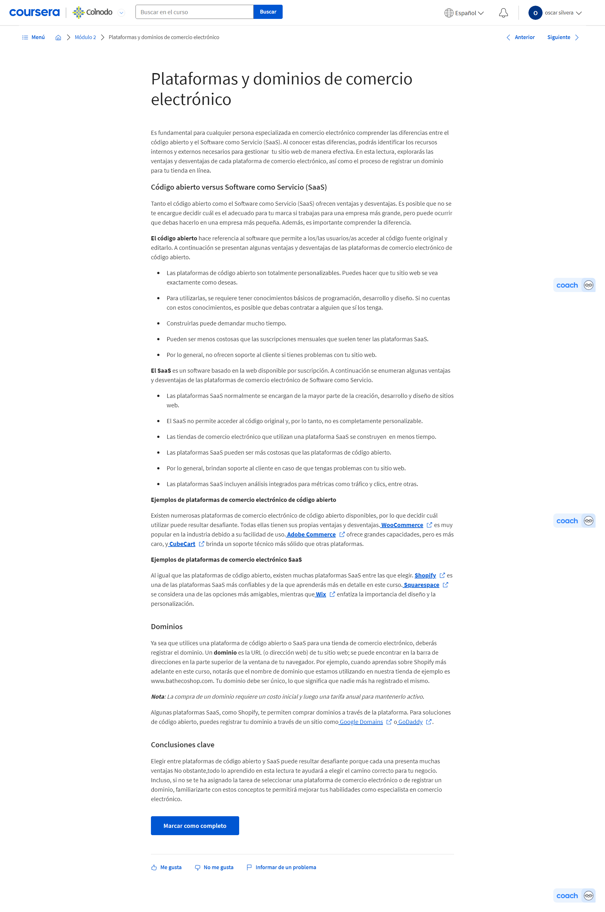

# Consigue la venta: crea, lanza y administra tiendas de comercio electrónico

## Introducción a “Consigue la venta: construye, lanza y administra tiendas de comercio electrónico”

### Primeros pasos en el curso

#### Introducción al curso 6

Consigue la venta: construye, lanza y administra tiendas de comercio electrónico. Actualmente, las compras en línea son más populares que nunca, y los números siguen creciendo. En poco más de una década, el mercado global del comercio electrónico creció más del 600%. El comercio electrónico cambió por completo el mundo minorista y continúa haciéndolo. También trajo consigo muchos nuevos puestos de trabajo, como los que estás buscando al tomar este programa. Aprendiste mucho sobre marketing digital en cursos anteriores. Ahora, en este curso, nos enfocaremos en el comercio electrónico, específicamente, en la venta en línea. El comercio electrónico utiliza el marketing digital para atraer y retener clientes. También utiliza el embudo de marketing que aprendiste antes, que incluye la Conciencia, Consideración, Conversión y Fidelidad. En muchos sentidos, el marketing digital y el comercio electrónico coinciden. Pero el comercio electrónico incluye otras funciones y responsabilidades fuera del marketing digital, como la gestión de productos, ejecución de pedidos, envíos, y servicio al cliente. Conocerás más sobre esos temas después. Antes de empezar, me presentaré. Soy Cindy, Líder de Excelenccia en Ventas aquí, en Google. El objetivo de mi equipo es ayudar a vendedores/as a través de la práctica, el coaching y la retroalimentación. Antes de este cargo, trabajé en un equipo que ayudó a varias marcas a lanzar sus propios canales de comercio electrónico y a vender directamente a los/las consumidores/as. Nuestro objetivo era asegurarnos de que nuestros/as socios/as de marca pudieran crear y capturar demanda en línea. Trabajo en marketing digital y comercio electrónico hace más de seis años, y, aunque no fue sencillo, llegué aquí. Mis estudios fueron en ingeniería biomédica. Pero cuando estaba a punto de empezar la escuela de medicina, tuve un momento de pánico y me di cuenta de que no podía estar cerca de sangre y agujas. Un mentor me animó a solicitar un puesto de marketing en una gran empresa de bienes de consumo. Después de trabajar para grandes marcas, descubrí que quería aprender más sobre marketing digital. Es cuando comencé en Google. Comencemos por revisar lo que lo vimos hasta ahora. Primero, exploraste cómo atraer e involucrar clientes en línea. Descubriste formas para llegar a más clientes potenciales y a mantenerlos/as interesados/as en tu negocio. Después, descubriste el potencial del marketing por correo electrónico. Aprendiste que el correo electrónico es una forma de conectar a las/los clientes con tu marca. Después de eso, conociste la forma de usar las redes sociales como herramienta de marketing. Aprendiste a conectar con las/los clientes en sus canales preferidos.
Reproduce el video desde :2:49 y sigue la transcripción2:49
También conociste cómo captar su atención con redes sociales y publicidad para hacer crecer tu negocio. Por último, viste la importancia del análsis de marketing y medición. Conociste cómo tomar decisiones basadas en datos. Fue mucho aprendizaje. Hiciste un trabajo increíble al llegar hasta aquí.
Reproduce el video desde :3:11 y sigue la transcripción3:11
En este curso, descubrirás qué es el comercio electrónico y cuáles son los beneficios de la venta en línea. Conocerás los términos de comercio electrónico y te familiarizarás con las herramientas y plataformas disponibles para vender en línea. Aprenderás sobre tiendas de comercio electrónico y cómo funcionan. Verás cómo impulsar tráfico valioso a una tienda de comercio electrónico con publicidad y campañas. Después, aprenderás a involucrar a las/los clientes y crear experiencias personalizadas en línea. Finalmente, aprenderás sobre el proceso de pago y cómo hacer llegar los productos a las/los clientes. Espero poder guiarte mientras exploramos el creciente campo del comercio electrónico. Hay mucho que aprender y me emociona acompañarte en este viaje. A continuación, conocerás de qué se trata el comercio electrónico. ¿Comenzamos? Vamos.

### Qué tienes que saber acerca del comercio electrónico y por qué es importante

#### Te damos la bienvenida a la semana 1 curso 6

Hola de nuevo. Hagamos un resumen de lo que verás en las siguientes lecciones. Primero, aprenderás cómo funciona el comercio electrónico y qué tipo de productos o servicios puedes vender en línea. También, conocerás cuáles son los beneficios de vender en línea, los términos básicos del comercio electrónico y los puestos de nivel inicial a los que podrías postularte. Después, aprenderás a hacer un estudio de mercado, a identificar a tu público objetivo y a investigar productos. Y, finalmente, aprenderás sobre abastecimiento de productos y marketing de marca en comercio electrónico. ¿Qué te parece? Comencemos.

#### ¿Qué es el comercio electrónico?

¿Quieres aprender sobre comercio electrónico? En este video aprenderemos de qué se trata y lo que te permite hacer. Luego, veremos ejemplos de los productos que puedes comprar o vender con comercio electrónico. Primero, veremos qué significa el comercio electrónico. Se define como la compra y venta de bienes o servicios a través de Internet. También se lo conoce como e-commerce. Te permite agregar productos o servicios a tu sitio web y recibir pagos en línea de tus clientes. En una tienda minorista tradicional, también conocida como tienda física, haces compras en persona al elegir productos de los estantes y ves el producto de cerca o incluso te lo pruebas. También puedes pedir ayuda en la tienda para encontrar un producto. Luego lo llevas a la caja y pagas antes de salir de la tienda. En las de comercio electrónico, la visita es en línea, después de buscar un producto en Google o de hacer clic en un anuncio en redes. Compras al navegar por las páginas web, agregas algo a tu carrito de compras virtual, y luego pagas por el producto con un sistema de pago digital. Cuando tu pedido está listo, se envía a tu dirección o a una ubicación para que lo recojas. Los tipos de productos en línea pueden variar ampliamente, pero a menudo entran dentro una de estas cuatro categorías: bienes físicos, bienes digitales, servicios o software. Si piensas en comercio electrónico, pensarías en algo como zapatos que compras en línea y los recibes en casa. Estos se consideran bienes físicos, dado que algo que puedes tocar y sostener. Otros ejemplos de bienes físicos podrían ser libros, electrodomésticos o fundas para teléfonos. Otro ejemplo podría ser un libro electrónico que compras en línea y descargas en tu dispositivo. Eso se considera un producto digital. Otros tipos de productos digitales son fotos digitales, archivos de música digitales o cursos en línea, como este. También podrías pensar en algo como clases en línea. Ese es un ejemplo de servicio. Otros servicios son coaching de salud, consultoría de negocios o servicios profesionales, como diseño gráfico. Por último, puede que pienses en Adobe Photoshop, un programa de software que compras en línea y lo descargas. Eso se considera un producto de software. La mayoría de nosotros sabemos lo que es ser un/a cliente. Ahora exploramos cómo es ser quien hace la venta. Puedes usar tu propia experiencia y crear una mejor para las/los clientes que visitan tu tienda sin importar qué productos vendes. Es todo por ahora. Hasta el próximo video.

#### Los beneficios de vender en línea

Ya aprendiste qué es el comercio electrónico, cómo funciona, y los productos que puedes vender en línea. Ahora veremos por qué una empresa elige vender en línea. Cómo cambió la forma de comprar de las personas en los últimos años. Las personas investigan los productos en línea antes de comprarlos, incluso desde su teléfono móvil. Usan Internet para averiguar qué productos están disponibles, elegir los que necesitan y hacer su compra final. En este proceso, pueden interactuar con una marca en múltiples canales en diferentes puntos durante el proceso de compra. Por ejemplo, en redes sociales, en una aplicación móvil, en un sitio web, en un chat en línea o al visitar una tienda física, solo por nombrar algunos. El recorrido del cliente es más como una carretera sinuosa que un camino recto de A a B. Y este recorrido involucra cada vez más la búsqueda de productos en Internet. Por eso es importante para cualquier negocio hoy en día vender en línea. Ahora, analicemos las ventajas de vender en línea y cómo un negocio elige hacerlo. Una tienda física tiene una ubicación específica, a donde las/los clientes van a comprar. Por lo general, abre en cierto horario y se limita por el número de clientes que llegan a su ubicación. Una tienda de comercio electrónico permite hacer compras en línea desde cualquier lugar y momento. Con el comercio electrónico puedes llegar a más clientes porque no requiere que las personas vivan cerca para llegar. Solo necesitan un dispositivo con Internet para poder comprar. Ese es uno de los beneficios de vender en línea. El comercio electrónico incluye dos tipos de negocios. Uno vende sus productos solo en línea. El otro vende en línea, así como en una tienda física. También se llama tienda física (click-and-mortar). Una tienda de comercio electrónico solo en línea te ahorra gastos generales ya que no necesitas el espacio comercial o personal de la tienda tradicional. Puedes comenzar a vender nuevos productos más rápidamente porque no necesitas almacenarlos en las tiendas. Te puedes adaptar a las necesidades de las/los clientes al mejorar su experiencia con base en datos. Otra ventaja es que puedes llegar a clientes que buscan productos específicos que no están disponibles en tiendas locales. Por ejemplo, un libro específico para una clase o un traje de baño en época de invierno. Vender en línea permite que un negocio crezca incluso si es difícil atraer clientes localmente. Un desafío para el comercio electrónico es que las/los clientes no pueden ver o probar productos, como en la tienda, por lo que hay una mayor tasa de devoluciones. También se debe considerar el costo de envío. Si el negocio ofrece envíos sin costo, una ventaja que muchas personas esperan, los costos adicionales reducirán los beneficios de la empresa. Las tiendas de comercio electrónico no ofrecen servicio al cliente en persona como las tiendas físicas. Ahora, veamos las razones por las que las tiendas físicas podrían incluir ventas en línea, y se se convertirían en tiendas en línea. Por ejemplo, piensa en un negocio que ya tiene tiendas físicas, como una que vende suministros de oficina. ¿Por qué hacer que sus productos estén disponibles en línea? Porque la mayoría de sus clientes compran en línea primero, incluso si compran en la tienda. Según Google, los/las compradores/as van primero en línea en más del 60% de las ocasiones de compra. Se quieren asegurar de que un negocio tiene lo que quieren antes de ir a la tienda. Algunas personas van a la tienda para probar un producto personalmente, pero terminan comprándolo en línea. Compran en línea porque necesitan tiempo para decidir cuál es el producto adecuado. Puede que busquen un mejor precio en línea del que hay en las tiendas o tal vez quieran averiguar si hay más opciones disponibles en línea, como otros tamaños o colores. Lo que nos lleva a otros beneficios de vender en línea. El comercio electrónico te permite vender muchos más productos, de los que entrarían en una tienda. Las compras en línea impulsan el tráfico en la tienda si las/los clientes pueden comprar y recoger el pedido en la tienda. Puede que compren más artículos mientras están en la tienda. Además, permite a las/los clientes recibir su pedido el mismo día sin esperar a que se envíe a su dirección. También ahorra en costos de envío. Tu propia experiencia al comprar productos te dará razones por las que eliges comprar en línea o en la tienda. Por ejemplo, ¿necesitabas el producto el mismo día? ¿Estaba disponible en una tienda cercana a ti? ¿Querías comprar desde casa? ¿Querías probar el producto o recibir ayuda en persona? Todas son razones para considerar cuando se trata de servir a tus clientes. Tanto las tiendas físicas como las de comercio electrónico son valiosas. Pero cada vez más, las personas esperan poder explorar el inventario y comprar productos en línea, incluso si tienes una tienda física. Por esa razón, el comercio electrónico es importante para cualquier negocio. Ahora, que conocemos los beneficios de vender en línea, veremos los fundamentos del comercio electrónico.

#### Henry: Mi trayectoria profesional en el comercio electrónico

Soy Henry, y soy Líder de Estrategia Digital en el Equipo de Crecimiento Acelerado de Google. Llegué al marketing digital casi por accidente. Hacía ventas por televisión, y allí había algo de marketing digital involucrado a través de video digital y productos de video bajo demanda, y fue entonces cuando me familiaricé con la industria y empecé a aprender más sobre diferentes temas en el sector de la publicidad digital. Cuando estaba aprendiendo sobre marketing digital y enseñándome a mí mismo acerca de diferentes aspectos del marketing digital, terminé dejando la posición que estaba desempeñando para empezar mi propio negocio. Dirigí un negocio llamado Sunny Pickup, que era básicamente un servicio de lavandería bajo demanda. No es un negocio típico de comercio electrónico porque no vendíamos un producto, sino que teníamos un servicio tecnológico que permitía recolectar la ropa sucia de la gente, lavarla, secarla, doblarla y devolverla en 24 horas. Definitivamente era un tipo de negocio conveniente basado en servicios que permitía a las personas usar la tecnología para facilitar sus vidas. Y cuando estaba empezando mi propia empresa, definitivamente había muchas tareas de marketing digital que, como dueño del negocio, tenía para hacer. Y, por supuesto, cuando eres el dueño del negocio, básicamente supervisas todo lo que sucede en él. Parte de esto lo aprendí a través de algunos líderes y mentores que desarrollé en la industria, pero definitivamente usé mucho contenido en línea para aprender algunos conceptos básicos en términos de Google Ads, Google Analytics, como cuáles son los bloques fundamentales de construcción del marketing digital, cómo impactan en los negocios y qué necesitan hacer las empresas para maximizar esas oportunidades. Vender en línea tiene muchas ventajas. Diría que una de las principales es, definitivamente, el margen de beneficio. Dirigir un sitio web, definitivamente, es mucho menos costoso que administrar una tienda física. Así que, cuando diriges un negocio y estás tratando de ganar dinero, un punto en el que siempre puedes enfocarte es en reducir costos, y vender en línea es definitivamente una vía para eso. Vender en línea también es muy importante cuando se trata de la cantidad de personas a las que potencialmente les puedes vender. En una tienda física, básicamente, estás limitado por el área geográfica en la que opera tu tienda. La mayoría de la gente no recorrerá tres o cinco millas para hacer alguna compra. Pero, cuando vendes en línea, básicamente el mundo es tuyo. Cualquiera puede acceder a un sitio web desde cualquier lugar en el mundo y potencialmente comprar tu producto. La información que puedes obtener sobre tus clientes a través de los canales en línea es mucho más impactante que los datos que puedes recopilar de tus ventas personalmente. Una de las cosas que puedes ver en línea es cómo la gente reacciona con los diferentes productos que vendes. ¿Las personas miran este producto durante mucho tiempo? ¿Lo miran por poco tiempo? ¿No les interesa? ¿Dónde están haciendo clic? ¿Dónde van a dejarlos? ¿Por qué ya no les interesa? Estos son temas que puedes usar para desarrollar tu estrategia de producto y también tu estrategia publicitaria. Por último, hay desafíos mayores a nivel general que pueden afectar la venta en línea. La mayoría de las ventas en los Estados Unidos y en el mundo aún ocurren en tiendas físicas, pero se pueden ver fuertes tendencias año tras año para impulsar más las ventas en línea, en especial las relacionadas con la pandemia y todo lo que está sucediendo en el entorno macroeconómico. Definitivamente querrás ir a donde va el comportamiento de los/las consumidores/as. No querrás luchar contra ese comportamiento. La pandemia jugó un papel realmente instrumental al cambiar la forma en que los/las consumidores/as quieren interactuar con sus marcas o empresas favoritas. Antes, a la gente le entusiasmaba mucho más ir a las tiendas, probar nuevos productos, probarse ropa nueva, o lo que fuera. Pero ahora más y más personas solo quieren probarse las cosas en casa. Saben que pueden devolver los productos si hay un problema y cada vez más personas solo quieren lidiar con la comodidad del entorno en su hogar en vez del ajetreo y el bullicio de estar en espacios concurridos. Creo que el futuro del comercio electrónico será definitivamente muy competitivo, pero creo que ofrecerá una gran cantidad de oportunidades para muchas personas y en rubros diferentes. Hay un montón de personas fuera de las empresas de tecnología, a través de agencias, propietarios/as únicos/as, a través de dueños/as de empresas que están superándose a sí mismos/as y desarrollando una carrera de manera efectiva y creciendo a través del comercio electrónico, y eso seguirá aumentando con el tiempo.

### Términos, herramientas y estrategias del comercio electrónico

#### Conoce los fundamentos del comercio electrónico

Ahora, que sabes por qué el comercio electrónico es importante, es hora de ver lo básico. En este video, veremos los términos comunes, las herramientas y las plataformas usadas en el comercio electrónico. También obtendrás una visión general de los roles de nivel inicial disponibles en el comercio electrónico. Comencemos con la terminología básica que más se usa. Debes comprender algunos términos relacionados con cómo navegan las/los clientes en un sitio web. Primero, una tienda de comercio electrónico recibe visitas en su sitio web. Esas visitas constituyen el tráfico de un sitio web. El tráfico es el número de visitas que recibe un sitio web.
Reproduce el video desde ::44 y sigue la transcripción0:44
La primera página que ve un/a visitante en un sitio web se llama página de destino. Esta podría ser una página de inicio, de producto o cualquier otra.
Reproduce el video desde ::56 y sigue la transcripción0:56
Cuando un/a cliente visita un sitio web, quieres que haga una acción, como comprar un producto o suscribirse a una lista de correo. Una llamada a la acción es una instrucción que le indica al/a cliente qué hacer a continuación. Por ejemplo, una llamada a la acción es el botón "Añadir al carrito". O un enlace que diga: "Regístrate para recibir correos electrónicos" en la página de inicio. Después, la/el cliente agrega un producto a su carrito de compras digital. Esto es el equivalente virtual de un carrito de compras físico. Lleva un seguimiento de todos los elementos que la persona planea comprar. Cuando la/el cliente termina de comprar, puede comenzar el proceso de pago en línea. Podrá completar su compra ingresando su información de pago durante el proceso de pago. Se hace a través del proveedor de servicios de pago, que es una forma segura de procesar transacciones en línea. El proveedor permite que la tienda de comercio electrónico acepte y procese múltiples tipos de pagos, como tarjetas de crédito, de débito, o servicios de pago de terceros. Cuando un/a cliente realiza una compra, esta acción se registra como una conversión, que es la realización de una actividad que contribuye al éxito de un negocio. Tal vez recuerdes lo que viste sobre conversiones antes. La conversión ocurre cuando un/a cliente completa la acción que solicitaste, como registrarse en una lista de correo electrónico, completar un formulario de contacto, o pasar cierto tiempo en el sitio. Pero en el comercio electrónico, la conversión más frecuente se refiere al proceso de convertir a un/a visitante en un/a cliente que paga. Sucede cuando un/a cliente hace una compra en tu sitio y completa el proceso de pago. Ahora, que conoces los términos básicos del comercio electrónico, exploremos las herramientas y plataformas que puedas encontrar. Una tienda de comercio electrónico se basa en un plataforma que es un software que te permite vender productos o servicios en línea. Una plataforma que usan muchas tiendas de comercio electrónico es Shopify. Con una plataforma como esta, puedes administrar tu sitio web, hacer campañas de marketing, administrar los envíos y abastecimiento, configurar servicios de pago, análisis de revisión y más. Todo en un solo lugar. Además de todo esto, también puedes usar herramientas de negocios como Salesforce, que te ayuda a administrar y monitorear varios aspectos de tu empresa, como ventas, marketing, analítica y servicio al cliente. Puedes usar herramientas específicas, según la necesidad que tengas para un proyecto, como publicidad, redes sociales o marketing por correo electrónico. Son herramientas que viste anteriormente. También es importante saber cómo usar software básico de oficina. Las herramientas con las que necesitas familiarizarte pueden variar según el puesto que ocupes. Revisemos los roles de nivel inicial más comunes en comercio electrónico, para que sepas qué te puede interesar. Algunos puestos de nivel inicial a los que puedes postularte son analista de comercio electrónico, especialista de comercio electrónico, asistente de comercio electrónico o especialista en marketing digital. Estas funciones incluyen agregar o actualizar productos en un sitio web de comercio electrónico, ayudar con campañas en línea, medir el éxito de la empresa a través de la analítica, gestión de campañas de correo, monitoreo de redes sociales de la empresa, ejecutar anuncios pagados y más. El conocimiento y las habilidades recién adquiridos te ayudarán a prepararte para uno de estos puestos de nivel inicial. Vas por buen camino en el aprendizaje del comercio electrónico.

#### Conoce más sobre los fundamentos del comercio electrónico

Ahora, que conoces los fundamentos del comercio electrónico, tienes todo listo para aprender más sobre este sector de rápido crecimiento. Esta lectura te ayudará a familiarizarte con los términos, las plataformas, las herramientas y los puestos laborales disponibles en el comercio electrónico.

Por qué es importante el comercio electrónico
El comercio electrónico creció considerablemente en 2020 en todo el mundo, consolidándose como una alternativa cada vez más popular para la compra y venta de productos y servicios e incrementando su participación en las ventas minoristas de las tiendas físicas (brick-and-mortar). Solo en 2020, las ventas aumentaron hasta casi cinco veces más rápido que en el periodo anterior debido a los cambios en el mercado global.

Cuanto más crece el comercio electrónico, más oportunidades pierden las empresas de atraer nuevos/as clientes y hacer crecer su negocio si no venden sus productos o servicios en línea. El comercio electrónico es beneficioso para empresas de cualquier tamaño, ya sea una startup, una empresa pequeña o un minorista importante.

Estos son algunas de las ventajas del comercio electrónico:

Permite a las empresas vender productos a clientes de todo el mundo, ya que casi cualquier persona puede visitar la tienda en línea.

Reduce los gastos generales y los costos de inicio, ya que no requiere de una tienda física.

Facilita la venta de una amplia gama de productos, ya que no requiere espacio físico para exhibirlo.

Permite a las/los clientes investigar los productos disponibles en la tienda antes de visitar una ubicación física.

Permanece abierto las 24 horas, los 7 días de la semana, para que las personas puedan comprar cuando quieran.

Posibilita a las empresas personalizar la experiencia de las/los clientes en función de los datos o las preferencias guardadas, de modo que puedan proporcionar un mejor servicio y aumentar la interacción con las personas en línea.

Proporciona datos sobre el comportamiento de las/los clientes, de modo que las empresas puedan mejorar su tienda de comercio electrónico.

Términos básicos del comercio electrónico
Estos son algunos términos básicos que debes conocer para dar tus primeros pasos en el mundo del comercio electrónico:

Comercio electrónico (e-commerce): Compra y venta de bienes o servicios a través de Internet.

Tienda de comercio electrónico: Tienda que vende sus productos en línea.

Plataforma de comercio electrónico: Aplicación de software que permite vender productos o servicios en línea.

Sitio web responsivo: Sitio web que está diseñado para funcionar en todo tipo de dispositivos, incluyendo computadoras, teléfonos móviles y tabletas.

Dominio: La parte central de la URL o dirección de Internet de un sitio web, como google.com.

Página de destino: La primera página que una persona encuentra cuando accede a un sitio web

Llamada a la acción (call to action o CTA): Estímulo que busca inducir a las/los clientes a hacer algo a continuación.

Conversión: Realización de una actividad que contribuye al éxito de un negocio.

Carrito de compras digital: Equivalente virtual de un carrito de compras físico.

Proveedor de servicios de pago: Forma segura de procesar transacciones en línea

Herramientas para el comercio electrónico
En comercio electrónico, se utilizan diversas herramientas, entre ellas las plataformas, que son una solución específica. Las herramientas que necesites utilizar dependerán de la empresa para la que trabajes y de cuáles sean tus responsabilidades. Es recomendable que explores algunas de estas soluciones por tu cuenta, ya que te permitirá familiarizarte con su funcionamiento y facilitará el aprendizaje de nuevas herramientas en el trabajo.

Aunque las herramientas mencionadas en esta lectura son algunas de las opciones más populares, existen muchas otras opciones igualmente buenas. Además, debido a la naturaleza en constante cambio y rápido crecimiento del comercio electrónico, es habitual encontrarse con nuevas plataformas y herramientas que se lanzan regularmente. Por esta razón, la lista de las plataformas y herramientas más populares está en constante evolución. 

Aunque no es obligatorio, visitar los sitios web de las siguientes herramientas y plataformas de comercio electrónico puede ser una buena oportunidad para que te familiarices con algunas de las diferentes soluciones que puedes utilizar en tu trabajo.

Plataformas de comercio electrónico

Como aprendiste en un video previo, una tienda de comercio electrónico generalmente se construye en una plataforma de comercio electrónico, es decir, una aplicación de software para vender productos o servicios en línea. El uso de una plataforma hace que sea más fácil comenzar a vender en línea, dado que no necesitas tener habilidades de desarrollo de software. Las plataformas de comercio electrónico suelen incluir herramientas integradas de marketing, análisis de datos, gestión de inventario, logística y otros aspectos del negocio.

Aquí hay algunas de las plataformas de comercio electrónico más populares:

Shopify <https://www.shopify.com/>

Wix <https://www.wix.com/>

BigCommerce <https://www.bigcommerce.com/>

Squarespace <https://www.squarespace.com/>

WooCommerce <https://woocommerce.com/>

Magento Open Source <https://business.adobe.com/products/magento/open-source.html>

Shopify, Wix, BigCommerce y Squarespace son plataformas de software como servicio (SaaS), es decir, un software basado en la web disponible por suscripción. Con una plataforma SaaS, no necesitas saber HTML ni contar con habilidades de desarrollo web. Simplemente, puedes elegir entre las opciones disponibles en la plataforma.

WooCommerce y Magento Open Source son dos ejemplos de plataformas de código abierto, es decir, cuyo software permite a las personas acceder y editar el código fuente original. Esto significa que puedes personalizar el sitio web como más te guste. No obstante, debes tener en cuenta que para realizar este tipo de cambios en una plataforma de código se requiere ciertas habilidades de desarrollo web o la capacidad de contratar a alguien para que realice estos cambios por ti.

Otras herramientas para el comercio electrónico

Además de trabajar en una plataforma de comercio electrónico, es probable que utilices otras herramientas para hacer tu trabajo. Estas herramientas pueden resultar útiles para comunicar y compartir información con tu equipo, gestionar proyectos o campañas de marketing, revisar análisis, hacer un seguimiento de problemas de servicio de atención al cliente y más.

Aquí hay algunos tipos de herramientas de comercio electrónico que podrías utilizar, junto con algunos ejemplos de cada tipo:

Sistema de administración de relaciones con clientes (customer relationship management, CRM): estas herramientas ayudan a las empresas a administrar y monitorear diversos aspectos del negocio, como las ventas, el marketing, las analíticas y el servicio de atención al cliente. Estos son algunos ejemplos:

Salesforce <https://www.salesforce.org/>

Oracle <https://www.oracle.com/index.html>

HubSpot <https://www.hubspot.com/>

Colaboración en equipo: estas herramientas ayudan a los equipos de trabajo a mantenerse organizados, dado que facilitan la comunicación interna. Algunas funciones que pueden incluir son  correo electrónico, videollamadas, almacenamiento en la nube, mensajería, uso compartido de archivos y más. Aquí hay algunos ejemplos:

Google Workspace <https://workspace.google.com/>

Microsoft Teams <https://www.microsoft.com/en-us/microsoft-teams/group-chat-software>

Slack <https://slack.com/>

Publicidad digital y publicidad de pago por clic (PPC): estas herramientas ayudan a los equipos de trabajo a administrar sus campañas publicitarias en línea. Algunos ejemplos son:

Search Ads 360 <https://marketingplatform.google.com/about/search-ads-360/>

AdRoll <https://www.adroll.com/>

Marketing digital: estas herramientas facilitan la gestión de campañas de marketing por correo electrónico, redes sociales u otros canales. Algunos ejemplos son:

HubSpot <https://www.hubspot.com/>

Hootsuite <https://www.hootsuite.com/>

Sprout Social <https://sproutsocial.com/>

Optimización de motores de búsqueda (SEO): estas herramientas ayudan a monitorear y mejorar el rendimiento de un sitio web en los resultados de búsqueda. Algunos ejemplos son:

Central de la Búsqueda de Google <https://developers.google.com/search>

Semrush <https://developers.google.com/search>

Analítica: estas herramientas ayudan a las empresas a analizar el tráfico de su sitio web, las ventas y otros datos.

Google Analytics <https://marketingplatform.google.com/about/analytics/>

Adobe Analytics <https://business.adobe.com/products/analytics/adobe-analytics.html>

Tableau <https://www.tableau.com/>

Puestos laborales de comercio electrónico de nivel inicial
A medida que el comercio electrónico continúa creciendo, también lo hace el número  de trabajos disponibles en este mercado de alta demanda. Al completar este programa de certificado de carrera, estarás mejor preparado/a para postularte a un puesto laboral de nivel inicial en este sector.

Aquí hay algunos ejemplos de posiciones de nivel inicial en comercio electrónico:

Analista de comercio electrónico

Especialista en comercio electrónico

Asistente de comercio electrónico

Coordinador/a de comercio electrónico

Gerente/a de productos de comercio electrónico

Estos son algunos ejemplos de posiciones de nivel inicial en marketing digital que puedes encontrar en una empresa de comercio electrónico:

Especialista en marketing digital

Coordinador/a de marketing digital

Especialista en optimización de motores de búsqueda 

Especialista en marketing de motores de búsqueda

Gerente/a de redes sociales

Especialista en marketing por correo electrónico

Existe una gran variedad de funciones y puestos laborales en el campo del comercio electrónico. Por lo tanto, al buscar trabajo, te recomendamos mirar diversos puestos de trabajo para el adecuado. Aunque tus responsabilidades pueden variar incluso dentro del mismo puesto, la descripción de la posición puede brindar información detallada acerca de cuáles serán las tareas a cumplir. Además, durante la entrevista laboral, es importante hacer preguntas específicas sobre las funciones del puesto.

Para obtener una comprensión más clara de las responsabilidades y requisitos de cada rol, se pueden buscar ofertas de trabajo en sitios como LinkedIn o Indeed. Esto puede ayudarte a determinar qué tipo de rol es el más adecuado para ti.

Otros roles de nivel inicial en el comercio electrónico

Hay muchos otros roles disponibles en el comercio electrónico que pueden requerir capacitación o experiencia, más allá de la información que recibirás en este curso.

Aquí encontrarás algunos ejemplos:

Desarrollador/a web

Soporte de TI

Coordinador/a de logística

Coordinador/a de operaciones digitales

Gerente/a de proyectos

Redactor/a digital

Diseñador/a gráfico digital

Analista financiero

Analista de datos

Especialista en atención al cliente

Conclusiones clave

Para comenzar a trabajar en el sector del comercio electrónico, es útil conocer cuáles son los términos básicos, las herramientas y las plataformas que comúnmente se usan en la industria, de modo que puedas comunicarte con posibles empleadores/as, compañeros/as de equipo y partes interesadas. También te servirá obtener una visión general de los puestos laborales de nivel inicial disponibles en el sector para que puedas comenzar a pensar qué tipo de roles podrían ser más adecuados para ti.

#### Jaylin: El rol de un/a especialista en comercio electrónico de nivel inicial en una gran empresa grande y en una pyme

Hola, mi nombre es Jay. Trabajo para Google como Estratega de Cuentas de Google Ads específicamente para las agencias, lo que significa que me asocio a ellas y las ayudo (a ellas y a sus principales clientes) a utilizar Google Ads de una manera que beneficie y haga crecer las cuentas de sus clientes. Gran parte de la experiencia que tengo en marketing digital proviene de ayudar a algunas de mis amistades con sus pequeñas empresas y emprendimientos en Instagram u otras redes sociales similares. Durante mi experiencia en marketing digital con algunas de mis amistades, antes de sumarme a Google, descubrí que lo que más me entusiasmaba y motivaba era la libertad creativa para explorar distintas y ideas y enfoques. Me encanta probar y pensar en cosas nuevas, probar y entusiasmar a la gente sobre cosas que también me entusiasman, así que muchos de esos fueron proyectos apasionantes. Cuando se trata de ser un/a estratega de nivel inicial, las tareas comunes que podrías encontrarte haciendo son: imagínate hablando por teléfono o a través de una videoconferencia. Las conversaciones con mis clientes de comercio electrónico pueden variar dependiendo de las etapas en las que nos encontremos. Pero, generalmente, buscamos comprender mejor en qué punto están en términos de presupuesto disponible, en qué medida sus resultados coinciden con sus expectativas, y luego evaluar cómo estamos progresando en relación a nuestros objetivos reales. Estos objetivos pueden ser el objetivo de marketing, como “Queremos vender X cantidad más de cualquier producto”, o pueden estar relacionados con un objetivo comercial específico, como “Queremos vender X cantidad más de este producto en rojo, en lugar del negro, púrpura y verde, que quizá también se ofrezca". Y luego, a partir de ahí, optimizar en torno a esos objetivos y expectativas dentro de las cuentas. Muchos de estos temas diversos para clientes diferentes van a venir con fechas de vencimiento específicas, por lo que también será importante entender realmente el valor de tu tiempo y dónde colocarlo para asegurarte de que las cosas se hagan de manera adecuada y según el plazo establecido. Uno de los beneficios de trabajar para una empresa más grande es la amplitud y el alcance de los temas que tenemos a disposición. Google, como cualquier empresa grande, abarca muchas cosas diferentes. Es fácil pensar en ti mismo/a como un/a empleado/a enfocado/a a una sola cosa, aunque no necesariamente tiene que ser así. Hay mucho por ahí, y debes ser capaz de usar las herramientas que has adquirido a lo largo de tu tiempo en donde sea que lo inviertas, para luego seguir creciendo y tal vez extender tus alas hacia algo nuevo. Si trabajas en una empresa pequeña como estratega de comercio electrónico, tendrás la capacidad de adentrarte en los detalles de los tipos de cosas que en verdad impulsan la estrategia de comercio electrónico. Esto puede ser un costo por clic o las tasas de interacción, o cuántas personas visitaron tu sitio. Cuando se trata de una pequeña empresa, estas son las cosas con las que tienes mucho más tiempo para involucrarte a fin de influir realmente en el cambio porque, primero, tienes solo un negocio por el que preocuparte y, dos, porque tienes una comprensión mucho más profunda de ese negocio, dado que eres directamente parte de él. No importa si es una empresa grande o pequeña, eres tú quien dicta tu trayectoria profesional. Dicen que el mejor momento para empezar fue ayer y el segundo mejor para empezar es ahora, así que bien podrías comenzar a ponerlo en marcha, ¿verdad? Y, con suerte, este certificado cerrará esa brecha entre donde estás y a donde quieres ir, ya que cuentas con muchos de los de los recursos que tienes en tu kit herramientas.

#### Estrategias esenciales de comercio electrónico

El 50% de las personas de entre 26 y 41 años, también conocidas millennials, realizan la mayoría de sus compras en línea, según una encuesta elaborada por Morning Brew-Harris. Las ventas en línea siguen creciendo a un ritmo acelerado para todos los grupos de edad. En esta lectura, te proporcionaremos una visión general de los elementos esenciales de una estrategia de comercio electrónico para atraer clientes en línea en un mercado altamente competitivo.

Estrategia de comercio electrónico
Una estrategia de comercio electrónico es un plan de trabajo para promocionar una tienda en línea y aumentar sus ventas. Es fundamental que cada negocio en línea desarrolle y ejecute una estrategia de comercio electrónico. A continuación, incluimos una descripción general de los métodos de descubrimiento, es decir, aquellas técnicas y herramientas utilizadas para ayudar a las personas a encontrar una empresa o una marca en línea.

Perfil de negocio
Anteriormente, aprendiste sobre el Perfil de Negocio de Google, el cual permite a cualquier empresa personalizar cómo aparece su información comercial en el buscador de Google y en Google Maps. Ten en cuenta que Google Maps también se aplica a negocios en línea que tienen tiendas locales en áreas seleccionadas. Un Perfil de Negocio permite a empresas de cualquier tamaño comunicar que existen y que están abiertas al público.

Redes sociales orgánicas
Según una encuesta realizada por Sprout Social, el 40% de las/los clientes en línea encuentran nuevas marcas a través de su red personal, mientras que el 32% de las/los clientes en línea lo hacen por medio del boca a boca. Estos son ejemplos de redes sociales orgánicas. Además, con la creciente popularidad de YouTube y el auge de TikTok, gran parte del contenido de redes sociales orgánicas proviene de videos.

Búsqueda de pago, display, redes sociales y anuncios de shopping
Una estrategia de comercio electrónico suele incluir búsqueda de pago, display, redes sociales y anuncios de shopping, dado que una combinación de contenido orgánico y pagado genera mejores resultados. Los anuncios pagados ofrecen el beneficio de tener un control directo sobre la marca, el texto publicitario, las páginas de destino, las estrategias de puja y el rendimiento. Asimismo, son responsables de una parte significativa de los ingresos de las empresas de comercio electrónico. Aunque algunas personas que utilizan las redes sociales bloquean el contenido de marca en sus feeds, los anuncios pagados en redes sociales siguen siendo una herramienta útil dentro de una estrategia de comercio electrónico. Desde una perspectiva de contenido, los anuncios de shopping en Facebook e Instagram pueden ser bastante efectivos, llegando a lograr el interés de algunos/as usuarios/as sin siquiera darse cuenta de que se trata de un anuncio pagado.

Marketing de influencers
Un pequeño, aunque creciente, número de clientes en línea encuentra nuevas marcas a través de las/los influencers a quienes siguen. Se estima que alrededor  del 35% de las/los clientes en línea lo hacen. Las/los influencers pueden ayudar a las marcas o productos a llegar a clientes adecuados/as con un mensaje que se adapte a los intereses del público. Una campaña de influencers pagados puede ser parte de una estrategia de comercio electrónico, pero ten en cuenta ciertas prácticas que limitan su impacto:

Algunas campañas de marketing encubierto publican contenido que parece ser de boca en boca sin revelar que forma parte de una campaña publicitaria patrocinada. Esto hace que el público desconfíe un poco de las/los influencers.

Algunos/as clientes compran productos que un/a influencer recomienda solo cuando este/a muestra evidencia de uso personal. Por ejemplo, cuando publica fotos de envases vacíos para demostrar que de verdad usó el producto que está recomendando.

Algunos/as influencers pueden tener seguidores falsos impulsados por bots (un bot interactúa con los sistemas, pero no es un usuario humano). Tener un gran número de seguidores no siempre significa necesariamente que haya mucha interacción.

Anuncios en tiendas
Por último, en un negocio híbrido, que atiende tanto a clientes en una tienda física como en línea, los anuncios en la tienda que resalten los beneficios, la comodidad y el ahorro de costos en la compra en línea pueden ser muy efectivos para atraer ventas en línea de clientes ya existentes en la tienda. Como incentivo, algunos negocios optan por ofrecer inventario especial (tamaños o colores difíciles de encontrar) y un inventario de liquidación con un descuento mayor solo para clientes en línea.

Innovación en comercio electrónico
Una estrategia de comercio electrónico también debe ser innovadora para mejorar el valor del negocio. Algunos de estos cambios podrían incluir:

Mejorar la comunicación y el seguimiento de envíos con las/los clientes

Más logística local, a veces llamada micrologística

Uso de redes y servicios de logística

Uso de envío directo por parte de mayoristas para reducir el inventario de los minoristas

Devoluciones “en la acera” (hace referencia a la posibilidad de devolver un producto adquirido, sin bajarse del automóvil)

Diversificación de métodos de pago

Conclusiones clave

Una estrategia de comercio electrónico es fundamental para lanzar, hacer crecer y mantener un negocio en línea. A medida que más personas compren a través de este canal, la calidad de los productos, el precio, la velocidad de entrega y las políticas de devolución impactarán en sus decisiones de compra. Para que una estrategia de comercio electrónico tenga éxito, debe incorporar tantos métodos de descubrimiento e innovaciones como sea posible.

### Primeros pasos en el comercio electrónico

#### Investigación de mercado

Ya aprendiste sobre términos básicos, herramientas y estrategias utilizadas en el comercio electrónico. Ahora veremos el primer paso para crear un negocio de comercio electrónico exitoso: la investigación de mercado. ¿De qué se trata? Es la recolección de información sobre las necesidades y preferencias de los/las consumidores/as. ¿Por qué es importante este proceso? Porque la información ayuda a determinar el potencial de crecimiento y éxito de la tienda de comercio electrónico en un determinado negocio e industria. Yo comencé mi carrera en investigación de mercado. La investigación te ayuda a entender más a tu público objetivo, como quiénes son, dónde compran, qué más consideran comprar. La investigación de mercado te ayuda a llegar al público que quieres con el mensaje correcto en el momento adecuado. Si trabajas en un comercio electrónico de una pequeña empresa, es posible que estés directamente involucrado/a en hacer investigación de mercado. Si trabajas en una empresa más grande, puede haber un equipo específico encargado para hacerlo. Te involucres o no en hacer la investigación de mercado, los resultados te ayudarán a entender mejor a tus clientes y a interactuar con ellos/as. Hay dos tipos de investigación de mercado. La primera es la investigación primaria, o la que ya hiciste.
Reproduce el video desde :1:16 y sigue la transcripción1:16
La investigación primaria puede incluir encuestas, entrevistas, observación directa o grupos focales. Los resultados son valiosos porque puedes reunir información muy específica para tu negocio. Sin embargo, se necesita un mayor presupuesto y más tiempo. El segundo tipo de investigación es la secundaria, o la que otras personas hicieron. Se trata de reunir información de fuentes publicadas, como información de consumidores/as, encuestas, entrevistas u otros recursos para realizar investigaciones secundarias. La investigación secundaria es la opción más asequible debido a que la información ya está disponible en línea u otras fuentes publicadas. También requiere menos tiempo ya que no hay que hacer la investigación inicial. La desventaja es que lo que encuentres puede no ser tan específico para un negocio en particular como quisieras, o el mercado puede haber cambiado desde que se completó el estudio. Usemos una analogía para describir cómo estos tipos de investigación son diferentes. Si envías una encuesta preguntando a la gente por su fruta preferida, eso sería reunir investigación primaria. Puedes preguntar personalmente por la información que quieres saber. Si buscas en línea los tipos de fruta más populares, y encuentras un gráfico con el resultado de un estudio, eso sería investigación secundaria. Alguien más reunió los datos y publicó los resultados, que puedes usar en tu investigación. Ahora que entiendes la investigación primaria y secundaria, pasemos a los tipos de información que debes reunir cuando haces una investigación de mercado. Hay tres áreas en las que debes enfocarte: el tamaño del mercado, el público objetivo y la competencia. Primero, veamos tamaño del mercado, que es la cantidad de clientes potenciales en una industria específica. Para definir el tamaño del mercado, debes responder estas preguntas: ¿Hay suficiente demanda para el tipo de producto que vendes? Si es así, ¿cuánta competencia existe ya en el mercado? ¿Hay oportunidad para el crecimiento? En segundo lugar, debes considerar tu público objetivo, el grupo que más probablemente comprará tus productos. ¿Tu público objetivo quiere comprar este tipo de producto? ¿Está en su rango de precios o presupuesto? Y, finalmente, debes entender a la competencia, o a los demás vendedores que ya están en el mercado. ¿Quiénes son tus competidores más importantes? ¿Cómo se puede diferenciar tu negocio del de la competencia y ofrecer un mejor producto o experiencia? Todas estas preguntas te ayudan a comprender mejor a tu industria y a tus clientes. Los resultados de tu investigación te ayudarán a decidir mejor en todas las áreas de tu negocio, incluyendo los tipos de productos que vendes, los precios que estableces y cómo comercializas. Conocerás por qué la investigación de mercado es importante y cómo hacerla. También, aprenderás a identificar a tu público objetivo. Nos vemos en el siguiente video.

#### Primeros pasos en la investigación de mercado

Como viste previamente, la investigación de mercado es uno de los primeros pasos para crear un negocio de comercio electrónico exitoso. En esta lectura, obtendrás más información sobre cómo dar los primeros pasos en la investigación de mercado.

Introducción a la investigación de mercado
La investigación de mercado es el proceso de recopilar información sobre las necesidades y preferencias de las/los consumidores. Es un proceso importante porque te ayuda a determinar el potencial de crecimiento y éxito dentro de un negocio o una industria específicos. También puede ayudarte a adaptar tus políticas de marketing, publicidad y negocios para satisfacer las necesidades y los deseos de tu público objetivo. Tu público objetivo es el grupo de personas con más probabilidades de comprar tus productos o contratar tus servicios.

Tipos de investigación de mercado
Hay dos maneras de recopilar información de investigación. La primera es la investigación primaria, que es la que realizas por tu cuenta (o contratando a una persona para que lo haga por ti). Puede incluir la realización de encuestas o entrevistas, la observación directa de alguien que interactúa con un producto o la realización de un grupo focal, o focus group.

El segundo tipo de investigación de mercado es la investigación secundaria, que es la que utiliza información que fue recopilada por alguien más. Implica reunir información de fuentes publicadas, como informes de insights de consumidores/as, encuestas o entrevistas publicadas, entre otros recursos.

Como la investigación secundaria requiere menos tiempo y dinero, suele ser el mejor lugar para comenzar. No hace falta que busques consumidores/as que participen en tu investigación ni que les pagues. Si bien es posible que tengas que pagar por el acceso a la información de estas fuentes publicadas, el costo tiende a ser mucho menor de lo que pagarías para llevar a cabo una investigación primaria.

Al comenzar con la investigación secundaria, obtendrás una visión general de la industria y una mejor comprensión de las necesidades y las preferencias de los/las consumidores/as. Así, tendrás una idea más clara de hacia dónde enfocar tus esfuerzos al realizar una investigación primaria para recopilar información que no estaba disponible en la investigación secundaria.

La investigación primaria requiere de más tiempo, dinero y esfuerzo, pero puede proporcionar información muy específica para un negocio en particular. También brinda información más actualizada, ya que el mercado puede haber cambiado desde que se realizó la investigación secundaria.

Preguntas de investigación de mercado
Antes de comenzar a realizar una investigación, es útil averiguar qué tipo de información se necesita. Esto dependerá de los objetivos de investigación de mercado de la empresa, como el lanzamiento de una marca nueva, la entrada a un nuevo mercado, el cambio de marca de un producto antiguo o algún otro objetivo. Los objetivos de la investigación de mercado podrían ser conocer más sobre el tamaño del mercado, el público objetivo o la competencia, o tal vez los tres. 

Si tu empresa ya ha realizado investigaciones de mercado, es posible que ya puedas acceder a parte de esta información. En ese caso, quizá no sea necesario que investigues todas estas áreas. O bien, tu objetivo puede ser averiguar si el mercado cambió desde la última vez que la empresa realizó una investigación de este tipo. En ese caso, puede ser necesario comenzar la investigación desde el principio, averiguando todo lo posible sobre el tamaño del mercado, el público objetivo y la competencia.

Estas son algunas preguntas que pueden ayudar a guiar tu investigación de mercado:

¿Existe una demanda lo suficientemente grande para el producto o servicio que estás tratando de vender?

¿Hay espacio para crecer en el mercado?

¿Tu público objetivo quiere comprar este tipo de producto o servicio?

¿El producto o servicio está dentro de tu presupuesto o rango de precios?

¿Cuánta competencia hay?

¿Quién es la competencia?

¿En qué puede diferenciarse tu negocio de la competencia?

Fuentes para la investigación secundaria
La investigación secundaria es, frecuentemente, la mejor forma de comenzar a investigar el mercado, ya que permite obtener una comprensión básica de la industria específica. Además, representa la opción más económica y permite recopilar información de forma más rápida que la investigación primaria.

Estos son algunos ejemplos de fuentes que puedes consultar para realizar investigaciones secundarias:

Datos, estadísticas y recursos gubernamentales

Recursos de asociaciones de pequeñas empresas

Agencias de investigación

Publicaciones de la industria

Revistas especializadas

Investigaciones publicadas por la competencia

Búsquedas en Internet de información sobre la competencia

Transcripciones de llamadas exitosas de la competencia

Google Trends

Consejo profesional: Primero revisa la fecha de publicación para asegurarte de que los datos sean lo suficientemente recientes como para ser relevantes.

Fuentes para la investigación primaria
La investigación primaria consiste en recopilar tu propia información haciendo preguntas u observando a alguien que interactúa con un producto. Implica más tiempo que la investigación secundaria, pero también puede ofrecer insights más específicos para tu negocio.

Estos son algunos ejemplos de fuentes a las que puedes acudir para realizar investigaciones primarias:

Entrevistas

Encuestas

Datos de analítica

Grupos de enfoque o focus groups

Observación directa de las personas que interactúan con un producto

Visita a una tienda física (si es posible) o a la tienda en línea de la competencia

Con qué frecuencia realizar investigaciones de mercado
La investigación de mercado no es algo que se hace una vez y luego nunca se revisa. El mercado puede cambiar con el paso del tiempo. Por ejemplo, los hábitos sociales o culturales pueden evolucionar, las necesidades y los deseos de las/los consumidores pueden cambiar o nuevos competidores pueden ingresar  al mercado. El mercado también puede cambiar de manera muy abrupta a causa de algún evento importante. 

Por eso, es importante revisar regularmente la investigación de mercado con regularidad. La frecuencia con la que la realices dependerá de las necesidades de tu negocio. Algunas empresas realizan investigaciones de mercado anualmente o cada un par de años. Otras, solo cuando surge una necesidad específica, como la decisión de lanzar un nuevo negocio, presentar un producto nuevo, expandir una categoría de productos existente o identificar las razones detrás de una desaceleración en los negocios.

Beneficios de la investigación de mercado
Con la información que recopiles a través de las investigaciones tanto primarias como secundarias, podrás tomar decisiones que ayudarán a aumentar las posibilidades de éxito de la empresa. La investigación de mercado puede beneficiar a tu negocio de varias formas.

Estas son algunas de las maneras en que puedes beneficiarte gracias a una investigación de mercado:

Optimización de las campañas de marketing y publicidad

Aumento del retorno de la inversión (ROI)

Asignación de tiempo y presupuesto en esfuerzos que pueden producir resultados significativos

Alcance a más clientes

Aumento de las ventas

Mejora de las relaciones con las/los clientes

Conclusiones clave

La investigación de mercado es un proceso valioso que ayuda a las empresas a comprender las necesidades y preferencias de las/los consumidores en relación con una industria específica. Puedes realizar investigaciones de mercado mediante métodos de investigación primaria o secundaria, y recopilar la información que necesitas para tomar decisiones comerciales y de marketing.

#### Actividad de ejemplo: Realiza un análisis de la competencia

Compara el ejemplo con el análisis de la competencia completo. Revisa tu trabajo utilizando cada uno de los criterios del ejemplo. ¿Qué hiciste bien? ¿En qué aspectos podrías mejorar? Las respuestas a estas preguntas te servirán como guía a medida que avances en el curso.

El ejemplo incluye lo siguiente:

Una lista con tres competidores

El ejemplo enumera tres competidores que venden toallas de baño sustentables y otros productos relacionados:

Sustainable Home, Inc.

Organic Cotton Home and Bath

Bath & Bamboo Shop

Información general sobre cada competidor

El ejemplo incluye información general sobre cada competidor en las siguientes columnas:

Sitio web: el modelo incluye el sitio web (URL) de cada competidor. Por ejemplo, el sitio web de Bath & Bamboo Shop es www.bathbambooshop.com.

Tipos de productos que se venden: el ejemplo enumera los tipos de productos que vende cada competidor, que se enumeran en el menú de navegación del sitio web. Por ejemplo, el menú de navegación de Bath & Bamboo Shop indica que vende sábanas, toallas y ropa de bebé hecha de bambú y algodón orgánico.

Historia: el ejemplo incluye un resumen de la historia detrás de la empresa, según lo descrito en la página “Acerca de” o “Nuestra historia” en el sitio web de cada competidor. Por ejemplo, la historia de Bath & Bamboo Shop es que la empresa tiene la misión de usar materiales saludables para la tierra y colaborar con fabricantes de comercio justo.

Información sobre la estrategia de contenido de cada competidor

El ejemplo incluye información sobre los tipos de contenido del sitio web y las plataformas de redes sociales para cada competidor en las siguientes columnas:

Contenido del sitio web: el ejemplo enumera el tipo de contenido web que cada competidor presenta en su sitio web. Por ejemplo, Bath & Bamboo Shop presenta artículos, una página de preguntas frecuentes y un catálogo.

Plataformas de redes sociales: el ejemplo enumera las plataformas de redes sociales que la empresa usa para interactuar con sus clientes. Por ejemplo, Bath & Bamboo Shop utiliza Instagram, Facebook, Twitter y YouTube para compartir contenido y conectar con sus clientes.

Información sobre la estrategia de marketing de cada competidor

El ejemplo incluye información sobre la estrategia de marketing para cada competidor en las siguientes columnas:

Promoción de ventas actual: el ejemplo enumera la promoción de ventas actual que la competencia propone en su sitio web. Por ejemplo, Bath & Bamboo ofrece una oferta de 20% de descuento en el primer pedido.

Incentivo de registro de correo electrónico: el ejemplo incluye información sobre cualquier incentivo u oferta especial disponible para las personas que se suscriban a los correos electrónicos de la empresa. Por ejemplo, Bath & Bamboo ofrece ofertas exclusivas, información sobre nuevos diseños y artículos sobre sostenibilidad a sus suscriptores de correo electrónico.

Programa de recompensas: el ejemplo describe el programa de recompensas de la competencia, si corresponde. Por ejemplo, Bath & Bamboo ofrece un programa de recompensas que permite a sus clientes ganar puntos de fidelidad. No todos los competidores ofrecen un programa de recompensas.

Información sobre las políticas de servicio al cliente, envío y devolución de la competencia

El ejemplo incluye información sobre la política de servicio al cliente, envío y devolución para cada competidor en las siguientes columnas:

Servicio al cliente: el ejemplo enumera las diferentes formas en que las personas pueden ponerse en contacto con el servicio al cliente. Por ejemplo, Bath & Bamboo Shop permite a las/los clientes ponerse en contacto con ellos por teléfono, correo electrónico, formulario de contacto, chat en vivo o las redes sociales.

Envío: el ejemplo incluye información sobre las opciones de envío disponibles y si existen o no costos asociados con cada una de ellas. Los tres competidores ofrecen una opción de envío gratuito, así como un envío más rápido, o exprés, por una tarifa adicional. Dos competidores brindan envío internacional por una tarifa adicional. Por ejemplo, Bath & Bamboo ofrece envío terrestre gratuito en todos los pedidos de US$50 o más dentro de los Estados Unidos. También ofrece envío exprés e internacional por una tarifa adicional.

Política de devolución: cada competidor permite a las/los clientes devolver el producto y obtener un reembolso del precio de compra. Dos competidores, incluido Bath & Bamboo Shop, ofrecen devoluciones dentro de los 60 días. Otro ofrece devoluciones dentro de los 30 días. Un competidor también menciona una tarifa adicional por productos lavados o usados.

Información del producto para tres toallas de baño (una de cada competidor)

El ejemplo incluye información sobre un producto (una toalla de baño) de cada competidor. La información se enumera en las siguientes columnas:

Título del producto (toalla de baño): esta celda indica el título del producto, que por lo general se encuentra al comienzo de la página del producto. Por ejemplo, el título del producto (toalla de baño) elegido en el sitio web de Bath & Bamboo Shop es “toalla de baño de bambú de lujo”.

URL de la página del producto (toalla de baño): esta celda enumera la URL de la página del producto en el sitio web del miembro de la competencia. Por ejemplo, la URL de la toalla de baño de Bath & Bamboo Shop es <www.bathbambooshop.com/toallas-baño/toalla-baño-bambu-lujo>.

Materiales orgánicos o sustentables: esta celda describe el tipo de materiales utilizados para fabricar el producto. Por ejemplo, la toalla de baño Bath & Bamboo Shop está confeccionada en un 40% por bambú y en un 60% por algodón.

Tipos de imágenes del producto: esta celda describe los tipos de imágenes que aparecen en la página del producto. Por ejemplo, Bath & Bamboo Shop incluye imágenes que presentan diversos colores, un primer plano de la textura y toallas dobladas en la encimera de un baño.

Tipos de videos del producto: esta celda describe los tipos de videos que aparecen en la página del producto. Por ejemplo, Bath & Bamboo Shop incluye un video del producto que muestra cómo se obtienen los materiales.

Reseñas de clientes: esta celda enumera las opciones disponibles para que las/los clientes dejen una reseña en la página del producto. Por ejemplo, Bath & Bamboo Shop permite a las/los clientes calificar un producto, dejar una reseña por escrito y cargar sus propias imágenes o videos.

Precio regular: esta celda indica el precio regular del producto en el sitio web del competidor. Por ejemplo, el precio de la toalla de baño de Bath & Bamboo Shop es de US$20.

#### Identifica tu público objetivo

Ahora, que ya entiendes el concepto de investigación de mercado, veamos un punto clave: cómo identificar a tu público objetivo. Como vimos, el público objetivo es el grupo de personas más probable que compre los productos de tu empresa. Saber quién es tu público objetivo te ayudará a tomar decisiones basadas en las necesidades de este. Tu marketing de marca, campañas de marketing y estrategia de precios pueden beneficiarse de saber a quién quieres llegar. Identificar a tu público objetivo te ayuda a enfocarte en las personas que probablemente compren tu producto. Así tendrás una estrategia efectiva para gastar tu presupuesto o crear una marca con la que tus clientes se identifiquen. Mientras más específico, mejor. Por ejemplo, un minorista que vende trajes personalizados asequibles define a su público objetivo como hombres de entre 30 y 45 años. Esto reduce su base de clientes, pero aún es bastante amplia. ¿Qué pasaría si el minorista realizara más investigaciones descubriera que sus clientes eran hombres de entre 30 y 45 años, con ingresos de US$100,000 o que tienen un título avanzado? Su enfoque se vuelve más claro. Luego, el minorista lo reduce aún más al descubrir que una gran mayoría de sus clientes son hombres que viajan con frecuencia por trabajo. Entonces, el minorista sigue investigando y hace preguntas como: ¿Dónde compran estos hombres? ¿Ellos deciden qué ropa comprar o alguien más influye en su decisión? ¿Necesitan empacar varios trajes cuando viajan? Al hacer preguntas sobre su público objetivo, el minorista debe ser consciente de sus sesgos y considerar que otros grupos de clientes también comprarán con ellos. Personas que no son hombres y usan traje, a quienes han identificado como público objetivo. Por eso es importante usar los datos para comprender quiénes son tus clientes. Todos estos factores son útiles para entender a tus clientes. Al hacer investigación de mercado, debes estudiar los datos demográficos así como todo las cosas que son importantes para tus clientes. Algunos datos demográficos importantes a considerar incluyen edad, ubicación, nivel de ingresos, nivel de educación y ocupación. Otros factores a considerar incluyen personalidad, intereses, pasatiempos, valores, estilo de vida y comportamiento. Cuanto más sepas de tu público objetivo, más fácil será construir tu negocio y estrategias en torno a sus necesidades. Eso es todo por ahora, nos vemos más tarde.

#### Más información sobre cómo identificar a tu público objetivo

Conocer a los/las propios/as clientes es importante para cualquier modelo de negocio, incluido el comercio electrónico. Una forma de hacerlo es investigar a tu público objetivo o al grupo de personas con más probabilidades de comprar los productos de tu empresa o contratar tus servicios. Ya aprendiste acerca de la investigación de mercado y la identificación de tu público objetivo. Ahora, es el momento de considerar los pasos específicos que puedes tomar para identificar a tu público objetivo.

Utiliza insights de la investigación de mercado
La información que recopilas a través de la investigación de mercado puede ayudarte a comprender a qué tipos de clientes puede interesarles más comprar tus productos o contratar tus servicios.

Para identificar a tu público objetivo, necesitarás datos demográficos sobre tus clientes y sus características personales. Si no tienes suficiente información sobre tus clientes potenciales, es posible que debas realizar una investigación de mercado adicional.

Hay muchas otras preguntas que podrías hacerte sobre tus clientes, además de las que mencionamos en esta lectura. Tendrás que elegir las preguntas que sean más pertinentes para los objetivos de tu empresa y los productos o servicios que vendes.

Puedes recopilar este tipo de información mediante encuestas, entrevistas, analíticas y otros métodos.

Datos demográficos
Estos son algunos ejemplos de datos demográficos que puedes recopilar para obtener más información sobre tus clientes potenciales:

Edad

Ubicación

Identidad de género

Familia

Nivel de educación

Nivel de ingresos

Ocupación

Características personales
También puede resultar útil hacer preguntas que proporcionen información sobre las características personales de tus clientes y sus objetivos.

Estos son algunos ejemplos de preguntas que puedes hacer sobre sus hábitos de compra:

¿En qué tiendas les gusta comprar?

¿Qué las/los motiva a hacer una compra?

¿Quiénes influyen en sus decisiones de compra?

¿A dónde van para obtener consejos o información?

¿Qué sitios de redes sociales usan?

¿Qué tipo de medios consumen con regularidad?

Estos son algunos ejemplos de preguntas que puedes hacerte sobre lo que es importante para tus clientes, así como sobre sus intereses, pasatiempos, estilo de vida y valores:

¿Qué hacen en su tiempo libre?

¿Cuáles son sus pasatiempos?

¿Qué causas apoyan?

¿Qué es lo que les importa? 

Estos son algunos ejemplos de preguntas que puedes hacer sobre los objetivos y las barreras de tus clientes:

¿Qué objetivos quieren alcanzar?

¿Cuáles son las barreras para lograr estos objetivos?

¿De qué manera tu producto o servicio podría ayudarlos/las a alcanzar sus objetivos?

Analiza clientes existentes
Otro paso en la identificación de tu público objetivo es analizar los datos que tienes sobre clientes existentes. Por ejemplo, Google Analytics incluye datos demográficos para los visitantes de tu sitio, incluida su ubicación, género, intereses, edad e idioma. También puedes acceder a datos de tus clientes a través del sistema de administración de relaciones con clientes (CRM), un software que ayuda a un negocio a administrar y monitorear sus interacciones con clientes existentes y potenciales. Los sistemas CRM, como Salesforce, recopilan datos sobre las/los clientes de una empresa.

Las reseñas y los comentarios de tus clientes también pueden darte una mejor idea de quién es tu público objetivo. Por ejemplo, puedes revisar las reseñas publicadas en las cuentas de redes sociales de la empresa, leer las transcripciones de chat en línea del equipo de servicio al cliente o explorar las reseñas de productos escritas por clientes.

Para recopilar más información sobre tus clientes actuales y potenciales, puedes crear una encuesta y publicarla en tu sitio web o cuentas de redes sociales, o bien enviarla a tus suscriptores de correo electrónico. Ofrecer un incentivo para completar la encuesta podría aumentar la tasa de respuesta.

Identifica patrones
Una vez que tengas suficientes datos sobre tus clientes existentes y potenciales, deberás organizarlos y buscar tendencias. Como viste en un curso anterior, usar una hoja de cálculo puede ayudarte a organizar, ordenar y filtrar datos para descubrir las características principales que comparte un grupo de clientes.

La siguiente hoja de cálculo, por ejemplo, organiza los datos de una empresa por nombre, edad, ubicación, hogar, educación y principal preocupación de sus clientes. Según los datos de la columna Edad, la mayoría de las/los clientes de esta empresa tienen entre 20 y 30 años.

Si bien todas las empresas tienen al menos un público objetivo, es común que estas tengan más de uno, sobre todo aquellas que venden una variedad de productos o servicios.

Es importante que evites excluir a un grupo de clientes solo porque sus características no coinciden con las de la mayoría. Este grupo más pequeño de clientes puede ser un público objetivo importante que tu empresa podría considerar.

Describe a tu público objetivo
Una vez que hayas investigado a tus clientes existentes y potenciales e identificado patrones, puedes comenzar a describir los grupos de clientes que descubriste.

La empresa de venta minorista de trajes a medida que usamos a modo de ejemplo en uno de los videos describe a su público objetivo de la siguiente manera:

Hombre de entre 30 y 45 años

Ingresos de US$100,000 o más

Profesional con estudios de posgrado

Muy poco tiempo libre debido a viajes de trabajo frecuentes

Usa LinkedIn y Twitter

Las decisiones de vestuario están influenciadas por su pareja y la política de vestimenta de su empresa

Necesita varios trajes para el trabajo

Su pareja se encarga de comprar la mayor parte de sus prendas

Su principal motivación para comprar un traje a medida es impresionar a sus clientes

Comprar un traje a medida en línea le resulta más fácil que tomarse el tiempo de visitar a un sastre

La empresa de venta minorista de trajes a medida también identificó otro público objetivo compuesto por un grupo de clientes más pequeño, pero significativo. La empresa describió a este público objetivo de la siguiente manera:

Mujer o persona no binaria de entre 40 y 60 años

Ingresos de US$100,000 o más

Profesional de nivel ejecutivo con estudios de posgrado

Tiene muy poco tiempo libre porque tiene horarios de trabajo muy extendidos

Usa LinkedIn y Facebook

Las decisiones de vestuario están influenciadas por sus colegas y medios sobre moda

Necesita varios trajes para el trabajo

Toma sus propias decisiones de compra y elige sus propias prendas

Su principal motivación para comprar un traje a medida es expresar poder en el lugar de trabajo

Comprar un traje a medida en línea le resulta más cómodo que visitar a un sastre que suele confeccionar trajes para hombres

Cómo llegar al público objetivo
Ahora, que el fabricante de trajes a medida identificó los grupos de clientes en su público objetivo, puede usar esta información para tomar mejores decisiones de marketing y publicidad. Por ejemplo, podría optar por incluir imágenes de productos en su sitio web donde aparezcan mujeres y personas no binarias usando trajes a medida, en lugar de mostrar solo hombres. También puede incluir una guía de talles que aplique a todos los géneros. Además, puede cambiar su presupuesto de publicidad para invertir más en sitios de redes sociales u otros canales que sus clientes usan con frecuencia.

Conclusiones clave
Identificar el público objetivo te ayudará a entender quiénes son tus clientes y cómo alcanzarlos de manera más efectiva. Para identificar a tu público objetivo puedes obtener insights a partir de una investigación de mercado, analizar a tus clientes existentes, identificar patrones y describir los grupos de clientes que conforman tu público objetivo.

#### Cómo hacer investigaciones de productos

Ya aprendiste a identificar a tu público objetivo, las personas más propensas a comprar tus productos. Ahora, vamos a examinar más de cerca la investigación de productos. Usaremos algunos de los conceptos que aprendiste sobre investigación de mercado y los aplicaremos a productos específicos que vende la empresa. Lanzar un nuevo producto lleva tiempo, esfuerzo y dinero. Por eso es importante saber si hay suficiente demanda del producto antes de invertir en él. La demanda se refiere a qué tan dispuestas están las personas a comprar determinado producto en un periodo de tiempo. Investigar la demanda de un producto ayuda a responder preguntas como: ¿Hay suficiente demanda de este producto como para venderlo? Si es así, ¿hay alguna razón para creer que este nivel de demanda continuará? Si la demanda es baja o nula, la empresa tendría que crear demanda para ese producto si todavía quiere venderlo. O bien, decidir que no vale la pena venderlo. Si la demanda es muy alta, es señal de que la competencia es intensa y los costos de publicidad serán más altos. O bien, puede indicar que la competencia tiene poco inventario o que el producto es nuevo en el mercado. Usemos el ejemplo de los trajes que vimos antes para explorar cómo funciona el proceso de investigación de la demanda. Imagina que trabajas para este minorista como especialista en comercio electrónico. La empresa quiere aumentar los ingresos por pedido al alentar a sus clientes a agregar productos adicionales a su carrito. Pueden pedirte que investigues la demanda de cinturones, camisas y corbatas.
Reproduce el video desde :1:37 y sigue la transcripción1:37
¿Cómo investigarás estos productos? Puedes usar herramientas como Google Trends para conocer el nivel de demanda de estos productos. Con Google Trends, puedes comparar varios productos y descubrir el nivel de interés en ellos a lo largo del tiempo. Puedes reducir tu búsqueda a una región o estado específico donde se encuentra tu público objetivo, o buscar de modo más amplio en todo el país o en todo el mundo.
Reproduce el video desde :2:4 y sigue la transcripción2:04
Para tener una idea de cómo el interés en un producto cambia con el tiempo, establece un intervalo para cubrir los últimos cinco años. Te ayudará a determinar si la demanda es estable, crece o disminuye.
Reproduce el video desde :2:18 y sigue la transcripción2:18
El gráfico te mostrará los picos de demanda o si hay estacionalidad.
Reproduce el video desde :2:24 y sigue la transcripción2:24
Google Trends te mostrará el interés en un producto a lo largo del tiempo para una región específica, pero también debes considerar cómo se aplica a tu público objetivo. ¿Es el tipo de producto que compraría? ¿Cumple con sus necesidades o resuelve un problema? Hacer estas preguntas sobre tu público objetivo y usar herramientas como Google Trends ayudará a determinar la demanda de un producto, pero también querrás asegurarte de que el producto sea rentable. Examinemos cómo determinar la rentabilidad de un producto poco después de su lanzamiento. Imagina que la empresa para la que trabajas ha estado vendiendo una nueva línea de trajes los últimos seis meses. Ahora quiere saber si vale la pena seguir vendiendo los nuevos cinturones. Como parte de tu trabajo, se te ha pedido que proporciones información sobre cómo está funcionando la nueva línea de productos. Una forma de determinar si vale la pena vender un producto es calcular los beneficios netos del producto. El beneficio neto es la cantidad de dinero que queda después de cubrir los gastos. Con las ganancias netas, la pregunta a responder es: ¿Puedes vender el producto a un precio competitivo y aún así ganar suficiente dinero? Puedes calcular el beneficio neto determinando el total de ingresos para un producto y, luego, restando los gastos totales. El primer paso es calcular el total de ingresos. Puedes hacerlo al multiplicar el número de productos vendidos por el precio de venta promedio.
Reproduce el video desde :3:53 y sigue la transcripción3:53
El segundo paso es averiguar los gastos totales. Estos deben incluir todos los costos asociados con el producto. Por ejemplo, debes incluir el costo de los bienes vendidos, embalaje, envío, abastecimiento, publicidad, costos de devolución y gastos adicionales. El último paso es restar el total de gastos de los ingresos totales. El resultado es tu ganancia neta.
Reproduce el video desde :4:21 y sigue la transcripción4:21
Veamos el ejemplo que usamos antes para demostrar cómo funciona esto.
Reproduce el video desde :4:26 y sigue la transcripción4:26
Por ejemplo, digamos que el minorista vendió 500 trajes en US$800 cada uno en los últimos seis meses. 500 trajes por US$800 cada uno es igual a US$400,000. Ese es el ingreso total por el producto. Los gastos totales incluyen el costo de los bienes, embalaje, envío, abastecimiento, publicidad, el costo de los productos devueltos y cualquier gasto adicional. Eso suma US$280,000. Ahora que conoces los ingresos totales y total de gastos, puedes calcular el beneficio neto: US$400,000 menos US$280,000 es igual a US$120,000.
Reproduce el video desde :5:13 y sigue la transcripción5:13
Después, puedes continuar al calcular el margen de beneficio neto, que convierte las ganancias netas en un porcentaje. Esto facilita comparar la rentabilidad de distintos productos, sin importar lo que cuesten.
Reproduce el video desde :5:30 y sigue la transcripción5:30
El margen de beneficio neto toma tu ganancia neta y la divide por total de ingresos, y luego multiplica el resultado por 100.
Reproduce el video desde :5:39 y sigue la transcripción5:39
El margen de beneficio neto para el ejemplo de los trajes es del 30%. En general, cuanto mayor sea el margen de beneficio neto, mejor. Sin embargo, un margen más bajo aún puede ser rentable si el producto genera ventas suficientemente altas y los costos de publicidad son bajos. Ahora, consideremos otro aspecto para determinar cómo funciona un producto. Como vimos en el curso previo sobre análisis, el retorno de la inversión publicitaria o ROAS es una métrica importante para medir el éxito de tu publicidad. Después de lanzar un producto, es útil seguir el ROAS durante un periodo de tiempo para determinar si la empresa invirtió bien en publicidad. Te recordamos que el ROAS se puede calcular como el número de productos vendidos, multiplicado por el costo por unidad, dividido por la inversión publicitaria. Calculemos el ROAS de la nueva línea de trajes para tener una idea de qué tan bien se desempeña la publicidad. Por ejemplo, supongamos que se vendieron 450 trajes por US$800 cada uno para clientes que hicieron clic en anuncios de la empresa. Eso significa que los ingresos publicitarios son de US$360,000. El costo total de la publicidad fue de US$45,000 en los últimos seis meses. Ahora puedes tomar los ingresos, que se recalculan en US$360,000, y dividirlos por el costo, US$ 45,000. El resultado es tu retorno de la inversión publicitaria, que es ocho. Recuerda que los beneficios netos te ayudan a determinar si el producto en su totalidad es rentable, mientras que el ROAS te ayuda a determinar si la publicidad del producto es rentable. Es bueno considerar ambos para determinar si vale la pena vender un producto. ¡Buen trabajo! Vas en el buen camino para comprender y aplicar estrategias para el comercio electrónico.

#### Abastecimiento de productos

Anteriormente, vimos cómo investigar productos para asegurarnos de que tengan éxito en el mercado. Un paso en ese proceso fue calcular el margen de beneficio neto. Eso incluye tener en cuenta el costo de embalaje, envío y abastecimiento. Estos costos dependen en gran medida de cómo la empresa decide obtener sus productos. El abastecimiento de productos, o cómo una empresa los adquiere para su venta, es un factor clave en cómo opera un negocio de comercio electrónico. Por ejemplo, imagina una negocio que quiere vender colchones en línea. Hay tres opciones principales de abastecimiento. Primero, la empresa puede diseñar y crear sus colchones personalizados, ya sea de manera interna o mediante la asociación con un fabricante. Esto requiere una gran cantidad de tiempo, gastos y compromiso por adelantado. Sin embargo, el beneficio es que le da a la empresa más control sobre el diseño y la calidad de sus productos. También le permite a la empresa crear un producto único que cumpla con necesidades específicas del mercado. Además, puede permitir mayores márgenes de beneficio, ya que la empresa es propietaria del producto. Segundo, la empresa se puede asociar con una compañía proveedora o de venta mayorista, para vender colchones hechos por otras compañías. Esta opción permite a la empresa vender productos de marcas que las/los clientes ya conocen. Otro beneficio es que es menos costoso en términos de tiempo y dinero que diseñar productos personalizados. Por último, la compañía puede externalizar su abastecimiento de pedidos mediante la asociación con una empresa distribuidora. El envío directo es un método en el que los productos se envían desde el proveedor al consumidor. Es lo más rápido para llevar un producto al mercado, ya que la distribuidora maneja las necesidades de inventario, envío y abastecimiento. La compañía no tiene que comprar colchones por adelantado, almacenarlos en un depósito, o enviarlos a sus clientes. La desventaja del envío es que las ganancias suelen ser menores. Y la reputación de una empresa depende de la calidad del trabajo del transportista. A los/las clientes les puede gustar el producto en sí, pero no estarán contentos/as si llega dañado o en el color equivocado. Como viste, el modelo de abastecimiento de productos que elige una empresa impacta en varios aspectos de su negocio. Estos incluyen la disponibilidad del producto e inventario, los márgenes de ganancias, las opciones de envío y las necesidades de almacenamiento. El modelo de abastecimiento también influye en el control que una empresa tiene en la reputación de su marca. Más tarde hablaremos sobre el marketing de marca. Pero, mientras, conocerás más sobre investigación de productos y abastecimiento. Ya recorriste un largo camino, continúa con el gran trabajo.

#### Investigación y abastecimiento de productos

Abastecerte de productos para tu tienda en línea puede representar un gran desafío. Hay muchos aspectos que debes considerar antes de decidir qué productos venderás. Esta lectura te ayudará a determinar qué productos tienen más sentido para tu tienda.

Viabilidad del producto
Dado que el propósito de una tienda en línea es vender, deberás investigar la viabilidad de cada producto antes de decidir si quieres agregarlo a tu tienda en línea. La viabilidad del producto es el potencial de ventas de un producto específico. Por lo tanto, al determinar la viabilidad del producto de los artículos que deseas vender, considera estos dos aspectos:

La demanda: ¿Hay una demanda lo suficientemente alta de este producto como para que valga la pena venderlo?

Margen de ganancias: ¿Podrás vender este producto a un precio competitivo y, al mismo tiempo, obtener ganancias?

Abastecimiento de productos
Como recordarás de un video anterior, el abastecimiento de productos se refiere a cómo una empresa adquiere los productos que vende a sus clientes. Existen varias maneras de abastecerse y, antes de comenzar a vender, deberás identificar cuál es la mejor para tu negocio.

Crea tus propios productos en casa
Una forma de abastecerse de productos es crear tus propios productos. Esto requiere de mucho tiempo, dinero y otros recursos, pero, si puedes comprometerte con ello, tendrás más control sobre la calidad de tus productos.

Abastecerte de productos de un fabricante
Otro enfoque es abastecerte de productos de un fabricante. Si optas por este camino, tendrás menos control sobre la calidad de los productos y es posible que tus ganancias sean menores. Sin embargo, también es posible que puedas hacer un envío directo de los productos desde la fábrica, lo que te permitirá ahorrar tiempo y recursos. El envío directo es un método de entrega en el que los productos se envían desde el proveedor directamente al cliente.

Abastecerte de productos de un mayorista
Si optas por abastecerte con un mayorista, les comprarás los productos directamente a un precio más bajo y los venderás al costo que te parezca más conveniente. Esta estrategia de abastecimiento significa que serás responsable del envío de los artículos, pero es posible que obtengas un mayor margen de ganancias. Al abastecerte con un mayorista, también es posible que este pueda hacer el envío directo de los productos.

A la hora de considerar estas opciones y decidir cómo te abastecerás de productos, considera las ventajas y desventajas de cada una en relación con los siguientes aspectos:

Control de calidad: ¿Qué tan importante es la calidad general del producto para tu tienda y la reputación de tu marca?

Márgenes de ganancia: ¿Qué tan importantes son para ti las ganancias en general? ¿Cómo afecta cada opción de abastecimiento de productos a tus ganancias?

Envío y logística: ¿Podrás encargarte del envío de los pedidos o necesitarás contar con un depósito y empleados/as?

Tiempo invertido: ¿Qué tan importante es el tiempo para tu negocio? ¿Te llevará demasiado tiempo hacer tus propios productos?

Pronóstico de la demanda
Antes de abastecerte de productos, deberás considerar si tus consumidores/as querrán esos bienes. El pronóstico es el proceso de predecir la demanda futura de productos. En otras palabras, cuando realizas un pronóstico, estás formulando una hipótesis sobre qué tan popular podría ser un artículo en tu sitio web. Esto es importante porque te ayuda a analizar si vale la pena el riesgo financiero para ciertos productos. También puede ayudarte a comprender mejor las tendencias estacionales, lo que te permite saber cuántas unidades de cada producto necesitarás en stock.

Realizar un pronóstico incluye tomar medidas como el uso de paneles de analíticas y datos de ventas para consultar tus productos más vendidos, reseñas negativas, cantidades vendidas durante un periodo específico, picos o caídas de ventas estacionales y reseñas de productos.

Agrega accesorios para aumentar los ingresos
Cuando estás investigando productos y haciendo pronósticos de inventario, una buena manera de aumentar tus ingresos por pedido es agregar accesorios que complementen dichos productos. Esta estrategia puede ser muy efectiva: cuando les recuerdas a tus clientes que, si compran un producto, puede que necesiten otro que lo complemente, es posible que gasten más dinero en tu tienda. Por ejemplo, si tu tienda en línea vende productos electrónicos y estás ofreciendo la computadora portátil más novedosa y popular, de seguro te convendrá vender también cables de carga, fundas, protectores de pantalla, discos duros externos y más.

Conclusiones clave
A la hora de determinar qué productos debes incluir en tu tienda, hay muchas cuestiones a considerar. Hacer una investigación exhaustiva para determinar la viabilidad del producto, el método de abastecimiento y la previsión te ayudarán a prepararte para el éxito.

#### Marketing de marca en el comercio electrónico

Ya aprendiste mucho sobre comercio electrónico hasta ahora. También, acerca de marketing de marca en lecciones anteriores. Ahora verás más sobre el marketing de marca y cómo se relaciona con varios aspectos del comercio electrónico. El marketing de marca promociona un producto o servicio identificándolo con una marca en particular. El marketing de marca no solo es el logotipo o nombre de la empresa. En esencia, es cómo las/los clientes sienten acerca de una empresa y los productos que vende. Se trata de cómo tratan a sus clientes, y cómo resuelven las situaciones cuando hay un error. Es la historia detrás de cómo nació una empresa, y de cómo las/los clientes se identifican con los valores de la compañía. Casi todos los aspectos de una tienda de comercio electrónico reflejan la identidad de marca. Aunque no podremos abarcar todos esos aspectos, veremos en detalle algunos de ellos. Comencemos con el sitio web de la empresa. La apariencia de un sitio web es parte de la identidad de marca. El diseño del sitio web, las fotografías, el estilo de fuentes y la paleta de colores impactan en qué las/los clientes sienten acerca de una marca. Lo mismo pasa con la voz y el tono que se usa en el sitio web, y también con el diseño y la redacción utilizados en todos los canales de publicidad y marketing. Otra pieza del marketing de marca es la calidad de los productos que vende una empresa. ¿Las/los clientes sienten que pueden confiar en esos productos? ¿Los productos facilitan sus vidas? ¿Se ajustan a sus estilos de vida? La calidad también es importante cuando se trata de servicio al cliente. Por ejemplo, ¿pueden las personas obtener fácilmente la ayuda que necesitan? ¿Qué pasa si algo sale mal? Por ejemplo, digamos un/a cliente recibe un producto dañado. La forma en que una empresa responde y la rapidez con la que lo hace impactará en su marca. Una empresa que se preocupa por su marca hará lo necesario para hacer las cosas bien. Se asegurará de que el/la/ cliente esté satisfecho/a con el resultado final. Si eso sucede, incluso una experiencia negativa puede tener un impacto positivo en cómo el/la cliente se siente acerca de una marca. Incluir información útil en el sitio web también puede impactar en la marca de una manera positiva. Por ejemplo, el sitio web debería hacer que sea fácil para las/los clientes completar un formulario de contacto si tienen preguntas o inquietudes. También debería incluir enlaces para obtener información útil, como preguntas frecuentes o artículos de autoayuda que permitan a las/los clientes solucionar problemas por su cuenta. Y debería también incluir instrucciones claras y fáciles de entender para devoluciones y cambios. Una política de devolución generosa puede mejorar la percepción de las/los clientes. Si una empresa respalda los productos que vende, las personas tendrán más confianza. Es más probable que se sientan seguras al comprar un producto si hay una opción para devolverlo o cambiarlo. El sitio web también debe contar la historia de cómo empezó la compañía, y qué es importante para ella. La narración de historias es importante en el marketing de marca. Las/los clientes quieren entender los valores que una empresa defiende. Quieren saber cómo la empresa está haciendo una diferencia en el mundo. Las investigaciones indican que el 77% de los/las consumidores/as compran a marcas que comparten sus valores. Las/los clientes quieren sentirse bien por su compra. Conocer la historia de una empresa e identificarse con sus valores puede ayudar a fortalecer la relación con una marca. La marca de una empresa se debe centrar en sus clientes.
Reproduce el video desde :3:52 y sigue la transcripción3:52
Por eso es importante que una empresa sepa quién es su público objetivo, para crear una marca alrededor de las necesidades de sus clientes. ¿Los valores de la empresa coinciden con los de sus clientes?
Reproduce el video desde :4:6 y sigue la transcripción4:06
Y, ¿las acciones de la empresa lo demuestran? Por ejemplo, una empresa de suministros para mascotas cuyos/as clientes pueden donar una parte de sus ingresos para apoyar la adopción de mascotas. Las/los clientes se sentirán bien al saber que una parte de su compra ayudará a mascotas necesitadas. El marketing de marca es acerca de establecer una conexión emocional con las/los clientes, al darles la mejor experiencia posible. Se trata de compartir la historia de la empresa, atender bien a las/los clientes, y conectar con los valores de ellas y ellos.
Reproduce el video desde :4:41 y sigue la transcripción4:41
En la siguiente sección, revisaremos los temas que cubrimos hasta ahora. Luego, aprenderás acerca de lo que implica construir una tienda de comercio electrónico.

#### Actividad de ejemplo: Identifica los valores de la marca

Compara el ejemplo con la hoja de trabajo de valores de marca completa. Revisa tu trabajo utilizando cada uno de los criterios del ejemplo. ¿Qué hiciste bien? ¿En qué aspectos podrías mejorar? Las respuestas a estas preguntas te servirán como guía a medida que avances en el curso.

Nota: El ejemplo identifica algunas de posibles ideas para los valores de la marca y sugerencias sobre cómo demostrar estos valores. Sin embargo, es probable que tus respuestas sean diferentes. Lo importante es que hayas podido identificar los valores de la marca y proporcionar sugerencias sobre cómo la marca puede poner sus valores en acción.

Revisemos la hoja de trabajo de valores de marca:

Identifica los valores de la marca

La disposición de las notas de Jamboard por tema facilitó la identificación de los valores de la marca. Si bien las notas podrían representar más de cinco valores de marca, estos son los cinco identificados en el ejemplo:

Integridad: muchas notas mencionan la integridad y el cumplimiento de los compromisos. Por ese motivo, se identificó la integridad como uno de los valores de la marca.

Notas relacionadas con la integridad. Las notas tienen el siguiente texto: Actúa con integridad. Tiene mucha integridad. Es alguien que hace lo que promete. Cumple con su palabra.

Fiabilidad: múltiples notas describieron a la marca como “alguien con quien puedes contar”. Por ese motivo, se identificó la fiabilidad como uno de los valores de la marca.

Notas relacionadas con la fiabilidad. Es alguien con quien puedes contar. Es alguien en quien se puede confiar. Es alguien que está ahí para ti. Es confiable: siempre está ahí cuando lo necesitas.

Protección del medio ambiente: muchas notas mencionan una preocupación o pasión por proteger el medio ambiente. Por ese motivo, se identificó la protección del medio ambiente como uno de los valores de la marca. 

Notas relacionadas con la protección del medio ambiente. Le apasionan el reciclaje y el compostaje. Tiene conciencia ecológica. Asume la responsabilidad de sus propias acciones y cómo impactan al medio ambiente. Se preocupa por el planeta. Defiende el medio ambiente.

Marca la diferencia: varias notas mencionaron que la marca buscaba marcar una diferencia en el mundo y en la vida de otras personas. Por ese motivo, se identificó “Marca la diferencia” como uno de los valores de la marca.

Notas relacionadas con “Marca la diferencia”. Marca una diferencia en la vida de otras personas. Marca una diferencia en el mundo. Se preocupa por hacer del mundo un lugar mejor para la próxima generación. Trata bien a la gente.

Pasión por la naturaleza: varias notas mencionaron un amor por el aire libre y la naturaleza. Por ese motivo, se identificó la pasión por la naturaleza como uno de los valores de la marca.  

Notas relacionadas con la pasión por la naturaleza. Busca llevar la naturaleza al interior de la casa. Le encanta la naturaleza. Le gusta pasar tiempo en la naturaleza. Encuentra inspiración en la naturaleza.

Sugiere maneras de demostrar los valores de la marca

1. Donar una parte de las ventas a una organización sin fines de lucro que apoye el cuidado del medio ambiente.

Como las/los clientes se preocupan por el medio ambiente, la marca puede alentar esta actitud donando una parte de sus ventas para proteger el medio ambiente. Puede ayudar a las/los clientes a sentirse bien con su compra al hacerles saber que están protegiendo al medio ambiente. La marca también podría incluir esta información como parte de su historia en la página “Acerca de” en su sitio web.

Esta acción demuestra los valores de marca de protección del medio ambiente y la pasión por la naturaleza.

2. Ser transparente sobre qué tan sustentables son sus productos.

Como a las/los clientes les interesa comprar productos sustentables, la marca puede fomentar este hábito siendo transparente sobre los materiales que utiliza para fabricar sus productos y acerca del proceso de fabricación. También, podría incluir esta información en su página de preguntas frecuentes.

Esta acción demuestra los valores de marca de protección del medio ambiente, integridad y fiabilidad.

3. Enseñarles a las/los clientes otras maneras en que pueden ayudar al medio ambiente.

Ya que las/los clientes se preocupan por el medio ambiente, la marca puede incluir información en su sitio web sobre otras formas de ayudar a protegerlo. Por ejemplo, podría incluir consejos sobre reciclaje o acerca de cómo cuidar el agua. También, podría publicar artículos sobre estos temas en su blog y compartir estas publicaciones en las redes sociales.

Esta acción demuestra los valores de marca de protección del medio ambiente y la pasión por la naturaleza.

#### Caso práctico: Cómo la marca Prados Beauty eleva a la comunidad indígena

### Repaso: Introducción a “Consigue la venta: construye, lanza y administra tiendas de comercio electrónico”

#### Términos y definiciones del curso 6, semana 1

Beneficio neto: La suma de dinero que queda después de que se pagan los gastos.

Carrito de compras digital: El equivalente virtual de un carrito de compras físico.

Código abierto: Software que permite a los/las usuarios/as acceder y editar el código fuente original.

Comercio electrónico (e-commerce): Compra y venta de bienes o servicios a través de Internet.

Competencia: Otros/as vendedores/as que ya existen en el mercado.

Conversión: Realización de una actividad que contribuye al éxito de un negocio.

Demanda: La cantidad de personas que están dispuestas y son capaces de comprar determinado producto durante cierto periodo de tiempo.

Dominio: La parte central de la URL o dirección de Internet de un sitio web.

Envío directo (dropshipping): Método de entrega en el que los productos se envían desde el proveedor directamente al/a cliente.

Estrategia de comercio electrónico: Plan de trabajo para promocionar una tienda en línea y aumentar sus ventas.

Google Trends: Herramienta gratuita de Google que permite explorar lo que las personas de todo el mundo están buscando en Google.

Investigación de mercados: Proceso de recopilación de información sobre las necesidades y preferencias de los/las consumidores/as.

Investigación primaria: Investigación obtenida de primera mano.

Investigación secundaria: Investigación realizada por terceros.

Llamada a la acción (call to action o CTA): Estímulo que busca inducir a las/los clientes a hacer algo a continuación.

Margen de beneficio neto: Porcentaje de ingresos sobrantes después de pagar los gastos.

Marketing de marca (branding): Promover un producto o servicio identificándolo con una marca en particular.

Página de destino: La primera página que una persona encuentra cuando accede a un sitio web.

Plataforma de comercio electrónico: Aplicación de software que permite a los negocios vender productos o servicios en línea.

Pronóstico: Proceso de predecir la demanda futura de productos.

Proveedor de servicios de pago: Forma segura de procesar transacciones en línea.

Público objetivo: Grupo de personas con más probabilidades de comprar los productos o servicios de una empresa.

Punto de dolor (pain point): Los problemas que las/los clientes quieren resolver.

Sistema de administración de relaciones con clientes (Customer relationship management, CRM): Software que ayuda a una empresa a administrar y monitorear las interacciones con sus clientes y potenciales clientes.

Sitio web responsivo: Sitio web que está diseñado para funcionar en todo tipo de dispositivos, incluyendo computadoras, teléfonos móviles y tabletas.

Software como Servicio (SaaS): Software basado en la web disponible por suscripción.

Suministro de productos: Cómo una empresa adquiere los productos que le vende a sus clientes.			

Tamaño del mercado: Cantidad de clientes potenciales dentro de una industria específica.

Tienda de comercio electrónico: Tienda que vende sus productos en línea.

Tienda en línea (click-and-mortar): Un tipo de tienda minorista que vende en línea y en una tienda física.

Tienda física (brick-and-mortar): Tienda minorista tradicional con una ubicación específica a la que las personas pueden ir a comprar.	

Tráfico: Número de visitas que recibe un sitio web.

Viabilidad del producto: Potencial de ventas de un producto específico.

## Aprende sobre las tiendas en línea

### Tiendas de comercio electrónico y cómo funcionan

#### Te damos la bienvenida a la semana 2 curso 6

Hola de nuevo. Me emociona guiarte en la siguiente parte del curso, donde verás todo sobre las tiendas en línea. También empezarás a trabajar en tu primer proyecto de comercio electrónico. Imagina que trabajas para una tienda de regalos que quiere empezar a vender sus productos por comercio electrónico y tú debes averiguar cómo crear una tienda en línea. ¿Por dónde empiezas? ¿Cómo se crea una tienda en línea y cómo agregarle productos? A continuación, aprenderás cómo hacer todo eso y más.
Reproduce el video desde ::34 y sigue la transcripción0:34
Al final de esta sección, sabrás cómo funciona una tienda en línea. Mi primera experiencia en comercio electrónico fue en mi trabajo anterior, donde lideré el equipo de ventas que ayudó a fabricantes a vender directamente a consumidores/as. Los ayudamos a mejorar su experiencia de cliente en línea, que aumentó el tráfico del sitio, la tasa de conversión, el valor promedio de pedido y las compras repetidas. Repasemos lo que hemos visto en este curso hasta ahora. Primero, viste los conceptos básicos del comercio electrónico. Luego viste la importancia de la investigación de mercado: cómo identificar tu público objetivo y hacer investigación de productos. Aprendiste detalles sobre el abastecimiento de productos y el marketing de marca. Ahora, aprenderás a trabajar en tu propia tienda de comercio electrónico. Primero, obtendrás una descripción general de las tiendas en línea y cómo funcionan. Verás los elementos básicos que conforman una tienda de comercio electrónico y explorarás cómo las/los clientes navegan por el proceso de compra. Luego, conocerás algunas de las principales plataformas de comercio electrónico. Explorarás las diferencias entre estas plataformas y por qué una empresa puede elegir una por sobre la otra. Existen muchas otras plataformas además de las que verás aquí. Es importante entender los conceptos básicos de una plataforma de comercio electrónico. Podrás usarlos para aprender a utilizar otras plataformas en tu trabajo. Después aprenderás cómo funciona Shopify. También, aprenderás a agregar productos a una tienda en línea y configurar una cuenta en Google Merchant Center. ¿Te parece bien? ¡Empecemos!

#### Descripción general de las tiendas de comercio electrónico

Es hora de empezar a aprender sobre tiendas de comercio electrónico. Una tienda de comercio electrónico es una que vende sus productos en línea. En una tienda de comercio electrónico, las personas pueden buscar o ver productos, agregarlos a un carrito de compras virtual y pagar la compra en línea. Para que las personas puedan comprar en línea con facilidad, una tienda de comercio electrónico debe incluir varios elementos básicos que pueden considerarse como buenas prácticas. Deben ser elementos reconocibles que las personas esperan encontrar en casi cualquier sitio de venta en línea. Veamos algunos de estos elementos. Primero, está la página de inicio, que es la página principal de un sitio web de comercio electrónico. Esta ayuda a las/los clientes a entender qué productos vende una empresa. También les ayuda a encontrar la información que necesitan y sirve como un centro que se conecta a otras páginas del sitio web. En la parte superior de una tienda en línea, hay una barra de navegación, que es una serie de enlaces a otras páginas dentro del sitio web. La barra de navegación ayuda a las personas a encontrar la sección de un sitio web que será más útil para ellas. Por lo general, se mantiene en la parte superior en todas las páginas del sitio web. La barra de navegación incluye un menú con enlaces a productos, que generalmente se organizan por área o categoría. Por ejemplo, el menú puede incluir un enlace a la página general de electrodomésticos, así como enlaces secundarios a las páginas de refrigeradores y lavadoras. La barra de navegación también puede incluir enlaces a otras páginas, como de ofertas, anuncios semanales, listas de regalos o ayuda al cliente. Una tienda de en línea también incluye la funcionalidad de búsqueda, como una barra de búsqueda. Si la/el cliente sabe lo que quiere, puede ingresarlo en la barra de búsqueda para obtener los resultados de la tienda. Además de los elementos de menú y búsqueda, la barra de navegación tiene un enlace para crear una cuenta o iniciar sesión. Esto permite a las personas crear o editar la información de su cuenta, actualizar su información de pago y acceder a pedidos anteriores. Cuando la/el cliente navega más profundamente en el sitio web, encuentra páginas de detalles de productos (PDP), que proporcionan información sobre un producto específico. Las PDP pueden tener descripciones, imágenes y reseñas, así como otros datos sobre el producto. Si la/el cliente ve un producto que desea comprar, puede agregarlo a su carrito. La barra de navegación tiene un enlace al carrito de compras para que la persona pueda acceder a él en cualquier momento. Al hacer clic en este enlace, la persona va directamente al carrito y puede ver su pedido actual en cualquier momento durante el proceso de compra. Al terminar de comprar, puede ir fácilmente al carrito de compras e iniciar el proceso de pago. Cada tienda en línea incluye un sistema de pago digital que permite a las/los clientes ingresar su información de envío y pago, y completar su compra en línea. El proceso de pago es una parte clave del recorrido del cliente. Después aprenderás más sobre él y verás cómo eliminar obstáculos que impiden que las/los clientes completen la compra. Otras páginas importantes de una tienda de comercio electrónico tienen enlaces al servicio de atención al cliente, información de contacto, políticas de devolución y cambios, e información de envío.
Reproduce el video desde :3:29 y sigue la transcripción3:29
También es importante que los comercios electrónicos tengan un sitio que sea responsivo, si es posible. Un sitio responsivo es un sitio diseñado para funcionar en todo tipo de dispositivos, como computadoras, teléfonos móviles y tabletas. Tener un sitio responsivo facilita la experiencia de navegación y la hace más eficiente, lo que suele generar una mejor tasa de conversión. La tienda en línea debe ser accesible para todas las personas. La accesibilidad web significa diseñar y desarrollar un sitio o aplicación que pueda ser usado por personas con discapacidad. El 71% de las personas con discapacidad abandonan un sitio web de inmediato si no es accesible. Además, varias mejoras de accesibilidad optimizan la experiencia de todas las personas.
Reproduce el video desde :4:21 y sigue la transcripción4:21
Por ejemplo, los subtítulos de video son una herramienta muy útil. En definitiva, cada persona es única. Diseñar para la accesibilidad es una forma importante de abordar las diveras formas de navegar por los sitios web. Si una empresa también tiene tiendas físicas, es importante incluir su ubicación. Las/los clientes suelen visitar un sitio primero para averiguar sobre productos y encontrar tiendas en su área. También pueden querer comprar productos en línea y retirarlos en una tienda física, si es posible. Si trabajas en comercio electrónico, esto puedes escucharlo como BOPIS, que significa compra en línea, retira en la tienda. Cada uno de estos elementos ayuda a las/los clientes a encontrar lo que necesitan en una tienda de comercio electrónico.
Reproduce el video desde :5:9 y sigue la transcripción5:09
Muchos de estos elementos, como el carrito y el sistema de pago digital, son parte de la plataforma de la tienda en línea. La mayoría de las tiendas en línea se construyen sobre una plataforma de comercio electrónico, que permite hacer cosas como agregar y actualizar productos, administrar pedidos de clientes, recibir pagos, gestionar envíos, ejecutar pedidos y más, todo desde un solo lugar.
Reproduce el video desde :5:34 y sigue la transcripción5:34
Una plataforma de comercio electrónico incluye herramientas y plantillas para facilitar la creación y gestión de una tienda en línea. A continuación, aprenderás más sobre tiendas y plataformas de comercio electrónico. ¡Sigue con el buen trabajo!

#### Cómo funciona una tienda de comercio electrónico

#### Plataformas de comercio electrónico

Has visto mucho de lo que se necesita para crear una tienda en línea. Ahora, vas a aprender más sobre la plataforma en la que se construye una tienda en línea. Hay muchas plataformas de comercio electrónico que puedes usar. Entre las más comunes se encuentran Wix, Shopify, BigCommerce, Squarespace, WooCommerce y Magento. Una de las principales diferencias entre las plataformas es si usan código abierto o software como servicio (SaaS). Profundicemos en cada una de ellas. El software de código abierto permite acceder y editar el código fuente original. Es decir, una empresa puede personalizar su sitio de comercio electrónico como quiera. WooCommerce y Magento son dos ejemplos de plataforma de código abierto. Usemos una analogía para que esto sea más fácil de entender. Imagina una tienda física en un edificio que es propiedad entera de un minorista. El minorista puede remodelar todo el edificio si lo desea, similar a una plataforma de código abierto que permite una personalización completa. Esta plataforma le da a la empresa un control total sobre la apariencia y las funciones de su tienda de comercio electrónico. Pero, para eso, la empresa deberá saber cómo hacer esos cambios en el código, o bien contratar a un/a desarrollador/a web profesional. Ahora veamos el SaaS: un software basado en la web disponible mediante suscripción.
Reproduce el video desde :1:35 y sigue la transcripción1:35
Quien quiera usarlo deberá comprar una suscripción. Una plataforma SaaS de comercio electrónico posibilita cierta personalización, pero no permite acceder al código fuente. La mayoría de las plataformas SaaS ofrecen diferentes planes que una empresa puede elegir según su tamaño, presupuesto y nivel de soporte que necesite. Shopify y BigCommerce son dos ejemplos de plataformas SaaS. En la analogía anterior, una plataforma SaaS sería como una tienda física que alquila su espacio comercial. El propietario/a es el/la responsable de mantener el edificio. Quien alquila puede hacer ciertos cambios en el edificio, pero deben estar dentro de los límites que el/la propietario/a permitirá. Ahora, que conoces la diferencia entre las plataformas de código abierto y SaaS, veamos las ventajas y desventajas de cada una. Primero, veamos las plataformas de código abierto. La mayor ventaja de una plataforma de código abierto es que la empresa tiene control total del diseño y funcionalidad de su correo electrónico. Poder cambiar la funcionalidad o funciones y capacidades técnicas del sitio web le da a la empresa acceso ilimitado para mejorar la experiencia de sus clientes. Las opciones de personalización son infinitas. Sin embargo, una de las desventajas es que la empresa necesita tener las habilidades de programación y técnicas para crear y mantener su comercio electrónico. También se deberá pagar por separado un servicio de alojamiento web, que sirve para publicar un sitio web en Internet.
Reproduce el video desde :3:17 y sigue la transcripción3:17
Aunque la plataforma de código abierto puede ser gratuita o de bajo costo, la empresa debe pensar en los costos adicionales, como el alojamiento, el diseño y desarrollo web, la seguridad y el mantenimiento de TI. Ahora veamos las ventajas y desventajas de las plataformas SaaS. La mayor ventaja es que es una solución todo en uno que ofrece alojamiento, seguridad y servicio al cliente. Estas plataformas ofrecen plantillas integradas y software fácil de usar que permiten a una empresa lanzar su tienda rápidamente, incluso sin saber de programación. Algunas plataformas SaaS permiten más personalización que otras. Pero todas tienen límites respecto a cuánta personalización es posible, y la personalización avanzada puede requerir saber de programación. Esa es una desventaja. Otra es que puede que la plataforma solo se integre con ciertas aplicaciones o canales de terceros. También puede permitir solo ciertos métodos de pago. Además, puede haber tarifas adicionales para algunas funciones dentro de la plataforma. Ahora, que hemos visto las ventajas y desventajas de las plataformas de código abierto y SaaS, veamos otros puntos importantes que se aplican a todo tipo de plataformas. Algo a considerar es la velocidad de carga de las páginas de un comercio electrónico. Un sitio lento puede frustrar a las personas y hacer que lo abandonen. Según investigaciones, hasta el 90% de las personas abandonarán un sitio si es muy lento.
Reproduce el video desde :4:52 y sigue la transcripción4:52
Además, un retraso de un segundo en los tiempos de carga móvil puede afectar las tasas de conversión en un 20%. Otro punto a considerar es la posición de la tienda en los resultados de los motores de búsqueda. Aparecer más alto en los resultados de búsqueda suele atraer más visitantes, tal como aprendiste antes. La optimización de motores de búsqueda (SEO) de una plataforma puede afectar el rendimiento de la tienda en las búsquedas en línea. Las palabras clave y frases de SEO del sitio también pueden marcar la diferencia. Finalmente, las plataformas se diferencian según el crecimiento que posibilitan. A medida que una empresa se expande, la plataforma necesita poder manejar un mayor tráfico, permitir una gran cantidad de productos, y dar más flexibilidad y opciones para satisfacer las necesidades de marketing de una empresa en crecimiento. Aunque es útil conocer las diferencias de las plataformas de comercio electrónico, es probable que no seas quien decida qué plataforma utilizará tu empleador/a. Por lo general, la plataforma ya es elegida por la dirección y aprenderás a usarla durante el trabajo. Además, programar software de código abierto no suele ser un requisito para puestos de nivel inicial en comercio electrónico.
Reproduce el video desde :6:9 y sigue la transcripción6:09
Sin embargo, tener conocimiento básico de código puede ser útil según tu puesto. Como has visto, hay mucho a tener en cuenta al elegir una plataforma de comercio electrónico. Ahora que entiendes mejor cómo funcionan las plataformas de comercio electrónico, puedes profundizar en una plataforma SaaS muy popular: Shopify. Nos vemos de nuevo pronto.

#### Plataformas y dominios de comercio electrónico

### Entiende cómo funciona Shopify

#### Introducción a Shopify

Hemos visto mucha información sobre las plataformas de venta en línea. Ahora hablaremos de una plataforma que usan muchas tiendas en línea: Shopify. Me emociona explicarte qué es Shopify y cómo funciona. Primero te presento Shopify: es una plataforma SaaS de comercio electrónico que permite a las empresas vender productos en línea a clientes de todo el mundo. Usando Shopify, las empresas pueden crear una tienda en línea personalizada, integrarse con canales de compras de terceros como Google o Amazon, o agregar funciones de comercio electrónico a un sitio. Una de las ventajas de Shopify es que es una solución todo en uno. Las empresas que usan Shopify obtienen su propia tienda en línea, un blog, una plataforma de pago segura para las ventas en línea y físicas, una plataforma de envío, herramientas de marketing integradas, análisis e informes, además de acceso a soporte las 24 horas. Hay varios planes para elegir, según el presupuesto y otras necesidades. Shopify está diseñado para ser fácil de usar. Sin necesidad de conocimientos de programación o de desarrollo, emprendedores/as y negocios pueden agregar fácilmente productos y actualizar su tienda. Shopify es flexible para empresas de cualquier tamaño, sean grandes o pequeñas. ¿Por qué es importante aprender sobre estas plataformas de comercio electrónico? Hoy en día, más empresas están trasladando sus ventas en línea porque sus clientes lo esperan. La forma más fácil y rápida de empezar es con una plataforma de de comercio electrónico todo en uno. A continuación, verás cómo usar muchas funciones importantes de Shopify. Nos vemos.

#### Aprende más sobre Shopify

### Usa Shopify para tu negocio de comercio electrónico

#### Introducción a la construcción de una tienda de comercio electrónico

Me alegra presentarte el proyecto en el que trabajarás en esta sección. Trabajarás con una plataforma de de comercio electrónico y usarás sus funciones para ver cómo crear una tienda en línea. Te describiré brevemente el proyecto y recibirás instrucciones sobre cómo completar cada paso en el siguiente material del curso. Aunque no lances tu propia tienda en línea, este proyecto te ayudará a familiarizarte con el uso de una plataforma de comercio electrónico. Aprenderás algunas de las tareas básicas de un rol de nivel inicial en comercio electrónico, como agregar o actualizar productos en una plataforma. Estas son habilidades valiosas que los/las empleadores/as pueden buscar en tu CV. Trabajar en este proyecto también te ayudará a entender mejor los componentes necesarios para crear una tienda en línea exitosa. ¿Ya quieres aprender a usar una plataforma de comercio electrónico? ¡Empecemos!

#### Revisión: Cómo configurar una tienda de comercio electrónico simulada con Shopify

Introducción
Anteriormente, aprendiste conceptos básicos de comercio electrónico, como a realizar una investigación de mercado, identificar a tu público objetivo y realizar una búsqueda de productos. Ahora, veamos cómo crear una tienda de comercio electrónico con la plataforma de Shopify. Esta lectura de revisión es la primera de tres sobre la creación de tiendas de Shopify. La segunda revisión es "Cómo comenzar a agregar productos a tu tienda de Shopify <https://www.coursera.org/learn/make-the-sale/supplement/DmX46/review-begin-adding-product-listings-to-a-shopify-store> " y la tercera es " <https://www.coursera.org/learn/make-the-sale/supplement/wAtcD/review-finish-adding-product-listings-to-a-shopify-store> Cómo terminar de agregar fichas de productos a tu tienda de Shopify ". Cada una de ellas se diseñó para ayudarte a aprender a configurar una tienda en línea.

Nota: Actualmente, Shopify ofrece una prueba gratuita de 3 días. Si quieres seguir el proceso y crear tu propia tienda de comercio electrónico, te recomendamos que primero completes el material de aprendizaje de este módulo. Luego, cuando esté todo listo, asegúrate de tener el tiempo disponible para realizar cada una de las tres actividades principales descritas en las lecturas de revisión durante la prueba de 3 días.

Situación
Para esta lectura de revisión y las próximas dos, seguiremos una situación particular:

Durante el último año, trabajaste para una empresa de comercio electrónico con varias tiendas en línea. La empresa se especializa en artículos para el hogar. En el último tiempo, la empresa identificó una oportunidad en el mercado de productos de baño ecológicos. Su objetivo es lanzar una nueva tienda de comercio electrónico, llamada Bath EcoShop, en la que se vendan productos de baño sustentables a clientes de todo el mundo. 

La empresa necesita tu ayuda para configurar esta nueva tienda de comercio electrónico. Como especialista en comercio electrónico, te solicitaron que configures la tienda en la plataforma de comercio electrónico de Shopify.

Instrucciones paso a paso
Nota: Los siguientes pasos pueden diferir del proceso actual en la plataforma de Shopify. Incluso si el software cambió, aún se aplican los conceptos de alto nivel para configurar una tienda.

Paso 1: Empieza a configurar tu tienda de comercio electrónico
Visita la página principal de Shopify <https://www.shopify.com/>
 y haz clic en "Start free tria" (comenzar prueba gratuita).

Paso 2: Completa el cuestionario
Si lo deseas, puedes completar el cuestionario o hacer clic en "Skip All" (omitir todo).

Paso 3: Selecciona el lugar donde se ubicará tu empresa
Selecciona el país o la región donde te encuentras.

Paso 4: Ingresa tu dirección de correo electrónico
Ingresa tu dirección de correo electrónico en el campo del formulario. Deberás utilizar tu dirección de correo electrónico para acceder a tu cuenta de Shopify y completar otras actividades de este curso. Haz clic en la opción "Create Shopify Account" (crear una cuenta de Shopify).

Paso 5: Edita el nombre de la tienda
Sigue estos pasos para editar el nombre de tu tienda de comercio electrónico:

Haz clic en Settings (configuración) en la parte inferior del menú de navegación

En la pestaña Store details (información de la tienda), haz clic en Edit (editar) en el cuadro Profile (perfil).

Ingresar "Bath EcoShop" en el campo para el nombre de la tienda.

En la barra de herramientas, haz clic en la opción guardar.

Haz clic en la X para volver al panel principal de Shopify.

Paso 6: Verifica tu dirección de correo electrónico
Se te enviará un mensaje de verificación a la dirección de correo electrónico que usaste para registrar tu cuenta de Shopify. Para proteger tu cuenta, haz clic en el vínculo del mensaje de verificación. 

Conclusiones clave
Acabas de aprender los pasos iniciales para configurar tu primera tienda de comercio electrónico. En la siguiente lectura de revisión, continuaremos con el proceso de configuración de Bed EcoShop y agregaremos tu primer producto.

Recuerda que te recomendamos que completes el material de aprendizaje de este módulo antes de comenzar la prueba gratuita de 3 días de Shopify.

#### Añade productos a una tienda de Shopify

Has aprendido mucho sobre cómo funciona una plataforma de comercio electrónico. Ahora, aprenderás a agregar productos a una tienda. Usaré Shopify para mostrar cómo funciona el proceso, aunque la plataforma que uses puede ser otra, según las necesidades y recursos de tu empresa. En Shopify es fácil agregar productos físicos o digitales a la tienda. Además, puedes agruparlos en colecciones. Las colecciones son categorías que contienen productos similares, como macetas o artículos con descuento. Puedes agregar productos manualmente uno por uno, o bien importar varios productos usando un archivo CSV. En este video y la siguiente lectura, te enseñaré a agregar un producto de forma manual usando una tienda ficticia que vende herramientas de jardinería. A continuación, verás instrucciones para agregar una lista de productos. La tienda creada a la que agregaré productos se llama Garden Tools Express. Primero iniciaré sesión en Shopify. Usaré el panel de administración para hacer cambios en mi tienda. Ahora, elegiré la opción de agregar un nuevo producto. Primero, ingresaré un título para el producto. Este se llamará “Pala de jardinería”. El siguiente paso es ingresar una descripción del producto. Una buena descripción dice a las personas cómo el producto puede satisfacer sus necesidades y describe sus características. Escribiré una breve descripción de la pala en esta sección y usaré viñetas para que las características sean más fáciles de leer. Luego agregaré una imagen del producto. Shopify te da la opción de agregar una URL para una imagen ya publicada en línea, o bien subir una imagen desde tu dispositivo. Cargaré una imagen guardada en mi computadora de una pala. Esta debe ser de alta resolución y no tener derechos de autor. Agregaré texto alternativo, que es una descripción breve de la imagen. Ayuda a los lectores de pantalla y motores de búsqueda a entender qué hay en la imagen. Para el texto alternativo, escribiré “pala de jardinería roja”. Es bueno agregar fotos tomadas desde varios ángulos para mostrar el producto desde diferentes lados. También puede ser úti mostrar el producto en uso, tanto en fotos como en video. Cuanto más ayudes a las personas a conocer el producto, más cómodas se sentirán comprándolo en línea. Ahora agregaré el precio. Pondré “US$57.99” en este campo. También puedo poner un precio comparativo, agregar el costo por artículo y especificar si se cobrarán impuestos. En la página del producto puedes hacer un seguimiento del inventario. Agregaré la unidad de mantenimiento de existencias o SKU, un código único usado para identificar un producto. Ayuda al minorista a ver los niveles de inventario y las ventas. Pondré el código de barras del producto y la cantidad disponible. Después, agregaré los detalles de envío. Calculemos un peso de 4 libras. Luego agregaré la información de aduana para el envío internacional. Después agregaré variantes. Supongamos que mi pala de jardinería está disponible en dos colores, rojo y verde. Agregaré, entonces, una variante para los dos colores. Si tu producto tiene otras opciones, como diferentes tamaños o materiales, también puedes agregarlos. Puedo sumar precios específicos y detalles de inventario para cada variante. Aquí agregaré “20” en el campo de cantidad de cada variante de color. Ahora revisaré cómo se verá mi página de productos en los motores de búsqueda. Es bueno poner el nombre de tu tienda al final del título de la página. Lo haré ahora. Elegiré un proveedor y tipo de producto. Puedo agregar el producto a una colección, para que sea parte de un grupo de artículos similares o categoría de productos. También puedo agregar etiquetas para categorizar el producto y organizar los resultados de la búsqueda. Eso es todo por ahora. Luego guardaré mis cambios. Bien, mi primer producto ha sido añadido a la tienda. Antes de poner el producto a estado activo, veamos cómo se mostrará en la tienda de comercio electrónico. Todo empieza a tomar forma. Ahora, el producto está en estado de borrador. Para que esté disponible en la tienda, lo cambiaré a activo.
Reproduce el video desde :4:22 y sigue la transcripción4:22
El producto ahora se muestra en el sitio. Hay algo más que quiero hacer. Quiero que las/los clientes puedan dejar reseñas y calificaciones. Para hacerlo en Shopify, tendré que agregar una aplicación. Elegiré la aplicación de reseñas de productos creada por Shopify. Primero, instalaré la aplicación. Luego, la agregaré a mi plantilla para que aparezca en las páginas de productos. ¡Eso es todo! Mi primera página de productos está activa en el sitio y lista para que la gente la vea.

#### Crea una página de detalles del producto (PDP)

#### Revisión: Empieza a agregar fichas de productos a una tienda de Shopify

#### Revisión: Termina de agregar fichas de productos a una tienda de Shopify

#### Termina de crear una tienda de Shopify

Buen trabajo al agregar un producto a tu tienda. Ahora entiendes mejor cómo funciona una plataforma de comercio electrónico. A medida que tengas más confianza trabajando en una plataforma, descubrirás que agregar un producto o hacer otras tareas se vuelve más rápido y fácil con más práctica. En este video, te explicaré cómo terminar de configurar una tienda de Shopify. Luego te mostraré sus herramientas de marketing, ventas y analítica. Por último, te explicaré cómo editar un tema en Shopify y agregar un dominio personalizado. Comencemos por habilitar los métodos de pago. Shopify te permite aceptar pagos utilizando varios proveedores de pago, incluido su propio proveedor, Shopify Payments. Es bueno habilitar varios métodos de pago para que las/los clientes puedan elegir la opción que deseen. Ofrecer opciones de pago flexibles ayuda a evitar obstáculos en el proceso de pago. Shopify Payments es la opción predeterminada para mi tienda. Así que es por donde empezaré. Para recibir pagos de Shopify Payments, debo completar el proceso de configuración de cuenta rellenando los campos requeridos. En Shopify Payments, puedo elegir los tipos de tarjetas de crédito y pagos de billetera digital que aceptaré. Puedo activar Shop Pay; así las/los clientes guardan su información de envío y pago para comprar más rápido. Shop Pay también permite a las/los clientes pagar en cuotas. A continuación, configuraré los métodos de envío y entrega. En Shopify puedo configurar el envío, la entrega y los métodos de retiro en tienda. En la configuración de envío, elijo las tarifas y métodos de envío que quiero usar para mi tienda. Ahora agregaré las páginas legales para mi tienda. En Shopify, estas incluyen la política de reembolso, política de privacidad, términos de servicio y política de envío. Para facilitarlo todo, Shopify te permite crear tus propias políticas con una plantilla que ofrece. Elegiré esa opción, pero aun así tendré que actualizar las políticas para asegurarme de que son correctas para mi tienda. Tras guardar mis páginas legales, aparecerán en el pie de página de mi proceso de pago. Si quiero que aparezcan en el menú principal de mi tienda, tendré que agregarlas manualmente. Shopify crea automáticamente un formulario de contacto para mi tienda en función de la información de contacto que incluí al configurarla. También puedo agregar una página de contacto aparte con detalles de soporte al cliente. Además, puedo incluir enlaces a artículos de resolución de problemas y autoayuda. Una página de preguntas frecuentes también podría ser útil. Además, puedo agregar un blog a la tienda, publicando artículos de blog. A continuación, te mostraré herramientas integradas de analítica, marketing y descuentos. El panel de analítica proporciona una vista general de métricas importantes, como ventas totales, tasa de conversión y valor promedio del pedido. Lo explicaré más en detalle más adelante en este curso. Puedo crear informes personalizados de análisis y ver la actividad en el momento en mi tienda con Vista en tiempo real. En el panel de marketing, puedo crear campañas de anuncios, correos electrónicos, redes sociales y otros canales de marketing. También puedo automatizar campañas para mostrar anuncios y enviar mensajes, basados en el comportamiento de las/los clientes. Solo debo configurarlas una vez, y se ejecutarán el tiempo que quiera. En la sección de descuentos, gestiono promociones creando códigos de descuento. Cuando las/los clientes ingresan el código al comprar, reciben el descuento. Además, puedo crear descuentos aplicados automáticamente al carrito de un/a cliente. A continuación, voy a editar mi tema, que es una plantilla de sitio prediseñada que crea el diseño y la disposición para mi tienda de comercio electrónico. Mi tema actual es uno que agrega Shopify de forma predeterminada. Puedo personalizarlo cambiando mi logotipo colores, fuente, diseño y más. Puedo cambiar el texto en el sitio y agregar enlaces a mis cuentas de redes sociales. Puedo abrir una vista previa de mi tienda en un teléfono eligiendo Vista móvil. Como muchas personas compran desde sus teléfonos, es importante facilitar la vista del sitio en dispositivos móviles y fijos. Si quiero usar un tema diferente, puedo agregar un tema ya creado o subir el mío. Finalmente, veamos cómo agregar un dominio personalizado. Un dominio es la URL o dirección web de un sitio. Por ejemplo, www.ejemplo.com. Ahí las/los clientes encuentran tu tienda en Internet. La URL predeterminada de Shopify usa un formato específico. Pero supongamos que quiero que mi URL no sea la predeterminada. Puedo comprar un nuevo dominio o conectar un dominio existente, si ya lo tengo. Tras configurar mi tienda, estoy lista para mi primer/a cliente.

#### Aprende más sobre trabajar en Shopify

#### Crea tu cuenta de Google Merchant Center y vincúlala a Shopify

En este video, exploraremos los requisitos para vincular una cuenta de Shopify a Google. Esto es solo una oportunidad para aprender más sobre cómo funciona el proceso. No esperamos que crees tus propias campañas. Comencemos. Antes de empezar a publicitar productos en Google, primero debes crear una cuenta en Google Merchant Center. Es una herramienta que sirve para cargar los datos de la tienda y los productos en Google y que estén disponibles para anuncios de Shopping u otros servicios de Google. Google Merchant Center es una puerta que debes abrir para llevar los productos tu tienda en línea a la plataforma de Google Shopping. Tras configurar tu cuenta, puedes vincularla a una tienda de Shopify. Google Merchant Center está diseñado para facilitar la carga y edición de tus listas de productos para hacer publicidad a través de Google Shopping. Y ayuda a garantizar que tu información de producto esté actualizada. Algunas ventajas de registrar tu tienda de comercio electrónico con Google Merchant Center son los listados de Google Shopping, el soporte exclusivo de Google Analytics, las capacidades de revisión para tus productos en línea y una fácil integración de Google AdWords. Para crear una cuenta de Google Merchant Center, necesitarás tener al menos una cuenta de Google, un negocio, un sitio web y datos de productos actualizados en la tienda de comercio electrónico, como precios, disponibilidad e información de envío. Consulta instrucciones y detalles en el sitio de la cuenta de Google Merchant. Ahora, que conoces Google Merchant Center y su relación con las tiendas en línea, aprendamos sobre la venta de productos en Google y otros canales de compras.

#### Agrega Google y otros canales de shopping en Shopify

Hasta ahora hemos visto cómo agregar productos a tu sitio web. Si deseas llegar a un mayor número de clientes, lo ideal es también vender tus productos a través de otros canales, como redes sociales, aplicaciones móviles o un mercado en línea (marketplace), que te permite vender en un sitio grande y conocido. Shopify facilita la venta de productos en más lugares, permitiendo agregar múltiples canales de venta. En este video, te mostraré cómo agregar canales de venta a una tienda de Shopify. Una vez que sepas cómo hacerlo, podrás gestionar tus productos desde un solo lugar y controlar cómo se muestran en múltiples canales de venta. ¿Todo listo? ¡Empecemos! Primero iniciaré sesión en el panel de administración de mi tienda de Shopify. Luego iré a la configuración de mis canales de venta. Aquí agregaré un nuevo canal de ventas. Shopify me da una lista de recomendaciones. Empecemos por Google. Ahora, haré el proceso de conectar la aplicación de Google con mi tienda de Shopify. Elegiré la cuenta de Google a la que quiero conectarme, y aceptaré los términos. Finalmente, ingresaré los detalles adicionales necesarios para configurar el canal. Genial. Ahora al agregar productos en Shopify, se mostrarán en Google también. Luego, podré agregar otros canales de venta con el mismo proceso. Incluso podré crear una aplicación móvil para mi sitio web o agregar un canal para vender productos en persona. Si no veo los canales de venta que quiero en la lista, puedo visitar la tienda de aplicaciones de Shopify para agregar otros canales. Agregar múltiples canales de venta es bueno tanto para las/los clientes como para el negocio. Al agregar varios canales de venta con Shopify llegas a más clientes y gestionas tu tienda de comercio electrónico con más facilidad. Puedes promocionar y vender productos, gestionar pedidos y ver el inventario desde un solo lugar. A continuación, repasaremos lo aprendido hasta ahora. Luego, veremos cómo llevar tráfico a una tienda de comercio electrónico e involucrar a tus clientes. Nos vemos pronto.

#### Incluye productos en diferentes canales de shopping

### Repaso: Aprende sobre las tiendas en línea

#### Términos y definiciones del curso 6, semana 2

Accesibilidad web: Práctica de diseñar y desarrollar un sitio web o aplicación móvil para que las personas con discapacidad puedan usarlo.

Barra de navegación: Grupo de enlaces a otras páginas dentro de un sitio web.

BOPIS: Acrónimo para “buy online, pick up in store” (compra en línea, retira en la tienda).

Carrito de compras digital: El equivalente virtual de un carrito de compras físico.

Código abierto: Software que permite a los/las usuarios/as acceder y editar el código fuente original.

Comercio electrónico multicanal: Práctica de incluir los productos de una tienda en diferentes canales.

Descripción del producto: El texto que proporciona detalles e información sobre un producto en una tienda de comercio electrónico.

Dominio: La parte central de la URL o dirección de Internet de un sitio web.	

Google Merchant Center: Una herramienta que las/los anunciantes utilizan para cargar los datos de sus tiendas y productos en Google y ponerlos a disposición para anuncios de shopping y otros servicios de Google.

Metadescripción: Texto que proporciona a los motores de búsqueda un resumen de lo que trata la página.

Página de contacto: Página web común en los sitios web que proporciona información para que quienes la visitan  se comuniquen con la organización o el alojamiento individual del sitio web.

Página de detalles del producto (PDP): Una página en un sitio de comercio electrónico que proporciona información sobre un producto específico.

Página de inicio: La página principal de un sitio web.	

Pie de página: Sección de navegación en la parte inferior de un sitio web.	

Política de devoluciones: Documento que describe, en detalle, el proceso de una empresa y los requisitos para aceptar devoluciones.

Política de privacidad: Documento legal que informa algunas o todas las formas en que una empresa recopila, utiliza, divulga y administra los datos de sus clientes.

Proveedor de servicios de pago: Forma segura de procesar transacciones en línea.

Sitio web responsivo: Un sitio web que está diseñado para funcionar en todo tipo de dispositivos, incluyendo computadoras, teléfonos móviles y tabletas.

Software como Servicio (SaaS): Software basado en la web disponible por suscripción.

Tema: Plantilla de sitio web prefabricada que crea el diseño y la disposición de información de una tienda de comercio electrónico.

Términos de servicio: Acuerdos legales entre una empresa y sus clientes.

Texto alternativo: Breve descripción escrita de una imagen con el propósito principal de ayudar a las personas con discapacidad visual.	

Tienda de comercio electrónico: Tienda que vende sus productos en línea.

Título de la página web: Elemento que proporciona tanto a las personas como a los motores de búsqueda el tema de una página.	

Tono: Cómo se aplica la voz de una marca.

Unidad de mantenimiento de existencias (SKU): Código único que los minoristas usan para identificar un producto.

Voz de la marca: Personalidad distintiva que una marca adquiere en sus comunicaciones.

## Anuncios y campañas en comercio electrónico

### Anuncios en el comercio electrónico

#### Te damos la bienvenida a la semana 3 curso 6

Crear una tienda de comercio electrónico es uno de los primeros pasos para vender en línea. ¿Y luego? Tus clientes no aparecerán automáticamente por crear una tienda. Debes usar estrategias específicas para dirigir el tráfico a tu tienda. Una manera de hacerlo es a través de la publicidad en línea, que es lo que aprenderás en esta parte del curso. Revisemos lo que vimos en este curso hasta ahora. Primero, una visión general de las tiendas de comercio electrónico y cómo funcionan. Luego, aprendiste a usar Shopify. También a conectar una tienda de comercio electrónico con Google y otros canales de compras. Entonces, ¿qué sigue? Primero, aprenderás sobre los beneficios de la publicidad en línea. Luego, aprenderás a usar Google Ads para conectarte con tus clientes de comercio electrónico. Después, descubrirás las bases de las campañas inteligentes de Google. También aprenderás a crear una campaña inteligente de shopping. Luego, explorarás la estacionalidad en el comercio electrónico y cómo usar Google Ads para planificar la estacionalidad. Por último, verás cómo optimizar estrategias de marketing de comercio electrónico. Aprender a dirigir el tráfico a una tienda en línea es una habilidad importante para trabajar en comercio electrónico. Quizás tengas que crear campañas de publicidad y marketing para tu futuro/a empleador/a. Muy bien, es hora de empezar.

#### Publicidad en línea

Tengo una pregunta para ti: ¿A cuántos anuncios crees que se expone la persona promedio por día? ¿50? ¿75? ¿300 tal vez? Si dijiste menos de unos miles, podrías estar equivocado. Si eres estadounidense, expertos/as en marketing digital estiman que puedes estar expuesto/a a entre 4,000 y 10,000 anuncios por día. A escala mundial, estas cifras pueden cambiar, pero esta estadística es muy reveladora sobre como la publicidad prevalece. Piensa en el tiempo que pasas en Internet individualmente. Estoy segura de que muchos de los anuncios que ves por día llegan a través de la pantalla del teléfono o la computadora. Este tipo de publicidad se llama publicidad en línea. En pocas palabras, es una forma de marketing que usa Internet para enviar mensajes de marketing promocionales a consumidores/as. Ya sea una tienda física o un negocio en línea, la publicidad en línea es el método elegido para fines publicitarios de la mayoría de las empresas. Puede parecer increíble, pero antes de mediados de los 90, la publicidad en línea estaba prohibida en gran parte de Internet. Las empresas debían confiar en los anuncios tradicionales de radio, televisión, carteleras y revistas. Todo cambió cuando se levantó la prohibición. Los anuncios en línea se dispararon, convirtiéndose en la principal forma para la conciencia de marcas y productos. ¿Por qué muchos negocios se pasan a la publicidad en línea? Repasemos los cuatro beneficios clave de la publicidad en línea. El primer beneficio, es que es rentable. Cuando las comparamos, la publicidad tradicional requiere un mayor presupuesto que los anuncios en línea modernos. Como ya comentamos, estos costos de publicidad se calculan mediante CPM, que significa costo por cada mil impresiones. En general, el CPM promedio de la publicidad en línea varía apróximadamente entre 3 a 10 dólares. En comparación, cuesta entre 15 y 30 dólares llegar a la misma cantidad de personas a través de periódicos o anuncios de televisión. Para mejorar la eficiencia, las/ los anunciantes cambiaron sus presupuestos para pasar a tener un enfoque en línea. El segundo beneficio es que tienen una capacidad de alcance global. Antes de la publicidad en línea, llegar a un público global era casi imposible para las pequeñas y medianas empresas, ya que las campañas globales que usan publicidad tradicional podrían costar millones de dólares y requieren una extensa investigación. Afortunadamente, la publicidad en línea puede dirigirse a secciones específicas del mundo con las tecnologías de marketing digital. Ahora, las empresas pueden comercializar con usuarios/as de Internet de otros países sin el costo y la molestia que tiene la publicidad tradicional. Sigamos. El tercer beneficio es que ayudan a las/los anunciantes a recopilar datos para elaborar estrategias de marca eficaces. Con los medios de publicidad tradicional, como las carteleras publicitarias, las/los anunciantes tienen poca idea sobre qué tan eficientes son sus anuncios realmente, y no saben si su cartelera está en el lugar correcto. Por ejemplo, una empresa puede hacer publicidad en una autopista muy transitada para llamar la atención, pero si el tráfico se mueve rápido, los/las conductores/as quizás no puedan leer las carteleras. La empresa nunca sabrá con certeza cuánta gente le prestó atención a su publicidad o qué porcentaje buscó a la empresa basándose en ese anuncio. Los anuncios en línea son diferentes. Muchas veces las/los anunciantes pueden rastrear la analítica para saber dónde se vieron sus anuncios, cuántas personas hicieron clic en ellos, y cuántos de esos clics llevaron a una compra. Estos datos son importantes para determinar dónde gastar el presupuesto de publicidad. Y el cuarto beneficio es que es rápida y fácil de producir. Los anuncios de medios tradicionales pueden requerir mucho trabajo. Por ejemplo, si una empresa quiere hacer un anuncio de televisión, quizás deban contratar actores, escribir un guion y pagarle a un equipo de producción. Esto lleva tiempo, gastos adicionales, y una planificación muy detallada. Los anuncios en línea omiten la mayoría de estas complicaciones al tener estructuras automatizadas que simplifican el proceso. Según el servicio de hosting de los anuncios, solo se requerirá que las empresas ingresen información y generen el anuncio que desean. Más adelante, exploraremos uno de estos sistemas automatizados. Estos cuatro beneficios son solo un comienzo. Cuando ingreses al campo del comercio electrónico, reconocerás más beneficios que tienen estos anuncios. Hoy en día, los tipos de anuncios más comunes funcionan con Google Ads. Como Google es el motor de búsqueda más popular del mundo, Google Ads le permite a usuarios/as y consumidores/as de Internet buscar, navegar y comparar productos en una variedad de marcas y negocios muy amplia. A continuación, aprenderás cómo Google Ads utiliza las campañas para conectarse con sus clientes. Nos vemos allí.

#### Plataformas para anuncios de comercio electrónico

Tanto si estás ayudando a lanzar una nueva tienda de comercio electrónico, como si trabajas para un negocio de comercio electrónico exitoso, una de las mejores maneras de captar nuevos/as clientes es a través de la publicidad. Esta publicidad de comercio electrónico consiste en cualquier forma de publicidad en línea o física que hace que una empresa de comercio electrónico se dé a conocer y dirija el tráfico hacia ella. La publicidad, junto con otras tácticas de marketing digital, puede ayudar a respaldar cualquier estrategia de marketing de comercio electrónico. En esta lección, analizaremos algunas de las principales plataformas en línea a través de las cuales puedes promocionar tus productos o servicios de comercio electrónico.

Google Ads
Si realizaste los cursos anteriores de este programa, aprendiste cómo Google Ads <https://support.google.com/google-ads/answer/6146252?hl=en> puede respaldar la estrategia de marketing digital de una empresa. Google Ads es una herramienta ideal para las empresas de comercio electrónico que desean impulsar la conciencia de marca o atraer nuevos/as clientes. Google Ads te permite mostrar anuncios de búsqueda en las páginas de resultados de los motores de búsqueda de Google (SERPs) y colocar anuncios de display en sitios web a través de la Red de Display de Google. Al ser el motor de búsqueda más grande del mundo, los anuncios de búsqueda y display de Google tienen un alcance potencial enorme.

Anuncios de Google Shopping
Los anuncios de Google Shopping <https://support.google.com/google-ads/answer/2454022?hl=en&ref_topic=6088086> son anuncios de productos basados en imágenes que muestran una foto, su título y precio, el nombre de la tienda y alguna reseña. Estos anuncios permiten que las empresas de comercio electrónico muestren sus productos cada vez que alguien realiza una búsqueda relacionada con ellos, lo que les permite ampliar su visibilidad a un público más amplio. Cada vez que un/a usuario/a hace clic en un anuncio, se redirige a la página del producto en la tienda de comercio electrónico. Debido a que muchas personas usan Google para buscar productos, los anuncios de Google Shopping pueden ayudar a impulsar el tráfico y las conversiones. Aprenderás más sobre las campañas de Google Shopping en otra lección más adelante.

Campañas de Google Discovery Las campañas de Google Discovery <https://support.google.com/google-ads/answer/9176876?hl=en> ofrecen anuncios muy visuales y personalizados, que se pueden mostrar en los feeds de la página de inicio y de Ver a continuación, de YouTube, en la aplicación Discover y en las pestañas Promociones y Social de Gmail. Las campañas Discovery están diseñadas para llegar a usuarios/as que tienen más probabilidades de interesarse por un producto o servicio, según lo que determinan los algoritmos de Google. Pueden ayudarte a impulsar la interacción y las conversiones, porque muestran anuncios relevantes y significativos para las personas en momentos en que desean obtener más información sobre los productos y servicios de una empresa.

YouTube Ads
Con más de mil millones de horas de videos vistos por día, YouTube Ads <https://www.youtube.com/intl/en_us/ads/> puede ayudarte a llegar a un público más amplio y diverso. En YouTube, las empresas de comercio electrónico pueden configurar campañas y anuncios de video que estén alineados con sus objetivos de marketing y publicarlos en su canal. Esto puede darles la oportunidad de aumentar la conciencia de marca y atraer un mayor tráfico a su tienda en línea. YouTube Ads es particularmente efectivo para compartir contenido educativo o informativo, como demostraciones o reseñas de productos y videos explicativos.

Amazon Ads
Amazon Ads <https://advertising.amazon.com/> puede ayudar a las empresas de comercio electrónico a conectarse con potenciales compradores/as en una plataforma diseñada específicamente para las compras. En Amazon Ads, las/los anunciantes podrán pujar por palabras clave y clasificaciones para mostrar sus productos lo más arriba posible en los resultados de búsqueda. Esto puede ayudar a las empresas a que sus productos lleguen a un público más amplio. Amazon ofrece una variedad de opciones de publicidad, como productos, marcas y anuncios de display patrocinados, y anuncios de video y audio. 

Anuncios de Facebook e Instagram
Facebook e Instagram, ambas propiedad de la empresa Meta, son plataformas de redes sociales increíblemente populares, que son visitadas por cientos de millones de clientes potenciales todos los días. Con Ads Manager, puedes crear, administrar y monitorear anuncios, y analizar su rendimiento en estas plataformas, todo con la misma herramienta.

Anuncios de Facebook
Facebook es la red social con más usuarios/as, con miles de millones de cuentas activas. Al ser la más popular entre una gran variedad de grupos demográficos, los anuncios de Facebook <https://www.facebook.com/business/ads> pueden ayudarte a llegar a tu público objetivo. Facebook ofrece una variedad de formatos de anuncios con los que las empresas de comercio electrónico se pueden beneficiar. Los anuncios de colección, por ejemplo, ofrecen videos o imágenes de productos del catálogo de una empresa y permiten que las personas puedan pasar con facilidad de descubrir un producto a completar la compra. Los anuncios de Facebook también permiten que las empresas se dirijan a sus clientes por ubicación, ocupación, intereses, actividad previa y más.

Anuncios en Instagram
En Instagram, las empresas de comercio electrónico pueden crear anuncios con una gran variedad de formatos visuales, desde publicidad basada en imágenes hasta reels de video e historias, que servirán para promocionar sus productos y conectarse con su público objetivo.

Los anuncios de Instagram <https://business.instagram.com/advertising> se pueden vincular directamente a la página de un producto o a otra página de destino, lo que le ofrece a los/las usuarios/as una forma rápida y sencilla de interactuar con los productos.

Anuncios de Pinterest
Al igual que Instagram, Pinterest es una plataforma muy visual. Con los anuncios de Pinterest <https://ads.pinterest.com/>, las marcas pueden publicitar sus productos a través de anuncios promocionados que aparecen como pines en los resultados de búsqueda orgánica.

TikTok For Business
TikTok For Business <https://www.tiktok.com/business/en-US?tt4b_lang_redirect=1> les ofrece a las empresas de comercio electrónico la oportunidad de promocionar sus productos a un público joven e interactivo. El marketing de influencers es un componente clave de la publicidad en la aplicación, y el TikTok Creator Marketplace (mercado de creadores) ayuda a las marcas a encontrar influencers para asociarse con ellas y ellos.

Publicidad en Twitter
Twitter es una plataforma de redes sociales que se utiliza principalmente para dar noticias en tiempo real e interactuar con influencers y celebridades.

La publicidad en Twitter <https://ads.twitter.com/login> ofrece dos opciones: Quick Promote, que promociona automáticamente los tweets que un/a anunciante elige para su público objetivo, y Twitter Ads. Las campañas de Twitter Ads se basan en objetivos, lo que significa que están optimizadas para lograr el objetivo que la/el anunciante seleccionó, y solo se facturan por las acciones que están alineadas con él.

Conclusiones clave

La publicidad permite que las empresas de comercio electrónico lleguen a personas que pueden o no conocer sus productos o servicios. Los objetivos de las campañas publicitarias de comercio electrónico pueden incluir cualquier cosa: desde impulsar la conciencia de marca hasta incrementar las conversiones. Una plataforma publicitaria que funciona bien para una empresa de comercio electrónico puede no funcionar tan bien para otra, por lo que las/los anunciantes deben probar cada una de ellas antes de lanzar sus campañas. Por lo general, combinar plataformas al publicar anuncios en línea suele dar los mejores resultados.

#### Uso de videos en los anuncios

Anteriormente, aprendiste a utilizar distintos métodos de publicidad en línea a través de diferentes plataformas publicitarias de comercio electrónico. En esta lección, aprenderás sobre la publicidad digital, pero esta vez solo cubriremos los anuncios de video. 

Publicidad digital vs marketing digital
El marketing digital es la práctica de llegar a consumidores/as en línea a través de canales digitales con el objetivo de que se conviertan en clientes. La publicidad digital es la práctica de promocionar una marca y generar ventas a través del uso de anuncios. La utilización de videos en los anuncios es una táctica efectiva de la publicidad digital. 

Ventajas de la publicidad digital
Existen muchas razones por las que los videos son una forma eficaz de hacer publicidad. Para empezar, cada día se ven 4 mil millones de videos en YouTube. Estas son miles de millones de posibles oportunidades para que se pueda ver un anuncio de video. También se estima que casi un tercio de las personas que realizan una compra adquieren un producto después de ver un anuncio de video, lo que representa una tasa de conversión del 33%, muy superior a la mayoría de las tasas de conversión de anuncios promedio. 

También tienen otras ventajas. Un video puede ofrecer más información que un gráfico o una foto. El uso de videos puede agregarle un toque personal a los anuncios de una marca, y también suelen mostrar los productos mejor que las imágenes estáticas. Utilizar anuncios que incluyan videos narrados, con testimonios o reseñas de influencers es una forma estupenda de llevar la conciencia de marca al siguiente nivel.

Tipos de anuncios 
Hay muchos tipos de anuncios que puedes utilizar en la publicidad digital. A esta altura, puede que ya conozcas algunos de ellos. Utilizar anuncios en redes de display, redes sociales, motores de búsqueda o plataformas de streaming de video (como YouTube) puede aumentar la capacidad de una empresa de llegar a clientes potenciales. 

Plataformas para alojar anuncios
Existen todo tipo de plataformas para alojar anuncios que están a tu disposición y debes conocer tantas como sea posible para llegar mejor a tu público objetivo. A continuación, te ofrecemos algunos ejemplos de espacios en los que puedes colocar anuncios.

Facebook e Instagram son plataformas de redes sociales en las que puedes alojar anuncios que aparecerán en sus páginas de inicio o en las historias de los/las usuarios/as.

Colocar anuncios en Google Ads permitirá que se puedan ver mientras las personas buscan productos similares.

Los anuncios de YouTube, que aparecen antes, durante y después de los videos, le darán visibilidad a tu marca a través de su plataforma de videos. Estos anuncios aparecerán en el mismo reproductor multimedia que se utiliza para ver los videos de YouTube.

Esta lista no está completa: si deseas encontrar otras plataformas para alojar anuncios, deberás investigar un poco más. Existen muchas otras plataformas para anuncios de comercio electrónico, pero recuerda que algunas de ellas no siempre son las más adecuadas para los videos. Es importante elegir bien dónde colocar tus anuncios de video.

Define tu estrategia
Antes de crear un anuncio de video, asegúrate de tener tu estrategia definida. Cuando elabores tu estrategia publicitaria, pregúntate: ¿Dónde se colocarán estos anuncios? ¿Cuál es mi público objetivo para estos anuncios? ¿Qué voy a hacer si los anuncios no funcionan bien? ¿Tendrá solo un anuncio o crearemos toda una campaña de anuncios de video?

Entender esta información te ayudará a mantenerte en buen rumbo. Como especialista en marketing digital o profesional de la publicidad digital, recuerda que siempre habrá cierto nivel de prueba y error. Prepárate para cambiar de rumbo o probar cosas nuevas si tus anuncios de video no generan ventas o no crean conciencia de marca de la forma que tú querías.

Consejos para optimizar la publicidad digital

Una vez que definas tu estrategia de publicidad digital y hayas respondido las preguntas anteriores, puedes comenzar a ejecutar tus anuncios de video. 

Al crear anuncios de video, debes tener en cuenta los siguientes aspectos:

Duración. Los anuncios de video deben durar entre 20 y 30 segundos como máximo. Es probable que el público no los vea durante mucho más tiempo. En algunos casos, los anuncios pueden durar incluso solo unos pocos segundos. La duración del video dependerá de tus objetivos y del público al que te dirijas.

Gancho. Los primeros 3 o 5 segundos del video son los que realmente captarán la atención de tu cliente potencial. Asegúrate de crear contenido que ayude a que se enganche de inmediato.

Tamaño y dimensiones. Dependiendo de dónde piensas publicar tus anuncios, el tamaño y las dimensiones de tus videos serán diferentes. Por ejemplo, los anuncios en Instagram deben ser de 9x16 (verticales) o cuadrados, mientras que los anuncios en YouTube deben ser de 16x9 (horizontales). 

Público objetivo. Crea videos que les gusten a tus clientes potenciales y coloca los anuncios donde consideres que es más probable que puedan estar, ya sea en redes sociales, en carteleras publicitarias en la calle, en videos de YouTube, o en cualquier otro lugar.

Herramientas útiles para crear anuncios de video

Muchos datos sugieren que, hoy en día, no hay razón para que los videos tengan un costo de producción alto. Esta es una gran noticia si recién estás comenzando: ¡puedes hacer anuncios de video tú mismo!

Algunas herramientas que te ayudarán son:

Wave.video <https://wave.video/>

Adobe Express <https://www.adobe.com/express/create/video>

Premiere Rush <https://www.adobe.com/products/premiere-rush.html>

Soapbox <https://chrome.google.com/webstore/detail/soapbox-%E2%80%94-video-recorder/lmepjnndgdhcgphilomlfekmgnnmngbi?hl=en> (si usas Google Chrome)

Animoto <https://animoto.com/>

Conclusiones clave

La publicidad digital, o la práctica de promocionar una marca y generar ventas a través del uso de anuncios, es una parte integral del marketing digital actual. Comprender cómo elaborar estrategias, ejecutar y publicar anuncios de video aumentará las posibilidades para que tu marca crezca y generes más ventas. Existen infinitas formas de crear anuncios de video y muchísimas herramientas que te ayudarán en el proceso. 

### Campañas de Google Shopping

#### Publicidad con campañas de Google Ads

Si escuchas música en línea, quizás hayas notado que cuando alguien lanza una nueva canción, su video puede aparecer en la sección “recomendados” en YouTube. O puedes notar un enlace a su sitio web en los anuncios de la Búsqueda de Google. Esto no es ninguna coincidencia. Es una campaña de Google Ads en pleno trabajo. Una campaña es una herramienta que crea e inicia un plan, para promocionar productos o servicios en la amplia red de resultados de búsqueda de Google, sitios web, videos, aplicaciones, mapas, listados de compras y más. Para crearlo, las campañas usan un conjunto de grupos de anuncios, con anuncios, palabras clave y pujas. Estos grupos comparten un presupuesto, objetivos de ubicación, y audiencias específicas. Google Ads ofrece una variedad de tipos de campaña para ayudarte a crear mensajes específicos para tu anuncio en línea, con los que podrás atraer e involucrar a clientes potenciales. Por ejemplo, los/las desarrolladores/as de aplicaciones usan campañas de anuncios para encontrar nuevos/as usuarios/as y aumentar las ventas en la aplicación. La campaña les ayuda a promocionar su aplicación en muchos canales. Al trabajar en comercio electrónico, te encontrarás con cuatro tipos de campañas publicitarias que se adaptan a tus necesidades y llegan al público. Estas son las campañas de shopping, búsqueda, display y video. En este video, veremos cada una de estas campañas de anuncios y cuándo se usan normalmente. Comencemos con las campañas de shopping. Son listados de productos que aparecen en las búsquedas y en la pestaña de Google Shopping. Son ideales si tienes un negocio y quieres vender tus productos. Estos anuncios muestran una foto de tu producto, junto con un título, el precio, el nombre de la tienda y más. También aparecerán en la pestaña Shopping al lado de los productos de tu competencia. Esto resulta útil para comparar la apariencia y el precio de artículos similares. Esto podría beneficiar o perjudicar las ventas de los negocios. Si tu producto es de buena calidad y es accesible, podría venderse más que los que no tienen buen aspecto o son muy caros. El uso de campañas de shopping es fundamental en el proceso de compra y venta en línea. Si tienes un negocio, puedes usarlas para promocionar tu inventario y aumentar el tráfico a tu tienda web. Ayudan con el marketing de tiendas minoristas a través de listados de productos visualmente atractivos para promocionar los productos. También te ayudarán a aumentar tus ventas al hacer que la gente compre en tu tienda en línea, o se registre para saber más. Hablemos de las campañas de búsqueda. Quizás las recuerdes de un curso anterior. Un recordatorio, una campaña de búsqueda son anuncios de texto en los resultados de búsqueda que aparecen al buscar productos y servicios relacionados en Google. Estas campañas te ayudarán a llegar a clientes que saben lo que están buscando y están listos para comprar. Por ejemplo, imagina esto. La gerente de un restaurante llamada Jamie, se olvidó de comprarle flores a su pareja para su aniversario de boda, una tradición que celebraron los últimos 20 años. Durante su complicado día, entra en la Búsqueda de Google y escribe flores. Pero se encontró con casi 7 mil millones de resultados de búsqueda. Jamie está abrumada, y tiene que pasar una gran cantidad de su valioso tiempo filtrando interminables resultados. Las campañas de búsqueda ayudan a identificar soluciones rápidamente. Si una florería de su zona hubiera usado una campaña de búsqueda, ella habría podido identificar la florería que ofrezca un servicio de entrega en el mismo día en la parte superior de la página. Esto le habría facilitado hacer un pedido y poder volver a trabajar. Tanto las campañas de búsqueda como de shopping se hacen con PPC, o modelo de pago por clic. Quizás recuerdes que se trata de una estrategia de marketing en la que una empresa solo paga por su anuncio cuando alguien hace clic en él y visita el sitio web. Luego están las campañas de display. Si seguiste los cursos de este programa en orden, quizás ya hayas visto este tipo de anuncios en una sección previa. Como recordatorio, una campaña de display es una herramienta de Google Ads que permite colocar un anuncio de imagen en varios sitios web. No se limitan a la plataforma de búsqueda de Google. Pueden aparecer en cualquier plataforma de la red de Display de Google. Esta red abarca más de dos millones de sitios web, videos y aplicaciones. Los sitios de esta red alcanzan a más del 90% de los/las usuarios/as mundiales de Internet. Piensa en estas campañas como carteleras digitales. A diferencia de las campañas de shopping, las de display son artísticas, y usan una combinación de arte, diseño gráfico, fotografía y tipografía para promocionar productos. Otro tipo de campaña muy usada en comercio electrónico son las de video. Desde el 2021, YouTube tiene más de 2.3 mil millones de usuarios/as mundiales, según un informe reciente. Con tantas personas transmitiendo videos constantemente, las/los especialistas en comercio electrónico tienen una oportunidad valiosa de llegar a clientes nuevos/as y recurrentes con la publicidad de video. Una campaña de video es una herramienta de Google Ads que permite colocar anuncios de video antes, durante o después de los videos de YouTube y en los resultados de búsqueda. ¿Cuáles son los beneficios de las campañas de video? Así como las campañas de búsqueda ayudan a que te destaques en Google, estas ayudan a las empresas y sus productos a destacarse en YouTube. Como las campañas de display, las de video ayudan a clientes potenciales a encontrar tus productos de comercio electrónico al comienzo de su proceso de compra y ayudan a aumentar la conciencia de tu marca. También puedes recordarles que vuelvan a ver tus productos o servicios. Estos anuncios son breves y deben impresionar a las personas que los miran, por lo que generalmente hay que trabajar mucho en ellos para que sean interesantes. Muchas empresas de comercio electrónico contratan agencias de publicidad o productoras profesionales de video para crear estos anuncios. Quizás debas considerar esto en el futuro, dependiendo del tamaño y las necesidades de las empresas para las que trabajes. Las campañas de búsqueda, de shopping, de display y de video son campañas regulares de Google Ads. Cuando usas cualquiera de estos tipos de campañas, tienes un control total sobre ellas, como sobre los objetivos específicos, las palabras clave, las métricas de conversión, y las decisiones presupuestarias. Si bien para usar las campañas de Google se requiere cierto conocimiento, pueden ser muy beneficiosas al crear una campaña de anuncio. A continuación, aprenderás más sobre cómo ejecutar campañas publicitarias exitosas.

#### Conoce las campañas inteligentes

Si bien las campañas regulares de Google Ads pueden ser útiles, requieren cierto conocimiento y habilidades avanzadas para gestionarlas. Por suerte, existen las campañas inteligentes, que son una herramienta de gestión de campaña automatizada dentro de Google Ads que te ayudará a promocionar tu empresa. Originalmente llamadas Google AdWords Express, las campañas inteligentes se diseñaron para pequeñas empresas y nuevos/as anunciantes. Ofrecen una experiencia de marketing empresarial más simple al combinar las campañas de búsqueda y de display y permiten que Google maneje gran parte de la campaña. Como especialista en comercio electrónico de nivel inicial, existen importantes ventajas de usar campañas inteligentes. Primero, están automatizadas. Cuando creas una campaña inteligente, le das el control a Google de la dirección de tu campaña y cómo invertir tu presupuesto. Esto significa que pasarás menos tiempo monitoreando tu campaña mientras opera. Además, son más fáciles de configurar. Pueden configurarse en menos de 15 minutos, ya que solo requieren unos pocos pasos. En comparación, las campañas regulares requieren más pasos para configurarse. Los aprenderás más adelante cuando creemos una campaña inteligente. Por último, estas campañas ahorran dinero. ¿Recuerdas que todas las campañas de Google se ejecutan mediante un modelo PPC, o modelo de pago por clic? Mientras en las campañas regulares tú determinas las estrategias de presupuesto, las campañas inteligentes usan un análisis detallado y los datos para determinar la mayor tasa de conversión. Es decir, la gente que hace clic en tu anuncio, será más probable que compre tu producto, reduciendo el riesgo de tener que pagar cuando alguien hace clic, pero no compra. Si bien estas campañas son menos complejas que las de Google Ads, existen ciertas limitaciones en su control, que incluyen objetivos de campaña limitados, opciones de palabras clave limitadas, y control del presupuesto limitado. Como en las campañas de Google Ads regulares, existen diferentes tipos de campañas inteligentes. Para el comercio electrónico, las campañas inteligentes de shopping son las mejores para maximizar el potencial de compra. Una campaña inteligente de shopping es una campaña avanzada que usa la tecnología para optimizar y así tener más ventas y llegar a compradores/as de Google en todos sus sitios y redes. Después de unos pocos pasos, Google optimizará tu campaña para mostrar tu inventario a las/los clientes correctos en el momento adecuado y en diferentes redes, incluso en la red de Búsqueda de Google, la red de Display de Google, YouTube y Gmail. Para lograrlo, esta campaña inteligente optimiza las señales en tiempo real como consultas de usuarios/as, horarios y dispositivos para mostrarle tus productos a clientes que tengan más probabilidades de comprar. Un estudio descubrió que este tipo de campaña tiene un valor de conversión un 20% mayor que las campañas regulares. Hay 3 beneficios clave de las campañas inteligentes de shopping: 1) Estas campañas optimizan los anuncios de productos existentes. Combinan el listado de tus productos existentes y tus activos con anuncios en una variedad de redes. Los sistemas de Google los prueban y muestran los de mejor desempeño. 2) Aprovechan la puja automática. Google analiza y predice de forma inteligente el valor de una conversión potencial cada vez que una persona busca productos o servicios que estás anunciando. Luego, ajusta de manera automática tus pujas para estas búsquedas para maximizar tu retorno sobre ellas. 3) Puedes comenzar tu campaña inteligente de shopping desde tu plataforma de comercio electrónico, ya que permite la integración simple mediante una plataforma de terceros, como Shopify o WooCommerce. Ahora, sigue desarrollando tu conocimiento sobre los conceptos y prácticas de comercio electrónico. Prepárate.

#### Prepara una campaña de Google Shopping

Antes de lanzar una campaña de Google Shopping, deberás cumplir con una serie de requisitos. Esta lección repasará algunos de ellos, incluidas la configuración de las cuentas de Google, la revisión de las políticas y la completación de la información del producto.

Configura las cuentas de Google
Antes de comenzar una campaña de shopping, deberás configurar tus cuentas en Google Merchant Center y Google Ads y vincularlas entre sí. La vinculación de tu propiedad de Google Analytics con tu cuenta de Merchant Center te permitirá acceder a informes o información específica de Merchant Center que ayudará a mejorar el rendimiento de tu campaña.

Si ya lo hiciste, asegúrate de que las dos cuentas están vinculadas correctamente. Si quieres repasar tus conocimientos sobre Google Merchant Center y Google Ads, vuelve a consultar el video sobre este tema.

Revisa las políticas
Tu contenido para las campañas y anuncios debe cumplir con las políticas de shopping. Estas políticas se dividen en cuatro categorías generales:

Contenido prohibido: Contenido que no puedes promocionar en la red de Google

Prácticas prohibidas: Cosas que no puedes hacer si quieres publicitar con Google

Contenido restringido: Contenido que puedes promocionar, pero con ciertas limitaciones

Requisitos editoriales y técnicos: Estándares de calidad para tus anuncios y tu sitio web

Antes de lanzar tu campaña, es importante que te asegures de no infringir ninguna de las políticas de anuncios de Google Shopping. Si lo haces, es posible que tu campaña finalice de manera involuntaria.

Para obtener una lista completa de todas las políticas de Google, visita el sitio web de políticas de Google Ads.

Completa la información del producto
Revisa la información de tu producto en los programas de Merchant Center y realiza cambios si es necesario. Enviar los datos de tus productos a Google de forma correcta es esencial para crear anuncios de productos con éxito. Google utiliza estos datos para asegurarse de que coincidan con las consultas correspondientes.

La información del producto incluye:

Datos básicos del producto: Estos datos informan a los/las compradores/as qué es lo que están comprando. La información del producto que envíes, como identificadores, títulos, descripciones, y enlaces, será la base del éxito de una campaña publicitaria de shopping.

Precio y disponibilidad: Estos atributos definen el precio y la disponibilidad de tus productos.

Categoría del producto: Esto ayuda a organizar tus campañas publicitarias en Google Ads y anular la categorización automática de productos de Google en casos específicos.

Identificadores del producto: Estos atributos, como el número global de artículo comercial y el número de pieza del fabricante, se utilizan para definir los productos que vendes en el mercado global.

Descripción detallada del producto: Estos atributos se utilizan para enviar las características del producto que suelen buscar los/las usuarios/as, como el color, la condición y el material.

Información sobre impuestos: Utiliza esto para anular la configuración de impuestos de la cuenta para un producto individual. Puedes enviar información fiscal de todos tus productos en la configuración de la cuenta de Merchant Center.

Para obtener una lista completa de la información de los productos, visita la página de datos específicos del producto en el sitio web de Google Merchant Center.

Conclusiones clave
Debes completar ciertos requisitos para preparar tu campaña de Google Shopping. Si sigues estas pautas con cuidado estarás en el camino correcto para tener una campaña de shopping exitosa que piensa en sus clientes.

#### Crear una campaña de shopping inteligente

Ya estás listo para aprender a crear una campaña inteligente de shopping. Recuerda, armar una campaña inteligente de shopping toma menos de 15 minutos. Esto es mucho menos tiempo que las campañas regulares. Como ya mencioné, no espero que crees tu propia campaña de shopping durante este programa. Este video te dará la oportunidad de explorar cómo es crear tu primera campaña para el futuro. Comenzaré por registrarme en Ads.google.com Luego, seleccionaré el menú de campañas y agregaré una nueva campaña. Aquí, puedo decidir mis objetivos de campaña. Si quieres crear una campaña regular, que controlarás 100% por tu cuenta, haz clic y elige esa opción aquí. Pero para crear una campaña inteligente de shopping, selecciona las Ventas como el objetivo para la campaña. Luego, shopping. Y, luego, selecciona tu cuenta de Merchant Center. Si no vinculaste tu cuenta de Merchant Center con los datos de producto, hazlo ahora. Por suerte, ya completé ese paso. Para el subtipo de campaña, selecciona Campaña inteligente de shopping luego “Continuar” y otórgale un nombre a la campaña y fija un presupuesto diario promedio. De forma predeterminada, este tipo de campañas establece pujas que maximicen el valor de tus conversiones dentro de tu presupuesto diario promedio. Ahora, elige los productos específicos o grupos de productos que vas a publicitar. Si no los especificas, todo tu inventario será elegible para aparecer en tus anuncios. Esto podría reducir su especificidad y empeorar su rendimiento. Por último, puedes previsualizar el anuncio y seleccionar “Guardar”.
Reproduce el video desde :1:45 y sigue la transcripción1:45
Y listo. Acabas de ver cómo crear una campaña inteligente de shopping de Google. Usa el sitio de Google Ads para explorar campañas más avanzadas que también puedan satisfacer las necesidades de tu empresa.

#### Desaprobaciones en Google Ads

### Tendencias y estacionalidad del comercio electrónico

#### Explorar la estacionalidad en el comercio electrónico

Tengo una pregunta para ti. ¿Cuál es tu época del año favorita? ¿Es durante el momento de tu clima favorito, como el sol, o la nieve, o el más estable? O tal vez, se relaciona a un evento o a un día específico, como tu cumpleaños o un aniversario. Como en un reloj, estos periodos llegan año tras año. Lo creas o no, especialistas en marketing y comercio electrónico anticipan sus propias épocas especiales del año basándose en patrones pasados. Este concepto se llama estacionalidad. También llamado marketing estacional, se refiere a la fluctuación regular y predecible del tráfico de comercio electrónico cerca de días festivos especiales, eventos y el clima sobre una base trimestral o anual. La industria del comercio electrónico usa la estacionalidad para determinar cuándo una empresa recibirá un aumento o disminución potencial en los ingresos por ventas. Se divide en dos partes: la temporada alta y la temporada baja. La temporada alta ocurre cuando es mucho más probable que las/los clientes compren productos según variables meteorológicas o eventos especiales. Durante la temporada alta, las empresas pueden esperar tener mayores ganancias. Por ejemplo, en los países que se experimentan fuertes cambios de temperatura, cierta ropa es más popular durante algunas épocas del año que otras. Este es el caso de las sandalias. Si bien existen personas que las usan durante todo el año, generalmente se compran y se usan más durante las estaciones cálidas. Esta es la temporada de las sandalias, ya que la industria experimenta un periodo de rápida expansión económica, llamado pico. Sin embargo, la temporada alta no se limita solo al clima de las estaciones. Las festividades y eventos especiales juegan un gran papel en dirigir el tráfico a sitios de comercio electrónico. Por ejemplo, considera la industria de las flores. En los países donde se celebra el Día de la Madre, las flores son un regalo común para las figuras maternas. En el mundo, la semana anterior al Día de la Madre es la más activa para esta industria. Esto es imporante porque el Día de la Madre no ocurre en la principal temporada de cultivo para todos los países, sin embargo, las flores siguen siendo un artículo popular para comprar en los países que celebran esa festividad. Otras festividades importantes de comercio electrónico son la semana del regreso a clases y la semana de ventas en línea. La temporada baja es el periodo en el que las/los clientes tienden a tomarse más tiempo para comprar, en especial si se trata de un artículo más grande. La temporada baja es un momento en el que las empresas experimentan un periodo de poco tráfico e ingresos bajos. Volvamos al ejemplo de la industria de sandalias. Durante el invierno, se usan menos debido al clima frío. Por eso se lo considera un periodo de bajo rendimiento o inactividad, que se llama caída. Hay que tener en cuenta que “temporada baja” no significa que una empresa no tiene objetivos. Por el contrario, es una de las épocas más valiosas para enfocarse en las estrategias de marketing de temporada baja. El objetivo es colocar a tu negocio por delante de la competencia mediante una fuerte conciencia de marca que lleve a las/los clientes a tu sitio durante tu temporada alta. Estos son algunos enfoques: 1) Haz que tu base de datos crezca. La temporada baja es el momento para dirigirse a nuevos contactos y captar nuevos públicos. Puede sonar extraño crear campañas adicionales durante una disminución financiera, pero hacerlo durante la temporada baja es importante. Cuando tu nueva campaña lleva a una conversión, obtendrás información de la persona que podrás usar para crear nuevas promociones durante la temporada alta. 2) Aumenta tu presencia en las redes sociales. Con el objetivo de ganar más clientes durante tu época pico del año, tienes que aumentar tu conciencia de marca. Una forma de hacerlo es a través de las redes sociales. Aprovecha este tiempo para interactuar con tus clientes y crear contenido y publicaciones atractivas en las redes sociales. Esto ayudará a mantener la relación con tus clientes actuales y potenciales durante todo el año. Si te interesa saber cómo mejorar tu presencia en las redes sociales, te recomiendo que veas uno de los cursos anteriores sobre el marketing en redes sociales. 3) Crea contenido de calidad. Un buen contenido lleva tiempo, esfuerzo y creatividad para que se destaque. Se suele medir por las personas que interactúan con él y la cantidad de conversiones que produce. Esto te ayudará a destacarte entre la multitud. Puedes usar la función de blog de tu sitio para crear publicaciones interesantes y reflexivas. Esto será útil para crear una comunidad con la que tu público se sienta identificado. También despertará el interés por productos relacionados con el artículo. Por ejemplo, el deporte es una actividad que conecta personas en el mundo. Una empresa de ropa de fútbol podría durante la temporada baja hacer y publicar una entrevista con un futbolista profesional sobre su carrera. Este artículo sería una gran oportunidad para compartir una historia interesante. También puede atraer clientes a ventas de camisetas de fútbol promocionales con descuentos y hacer que se recuerde la marca durante la temporada alta. Otra estrategia de temporada baja consiste en promocionar productos menos populares de tu sitio si están disponibles. Pasar la atención a productos menos populares de un sitio web es una gran manera de mantener tu negocio rentable durante la temporada baja. Esto ayudará a recuperar la pérdida de los ingresos por la caída en las ventas de tus artículos populares. Para ello, los negocios muestran sus productos menos conocidos en sus páginas para crear campañas de marketing y desarrollar un branding creativo. Por último, tenemos la segmentación geográfica. Esta se refiere a la agrupación de clientes en función de su ubicación física. Esto es importante porque, según tu industria, la temporada alta o baja puede ocurrir en diferentes momentos y ubicaciones. ¿Recuerdas el ejemplo de las sandalias? Si bien las sandalias pueden estar en un débil periodo financiero, debido al clima frío, las botas están en temporada alta. Con la segmentación geográfica, un negocio que vende una variedad de zapatos, puede decidir venderles sandalias a clientes potenciales en ubicaciones cálidas del mundo y botas a clientes potenciales en lugares más fríos. Bueno, eso es todo por ahora. A continuación, exploraremos más sobre las estrategias para llegar a tus clientes. Nos vemos en el próximo video.

#### Usar Google Ads para planificar según la estacionalidad

Entender la estacionalidad es una gran manera de saber qué es lo que se viene para tu empresa, ya que permite reconocer tendencias comunes en tu industria. Ahora que ya exploramos los conceptos básicos, examinemos cómo usar Google Ads para planear eventos estacionales. Como ya mencionamos, Google Ads es una plataforma publicitaria en línea desarrollada por Google, donde los/las anunciantes pujan para mostrar anuncios breves, y ofrecer servicios, listados de productos, o videos para usuarios/as de la web. Como especialista en comercio electrónico, quizás tengas que midas la eficiencia seguido, y un buen momento para revisar objetivos y tendencias de demanda es la temporada baja. Para empezar, debes determinar tu estrategia de puja para los eventos estacionales o de temporada alta. Para ello, usarás la puja inteligente. Es un subconjunto de estrategias de puja automatizadas que usa el aprendizaje automático para optimizar las conversiones, o el valor de conversión, en todas y cada una de las subastas. Para los eventos de temporada alta, puedes configurar la puja inteligente de forma manual o usar los ajustes de estacionalidad. Con la herramienta de ajustes de estacionalidad en Google Ads, puedes establecer la fecha y hora de cuando esperas ver un breve pico en las tasas de conversión. Esto le dirá a las herramientas de puja inteligente cuándo cambiar su comportamiento de puja. Por ejemplo, imagina que la propietaria de una pequeña empresa de Singapur hace decoraciones para fiestas. Su empresa está abierta hace cinco años y las ventas son estables durante todo el año. Aun así, se da cuenta de que cada Año Nuevo Lunar, una época de gran celebración para su ciudad, las demandas de sus decoraciones se disparan durante toda la semana previa a la celebración. Este año, anticipándose a este pico, la dueña de la empresa puede crear un ajuste de estacionalidad que aumentará la tasa de conversión hasta en un 50% durante los días previos a las celebraciones del Año Nuevo Lunar. Una vez finalizado el periodo, la puja inteligente vuelve al rendimiento normal de ventas. Con la puja inteligente, puedes elegir la estrategia de objetivo automatizada que quieras. La primera estrategia de puja inteligente es maximizar tu valor de conversión, o CPA. Es un estrategia de puja totalmente automatiza, lo que significa que Google ajustará tus pujas automáticamente para darte la mayor cantidad de visitas a la tienda. Ten en cuenta que esta estrategia siempre gastará todo el presupuesto diario que le asignes. Entonces, si tienes varias campañas de compras, tendrás que decidir si cada una de ellas debe tener asignado su propio presupuesto diario o uno compartido. No querrás gastar todo tu presupuesto en una sola campaña. La segunda estrategia de puja inteligente para campañas de shopping es configurar tu retorno de la inversión publicitaria, también llamado ROAS. Esto significa que Google optimizará tus pujas en función de tu presupuesto diario para cumplir con el objetivo que indiques. Con el ROAS objetivo, si Google Ads determina que una búsqueda de usuarios/as puede generar una conversión de alto valor, el ROAS objetivo pujará alto en esa búsqueda. Si se determina que la búsqueda probablemente no genere una conversión de alto valor, pujará bajo. Para esta estrategia, Google deberá tener suficientes datos de conversión previos para poder tomar decisiones inteligentes. Esto dependerá de tu actividad anterior. Si no tienes suficientes datos de conversión, el algoritmo no estará informado para poder tomar decisiones. Si eliges una estrategia ROAS, recuerda comenzar con un objetivo realista y con una meta algo inferior a lo que fue tu rendimiento recientemente. Luego, aumenta lentamente el objetivo con el tiempo para lograr un ROAS más rentable. Sin importar qué estrategia elijas, deberás considerar captar nuevos/as clientes. Con el aumento de la actividad de comercio electrónico a partir de 2020, las/los clientes están más dispuestos a probar nuevas marcas y productos. Históricamente, las vacaciones siempre fueron un buen momento para ganar nuevos/as clientes. Google Ads tiene opciones para planificar con anticipación. En Configuración, elige los objetivos de conversión de tu campaña. Puedes agregar lo que consideras que valen tus nuevos/as clientes frente al valor de tus clientes antiguos. Así, la campaña se optimizará más para las ventas a nuevos/as clientes. Ahora que sabes cómo usar las estrategias de puja y te enfocas en convertir nuevos/as clientes, el siguiente paso es usar el planificador de rendimiento de Google Ads para prepararte para la temporada alta. Como sabes, durante ciertos periodos del año, la intención de compra de los/las consumidores/as puede ser mayor, lo que significa que saben lo que quieren comprar. Por ejemplo, durante el invierno, en vez de esperar a ver un anuncio de un abrigo nuevo, las/los clientes probablemente busquen un abrigo nuevo en Internet. Esto llevará a más conversiones para los negocios de ropa de invierno. El planificador de rendimiento es una herramienta que te permite predecir el impacto de diferentes escenarios de gastos y eventos en las próximas temporadas. También te permite determinar las configuraciones de puja y presupuesto perfectas para las campañas de todo el año. ¿Cómo funciona? Examina el rendimiento anterior de la campaña y las tendencias de temporada para tu industria y región objetivo. Con el rastreador de rendimiento, puedes fijar la estimación de la tasa de conversión para que coincida con la del año anterior en ese mismo periodo. O puedes fijar una tasa de conversión personalizada en el nivel previsto. Incluso puedes definir individualmente tasas de conversión para campañas relevantes en tu plan. Tú eliges. Diviértete planificando. Para conocer más sobre cómo comenzar con tu propia planificación estacional de Google Ads, asegúrate de revisar las lecturas de este curso.

#### Marketing de eventos especiales y días festivos

En un video anterior aprendiste que la estacionalidad se refiere a la fluctuación regular y predecible del tráfico de comercio electrónico en torno a festividades, eventos y condiciones meteorológicas especiales sobre una base trimestral o anual. Esta lección continuará desarrollando tu aprendizaje sobre marketing estacional y te ayudará a comprender la importancia de planificar “eventos especiales” y días festivos para aumentar el tráfico de tu negocio. 

Comprender la segmentación geográfica
Al considerar los días festivos y eventos especiales, una empresa en línea debe empezar por entender dónde se encuentra su público. Antes hemos dicho que un mercado objetivo es un grupo de clientes al que una empresa debe dirigir sus esfuerzos y recursos de marketing. Esto te servirá como indicador de quién es tu público y qué es lo que le interesa en líneas generales. 

Por ejemplo, en los Estados Unidos, el “Viernes Negro” (Black Friday) es el día de compras más concurrido para las tiendas. Se celebra el viernes siguiente al Día de Acción de Gracias y consiste en descuentos y rebajas masivas en productos de venta minorista. Saber si tu público se encuentra o no en los Estados Unidos es útil para dirigirse precisamente a él. Si el mercado objetivo de una empresa está en un país que no participa en el Viernes Negro, es posible que comercializar una campaña para este día no atraiga la atención deseada. 

Días festivos y eventos 
Una vez que sepas dónde se encuentra tu público objetivo, es importante identificar las fiestas populares y los eventos especiales. Entre las fiestas populares se incluyen celebraciones religiosas, acontecimientos culturales y eventos educativos. A continuación, verás enumeradas algunas fiestas que suelen utilizarse para promocionar las ventas en muchas partes del mundo. 

Algunos eventos son específicos de regiones o culturas

Diwali: También conocido como el festival de las luces, las fechas exactas de la celebración de Diwali cambian anualmente, en función de la posición de la luna. Una búsqueda rápida en Google te proporcionará el día en que se va a celebrar cada año. Podría decirse que es la fiesta más celebrada en la India, aunque las personas hindúes de todo el mundo se toman su tiempo para festejarla.

Viernes Negro (Black Friday): Evento de ventas masivas de un día de duración que se lleva a cabo el viernes siguiente al Día de Acción de Gracias en los Estados Unidos.

Día de los Solteros: Celebrado el 11 de noviembre, el Día de los Solteros es una fiesta china no oficial y un evento para comprar que celebra a las personas que no tienen pareja.

Eventos anuales celebrados en todas las regiones y culturas

“La temporada de días festivos”: Periodo de tiempo reconocido en muchos países occidentales y de otros continentes que generalmente se considera que va desde finales de noviembre hasta principios de enero.

Algunos eventos son anuales y se celebran en todas las regiones y culturas 

Celebraciones de Año Nuevo: Es el momento o el día en el que comienza el nuevo año calendario, celebrado el 1 de enero en gran parte del mundo. Además, hay muchas variaciones del Año Nuevo que rinden homenaje a acontecimientos específicos de culturas o religiones, como las celebraciones del Año Nuevo Lunar, Rosh Hashaná y Songkran en Asia Oriental.

Regreso a la escuela: Periodo en el que las/los estudiantes y sus familias compran material y ropa escolar para el próximo curso.

Día de la Madre y Día del Padre: Son fiestas que celebran la paternidad y maternidad. Las fechas para el Día de la Madre y del Padre cambian según el país. 

Planificar eventos
Una vez que definas qué eventos deseas planificar, ten en cuenta los siguientes pasos.

1. Crea un calendario promocional

La creación de un calendario promocional es una excelente manera de identificar las fechas en las que anticipas que habrá un aumento de las ventas y te gustaría crear eventos promocionales para tu negocio. Elabora una lista de días festivos y eventos especiales importantes y luego define periodos de tiempo específicos antes de esas fechas en las que pretendes ver un aumento del tráfico. 

Por ejemplo, si los niños de París, Francia, suelen comenzar un nuevo año escolar entre el 2 y el 9 de septiembre, un negocio de material escolar cuyo público objetivo se encuentra en París marcará primero esas fechas en su calendario. 

Luego, tendrá que decidir cuándo es el mejor momento para promocionar sus artículos. Basándose en la investigación y las tendencias, descubre que la mayor actividad de ventas del regreso a clases se produce entre el 20 y el 28 de julio. Estos días son los que marcará en su calendario. En otra lección, aprenderás sobre las herramientas de Google más útiles para el marketing en estas fechas. 

2. Elige tácticas adicionales de marketing y promoción 

Al comienzo del programa, aprendiste sobre técnicas de marketing digital para promocionar tu marca, como las redes sociales y el marketing por correo electrónico. Al crear un plan para los días festivos o eventos especiales, elige cuál de estas tácticas de marketing y promoción será más eficaz. Esta puede variar según el tipo de productos o servicios que ofrezca tu empresa, pero deberá adaptarse fundamentalmente a tu público.

Por ejemplo, el marketing en redes sociales es una excelente forma de llegar a nuevos públicos durante la temporada de días festivos. Sin embargo, ciertas redes sociales como Instagram o TikTok suelen tener un público más joven que otras plataformas como Facebook o YouTube. Teniendo esto en cuenta, podrás decidir con mayor facilidad qué táctica de marketing o promoción se adaptará mejor a tu público. 

3. Asigna promociones específicas para cada festividad o evento

Durante este paso, tendrás que decidir qué tipo de venta o promoción específica deseas asignarle a cada festividad o evento. ¿Quieres ofrecer un 50% de descuento en toda una compra? ¿O quieres ofrecer envío gratuito en todos los pedidos superiores a US$50? 

Para definirlo, clasifica los días festivos y eventos en los que esperas un mayor aumento de tráfico en tu sitio y ajusta tu presupuesto publicitario anual en consecuencia. Utilizar fechas preseleccionadas de festividades y eventos especiales te permitirá crear un presupuesto equilibrado en función de las ventas que esperas que tenga tu negocio. Podrás captar la atención de tu público sin perder de vista el retorno de la inversión al mismo tiempo. 

También debes asegurarte de ser mejor que tu competencia. Si tienes las promociones menos generosas en comparación con tus competidores/as, es probable que te pierdas de posibles ventas. 

4. Prepara el inventario

Por último, prepara tu inventario con meses de anticipación para prever el aumento natural del tráfico a tu sitio. Quedarse sin mercadería durante los días festivos y eventos especiales puede ser visto como algo negativo por clientes potenciales, además de los posibles ingresos que se perderían. Analiza los datos de ventas y prepárate para abastecerte de los productos más populares de tu sitio web. 

Para tampoco crear un excedente de mercadería, la mayoría de los negocios reducen sus objetivos de efectividad durante las temporadas altas. Por ejemplo, si una empresa reduce su objetivo de efectividad de ventas en un 20% durante los días festivos, es probable que venda más productos antes y evite tener demasiada mercadería durante la temporada baja, en la que es probable que tenga que hacer mayores descuentos para poder vender.

Conclusiones clave
Entender quiénes son tus clientes te permitirá decidir qué es más importante para ellos/ellas. Una vez que conozcas las festividades y eventos especiales que más les importan, podrás comenzar a crear un plan para comercializar tus productos con éxito en los momentos que más importa con mayor facilidad. 

#### Optimiza tus estrategias de marketing de comercio electrónico

En algún momento u otro, todo especialista en comercio electrónico debe evaluar lo que puede hacer para aumentar el tráfico en su sitio y hacer que sus clientes realicen compras. Ahora que sabes más sobre cómo planificar tendencias y eventos estacionales, es hora de aprender cómo mejorar tus esfuerzos de ventas de comercio electrónico. En este video, te guiaré a través de algunas técnicas eficientes que usan quienes se especializan en comercio electrónico para optimizar su estrategia de comercio electrónico. La primera es investigar más sobre los picos y las caídas de la industria. Saber cuándo podrías experimentar un aumento o una disminución en el tráfico de comercio electrónico es fundamental para planificar con anticipación. Una forma de poder determinar esto es a través del uso de Google Trends, una herramienta de Google que te permite explorar por lo que todo el mundo está buscando en Google. Solo ingresa palabras o temas relacionados con tus productos de comercio electrónico en la interfaz para obtener acceso al interés de búsqueda de la gente con respecto a ese tema. Las estadísticas son relativas al punto más alto del gráfico para la región y el momento que se indicó. Puedes determinar qué tan buscada fue la palabra o frase. Aquí hay un ejemplo. Recuerdas cuando dije que el Día de la Madre es el día más importante para la industria de las flores. Si un florista quiere identificar otro día pico durante la temporada alta, podría escribir “flores” en el cuadro de búsqueda de Google Trends. Se encontrará con estadísticas sobre la cantidad de veces que se buscó la palabra “flores” en el último año. El pico más alto del gráfico es alrededor de mayo. Como mencioné antes, el Día de la Madre es el día más importante para las florerías y este pico lo confirma, ya que el Día de la Madre suele celebrarse en el mes de mayo en la mayoría de los países. ¿Pero, puedes adivinar cuándo ocurre el segundo pico? La línea de tiempo de Google Trends sugiere que este pico ocurre alrededor de mediados de febrero. Esto se relaciona con una fecha muy popular, el Día de San Valentín, donde los/las enamorados/as y amigos/as se suelen regalan flores. Este es solo un ejemplo. Los/las floristas y otros/as analistas de comercio electrónico pueden usar esta herramienta para identificar otros posibles días pico dentro de su industria. A medida que descubras picos potenciales, puedes crear eventos promocionales que correspondan con los picos para ayudar a impulsar las ventas. Esto puede incluir incentivos como ofertas por tiempo limitado, descuentos o envío gratuito. La siguiente técnica de optimización es simplificar el proceso de compra. ¿Alguna vez has abandonado tu carrito de compras? Es cuando empiezas con un proceso de pago para un pedido en línea, pero nunca completas la compra. Muchas veces, esto se debe a la complejidad del proceso de compra. Es posible que hayas tenido una gran dificultad en encontrar el botón de pago, o pueden haber demasiados pasos innecesarios hasta comprar tu producto. El proceso puede ser tan frustrante que podría hacer que te vayas de la tienda en línea para no volver nunca más. Estos problemas se llaman puntos de dolor (pain points). En el comercio electrónico, un punto de dolor se define como un problema específico al que clientes actuales o potenciales se enfrentan mientras interactúan con el sitio. Resolver los puntos de dolor mejorará la experiencia de quienes realicen compras con tu marca y podría hacer que las/los clientes regresen a tu sitio. En muchos casos, las empresas contratan diseñadores/as de experiencia de usuario para que se enfoquen en el problema que sus clientes están experimentando y rediseñen el aspecto de su sitio. Como diseñador/a de nivel inicial, es probable que te pidan que indentifiques en qué parte del proceso el/la comprador/a decidió abandonar la experiencia de compra, también llamado abandono del carrito de compras. Si eres dueño/a de tu propio negocio de comercio electrónico, no esperamos que contrates a un/a diseñador/a de experiencia de usuario de inmediato. En cambio, muchas pequeñas empresas determinan los puntos de dolor de sus clientes al realizar y analizar investigaciones sencillas, como encuestas a clientes o grupos de enfoque. Una vez que identifican la fuente del problema, pueden usar los recursos que proporciona su plataforma de comercio electrónico para simplificar la experiencia de compra. Bien, sigamos adelante. La última técnica que tengo para optimizar tu estrategia de comercio electrónico es reconsiderar los precios. Lo entiendo. Esto es muy complicado. Aprendimos en cursos anteriores que para mantener un negocio exitoso, necesitas un buen retorno de tus inversiones. Es decir, es fundamental que tengas más ingresos en tu negocio de comercio electrónico que gastos. Al establecer los precios de tus artículos, puede ser tentador establecer el valor de tus productos a un alto nivel. En teoría, si estableces un valor alto para tus productos, ganarás más dinero cuando tus clientes los compren, ¿verdad? Sin embargo, los precios altos pueden alejar a las/los clientes al momento de elegir tus productos. No estoy diciendo que debas infravalorar tus productos, pero es importante poner un precio razonable en el anuncio del producto para compradores/as nuevos/as y recurrentes. Para ir un paso más allá, también puedes hacer que los precios de tus productos sean competitivos con respecto a otros negocios. Esto significa ajustar los precios de ciertos productos para que sean iguales o inferiores a los de la competencia. Cuando tus productos aparecen en la pestaña Google Shopping, los precios bajos ayudarán a que sobresalgan. Si decides usar esta técnica, asegúrate de tener datos razonables de ROI calculados. Recuerda, la optimización es una parte constante de la industria de comercio electrónico. Asegúrate de verificar seguido cómo están funcionando tus esfuerzos de optimización. Si notas que algo no está yendo por el camino que te gustaría, no tengas miedo de intentar un enfoque diferente.

#### Planificar para eventos estacionales

#### turaPresupuesto y puja estacional

#### Actividad de ejemplo: Establece presupuestos y pujas estacionales

Compara el ejemplo con tu hoja de cálculo de planificación del presupuesto y pujas de días festivos completada. Revisa tu trabajo con cada uno de los criterios del ejemplo. ¿Qué hiciste bien? ¿Dónde puedes mejorar? Utiliza tus respuestas a estas preguntas a modo de guía a medida que avanzas en el curso. 

Revisa los siguientes conceptos de la hoja de cálculo de planificación del presupuesto y pujas de días festivos:

Pestaña de planificación del presupuesto:

Se ha agregado una fórmula a todas las celdas de la columna ROAS del gráfico para calcular el ROAS con diferentes montos de gastos e ingresos.

Se ha agregado una fórmula a todas las celdas de la columna Beneficios del gráfico para calcular los beneficios con diferentes montos de gastos e ingresos.

Se ha resaltado la fila del gráfico que contiene el punto de rendimientos decrecientes.

Se ha etiquetado el punto de rendimientos decrecientes en el gráfico.

El ROAS objetivo y el presupuesto recomendado se han ingresado en sus respectivas celdas debajo del gráfico.

Pestaña de calendario de pujas:

Se han completado los cálculos para determinar cuánto aumentar o disminuir las pujas durante el periodo de días festivos, y se han agregado porcentajes a la columna Ajustes de pujas del gráfico.

Junto a cada puja se ha introducido “disminuir”, “aumentar” o “sin cambios” para indicar si la puja disminuirá, aumentará o permanecerá igual que la del año anterior.

### Revisión: Anuncios y campañas en comercio electrónico

## Capta clientes a través de tu tienda en línea
