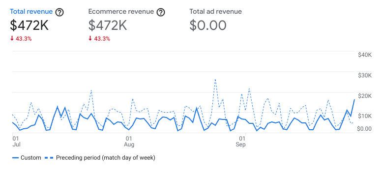

# Satisfacción garantizada: desarrolla estrategias de fidelización de clientes en línea

## Introducción a satisfacción garantizada: desarrolla estrategias de fidelización de clientes en línea

### Primeros pasos en el curso curso 7

#### Vídeo: VídeoIntroducción al curso 7

Satisfacción garantizada: desarrolla la fidelización de clientes en línea Hola de nuevo y ¡felicitaciones! Llegaste al
último curso de este programa. Llegar hasta aquí es un gran logro. Revisemos los temas aprendidos hasta aquí. Si seguiste el
certificado en orden, primero aprendiste las bases del comercio electrónico y marketing digital. Luego viste los conceptos
del marketing digital: marketing y publicidad en redes sociales, marketing por correo electrónico y analítica de marketing y
herramientas de práctica. Luego completaste el primero de los dos cursos de comercio electrónico, donde aprendiste a vender
en línea y crear una tienda comercio electrónico. ¿Qué sigue? Este curso cubre tres temas. Primero, verás conceptos
relacionados con la fidelidad y retención de clientes. Luego aprenderás más sobre herramientas de analítica de comercio
electrónico y cómo se aplican a las tiendas. Finalmente, te enfocarás en desarrollar habilidades y técnicas para solicitar
trabajo. Completarás un proyecto práctico para mostrar tu conocimiento de comercio electrónico y marketing digital. Primero,
quiero presentarme. Mi nombre es Mike. Soy Gerente de Desarrollo Profesional de Rendimiento Global en Google. Un título
largo, pero significa que trabajo con equipos de ventas y productos como Google para crear estrategias educativas para que
los equipos de ventas y publicidad usen estas soluciones con éxito y alcancen sus objetivos. Estando en Google, me asocié
con marcas, agencias y empresas tanto pequeñas como grandes. Ayudé a desarrollar sus estrategias publicitarias, a resolver
problemas y optimizar sus campañas para lograr sus objetivos de marketing y negocio. Mi experiencia en este sector me trajo
hasta aquí. Espero que estés listo/a para comenzar. Empecemos conociendo el trabajo que harás en la primera sección del
curso.

### Fidelidad del cliente y recompensas

#### Te damos la bienvenida a la semana 1 curso 7

Es hora de repasar. Si seguiste el curso en orden, recordarás el rol que juega la fidelidad en marketing y comercio
electrónico. Como recordatorio, Fidelidad es la última etapa del embudo de marketing, después de Conciencia, Consideración y
Conversión. En la etapa de Fidelidad, las/los clientes se repiten y se convierten en defensores de la marca, e idealmente,
en la voz de la marca. Aquí repasarás cómo se crea la fidelidad en un negocio de comercio electrónico, verás estrategias y
tácticas de fidelidad, como programas de recompensas y remarketing dinámico. Y aprenderás técnicas para desarrollar las
relaciones con tus clientes. Espero que te entusiasme tanto como a mí. Empecemos.

#### Introducción a la fidelidad del cliente

¿Qué se te viene a la mente al pensar en fidelidad? Quizás una mascota, o el compromiso con tu equipo deportivo favorito, o
una relación con alguien en tu vida. Sea lo que sea, seguramente involucre una sensación fuerte de apoyo o lealtad.
Demostramos fidelidad al formar un apego emocional a alguien o algo. En las relaciones, la fidelidad se basa en la
confianza. Se ve fomentada por un sentido de pertenencia y comunidad y motiva que las personas se mantengan conectadas. En
el comercio electrónico, la fidelidad también se crea así. Como repaso, Fidelidad es la última etapa del embudo de
marketing. En esta etapa las/los clientes se convierten en clientes regulares y defensores de la marca. La fidelidad se basa
en la confianza que tienen las/los clientes en un negocio. Cuando sienten pertenencia y conexión con ese negocio, su
fidelidad se refuerza. Veamos algunas formas de crear fidelidad. Quizás recuerdes aprender sobre estas estrategias
previamente en el programa. Pero ahora analizaremos cómo se aplican al comercio electrónico. Primero, hablemos sobre crear
confianza. En comercio electrónico puedes crear confianza al garantizar ofrecer productos de calidad que cumplan con las
necesidades de tus clientes. Una garantía de calidad, una generosa política de devoluciones, y ofrecer envío y devolución
sin costo pueden ayudar a crear confianza al eliminar la preocupación de tus clientes sobre si el producto será el adecuado.
Para generar confianza, debes brindar servicio al cliente de calidad en todo su recorrido, incluso después de que haya
completado la compra. Otra forma importante de crear confianza es proteger la información financiera y personal de tus
clientes. Tus clientes tienen que saber que mantendrás su información confidencial y segura. Puede ser que tengas que
agregar una insignia o un sello de confianza en la página de compra y garantizar que no compartirás su correo electrónico
con otros. ¿Por qué es importante? Cuando las/los clientes confían en un negocio, es más probable que sean fieles. Tener
clientes fieles es la base de una marca fuerte. Hablemos sobre crear fidelidad mediante el sentido de comunidad y
pertenencia. Si las/los clientes sienten una conexión con el negocio, es más probable que se vuelvan fieles. En el comercio
electrónico, puedes crear un sentido de comunidad en línea al interactuar con tus clientes en las redes sociales. También
puedes incentivarlos a compartir su experiencia mediante contenido generado por usuarios/as, como escribir reseñas de
productos, subir fotos o videos, participar en la página de preguntas y respuestas de un producto o unirse a un foro.
También puedes crear una comunidad compartiendo la historia detrás de tu marca y demostrando cómo tus valores están
alineados con los de tus clientes. Según las investigaciones, el 77% de los/las consumidores/as le compran a marcas que
comparten sus valores. Quieren sentirse bien con su compra. Por ejemplo, conectarse con los valores de tus clientes podría
ser compartir una pasión por la naturaleza, cuidar el medio ambiente, o buscar un cambio en la percepción de la belleza.
Otra forma de conectar es donar parte de las ventas a comunidades necesitadas. Por ejemplo, una empresa de ropa podría donar
un par de calcetines a un refugio de indigentes cada vez que alguien hace una compra en su sitio. Un programa así no solo
demuestra sus valores en acción, sino que también involucra a sus clientes en hacer el bien. Por último, puedes crear
fidelidad facilitando que tus clientes se mantengan conectados. Una forma de hacerlo es mediante una suscripción a los
productos que tus clientes compran regularmente como afeitadoras, vitaminas, o tinta de impresora. Es una buena idea
permitirles elegir cada cuánto quieren recibir el pedido y facilitar que puedan cancelar la suscripción para que no se
sientan atrapados/as. Otro modo de conexión es a través del remarketing dinámico, que les muestra anuncios a tus visitantes
anteriores con los productos y servicios que vieron en tu sitio. Como estos anuncios se adaptan a tus clientes, crean una
experiencia personalizada enfocada en los productos o servicios por los que ya se interesaron. El marketing por correo
electrónico es otra forma de conectar con clientes. Te da la oportunidad de ofrecer contenido valioso basado en sus
intereses. Puedes usar datos para personalizar tu campaña de correo electrónico con un correo que les recuerde que
abandonaron su carrito, o sugerir productos relacionados a otro que un/a cliente ya compró. Puedes usar el correo como un
recordatorio útil, para recordarles cuándo volver a comprar o girar el lado del colchón que compraron. Otra forma es a
través de un programa de recompensas, o programa de fidelización, que crea incentivos para que las/los clientes regresen.
Aprenderás más sobre los programas de recompensas luego. Crear fidelidad toma tiempo, cuando un negocio demuestra interés
por sus clientes. Puedes hacerlo al crear confianza, sentido de comunidad, y facilitar que tus clientes estén conectados.
Aunque Fidelidad sea la última etapa del embudo de marketing, es una de las oportunidades más valiosas para que una empresa
crezca. Las/los clientes felices regresarán y hablarán de tu negocio con otra gente. A continuación, aprenderás más sobre
estrategias para crear fidelidad en el comercio electrónico. Nos vemos pronto.

#### Programas de recompensas

Una buena estrategia de fidelización está diseñada para crear clientes regulares y aumentar las tasas de conversión. Una de
las estretegias de fidelización más efectivas es los programas de recompensas. También conocido como programa de fidelidad,
el programa de recompensas es un método de marketing diseñado para crear fidelidad de clientes a través de incentivos para
que las/los clientes regresan. Estos incentivos pueden incluir, entre otros, productos gratis, envío gratuito, descuentos,
cupones, o incluso la devolución del dinero de alguna compra. Antes de hablar de programas de fidelidad comunes, analicemos
dónde podrían encontrarlos las/los clientes de comercio electrónico. Ya que es beneficioso para las empresas lograr que sus
clientes regresen para vender más, dependerá de ellas hacer el proceso de inscripción de la forma más simple posible. Hay
dos formas sencillas para que los negocios de comercio electrónico motiven a sus clientes a inscribirse en los programas de
recompensas. La primera, los mensajes emergentes que aparecen en la pantalla de las/los clientes apenas visitan un sitio
web. Generalmente, ofrecen incentivos solo por registrarse e ingresar su dirección de correo electrónico. El segundo método
de inscripción al programa de recompensas llega al final del recorrido de compra en línea. Este método es más sutil. Al
completar la compra, las/los clientes pueden elegir inscribirse al programa de recompensas y recibir ofertas en el futuro.
Es común que las empresas inscriban a sus clientes automáticamente en el programa de recompensas sin costo alguno. En estos
casos, la/el cliente debe autoeliminarse del programa. Un beneficio de la inscripción automática es que ayuda a la marca a
crear una mayor base de clientes rápidamente. Aunque esto podría debilitar la confianza en la marca ya que sus clientes
podrían pensar que se hizo de forma engañosa. Ahora que aprendiste sobre el programa de recompensas y el proceso de
inscripción, veamos los diferentes tipos. En el comercio electrónico, los programas de recompensas más comunes son los
programas de puntos, los programas basados en el gasto, los programas basados en niveles y las suscripciones. Existen otros
tipos de programas de recompensa, pero, por ahora, analicemos cada uno de estos. El modelo de puntos es un programa de
recompensas que les ofrece puntos a las/los clientes, que son equivalentes a determinado valor monetario que gastaron en
varias compras. Estos puntos pueden canjearse por un incentivo cuando se llega a determinada cantidad. Por ejemplo, una
tienda de comercio electrónico de utensilios de cocina otorga un punto por cada dólar que gasta cada cliente. Cuando se
alcanzan los 100 puntos, la tienda premia a su cliente con un bol gratis. Luego, están los programas basados en gastos. Este
modelo es un programa que les ofrece a sus clientes incentivos basados en el monto gastado en una sola compra. Son similares
a los programas basados en puntos ya que fomentan llegar a cierto objetivo de gasto para obtener el incentivo. Aun así,
estos programas se basan en obtener un mayor valor a corto plazo. Por ejemplo, un negocio en línea puede ofrecer envío
gratuito en compras de más de 100 dólares. Alternativamente, el modelo basado en niveles le permite a las/los clientes
ascender a nuevos niveles basándose en el monto de dinero que gastan a lo largo del tiempo. Cuanto más dinero gastan, mayor
será el nivel al que accedan y se les ofrecerán mejores beneficios e incentivos. Por ejemplo, una empresa podría ofrecerles
a tres clientes, tres niveles. Bronce si gastan menos de 50 dólares, Plata si gastan entre 50 y 100 dólares, y Oro si gastan
más de 100 dólares. Con cada rango de compra, las/los clientes recibirán mejores ofertas de recompensas. Por último, tenemos
el programa de recompensas por suscripción. A diferencia de los otros programas mencionados, este modelo requiere que
las/los clientes hagan un pago periódico para recibir un incentivo exclusivo. Por ejemplo, una tienda de ropa en línea puede
ofrecerles entrega en un día a quienes paguen una cuota anual de 20 dólares. Aquellos clientes que no pagan por este
programa, deberán esperar una semana para que llegue su envío. Si el programa de recompensas es de pago, como el de
suscripción, las empresas nunca deberán automáticamente inscribir clientes en un servicio no deseado. Las empresas deberán
incluir mensajería separada para permitirles explorar el programa por su cuenta, cuando lo deseen. A esta altura, estoy
seguro de que el concepto de programas de recompensas parece simple, ¿no? Si el negocio ofrece algunos incentivos, sus
clientes regresarán para comprar más. Sin embargo, esto es solo lo básico. Debe haber más consideración en la creación de un
programa de recompensas exitoso que no solo esté enfocado en recordatorios de que tu empresa existe. Es decir, las
promociones a corto plazo solas no siempre terminan en fidelidad. Incluso si tu empresa ofrece grandes incentivos en sus
programas de recompensas, puede haber otras empresas con mejores precios en productos similares. Esto puede causar que
las/los clientes que consideras como "fieles" cambien en dónde eligen comprar sin dudarlo. Para crear un programa de
recompensas de comercio electrónico más exitoso y efectivo, los negocios deben considerar las siguientes preguntas. Primero,
¿cómo podemos personalizar la experiencia de los programas de recompensas? La personalización se trata de crear una
experiencia a la medida de una persona. Muchos negocios lo logran a través de tácticas como incluir el nombre de su cliente
en comunicaciones e interacciones programadas. Esto hace que las/los clientes se sientan valorados. Por ejemplo, a mí me
gusta correr. Y soy miembro de varios programas de recompensas de diferentes marcas deportivas. Si dos de estas marcas me
envían correos sobre sus zapatillas nuevas, será más probable que abra el que dice “Hola Mike, mira nuestro nuevo
lanzamiento”, y no el que dice “Mira nuestras nuevas zapatillas” ya que el primero me resulta más personal. Otra táctica
consiste en darles incentivos a ciertos grupos de clientes según sus hábitos de compra. Por ejemplo, si los datos dicen que
un/a cliente espera que haya envío gratuito antes de comprar, enviarles una oferta con envío gratis sin razón alguna, podría
hacer que se animen a comprar. Esto también los incentivará a seguir comprando. Segundo, ¿cómo puede un programa de
recompensas ser deseable y alcanzable? Los programas de recompensas funcionan mejor con ofertas lo suficientemente
atractivas para que las/los clientes quieran participar, pero que también les resulte accesibles. Por ejemplo, un programa
de recompensas en el que un/a cliente debe gastar 100 dólares para obtener un pequeño descuento del 5% en su próxima compra,
no es tan deseable como un programa de recompensas en el que deben gastar 100 dólares para obtener un 25% de descuento en su
próxima compra. Encontrar el equilibrio correcto puede ser difícil, pero es necesario para atraer clientes que regresan.
Tercero, pregúntate, ¿cómo puedo crear una comunidad con nuestra base de clientes? Si bien algunos/as clientes buscan
productos para comprar, otros/as disfrutan sentir que pertenecen a algo más grande. Promover espacios comunitarios puede ser
ideal para asegurarte la fidelidad de aquellos/as clientes. Por ejemplo, una empresa de libros podría solo vender novelas.
Pero luego de que un/a cliente compra un libro será difícil predecir si volverá después de terminar de leerlo. En cambio,
podrían crear un club de lectura en línea como parte del programa. Así, sus clientes encontrarán una comunidad con ideas e
intereses similares a los suyos por los libros. Cada vez que compren una nueva novela, lo harán en la librería a la que
pertenece el programa. Tener esto en cuenta es un gran comienzo para crear una base de clientes fieles que confían en ti y
valoran tu negocio. Sigue avanzando para aprender más sobre cómo crear y retener clientes fieles.

#### Remarketing dinámico

¿Alguna vez estabas comprando en línea y te distrajiste y olvidaste terminar lo que empezaste? ¿O te gustó un artículo que
viste pero no lo suficiente para comprarlo? El remarketing dinámico con Google Ads sirve para volver a involucrar a clientes
que vieron productos en tu sitio previamente. Están familiarizados con tu tienda y consideran comprar un producto, pero por
alguna razón aún no completaron la compra. Quizás necesiten más tiempo para decidir o que les recuerden que tu oferta es
demasiado buena para que se la pierdan. El remarketing dinámico te ayuda a recuperar estos/as clientes y generar fidelidad a
través de anuncios con un mensaje personalizado que se adapta a tu público. Este tipo de remarketing atrae a visitantes que
ya pensaron en comprar en tu tienda. Alienta a que estos/as visitantes regresen y completen su compra. El remarketing
dinámico muestra anuncios de productos ya vistos o productos similares por los que podrían interesarse. El motor de
recomendación de productos de Google Ads determina el mejor mix de productos para cada anuncio. Resulta en una experiencia
personalizada que presenta productos según su popularidad y lo que vieron en tu sitio. Mostrar productos similares a otros
ya vistos por tus clientes, ayuda a descubrir productos que no habrían visto de otra forma. Quizás el producto que vieron
antes no era exactamente lo que buscaban pero uno similar es lo que querían. Imaginemos una joyería en línea, por ejemplo.
Con clientes considerando hacer una gran compra. Quizás necesiten más tiempo para decidir. Quizás quieran comparar precios
con la mejor calidad de productos y ofertas. Con el remarketing dinámico, la joyería muestra anuncios de productos que sus
clientes vieron en su sitio, o similares que podrían gustarles. Conectándose así con las/los clientes, la joyería mantiene
su marca cerca de sus clientes mientras avanzan en su proceso de decisión de compra. El remarketing dinámico es un modo
eficaz de conectarte con clientes porque ya están interesados/as en tus productos y motivados/as para comprar. Quizás ya
compraron en tu tienda en el pasado. El remarketing dinámico te permite retener a estos/as clientes y animarlos/as a que
mantengan la relación con tu negocio. Es una forma para que una tienda de comercio electrónico genere fidelidad y se
mantenga conectada con sus clientes a lo largo del tiempo. A continuación, aprenderás más sobre cómo crear relaciones con
tus clientes. Nos vemos ahí.

#### Caso de éxito: Cómo Wayfair utiliza el marketing por correo electrónico para la personalización

El marketing por correo electrónico es una forma eficaz de conectarse con las/los clientes para fidelizarlos. Las empresas
pueden utilizar el marketing por correo electrónico tanto para atraer a nuevos/as clientes como para mantener el contacto
con los/las ya existentes. En este caso de éxito, descubrirás cómo el negocio de comercio electrónico
<https://www.wayfair.com/>, con sede en Boston, Massachusetts, utiliza el marketing por correo electrónico para compartir
información, impulsar las ventas y fidelizar a sus clientes. También aprenderás cómo Wayfair utiliza el marketing por correo
electrónico para la personalización, que es la práctica de ofrecer una experiencia personalizada a cada cliente.

Contexto de la empresa

Niraj Shah y Steve Conine son dos viejos amigos que fundaron la empresa en línea en 2002, con el objetivo de ofrecer a sus
clientes una selección de productos mayor de la que cabría en una tienda física. La empresa que crearon estaba integrada por
un conjunto de más de 200 tiendas de comercio electrónico, cada una de las cuales vendía distintas categorías de productos.
En 2011, la empresa combinó todos estos sitios para crear wayfair.com.

Wayfair es ahora uno de los mayores negocios de artículos para el hogar del mundo. Su objetivo es ayudar a todas las
personas, no importa dónde estén, a crear una sensación de hogar propio, en función de quiénes son, qué necesitan y qué
valoran.

El desafío

El marketing por correo electrónico es el segundo canal de marketing más utilizado por Wayfair y uno de sus principales
motores de crecimiento. .

El objetivo de la firma es proporcionar a cada cliente el contenido que necesita, en el momento justo de su proceso de
compra. Dado que las/los clientes se encuentran en distintos puntos de sus procesos de compra y en distintas etapas del
embudo de marketing, necesitan diferentes tipos de contenidos, en distintos momentos, por lo cual enviar los mismos correos
electrónicos a todos/as ellos/ellas no representaría una experiencia personalizada.

Algunas personas pueden estar dudando sobre si comprar muebles en línea o comprarle a una empresa que no conocen. Están en
la etapa de Conciencia del embudo de marketing.

Otras pueden estar investigando los productos, pero aún no están listas para comprar. Están en la etapa de Consideración del
embudo.

Otro grupo de clientes puede haber hecho una compra recientemente, pero se dan cuenta de que necesitan un accesorio que
combine con el producto que acaban de comprar. Han superado la etapa de Conversión y han llegado a la etapa de Fidelidad, en
la que deciden convertirse en clientes regulares.

Como cada grupo de clientes se encuentra en una etapa diferente del embudo de marketing, Wayfair personaliza sus campañas de
correo electrónico para adaptarlas a las necesidades de cada uno de ellos.

El enfoque

Las campañas de marketing por correo electrónico de Wayfair procuran entregar el contenido que las/los clientes desean, en
el momento en el que quieren recibirlo. Así:

Un/a cliente nuevo/a podría recibir un correo electrónico de bienvenida en el que la empresa se presenta y se destacan
diversas categorías de productos que podrían interesarle.

Un/a cliente que visitó recientemente el sitio podría recibir un correo electrónico con varios productos o categorías que
haya visto mientras navegaba por él.

Un/a cliente que acaba de realizar una compra podría recibir un correo electrónico con productos o accesorios relacionados.
Por ejemplo, si compró una alfombra, se le podría recomendar una almohadilla que vaya debajo de esa misma alfombra.

Un/a cliente que hace tiempo que no visita el sitio podría recibir un correo electrónico con contenido inspirador e ideas
que lo/la ayuden a crear un espacio en el que se sienta como en casa.

A continuación, se muestra un ejemplo del contenido enviado a nuevos/as suscriptores/as de correo electrónico. El asunto del
correo es ¡Te damos la bienvenida a casa! El cuerpo del mensaje presenta a Wayfair y facilita la compra de una variedad de
productos de la empresa. Los/las destinatarios/as simplemente tienen que hacer clic en Comenzar a comprar.

Los resultados

Mediante el aprendizaje automático, la empresa prueba formas de mejorar y personalizar las recomendaciones de productos en
sus correos electrónicos. Este enfoque le permite a Wayfair evaluar qué funciona y qué no, y hacer cambios en función de los
resultados.

La recomendación personalizada de productos resultó exitosa cuando estuvo dirigida a clientes que habían comprado o visto
productos recientemente. Sin embargo, cuanto más tiempo pasaba desde la última visita al sitio, menos eficaces resultaban
estos correos, por lo cual Wayfair entendió que tanto el contenido como el momento en el que se enviaban los mensajes eran
fundamentales para su éxito.

La empresa también realizó pruebas que confirmaron que las líneas de asunto marcan una gran diferencia en sus campañas de
marketing por correo electrónico. Las líneas de asunto que obtuvieron mejores resultados fueron las que más se ajustaban al
contenido de los correos. En el caso de los correos electrónicos promocionales, resultó ser muy eficiente mencionar la
promoción o el descuento ya desde el asunto. Por ejemplo, si el cuerpo de un correo electrónico contenía la siguiente
oferta, la línea de asunto podía ser Ahorra US$20 en tu próxima compra de US$100 o más en Wayfair.

La empresa también descubrió que un proceso de compra y de entrega fluido y agradable tiene mayor impacto que cualquier cosa
que pueda incluir en sus correos electrónicos. Por eso, a las/los clientes que no tuvieron una buena experiencia con su
compra, Wayfair les envía un correo ofreciéndoles un descuento en su próxima compra a modo de compensación. Los resultados
de esta campaña de correo electrónico son muy satisfactorios, ya que cerca del 50% de estos/as clientes vuelven a realizar
otra compra.

Conclusión

Como muestra la historia de Wayfair, ofrecer una experiencia personalizada a las/los clientes puede tener un impacto
significativo a la hora de lograr una conexión y conseguir su fidelidad. A medida que adquieras más experiencia en el campo
del marketing digital y el comercio electrónico, descubrirás que poner a prueba tus ideas, experimentar qué funciona y qué
no, y aplicar los resultados son las claves para perfeccionar tu estrategia de marketing.

### Desarrolla las capacidades de gestión de las relaciones con las/los clientes

#### Métodos de seguimiento posteriores a la compra

Ahora discutiremos métodos para hacer un seguimiento de tus clientes y cómo hacerlo de forma eficaz. Esto se llama
comunicación posterior a la compra. Se define como toda interacción que las/los clientes tienen con una marca después de una
compra. Como clientes que regresan son una gran parte de las ventas de comercio electrónico, la comunicación posterior a la
compra se enfoca en las relaciones con clientes existentes. Es una forma eficiente de aumentar el tráfico a tu tienda en
línea. También ayuda a mantener a tu empresa en la mente de tus clientes y sacarle ventaja a tu competencia. La comunicación
posterior a la compra también puede hacer que tus clientes sientan que tomaron la decisión de compra correcta. Esto aumenta
la fidelidad de marca y el apoyo de clientes. ¿Alguna vez compraste en línea y sentiste que fue un error al completar la
transacción? Esa sensación de arrepentimiento se llama “remordimiento del comprador”. Según un informe, más del 50% de las
personas encuestadas compartió haber experimentado el remordimiento del comprador. La comunicación posterior a la compra
alivia esa sensación al reforzar los sentimientos positivos de la experiencia. Veamos cómo. Primero, existen métodos de
comunicación posterior a la compra. Empezarás con correos electrónicos, redes sociales, y correo directo. Iniciaremos por el
método más fácil para llegar a tu base de clientes, los correos electrónicos son muy populares. Esto se debe a la variedad
de aspectos que puedes incluir en los correos. Aquí hay algunos ejemplos y tipos. Existen correos de agradecimiento, que son
cortos y agradables, sirven para hacer seguimiento y muestran tu aprecio por su compra. Estos correos hacen que las/los
clientes sientan que la empresa realmente aprecia que compren. También existen correos de solicitud de reseña. Básicamente,
estos correos tienen dos tareas. Brindan los datos necesarios de la experiencia de tus clientes con tu marca, y en caso de
ser positiva, le aporta un gran respaldo a uno de tus productos. Otro tipo de correo es la encuesta de satisfacción de
clientes. Por lo general, le permite a las/los clientes calificar productos mediante un sistema de escala. Estas encuestas
miden cómo los productos y servicios cumplen o superan las expectativas de las/los clientes. Por último, una empresa puede
enviar correos de reabastecimiento. Estos se usan para animar a las/los clientes a repetir una compra cuando los artículos
están a punto de agotarse. Son muy eficaces. Por ejemplo, si un/a cliente está por quedarse sin su champú favorito que
compró en línea hace dos meses, quizás se olvide de volver a comprarlo. Pero si recibe un mensaje oportuno, recordándole que
compre otra botella, será más probable que lo haga en ese momento. Ya vimos los correos electrónicos. Ahora analizaremos el
siguiente método de comunicación, las redes sociales. Las redes sociales son una gran manera de llegar a tus clientes. Con
la popularidad de los hashtags en varios sitios, siempre puedes ver las conversaciones en las que participa tu marca.
Imaginemos que un fanático del béisbol crea una publicación en redes sociales con una foto usando un sombrero nuevo que
acaba de comprar en línea a una empresa de ropa deportiva, llamada Johnny Jonnie Jon. En la publicación, etiqueta a la
empresa. Si la empresa sigue los hashtags y menciones, podrá verlo rápidamente. La empresa puede responderle directamente al
cliente y compartir su felicidad por el cliente satisfecho con su compra. Además, con el permiso del cliente, podrían volver
a publicar la foto en su página. Esto podría generar aún más interés en la marca de parte de quienes siguen a la empresa o
al cliente. El último método de comunicación posterior a la compra es el correo directo. Enviar cartas o información de la
marca por correo, precede a los otros métodos mencionados. Sin embargo, el correo directo puede tener un encanto clásico,
incomparable con los métodos digitales. Esto es porque algunos/as clientes creen que eso demuestra la consideración y el
interés de la empresa. Este método puede consumir más tiempo, pero algunas personas lo aprecian mucho. Sea cual sea el
método que elijas, querrás recordar algunos consejos para que sea eficiente y haga que tus clientes regresen. Primero,
siempre personaliza la experiencia. Querrás tener una relación cercana con tus clientes. Salúdalos por sus nombres, en vez
de usar términos formales como “cliente”. También le puedes agregar un toque personal a la relación entre clientes y negocio
comunicándote con ellos/as en días importantes, como en su cumpleaños. Modera tu comunicación. Lo admito, como comprador en
línea, me frustra cuando recibo muchos mensajes de marcas. En su lugar, modera el ritmo de tu comunicación para no abrumar a
tus clientes con avalanchas de mensajes. El último consejo es ofrecerles incentivos de compra a tus clientes. Ofrecer
descuentos o dinero gratis puede ser una gran forma de animarlos/las a que regresen a tu tienda en línea. No solo les estás
comunicando que quieres que compren, sino que también les dices que aprecias sus compras. A medida que creas relaciones con
tus clientes, tu comunicación debe estar equilibrada entre lo promocional y lo interactivo. Quieres que tu público sienta tu
autenticidad y sinceridad, mientras haces crecer a tu empresa. Buena suerte.

#### Encuesta a tus clientes y formula preguntas eficientes

Al encuestar a tus clientes, obtienes los comentarios que necesitas. Te ayuda a entender sus necesidades e intereses. En
este video veremos las encuestas a clientes y cómo formular preguntas efectivas para obtener información relevante. Una
encuesta de clientes mide si los productos y servicios que brinda un negocio cumplen o superan las expectativas de sus
clientes. Como profesional de comercio electrónico, estas encuestas son valiosas porque contribuyen al crecimiento de tu
negocio. Las encuestas te ayudan a conocer datos demográficos como la edad, dónde viven y trabajan tus clientes, sus
intereses y pasatiempos, o los problemas que tienen con su experiencia de compra. Estos datos te ayudan a saber quiénes son
tus clientes. Al analizar los resultados, podrás llegar a los grupos de clientes y comunicarte mejor con ellos basándote en
esa información. Hay dos categorías de encuestas. Una previa a la compra, que se hace antes de la compra, y otra posterior a
la compra, que se hace después de que un/a cliente compra. Antes de crear tu encuesta, deberás definir tu objetivo. Recrear
preguntas sin un claro propósito crea una gran cantidad de datos aleatorios. Para evitarlo, pregúntate: ¿qué quiero conocer
de mis clientes? Podría ser, ¿cómo puedo mejorar mi tasa de retención de clientes? ¿Qué partes de mi sitio web debería
mejorar? Cuando definas tus objetivos, crea preguntas claras y concisas para tu encuesta. Existen muchos consejos para
hacerlo. Aquí hay algunos. Primero, evita hacer preguntas capciosas. Estas preguntas llevan a las personas a responder de
cierta manera. Por ejemplo, preguntar, “te gusta nuestro sitio web, ¿verdad?”, presiona a las/los clientes a responder que
sí, solo por la forma en la que se formuló de la pregunta. Estas preguntas pueden resultar en datos sesgados. En su lugar,
haz preguntas abiertas como: en una escala de 1 a 5, califica tu experiencia de compra hoy. Luego sigue con un formulario
abierto en el que puedan explicar su respuesta. Segundo, evita dar opciones de respuestas que se superpongan. Esto puede
causar confusión si hay dos posibles respuestas correctas. Por ejemplo, si alguien de 35 años está respondiendo a: “¿cuántos
años tienes?”, y las únicas opciones de respuesta son, a) Entre 25 y 35 años, o b) Entre 35 y 45 años, pueden perderse y no
saber cuál es la opción correcta para ellos/as. En su lugar, escribe opciones como a) Entre 25 y 34 años, b) Entre 35 y 44
años. Así, la única respuesta correcta es b. Tercero, sé respetuoso/a e inclusivo/a. Como especialista en comercio
electrónico, hay que saber que hacer preguntas personales es delicado y representa cierto desafío. Sé consciente sobre las
preguntas y encuestas específicas, y cómo las presentas. Y, por último, recuerda usar el tono de voz de tu marca. Esto se
refiere a cómo tu empresa elige expresarse. Por ejemplo, imagina una tienda de ropa infantil que tiene una marca divertida y
aventurera. Si crea una encuesta usando un saludo formal como “Estimado señor o señora, tómese un momento para completar
nuestra encuesta de clientes”, la seriedad del tono puede confundir a sus clientes. Preferirán usar algo como: “¡Hola!
¿Puedes completar nuestra encuesta de clientes?” ¿Notas la diferencia? La segunda crea un tono acogedor que sus clientes
reconocen y aprecian. Ten esto en cuenta al crear preguntas. Una vez que estés listo, comienza a crearlas. Estas variarán
según tu sector. La encuesta previa a la compra seguramente incluya preguntas que busquen entender quiénes son sus clientes
y qué quieren comprar. Por ejemplo, “¿Para quién estás comprando?”, o “¿Qué productos o categorías te interesan más?” La
encuesta posterior a la compra incluye preguntas que buscan comprender cómo fue la experiencia del cliente. Estas serán
preguntas como: ¿Qué podemos mejorar de la experiencia en nuestro sitio?”, o “¿Volverías a comprarnos en el futuro?” La
encuesta posterior a la compra puede incluir preguntas que hagan que las/los clientes brinden información personal. Esto te
ayudará a dirigirte a ellos/as en el futuro para que regresen a tu sitio. Incluirán preguntas para promocionar eventos como,
“¿Cuándo es tu cumpleaños?” o preguntas relacionadas con la publicidad de marca, como, “En una escala del 1 al 10, ¿qué
probabilidades hay de que le recomiendes la empresa a un amigo o amiga?” Después de escribir todas tus preguntas, completa
la siguiente lista de verificación. ¿La redacción de esta pregunta es simple y fácil de entender? Las preguntas que tienen
cierta jerga podrían confundir a tus clientes, así que opta por usar un lenguaje simple. ¿Esta pregunta pide demasiada
información personal? Si es así, tus clientes podrían sentir que su privacidad está siendo invadida. Haz que la pregunta sea
más general. ¿Es esta pregunta demasiado compleja? Puede implicar muchas oraciones o pasos para completarla y hacer que las
personas abandonen la encuesta. Revisa los elementos que puedes eliminar antes de finalizar las preguntas. Por último, ¿esta
pregunta hace una suposición sobre mi cliente? Por ejemplo, si eres especialista de comercio electrónico de una tienda de
bolsos, ¿tus preguntas asumen que tus clientes se identifican como mujeres por la expresión que usaste? Si es así, cambia tu
pregunta a un tono más neutral. Al terminar, sube tu encuesta para que aparezca en vivo en tu sitio o envíala por correo
electrónico. Cuando tengas varias encuestas, usa los datos para crear tu lista de clientes y aplica los cambios a tus
experiencias de marketing o negocio. Diviértete creando preguntas de encuestas.

#### Actividad de ejemplo: Redacta una encuesta de satisfacción de clientes

Compara el ejemplo con tu encuesta de satisfacción de clientes. Revisa tu trabajo utilizando cada uno de los criterios del
ejemplo. ¿Qué hiciste bien? ¿En qué aspectos podrías mejorar? Utiliza tus respuestas a estas preguntas a modo de guía a
medida que avanzas en el curso.

Tu encuesta de satisfacción de clientes debe incluir:

Una o dos frases invitando a tus clientes a realizar la encuesta, redactadas con la voz de marca de la empresa.

Tres preguntas demográficas redactadas con sensibilidad, que sean inclusivas y relevantes para el objetivo de la encuesta.

Una escala de satisfacción que incluya al menos cinco criterios que deseas que tus clientes evalúen, junto con una gama de
respuestas.

Una pregunta NPS (puntuación neta de promotor) con términos que indiquen el valor de los números de la escala.

Dos preguntas abiertas breves y sencillas, que estén alineadas con el objetivo de la encuesta y animen a las/los clientes a
proporcionar una opinión sincera y reflexiva.

Todas las preguntas de la encuesta también deben revisarse y corregirse en función de la lista de verificación de preguntas
para encuestas a clientes.

#### Cómo proporcionar un excelente servicio al cliente

Hola. Antes de empezar, quiero compartirte una cita. Dice, “El trato cortés hará de un/a cliente un anuncio caminante”. Esto
lo expresó un famoso empresario estadounidense, James Cash Penney. Por supuesto, JC Penney no quiso decir literalmente que
tus clientes serían una herramienta oficial de promoción, sino que crear una gran experiencia de compra para tus clientes
hará que se sientan tan bien que optarán por volver a comprar en tu tienda. Incluso le recomendarán tu negocio a sus
conocidos. Globalmente, el 61% de consumidores/as ven como 'muy importante' el servicio al cliente. El servicio al cliente
superó recientemente al precio y al producto como el principal factor que distingue a las marcas al comprar. El servicio al
cliente se define como el asesoramiento y apoyo que una empresa brinda antes, durante, y después de una compra. Una gran
experiencia de compra incluye cómo una marca aborda el servicio al cliente. Con tanto énfasis en el servicio al cliente,
veremos formas de aplicar un buen servicio en tu tienda de comercio electrónico. Primero, deberás decidir el canal que
usarás para darle soporte a tus clientes. Aquí hay algunas opciones. El canal más común para muchas personas es el correo
electrónico. Los negocios de comercio electrónico suelen ofrecer una dirección de correo o un formulario de contacto en su
sitio web para solicitar ayuda. Google le pide a los negocios que publiquen sus correos claramente en sus sitios para poder
publicitar en Google Shopping. Puedes usar tu bandeja de entrada para comunicarte con tus clientes. Los correos sirven para
avisarles a tus clientes cuándo recibirán una respuesta. Indica tu tiempo de respuesta en la sección “contáctanos” de tu
sitio. Otro canal de servicio al cliente común es el chat en vivo. Es la tecnología que le permite a las/los clientes
comunicarse en tiempo real con el o la representante del negocio. Si un/a cliente tiene una pregunta sobre cualquier cosa,
podrá obtener una respuesta en solo un momento. Atención, este método suele usarse por grandes empresas con recursos y
presupuesto para poder responder durante todo el día. Los chatbots son un canal de servicio al cliente similar. Ofrecen una
tecnología de comunicación empresarial directa en el sitio web. A diferencia del chat en vivo, los chatbots son sistemas
programados que responden a preguntas comunes. Los chatbots son útiles porque dan una respuesta rápida. Aun así, no están
equipados para interacciones complejas, ya que solo ofrecen respuestas preprogramadas a preguntas específicas. El cuarto
canal de servicio al cliente es las redes sociales. Esta plataforma está en constante evolución. Con el rápido aumento de
popularidad durante la década pasada, está claro que las redes sociales llegaron para quedarse. Para estar al día, muchas
marcas empezaron a brindar servicio al cliente en plataformas como Twitter y Facebook. Si las marcas tienen sus propias
cuentas de redes sociales, tienen la opción de responder públicamente o en privado. Si eliges este camino, es mejor ofrecer
servicio al cliente en las plataformas de redes sociales en donde ya tienes presencia o en las que más usan tus clientes.
Esto ayudará a consolidar tus esfuerzos de comunicación. Lo bueno es que no tienes que limitarte a una sola plataforma de
servicio al cliente. Puedes ofrecer una estrategia de servicio al cliente multicanal, es decir, dar servicio al cliente en
múltiples canales. Si seguiste los cursos en orden, quizás recuerdes esta estrategia. Cuando se trata de dar servicio al
cliente de calidad, es importante interactuar de la forma en la que ellos/as quieran. Ya sea por los cuatro canales que
vimos u otros canales, como soporte telefónico o foros. Sin importar qué canales elijas, es importante recordar 4 aspectos
clave de servicio al cliente. Resuelve el problema rápido, resuélvelo con una interacción, brinda un servicio al cliente
amigable y realiza un seguimiento posterior para garantizar su satisfacción. Para entender estos aspectos, imaginemos a
Menal, que le encanta el color verde y compra un abrigo verde de la tienda en línea de Frosty Flossie Outerwear. Pero cuando
llega hay un problema. La tienda envió un abrigo azul en su lugar. Menal tiene la opción de elegir entre chatear en vivo con
un/a representante en el sitio web de la tienda. O puede buscar la dirección de correo que aparece en el sitio web. En su
lugar, crea una publicación en las redes sociales sobre el error y etiqueta a la empresa. Teniendo en mente los 4 aspectos
del servicio al cliente, la empresa responde a las pocas horas de haber recibido la notificación. Con un lenguaje amable, la
empresa reconoce el error y le ofrece comunicarse por privado para resolver el problema. Usando mensajes directos, la
empresa promete corregir el problema y le ofrece un descuento a Menal para su próxima compra. Una vez que el nuevo abrigo
fue entregado, la empresa puede comunicarse con Menal para ver si está satisfecha. Y así, el problema se resuelve y la
cliente está feliz de nuevo. Por supuesto, resolver las quejas es solo un aspecto de este servicio. Otro aspecto es
brindarles a las/los clientes toda la información necesaria para realizar una compra. Una forma de hacerlo es creando una
página en tu sitio web de preguntas frecuentes, o FAQ. Estas páginas son de gran ayuda para las preguntas que tus clientes
podrían tener con respecto a tu negocio, productos o servicios, políticas, procesos y más. Las páginas de FAQ son útiles
porque te permiten ahorrar tiempo con las preguntas generales que podrían tener tus clientes, generan confianza entre la
marca y sus clientes ya que estas páginas demuestran que tu empresa consideró varios escenarios, preguntas, y preocupaciones
comunes. Además, las páginas de FAQ pueden atraer más tráfico a tu sitio. Esto es por los fragmentos destacados de Google en
páginas de búsqueda. Cuando se busca una pregunta relacionada a una de tus FAQ, tu pregunta y respuesta se extraerá
automáticamente de tu página de FAQ indexada por Google. El servicio al cliente de calidad es importante para el éxito de
todo negocio, incluido para una tienda de comercio electrónico. Si bien quizás no termines trabajando en el área de servicio
al cliente, tu trabajo en comercio electrónico podría impactar en la experiencia del cliente. Conocer los problemas de tus
clientes y considerar sus comentarios puede ayudarte a mejorar su experiencia. Eso concluye la lección sobre brindar un
excelente servicio al cliente. A medida que avances, ten presentes las palabras de James Cash Penney y de las/los clientes.

#### Mide el nivel de satisfacción de tus clientes

La opinión que las/los clientes tienen de una empresa se suele basar en las experiencias que hayan tenido con ella y en sus
propios resultados personales. Las interacciones que las personas tienen con una empresa en línea, ya sean directas o
indirectas, pueden influir en su decisión de volver a comprar. Por eso es importante que las empresas de comercio
electrónico evalúen constantemente la satisfacción de sus clientes.

Medir la satisfacción del cliente implica realizar investigaciones para determinar el rendimiento de los productos o
servicios en función de cómo son percibidos por el público, lo cual puede ayudar a una empresa a mejorar su posicionamiento.
A continuación, se indican los pasos a seguir para medir la satisfacción de las/los clientes.

Define los objetivos

Antes de comenzar a medir la satisfacción de sus clientes, la empresa debe definir qué debe mejorar. La experiencia de
los/las compradores/as en una tienda en línea está compuesta por muchos pasos: la selección del artículo, el proceso de pago
y la entrega del producto. En cada uno de estos pasos algo puede salir mal, por lo que es importante ser específico/a al
pensar en el objetivo de la investigación. 

En un curso anterior, aprendiste que los objetivos deben ser específicos, medibles, alcanzables, relevantes y de tiempo
limitado. Ten en cuenta esto cuando desarrolles tus objetivos.

Algunos ejemplos de objetivos son:

Reducir las redundancias y la fricción con las/los clientes.

Ofrecer opciones de autoservicio.

Sustituir a las/los representantes de ventas por agentes de servicio al cliente de comercio electrónico.

Tomarse en serio las reseñas de las/los clientes.

Resolver los problemas rápidamente.

Resolver los problemas mediante una sola interacción.

Asegurarse de que las/los representantes de servicio al cliente sean amables.

Ser capaz de realizar un seguimiento con la misma persona, en caso de ser necesario.

Ser capaz de grabar, imprimir y guardar una copia de cada interacción.

Hacer un seguimiento posterior con las/los clientes para asegurarse de que estén satisfechos/as.

Elige un tipo de encuesta de satisfacción de clientes

Como se mencionó en un video, existen muchos tipos de encuestas para conocer la opinión de las/los clientes sobre una
empresa. A continuación, se enumeran algunos tipos comunes de encuestas a clientes.

Encuesta de satisfacción de clientes (CSAT)

Las encuestas de satisfacción de clientes, o encuestas CSAT, se utilizan para medir la satisfacción de las/los clientes con
los productos o servicios. Para repasar la variedad de encuestas de satisfacción de clientes, consulta un la clase sobre las
encuestas de clientes.

Encuesta de puntuación neta de promotor (NPS)

Las encuestas de puntuación neta de promotor (NPS) consisten en una sola pregunta en la que se le pide a los/las
encuestados/as que califiquen la probabilidad de que le recomienden una empresa, producto o servicio a un amigo/a o colega
mediante una escala que va de 0, para nada probable, a 10, extremadamente probable. A diferencia de las encuestas CSAT
generales, que tienen como objetivo medir la satisfacción de clientes con un servicio o marca en particular, las encuestas
NPS pretenden medir la fidelidad hacia una empresa. Las puntuaciones se dividen en tres categorías: 

Promotores/as: las personas que responden con una puntuación de 9 o 10. Se las considera entusiastas de la marca.

Pasivos/as: las personas que responden con una puntuación de 7 u 8. Están satisfechas, pero no son tan entusiastas como para
promocionar la marca.

Detractores/as: las personas que responden con una puntuación de 6  inferior. No están satisfechas y es poco probable que
vuelvan a comprarle a la empresa. 

Para calcular la puntuación NPS, las empresas restan el porcentaje de detractores del porcentaje de promotores. 

Por ejemplo, si el 15% de las personas son detractoras y el 60% promotoras, la puntuación global de NPS es del 45%. 

Encuesta de usabilidad

En el caso de las empresas de comercio electrónico, la mayor parte de las compras se realizan a través de la tienda en
línea.

Las encuestas de usabilidad relacionan la satisfacción de las/los clientes con el sitio web de la empresa e identifican
cualquier problema que hayan tenido a lo largo de su proceso de compra.

Selecciona un medio de encuesta

Una vez que seleccionas un tipo de encuesta, tendrás que elegir un medio. Los diferentes medios de encuesta pueden incluir: 

Encuestas realizadas desde la aplicación o el sitio.

Encuestas posteriores al servicio o a la compra.

Encuestas largas por correo electrónico.

Mediante los comentarios de sus clientes, la empresa puede conocer qué opinan sobre su marca, sus servicios o productos. Los
datos obtenidos a partir de estos comentarios pueden brindar información útil para mejorar la experiencia de compra.

Conclusiones clave

Las empresas deben esforzarse por mantener a sus clientes felices. Las compras realizadas por personas que compraron
previamente representan una gran parte de las ventas futuras, por lo cual los comentarios de sus clientes son muy
importantes. A partir de estos, ya sean  positivos o negativos, las marcas pueden tomar decisiones adecuadas y hacer crecer
su negocio de manera eficaz.

### Revisión: Introducción a satisfacción garantizada: desarrolla estrategias de fidelización de clientes en línea

#### Términos y definiciones del curso 7, semana 1

Chat en vivo: Una tecnología de servicio al cliente que permite a las personas comunicarse en tiempo real con un/a
representante comercial.

Chatbot: Sistema programado que responde a las preguntas comunes de clientes y/o suscriptores/as.

Comunicación posterior a la compra: Cualquier interacción directa que las/los clientes tienen con una marca después de
realizar una compra.

Correos electrónicos de reabastecimiento: Correos electrónicos utilizados para incitar a las/los clientes a que repitan la
compra cuando los artículos adquiridos previamente están a punto de agotarse.

Encuesta de NPS: Relevamiento de una sola pregunta que le pide a los/las encuestados/as que califiquen en una escala de cero
a diez la probabilidad de recomendación de una empresa, producto o servicio a un/a amigo/a o colega.

Encuesta de satisfacción del cliente (CSAT): Herramienta que mide cómo los productos y servicios suministrados por una
empresa cumplen o superan las expectativas de sus clientes.

Encuesta de usabilidad: Encuesta que evalúa la satisfacción de las/los clientes con el sitio web de una empresa e identifica
cualquier problema que las personas puedan experimentar a lo largo del recorrido de compras.

Fragmento destacado: Cuadro especial que muestra información sobre una búsqueda en la página de resultados.

Modelo basado en el gasto: Programa de recompensas que ofrece a las/los clientes incentivos basados en una cantidad gastada
durante una sola compra.

Modelo basado en niveles: Programa de recompensas que ofrece a las/los clientes incentivos basados en la cantidad de dinero
destinada a una sola compra.

Modelo de puntos: Programa de recompensas que ofrece a las/los clientes un punto equivalente por un valor monetario
determinado gastado en el transcurso de varias compras.

Modelo de suscripción: Programa de recompensas que requiere que las/los clientes realicen un pago recurrente para recibir un
incentivo exclusivo.

Preguntas frecuentes (FAQ): Sección en un sitio web que proporciona respuestas a las preguntas que las/los clientes pueden
tener con respecto a un negocio, sus productos o servicios, políticas, procesos y más.

Programa de recompensas: estrategia de marketing diseñada por una marca para fidelizar a sus clientes al proporcionarles
incentivos para que la continúen comprando.

Remarketing dinámico: Proceso que permite a una empresa mostrar anuncios a visitantes anteriores que contienen productos y
servicios que vieron en el sitio de la empresa.

Servicio al cliente: Asesoramiento y apoyo que una empresa brinda a sus clientes antes, durante y después de una compra.

Servicio al cliente multicanal: Proporcionar atención al/a cliente a través de múltiples canales.

## Analiza las tendencias de una tienda en línea

### Aprende acerca de las herramientas de análisis de comercio electrónico

#### Te damos la bienvenida a la semana 2 curso 7

Hola. Hasta ahora aprendiste los conceptos básicos de vender en línea, incluyendo cómo crear y actualizar una tienda
comercio electrónico, cómo interactuar con las y los clientes en línea, y cómo fidelizarlos/as. Ahora, vamos a explorar cómo
los datos se relacionan con el comercio electrónico. Aprenderás a analizar datos para una tienda de comercio electrónico,
tomar decisiones basadas en ellos y mejorar el rendimiento de la tienda. Comenzarás aprendiendo los conceptos básicos de la
analítica del comercio electrónico: cómo establecer objetivos, evaluar métricas y medir el éxito. Luego, aprenderás a usar
la herramienta analítica de Shopify. Verás algunas de las métricas más importantes para monitorear el crecimiento general y
los ingresos de una tienda de comercio electrónico. Aprenderás a aplicar los conocimientos obtenidos a partir de esos datos
para mejorar el rendimiento de la tienda. También aprenderás a hacer un seguimiento de las métricas relacionadas al
rendimiento del producto y algunas formas para mejorarlo, basándote en los datos que descubras. Descubrí la importancia de
la analítica al trabajar en la estrategia de una marca para la temporada navideña. En el pasado, esta marca solo se había
enfocado en adquirir nuevos/as clientes. Sin embargo, al analizar los datos, descubrimos que las y los clientes recurrentes
tenían una tasa de conversión más alta en el valor del carrito que los nuevos/as. Esta información condujo a una estrategia
de remarketing exitosa y ayudó a lograr el objetivo anual. ¿Listo/a para aprender sobre la analítica de comercio
electrónico? Empecemos. Estaré aquí para guiarte.

#### Analiza datos para medir el éxito del comercio electrónico

¿Quieres aprender sobre el análisis de datos para una tienda de comercio electrónico? Aquí veremos algunos de los los
conceptos básicos de la analítica, incluyendo cómo establecer objetivos, evaluar métricas y medir el éxito. Ya aprendiste
sobre analítica, ahora vamos a considerar cómo aplicarla al comercio electrónico. La analítica de datos sirve para averiguar
qué funciona y qué no en una tienda de comercio electrónico. Sirve sin importar si la empresa es un negocio grande o
pequeño. Con los insights de la analítica, se puede determinar qué ventas y tácticas de marketing son las más efectivas.
También sirve para entender el comportamiento de las y los clientes. Estos insights ayudan a un negocio a descubrir qué
tácticas dan los mejores resultados. Estas son las áreas en que se debe invertir tiempo y dinero, porque brindarán el mayor
retorno de la inversión. Los datos que una empresa analiza pueden venir de varias fuentes. Por ejemplo, ya sabes de Google
Analytics. Muchas plataformas de comercio electrónico incorporan su propia analítica, El marketing por correo, las redes
sociales y otras herramientas, a veces, también. Se pueden reunir datos de otras fuentes, como encuestas a clientes, pruebas
A/B y mapas de calor, que verás más adelante. ¿Cómo se mide el éxito de un comercio electrónico con datos? Primero, se
establecen objetivos para cada área. Como ya aprendiste, estos deben ser SMART, es decir, específicos, medibles,
alcanzables, relevantes y temporales. Cada uno contribuye a lograr el objetivo final de éxito en el comercio electrónico. Al
establecer objetivos se eligen las métricas para medir el éxito de un negocio o una meta de marketing. Como ya aprendiste,
estas métricas son indicadores clave de rendimiento (KPI). Un KPI es una medida para evaluar qué tan exitoso es un negocio
para lograr un objetivo comercial o de marketing. Las métricas monitoreadas varían según los objetivos y los datos
acumulados. Es útil para las tiendas de comercio electrónico más nuevas comparar los resultados de sus métricas
trimestralmente. Un trimestre es un período de 3 meses del calendario financiero de una empresa. Cada año tiene 4
trimestres. Comparar los resultados con el periodo anterior ayuda a una empresa a determinar si las métricas están
mejorando. Las empresas que venden productos costosos, como joyas o muebles de lujo, deben tener en cuenta que la conversión
llevará más tiempo. Las personas pueden necesitar más tiempo para investigar y decidir. En ese momento, es útil seguir las
microconversiones, que ya viste. Estas indican que un/a cliente potencial está avanzando hacia una transacción de compra.
Las tiendas que tienen al menos un par de años en el mercado usarán comparaciones trimestrales y anuales para medir el
crecimiento y los ingresos. Cuando un comercio electrónico tiene dos o más años cuenta con acceso a más datos así como
relaciones más duraderas con sus clientes. Esto significa que la empresa puede rastrear métricas durante un período de
tiempo más largo. También puede enfocarse en las métricas de fidelidad. Veamos un ejemplo de cómo los datos se relacionan
con los objetivos de una empresa. Imagina una tienda que vende insumos de oficina. Establece como objetivo aumentar su tasa
de conversión en 1% en los próximos 6 meses. Para medir los resultados, rastreará la métrica de tasa de conversión. También
podría separar las visitas móviles y de escritorio para ver diferencias de compartamiento. Si la tasa de conversión móvil es
menor, se deberá mejorar la experiencia móvil. También podría usarse un mapa de calor. Esta herramienta muestra cómo las
visitas interactúan con el sitio y ayuda a mejorarlo. Por ejemplo, ¿las y los clientes se quedan atascados en el campo de
código de promoción durante el pago y terminan abandonando la compra para buscar promociones? Estos datos pueden usarse para
mejorar el proceso de pago. Se podría reducir dicho campo y así los obstáculos, y mejorar la conversión. Ahora, que ya sabes
cómo crear objetivos y analizar datos, apliquemos la analítica al embudo de marketing. Desde que una persona descubre una
marca hasta que se convierte en defensora leal de ella. La analítica ayuda a las empresas a descubrir información importante
de sus clientes, como el origen del tráfico y qué canales atraen más visitas y generan más ventas. También da información
sobre la ubicación geográfica de sus clientes, intereses, comportamiento, etc. A medida que las y los clientes avanzan por
el embudo, llegan al proceso de compra. Aquí las empresas pueden usar la analítica para medir las ventas y las métricas del
carrito, como la tasa de conversión, el valor promedio de pedido y la tasa de abandono del carrito. Profundizaremos en esto
más tarde. Por último, la analítica ayuda a medir la fidelidad de las y los clientes. El valor del tiempo de vida del
cliente (CLV) es una métrica útil porque estima el gasto total esperado de un/a cliente durante cierto tiempo. Cuanto mayor
sea el número, mejor. Retener clientes existentes es más rentable que captar nuevos/as. Para algunas tiendas de comercio
electrónico, el CLV puede estar basado en un servicio de suscripción, como kits de comida, o compras recurrentes, como agua.
Para otras, en compras únicas, como un instrumento musical. La analítica también ayuda a las empresas a medir la defensa de
la marca, la forma más fuerte de lealtad del cliente. La defensa de la marca mide el número de clientes que hacen marketing
de boca en boca. La puntuación neta de promotor (NPS) mide la defensa de la marca preguntando cuán fieles son las y los
clientes a una empresa. Los datos de NPS se recopilan a través de una encuesta que pregunta a las y los clientes qué tan
probable es que recomienden la empresa. Luego, las personas califican a la empresa del 0 a 10. Los resultados muestran la
opinión general de las y los clientes. Recapitulemos. Viste por qué es importante analizar datos, cómo establecer objetivos
y medir el éxito. Viste cómo se relaciona la analítica con el embudo de marketing. A continuación, verás más sobre la
analítica del comercio electrónico. Hasta pronto.

#### William y el poder de los datos

Hola, me llamo William y soy líder de estrategia. Como líder de estrategia, formo parte de un equipo que trabaja con
empresas de rápido crecimiento y las ayuda a obtener un mayor retorno de su inversión. Lo que más me entusiasma del trabajo
actual es que muchas de estas empresas de verdad desean crecer y tienen buenas intenciones en cuanto a los servicios que
brindan, pero solo necesitan un poco de ayuda para asegurarse de que sus inversiones rindan mucho más de lo que están
rindiendo actualmente. Estoy muy contento de poder sumar mi experiencia a las empresas y asegurarme de que también puedan
enfocarse en lo que mejor saben hacer, que es ayudar a las personas. Analizamos los datos y tratamos de ofrecer algunas
ideas al anunciante. Así que mi trabajo es reunir los datos y hacer que sean lo más claros posible para el cliente final, de
modo que pueda tomar de decisiones sobre si avanzar más rápido o más lento. Eso contribuye para obtener el mejor resultado
de negocios. De manera constante, actuamos como un ojo que se enfoca en dónde hay que invertir el dinero. Y lo que hacemos
es observar si el monto invertido hoy, esta semana o este mes se gasta en lo correcto. Ese es nuestro trabajo como equipo:
ayudar a las marcas a seguir creciendo. Durante el pico de la pandemia, trabajé con una marca de vitaminas y parte de mi
trabajo era asegurarme de que invirtiera en lo correcto. Así que hice un análisis de datos y durante ese periodo, la
vitamina C, como podrás imaginar, tuvo el mayor retorno de inversión publicitaria. Entonces, al observar el panorama general
de datos para otras vitaminas, mi función era recomendar cómo redistribuir la inversión. De modo que, por ejemplo, si
gastaban US$100 por día en vitamina B, recomendaba destinar esos US$100 a la inversión en vitamina C, ya que tendrían un
rendimiento mucho mayor que si continuaban invirtiéndolo en vitamina B. Si no tomas decisiones basadas en datos desde el
principio, puedes estar creando un nuevo producto o invirtiendo en investigación y desarrollo, y todo ese dinero podría
potencialmente desperdiciarse porque no se vende tan bien como el resto de tus productos. Desde el punto de vista del
comercio electrónico, es muy importante que observes los datos, así, a medida que continúas avanzando con tus productos, lo
haces en la dirección correcta.

#### Informes y análisis de Shopify

Ahora, que creaste tu tienda de comercio electrónico en Shopify, toca aprender sobre la analítica y los informes disponibles
aquí. Aunque no tendrás datos reales para la tienda que creaste, es útil aprender a usar el panel de analíticas en una
plataforma de comercio electrónico. Las analíticas de Shopify ayudan a las empresas a aprender sobre sus ventas y clientes
en detalle. Esto les permite hacer cambios en sus tiendas de comercio electrónico para mejorar la experiencia de sus cliente
y aumentar las ventas. Los tipos de analítica e informes disponibles en Shopify dependen del plan de suscripción elegido. Al
actualizar a un plan diferente, se desbloquea el acceso a más analíticas e informes. Las empresas también pueden integrar su
tienda de Shopify con Google Analytics para obtener más información y encontrar más formas de mejorar su sitio. Más
adelante, aprenderás sobre cómo usar Google Analytics para el comercio electrónico. La analíticas de Shopify permiten
revisar la actividad reciente de la tienda, obtener información sobre clientes, probar la velocidad del sitio y analizar las
transacciones. Todas las tiendas de Shopify incluyen acceso al panel de información general, informes y vista en tiempo real
de la actividad de la tienda. Repasemos esto con más detalle. El panel de información permite obtener una visión general del
desempeño de la tienda a lo largo del tiempo, en todos los canales de venta. Incluye las métricas más importantes, como
datos clave sobre visitas, ventas y pedidos. Puedes cambiar el rango de fechas a un periodo de tiempo específico, como el
último trimestre o año. El panel también permite monitorear métricas como tráfico del sitio, ventas totales, tasa de
conversión, valor promedio de pedido y productos más vendidos en cierto periodo. Puedes obtener más detalles sobre una
métrica al ver los informes. Es posible acceder a diferentes tipos de informes, incluyendo financieros, de captación de
clientes, de inventario, de comportamiento de clientes y de marketing. Los informes disponibles dependerán del plan de
suscripción. Puedes filtrar los datos, editar columnas y cambiar el rango de fechas. También puedes imprimir, exportar o
guardar un informe. Algunos planes de suscripción permiten crear informes personalizados. También puedes acceder a Vista en
tiempo real, con mapas para visualizar de dónde vienen las y los clientes, con métricas clave que indican lo que está
sucediendo en ese momento. Por ejemplo, Vista en tiempo real muestra el número de visitas y ventas del día, el número de
clientes que agregaron artículos al carrito, que alcanzaron el proceso de pago o o que realizaron compras en los últimos 10
minutos. Ahora ya sabes cómo acceder a los informes de análisis en Vista en tiempo real y Shopify. Estos datos ayudan a las
empresas a entender quiénes son sus clientes y qué tan bien está funcionando la tienda en línea. En función todo esto, se
pueden tomar decisiones para mejorar la experiencia del cliente y aumentar el éxito del negocio. Aprenderás más sobre la
toma de decisiones basada en datos, que es una habilidad importante para desempeñar un puesto en comercio electrónico. Eso
es todo por ahora. Nos vemos pronto.

#### Cómo usar los análisis de Shopify

El uso de analíticas es importante para trabajar en el comercio electrónico, ya que ayuda a entender cuál es el rendimiento
de una tienda en línea. Anteriormente, conociste cuáles son los análisis e informes disponibles en Shopify. En esta lectura,
aprenderás más sobre cómo usar las funciones disponibles en el panel de análisis de Shopify.

Características de las analíticas de Shopify

Las analíticas de Shopify te permiten acceder a un panel de control general, a los informes y a la vista en tiempo real.
Para ver las analíticas de tu tienda de comercio electrónico simulada en Shopify, haz clic en Informes y estadísticas en el
menú de navegación. Dado que la tienda no está activa, no habrá datos disponibles. Sin embargo, podrás revisar las
estadísticas y los informes.

Panel de datos general

El panel de datos general proporciona información sobre las ventas, los pedidos y las/los visitantes en línea de la tienda.
Puedes ajustar el intervalo de fechas para revisar los datos de un plazo específico, por ejemplo, el último trimestre o el
último año. También puedes comparar los datos con un periodo anterior, y hacer evaluaciones intertrimestrales o
interanuales.

Informes

Si quieres compartir los datos de las analíticas o guardarlos para consultarlos más adelante, puedes usar la función de
Informes de Shopify, que te permite imprimirlos, exportarlos y guardarlos . Shopify incluye informes integrados para
analizar ventas, pedidos, clientes, finanzas, inventario, acciones de marketing y otra información de tu tienda. También
puedes crear informes personalizados que incluyan métricas y datos relacionados específicamente con tus objetivos de
rendimiento.

Vista en tiempo real

La función Vista en tiempo real (o Vista en vivo) de las analíticas de Shopify indica cuántos/as visitantes hay actualmente
en la tienda y en qué lugar del mundo están se encuentran. También muestra métricas clave, como las ventas totales y los
pedidos recibidos desde la medianoche.

Usar la Vista en tiempo real ayuda a monitorear la actividad durante periodos de mucho tráfico, como las horas pico de las
compras durante las fiestas. También permite ver los resultados de las actividades de marketing, como descuentos o
promociones por tiempo limitado.

Integración con Google Analytics

Si quieres tener acceso a más datos, puedes integrar la tienda de Shopify con Google Analytics. Como aprendiste en un curso
anterior, Google Analytics te ofrece analíticas avanzadas que pueden resultar útiles para tu tienda de comercio electrónico.

Conclusiones clave

Gracias al panel de análisis integrado, los informes y la vista en tiempo real de la actividad del sitio, es muy sencillo
monitorear el rendimiento de una tienda de comercio electrónico en Shopify. Además, puedes integrar la tienda de comercio
electrónico con Google Analytics para obtener informes y hacer un seguimiento avanzado de los datos.

<https://help.shopify.com/en/manual/reports-and-analytics/shopify-reports>

#### Herramientas de analítica que se usan en el comercio electrónico

Las herramientas de analítica proporcionan información sobre lo que funciona para un negocio de comercio electrónico y lo
que tiene bajo rendimiento. A lo largo de este programa, aprendiste cómo las empresas pueden analizar datos mediante hojas
de cálculo y herramientas de analítica. A continuación, conocerás algunas de las herramientas de analítica más utilizadas,
sin embargo, existen muchas otras. La lista de herramientas de analítica disponibles irá cambiando y creciendo a medida que
el comercio electrónico continúe expandiéndose.

Google Analytics Google Analytics es un servicio de analíticas que rastrea y da información sobre el tráfico de un sitio
web, que es utilizado por la mayoría de los sitios de comercio electrónico. Ofrece información detallada acerca de la
actividad de un sitio web, por ejemplo:

    Cuántas visitas recibe

    De dónde viene el tráfico

    Cómo interactúan las/los visitantes con el contenido

    Qué productos generan más ingresos

    El número total de conversiones y ventas

Esta captura de pantalla muestra cómo se ve el panel principal en Google Analytics:

Analíticas de Shopify Muchas plataformas de comercio electrónico, como Shopify, ofrecen sus propias analíticas. Las tiendas
en línea que utilizan Shopify como plataforma de comercio electrónico pueden acceder a analíticas y datos que brindan
información como:

    Actividad reciente en la tienda

    Datos sobre las/los visitantes

    Velocidad del sitio web

    Análisis de las transacciones

Esta captura de pantalla muestra cómo se ve el panel de analíticas de Shopify:

Analíticas de marketing por correo electrónico Además de hacer un seguimiento del rendimiento de la tienda de comercio
electrónico, también es importante controlar el rendimiento de las campañas de marketing por correo electrónico.

Google Analytics rastrea cierta información sobre estas campañas, por ejemplo, cuántos/as visitantes llegaron al sitio
haciendo clic en un enlace enviado por correo electrónico. Sin embargo, puedes obtener analíticas más completas sobre las
campañas de correo electrónico por medio de la herramienta de analítica incluida en la plataforma de marketing por correo
electrónico que utilices, como Mailchimp o Constant Contact. También puedes integrar la plataforma de marketing por correo
electrónico con una herramienta de gestión de la relación con el cliente (CRM), como HubSpot o Salesforce. Esto permite
hacer un seguimiento de las analíticas de múltiples fuentes, en un solo lugar.

Las analíticas de marketing por correo electrónico pueden ayudarte a mejorar las campañas porque brindan información
detallada, como la siguiente:

    Tasa de apertura: Porcentaje de usuarios/as que abren el correo electrónico.

    Tasa de clics por apertura: Porcentaje de destinatarios/as de correo electrónico que hacen clic en uno o más enlaces enviados.

    Tasa de cancelación de suscripciones: Porcentaje de destinatarios/as de correo electrónico que se dan de baja de una lista de envío después de abrir un correo electrónico.

    Tasa de conversión: Porcentaje de destinatarios/as que hicieron clic en un enlace en el correo electrónico y completaron una acción deseada, como hacer una compra.

    Tasa de rebote: Porcentaje de correos electrónicos enviados que no se pudieron entregar en la bandeja de entrada del/de la destinatario/a. 

    Tasa de quejas: Porcentaje de quejas que los destinatarios envían a proveedores acerca de un correo electrónico. 

Analíticas de redes sociales Junto con el marketing por correo electrónico, también es importante hacer un seguimiento de
las acciones de marketing en redes sociales. La analítica de redes sociales permite rastrear, recopilar y analizar datos de
plataformas de redes sociales, como Twitter.

Muchas de estas plataformas cuentan con sus propias herramientas de analítica y, si integras las herramienta de analítica
que ofrecen Sprout Social o Hootsuite, puedes analizar el marketing de redes sociales en todos los canales.

La analítica de redes sociales puede ayudarte a entender mejor tu marca, a tu público y tus competidores/as, mediante
información como:

    Reconocimiento de marca: Mide la atención que recibió la marca en todas las plataformas de redes sociales durante el periodo del informe.

    Impresiones: Número de veces que un contenido se muestra al público objetivo.

    Alcance potencial: Mide cuántas personas pueden haber visto una publicación desde que la publicaste.

    Tasa de aplausos: Cantidad de acciones de aprobación, como me gusta, menciones, retweets o favoritos que una publicación recibe en relación con la cantidad total de seguidores/as.

    Recomendaciones: Número de veces que alguien llegó a un sitio web desde otro sitio.

    Conversión: Cuando se completa una actividad que contribuye al éxito de un negocio.

Analíticas de publicidad pagada Si pagaste anuncios en motores de búsqueda o en sitios de redes sociales, las analíticas
pueden ayudarte a monitorear el rendimiento de las campañas y a mejorar el retorno de la inversión.

Puedes ver las analíticas de los anuncios pagados en la propia herramienta de publicidad, como Google Ads o Twitter Ads.
También puedes integrar estas herramientas con Google Analytics para ver todos los datos en un solo lugar.

Las analíticas de publicidad pagada pueden ayudarte a mejorar las campañas porque brinda información detallada, como:

    Cuántas personas vieron los anuncios en línea.

    Cuántas personas hicieron clic en los anuncios.

    La cantidad de conversiones.

    El valor de conversión por costo.

Esta captura de pantalla muestra cómo se ve el panel de datos de publicidad en Google Analytics:

Big data La mayoría de las herramientas de analítica que revisaste en esta lectura solo pueden manejar una cantidad
determinada de datos. Por lo cual, si necesitas acceder a más información, deberás valerte de una base de datos diseñada
para almacenar grandes volúmenes de datos (big data).

Big data es el campo de la analítica que obtiene, de forma sistemática, información de conjuntos muy grandes de datos, con
el fin de generar estadísticas. Las posibilidades que brinda al comercio electrónico son muchas porque las/los especialistas
en marketing podrán monitorear datos en tiempo real y hacer ajustes inmediatos a una campaña. Además, las/los ayuda a
utilizar analítica predictiva para predecir el rendimiento de una página web o un anuncio.

Estas son algunas soluciones para analizar big data:

    Lenguaje de consulta estructurada (SQL): Es el lenguaje estándar utilizado para comunicarse con bases de datos desarrolladas por diferentes proveedores y alojadas en múltiples plataformas. Las consultas SQL permiten extraer datos de las bases de datos, para analizarlos.

    BigQuery: Es la solución de almacenamiento de datos basada en la nube de Google. Ayuda a administrar y analizar los datos con funciones integradas, como el aprendizaje automático y la inteligencia de negocios (Business Intelligence). Puedes usar las consultas SQL para encontrar datos que respondan las preguntas que tiene tu empresa.

    Python: Es un lenguaje de programación que se usa para analizar y visualizar datos.

Conclusiones clave

La analítica de datos proporciona información sobre el rendimiento del sitio web, las campañas de marketing y los anuncios
pagados. Si utilizas herramientas de analítica, podrás monitorear los datos y determinar cómo mejorar el sitio web o las
campañas.

### Controla el rendimiento y los ingresos de las tiendas de comercio electrónico

#### Controla el rendimiento y los ingresos de las tiendas de comercio electrónico curso 7

Viste la importancia de utilizar análisis para medir el éxito de una tienda de comercio electrónico, ahora veremos algunas
de las métricas más importantes para monitorear el crecimiento y los ingresos. Estas métricas pueden recibir varios nombres
según la herramienta que estés usando o la empresa para la que trabajes. Saber en qué métricas enfocarse es importante. Aquí
veremos algunas métricas clave que marcan la diferencia en las tiendas de comercio electrónico. ¿Empezamos? Veamos algunas
de las métricas clave que un comercio electrónico podría querer monitorear. Imagina que trabajas para una tienda que vende
fundas para teléfonos y que intenta aumentar sus ventas e ingresos. La empresa quiere saber cómo tomar mejores decisiones de
marketing y ventas, en función de los datos. ¿Por dónde empezar? ¿Qué métricas se deben monitorear? En primer lugar, la
empresa podría enfocarse en el total de tráfico y los ingresos de la tienda, al comparar los resultados del periodo
anterior, como trimestre a trimestre o año tras año. El tráfico es importante para una tienda nueva de comercio electrónico,
porque si hay pocas visitas, habrá aun menos ventas. Es ideal monitorear el número total de visitas y determinar qué fuentes
proporcionan el tráfico más calificado o el tráfico que da posibles clientes. Algunas fuentes dan más tráfico calificado que
otras. El presupuesto de marketing y publicidad debe enfocarse en aumentar el tráfico de esas fuentes. Los ingresos totales
también son una métrica importante. Además de hacer un seguimiento de los ingresos, es útil desglosarlos por fuente de
tráfico como redes sociales, búsqueda orgánica, búsqueda pagada y referencias. ¿Qué fuentes de tráfico generan más ingresos?
¿Hay alguna tendencia en cuanto a cuándo las y los clientes eligen comprar? Por ejemplo, ¿un determinado día de la semana
tiene mayor actividad? Se pueden usar estos datos para planificar el momento de las campañas de marketing y publicidad. Al
analizar el tráfico, la empresa podría explorar las características demográficas de sus usuarios/as. Se pueden usar para
crear clientes tipo, como aprendiste en un curso anterior. Otra métrica clave es la tasa de conversión. Recuerda, se refiere
al porcentaje de usuarios/as que completan una acción deseada, como realizar una compra. Es posible hacer un seguimiento de
esta tasa para distintas acciones de las y los usuarios, como agregar un producto al carrito, iniciar el proceso de pago y
comprar. El monitoreo de las tasas de conversión demuestra si las y los usuarios están tomando acciones que contribuyen al
éxito de un negocio. Otra métrica clave: la tasa de abandono del carrito. Es el porcentaje de clientes que agregan un
producto al carrito y abandonan la tienda sin comprar. Si la empresa logra capturar una direccicón de correo antes de que
el/la cliente se vaya, puede intentar recuperar las ventas enviando recordatorios a quien abandone su carrito. Otra métrica
importante es el valor promedio de pedido, que hace un seguimiento al monto promedio que un/a cliente gasta por pedido. Al
subir el valor promedio de pedido, una tienda puede aumentar sus ingresos, independientemente de si adquiere nuevos/as
clientes o mejora la tasa de conversión. También es importante saber cuánto cuesta obtener un/a cliente potencial, es decir,
el costo por adquisición. Este es el costo promedio por captar un/a cliente potencial. El valor de tiempo de vida del
cliente (CLV) debe ser mayor que el costo por adquisición. De lo contrario, la empresa está perdiendo dinero para obtener
clientes. La empresa también debe hacer un seguimiento del costo de adquisición de clientes, que es el costo promedio de
adquirir un/a cliente que paga. Si el costo de adquirir un/a cliente que paga es mayor que el valor promedio del pedido,
significa que se gasta más en adquirir clientes de lo que se gana. Eso no es bueno para el negocio. Pero, en ocasiones, está
bien si el CLV compensa el costo de adquisición de clientes. Por ejemplo, una empresa que vende fundas para teléfonos gasta
US$75 para captar un/a cliente que paga. Supongamos que esta persona solo gasta US$60 en su primera compra. No es muy bueno,
¿verdad? La empresa gastó más de lo que ganó. Pero si a esta persona le encanta el producto y unos meses después compra otra
funda de US$60 para regalar, el CLV ahora es de US$120. Un par de años después, gasta US$70 en una funda para su nuevo
teléfono. El valor de su tiempo de vida ahora es de US$190, más que suficiente como para compensar los US$75 invertidos para
captarla. Como ya aprendiste, el CLV es el promedio de ingresos generados por clientes durante cierto período de tiempo. Es
una métrica importante porque mide la fidelidad de las y los clientes ante la marca. Las y los clientes fieles son una
fuente significativa de ingresos, en especial para las empresas que venden productos o servicios por suscripción. La tasa de
retención de clientes es otra métrica que ayuda a medir la fidelidad. Es el porcentaje de clientes que una empresa retiene
durante cierto período de tiempo. Da una idea de cuán conformes están las y los clientes con la marca. Si la tasa de
retención es baja o disminuye, se debe evaluar la experiencia del cliente y encontrar formas de realizar mejoras. También es
ideal hacer un seguimiento de la puntuación neta de promotor (NPS), que viste antes. Se hace un seguimiento de la NPS para
medir más que fidelidad: la defensa de la marca. Las personas apasionadas por una marca hablarán de ella. Son de los mejores
activos que tiene una empresa. Buen trabajo. Viste mucho sobre las métricas clave para hacer un seguimiento del crecimiento
y los ingresos de una tienda de comercio electrónico. Luego verás cómo aplicar el conocimiento de datos para mejorar el
rendimiento. Hasta pronto.

#### Métricas clave para controlar el rendimiento de las tiendas de comercio electrónico

Controlar el rendimiento y los ingresos de una tienda es importante para el éxito de cualquier negocio de comercio
electrónico. En un video, aprendiste algunas de las métricas más importantes para controlar el crecimiento y los ingresos.
Esta lectura repasará las métricas clave que conociste y mostrará cómo se ven en una herramienta de analítica. Ten en cuenta
que la forma en que se ve una métrica puede variar según la herramienta de analítica que estés utilizando. Además, no todas
las métricas están disponibles en todas las herramientas de analítica, y quizás tengas que usar una fórmula para calcular
alguna de ellas.

Comparación de métricas a través del tiempo

Cuando se trata de métricas de seguimiento, resulta útil comparar los resultados con un periodo anterior, como el trimestre
o el año anterior. Esta comparación permite saber si los resultados están mejorando con el tiempo.

Una tienda de comercio electrónico que tiene menos de dos años de antigüedad debería comparar los resultados
intertrimestrales. Un trimestre es un periodo de tres meses basado en el calendario financiero de una empresa. Cada año
incluye cuatro trimestres.

Las tiendas de comercio electrónico que tienen al menos dos años de antigüedad deberían medir tanto los resultados
intertrimestrales como los interanuales. El siguiente cuadro muestra un ejemplo de cómo medir los ingresos al comparar cada
trimestre respecto del mismo periodo del año anterior.

Tráfico e ingresos

Atraer más tráfico a una tienda de comercio electrónico es importante porque, cuantas menos personas visiten la tienda,
menor será la cantidad de ventas. Sin embargo, el tipo de tráfico que recibe una tienda también es importante. Para lograr
mejores resultados, la mayor parte del tráfico de una tienda debe ser tráfico calificado, o sea, compuesto por visitantes
que probablemente se convertirán en clientes. Si muchas personas visitan el sitio pero no hacen una compra, el negocio no
crecerá; en cambio, es probable que el tráfico calificado genere un aumento en los ingresos.

Google Analytics ayuda a descubrir fácilmente qué tipos de tráfico generan un mayor número de visitantes y la cantidad de
ingresos que genera cada tipo de tráfico. La captura de pantalla a continuación muestra una comparación intertrimestral del
tráfico de una tienda de comercio electrónico.

Esta captura de pantalla muestra una comparación intertrimestral de los ingresos de cada tipo de tráfico.

También es importante hacer un seguimiento de los ingresos totales de una tienda de comercio electrónico. La siguiente
captura de pantalla indica cómo Google Analytics muestra los ingresos totales de una tienda de comercio electrónico, en una
comparación intertrimestral.

Tasa de conversión (CVR o CR)

La tasa de conversión (CVR o CR) es el porcentaje de usuarios/as que completan una acción deseada, por ejemplo, registrarse
para descargar un software de prueba o realizar una compra en un comercio minorista de ropa. Es muy importante rastrear esta
métrica porque muestra si los/las usuarios/as están completando acciones que contribuyen al éxito de una tienda de comercio
electrónico.

Tasa de abandono del carrito (CAR)

A veces, las/los visitantes agregan un producto a su carrito, pero finalmente no lo compran. La tasa de abandono del carrito
(CAR) mide el porcentaje de clientes que agregan un producto al carrito y abandonan la tienda sin completar la compra.

Si la empresa obtiene la dirección de correo electrónico del/de la cliente antes de que abandone el sitio, puede intentar
recuperar la venta perdida enviándole un recordatorio por correo electrónico.

Un aumento en la tasa de abandono del carrito podría indicar que las/los clientes están teniendo problemas para completar el
proceso de pago.

La siguiente captura de pantalla muestra cómo se ve la tasa de abandono del carrito en Google Analytics.

Valor promedio de pedido (AOV)

Otra métrica clave a controlar es el valor promedio de pedido (AOV), que representa el monto de dinero promedio que un/a
cliente gasta cada vez que completa un pedido. Un valor promedio de pedido más alto puede incrementar los ingresos de una
tienda, haya o no adquirido nuevos/as clientes o mejorado su tasa de conversión.

Costo por adquisición (CPA)

El costo por adquisición (CPA) es el costo promedio que representa adquirir un/a cliente potencial. Es importante que las
tiendas de comercio electrónico sepan cuánto cuesta sumar un/a cliente potencial, para que no gasten más de lo que es
posible ganar al incorporarlo/a.

Esta es la fórmula para calcular el costo por adquisición:

Costo total de conversiones/Cantidad de conversiones = Costo por adquisición

La cantidad de conversiones puede ser el número de suscripciones por correo electrónico agregadas, la cantidad de veces que
se agregó un producto al carrito u otra microconversión que sea importante para el negocio.

Por ejemplo, si una empresa gastó US$ 10,000 en campañas durante 90 días para su producto de software y 5,000 personas
agregaron ese producto al carrito, el costo por adquisición se calcularía de la siguiente manera:

10,000/5,000 = US$ 2

El costo por adquisición es US$ 2.

Costo de adquisición de clientes (CAC)

El costo de adquisición de clientes (CAC) es el costo promedio de adquirir un/a cliente que paga. A diferencia del costo por
adquisición, que rastrea a clientes potenciales, el costo de adquisición de clientes rastrea a las/los clientes reales que
pagan. Al igual que ocurre con el costo por adquisición, el valor del tiempo de vida del/de la cliente debe ser lo
suficientemente alto como para compensar el costo de adquirir un/a cliente que paga.

Esta es la fórmula para calcular el costo de adquisición de clientes:

Costo total de ventas y marketing/Número de clientes adquiridos = Costo de adquisición de clientes

Por ejemplo, si una empresa gastó US$ 10,000 en ventas y marketing en los últimos 90 días para su producto de software y
2,000 personas compraron ese producto, el costo de adquisición de clientes se calcularía de la siguiente manera:

10,000/2,000 = US$ 5

El costo por adquisición de clientes es US$ 5.

Valor del tiempo de vida del cliente (CLV)

El valor del tiempo de vida del cliente es el ingreso promedio generado por cliente durante un cierto periodo de tiempo. Es
una métrica clave que las empresas deberían controlar porque ayuda a medir la fidelidad de un/a cliente.

La siguiente captura de pantalla muestra cómo se ve el valor del tiempo de vida del cliente en Google Analytics.

Tasa de retención de clientes (CRR)

La tasa de retención de clientes (CRR) es el porcentaje de clientes que una empresa retiene durante un cierto período de
tiempo. Es una métrica clave para medir la fidelidad del/de la cliente, especialmente para las empresas que dependen de
compras o suscripciones recurrentes. Una disminución de la tasa de retención podría indicar que la empresa necesita mejorar
la satisfacción del/de la cliente.

Esta es la fórmula para calcular la tasa de retención de clientes:

[(E-N)/S] x 100 = Tasa de retención de clientes

E es el número total de clientes al final de un período determinado.

N es el número de clientes nuevos/as agregados dentro de un período determinado.

S es el número de clientes existentes al inicio del período.

Por ejemplo, una tienda de comercio electrónico que vende software en línea a partir de una suscripción quiere medir la tasa
de retención de clientes en los últimos tres meses. Al comienzo del periodo de tres meses, la tienda tenía 5,000 clientes.
Durante estos tres meses, se agregaron 500 clientes nuevos/as. 300 clientes cancelaron la suscripción durante este periodo.
Al final de los tres meses, la tienda se quedó con 5,200 clientes.

Ahora, puedes incorporar estos números a la fórmula.

[(5,200-500)/5,000] x 100 = 94%

La tienda tiene una tasa de retención del 94%, lo que significa que la mayoría de los/las clientes están satisfechos/as.

Conclusiones clave

Para las tiendas de comercio electrónico es importante monitorear su rendimiento porque revela qué funciona y qué no. Saber
qué métricas controlar puede ayudar a descubrir cómo mejorar su rendimiento.

### Actualiza una tienda de comercio electrónico en función de los datos

### Identifica y actualiza las fichas de productos en función de los datos

### Repaso: Analiza las tendencias para una tienda en línea

## Preparación para empleos en marketing digital y comercio electrónico

## Revisión del certificado
