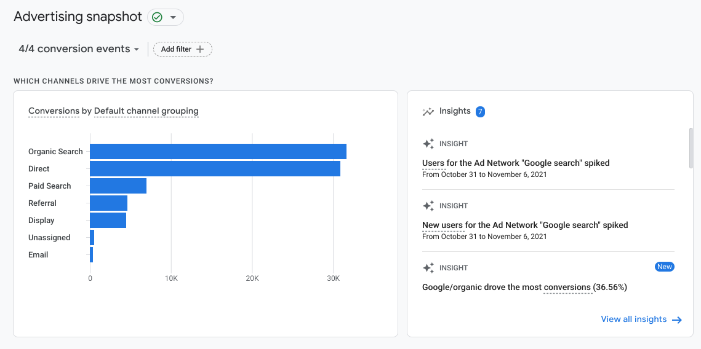

# Satisfacción garantizada: desarrolla estrategias de fidelización de clientes en línea

## Introducción a satisfacción garantizada: desarrolla estrategias de fidelización de clientes en línea

### Primeros pasos en el curso curso 7

#### Vídeo: VídeoIntroducción al curso 7

Satisfacción garantizada: desarrolla la fidelización de clientes en línea Hola de nuevo y ¡felicitaciones! Llegaste al
último curso de este programa. Llegar hasta aquí es un gran logro. Revisemos los temas aprendidos hasta aquí. Si seguiste el
certificado en orden, primero aprendiste las bases del comercio electrónico y marketing digital. Luego viste los conceptos
del marketing digital: marketing y publicidad en redes sociales, marketing por correo electrónico y analítica de marketing y
herramientas de práctica. Luego completaste el primero de los dos cursos de comercio electrónico, donde aprendiste a vender
en línea y crear una tienda comercio electrónico. ¿Qué sigue? Este curso cubre tres temas. Primero, verás conceptos
relacionados con la fidelidad y retención de clientes. Luego aprenderás más sobre herramientas de analítica de comercio
electrónico y cómo se aplican a las tiendas. Finalmente, te enfocarás en desarrollar habilidades y técnicas para solicitar
trabajo. Completarás un proyecto práctico para mostrar tu conocimiento de comercio electrónico y marketing digital. Primero,
quiero presentarme. Mi nombre es Mike. Soy Gerente de Desarrollo Profesional de Rendimiento Global en Google. Un título
largo, pero significa que trabajo con equipos de ventas y productos como Google para crear estrategias educativas para que
los equipos de ventas y publicidad usen estas soluciones con éxito y alcancen sus objetivos. Estando en Google, me asocié
con marcas, agencias y empresas tanto pequeñas como grandes. Ayudé a desarrollar sus estrategias publicitarias, a resolver
problemas y optimizar sus campañas para lograr sus objetivos de marketing y negocio. Mi experiencia en este sector me trajo
hasta aquí. Espero que estés listo/a para comenzar. Empecemos conociendo el trabajo que harás en la primera sección del
curso.

### Fidelidad del cliente y recompensas

#### Te damos la bienvenida a la semana 1 curso 7

Es hora de repasar. Si seguiste el curso en orden, recordarás el rol que juega la fidelidad en marketing y comercio
electrónico. Como recordatorio, Fidelidad es la última etapa del embudo de marketing, después de Conciencia, Consideración y
Conversión. En la etapa de Fidelidad, las/los clientes se repiten y se convierten en defensores de la marca, e idealmente,
en la voz de la marca. Aquí repasarás cómo se crea la fidelidad en un negocio de comercio electrónico, verás estrategias y
tácticas de fidelidad, como programas de recompensas y remarketing dinámico. Y aprenderás técnicas para desarrollar las
relaciones con tus clientes. Espero que te entusiasme tanto como a mí. Empecemos.

#### Introducción a la fidelidad del cliente

¿Qué se te viene a la mente al pensar en fidelidad? Quizás una mascota, o el compromiso con tu equipo deportivo favorito, o
una relación con alguien en tu vida. Sea lo que sea, seguramente involucre una sensación fuerte de apoyo o lealtad.
Demostramos fidelidad al formar un apego emocional a alguien o algo. En las relaciones, la fidelidad se basa en la
confianza. Se ve fomentada por un sentido de pertenencia y comunidad y motiva que las personas se mantengan conectadas. En
el comercio electrónico, la fidelidad también se crea así. Como repaso, Fidelidad es la última etapa del embudo de
marketing. En esta etapa las/los clientes se convierten en clientes regulares y defensores de la marca. La fidelidad se basa
en la confianza que tienen las/los clientes en un negocio. Cuando sienten pertenencia y conexión con ese negocio, su
fidelidad se refuerza. Veamos algunas formas de crear fidelidad. Quizás recuerdes aprender sobre estas estrategias
previamente en el programa. Pero ahora analizaremos cómo se aplican al comercio electrónico. Primero, hablemos sobre crear
confianza. En comercio electrónico puedes crear confianza al garantizar ofrecer productos de calidad que cumplan con las
necesidades de tus clientes. Una garantía de calidad, una generosa política de devoluciones, y ofrecer envío y devolución
sin costo pueden ayudar a crear confianza al eliminar la preocupación de tus clientes sobre si el producto será el adecuado.
Para generar confianza, debes brindar servicio al cliente de calidad en todo su recorrido, incluso después de que haya
completado la compra. Otra forma importante de crear confianza es proteger la información financiera y personal de tus
clientes. Tus clientes tienen que saber que mantendrás su información confidencial y segura. Puede ser que tengas que
agregar una insignia o un sello de confianza en la página de compra y garantizar que no compartirás su correo electrónico
con otros. ¿Por qué es importante? Cuando las/los clientes confían en un negocio, es más probable que sean fieles. Tener
clientes fieles es la base de una marca fuerte. Hablemos sobre crear fidelidad mediante el sentido de comunidad y
pertenencia. Si las/los clientes sienten una conexión con el negocio, es más probable que se vuelvan fieles. En el comercio
electrónico, puedes crear un sentido de comunidad en línea al interactuar con tus clientes en las redes sociales. También
puedes incentivarlos a compartir su experiencia mediante contenido generado por usuarios/as, como escribir reseñas de
productos, subir fotos o videos, participar en la página de preguntas y respuestas de un producto o unirse a un foro.
También puedes crear una comunidad compartiendo la historia detrás de tu marca y demostrando cómo tus valores están
alineados con los de tus clientes. Según las investigaciones, el 77% de los/las consumidores/as le compran a marcas que
comparten sus valores. Quieren sentirse bien con su compra. Por ejemplo, conectarse con los valores de tus clientes podría
ser compartir una pasión por la naturaleza, cuidar el medio ambiente, o buscar un cambio en la percepción de la belleza.
Otra forma de conectar es donar parte de las ventas a comunidades necesitadas. Por ejemplo, una empresa de ropa podría donar
un par de calcetines a un refugio de indigentes cada vez que alguien hace una compra en su sitio. Un programa así no solo
demuestra sus valores en acción, sino que también involucra a sus clientes en hacer el bien. Por último, puedes crear
fidelidad facilitando que tus clientes se mantengan conectados. Una forma de hacerlo es mediante una suscripción a los
productos que tus clientes compran regularmente como afeitadoras, vitaminas, o tinta de impresora. Es una buena idea
permitirles elegir cada cuánto quieren recibir el pedido y facilitar que puedan cancelar la suscripción para que no se
sientan atrapados/as. Otro modo de conexión es a través del remarketing dinámico, que les muestra anuncios a tus visitantes
anteriores con los productos y servicios que vieron en tu sitio. Como estos anuncios se adaptan a tus clientes, crean una
experiencia personalizada enfocada en los productos o servicios por los que ya se interesaron. El marketing por correo
electrónico es otra forma de conectar con clientes. Te da la oportunidad de ofrecer contenido valioso basado en sus
intereses. Puedes usar datos para personalizar tu campaña de correo electrónico con un correo que les recuerde que
abandonaron su carrito, o sugerir productos relacionados a otro que un/a cliente ya compró. Puedes usar el correo como un
recordatorio útil, para recordarles cuándo volver a comprar o girar el lado del colchón que compraron. Otra forma es a
través de un programa de recompensas, o programa de fidelización, que crea incentivos para que las/los clientes regresen.
Aprenderás más sobre los programas de recompensas luego. Crear fidelidad toma tiempo, cuando un negocio demuestra interés
por sus clientes. Puedes hacerlo al crear confianza, sentido de comunidad, y facilitar que tus clientes estén conectados.
Aunque Fidelidad sea la última etapa del embudo de marketing, es una de las oportunidades más valiosas para que una empresa
crezca. Las/los clientes felices regresarán y hablarán de tu negocio con otra gente. A continuación, aprenderás más sobre
estrategias para crear fidelidad en el comercio electrónico. Nos vemos pronto.

#### Programas de recompensas

Una buena estrategia de fidelización está diseñada para crear clientes regulares y aumentar las tasas de conversión. Una de
las estretegias de fidelización más efectivas es los programas de recompensas. También conocido como programa de fidelidad,
el programa de recompensas es un método de marketing diseñado para crear fidelidad de clientes a través de incentivos para
que las/los clientes regresan. Estos incentivos pueden incluir, entre otros, productos gratis, envío gratuito, descuentos,
cupones, o incluso la devolución del dinero de alguna compra. Antes de hablar de programas de fidelidad comunes, analicemos
dónde podrían encontrarlos las/los clientes de comercio electrónico. Ya que es beneficioso para las empresas lograr que sus
clientes regresen para vender más, dependerá de ellas hacer el proceso de inscripción de la forma más simple posible. Hay
dos formas sencillas para que los negocios de comercio electrónico motiven a sus clientes a inscribirse en los programas de
recompensas. La primera, los mensajes emergentes que aparecen en la pantalla de las/los clientes apenas visitan un sitio
web. Generalmente, ofrecen incentivos solo por registrarse e ingresar su dirección de correo electrónico. El segundo método
de inscripción al programa de recompensas llega al final del recorrido de compra en línea. Este método es más sutil. Al
completar la compra, las/los clientes pueden elegir inscribirse al programa de recompensas y recibir ofertas en el futuro.
Es común que las empresas inscriban a sus clientes automáticamente en el programa de recompensas sin costo alguno. En estos
casos, la/el cliente debe autoeliminarse del programa. Un beneficio de la inscripción automática es que ayuda a la marca a
crear una mayor base de clientes rápidamente. Aunque esto podría debilitar la confianza en la marca ya que sus clientes
podrían pensar que se hizo de forma engañosa. Ahora que aprendiste sobre el programa de recompensas y el proceso de
inscripción, veamos los diferentes tipos. En el comercio electrónico, los programas de recompensas más comunes son los
programas de puntos, los programas basados en el gasto, los programas basados en niveles y las suscripciones. Existen otros
tipos de programas de recompensa, pero, por ahora, analicemos cada uno de estos. El modelo de puntos es un programa de
recompensas que les ofrece puntos a las/los clientes, que son equivalentes a determinado valor monetario que gastaron en
varias compras. Estos puntos pueden canjearse por un incentivo cuando se llega a determinada cantidad. Por ejemplo, una
tienda de comercio electrónico de utensilios de cocina otorga un punto por cada dólar que gasta cada cliente. Cuando se
alcanzan los 100 puntos, la tienda premia a su cliente con un bol gratis. Luego, están los programas basados en gastos. Este
modelo es un programa que les ofrece a sus clientes incentivos basados en el monto gastado en una sola compra. Son similares
a los programas basados en puntos ya que fomentan llegar a cierto objetivo de gasto para obtener el incentivo. Aun así,
estos programas se basan en obtener un mayor valor a corto plazo. Por ejemplo, un negocio en línea puede ofrecer envío
gratuito en compras de más de 100 dólares. Alternativamente, el modelo basado en niveles le permite a las/los clientes
ascender a nuevos niveles basándose en el monto de dinero que gastan a lo largo del tiempo. Cuanto más dinero gastan, mayor
será el nivel al que accedan y se les ofrecerán mejores beneficios e incentivos. Por ejemplo, una empresa podría ofrecerles
a tres clientes, tres niveles. Bronce si gastan menos de 50 dólares, Plata si gastan entre 50 y 100 dólares, y Oro si gastan
más de 100 dólares. Con cada rango de compra, las/los clientes recibirán mejores ofertas de recompensas. Por último, tenemos
el programa de recompensas por suscripción. A diferencia de los otros programas mencionados, este modelo requiere que
las/los clientes hagan un pago periódico para recibir un incentivo exclusivo. Por ejemplo, una tienda de ropa en línea puede
ofrecerles entrega en un día a quienes paguen una cuota anual de 20 dólares. Aquellos clientes que no pagan por este
programa, deberán esperar una semana para que llegue su envío. Si el programa de recompensas es de pago, como el de
suscripción, las empresas nunca deberán automáticamente inscribir clientes en un servicio no deseado. Las empresas deberán
incluir mensajería separada para permitirles explorar el programa por su cuenta, cuando lo deseen. A esta altura, estoy
seguro de que el concepto de programas de recompensas parece simple, ¿no? Si el negocio ofrece algunos incentivos, sus
clientes regresarán para comprar más. Sin embargo, esto es solo lo básico. Debe haber más consideración en la creación de un
programa de recompensas exitoso que no solo esté enfocado en recordatorios de que tu empresa existe. Es decir, las
promociones a corto plazo solas no siempre terminan en fidelidad. Incluso si tu empresa ofrece grandes incentivos en sus
programas de recompensas, puede haber otras empresas con mejores precios en productos similares. Esto puede causar que
las/los clientes que consideras como "fieles" cambien en dónde eligen comprar sin dudarlo. Para crear un programa de
recompensas de comercio electrónico más exitoso y efectivo, los negocios deben considerar las siguientes preguntas. Primero,
¿cómo podemos personalizar la experiencia de los programas de recompensas? La personalización se trata de crear una
experiencia a la medida de una persona. Muchos negocios lo logran a través de tácticas como incluir el nombre de su cliente
en comunicaciones e interacciones programadas. Esto hace que las/los clientes se sientan valorados. Por ejemplo, a mí me
gusta correr. Y soy miembro de varios programas de recompensas de diferentes marcas deportivas. Si dos de estas marcas me
envían correos sobre sus zapatillas nuevas, será más probable que abra el que dice “Hola Mike, mira nuestro nuevo
lanzamiento”, y no el que dice “Mira nuestras nuevas zapatillas” ya que el primero me resulta más personal. Otra táctica
consiste en darles incentivos a ciertos grupos de clientes según sus hábitos de compra. Por ejemplo, si los datos dicen que
un/a cliente espera que haya envío gratuito antes de comprar, enviarles una oferta con envío gratis sin razón alguna, podría
hacer que se animen a comprar. Esto también los incentivará a seguir comprando. Segundo, ¿cómo puede un programa de
recompensas ser deseable y alcanzable? Los programas de recompensas funcionan mejor con ofertas lo suficientemente
atractivas para que las/los clientes quieran participar, pero que también les resulte accesibles. Por ejemplo, un programa
de recompensas en el que un/a cliente debe gastar 100 dólares para obtener un pequeño descuento del 5% en su próxima compra,
no es tan deseable como un programa de recompensas en el que deben gastar 100 dólares para obtener un 25% de descuento en su
próxima compra. Encontrar el equilibrio correcto puede ser difícil, pero es necesario para atraer clientes que regresan.
Tercero, pregúntate, ¿cómo puedo crear una comunidad con nuestra base de clientes? Si bien algunos/as clientes buscan
productos para comprar, otros/as disfrutan sentir que pertenecen a algo más grande. Promover espacios comunitarios puede ser
ideal para asegurarte la fidelidad de aquellos/as clientes. Por ejemplo, una empresa de libros podría solo vender novelas.
Pero luego de que un/a cliente compra un libro será difícil predecir si volverá después de terminar de leerlo. En cambio,
podrían crear un club de lectura en línea como parte del programa. Así, sus clientes encontrarán una comunidad con ideas e
intereses similares a los suyos por los libros. Cada vez que compren una nueva novela, lo harán en la librería a la que
pertenece el programa. Tener esto en cuenta es un gran comienzo para crear una base de clientes fieles que confían en ti y
valoran tu negocio. Sigue avanzando para aprender más sobre cómo crear y retener clientes fieles.

#### Remarketing dinámico

¿Alguna vez estabas comprando en línea y te distrajiste y olvidaste terminar lo que empezaste? ¿O te gustó un artículo que
viste pero no lo suficiente para comprarlo? El remarketing dinámico con Google Ads sirve para volver a involucrar a clientes
que vieron productos en tu sitio previamente. Están familiarizados con tu tienda y consideran comprar un producto, pero por
alguna razón aún no completaron la compra. Quizás necesiten más tiempo para decidir o que les recuerden que tu oferta es
demasiado buena para que se la pierdan. El remarketing dinámico te ayuda a recuperar estos/as clientes y generar fidelidad a
través de anuncios con un mensaje personalizado que se adapta a tu público. Este tipo de remarketing atrae a visitantes que
ya pensaron en comprar en tu tienda. Alienta a que estos/as visitantes regresen y completen su compra. El remarketing
dinámico muestra anuncios de productos ya vistos o productos similares por los que podrían interesarse. El motor de
recomendación de productos de Google Ads determina el mejor mix de productos para cada anuncio. Resulta en una experiencia
personalizada que presenta productos según su popularidad y lo que vieron en tu sitio. Mostrar productos similares a otros
ya vistos por tus clientes, ayuda a descubrir productos que no habrían visto de otra forma. Quizás el producto que vieron
antes no era exactamente lo que buscaban pero uno similar es lo que querían. Imaginemos una joyería en línea, por ejemplo.
Con clientes considerando hacer una gran compra. Quizás necesiten más tiempo para decidir. Quizás quieran comparar precios
con la mejor calidad de productos y ofertas. Con el remarketing dinámico, la joyería muestra anuncios de productos que sus
clientes vieron en su sitio, o similares que podrían gustarles. Conectándose así con las/los clientes, la joyería mantiene
su marca cerca de sus clientes mientras avanzan en su proceso de decisión de compra. El remarketing dinámico es un modo
eficaz de conectarte con clientes porque ya están interesados/as en tus productos y motivados/as para comprar. Quizás ya
compraron en tu tienda en el pasado. El remarketing dinámico te permite retener a estos/as clientes y animarlos/as a que
mantengan la relación con tu negocio. Es una forma para que una tienda de comercio electrónico genere fidelidad y se
mantenga conectada con sus clientes a lo largo del tiempo. A continuación, aprenderás más sobre cómo crear relaciones con
tus clientes. Nos vemos ahí.

#### Caso de éxito: Cómo Wayfair utiliza el marketing por correo electrónico para la personalización

El marketing por correo electrónico es una forma eficaz de conectarse con las/los clientes para fidelizarlos. Las empresas
pueden utilizar el marketing por correo electrónico tanto para atraer a nuevos/as clientes como para mantener el contacto
con los/las ya existentes. En este caso de éxito, descubrirás cómo el negocio de comercio electrónico
<https://www.wayfair.com/>, con sede en Boston, Massachusetts, utiliza el marketing por correo electrónico para compartir
información, impulsar las ventas y fidelizar a sus clientes. También aprenderás cómo Wayfair utiliza el marketing por correo
electrónico para la personalización, que es la práctica de ofrecer una experiencia personalizada a cada cliente.

Contexto de la empresa

Niraj Shah y Steve Conine son dos viejos amigos que fundaron la empresa en línea en 2002, con el objetivo de ofrecer a sus
clientes una selección de productos mayor de la que cabría en una tienda física. La empresa que crearon estaba integrada por
un conjunto de más de 200 tiendas de comercio electrónico, cada una de las cuales vendía distintas categorías de productos.
En 2011, la empresa combinó todos estos sitios para crear wayfair.com.

Wayfair es ahora uno de los mayores negocios de artículos para el hogar del mundo. Su objetivo es ayudar a todas las
personas, no importa dónde estén, a crear una sensación de hogar propio, en función de quiénes son, qué necesitan y qué
valoran.

El desafío

El marketing por correo electrónico es el segundo canal de marketing más utilizado por Wayfair y uno de sus principales
motores de crecimiento. .

El objetivo de la firma es proporcionar a cada cliente el contenido que necesita, en el momento justo de su proceso de
compra. Dado que las/los clientes se encuentran en distintos puntos de sus procesos de compra y en distintas etapas del
embudo de marketing, necesitan diferentes tipos de contenidos, en distintos momentos, por lo cual enviar los mismos correos
electrónicos a todos/as ellos/ellas no representaría una experiencia personalizada.

Algunas personas pueden estar dudando sobre si comprar muebles en línea o comprarle a una empresa que no conocen. Están en
la etapa de Conciencia del embudo de marketing.

Otras pueden estar investigando los productos, pero aún no están listas para comprar. Están en la etapa de Consideración del
embudo.

Otro grupo de clientes puede haber hecho una compra recientemente, pero se dan cuenta de que necesitan un accesorio que
combine con el producto que acaban de comprar. Han superado la etapa de Conversión y han llegado a la etapa de Fidelidad, en
la que deciden convertirse en clientes regulares.

Como cada grupo de clientes se encuentra en una etapa diferente del embudo de marketing, Wayfair personaliza sus campañas de
correo electrónico para adaptarlas a las necesidades de cada uno de ellos.

El enfoque

Las campañas de marketing por correo electrónico de Wayfair procuran entregar el contenido que las/los clientes desean, en
el momento en el que quieren recibirlo. Así:

Un/a cliente nuevo/a podría recibir un correo electrónico de bienvenida en el que la empresa se presenta y se destacan
diversas categorías de productos que podrían interesarle.

Un/a cliente que visitó recientemente el sitio podría recibir un correo electrónico con varios productos o categorías que
haya visto mientras navegaba por él.

Un/a cliente que acaba de realizar una compra podría recibir un correo electrónico con productos o accesorios relacionados.
Por ejemplo, si compró una alfombra, se le podría recomendar una almohadilla que vaya debajo de esa misma alfombra.

Un/a cliente que hace tiempo que no visita el sitio podría recibir un correo electrónico con contenido inspirador e ideas
que lo/la ayuden a crear un espacio en el que se sienta como en casa.

A continuación, se muestra un ejemplo del contenido enviado a nuevos/as suscriptores/as de correo electrónico. El asunto del
correo es ¡Te damos la bienvenida a casa! El cuerpo del mensaje presenta a Wayfair y facilita la compra de una variedad de
productos de la empresa. Los/las destinatarios/as simplemente tienen que hacer clic en Comenzar a comprar.

Los resultados

Mediante el aprendizaje automático, la empresa prueba formas de mejorar y personalizar las recomendaciones de productos en
sus correos electrónicos. Este enfoque le permite a Wayfair evaluar qué funciona y qué no, y hacer cambios en función de los
resultados.

La recomendación personalizada de productos resultó exitosa cuando estuvo dirigida a clientes que habían comprado o visto
productos recientemente. Sin embargo, cuanto más tiempo pasaba desde la última visita al sitio, menos eficaces resultaban
estos correos, por lo cual Wayfair entendió que tanto el contenido como el momento en el que se enviaban los mensajes eran
fundamentales para su éxito.

La empresa también realizó pruebas que confirmaron que las líneas de asunto marcan una gran diferencia en sus campañas de
marketing por correo electrónico. Las líneas de asunto que obtuvieron mejores resultados fueron las que más se ajustaban al
contenido de los correos. En el caso de los correos electrónicos promocionales, resultó ser muy eficiente mencionar la
promoción o el descuento ya desde el asunto. Por ejemplo, si el cuerpo de un correo electrónico contenía la siguiente
oferta, la línea de asunto podía ser Ahorra US$20 en tu próxima compra de US$100 o más en Wayfair.

La empresa también descubrió que un proceso de compra y de entrega fluido y agradable tiene mayor impacto que cualquier cosa
que pueda incluir en sus correos electrónicos. Por eso, a las/los clientes que no tuvieron una buena experiencia con su
compra, Wayfair les envía un correo ofreciéndoles un descuento en su próxima compra a modo de compensación. Los resultados
de esta campaña de correo electrónico son muy satisfactorios, ya que cerca del 50% de estos/as clientes vuelven a realizar
otra compra.

Conclusión

Como muestra la historia de Wayfair, ofrecer una experiencia personalizada a las/los clientes puede tener un impacto
significativo a la hora de lograr una conexión y conseguir su fidelidad. A medida que adquieras más experiencia en el campo
del marketing digital y el comercio electrónico, descubrirás que poner a prueba tus ideas, experimentar qué funciona y qué
no, y aplicar los resultados son las claves para perfeccionar tu estrategia de marketing.

### Desarrolla las capacidades de gestión de las relaciones con las/los clientes

#### Métodos de seguimiento posteriores a la compra

Ahora discutiremos métodos para hacer un seguimiento de tus clientes y cómo hacerlo de forma eficaz. Esto se llama
comunicación posterior a la compra. Se define como toda interacción que las/los clientes tienen con una marca después de una
compra. Como clientes que regresan son una gran parte de las ventas de comercio electrónico, la comunicación posterior a la
compra se enfoca en las relaciones con clientes existentes. Es una forma eficiente de aumentar el tráfico a tu tienda en
línea. También ayuda a mantener a tu empresa en la mente de tus clientes y sacarle ventaja a tu competencia. La comunicación
posterior a la compra también puede hacer que tus clientes sientan que tomaron la decisión de compra correcta. Esto aumenta
la fidelidad de marca y el apoyo de clientes. ¿Alguna vez compraste en línea y sentiste que fue un error al completar la
transacción? Esa sensación de arrepentimiento se llama “remordimiento del comprador”. Según un informe, más del 50% de las
personas encuestadas compartió haber experimentado el remordimiento del comprador. La comunicación posterior a la compra
alivia esa sensación al reforzar los sentimientos positivos de la experiencia. Veamos cómo. Primero, existen métodos de
comunicación posterior a la compra. Empezarás con correos electrónicos, redes sociales, y correo directo. Iniciaremos por el
método más fácil para llegar a tu base de clientes, los correos electrónicos son muy populares. Esto se debe a la variedad
de aspectos que puedes incluir en los correos. Aquí hay algunos ejemplos y tipos. Existen correos de agradecimiento, que son
cortos y agradables, sirven para hacer seguimiento y muestran tu aprecio por su compra. Estos correos hacen que las/los
clientes sientan que la empresa realmente aprecia que compren. También existen correos de solicitud de reseña. Básicamente,
estos correos tienen dos tareas. Brindan los datos necesarios de la experiencia de tus clientes con tu marca, y en caso de
ser positiva, le aporta un gran respaldo a uno de tus productos. Otro tipo de correo es la encuesta de satisfacción de
clientes. Por lo general, le permite a las/los clientes calificar productos mediante un sistema de escala. Estas encuestas
miden cómo los productos y servicios cumplen o superan las expectativas de las/los clientes. Por último, una empresa puede
enviar correos de reabastecimiento. Estos se usan para animar a las/los clientes a repetir una compra cuando los artículos
están a punto de agotarse. Son muy eficaces. Por ejemplo, si un/a cliente está por quedarse sin su champú favorito que
compró en línea hace dos meses, quizás se olvide de volver a comprarlo. Pero si recibe un mensaje oportuno, recordándole que
compre otra botella, será más probable que lo haga en ese momento. Ya vimos los correos electrónicos. Ahora analizaremos el
siguiente método de comunicación, las redes sociales. Las redes sociales son una gran manera de llegar a tus clientes. Con
la popularidad de los hashtags en varios sitios, siempre puedes ver las conversaciones en las que participa tu marca.
Imaginemos que un fanático del béisbol crea una publicación en redes sociales con una foto usando un sombrero nuevo que
acaba de comprar en línea a una empresa de ropa deportiva, llamada Johnny Jonnie Jon. En la publicación, etiqueta a la
empresa. Si la empresa sigue los hashtags y menciones, podrá verlo rápidamente. La empresa puede responderle directamente al
cliente y compartir su felicidad por el cliente satisfecho con su compra. Además, con el permiso del cliente, podrían volver
a publicar la foto en su página. Esto podría generar aún más interés en la marca de parte de quienes siguen a la empresa o
al cliente. El último método de comunicación posterior a la compra es el correo directo. Enviar cartas o información de la
marca por correo, precede a los otros métodos mencionados. Sin embargo, el correo directo puede tener un encanto clásico,
incomparable con los métodos digitales. Esto es porque algunos/as clientes creen que eso demuestra la consideración y el
interés de la empresa. Este método puede consumir más tiempo, pero algunas personas lo aprecian mucho. Sea cual sea el
método que elijas, querrás recordar algunos consejos para que sea eficiente y haga que tus clientes regresen. Primero,
siempre personaliza la experiencia. Querrás tener una relación cercana con tus clientes. Salúdalos por sus nombres, en vez
de usar términos formales como “cliente”. También le puedes agregar un toque personal a la relación entre clientes y negocio
comunicándote con ellos/as en días importantes, como en su cumpleaños. Modera tu comunicación. Lo admito, como comprador en
línea, me frustra cuando recibo muchos mensajes de marcas. En su lugar, modera el ritmo de tu comunicación para no abrumar a
tus clientes con avalanchas de mensajes. El último consejo es ofrecerles incentivos de compra a tus clientes. Ofrecer
descuentos o dinero gratis puede ser una gran forma de animarlos/las a que regresen a tu tienda en línea. No solo les estás
comunicando que quieres que compren, sino que también les dices que aprecias sus compras. A medida que creas relaciones con
tus clientes, tu comunicación debe estar equilibrada entre lo promocional y lo interactivo. Quieres que tu público sienta tu
autenticidad y sinceridad, mientras haces crecer a tu empresa. Buena suerte.

#### Encuesta a tus clientes y formula preguntas eficientes

Al encuestar a tus clientes, obtienes los comentarios que necesitas. Te ayuda a entender sus necesidades e intereses. En
este video veremos las encuestas a clientes y cómo formular preguntas efectivas para obtener información relevante. Una
encuesta de clientes mide si los productos y servicios que brinda un negocio cumplen o superan las expectativas de sus
clientes. Como profesional de comercio electrónico, estas encuestas son valiosas porque contribuyen al crecimiento de tu
negocio. Las encuestas te ayudan a conocer datos demográficos como la edad, dónde viven y trabajan tus clientes, sus
intereses y pasatiempos, o los problemas que tienen con su experiencia de compra. Estos datos te ayudan a saber quiénes son
tus clientes. Al analizar los resultados, podrás llegar a los grupos de clientes y comunicarte mejor con ellos basándote en
esa información. Hay dos categorías de encuestas. Una previa a la compra, que se hace antes de la compra, y otra posterior a
la compra, que se hace después de que un/a cliente compra. Antes de crear tu encuesta, deberás definir tu objetivo. Recrear
preguntas sin un claro propósito crea una gran cantidad de datos aleatorios. Para evitarlo, pregúntate: ¿qué quiero conocer
de mis clientes? Podría ser, ¿cómo puedo mejorar mi tasa de retención de clientes? ¿Qué partes de mi sitio web debería
mejorar? Cuando definas tus objetivos, crea preguntas claras y concisas para tu encuesta. Existen muchos consejos para
hacerlo. Aquí hay algunos. Primero, evita hacer preguntas capciosas. Estas preguntas llevan a las personas a responder de
cierta manera. Por ejemplo, preguntar, “te gusta nuestro sitio web, ¿verdad?”, presiona a las/los clientes a responder que
sí, solo por la forma en la que se formuló de la pregunta. Estas preguntas pueden resultar en datos sesgados. En su lugar,
haz preguntas abiertas como: en una escala de 1 a 5, califica tu experiencia de compra hoy. Luego sigue con un formulario
abierto en el que puedan explicar su respuesta. Segundo, evita dar opciones de respuestas que se superpongan. Esto puede
causar confusión si hay dos posibles respuestas correctas. Por ejemplo, si alguien de 35 años está respondiendo a: “¿cuántos
años tienes?”, y las únicas opciones de respuesta son, a) Entre 25 y 35 años, o b) Entre 35 y 45 años, pueden perderse y no
saber cuál es la opción correcta para ellos/as. En su lugar, escribe opciones como a) Entre 25 y 34 años, b) Entre 35 y 44
años. Así, la única respuesta correcta es b. Tercero, sé respetuoso/a e inclusivo/a. Como especialista en comercio
electrónico, hay que saber que hacer preguntas personales es delicado y representa cierto desafío. Sé consciente sobre las
preguntas y encuestas específicas, y cómo las presentas. Y, por último, recuerda usar el tono de voz de tu marca. Esto se
refiere a cómo tu empresa elige expresarse. Por ejemplo, imagina una tienda de ropa infantil que tiene una marca divertida y
aventurera. Si crea una encuesta usando un saludo formal como “Estimado señor o señora, tómese un momento para completar
nuestra encuesta de clientes”, la seriedad del tono puede confundir a sus clientes. Preferirán usar algo como: “¡Hola!
¿Puedes completar nuestra encuesta de clientes?” ¿Notas la diferencia? La segunda crea un tono acogedor que sus clientes
reconocen y aprecian. Ten esto en cuenta al crear preguntas. Una vez que estés listo, comienza a crearlas. Estas variarán
según tu sector. La encuesta previa a la compra seguramente incluya preguntas que busquen entender quiénes son sus clientes
y qué quieren comprar. Por ejemplo, “¿Para quién estás comprando?”, o “¿Qué productos o categorías te interesan más?” La
encuesta posterior a la compra incluye preguntas que buscan comprender cómo fue la experiencia del cliente. Estas serán
preguntas como: ¿Qué podemos mejorar de la experiencia en nuestro sitio?”, o “¿Volverías a comprarnos en el futuro?” La
encuesta posterior a la compra puede incluir preguntas que hagan que las/los clientes brinden información personal. Esto te
ayudará a dirigirte a ellos/as en el futuro para que regresen a tu sitio. Incluirán preguntas para promocionar eventos como,
“¿Cuándo es tu cumpleaños?” o preguntas relacionadas con la publicidad de marca, como, “En una escala del 1 al 10, ¿qué
probabilidades hay de que le recomiendes la empresa a un amigo o amiga?” Después de escribir todas tus preguntas, completa
la siguiente lista de verificación. ¿La redacción de esta pregunta es simple y fácil de entender? Las preguntas que tienen
cierta jerga podrían confundir a tus clientes, así que opta por usar un lenguaje simple. ¿Esta pregunta pide demasiada
información personal? Si es así, tus clientes podrían sentir que su privacidad está siendo invadida. Haz que la pregunta sea
más general. ¿Es esta pregunta demasiado compleja? Puede implicar muchas oraciones o pasos para completarla y hacer que las
personas abandonen la encuesta. Revisa los elementos que puedes eliminar antes de finalizar las preguntas. Por último, ¿esta
pregunta hace una suposición sobre mi cliente? Por ejemplo, si eres especialista de comercio electrónico de una tienda de
bolsos, ¿tus preguntas asumen que tus clientes se identifican como mujeres por la expresión que usaste? Si es así, cambia tu
pregunta a un tono más neutral. Al terminar, sube tu encuesta para que aparezca en vivo en tu sitio o envíala por correo
electrónico. Cuando tengas varias encuestas, usa los datos para crear tu lista de clientes y aplica los cambios a tus
experiencias de marketing o negocio. Diviértete creando preguntas de encuestas.

#### Actividad de ejemplo: Redacta una encuesta de satisfacción de clientes

Compara el ejemplo con tu encuesta de satisfacción de clientes. Revisa tu trabajo utilizando cada uno de los criterios del
ejemplo. ¿Qué hiciste bien? ¿En qué aspectos podrías mejorar? Utiliza tus respuestas a estas preguntas a modo de guía a
medida que avanzas en el curso.

Tu encuesta de satisfacción de clientes debe incluir:

Una o dos frases invitando a tus clientes a realizar la encuesta, redactadas con la voz de marca de la empresa.

Tres preguntas demográficas redactadas con sensibilidad, que sean inclusivas y relevantes para el objetivo de la encuesta.

Una escala de satisfacción que incluya al menos cinco criterios que deseas que tus clientes evalúen, junto con una gama de
respuestas.

Una pregunta NPS (puntuación neta de promotor) con términos que indiquen el valor de los números de la escala.

Dos preguntas abiertas breves y sencillas, que estén alineadas con el objetivo de la encuesta y animen a las/los clientes a
proporcionar una opinión sincera y reflexiva.

Todas las preguntas de la encuesta también deben revisarse y corregirse en función de la lista de verificación de preguntas
para encuestas a clientes.

#### Cómo proporcionar un excelente servicio al cliente

Hola. Antes de empezar, quiero compartirte una cita. Dice, “El trato cortés hará de un/a cliente un anuncio caminante”. Esto
lo expresó un famoso empresario estadounidense, James Cash Penney. Por supuesto, JC Penney no quiso decir literalmente que
tus clientes serían una herramienta oficial de promoción, sino que crear una gran experiencia de compra para tus clientes
hará que se sientan tan bien que optarán por volver a comprar en tu tienda. Incluso le recomendarán tu negocio a sus
conocidos. Globalmente, el 61% de consumidores/as ven como 'muy importante' el servicio al cliente. El servicio al cliente
superó recientemente al precio y al producto como el principal factor que distingue a las marcas al comprar. El servicio al
cliente se define como el asesoramiento y apoyo que una empresa brinda antes, durante, y después de una compra. Una gran
experiencia de compra incluye cómo una marca aborda el servicio al cliente. Con tanto énfasis en el servicio al cliente,
veremos formas de aplicar un buen servicio en tu tienda de comercio electrónico. Primero, deberás decidir el canal que
usarás para darle soporte a tus clientes. Aquí hay algunas opciones. El canal más común para muchas personas es el correo
electrónico. Los negocios de comercio electrónico suelen ofrecer una dirección de correo o un formulario de contacto en su
sitio web para solicitar ayuda. Google le pide a los negocios que publiquen sus correos claramente en sus sitios para poder
publicitar en Google Shopping. Puedes usar tu bandeja de entrada para comunicarte con tus clientes. Los correos sirven para
avisarles a tus clientes cuándo recibirán una respuesta. Indica tu tiempo de respuesta en la sección “contáctanos” de tu
sitio. Otro canal de servicio al cliente común es el chat en vivo. Es la tecnología que le permite a las/los clientes
comunicarse en tiempo real con el o la representante del negocio. Si un/a cliente tiene una pregunta sobre cualquier cosa,
podrá obtener una respuesta en solo un momento. Atención, este método suele usarse por grandes empresas con recursos y
presupuesto para poder responder durante todo el día. Los chatbots son un canal de servicio al cliente similar. Ofrecen una
tecnología de comunicación empresarial directa en el sitio web. A diferencia del chat en vivo, los chatbots son sistemas
programados que responden a preguntas comunes. Los chatbots son útiles porque dan una respuesta rápida. Aun así, no están
equipados para interacciones complejas, ya que solo ofrecen respuestas preprogramadas a preguntas específicas. El cuarto
canal de servicio al cliente es las redes sociales. Esta plataforma está en constante evolución. Con el rápido aumento de
popularidad durante la década pasada, está claro que las redes sociales llegaron para quedarse. Para estar al día, muchas
marcas empezaron a brindar servicio al cliente en plataformas como Twitter y Facebook. Si las marcas tienen sus propias
cuentas de redes sociales, tienen la opción de responder públicamente o en privado. Si eliges este camino, es mejor ofrecer
servicio al cliente en las plataformas de redes sociales en donde ya tienes presencia o en las que más usan tus clientes.
Esto ayudará a consolidar tus esfuerzos de comunicación. Lo bueno es que no tienes que limitarte a una sola plataforma de
servicio al cliente. Puedes ofrecer una estrategia de servicio al cliente multicanal, es decir, dar servicio al cliente en
múltiples canales. Si seguiste los cursos en orden, quizás recuerdes esta estrategia. Cuando se trata de dar servicio al
cliente de calidad, es importante interactuar de la forma en la que ellos/as quieran. Ya sea por los cuatro canales que
vimos u otros canales, como soporte telefónico o foros. Sin importar qué canales elijas, es importante recordar 4 aspectos
clave de servicio al cliente. Resuelve el problema rápido, resuélvelo con una interacción, brinda un servicio al cliente
amigable y realiza un seguimiento posterior para garantizar su satisfacción. Para entender estos aspectos, imaginemos a
Menal, que le encanta el color verde y compra un abrigo verde de la tienda en línea de Frosty Flossie Outerwear. Pero cuando
llega hay un problema. La tienda envió un abrigo azul en su lugar. Menal tiene la opción de elegir entre chatear en vivo con
un/a representante en el sitio web de la tienda. O puede buscar la dirección de correo que aparece en el sitio web. En su
lugar, crea una publicación en las redes sociales sobre el error y etiqueta a la empresa. Teniendo en mente los 4 aspectos
del servicio al cliente, la empresa responde a las pocas horas de haber recibido la notificación. Con un lenguaje amable, la
empresa reconoce el error y le ofrece comunicarse por privado para resolver el problema. Usando mensajes directos, la
empresa promete corregir el problema y le ofrece un descuento a Menal para su próxima compra. Una vez que el nuevo abrigo
fue entregado, la empresa puede comunicarse con Menal para ver si está satisfecha. Y así, el problema se resuelve y la
cliente está feliz de nuevo. Por supuesto, resolver las quejas es solo un aspecto de este servicio. Otro aspecto es
brindarles a las/los clientes toda la información necesaria para realizar una compra. Una forma de hacerlo es creando una
página en tu sitio web de preguntas frecuentes, o FAQ. Estas páginas son de gran ayuda para las preguntas que tus clientes
podrían tener con respecto a tu negocio, productos o servicios, políticas, procesos y más. Las páginas de FAQ son útiles
porque te permiten ahorrar tiempo con las preguntas generales que podrían tener tus clientes, generan confianza entre la
marca y sus clientes ya que estas páginas demuestran que tu empresa consideró varios escenarios, preguntas, y preocupaciones
comunes. Además, las páginas de FAQ pueden atraer más tráfico a tu sitio. Esto es por los fragmentos destacados de Google en
páginas de búsqueda. Cuando se busca una pregunta relacionada a una de tus FAQ, tu pregunta y respuesta se extraerá
automáticamente de tu página de FAQ indexada por Google. El servicio al cliente de calidad es importante para el éxito de
todo negocio, incluido para una tienda de comercio electrónico. Si bien quizás no termines trabajando en el área de servicio
al cliente, tu trabajo en comercio electrónico podría impactar en la experiencia del cliente. Conocer los problemas de tus
clientes y considerar sus comentarios puede ayudarte a mejorar su experiencia. Eso concluye la lección sobre brindar un
excelente servicio al cliente. A medida que avances, ten presentes las palabras de James Cash Penney y de las/los clientes.

#### Mide el nivel de satisfacción de tus clientes

La opinión que las/los clientes tienen de una empresa se suele basar en las experiencias que hayan tenido con ella y en sus
propios resultados personales. Las interacciones que las personas tienen con una empresa en línea, ya sean directas o
indirectas, pueden influir en su decisión de volver a comprar. Por eso es importante que las empresas de comercio
electrónico evalúen constantemente la satisfacción de sus clientes.

Medir la satisfacción del cliente implica realizar investigaciones para determinar el rendimiento de los productos o
servicios en función de cómo son percibidos por el público, lo cual puede ayudar a una empresa a mejorar su posicionamiento.
A continuación, se indican los pasos a seguir para medir la satisfacción de las/los clientes.

Define los objetivos

Antes de comenzar a medir la satisfacción de sus clientes, la empresa debe definir qué debe mejorar. La experiencia de
los/las compradores/as en una tienda en línea está compuesta por muchos pasos: la selección del artículo, el proceso de pago
y la entrega del producto. En cada uno de estos pasos algo puede salir mal, por lo que es importante ser específico/a al
pensar en el objetivo de la investigación.

En un curso anterior, aprendiste que los objetivos deben ser específicos, medibles, alcanzables, relevantes y de tiempo
limitado. Ten en cuenta esto cuando desarrolles tus objetivos.

Algunos ejemplos de objetivos son:

Reducir las redundancias y la fricción con las/los clientes.

Ofrecer opciones de autoservicio.

Sustituir a las/los representantes de ventas por agentes de servicio al cliente de comercio electrónico.

Tomarse en serio las reseñas de las/los clientes.

Resolver los problemas rápidamente.

Resolver los problemas mediante una sola interacción.

Asegurarse de que las/los representantes de servicio al cliente sean amables.

Ser capaz de realizar un seguimiento con la misma persona, en caso de ser necesario.

Ser capaz de grabar, imprimir y guardar una copia de cada interacción.

Hacer un seguimiento posterior con las/los clientes para asegurarse de que estén satisfechos/as.

Elige un tipo de encuesta de satisfacción de clientes

Como se mencionó en un video, existen muchos tipos de encuestas para conocer la opinión de las/los clientes sobre una
empresa. A continuación, se enumeran algunos tipos comunes de encuestas a clientes.

Encuesta de satisfacción de clientes (CSAT)

Las encuestas de satisfacción de clientes, o encuestas CSAT, se utilizan para medir la satisfacción de las/los clientes con
los productos o servicios. Para repasar la variedad de encuestas de satisfacción de clientes, consulta un la clase sobre las
encuestas de clientes.

Encuesta de puntuación neta de promotor (NPS)

Las encuestas de puntuación neta de promotor (NPS) consisten en una sola pregunta en la que se le pide a los/las
encuestados/as que califiquen la probabilidad de que le recomienden una empresa, producto o servicio a un amigo/a o colega
mediante una escala que va de 0, para nada probable, a 10, extremadamente probable. A diferencia de las encuestas CSAT
generales, que tienen como objetivo medir la satisfacción de clientes con un servicio o marca en particular, las encuestas
NPS pretenden medir la fidelidad hacia una empresa. Las puntuaciones se dividen en tres categorías:

Promotores/as: las personas que responden con una puntuación de 9 o 10. Se las considera entusiastas de la marca.

Pasivos/as: las personas que responden con una puntuación de 7 u 8. Están satisfechas, pero no son tan entusiastas como para
promocionar la marca.

Detractores/as: las personas que responden con una puntuación de 6  inferior. No están satisfechas y es poco probable que
vuelvan a comprarle a la empresa.

Para calcular la puntuación NPS, las empresas restan el porcentaje de detractores del porcentaje de promotores.

Por ejemplo, si el 15% de las personas son detractoras y el 60% promotoras, la puntuación global de NPS es del 45%.

Encuesta de usabilidad

En el caso de las empresas de comercio electrónico, la mayor parte de las compras se realizan a través de la tienda en
línea.

Las encuestas de usabilidad relacionan la satisfacción de las/los clientes con el sitio web de la empresa e identifican
cualquier problema que hayan tenido a lo largo de su proceso de compra.

Selecciona un medio de encuesta

Una vez que seleccionas un tipo de encuesta, tendrás que elegir un medio. Los diferentes medios de encuesta pueden incluir:

Encuestas realizadas desde la aplicación o el sitio.

Encuestas posteriores al servicio o a la compra.

Encuestas largas por correo electrónico.

Mediante los comentarios de sus clientes, la empresa puede conocer qué opinan sobre su marca, sus servicios o productos. Los
datos obtenidos a partir de estos comentarios pueden brindar información útil para mejorar la experiencia de compra.

Conclusiones clave

Las empresas deben esforzarse por mantener a sus clientes felices. Las compras realizadas por personas que compraron
previamente representan una gran parte de las ventas futuras, por lo cual los comentarios de sus clientes son muy
importantes. A partir de estos, ya sean  positivos o negativos, las marcas pueden tomar decisiones adecuadas y hacer crecer
su negocio de manera eficaz.

### Revisión: Introducción a satisfacción garantizada: desarrolla estrategias de fidelización de clientes en línea

#### Términos y definiciones del curso 7, semana 1

Chat en vivo: Una tecnología de servicio al cliente que permite a las personas comunicarse en tiempo real con un/a
representante comercial.

Chatbot: Sistema programado que responde a las preguntas comunes de clientes y/o suscriptores/as.

Comunicación posterior a la compra: Cualquier interacción directa que las/los clientes tienen con una marca después de
realizar una compra.

Correos electrónicos de reabastecimiento: Correos electrónicos utilizados para incitar a las/los clientes a que repitan la
compra cuando los artículos adquiridos previamente están a punto de agotarse.

Encuesta de NPS: Relevamiento de una sola pregunta que le pide a los/las encuestados/as que califiquen en una escala de cero
a diez la probabilidad de recomendación de una empresa, producto o servicio a un/a amigo/a o colega.

Encuesta de satisfacción del cliente (CSAT): Herramienta que mide cómo los productos y servicios suministrados por una
empresa cumplen o superan las expectativas de sus clientes.

Encuesta de usabilidad: Encuesta que evalúa la satisfacción de las/los clientes con el sitio web de una empresa e identifica
cualquier problema que las personas puedan experimentar a lo largo del recorrido de compras.

Fragmento destacado: Cuadro especial que muestra información sobre una búsqueda en la página de resultados.

Modelo basado en el gasto: Programa de recompensas que ofrece a las/los clientes incentivos basados en una cantidad gastada
durante una sola compra.

Modelo basado en niveles: Programa de recompensas que ofrece a las/los clientes incentivos basados en la cantidad de dinero
destinada a una sola compra.

Modelo de puntos: Programa de recompensas que ofrece a las/los clientes un punto equivalente por un valor monetario
determinado gastado en el transcurso de varias compras.

Modelo de suscripción: Programa de recompensas que requiere que las/los clientes realicen un pago recurrente para recibir un
incentivo exclusivo.

Preguntas frecuentes (FAQ): Sección en un sitio web que proporciona respuestas a las preguntas que las/los clientes pueden
tener con respecto a un negocio, sus productos o servicios, políticas, procesos y más.

Programa de recompensas: estrategia de marketing diseñada por una marca para fidelizar a sus clientes al proporcionarles
incentivos para que la continúen comprando.

Remarketing dinámico: Proceso que permite a una empresa mostrar anuncios a visitantes anteriores que contienen productos y
servicios que vieron en el sitio de la empresa.

Servicio al cliente: Asesoramiento y apoyo que una empresa brinda a sus clientes antes, durante y después de una compra.

Servicio al cliente multicanal: Proporcionar atención al/a cliente a través de múltiples canales.

## Analiza las tendencias de una tienda en línea

### Aprende acerca de las herramientas de análisis de comercio electrónico

#### Te damos la bienvenida a la semana 2 curso 7

Hola. Hasta ahora aprendiste los conceptos básicos de vender en línea, incluyendo cómo crear y actualizar una tienda
comercio electrónico, cómo interactuar con las y los clientes en línea, y cómo fidelizarlos/as. Ahora, vamos a explorar cómo
los datos se relacionan con el comercio electrónico. Aprenderás a analizar datos para una tienda de comercio electrónico,
tomar decisiones basadas en ellos y mejorar el rendimiento de la tienda. Comenzarás aprendiendo los conceptos básicos de la
analítica del comercio electrónico: cómo establecer objetivos, evaluar métricas y medir el éxito. Luego, aprenderás a usar
la herramienta analítica de Shopify. Verás algunas de las métricas más importantes para monitorear el crecimiento general y
los ingresos de una tienda de comercio electrónico. Aprenderás a aplicar los conocimientos obtenidos a partir de esos datos
para mejorar el rendimiento de la tienda. También aprenderás a hacer un seguimiento de las métricas relacionadas al
rendimiento del producto y algunas formas para mejorarlo, basándote en los datos que descubras. Descubrí la importancia de
la analítica al trabajar en la estrategia de una marca para la temporada navideña. En el pasado, esta marca solo se había
enfocado en adquirir nuevos/as clientes. Sin embargo, al analizar los datos, descubrimos que las y los clientes recurrentes
tenían una tasa de conversión más alta en el valor del carrito que los nuevos/as. Esta información condujo a una estrategia
de remarketing exitosa y ayudó a lograr el objetivo anual. ¿Listo/a para aprender sobre la analítica de comercio
electrónico? Empecemos. Estaré aquí para guiarte.

#### Analiza datos para medir el éxito del comercio electrónico

¿Quieres aprender sobre el análisis de datos para una tienda de comercio electrónico? Aquí veremos algunos de los los
conceptos básicos de la analítica, incluyendo cómo establecer objetivos, evaluar métricas y medir el éxito. Ya aprendiste
sobre analítica, ahora vamos a considerar cómo aplicarla al comercio electrónico. La analítica de datos sirve para averiguar
qué funciona y qué no en una tienda de comercio electrónico. Sirve sin importar si la empresa es un negocio grande o
pequeño. Con los insights de la analítica, se puede determinar qué ventas y tácticas de marketing son las más efectivas.
También sirve para entender el comportamiento de las y los clientes. Estos insights ayudan a un negocio a descubrir qué
tácticas dan los mejores resultados. Estas son las áreas en que se debe invertir tiempo y dinero, porque brindarán el mayor
retorno de la inversión. Los datos que una empresa analiza pueden venir de varias fuentes. Por ejemplo, ya sabes de Google
Analytics. Muchas plataformas de comercio electrónico incorporan su propia analítica, El marketing por correo, las redes
sociales y otras herramientas, a veces, también. Se pueden reunir datos de otras fuentes, como encuestas a clientes, pruebas
A/B y mapas de calor, que verás más adelante. ¿Cómo se mide el éxito de un comercio electrónico con datos? Primero, se
establecen objetivos para cada área. Como ya aprendiste, estos deben ser SMART, es decir, específicos, medibles,
alcanzables, relevantes y temporales. Cada uno contribuye a lograr el objetivo final de éxito en el comercio electrónico. Al
establecer objetivos se eligen las métricas para medir el éxito de un negocio o una meta de marketing. Como ya aprendiste,
estas métricas son indicadores clave de rendimiento (KPI). Un KPI es una medida para evaluar qué tan exitoso es un negocio
para lograr un objetivo comercial o de marketing. Las métricas monitoreadas varían según los objetivos y los datos
acumulados. Es útil para las tiendas de comercio electrónico más nuevas comparar los resultados de sus métricas
trimestralmente. Un trimestre es un período de 3 meses del calendario financiero de una empresa. Cada año tiene 4
trimestres. Comparar los resultados con el periodo anterior ayuda a una empresa a determinar si las métricas están
mejorando. Las empresas que venden productos costosos, como joyas o muebles de lujo, deben tener en cuenta que la conversión
llevará más tiempo. Las personas pueden necesitar más tiempo para investigar y decidir. En ese momento, es útil seguir las
microconversiones, que ya viste. Estas indican que un/a cliente potencial está avanzando hacia una transacción de compra.
Las tiendas que tienen al menos un par de años en el mercado usarán comparaciones trimestrales y anuales para medir el
crecimiento y los ingresos. Cuando un comercio electrónico tiene dos o más años cuenta con acceso a más datos así como
relaciones más duraderas con sus clientes. Esto significa que la empresa puede rastrear métricas durante un período de
tiempo más largo. También puede enfocarse en las métricas de fidelidad. Veamos un ejemplo de cómo los datos se relacionan
con los objetivos de una empresa. Imagina una tienda que vende insumos de oficina. Establece como objetivo aumentar su tasa
de conversión en 1% en los próximos 6 meses. Para medir los resultados, rastreará la métrica de tasa de conversión. También
podría separar las visitas móviles y de escritorio para ver diferencias de compartamiento. Si la tasa de conversión móvil es
menor, se deberá mejorar la experiencia móvil. También podría usarse un mapa de calor. Esta herramienta muestra cómo las
visitas interactúan con el sitio y ayuda a mejorarlo. Por ejemplo, ¿las y los clientes se quedan atascados en el campo de
código de promoción durante el pago y terminan abandonando la compra para buscar promociones? Estos datos pueden usarse para
mejorar el proceso de pago. Se podría reducir dicho campo y así los obstáculos, y mejorar la conversión. Ahora, que ya sabes
cómo crear objetivos y analizar datos, apliquemos la analítica al embudo de marketing. Desde que una persona descubre una
marca hasta que se convierte en defensora leal de ella. La analítica ayuda a las empresas a descubrir información importante
de sus clientes, como el origen del tráfico y qué canales atraen más visitas y generan más ventas. También da información
sobre la ubicación geográfica de sus clientes, intereses, comportamiento, etc. A medida que las y los clientes avanzan por
el embudo, llegan al proceso de compra. Aquí las empresas pueden usar la analítica para medir las ventas y las métricas del
carrito, como la tasa de conversión, el valor promedio de pedido y la tasa de abandono del carrito. Profundizaremos en esto
más tarde. Por último, la analítica ayuda a medir la fidelidad de las y los clientes. El valor del tiempo de vida del
cliente (CLV) es una métrica útil porque estima el gasto total esperado de un/a cliente durante cierto tiempo. Cuanto mayor
sea el número, mejor. Retener clientes existentes es más rentable que captar nuevos/as. Para algunas tiendas de comercio
electrónico, el CLV puede estar basado en un servicio de suscripción, como kits de comida, o compras recurrentes, como agua.
Para otras, en compras únicas, como un instrumento musical. La analítica también ayuda a las empresas a medir la defensa de
la marca, la forma más fuerte de lealtad del cliente. La defensa de la marca mide el número de clientes que hacen marketing
de boca en boca. La puntuación neta de promotor (NPS) mide la defensa de la marca preguntando cuán fieles son las y los
clientes a una empresa. Los datos de NPS se recopilan a través de una encuesta que pregunta a las y los clientes qué tan
probable es que recomienden la empresa. Luego, las personas califican a la empresa del 0 a 10. Los resultados muestran la
opinión general de las y los clientes. Recapitulemos. Viste por qué es importante analizar datos, cómo establecer objetivos
y medir el éxito. Viste cómo se relaciona la analítica con el embudo de marketing. A continuación, verás más sobre la
analítica del comercio electrónico. Hasta pronto.

#### William y el poder de los datos

Hola, me llamo William y soy líder de estrategia. Como líder de estrategia, formo parte de un equipo que trabaja con
empresas de rápido crecimiento y las ayuda a obtener un mayor retorno de su inversión. Lo que más me entusiasma del trabajo
actual es que muchas de estas empresas de verdad desean crecer y tienen buenas intenciones en cuanto a los servicios que
brindan, pero solo necesitan un poco de ayuda para asegurarse de que sus inversiones rindan mucho más de lo que están
rindiendo actualmente. Estoy muy contento de poder sumar mi experiencia a las empresas y asegurarme de que también puedan
enfocarse en lo que mejor saben hacer, que es ayudar a las personas. Analizamos los datos y tratamos de ofrecer algunas
ideas al anunciante. Así que mi trabajo es reunir los datos y hacer que sean lo más claros posible para el cliente final, de
modo que pueda tomar de decisiones sobre si avanzar más rápido o más lento. Eso contribuye para obtener el mejor resultado
de negocios. De manera constante, actuamos como un ojo que se enfoca en dónde hay que invertir el dinero. Y lo que hacemos
es observar si el monto invertido hoy, esta semana o este mes se gasta en lo correcto. Ese es nuestro trabajo como equipo:
ayudar a las marcas a seguir creciendo. Durante el pico de la pandemia, trabajé con una marca de vitaminas y parte de mi
trabajo era asegurarme de que invirtiera en lo correcto. Así que hice un análisis de datos y durante ese periodo, la
vitamina C, como podrás imaginar, tuvo el mayor retorno de inversión publicitaria. Entonces, al observar el panorama general
de datos para otras vitaminas, mi función era recomendar cómo redistribuir la inversión. De modo que, por ejemplo, si
gastaban US$100 por día en vitamina B, recomendaba destinar esos US$100 a la inversión en vitamina C, ya que tendrían un
rendimiento mucho mayor que si continuaban invirtiéndolo en vitamina B. Si no tomas decisiones basadas en datos desde el
principio, puedes estar creando un nuevo producto o invirtiendo en investigación y desarrollo, y todo ese dinero podría
potencialmente desperdiciarse porque no se vende tan bien como el resto de tus productos. Desde el punto de vista del
comercio electrónico, es muy importante que observes los datos, así, a medida que continúas avanzando con tus productos, lo
haces en la dirección correcta.

#### Informes y análisis de Shopify

Ahora, que creaste tu tienda de comercio electrónico en Shopify, toca aprender sobre la analítica y los informes disponibles
aquí. Aunque no tendrás datos reales para la tienda que creaste, es útil aprender a usar el panel de analíticas en una
plataforma de comercio electrónico. Las analíticas de Shopify ayudan a las empresas a aprender sobre sus ventas y clientes
en detalle. Esto les permite hacer cambios en sus tiendas de comercio electrónico para mejorar la experiencia de sus cliente
y aumentar las ventas. Los tipos de analítica e informes disponibles en Shopify dependen del plan de suscripción elegido. Al
actualizar a un plan diferente, se desbloquea el acceso a más analíticas e informes. Las empresas también pueden integrar su
tienda de Shopify con Google Analytics para obtener más información y encontrar más formas de mejorar su sitio. Más
adelante, aprenderás sobre cómo usar Google Analytics para el comercio electrónico. La analíticas de Shopify permiten
revisar la actividad reciente de la tienda, obtener información sobre clientes, probar la velocidad del sitio y analizar las
transacciones. Todas las tiendas de Shopify incluyen acceso al panel de información general, informes y vista en tiempo real
de la actividad de la tienda. Repasemos esto con más detalle. El panel de información permite obtener una visión general del
desempeño de la tienda a lo largo del tiempo, en todos los canales de venta. Incluye las métricas más importantes, como
datos clave sobre visitas, ventas y pedidos. Puedes cambiar el rango de fechas a un periodo de tiempo específico, como el
último trimestre o año. El panel también permite monitorear métricas como tráfico del sitio, ventas totales, tasa de
conversión, valor promedio de pedido y productos más vendidos en cierto periodo. Puedes obtener más detalles sobre una
métrica al ver los informes. Es posible acceder a diferentes tipos de informes, incluyendo financieros, de captación de
clientes, de inventario, de comportamiento de clientes y de marketing. Los informes disponibles dependerán del plan de
suscripción. Puedes filtrar los datos, editar columnas y cambiar el rango de fechas. También puedes imprimir, exportar o
guardar un informe. Algunos planes de suscripción permiten crear informes personalizados. También puedes acceder a Vista en
tiempo real, con mapas para visualizar de dónde vienen las y los clientes, con métricas clave que indican lo que está
sucediendo en ese momento. Por ejemplo, Vista en tiempo real muestra el número de visitas y ventas del día, el número de
clientes que agregaron artículos al carrito, que alcanzaron el proceso de pago o o que realizaron compras en los últimos 10
minutos. Ahora ya sabes cómo acceder a los informes de análisis en Vista en tiempo real y Shopify. Estos datos ayudan a las
empresas a entender quiénes son sus clientes y qué tan bien está funcionando la tienda en línea. En función todo esto, se
pueden tomar decisiones para mejorar la experiencia del cliente y aumentar el éxito del negocio. Aprenderás más sobre la
toma de decisiones basada en datos, que es una habilidad importante para desempeñar un puesto en comercio electrónico. Eso
es todo por ahora. Nos vemos pronto.

#### Cómo usar los análisis de Shopify

El uso de analíticas es importante para trabajar en el comercio electrónico, ya que ayuda a entender cuál es el rendimiento
de una tienda en línea. Anteriormente, conociste cuáles son los análisis e informes disponibles en Shopify. En esta lectura,
aprenderás más sobre cómo usar las funciones disponibles en el panel de análisis de Shopify.

Características de las analíticas de Shopify

Las analíticas de Shopify te permiten acceder a un panel de control general, a los informes y a la vista en tiempo real.
Para ver las analíticas de tu tienda de comercio electrónico simulada en Shopify, haz clic en Informes y estadísticas en el
menú de navegación. Dado que la tienda no está activa, no habrá datos disponibles. Sin embargo, podrás revisar las
estadísticas y los informes.

Panel de datos general

El panel de datos general proporciona información sobre las ventas, los pedidos y las/los visitantes en línea de la tienda.
Puedes ajustar el intervalo de fechas para revisar los datos de un plazo específico, por ejemplo, el último trimestre o el
último año. También puedes comparar los datos con un periodo anterior, y hacer evaluaciones intertrimestrales o
interanuales.

Informes

Si quieres compartir los datos de las analíticas o guardarlos para consultarlos más adelante, puedes usar la función de
Informes de Shopify, que te permite imprimirlos, exportarlos y guardarlos . Shopify incluye informes integrados para
analizar ventas, pedidos, clientes, finanzas, inventario, acciones de marketing y otra información de tu tienda. También
puedes crear informes personalizados que incluyan métricas y datos relacionados específicamente con tus objetivos de
rendimiento.

Vista en tiempo real

La función Vista en tiempo real (o Vista en vivo) de las analíticas de Shopify indica cuántos/as visitantes hay actualmente
en la tienda y en qué lugar del mundo están se encuentran. También muestra métricas clave, como las ventas totales y los
pedidos recibidos desde la medianoche.

Usar la Vista en tiempo real ayuda a monitorear la actividad durante periodos de mucho tráfico, como las horas pico de las
compras durante las fiestas. También permite ver los resultados de las actividades de marketing, como descuentos o
promociones por tiempo limitado.

Integración con Google Analytics

Si quieres tener acceso a más datos, puedes integrar la tienda de Shopify con Google Analytics. Como aprendiste en un curso
anterior, Google Analytics te ofrece analíticas avanzadas que pueden resultar útiles para tu tienda de comercio electrónico.

Conclusiones clave

Gracias al panel de análisis integrado, los informes y la vista en tiempo real de la actividad del sitio, es muy sencillo
monitorear el rendimiento de una tienda de comercio electrónico en Shopify. Además, puedes integrar la tienda de comercio
electrónico con Google Analytics para obtener informes y hacer un seguimiento avanzado de los datos.

<https://help.shopify.com/en/manual/reports-and-analytics/shopify-reports>

#### Herramientas de analítica que se usan en el comercio electrónico

Las herramientas de analítica proporcionan información sobre lo que funciona para un negocio de comercio electrónico y lo
que tiene bajo rendimiento. A lo largo de este programa, aprendiste cómo las empresas pueden analizar datos mediante hojas
de cálculo y herramientas de analítica. A continuación, conocerás algunas de las herramientas de analítica más utilizadas,
sin embargo, existen muchas otras. La lista de herramientas de analítica disponibles irá cambiando y creciendo a medida que
el comercio electrónico continúe expandiéndose.

Google Analytics Google Analytics es un servicio de analíticas que rastrea y da información sobre el tráfico de un sitio
web, que es utilizado por la mayoría de los sitios de comercio electrónico. Ofrece información detallada acerca de la
actividad de un sitio web, por ejemplo:

    Cuántas visitas recibe

    De dónde viene el tráfico

    Cómo interactúan las/los visitantes con el contenido

    Qué productos generan más ingresos

    El número total de conversiones y ventas

Esta captura de pantalla muestra cómo se ve el panel principal en Google Analytics:

Analíticas de Shopify Muchas plataformas de comercio electrónico, como Shopify, ofrecen sus propias analíticas. Las tiendas
en línea que utilizan Shopify como plataforma de comercio electrónico pueden acceder a analíticas y datos que brindan
información como:

    Actividad reciente en la tienda

    Datos sobre las/los visitantes

    Velocidad del sitio web

    Análisis de las transacciones

Esta captura de pantalla muestra cómo se ve el panel de analíticas de Shopify:

Analíticas de marketing por correo electrónico Además de hacer un seguimiento del rendimiento de la tienda de comercio
electrónico, también es importante controlar el rendimiento de las campañas de marketing por correo electrónico.

Google Analytics rastrea cierta información sobre estas campañas, por ejemplo, cuántos/as visitantes llegaron al sitio
haciendo clic en un enlace enviado por correo electrónico. Sin embargo, puedes obtener analíticas más completas sobre las
campañas de correo electrónico por medio de la herramienta de analítica incluida en la plataforma de marketing por correo
electrónico que utilices, como Mailchimp o Constant Contact. También puedes integrar la plataforma de marketing por correo
electrónico con una herramienta de gestión de la relación con el cliente (CRM), como HubSpot o Salesforce. Esto permite
hacer un seguimiento de las analíticas de múltiples fuentes, en un solo lugar.

Las analíticas de marketing por correo electrónico pueden ayudarte a mejorar las campañas porque brindan información
detallada, como la siguiente:

    Tasa de apertura: Porcentaje de usuarios/as que abren el correo electrónico.

    Tasa de clics por apertura: Porcentaje de destinatarios/as de correo electrónico que hacen clic en uno o más enlaces enviados.

    Tasa de cancelación de suscripciones: Porcentaje de destinatarios/as de correo electrónico que se dan de baja de una lista de envío después de abrir un correo electrónico.

    Tasa de conversión: Porcentaje de destinatarios/as que hicieron clic en un enlace en el correo electrónico y completaron una acción deseada, como hacer una compra.

    Tasa de rebote: Porcentaje de correos electrónicos enviados que no se pudieron entregar en la bandeja de entrada del/de la destinatario/a. 

    Tasa de quejas: Porcentaje de quejas que los destinatarios envían a proveedores acerca de un correo electrónico. 

Analíticas de redes sociales Junto con el marketing por correo electrónico, también es importante hacer un seguimiento de
las acciones de marketing en redes sociales. La analítica de redes sociales permite rastrear, recopilar y analizar datos de
plataformas de redes sociales, como Twitter.

Muchas de estas plataformas cuentan con sus propias herramientas de analítica y, si integras las herramienta de analítica
que ofrecen Sprout Social o Hootsuite, puedes analizar el marketing de redes sociales en todos los canales.

La analítica de redes sociales puede ayudarte a entender mejor tu marca, a tu público y tus competidores/as, mediante
información como:

    Reconocimiento de marca: Mide la atención que recibió la marca en todas las plataformas de redes sociales durante el periodo del informe.

    Impresiones: Número de veces que un contenido se muestra al público objetivo.

    Alcance potencial: Mide cuántas personas pueden haber visto una publicación desde que la publicaste.

    Tasa de aplausos: Cantidad de acciones de aprobación, como me gusta, menciones, retweets o favoritos que una publicación recibe en relación con la cantidad total de seguidores/as.

    Recomendaciones: Número de veces que alguien llegó a un sitio web desde otro sitio.

    Conversión: Cuando se completa una actividad que contribuye al éxito de un negocio.

Analíticas de publicidad pagada Si pagaste anuncios en motores de búsqueda o en sitios de redes sociales, las analíticas
pueden ayudarte a monitorear el rendimiento de las campañas y a mejorar el retorno de la inversión.

Puedes ver las analíticas de los anuncios pagados en la propia herramienta de publicidad, como Google Ads o Twitter Ads.
También puedes integrar estas herramientas con Google Analytics para ver todos los datos en un solo lugar.

Las analíticas de publicidad pagada pueden ayudarte a mejorar las campañas porque brinda información detallada, como:

    Cuántas personas vieron los anuncios en línea.

    Cuántas personas hicieron clic en los anuncios.

    La cantidad de conversiones.

    El valor de conversión por costo.

Esta captura de pantalla muestra cómo se ve el panel de datos de publicidad en Google Analytics:

Big data La mayoría de las herramientas de analítica que revisaste en esta lectura solo pueden manejar una cantidad
determinada de datos. Por lo cual, si necesitas acceder a más información, deberás valerte de una base de datos diseñada
para almacenar grandes volúmenes de datos (big data).

Big data es el campo de la analítica que obtiene, de forma sistemática, información de conjuntos muy grandes de datos, con
el fin de generar estadísticas. Las posibilidades que brinda al comercio electrónico son muchas porque las/los especialistas
en marketing podrán monitorear datos en tiempo real y hacer ajustes inmediatos a una campaña. Además, las/los ayuda a
utilizar analítica predictiva para predecir el rendimiento de una página web o un anuncio.

Estas son algunas soluciones para analizar big data:

    Lenguaje de consulta estructurada (SQL): Es el lenguaje estándar utilizado para comunicarse con bases de datos desarrolladas por diferentes proveedores y alojadas en múltiples plataformas. Las consultas SQL permiten extraer datos de las bases de datos, para analizarlos.

    BigQuery: Es la solución de almacenamiento de datos basada en la nube de Google. Ayuda a administrar y analizar los datos con funciones integradas, como el aprendizaje automático y la inteligencia de negocios (Business Intelligence). Puedes usar las consultas SQL para encontrar datos que respondan las preguntas que tiene tu empresa.

    Python: Es un lenguaje de programación que se usa para analizar y visualizar datos.

Conclusiones clave

La analítica de datos proporciona información sobre el rendimiento del sitio web, las campañas de marketing y los anuncios
pagados. Si utilizas herramientas de analítica, podrás monitorear los datos y determinar cómo mejorar el sitio web o las
campañas.

### Controla el rendimiento y los ingresos de las tiendas de comercio electrónico

#### Controla el rendimiento y los ingresos de las tiendas de comercio electrónico curso 7

Viste la importancia de utilizar análisis para medir el éxito de una tienda de comercio electrónico, ahora veremos algunas
de las métricas más importantes para monitorear el crecimiento y los ingresos. Estas métricas pueden recibir varios nombres
según la herramienta que estés usando o la empresa para la que trabajes. Saber en qué métricas enfocarse es importante. Aquí
veremos algunas métricas clave que marcan la diferencia en las tiendas de comercio electrónico. ¿Empezamos? Veamos algunas
de las métricas clave que un comercio electrónico podría querer monitorear. Imagina que trabajas para una tienda que vende
fundas para teléfonos y que intenta aumentar sus ventas e ingresos. La empresa quiere saber cómo tomar mejores decisiones de
marketing y ventas, en función de los datos. ¿Por dónde empezar? ¿Qué métricas se deben monitorear? En primer lugar, la
empresa podría enfocarse en el total de tráfico y los ingresos de la tienda, al comparar los resultados del periodo
anterior, como trimestre a trimestre o año tras año. El tráfico es importante para una tienda nueva de comercio electrónico,
porque si hay pocas visitas, habrá aun menos ventas. Es ideal monitorear el número total de visitas y determinar qué fuentes
proporcionan el tráfico más calificado o el tráfico que da posibles clientes. Algunas fuentes dan más tráfico calificado que
otras. El presupuesto de marketing y publicidad debe enfocarse en aumentar el tráfico de esas fuentes. Los ingresos totales
también son una métrica importante. Además de hacer un seguimiento de los ingresos, es útil desglosarlos por fuente de
tráfico como redes sociales, búsqueda orgánica, búsqueda pagada y referencias. ¿Qué fuentes de tráfico generan más ingresos?
¿Hay alguna tendencia en cuanto a cuándo las y los clientes eligen comprar? Por ejemplo, ¿un determinado día de la semana
tiene mayor actividad? Se pueden usar estos datos para planificar el momento de las campañas de marketing y publicidad. Al
analizar el tráfico, la empresa podría explorar las características demográficas de sus usuarios/as. Se pueden usar para
crear clientes tipo, como aprendiste en un curso anterior. Otra métrica clave es la tasa de conversión. Recuerda, se refiere
al porcentaje de usuarios/as que completan una acción deseada, como realizar una compra. Es posible hacer un seguimiento de
esta tasa para distintas acciones de las y los usuarios, como agregar un producto al carrito, iniciar el proceso de pago y
comprar. El monitoreo de las tasas de conversión demuestra si las y los usuarios están tomando acciones que contribuyen al
éxito de un negocio. Otra métrica clave: la tasa de abandono del carrito. Es el porcentaje de clientes que agregan un
producto al carrito y abandonan la tienda sin comprar. Si la empresa logra capturar una direccicón de correo antes de que
el/la cliente se vaya, puede intentar recuperar las ventas enviando recordatorios a quien abandone su carrito. Otra métrica
importante es el valor promedio de pedido, que hace un seguimiento al monto promedio que un/a cliente gasta por pedido. Al
subir el valor promedio de pedido, una tienda puede aumentar sus ingresos, independientemente de si adquiere nuevos/as
clientes o mejora la tasa de conversión. También es importante saber cuánto cuesta obtener un/a cliente potencial, es decir,
el costo por adquisición. Este es el costo promedio por captar un/a cliente potencial. El valor de tiempo de vida del
cliente (CLV) debe ser mayor que el costo por adquisición. De lo contrario, la empresa está perdiendo dinero para obtener
clientes. La empresa también debe hacer un seguimiento del costo de adquisición de clientes, que es el costo promedio de
adquirir un/a cliente que paga. Si el costo de adquirir un/a cliente que paga es mayor que el valor promedio del pedido,
significa que se gasta más en adquirir clientes de lo que se gana. Eso no es bueno para el negocio. Pero, en ocasiones, está
bien si el CLV compensa el costo de adquisición de clientes. Por ejemplo, una empresa que vende fundas para teléfonos gasta
US$75 para captar un/a cliente que paga. Supongamos que esta persona solo gasta US$60 en su primera compra. No es muy bueno,
¿verdad? La empresa gastó más de lo que ganó. Pero si a esta persona le encanta el producto y unos meses después compra otra
funda de US$60 para regalar, el CLV ahora es de US$120. Un par de años después, gasta US$70 en una funda para su nuevo
teléfono. El valor de su tiempo de vida ahora es de US$190, más que suficiente como para compensar los US$75 invertidos para
captarla. Como ya aprendiste, el CLV es el promedio de ingresos generados por clientes durante cierto período de tiempo. Es
una métrica importante porque mide la fidelidad de las y los clientes ante la marca. Las y los clientes fieles son una
fuente significativa de ingresos, en especial para las empresas que venden productos o servicios por suscripción. La tasa de
retención de clientes es otra métrica que ayuda a medir la fidelidad. Es el porcentaje de clientes que una empresa retiene
durante cierto período de tiempo. Da una idea de cuán conformes están las y los clientes con la marca. Si la tasa de
retención es baja o disminuye, se debe evaluar la experiencia del cliente y encontrar formas de realizar mejoras. También es
ideal hacer un seguimiento de la puntuación neta de promotor (NPS), que viste antes. Se hace un seguimiento de la NPS para
medir más que fidelidad: la defensa de la marca. Las personas apasionadas por una marca hablarán de ella. Son de los mejores
activos que tiene una empresa. Buen trabajo. Viste mucho sobre las métricas clave para hacer un seguimiento del crecimiento
y los ingresos de una tienda de comercio electrónico. Luego verás cómo aplicar el conocimiento de datos para mejorar el
rendimiento. Hasta pronto.

#### Métricas clave para controlar el rendimiento de las tiendas de comercio electrónico

Controlar el rendimiento y los ingresos de una tienda es importante para el éxito de cualquier negocio de comercio
electrónico. En un video, aprendiste algunas de las métricas más importantes para controlar el crecimiento y los ingresos.
Esta lectura repasará las métricas clave que conociste y mostrará cómo se ven en una herramienta de analítica. Ten en cuenta
que la forma en que se ve una métrica puede variar según la herramienta de analítica que estés utilizando. Además, no todas
las métricas están disponibles en todas las herramientas de analítica, y quizás tengas que usar una fórmula para calcular
alguna de ellas.

Comparación de métricas a través del tiempo

Cuando se trata de métricas de seguimiento, resulta útil comparar los resultados con un periodo anterior, como el trimestre
o el año anterior. Esta comparación permite saber si los resultados están mejorando con el tiempo.

Una tienda de comercio electrónico que tiene menos de dos años de antigüedad debería comparar los resultados
intertrimestrales. Un trimestre es un periodo de tres meses basado en el calendario financiero de una empresa. Cada año
incluye cuatro trimestres.

Las tiendas de comercio electrónico que tienen al menos dos años de antigüedad deberían medir tanto los resultados
intertrimestrales como los interanuales. El siguiente cuadro muestra un ejemplo de cómo medir los ingresos al comparar cada
trimestre respecto del mismo periodo del año anterior.

Tráfico e ingresos

Atraer más tráfico a una tienda de comercio electrónico es importante porque, cuantas menos personas visiten la tienda,
menor será la cantidad de ventas. Sin embargo, el tipo de tráfico que recibe una tienda también es importante. Para lograr
mejores resultados, la mayor parte del tráfico de una tienda debe ser tráfico calificado, o sea, compuesto por visitantes
que probablemente se convertirán en clientes. Si muchas personas visitan el sitio pero no hacen una compra, el negocio no
crecerá; en cambio, es probable que el tráfico calificado genere un aumento en los ingresos.

Google Analytics ayuda a descubrir fácilmente qué tipos de tráfico generan un mayor número de visitantes y la cantidad de
ingresos que genera cada tipo de tráfico. La captura de pantalla a continuación muestra una comparación intertrimestral del
tráfico de una tienda de comercio electrónico.

Esta captura de pantalla muestra una comparación intertrimestral de los ingresos de cada tipo de tráfico.

También es importante hacer un seguimiento de los ingresos totales de una tienda de comercio electrónico. La siguiente
captura de pantalla indica cómo Google Analytics muestra los ingresos totales de una tienda de comercio electrónico, en una
comparación intertrimestral.

Tasa de conversión (CVR o CR)

La tasa de conversión (CVR o CR) es el porcentaje de usuarios/as que completan una acción deseada, por ejemplo, registrarse
para descargar un software de prueba o realizar una compra en un comercio minorista de ropa. Es muy importante rastrear esta
métrica porque muestra si los/las usuarios/as están completando acciones que contribuyen al éxito de una tienda de comercio
electrónico.

Tasa de abandono del carrito (CAR)

A veces, las/los visitantes agregan un producto a su carrito, pero finalmente no lo compran. La tasa de abandono del carrito
(CAR) mide el porcentaje de clientes que agregan un producto al carrito y abandonan la tienda sin completar la compra.

Si la empresa obtiene la dirección de correo electrónico del/de la cliente antes de que abandone el sitio, puede intentar
recuperar la venta perdida enviándole un recordatorio por correo electrónico.

Un aumento en la tasa de abandono del carrito podría indicar que las/los clientes están teniendo problemas para completar el
proceso de pago.

La siguiente captura de pantalla muestra cómo se ve la tasa de abandono del carrito en Google Analytics.

Valor promedio de pedido (AOV)

Otra métrica clave a controlar es el valor promedio de pedido (AOV), que representa el monto de dinero promedio que un/a
cliente gasta cada vez que completa un pedido. Un valor promedio de pedido más alto puede incrementar los ingresos de una
tienda, haya o no adquirido nuevos/as clientes o mejorado su tasa de conversión.

Costo por adquisición (CPA)

El costo por adquisición (CPA) es el costo promedio que representa adquirir un/a cliente potencial. Es importante que las
tiendas de comercio electrónico sepan cuánto cuesta sumar un/a cliente potencial, para que no gasten más de lo que es
posible ganar al incorporarlo/a.

Esta es la fórmula para calcular el costo por adquisición:

Costo total de conversiones/Cantidad de conversiones = Costo por adquisición

La cantidad de conversiones puede ser el número de suscripciones por correo electrónico agregadas, la cantidad de veces que
se agregó un producto al carrito u otra microconversión que sea importante para el negocio.

Por ejemplo, si una empresa gastó US$ 10,000 en campañas durante 90 días para su producto de software y 5,000 personas
agregaron ese producto al carrito, el costo por adquisición se calcularía de la siguiente manera:

10,000/5,000 = US$ 2

El costo por adquisición es US$ 2.

Costo de adquisición de clientes (CAC)

El costo de adquisición de clientes (CAC) es el costo promedio de adquirir un/a cliente que paga. A diferencia del costo por
adquisición, que rastrea a clientes potenciales, el costo de adquisición de clientes rastrea a las/los clientes reales que
pagan. Al igual que ocurre con el costo por adquisición, el valor del tiempo de vida del/de la cliente debe ser lo
suficientemente alto como para compensar el costo de adquirir un/a cliente que paga.

Esta es la fórmula para calcular el costo de adquisición de clientes:

Costo total de ventas y marketing/Número de clientes adquiridos = Costo de adquisición de clientes

Por ejemplo, si una empresa gastó US$ 10,000 en ventas y marketing en los últimos 90 días para su producto de software y
2,000 personas compraron ese producto, el costo de adquisición de clientes se calcularía de la siguiente manera:

10,000/2,000 = US$ 5

El costo por adquisición de clientes es US$ 5.

Valor del tiempo de vida del cliente (CLV)

El valor del tiempo de vida del cliente es el ingreso promedio generado por cliente durante un cierto periodo de tiempo. Es
una métrica clave que las empresas deberían controlar porque ayuda a medir la fidelidad de un/a cliente.

La siguiente captura de pantalla muestra cómo se ve el valor del tiempo de vida del cliente en Google Analytics.

Tasa de retención de clientes (CRR)

La tasa de retención de clientes (CRR) es el porcentaje de clientes que una empresa retiene durante un cierto período de
tiempo. Es una métrica clave para medir la fidelidad del/de la cliente, especialmente para las empresas que dependen de
compras o suscripciones recurrentes. Una disminución de la tasa de retención podría indicar que la empresa necesita mejorar
la satisfacción del/de la cliente.

Esta es la fórmula para calcular la tasa de retención de clientes:

[(E-N)/S] x 100 = Tasa de retención de clientes

E es el número total de clientes al final de un período determinado.

N es el número de clientes nuevos/as agregados dentro de un período determinado.

S es el número de clientes existentes al inicio del período.

Por ejemplo, una tienda de comercio electrónico que vende software en línea a partir de una suscripción quiere medir la tasa
de retención de clientes en los últimos tres meses. Al comienzo del periodo de tres meses, la tienda tenía 5,000 clientes.
Durante estos tres meses, se agregaron 500 clientes nuevos/as. 300 clientes cancelaron la suscripción durante este periodo.
Al final de los tres meses, la tienda se quedó con 5,200 clientes.

Ahora, puedes incorporar estos números a la fórmula.

[(5,200-500)/5,000] x 100 = 94%

La tienda tiene una tasa de retención del 94%, lo que significa que la mayoría de los/las clientes están satisfechos/as.

Conclusiones clave

Para las tiendas de comercio electrónico es importante monitorear su rendimiento porque revela qué funciona y qué no. Saber
qué métricas controlar puede ayudar a descubrir cómo mejorar su rendimiento.

### Actualiza una tienda de comercio electrónico en función de los datos

#### Usa los datos para mejorar el rendimiento de una tienda de comercio electrónico

Has aprendido sobre algunas de las métricas más importantes para una tienda de comercio electrónico. Ahora, veamos cómo
utilizar esos datos para mejorar su rendimiento. Hay muchas actualizaciones que se pueden hacer basándose en los datos.
Aquellas que elija hacer una empresa dependerán de sus objetivos y de cuánta personalización permite su plataforma. Estas
actualizaciones pueden atraer más tráfico calificado, aumentar las ventas y mejorar la experiencia del cliente. Aquí,
veremos cómo los datos pueden utilizarse para mejorar el rendimiento de una tienda. Imaginemos una tienda de comercio
electrónico con un constante aumento del tráfico, pero que no conduce a un incremento de los ingresos. Puede haber muchas
razones para esto. Veamos algunas. Una razón podría ser que el tráfico adicional proviene de clientes que no tienen tanta
probabilidad de comprar. El objetivo de la empresa debería ser atraer más tráfico calificado. Para atraer más tráfico
calificado, la empresa puede analizar todas sus fuentes de tráfico a fin de determinar cuáles generan más ingresos y crear
un plan para atraer más tráfico desde estas fuentes. Por ejemplo, si las campañas de correo electrónico generan este
tráfico, la empresa puede trabajar para aumentar su lista de suscriptores. Si la búsqueda orgánica genera tráfico
calificado, la empresa puede optimizar su sitio web para SEO. Esto podría incluir optimizar las páginas de productos con
palabras clave SEO en el título, URL y descripción. También, podría incluir publicaciones de blog o artículos que presenten
información útil para las y los clientes. Otra posible razón puede ser una baja tasa de conversión. Al encontrar formas de
mejorarla, una empresa puede aumentar sus ingresos. La optimización es el proceso de aumentar el porcentaje de visitas del
sitio que realizan una acción deseada. Su objetivo es eliminar cualquier barrera que impida a una persona realizar una
compra. Una empresa puede averiguar cuáles son esas barreras utilizando análisis para determinar en qué momento las y los
clientes abandonan el sitio o el carrito. También pueden usar mapas de calor, registrar cómo las personas interactúan con el
sitio y entender mejor cómo lo navegan. Luego, pueden realizar mejoras basadas en esta información. Por ejemplo, ¿las
personas pueden encontrar fácilmente su carrito de compras y comenzar el proceso de pago? Si no es así, la empresa necesita
actualizar su ubicación o colocarlo en varios lugares. ¿O llegan a una página de detalles de un producto que está agotado?
Si es así, la empresa puede agregar una función de recomendaciones de productos en la página para sugerir artículos
similares que podrían ser de interés para sus clientes, evitando así que se vayan al sitio de la competencia. El proceso de
pago es una de las áreas más importantes para optimizar. Permitir el pago como invitado/a, eliminar campos innecesarios e
incluir opciones de pago flexibles son algunas formas de hacerlo. Existen muchas formas para actualizar un sitio web. Para
determinar aquellas con mayor impacto, se usan las pruebas A/B. Estas permiten comparar dos versiones de una página. Al
final de la prueba A/B, gana aquella con una tasa de conversión más alta. En un puesto de nivel inicial, quizá debas sugerir
una prueba A/B para una campaña de marketing u otro proyecto en el que estés trabajando. Ahora, veamos otra estrategia
importante que una empresa podría utilizar para mejorar el rendimiento de su tienda. El valor promedio de pedido es una
métrica útil porque puede aumentar los ingresos, incluso sin atraer más clientes ni mejorar la tasa de conversión. Dos
formas comunes de aumentar el valor promedio de pedido son las ventas cruzadas y el upselling. La primera es una técnica que
incentiva a las personas a gastar más ofreciéndoles un producto relacionado con su compra. Por ejemplo, una empresa que
vende trajes incentiva a sus clientes a agregar un vestido, camisa, corbata o gemelos al pedido. Esto aumenta dicho valor al
incrementar la cantidad de productos comprados. El upselling es una técnica que incentiva a las personas a gastar más,
promocionando un producto más costoso. Por ejemplo, la empresa que vende trajes recomienda un traje premium que se vende a
un precio más alto. Esto aumenta el valor promedio de pedido al incrementar lo que se gasta en un solo producto. Otra
estrategia común incluye establecer un monto mínimo para obtener envío gratuito, ofrecer promociones de paquetes combinados
y dar incentivos para programas de recompensas al gastar cierto monto. Todas estas estrategias ayudan a mejorar el
rendimiento basado en los datos. En un puesto de nivel inicial, quizá debas reunir datos, recomendar o actualizar una tienda
en línea, en función de los datos. Buen trabajo. Estás avanzando. Nos vemos pronto.

#### Optimización de la tasa de conversión

Ya aprendiste acerca de la importancia de utilizar los datos para mejorar el rendimiento de una tienda de comercio
electrónico. Una de las formas en que puedes usar los datos para mejorar el rendimiento es centrarte en aumentar la tasa de
conversión. En esta lectura, aprenderás sobre la optimización de la tasa de conversión, que es el proceso de aumentar el
porcentaje de visitantes del sitio web que completan una acción deseada.

La acción deseada para una tienda de comercio electrónico podría ser: registrarse para recibir ofertas por correo
electrónico, ver un video de un producto o agregar un producto al carrito. Se llaman micro conversiones, y son acciones que
indican que un/a cliente potencial completará una transacción de compra. Si la/el cliente avanza por el proceso de compra,
estas micro conversiones generarán una macroconversión, que es una transacción de compra completada y la conversión más
importante que debe controlar una tienda de comercio electrónico.

Usar datos para aumentar las tasas de conversión

Analizar los datos puede ayudar a descubrir cómo aumentar las tasas de conversión para una tienda de comercio electrónico.
Además, puede indicar cómo mejorar la experiencia del/de la cliente y el proceso de pago.

El uso de datos permite descubrir la siguiente información:

Qué fuentes de tráfico tienen la tasa de conversión más alta

Qué elementos de la página influyen más en la conversión

En qué punto del proceso de compra las/los clientes tienden a abandonar la tienda o el carrito

En qué lugar del proceso de pago se atascan las/los clientes

Puedes recopilar datos y descubrir información mediante el uso de herramientas de analítica y otras herramientas diseñadas
para optimizar la tasa de conversión.

Herramientas para optimizar la tasa de conversión

Las herramientas de analítica, como Google Analytics, pueden brindar información de cómo se comportan los/las usuarios/as en
un sitio web y en qué momento abandonan el proceso de compra. Otras herramientas de optimización de la tasa de conversión
pueden ayudar a recopilar más datos y probar cómo responderán los/as usuarios/as a los cambios en el sitio web.

Estos son algunos ejemplos de los tipos de herramientas utilizadas para la optimización de la tasa de conversión:

Mapas de calor

Un mapa de calor es una herramienta que demuestra cómo las/los visitantes interactúan en un sitio web. Utiliza variaciones
de color para representar el comportamiento de los/las usuarios/as. Por ejemplo, si un gran número de visitantes hace clic
en un enlace específico, el mapa de calor mostrará un color más oscuro e intenso en esa área.

Grabaciones de sesión

Una grabación de sesión capta las acciones de un/a visitante a medida que navega por el sitio web, como el movimiento del
mouse, los clics, los toques y el desplazamiento. También se lo conoce como reproducción de sesión o grabación de la acción
del/de la usuario/a.

La grabación de sesión permite ver con facilidad cómo las/los visitantes interactúan con un sitio web, lo cual brinda
información valiosa para optimizar un sitio web y aumentar las tasas de conversión.

Prueba A/B

La prueba A/B, también denominada prueba de división o prueba de cubos, es una prueba en línea de dos versiones del sitio
web, para determinar cuál funciona mejor: el 50% de las personas evalúa una versión y el 50% restante evalúa la otra.

Luego de decidir qué cambios realizar en una tienda de comercio electrónico, a fin de aumentar las tasas de conversión,
puedes usar la prueba A/B para determinar si esos cambios serán efectivos. Si la nueva versión del sitio genera una tasa de
conversión más alta que la versión original, puedes actualizarlo e incorporar estos cambios, para mejorar tus resultados.

Formas de aumentar las tasas de conversión

Dependiendo de los datos recopilados con las herramientas anteriores, puedes decidir qué cambios realizar en un sitio web
para aumentar las tasas de conversión. Puedes hacer muchos tipos de modificaciones. Los cambios específicos más importantes
dependerán de los productos o servicios que ofrece la empresa, así como de lo que prefieran sus clientes.

Algunas propuestas son:

Consejos generales

Elimina distracciones, como los elementos de una página web que las/los clientes no ven o con los que no interactúan.

Asegúrate de que los elementos con los que sí interactúan las/los clientes estén destacados en la página web.

Haz que los botones de llamada a la acción sean claros y fáciles de encontrar.

Prueba diferentes textos para los botones de llamada a la acción.

Elimina los campos innecesarios de los formularios para crear una cuenta, suscribirse al correo electrónico y completar el
proceso de pago.

Prueba diferentes promociones de venta.

Agrega un chat en vivo.

Haz que el sitio web sea compatible con dispositivos móviles.

Mejora la velocidad del sitio web o la app, especialmente en dispositivos móviles.

Páginas de productos

Ofrece una garantía de producto.

Personaliza la experiencia del/de la cliente mediante una prueba virtual del producto.

Mejora las páginas de información de detalles del producto; para ello, incluye una descripción detallada del producto con
videos e imágenes de alta calidad que muestren el producto desde múltiples ángulos.

Agrega un motor de recomendación de productos al sitio web.

Correos electrónicos

Para aumentar la cantidad de reseñas de los productos, pide a las/los clientes que dejen una reseña después de realizar una
compra.

Envía correos electrónicos de carrito abandonado.

Flujo del proceso de pago

Ofrece envío gratis.

Permite pagar como invitado/a.

Agrega opciones de pago flexibles.

Asegúrate de que la política de devolución sea clara, fácil de entender y que las/los clientes puedan encontrarla de manera
sencilla.

Estos son solo algunos de los cambios que pueden contribuir a aumentar las tasas de conversión. También puedes usar la
prueba A/B para probar los cambios antes de implementarlos en el sitio web.

Ten en cuenta que la optimización de la tasa de conversión es un proceso continuo y no algo que solo se hace una vez.
Siempre se puede mejorar. Hasta un pequeño aumento en las tasas de conversión puede significar una diferencia notable en los
ingresos de una tienda de comercio electrónico.

Conclusiones clave

La optimización de la tasa de conversión ayuda a aumentar las ventas al hacer más fácil o atractivo el proceso de compra. El
uso de datos y herramientas (como mapas de calor, registro de sesiones y prueba A/B) permite determinar qué cambios deben
implementarse para mejorar las tasas de conversión.

#### Caso práctico: La importancia del ROI y del CPC para un negocio pequeño

En este caso práctico, descubrirás cómo una pequeña empresa actúa estratégicamente para usar cada dólar del presupuesto de
marketing de manera efectiva.

Antecedentes de la empresa

Dr. Lyn y Terry Lam son la CEO y la CFO de Kapa Nui Nails, el único esmalte de uñas completamente libre de humo, toxinas y
olores, vegano, libre de crueldad animal y que no daña a las personas ni el planeta. Las fundadoras de Kapa Nui Nails abogan
por la justicia ambiental y tienen como misión que las uñas de las personas estén seguras, protegidas y que, además, luzcan
hermosas.

Antes de comenzar con su nuevo proyecto, Kapa Nui, ni Terry ni Lyn tenían experiencia en la industria de la belleza. Ambas
provienen del sector médico, por lo cual conocen bien los efectos negativos que tienen los esmaltes de uñas tóxicos, tanto
en el cuerpo como en el planeta. Por eso, crearon un producto que no daña la capa de ozono ni contribuye al cambio
climático.

El desafío

El equipo de Kapa Nui es pequeño, pero sumamente poderoso. Las dos propietarias se ocupan de todo: las ventas, la parte
operativa y el marketing. Terry asumió el rol de especialista en marketing digital y nos cuenta que ha sido toda una
experiencia. Trabaja con un presupuesto relativamente pequeño, por lo que tiene que ser muy ingeniosa a la hora de invertir
el dinero disponible para acciones de marketing, dado que el 90% del presupuesto se destina a esto.

El desafío de Kapa Nui es crear campañas publicitarias exitosas con el presupuesto de una pequeña empresa, para garantizar
que las métricas de retorno de la inversión (ROI) y costo por clic (CPC) indiquen que están gastando el dinero de manera
eficaz.

El enfoque

La estrategia de marketing de Kapa Nui incluye el uso de anuncios segmentados de Google y Facebook, estrategias sólidas de
marketing por correo electrónico que envían tráfico al sitio web y la compra de palabras clave segmentadas que encuentran a
través de Google Analytics.

Las propietarias saben que su público objetivo está compuesto por personas de los Estados Unidos de un amplio rango de edad,
de 21 a más de 65. También saben que tienen que priorizar el marketing en redes sociales tanto como las otras acciones de
marketing.

El equipo implementa estrategias de prueba y error para conocer a qué tipo de marketing responde el público objetivo (y cómo
lo hace). Además, monitorean las analíticas para obtener información valiosa, mediante Google Analytics. De esta manera,
pueden comprobar si están invirtiendo el dinero en marketing de manera inteligente.

Siempre es importante determinar qué estrategias de marketing tienen mejor rendimiento y averiguar qué tipos de acciones
marketing proporcionan el mayor retorno de la inversión (ROI) y costo por clic (CPC).

Los resultados

Gracias a Google Analytics, Google Search Console, Google Ads y Google Tag Manager, Kapa Nui Nails se ha vuelto experta en
monitorear las métricas y en convertirlas en información relevante.

La empresa ha lanzado campañas de shopping -integradas con Shopify-, de búsqueda de palabras clave y de redes sociales.

Al hacer un seguimiento del ROI y del CPC en cada uno de estos tipos de campaña de marketing digital, pueden ver cuáles han
sido las más exitosas.

Actualmente, están analizando cuáles de sus anuncios de shopping integrados están funcionando mejor, según sus métricas de
ROI y CPC. En este tipo de campañas, el ROI es de 3 a 1 y el CPC es inferior a US$ 1. Esos números son más llamativos que
los de sus campañas de palabras clave, que tienen ROI y CPC menores.

Conclusión

Dado que Kapa Nui es una empresa pequeña y tiene un presupuesto reducido, debe usar de manera inteligente el dinero
destinado a acciones de marketing. Gracias a las herramientas de analítica y seguimiento, comprendieron que deberían
invertir la mayor parte de sus recursos en campañas de shopping, porque son las que generan el mayor ROI para su negocio.
Centrarse en el ROI es un concepto esencial para el éxito de una empresa.

#### Comprende el comportamiento de las/los visitantes con mapas de calor

Anteriormente, aprendiste acerca de las herramientas que se usan para medir el rendimiento de una página web y mejorar las tasas de conversión. Entre ellas se encuentran los mapas de calor, las grabaciones de sesiones y la prueba A/B. En esta lectura, conocerás los mapas de calor con más profundidad y descubrirás cómo pueden ayudar a optimizar el contenido y la organización de un sitio web de comercio electrónico.

¿Qué es un mapa de calor?

Como ya sabes, un mapa de calor es una herramienta de visualización de datos que utiliza una escala de colores para representar cómo las/los visitantes interactúan con una página web. La mayoría de las herramientas de mapas de calor usan una escala de arcoíris (o térmica) para mostrar patrones de comportamiento del/de la usuario/a en diferentes partes de una página.

Las áreas con mayor enfoque o interacción se consideran “calientes”, y se indican con colores en el extremo cálido de la escala (por ejemplo, rojo o naranja). Es por eso que los elementos con tasas altas de clics o toques se conocen como hotspots. Por el contrario, las áreas con menos interacción son “frías” y se representan con colores fríos (por ejemplo, azul o cian).

Los mapas de calor son herramientas útiles porque no solo rastrean métricas: también proporcionan información detallada sobre la respuesta de las/los visitantes a partes específicas de una página. Pueden indicar qué leen, dónde hacen clic y si hay algo que podrían no estar viendo. La información que se obtiene de estos datos puede ayudar a determinar cómo probar o ajustar cada página para mejorar la experiencia de las personas que visitan el sitio y así alcanzar los objetivos de rendimiento.

Tipos de mapas de calor

Hay varios tipos de mapas de calor que las empresas utilizan para optimizar los sitios de comercio electrónico. Cada uno proporciona información ligeramente diferente, por lo que suelen usarse juntos para comprender mejor el comportamiento de las/los visitantes. En esta lectura, aprenderás a interpretar tres tipos comunes de mapas de calor: el de desplazamiento, el de clics y el de movimiento.

Mapa de calor de desplazamiento

Los mapas de desplazamiento rastrean qué porcentaje de visitantes se desplaza hacia abajo, a puntos específicos en una página web. Indican qué áreas de una página es probable que vean las/los visitantes, en lugar de cómo responden a cada elemento. A menudo, el área “más caliente” está por encima del pliegue (el área que se muestra antes de desplazarse) y el mapa se va enfriando a medida que las/los visitantes dejan de hacer clic (como en el gráfico a continuación).

La información obtenida de los mapas de desplazamiento permite:

Poner el contenido clave donde se concentra la atención.

Identificar dobles fondos (lugares donde las/los visitantes dejan de desplazarse porque creen que la página termina allí).

Proponer cambios para incentivar el desplazamiento (si el objetivo es aumentarlo).

Optimizar las páginas para experiencias web y móvil.

Mapas de calor de clics

Los mapas de calor de clics (o mapas de toques en dispositivos móviles) hacen un seguimiento de los lugares en que las/los visitantes hacen clic o tocan la página web. Los grupos de actividad aparecen como manchas o puntos de color en toda la página, como se muestra en el gráfico siguiente. Estos datos permiten identificar patrones y tendencias en el comportamiento de las/los visitantes, que pueden ayudar a aumentar las tasas de clics.  

La información obtenida de los mapas de desplazamiento permite:

Poner el contenido clave donde se concentra la atención.

Identificar dobles fondos (lugares donde las/los visitantes dejan de desplazarse porque creen que la página termina allí).

Proponer cambios para incentivar el desplazamiento (si el objetivo es aumentarlo).

Optimizar las páginas para experiencias web y móvil.

Mapas de calor de clics

Los mapas de calor de clics (o mapas de toques en dispositivos móviles) hacen un seguimiento de los lugares en que las/los visitantes hacen clic o tocan la página web. Los grupos de actividad aparecen como manchas o puntos de color en toda la página, como se muestra en el gráfico siguiente. Estos datos permiten identificar patrones y tendencias en el comportamiento de las/los visitantes, que pueden ayudar a aumentar las tasas de clics.

Los mapas de clics pueden indicar si las/los visitantes están haciendo clic (o tocando) donde tú quieres que lo hagan, por ejemplo, en ciertos enlaces o llamadas a la acción. Si el enlace no recibe la suficiente interacción o las/los visitantes hacen clic en elementos en los que no está habilitada la posibilidad de hacer clic, podría indicar que la página tiene demasiados elementos o que es confusa.

Los datos de los mapas de clics también pueden ayudarte a:

Determinar a qué elementos de la página responden las/los visitantes.

Calcular la efectividad de los CTA.

Decidir si ejecutar una prueba A/B para ciertos elementos.

Aclarar el contenido o la estructura de la página.

Mapas de calor de movimiento.

La interacción no siempre se puede medir en función de los clics, especialmente cuando se trata de contenido escrito o visual. Los mapas de movimiento (también conocidos como mapas que trazan el seguimiento del mouse) pueden captar estos patrones de atención del/de la visitante mediante el seguimiento del movimiento del mouse por una página. El movimiento del mouse no es un indicador perfecto de la atención, pero sí proporciona una idea de dónde hace foco la/el visitante.

La cantidad óptima de atención que se presta a determinados elementos depende de los objetivos de cada página. Si las/los visitantes se centran en un párrafo específico, esto puede querer decir que le resulta interesante o útil. Pero, también podría significar que el texto es confuso o difícil de leer.

Los mapas de desplazamiento pueden ayudar a determinar qué les ocurre a las/los visitantes:

Si están prestando atención a los elementos correctos (o incorrectos).

Si se distraen con información de la página que no es importante.

Si el contenido de la página no les resulta sencillo.

Conclusiones clave

Usar métricas para comprender el comportamiento de las/los visitantes puede ser un desafío. Afortunadamente, los datos del mapa de calor permiten comprender cómo influyen determinadas opciones en métricas, como los clics y las conversiones. Si se usan juntos, los mapas de desplazamiento, de clics y de movimiento brindan información útil para mejorar el rendimiento y ayudarte a lograr tus objetivos.

<https://www.hotjar.com/heatmaps/>

#### Actividad de ejemplo: Usa datos de mapas de calor para optimizar una página de destino

Compara el ejemplo con tu correo electrónico terminado. Revisa tu trabajo utilizando cada uno de los criterios del ejemplo.
¿Qué cosas hiciste bien? ¿En qué aspectos podrías mejorar? Usa las respuestas a estas preguntas para guiarte a medida que
avanzas en el curso.

Nota: El ejemplo representa una versión posible del correo electrónico con ideas para la página de destino. Es probable que
la tuya difiera en algunos aspectos. Lo importante es que tu correo electrónico incluya sugerencias específicas basadas en
datos para mejorar la página de destino.

Revisemos cada idea del correo electrónico:

Idea 1: Mueve el formulario de registro más arriba en la página

Problema: La mayoría de las/los clientes abandonan la página sin desplazarse hacia abajo lo suficiente como para encontrar
el formulario.

Datos del mapa de calor utilizado: Esta idea se basa en los datos de ambos mapas de calor. La conclusión es que los
elementos que están cerca de la parte superior de la página tienen una mayor interacción.

Solución: Sube el formulario de registro para aumentar la probabilidad de que las/los visitantes lo vean.

Idea 2: Reduce la cantidad de campos

Problema: Las/los visitantes del sitio abandonan el formulario de registro a mitad de camino.

Datos del mapa de calor utilizado: Esta idea usa el mapa de calor de clics, que indica que la interacción disminuye con cada
campo del formulario de registro.

Solución: Reduce la cantidad de campos del formulario de registro y busca otra manera de recopilar el resto de la
información.

Idea 3: Haz que el formulario y la llamada a la acción se destaquen más

Problema: El formulario de registro es demasiado claro y se mezcla con el fondo.

Datos del mapa de calor utilizado: El mapa de clics indica que las/los visitantes interactúan más con los elementos de la
página que están cerca. Algunos de los que están utilizando el formulario de registro hacen clic en los lugares incorrectos.

Solución: Agranda el formulario o destácalo más (o ambos) y convierte el enlace de la llamada a la acción en un botón más
visible.

Idea 4: Reordena las páginas

Problema: Hay tantos elementos en la página que la atención de las/los visitantes se dispersan.

Datos del mapa de calor utilizado: El mapa de clics indica que la mayor interacción de las/los visitantes en la página está
en el extremo inferior de la escala del mapa de calor.

Solución: Centra la atención de la/del visitante en las áreas más importantes. Para ello, elimina algunos de los elementos
menos relevantes.

### Identifica y actualiza las fichas de productos en función de los datos

#### Evaluar el rendimiento del producto

Vimos la importancia de la analítica para medir el éxito de una tienda. Veamos su uso para evaluar el rendimiento de los
productos. Antes, nos enfocamos en el rendimiento del comercio electrónico en su conjunto. Aquí, nos centraremos en el
rendimiento de productos específicos. Primero, veamos por qué la analítica de los productos es importante. Implica
monitorear y evaluar datos para obtener insights sobre cómo las personas interactúan con un producto o servicio. Estos datos
ayudan a las empresas a evaluar el éxito de un producto. Si un producto no cumple con las expectativas, analizar los datos
puede ayudar a entender por qué el rendimiento es bajo y a detectar oportunidades de mejora. La analítica también ayuda a
evitar vender productos que no beneficien al negocio o que puedan dañar la reputación de la marca. No vale la pena el
esfuerzo ni arriesgar la reputación de la marca por un producto de baja calidad que genera críticas negativas o muchas
devoluciones. La analítica también ayuda a planificar las necesidades de inventario. Saber qué productos son más populares y
comprender los cambios en la demanda estacional ayuda a una empresa a saber cuándo comprar más inventario y qué cantidad.
También permite evaluar el impacto de las campañas de marketing. Por ejemplo, ¿los pedidos e ingresos aumentan con una
campaña para ciertos productos? ¿Cómo afectan las promociones a las ventas? ¿El impacto es lo suficientemente grande como
para compensar el precio con descuento? Un empresa puede usar esta información para planificar campañas futuras. Ahora,
veamos algunas métricas para analizar el rendimiento del producto. Un punto de partida es el número de veces que se mira un
producto. Esto muestra si las visitas pueden encontrarlo. Si el número de vistas es bajo con respecto a otros productos,
habrá que aumentar el tráfico hacia el producto. Por ejemplo, la empresa podría destacarlo en sus campañas de marketing.
También lo podría destacar en la página de inicio o en la página de categoría, o incluirlo como recomendación en su sitio
web. Se debe considerar la tasa de conversión del producto, es decir, el porcentaje de clientes que lo compran. Mejorar
dicha tasa, aunque sea en una pequeña cantidad, puede marcar una diferencia notable en los ingresos generados por el
producto. ¿Cómo se puede mejorar la tasa de conversión del producto? En primer lugar, se puede actualizar la página de
detalles del producto, con fotos de mayor calidad, que permitan a la gente ampliarlas para ver detalles. También, con fotos
del producto en todos los colores disponibles y desde diferentes ángulos. Por ejemplo, si es una camiseta, puede haber fotos
del frente y de la parte trasera o un video de una persona usándola. Incluir una foto del embalaje también puede ayudar.
Además, se pueden actualizar la descripción y las ventajas del producto, las especificaciones técnicas, una tabla de tallas
y cualquier información disponible en el embalaje. Las fotos y las descripciones deben compensar el hecho de que que las y
los clientes quizá no vean el producto en persona. También se pueden activar los comentarios sobre el producto, en caso de
no tenerlos aún habilitados. Puede ayudar a convencer a las y los indecisos. Si el producto no tiene opiniones o solo unas
pocas, se puede invitar por correo electrónico a las y los clientes a dejar una reseña. Otra métrica a considerar son las
compras únicas en comparación con las compras recurrentes. Esto sirve para productos con una vida útil corta o productos y
servicios de suscripción. Un alto número de compras recurrentes conducirá a un crecimiento más sólido. El margen de ganancia
neta y el retorno de la inversión publicitaria son dos métricas importantes que hemos visto antes. Es una buena idea
evaluarlas regularmente para observar cambios y detectar oportunidades de mejora. En algunos casos, un producto podría tener
un margen de ganancia negativo, pero aun así vale la pena venderlo. Por ejemplo, un negocio que vende impresoras a pérdida,
pero luego compensa la diferencia con ventas recurrentes de tinta y tóner. Pierde dinero al principio, pero eventualmente lo
recupera. También, se debe considerar cómo un producto impacta en el valor promedio de pedido. Por ejemplo, ¿el precio de un
producto es signicativamente más alto que el valor promedio de pedido? Si es así, puede estar fijado a un precio que supera
lo que la gente está dispuesta a pagar. Otro aspecto a considerar es cómo un producto afecta la compra de otros. Por
ejemplo, ¿los clientes que compran una bicicleta también adquieren un casco? Si se compran ambos productos, aumenta el valor
promedio de pedido. Para incrementar este valor, se puede incluir el producto en estrategias de venta cruzada y upselling. O
bien en ofertas de paquetes combinados para aumentar las ventas. Por ejemplo, una oferta de paquete para bicicleta y casco
podría ser: “Ahorra 10% en un casco al comprar una bicicleta”. Finalmente, se debe considerar la tasa de devolución, que es
el porcentaje de productos vendidos que se devuelven. ¿Es la tasa de devolución para un producto más alta que el promedio de
su categoría? Si es así, hay que averiguar por qué y cómo reducirla. Por ejemplo, ¿el diseño es defectuoso? ¿La descripción
es precisa? Es clave preguntar a la persona por qué devuelve un producto para saber cómo mejorar. Tras realizar
actualizaciones basadas en datos para mejorar el rendimiento, se debe hacer un seguimiento de cualquier cambio que pueda
darse con el tiempo. Esto permitirá evaluar si las actualizaciones están ayudando. Si no es así, se debe probar algo
diferente o dejar de vender el producto. Aprendiste mucho sobre cómo evaluar el rendimiento de un producto. También viste
cómo mejorar el de un producto que no se vende tan bien como se espera. Esto te ayudará en un puesto de nivel inicial. En tu
función, quizá te pidan que informes cómo está funcionando un producto o que ofrezcas sugerencias sobre cómo mejorar su
rendimiento. Sigue con el gran trabajo.

#### Métricas clave para el rendimiento del producto

Anteriormente, aprendiste sobre el análisis de productos, que implica monitorear y evaluar datos para obtener información
sobre cómo los/las usuarios/as interactúan con un producto o servicio. En esta lectura, aprenderás más sobre las métricas
clave que se usan para evaluar el rendimiento del producto.

Introducción al análisis de productos Monitorear el rendimiento de un producto es importante porque ayuda a una empresa a
evaluar su éxito e identificar oportunidades de mejora. También ayuda a la compañía a planificar su inventario y evitar
vender productos que suelen rendir poco.

Si un producto acaba de lanzarse al mercado -por ejemplo, en los últimos seis meses-, es una buena idea monitorear su
rendimiento durante toda su vida útil. Si la empresa ha estado vendiendo el producto durante seis meses o más, comparar los
resultados intertrimestrales o interanuales puede servir para descubrir cómo cambió su rendimiento a lo largo del tiempo.

También puede resultar práctico comparar el rendimiento de un producto con otros similares, por ejemplo, mochilas que tengan
estilos diferentes. Otra estrategia interesante es comparar el rendimiento del producto en cada una de sus diferentes
variantes, por ejemplo, una mochila gris y una mochila azul que tienen el mismo estilo. Ciertos colores o tamaños pueden
funcionar mejor que otros.

Cantidad de visualizaciones del producto

Una de las métricas básicas a controlar es la cantidad de veces que se vio un producto. Esta métrica permite saber
cuántos/as visitantes encontraron el producto en el sitio web. También indica si las/los clientes de la empresa están
interesados en este tipo de producto.

Este es un ejemplo de cómo se ve el número de vistas del artículo (la cantidad de veces que se vio la información de un
artículo) en Google Analytics:

Cantidad de productos agregados al carrito

Otra métrica básica a monitorear es la cantidad de veces que se agregó un producto al carrito. Esta es una métrica muy útil
para determinar cuán interesados/as están los/las clientes en comprar un producto.

Este es un ejemplo de cómo se ve el número de productos agregados al carrito en Google Analytics:

Cantidad de unidades compradas

También es útil controlar cuántas unidades del producto se compraron. Este dato indica que los/las clientes estaban tan
interesados/as en el producto que decidieron comprarlo.

Este es un ejemplo de cómo se ve la cantidad de unidades compradas en Google Analytics:

Ingresos por producto

El ingreso por producto es la cantidad de ingresos generados por un producto. Si bien es necesario considerar otras métricas
para comprender mejor su rendimiento, da una idea de cuánto beneficia al negocio un producto determinado.

Este es un ejemplo de cómo se ven los ingresos del producto en Google Analytics:

Tasa de conversión del producto

La tasa de conversión del producto representa el porcentaje de clientes que lo compraron después de verlo. Se puede calcular
con esta fórmula:

(Conversiones del producto/Visitantes únicos a la página del producto) × 100 = Tasa de conversión del producto

Por ejemplo, una tienda vendió 50 unidades del abrigo más vendido en los últimos 90 días, y 2,000 personas vieron la página
del producto durante este periodo. Esto significa que hubo 50 conversiones del producto y 2,000 visitantes únicos en su
página.

Así es como la tienda calcularía la tasa de conversión del producto para este abrigo:

(50/2,000) × 100 = 2.5%

La tasa de conversión del producto para el abrigo es del 2.5%.

Comparación entre compras únicas y recurrentes

Otra métrica clave es la cantidad de compras únicas en comparación con la cantidad de compras recurrentes. Compra única
significa que la/el cliente solo compró el producto una vez. Compra recurrente implica que la/el cliente compró el producto
dos o más veces.

Esta métrica es muy importante para productos que tienen una vida útil corta o para productos y servicios de suscripción.
Por ejemplo, la cantidad de compras recurrentes para cabezales de cepillos de dientes eléctricos o kits de entrega de
comidas debería ser alta.

Margen de ganancia neta

El margen de ganancia neta es el porcentaje de ganancias después de pagar los gastos. Permite comparar la rentabilidad de
diferentes productos, sin importar cuánto cuestan. Puedes calcular el margen de ganancia neta con esta fórmula:

(Ganancia neta/Ingresos totales) × 100 = Margen de ganancia neta

Por ejemplo, imagina que la tienda quiere conocer el margen de ganancia neta del abrigo más vendido. Sabe que el abrigo
generó una ganancia neta de US$ 1,500 y un ingreso total de US$ 5,000 en los últimos 90 días.

La tienda calcularía el margen de ganancia neta para el abrigo de la siguiente manera:

(1,500/5,000) × 100 = 30%

El margen de ganancia neta para el abrigo es del 30%.

Retorno de la inversión publicitaria (ROAS)

El retorno de la inversión publicitaria (ROAS) ayuda a medir el éxito de la publicidad para un producto específico. Puedes
calcular el ROAS con esta fórmula:

(Cantidad de unidades vendidas × Costo por unidad)/Inversión publicitaria = ROAS

Si la tienda quisiera medir el ROAS para su abrigo más vendido, podría analizar los números de los últimos 90 días e
ingresarlos en esta fórmula.

Así es como la tienda calcularía el ROAS del producto:

(50 × 100)/1,250 = US$ 4

El ROAS para el abrigo es US$4, que también se puede expresar como una proporción (4:1) o un porcentaje (400%).

Valor promedio de pedido (AOV)

El valor promedio de pedido es el monto de dinero promedio que un/a cliente gasta cada vez que completa un pedido.

Si un producto con bajo rendimiento tiene un precio más alto que el valor promedio de pedido, es posible que no se venda
bien, porque cuesta más de lo que los/las clientes están dispuestos/as a gastar.

En otros casos, un producto puede aumentar el valor promedio de pedido. Por ejemplo, si las/los clientes que compran un
abrigo suelen comprar accesorios, como un sombrero o guantes, estos accesorios aumentan el valor promedio de pedido para el
sitio.

Tasa de devolución

La tasa de devolución es el porcentaje de productos vendidos que las/los clientes devuelven. Si la tasa de devolución de un
producto es alta en comparación con productos similares de la misma categoría, es posible que el problema tenga que ver con
la calidad del producto o, también, con la forma en que se muestra en línea.

Sin embargo, debes tener en cuenta que algunas categorías de productos pueden tener una tasa de devolución más alta que
otras, como la ropa o los zapatos, porque el solo hecho de que las/los clientes no pueden probárselos antes de comprar.

Puedes calcular la tasa de devolución de un producto con esta fórmula:

(Cantidad de unidades devueltas/Cantidad de unidades vendidas) × 100 = Tasa de devolución

Si la tienda quisiera medir la tasa de devolución para su abrigo más vendido, podría analizar los números de los últimos 90
días e ingresarlos en esta fórmula.

Así es como la tienda calcularía la tasa de devolución del producto:

(5/50) × 100 = 10%

La tasa de devolución del abrigo es del 10%.

Rendimiento trimestral

El rendimiento trimestral es el cambio porcentual de los resultados trimestrales. Un trimestre es un periodo de tres meses.
Un/a especialista en marketing digital puede usar este cambio porcentual para comparar el rendimiento trimestral de la
mayoría de las métricas.

Puedes calcular el cambio de rendimiento trimestral con esta fórmula:

(métrica del trimestre más reciente) - (métrica del trimestre anterior) = (cambio de la métrica)

Luego, tomas el cambio de la métrica y lo divides por la métrica del trimestre anterior:

 (cambio de la métrica)/(métrica del trimestre anterior) = (cambio porcentual trimestral)

Así se calcula el rendimiento trimestral para la métrica de cantidad de unidades compradas indicada arriba:

188 unidades compradas - 101 unidades compradas = 87 unidades compradas

87 unidades compradas/101 unidades compradas = 86.13% de cambio trimestral

Conclusiones clave

El análisis de productos facilita el control y la evaluación del rendimiento de un producto a lo largo del tiempo. Hacer un
seguimiento de las métricas clave puede ayudar a las empresas a evaluar el éxito de un producto y a descubrir cómo mejorar
su rendimiento.

#### Optimiza las ofertas de productos en función de los datos

Ya aprendiste sobre las métricas clave que se usan para evaluar el rendimiento del producto. Ahora es el momento de aplicar
la información que aportan estos datos para hacer cambios que puedan mejorar el rendimiento de un producto. El análisis de
productos puede ayudar a las empresas a aumentar las ventas, descubrir nuevas ideas para un producto y decidir qué SKU
retirar del mercado o dejar de vender.

Aumentar las ventas de un producto

Para aumentar las ventas de un producto, una empresa tiene que hacer cambios para mejorar las métricas clave, como el número
de vistas y la tasa de conversión del producto. A continuación, se incluyen algunas formas en que una empresa puede mejorar
estas dos métricas.

Aumentar la cantidad de visualizaciones del producto

La cantidad de veces que un producto se visualiza indica si a los/las visitantes les interesa o no comprar ese producto. Si
un producto tiene una cantidad baja de vistas, es posible que las/los visitantes no puedan encontrarlo en el sitio, aunque
también podría indicar que los/las visitantes no están interesados/as en comprar ese tipo de producto.

Si un producto tiene un número bajo de visualizaciones, la empresa puede intentar aumentarlo, haciendo que sea más fácil de
encontrar en el sitio web. Si esta estrategia no funciona, es probable que no se visualice porque los/las clientes no están
interesados/as. Si esto sucede, es aconsejable dejar de venderlo en el sitio web o “retirar el SKU”, como suele decirse en
el comercio electrónico.

Estos son algunos cambios que la empresa puede implementar si quiere aumentar la cantidad de visualizaciones:

Asegurarse de que el producto esté incluido en el menú de navegación, donde la/el visitante espera encontrarlo.

Cerciorarse de que aparezca en los resultados de búsqueda del sitio web.

Presentarlo en un lugar más destacado del sitio web, como la página de inicio o la página de categorías.

Incluirlo en el motor de recomendaciones de productos.

Destacarlo en las acciones de marketing por correo electrónico, en redes sociales y en campañas publicitarias.

Combinarlo con otro producto relacionado que tenga fuertes ventas, por ejemplo, un paquete de bicicleta y casco.

Aumentar la tasa de conversión del producto

La tasa de conversión del producto representa el porcentaje de clientes que compraron el producto después de verlo. Si el
objetivo de la empresa es aumentar su tasa de conversión, puede implementar cambios en la página del producto para atraer la
atención de más clientes.

Estos son algunos cambios que la empresa podría hacer en las páginas de productos para intentar aumentar la tasa de
conversión:

Mejorar las imágenes de producto:

Usar fotos de alta calidad de los productos.

Permitir que las/los clientes amplíen la foto para ver los detalles.

Incluir fotos desde diferentes ángulos y en todos los colores disponibles.

Incluir una foto del embalaje, si da información sobre el producto.

Incluir una foto del producto en uso.

Cargar videos del producto:

Agregar videos que lo muestren en uso.

Incluir un video con una vista 360 del producto.

Incluir videos instructivos, si corresponde.

Actualizar la descripción del producto:

Resaltar sus beneficios y características.

Enumerar  especificaciones técnicas, como el tamaño y el peso del producto.

Incluir una tabla de medidas, si corresponde.

Usar un cuadro comparativo para explicar la diferencia entre productos similares.

Aumentar la cantidad de reseñas del producto:

Permitir las reseñas de productos, si la tienda no las tiene actualmente en el sitio web.

Animar a las/los clientes a dejar una reseña del producto enviándoles una solicitud por correo electrónico después de que lo
reciban.

Analizar los precios:

Asegurarse de que el precio del producto es competitivo en comparación con otros similares en el mercado.

Si el producto tiene un precio demasiado bajo, las/los clientes quizás pongan en duda su calidad.

Si tiene un precio demasiado alto, puede costar más de lo que los/las clientes están dispuestos/as a gastar en este tipo de
producto.

Descubrir nuevas ideas de productos

El análisis de productos puede ayudar a una empresa a implementar cambios que mejoren su rendimiento. También puede brindar
información sobre nuevos productos que podrían funcionar bien en el sitio.

Una forma de descubrir nuevas ideas de productos es analizar las palabras clave que las/los clientes usan para buscar en el
sitio web. Si muchos/as clientes buscan un producto que la tienda no ofrece, puede ser oportuno agregar ese producto al
sitio web. De todas maneras, antes de hacerlo, la empresa deberá investigar si vale la pena incorporarlo a su oferta. Un
método para investigar productos es consultar el informe de mejores vendedores en Google Merchant Center, que proporciona
información sobre las marcas y productos más populares utilizados en los anuncios de Shopping y los listados gratuitos.

Otra forma de descubrir nuevas ideas de productos es averiguar cuáles son los más vendidos en el sitio web de la empresa y,
luego, usarlos para generar nuevas ideas de productos relacionados, que podrían ser atractivos para sus clientes.

Por ejemplo, si una tienda vende muchos colchones, es posible que las/los clientes también quieran comprar sábanas,
almohadas, un cubrecolchón o una base de cama en la misma tienda. La investigación del producto puede ayudar a las empresas
a determinar su demanda y su viabilidad o el potencial de ventas. Además, permite recopilar datos mediante la realización de
encuestas o entrevistas a las/los clientes, para saber si les interesa comprar este tipo de productos.

Si una empresa suele obtener los productos y ocuparse de su embalaje y envío, también podría considerar hacer un envío
directo (o dropshipping) de este nuevo producto, para probar su rendimiento, antes de comprometerse con el abastecimiento de
inventario. También podría comenzar comprando una cantidad limitada para evitar el riesgo de exceso de inventario (o
inventario muerto), que es el que no se vende durante mucho tiempo y tiene pocas posibilidades de venderse en el futuro.

Decidir qué SKU retirar

A veces, el rendimiento de un producto no mejora, o no mejora lo suficiente para que valga la pena venderlo, incluso después
de haber hecho los cambios en la página de información del producto y el sitio web. En ese caso, puede ser conveniente
retirar el SKU.

En algunos casos, retirar un SKU puede suponer seguir vendiendo el producto pero no ofrecer una variante determinada, como
un color específico. Por ejemplo, si la empresa ofrece varios colores de una lonchera y muchos/as clientes compran la azul
pero muy pocos/as compran la verde, puede optar por seguir vendiendo la lonchera pero retirar el SKU verde.

Retirar los SKU con bajo rendimiento puede liberar tiempo y centrarse en ofrecer productos que las/los clientes realmente
desean. Como no puede predecirse con certeza qué rendimiento tendrá un producto antes de su lanzamiento, si un SKU no
funciona bien a pesar del esfuerzo realizado, entonces es mejor retirarlo.

Conclusiones clave

El análisis de productos puede ayudar a las empresas a descubrir cómo optimizar las ofertas de productos basadas en datos.
La información que ofrecen estos datos puede ayudarlas a aumentar el rendimiento de un producto, descubrir nuevas ideas de
productos y decidir qué SKU retirar.

#### Actividad de ejemplo: Sugiere una nueva categoría de producto basada en los datos de búsqueda

Compara el ejemplo con la hoja de cálculo de búsqueda del sitio terminada. Revisa tu trabajo utilizando cada uno de los criterios del ejemplo. ¿Qué cosas hiciste bien? ¿En qué aspectos podrías mejorar? Usa las respuestas a estas preguntas para guiarte a medida que avanzas en el curso.

Revisemos la hoja de cálculo de datos de búsqueda del sitio completada:

Categorías para cada término de búsqueda

La columna Categoría identifica la categoría para cada término de búsqueda. Por ejemplo, “cera de soja para fabricación de velas” pertenece a la categoría fabricación de velas e “hilado de terciopelo” pertenece a la categoría hilado.

Los términos de búsqueda que no pertenecen a la categoría hilado, fabricación de joyas o fabricación de velas se agrupan en la categoría otra. Por ejemplo, “kit de marco de fotos” pertenece a la categoría otra, ya que no se relaciona con hilado, fabricación de joyas o fabricación de velas.

Categoría con más búsquedas

De acuerdo con los totales de búsqueda de la tabla dinámica, la categoría hilado recibió el mayor número de búsquedas únicas. Esta categoría está resaltada en amarillo. La empresa comenzará a investigar esta categoría para determinar si vale la pena vender estos productos.  

### Repaso: Analiza las tendencias para una tienda en línea

#### Términos y definiciones del Curso 7, semana 2

Alcance potencial: Indicador que mide cuántas personas han visto potencialmente una publicación.

Analítica de productos: Monitoreo y evaluación de datos para obtener información sobre cómo las personas interactúan con un
producto o servicio.

Big data: Campo de la analítica de datos que extrae sistemáticamente información de grandes conjuntos de datos.

BigQuery: Solución de almacenamiento de datos basada en la nube de Google.

Conversión: Realización de una actividad que contribuye al éxito de un negocio.

Costo de adquisición de clientes (CAC): Costo promedio de adquirir un/a cliente que pague.

Costo por adquisición (cost per acquisition, CPA): Costo promedio de adquirir un/a cliente potencial.

Defensa de la marca: monitorea el número de clientes que promocionan una marca a través del marketing boca a boca u otros
métodos.

Google Analytics: Servicio de analítica web que rastrea e informa el tráfico del sitio web.

Grabación de sesión: Representación que captura las acciones de un/a visitante mientras navega por un sitio web, incluido el
movimiento del mouse, los clics, los toques y el desplazamiento.

Impresión: Cuando una pieza de contenido se muestra a un público objetivo.

Indicador clave de rendimiento (Key Performance Indicator, KPI): Métrica que se usa para medir el éxito de una empresa en su
esfuerzo por alcanzar un objetivo de negocio o marketing.

Informe sobre los más vendidos: Informe en el Google Merchant Center que proporciona información sobre las marcas y
productos más populares utilizados en los anuncios de Shopping y listados gratuitos.

Inventario muerto: Inventario que permanece sin vender durante un largo periodo de tiempo y que es poco probable que se
comercialice en el futuro.

Lenguaje de consulta estructurado (SQL): El lenguaje estándar utilizado para comunicarse con bases de datos desarrolladas
por diferentes proveedores y alojadas en múltiples plataformas.

Macroconversión: Una transacción de compra o suscripción completada.

Mapa de calor: Herramienta de visualización de datos que demuestra cómo quienes visitan un sitio web interactúan con la
página.

Margen de ganancia neta: El porcentaje de ganancias después de pagar los gastos.

Microconversión: Respuesta completa que indica que un/a usuario/a se está moviendo hacia una transacción de compra o
suscripción completada.

Optimización de la tasa de conversión: Proceso de aumentar el porcentaje de usuarios/as o visitantes del sitio web que
completan una acción deseada.

Prueba A/B: Método de prueba donde se comparan dos versiones de contenido con una sola variable diferente para determinar
cuál produce mejores resultados.

Puntuación neta de promotor (Net Promoter Score, NPS): Métrica que ayuda a predecir la interacción futura de las/los
clientes al preguntarles: “¿Qué tan probable es que recomiendes nuestro producto a un/a amigo/a?”.

Python: Lenguaje de programación utilizado para el análisis y la visualización de datos.

Reconocimiento de marca: Cuán familiarizadas están las personas con un negocio o producto específicos.

Referencia: Se refiere a cómo alguien fue guiado a un sitio web.

Retorno de la inversión publicitaria (ROAS): Cantidad de ingresos que se obtienen en relación a cuánto se gastó en
publicidad.

SMART: Método de definición de objetivos que puede ayudar a establecer y medir el éxito de los objetivos de una campaña. Es
el acrónimo en inglés de “specific” (específico), “measurable” (medible), “attainable” (alcanzable), “relevant” (relevante)
y “time-bound” (de duración limitada).

Tasa de abandono del carrito: Porcentaje de clientes que agregan un producto a su carrito de compras y abandonan luego la
página sin completar la transacción.

Tasa de apertura: Porcentaje de usuarios/as o clientes que abren un correo electrónico.

Tasa de aplauso: Número de acciones de aprobación (como me gusta, menciones, retuits o favoritos), que recibe una
publicación en relación con la cantidad total de seguidores/as.

Tasa de cancelación de suscripciones: Porcentaje de destinatarios de correo electrónico que se dan de baja de una lista de
envío después de abrir un correo electrónico.

Tasa de clics por apertura: Porcentaje de destinatarios/as de correo electrónico que hicieron clic en uno o más enlaces en
un correo electrónico.

Tasa de conversión de productos: Porcentaje de clientes que compran un producto después de verlo.

Tasa de conversión: Porcentaje de usuarios/as o visitantes del sitio web que completaron una acción deseada, como hacer clic
en el enlace en un correo electrónico o comprar un producto.

Tasa de devolución: Porcentaje de productos vendidos que son devueltos por las y los clientes.

Tasa de quejas: Porcentaje de quejas que las y los destinatarios envían a los proveedores de correo electrónico por haber
recibido un correo electrónico.

Tasa de rebote de correo electrónico: Porcentaje de correos electrónicos enviados que no se pudieron entregar en la bandeja
de entrada.

Tasa de retención de clientes: Porcentaje de clientes que una empresa retiene durante un cierto periodo de tiempo.

Tráfico calificado: Tráfico compuesto por visitantes que probablemente se convertirán en clientes.

Trimestre: Periodo de tiempo de tres meses basado en el calendario financiero de una empresa.

Upselling (Venta mejorada):  Técnica de ventas utilizada para alentar a las/los clientes a gastar más al cambiar a un
producto más caro.

Valor del tiempo de vida del cliente (LTV o CLV): Ingresos promedio generados por cliente durante un cierto periodo de
tiempo.

Valor promedio de pedido (AOV): Suma de los montos de los pedidos individuales divididos por el número total de pedidos.

Venta cruzada: Técnica de ventas utilizada para alentar a las personas a gastar más al comprar un producto que está
relacionado con lo que ya están comprando.

Viabilidad del producto: Potencial de ventas de un producto específico.

Vista en tiempo real: (Consultar Vista en vivo)

Vista en vivo: Función de Shopify que proporciona una vista en tiempo real de la actividad de una tienda de comercio
electrónico a medida que sucede.

## Preparación para empleos en marketing digital y comercio electrónico

### Aplica tus habilidades en un entorno laboral

#### Te damos la bienvenida a la semana 3 curso 7

En 2020, los cambios globales forzaron a la gente quedarse en su casa. Como no se podía salir a comprar, creció mucho la demanda de compra en línea. Según un informe de 2021, las/los compradores digitales llegaron a ser 2140 millones, poco más de un cuarto de la población mundial. Esto generó un aumento en los empleos de comercio electrónico para candidatos/as como tú. Muchas personas decidieron cursar este programa con la intención de conseguir uno de esos nuevos empleos. Ahora, que sabes mucho sobre comercio electrónico y marketing digital, es hora de buscar trabajo. Aquí te ayudaré a prepararte para la entrevista laboral. Completaremos un proyecto práctico relacionado con este escenario, luego exploraremos el proceso de entrevista, incluyendo cómo preparar una cartera para una solicitud de empleo y cómo crear un currículum vitae (CV). Luego verás cómo prepararte para el proceso de entrevista y qué esperar de ella. Para finalizar, analizaremos preguntas comunes de entrevistas. Estamos llegando al final del programa. ¡Hazlo con fuerza!

#### Introducción al proyecto

¿Estás listo/a para un desafío? Hasta ahora, te he guiado por videos para presentarte o preguntarte sobre nuevos conceptos de prácticas recomendadas en comercio electrónico. Ahora, pon a prueba esas habilidades. En esta sección, harás un proyecto basado en escenarios. La sección te prepara para un futuro en comercio electrónico y marketing digital con un vistazo de las posibles tareas que podrás tener en un empleo. Al terminar el proyecto, podrás usarlo y mostrar tu conocimiento a futuros empleadores. Ve a los siguientes elementos para conocer más sobre el proyecto.

#### Descripción general del proyecto de fin de curso

Felicitaciones por llegar a la última sección del curso.

A continuación, participarás en una serie de actividades basadas en escenarios. Su propósito es demostrar tu capacidad para aplicar los conceptos que has aprendido a lo largo del Certificado de Carrera de Google en Marketing Digital y Comercio Electrónico a través de simulaciones de juego de roles.

Descripción general del caso
Sinclair Verde Lamp es una empresa minorista de muebles con tienda física, que tiene su sede en Phoenix, Arizona. Lo que la distingue es su compromiso con la reducción de residuos. Para ello, transforma estos residuos en lámparas, a través de un proceso conocido como “reciclaje”. Además, una parte de cada venta se dona a organizaciones sin fines de lucro que apoyan el medio ambiente.

Recientemente, la empresa creó una tienda en línea que tiene como objetivo principal crear conciencia de marca y atraer visitas a su tienda física.

Para lograrlo, ha contratado los servicios de Good Mercury Marketing, una agencia de marketing digital y comercio electrónico, en la cual trabajas en un puesto de nivel inicial, para desarrollar un plan estratégico de marketing digital.

Estrategia de marketing digital

A continuación, se enumeran los detalles clave del plan:

A continuación

Tu función es apoyar los esfuerzos de marketing digital y comercio electrónico. Próximamente, se te pedirá que completes tareas específicas para alcanzar los objetivos de marketing y ventas de tu cliente, que incluyen responsabilidades previas y posteriores al lanzamiento.

#### Actividad de ejemplo: Crea una propuesta interna de marketing

Compara el ejemplo con tu propuesta interna de marketing. Revisa tu trabajo utilizando cada uno de los criterios del ejemplo. ¿Qué hiciste bien? ¿En qué aspectos podrías mejorar? Las respuestas a estas preguntas te servirán como guía a medida que avances en el curso.

Nota: El ejemplo representa una forma posible de completar la actividad. Tu propuesta interna de marketing probablemente diferirá de ciertas maneras.

Revisemos cada sección de la propuesta interna de marketing:

Paso 1: Selecciona hasta dos estrategias de marketing y explica

Resumen: Se seleccionan las estrategias de marketing en redes sociales y videomarketing y se explica por qué fueron elegidas.

Paso 2: Selecciona una categoría de contenido

Resumen: En esta sección, se seleccionó la categoría de contenido inspiracional. La explicación conecta el mensaje fuerte de la marca con sus clientes potenciales. Además, se menciona dónde aparecerán los anuncios y por qué.

#### Actividad de ejemplo: Ajusta las palabras clave de tu campaña

Compara el ejemplo de ajuste de palabras clave con el que completaste. Revisa tu trabajo utilizando cada uno de los criterios del ejemplo. ¿Qué hiciste bien? ¿En qué aspectos podrías mejorar? Las respuestas a estas preguntas te servirán como guía a medida que avances en el curso.

Nota: El ejemplo representa una forma posible de completar la actividad. Es probable que tu presentación difiera de alguna manera.

Revisemos las pestañas del ejemplo de ajuste de palabras clave.

Palabra claves

Resumen: En la pestaña Palabras clave, hay una lista de palabras clave y sus impresiones proyectadas, tasa de clics proyectada, clics proyectados, costo por clic proyectado y costo proyectado.

Planificador de palabras clave

Resumen: En la pestaña Planificador de palabras clave, hay cinco que han sido seleccionadas desde el menú que se despliega en la columna de palabras clave. Luego, deben rellenarse las otras columnas con sus respectivos datos. En la parte inferior de la hoja, se calculan las impresiones, los clics y el costo total.

Las palabras clave seleccionadas son: tiendas de artesanía, tiendas de arte, compras de arte, arte y artesanías de reciclaje. Las dos primeras palabras fueron seleccionadas porque eran más relevantes para los artículos que se vendían. Las otras tres fueron seleccionadas una por una para lograr un costo total bajo el presupuesto asignado de US$1,000.

#### Caso práctico: Cómo ShearShare se recuperó de anuncios fallidos

En este curso, has adquirido conocimientos sobre la creación de anuncios de Google Ads y el impacto que las publicidades exitosas pueden tener en un negocio. En esta lectura, analizarás una campaña de Google Ads que no tuvo el éxito esperado y cómo una empresa puede recuperarse y crecer a pesar de no haber alcanzado a su público objetivo con sus anuncios.

Antecedentes de ShearShare

Con sede en McKinney, Texas, ShearShare <https://shearshare.com/> es una empresa de espacio como servicio, que conecta a propietarios/as de salones, peluquerías y spas con profesionales de belleza y peluquería que necesitan un espacio para trabajar. Por ejemplo, si un/a estilista necesita una silla de salón o una estación para cortar o peinar el cabello de una persona, puede usar la plataforma de ShearShare para reservarla por un día. La misión de ShearShare es ser el principal motor de empleo del sector de belleza y peluquería, y empoderar a las personas para impulsar sus negocios. De esta manera, la compañía está reinventando la forma en que las/los profesionales de la belleza y la peluquería trabajan, ya que pueden elegir cómo, cuándo y dónde hacerlo.

Tye y Courtney Caldwell, sus fundadores, poseen una peluquería y salón en Texas y, en una oportunidad, una persona les pidió alquilar una silla en su espacio por un día. Aceptaron y no solo les encantó el proceso, sino que también se dieron cuenta de que había otros/as profesionales que podrían estar buscando un espacio de trabajo disponible por el día. Como no había otras empresas en el mercado que atendieran esta necesidad, crearon ShearShare.

Cuando otros/as profesionales de la belleza comenzaron a alquilar el espacio de los Caldwell, le dieron forma al concepto y crearon una plataforma oficial, para acomodar a sus usuarios/as, que se muestra en la imagen de abajo. El paso siguiente fue publicitar su negocio de manera eficaz.

El desafío
Cuando ShearShare comenzó su camino hacia el marketing digital, ni Tye ni Courtney se especializaban en el manejo de Google Ads. Sin embargo, sabían que los letreros físicos de “se busca ayuda” en las tiendas y las publicaciones en los mercados en línea, como Craigslist, estaban alineados con la forma en que los salones y peluquerías tradicionales publicitan sus espacios disponibles.

Así, el equipo creó inicialmente una campaña de Google Ads e hizo una puja por la frase “silla en alquiler” en los anuncios de búsqueda. Como se registró un gran volumen de descargas, pensaron que sus campañas publicitarias eran un éxito total. Sin embargo, luego se dieron cuenta de que el número de desinstalaciones de su aplicación también era excesivamente alto, por lo cual algo no iba bien.

Al evaluar lo sucedido, descubrieron que el alto número de desinstalaciones estaba relacionado con la palabra clave “silla en alquiler” porque, al tratarse de una palabra clave demasiado amplia, los/las usuarios/as no entendían claramente qué es lo que estaban solicitando. Así, en lugar de profesionales de belleza y peluquería que buscaban alquilar un espacio de salón para el día, quienes descargaron la aplicación eran personas que necesitaban alquilar sillas plegables para eventos y otros objetos diversos. Debido a que sus anuncios de búsqueda eran demasiado amplios, no estaban alcanzando a su público objetivo, lo cual resultó en una gran cantidad de desinstalaciones de la aplicación.

El enfoque
Tras contratar a su Jefe de Crecimiento, Rob Abney, ShearShare creó una estrategia para recuperarse de su frustrada campaña de Google Ads.

Rob sabía que para disminuir los números de desinstalaciones, la empresa necesitaba ajustar sus anuncios de búsqueda, de modo que dejara de atraer tráfico no calificado o usuarios/as que no tenían la intención de usar ShearShare. Su objetivo era encontrar la frase más simple posible, que fuera lo suficientemente descriptiva como para explicar lo que ShearShare podría ofrecer, pero sin dejar de atraer un alto volumen de tráfico calificado.

Para lograrlo, probó ajustando la frase de palabras clave a: “sillas de salón en alquiler”. Así, con solo un ajuste menor, ShearShare se aseguró de que sus anuncios encontraran su público objetivo: profesionales de belleza y peluquería.

Los resultados
Los puntos de referencia para medir el éxito en las campañas digitales de ShearShare varían según lo que estén tratando de lograr. En este caso, para realizar el seguimiento de la recuperación y los resultados obtenidos durante la transición entre el uso de las palabras clave “silla rentable” a “silla de salón en alquiler”, comparó el número actual de desinstalaciones con el número registrado con el anuncio anterior.

Como era de esperar, ShearShare notó que sus desinstalaciones, que anteriormente eran casi del 70%, disminuyeron al 25% en dos trimestres, gracias a la claridad y especificidad del nuevo anuncio de búsqueda de palabras clave. Desde entonces, ShearShare ha logrado mantener ese porcentaje de desinstalación más bajo.

Conclusión
En ShearShare aprendieron que lo más importante cuando un anuncio falla es reflexionar sobre las métricas para descubrir por qué ocurrió esto. En este caso, el gran volumen de desinstalaciones fue el indicador de que algo andaba mal. Pensar en las posibles desventajas en tu estrategia de anuncios es una forma de prevenir futuros fracasos publicitarios.

Mientras tu negocio sea lo suficientemente flexible como para adaptarse y recuperarse de un anuncio fallido, una experiencia como esta puede resultar positiva: cada una de esas situaciones se convierte en una lección aprendida, al igual que en el caso de ShearShare.

#### Actividad de ejemplo: Crea una presentación de un informe de marketing

Compara el ejemplo con tu presentación del informe de marketing terminado. Revisa tu trabajo utilizando cada uno de los criterios del ejemplo. ¿Qué hiciste bien? ¿En qué aspectos podrías mejorar? Las respuestas a estas preguntas te servirán como guía a medida que avances en el curso.

Nota: El ejemplo representa una forma posible de completar la actividad. Es probable que tu presentación difiera de alguna manera.

Revisemos cada sección de la presentación del informe de marketing.

Diapositiva 2: La agenda

Resumen: La diapositiva 2 enumera las próximas secciones de la presentación, incluido el objetivo, el resumen general de fin de año, el informe de la temporada de fin de año y las conclusiones.

Diapositiva 4: El objetivo

Resumen: La diapositiva 4 enumera los tres objetivos, como se indica en la estrategia de marketing digital.

Diapositivas de 5 a 14: Resumen de fin de año

Resumen: Desde las diapositivas 5 hasta la 14, se incluyen datos encontrados en el informe de análisis. Esto incluye tráfico orgánico, menciones en redes sociales, seguidores/as en Instagram, interacciones en Instagram, seguidores en Twitter e interacciones en Twitter.

Diapositiva 16: Informe de la temporada de fin de año

Resumen: Las diapositivas 16 y 17 se centran en un informe de la temporada de fin de año. Incluye una tabla completa que compara las temporadas de 2020 y 2021.

Diapositiva 18: Conclusiones

Resumen: La diapositiva 18 incluye un párrafo de conclusión que analiza la información de las diapositivas de la 4 a la 16. También, incluye una proyección para el próximo año.

#### Recursos para el entorno de trabajo

El marketing digital y el comercio electrónico están en constante evolución. A medida que avances en tu carrera, querrás mantenerte al tanto de las últimas tendencias e informado/a sobre tu industria.

Esta lectura te proporcionará una lista de recursos que podrán servirte para seguir aprendiendo luego de completar este programa.

Tipos de recursos
Podcast

Un podcast es una serie episódica de archivos de audio digital que pueden escucharse en línea o descargar a un dispositivo personal para escuchar luego o leer una transcripción. Los podcast son una excelente manera de aprender aspectos nuevos sobre tus intereses o pasatiempos. Al igual que una serie de televisión, ofrecen una variedad de géneros o categorías, y cada episodio se centra en diferentes temas relacionados con esa categoría. Los podcast de marketing digital se han vuelto populares entre profesionales del marketing digital y son útiles para aprender nuevas tendencias sobre la industria de una manera entretenida.

La forma más sencilla de escuchar o leer transcripciones de podcasts es en un navegador web. También puedes encontrar una variedad de podcasts a través de aplicaciones de audio como Spotify y Apple Podcasts.

Blogs

Un blog es una página web informativa que consiste en entradas de texto cortas, con frecuencia informales, al estilo de un diario. Los blogs de marketing digital y comercio electrónico son útiles para seguir las últimas noticias, tendencias y prácticas recomendadas en toda la industria. Algunas herramientas digitales presentadas en este programa, como Shopify, ofrecen publicaciones de blog sobre cómo usar sus herramientas para diversas necesidades.

Centro de ayuda de Google Ads

El Centro de ayuda de Google Ads proporciona información sobre cómo funciona Google Ads a través de una variedad de artículos. Los/las usuarios/as pueden obtener respuestas a preguntas frecuentes y una mejor comprensión acerca de qué modo operan los anuncios de Google Ads.

Recursos

A Better Lemonade Stand <https://www.abetterlemonadestand.com/blog/>: este recurso ofrece artículos para ayudar a empresarios/as de comercio electrónico a desarrollar mejores prácticas comerciales.

HubSpot <https://blog.hubspot.com/>: es un desarrollador y vendedor estadounidense de productos de software para marketing entrante, ventas y servicio al cliente. Su blog ofrece muchos recursos sobre marketing digital.

Practical Ecommerce <https://www.practicalecommerce.com/>: es una revista en línea independiente, cuya misión es publicar artículos informativos, comentarios, seminarios web y podcasts para ayudar a quienes venden en línea. La revista no está afiliada a ningún servicio, plataforma o proveedor de comercio electrónico.

Blog de Shopify <http://www.shopify.com/blog>: ofrece artículos para ayudar a las personas a lograr la independencia en el comercio electrónico. El objetivo del blog es hacer que sea más fácil para los/las usuarios/as iniciar, ejecutar y hacer crecer un negocio en línea.

### Prepara una cartera para entrevistas de trabajoPrepara una cartera para entrevistas de trabajo

#### Consejos para preparar una cartera para las postulaciones de empleo

Hola de nuevo. ¿Disfrutaste creando tu proyecto práctico? Espero que te haya dado una idea de las tareas que tendrás en la industria del marketing digital y el comercio electrónico. Si has estado siguiendo los cursos del programa en orden, es posible que me recuerdes de un video anterior. Si esta es la primera vez que nos encontramos, permíteme presentarme. Soy Erika, Consultora de Personas en Google o Socia de Negocio de Recursos Humanos. Ayudo a gerentes, líderes y empleados/as de Google a crecer en sus puestos y a colaborar para que nuestra organización alcance sus metas. En los próximos videos, me encargaré de guiarlos/as a través de contenido sobre habilidades de preparación laboral, en lugar de Mike. ¡Empecemos! Exploremos las carteras de comercio electrónico y cómo puedes usarlas para impresionar en tus entrevistas. Una cartera es una colección editada de los mejores proyectos de una persona destinados a mostrar experiencia laboral, estilo o métodos. Quizá puedes imaginarte la cartera de un/a fotógrafo/a, pintor/a o diseñador/a. Si se trata de una cartera artística, podría incluir pinturas o fotos. Para los profesionales del comercio electrónico y el marketing digital, esto podría ser un poco diferente. En este campo, la cartera debe comunicar visualmente los recursos y elementos que creaste y que muestren tu experiencia en comercio electrónico y marketing digital. Estos elementos podrían ser anuncios, publicaciones en redes sociales, campañas, videos, ejemplos de marketing por correo electrónico y más. Hay muchos formatos de carteras, como sitios web, presentaciones o incluso documentos impresos. Repasemos cada uno de ellos. Primero, veamos las carteras en formato de sitios web. Permiten a los empleadores acceder a tu trabajo mediante una simple URL. Los sitios de cartera pueden armarse con creadores de páginas como Google Sites o Wix. Te muestro un ejemplo de cómo podría ser. En este sitio, el/la analista de comercio electrónico muestra su trabajo de forma visualmente interesante. Quienes visitan el sitio pueden seleccionar enlaces para pasar de un proyecto a otro. Si bien estos sitios brindan una apariencia profesional, pueden requerir conocimiento avanzado. Las presentaciones son otra opción. Al igual que los sitios, las presentaciones permiten a los empleadores acceder a tu trabajo en línea. Pero, para crearlas se requiere menos tiempo que para un sitio. Se pueden armar utilizando software de presentaciones, como Microsoft PowerPoint o Google Slides. Si usamos el ejemplo anterior del/la analista de comercio electrónico, aquí se muestra su trabajo en una presentación. Al igual que con un sitio de cartera, se puede compartir el enlace de la presentación. Por último, están los documentos impresos. Se pueden crear documentos impresos utilizando aplicaciones como Google Docs, Canva o Adobe InDesign. Su ventaja es que son portátiles y puedes llevarlos a las entrevistas. Sin embargo, no pueden enviarse a portales currículums en línea, lo cual es una gran desventaja en un sector conectado digitalmente. En una lectura posterior, explorarás cómo crear una cartera profesional utilizando uno de estos métodos. Una vez que decidas qué tipo de cartera te conviene, es importante que en ella transmitas quién eres y los tipos de trabajos que te interesan. Cómo presentas tu trabajo anterior en la cartera te ayudará a comunicar tu identidad como especialista en marketing digital o en comercio electrónico. También ayudará a los empleadores a evaluarte para tu posible contratación. Estos son algunos consejos para cuando crees tu cartera. El primero es organizar tus proyectos. La organización es importante porque indica en qué proyectos tienes más confianza. Coloca los proyectos que mejor demuestren tus habilidades al principio de la cartera. Por ejemplo, si te encargaron crear un boletín semanal para la empresa en la que hiciste prácticas, podrías agregar imágenes de los boletines a tu cartera. Con eso en mente, asegúrate de agregar cualquier proyecto que hayas creado en este programa de certificación a tu cartera. Luego, resume cada proyecto. Incluye sus objetivos y resultados. Para el ejemplo del boletín, puedes agregar que el objetivo era informar sobre los nuevos productos en los sitios web de la tienda y que los correos generaron 80 nuevas visitas al sitio por semana. Destaca las habilidades transferibles de cada proyecto que agregues. Debes relacionarlo con cómo se vincula con el marketing digital o el comercio electrónico. En el ejemplo del boletín, podrías mencionar que las habilidades aprendidas en este proyecto se relacionan con el marketing por correo electrónico y la retención de clientes. Por último, muestra tu voluntad de aprender. Puedes hacerlo mediante reflexiones sobre tu trabajo. Por ejemplo, en lugar de solo destacar lo que hiciste bien, puede ser útil identificar errores cometidos y qué harías diferente la próxima vez.
Reproduce el video desde :5:13 y sigue la transcripción5:13
El objetivo de tu cartera como empleado/a de nivel inicial es mostrar potencial. No te preocupes si aún no es perfecta. Siempre puedes agregar más a tu cartera a medida que adquieras más habilidades.

#### Crea una cartera profesional con Google Sites

Aprendiste que una cartera digital es una forma efectiva de compartir fácilmente tu trabajo con posibles empleadores. En esta lectura encontrarás una introducción a Google Sites, una de las muchas herramientas de cartera digital disponibles en línea.

¿Por qué crear una cartera con Google Sites?
Google Sites es una herramienta de creación de páginas web incluida como parte de Google Workspace, una colección de apps de productividad basadas en la web. Además de crear una cartera profesional, puedes usar Google Sites para crear sitios web públicos o un blog para tu equipo comercial.

Si bien muchas apps de creación de sitios web ofrecen funciones avanzadas, por lo general, cuestan dinero y pueden ser complejas de usar. La ventaja más notable de usar Google Sites es que es gratuito y no requiere habilidades avanzadas para crear un sitio web.

Funciones de Google Sites
Google Sites tiene una variedad de funciones fáciles de usar para lograr los objetivos de tu cartera. Estas funciones incluyen diseños personalizables, páginas web adaptables, capacidad de contenido incrustado y publicación web.

Diseños personalizables

Google Sites funciona con un diseño basado en cuadrícula. Las cuadrículas son un sistema para crear orden entre elementos en una página web. En Google Sites, puedes usar la función de arrastrar y soltar para colocar elementos en la ubicación deseada. Puedes organizar elementos como texto, imágenes y contenido incrustado.

Páginas web adaptables

Las páginas web adaptables ajustan su contenido para acomodarse a una variedad de dispositivos y tamaños de pantalla para garantizar la usabilidad y la satisfacción. Esto es útil porque quien mira tu contenido, puede hacerlo desde cualquier dispositivo. El contenido se mostrará como quieres.

Capacidades de contenido integrado

Google Sites también permite a los usuarios agregar contenido incrustado, que es contenido importado a otra plataforma a través de un código HTML. Incluso puedes importar archivos directamente desde Google Drive, como PDF y hojas de cálculo. Al crear una cartera, puedes usar esta función para cargar documentos como tu currículum.

Publicación web

La función de publicación web te permite ajustar la configuración de recursos compartidos para el sitio de tu cartera. Puedes hacer que tu sitio web sea visible en los motores de búsqueda o compartir tu cartera digital con las personas que deseas. Cuando tengas todo listo, puedes publicar tu sitio web y recibir una URL única. Puedes agregar este enlace a tu currículum para que tu trabajo se pueda ver fácilmente durante el proceso de contratación con gerentes.

Conclusiones clave

Las carteras digitales son una colección de tus mejores proyectos. El uso de Google Sites o cualquier otra herramienta de creación de carteras digitales te ayudará a transmitir quién eres y presentar los trabajos que has hecho, tanto a tu futuro empleador como colegas.

Para obtener más información

Para obtener más información sobre cómo crear tu propio sitio web, consulta los temas de ayuda de Google Sites que se proporcionan en la
página de Soporte técnico de Google <https://support.google.com/sites/?hl=en#topic=7184580>.

#### Cómo encontrar tu camino y el rol perfecto

Al comenzar tu carrera, tendrás que recorrer varios caminos hasta encontrar el puesto adecuado para ti. Si bien no hay una sola manera de encontrar tu posición ideal, hay algunos temas a considerar para ayudarte a comprender mejor en qué dirección deseas ir. Esta lectura se centrará en algunas de las opciones a tener en cuenta cuando comiences a buscar trabajo.

Marketing digital versus comercio electrónico

A lo largo de este programa, aprendiste conceptos y prácticas relacionadas con el marketing digital y el comercio electrónico. A estas alturas, probablemente hayas notado que no hay una división clara entre los dos campos. El marketing digital y el comercio electrónico suelen trabajar juntos, de manera fluida, para lograr algún tipo de objetivo de conversión. Si bien muchos de los conceptos que has aprendido se relacionan con ambos campos, algunos aspectos difieren de uno a otro. La siguiente tabla proporciona una visión general de estas diferencias

Ninguno de los dos campos es mejor que el otro, pero es necesario determinar cuál es el más adecuado para ti, según lo que esperas lograr en tu carrera. Ten en cuenta los aspectos sobre los que disfrutaste aprendiendo y los que no. Haz una lista para comparar los dos, si crees que puede ayudarte.

Cuando te postules a búsquedas laborales, no debes sentir la obligación de elegir entre un campo u otro. En un rol de nivel inicial, es más que probable que trabajes en tareas de ambos. Una vez que consigas un trabajo, puedes perfeccionar tus habilidades y determinar el campo que más te guste.

Generalista versus especialista

Otra categoría a considerar al tratar de encontrar tu camino es evaluar si deseas trabajar como generalista o especialista. Un/a generalista es una persona que sabe acerca de muchos temas y tiene varios intereses, mientras que un/a especialista es quien se especializa en un campo específico.

Las/los generalistas tienen roles amplios y multifacéticos que permiten a los/las empleados/as de nivel inicial adquirir experiencia en muchas áreas diferentes vinculadas con el sector. En cambio, las/los especialistas se enfocan en un aspecto particular del marketing digital (correos electrónicos, redes sociales, etc.) o del comercio electrónico (campañas, programas de fidelidad, etc.). La siguiente tabla brinda una descripción general de los roles generales y especializados comunes.

Ten en cuenta que la palabra “especialista” se usa con frecuencia en los cargos laborales, incluso para roles que incluyen tareas de tipo generalista. Al revisar un anuncio de trabajo, asegúrate de leer las tareas y responsabilidades asignadas a ese rol, para que comprendas con claridad cuáles serán tus deberes si te contratan.

Elige tu entorno de trabajo
Elegir qué tipo de entorno funciona mejor para ti es tan importante como el tipo de rol que selecciones. Los diferentes tipos de entornos tienen sus propias culturas y prácticas. Como empleado/a de nivel inicial, encontrarás dos tipos de lugares de trabajo: agencia o interno. También puedes optar por trabajar por tu cuenta como freelance.

Agencia versus equipos internos

En los campos de marketing digital y comercio electrónico, las agencias ayudan a otras empresas a realizar una función específica relacionada con el marketing, el desarrollo de campañas o el diseño. Las agencias pueden apoyar a empresas grandes o pequeñas y, por lo general, trabajan independientemente del negocio para el que han sido contratadas.

Como empleado/a de nivel inicial, podrías trabajar para varios clientes porque las agencias suelen contratar a clientes diferentes. Es común trabajar con un/a cliente por un corto tiempo. Si trabajas en una agencia, es poco probable que decidas las partidas presupuestarias, ya que las determina la empresa que contrató los servicios de tu agencia.

En cambio, las empresas que crean y distribuyen un producto o un servicio pueden armar un equipo interno de colaboradores/as para manejar sus necesidades de marketing y comercio electrónico. Hay muchas razones por las que las empresas eligen esta opción, como los costos reducidos, la transparencia total entre el equipo y la empresa, y la preocupación por la privacidad de sus usuarios/as y su información personal.

Como empleado/a de nivel inicial, podrías trabajar en un equipo que es relativamente más pequeño que el resto de la empresa. A diferencia de trabajar en una agencia, los/las colaboradores/as que forman parte de un equipo interno pueden aprender sobre la empresa para la que están realizando tareas de marketing digital y comercio electrónico.

Freelance

El trabajo independiente es otra opción para las personas que desean aprovechar su experiencia en marketing digital y habilidades de comercio electrónico. Un/a freelancer trabaja por cuenta propia y no necesariamente está comprometido/a con un/a empleador/a en particular a largo plazo.

Al igual que sucede en una agencia, las/los freelancers pueden trabajar con múltiples clientes. Sin embargo, a diferencia de lo que sucede al trabajar en una agencia o en un equipo interno, las/los freelancers pueden elegir qué funciones les gustaría aceptar.

Las/los freelancers suelen ser generalistas. Tener múltiples habilidades y áreas de conocimiento les permite trabajar con muchas empresas, ya que tienen experiencia en diversas áreas.

Asumir proyectos independientes es una buena manera de desarrollar tus habilidades y tomar la iniciativa en tu trabajo en cualquier momento de tu carrera, sobre todo al principio. Sin embargo, quienes quieran trabajar de forma independiente en el futuro deberían considerar adquirir experiencia en una empresa en algún momento, para comprender mejor la industria.

Conclusiones clave

A medida que te sumerges en la búsqueda de empleo, piensa en lo que quieres para tu carrera. Establece los tipos de funciones que deseas desde el principio y el tipo de empresa para la que te gustaría trabajar. Con el tiempo, tu experiencia te ayudará a tomar decisiones mejor informadas en la dirección que quieras darle a tu carrera.

#### Jade - Buscar y solicitar empleo

Hola, soy Jade, especialista en Shopping en Google. Trabajo con algunos de nuestros anunciantes más grandes y los asesoro sobre estrategias en anuncios de shopping en Google. Los ayudé a obtener más ingresos, nuevos/as clientes y más ventas, tanto en comercio electrónico como en tiendas físicas. Cuando me postulo para un trabajo, me concentro en tres aspectos. Primero, leo los requisitos del puesto y me aseguro de que puedo hacerlo. Luego, leo la descripción del puesto. A veces te da una buena idea de cómo será el día a día. Y pienso si disfrutaría de este trabajo. Y, por último, intento leer más sobre la empresa, sus beneficios y su cultura para asegurarme de que encajaría. Una vez que encuentres empresas que te interesen, te recomiendo que te registres para recibir notificaciones por correo cuando publiquen un trabajo para que te enteres antes que nadie. Para que las empresas te noten, sé visible, y asegúrate de que puedan buscarte y encontrarte. Eso significa tener un perfil de LinkedIn actualizado, que enumere tus habilidades, que muestre tus logros e intereses. Lo que tienes para aportar debe ser cuantificable y fácil de entender a primera vista. Como las/los reclutadores reciben miles de solicitudes, si quieres sobresalir, te recomiendo que uses números. Para demostrar tu impacto, cuantifícalo con números. Si atendiste mesas, indica a cuántas personas atendiste, qué tan ocupado estuviste, cuántos miembros había en el personal. Si fuiste consejero de campamento, menciona las iniciativas que propusiste, las actividades que dirigiste y cuántas personas había en el campamento. Cuando se cuantifica el impacto, se demuestra capacidad analítica. También le da vida a tu experiencia y denota que podrás seguir demostrando tu impacto y el de tu equipo cuando trabajes para la empresa en cuestión.

#### Crea un currículum vitae (CV)

Un primer paso al solicitar empleo es crear o actualizar un CV. En este video, veremos qué debe incluir un CV para un trabajo en comercio electrónico y marketing digital para que seas competitivo/a entre otros/as postulantes. Primero definamos qué es un CV. Es un documento creado y usado para presentar los antecedentes, habilidades y logros de una persona. Puede usarse por varias razones. La más común es para conseguir trabajo. Por lo general, es de 1 o 2 páginas. El CV puede denominarse también currículum vitae. Un currículum vitae completo presenta el historial entero de los estudios y de experiencia laboral de un candidato. Aunque suele usarse indistintamente, un CV abreviado es más corto y presenta tus habilidades y cualificaciones de forma concisa para un puesto. Suele ser más corto y se presenta por años de experiencia. La diferencia entre los CV y las carteras es que en lugar de mostrar lo que hiciste con material de apoyo, como elementos gráficos y ejemplos, un CV indica lo que hiciste con palabras. Puedes crear uno con aplicaciones de procesamiento de texto como Google Docs o Microsoft Word. Sin embargo, para mucha gente es útil empezar con la plantilla del CV. Google Docs, Microsoft Word y plataformas en línea como Canva ofrecen varias plantillas para elegir. Estas ahorran tiempo y dan una apariencia profesional. Las plantillas parecen diferentes, pero suele haber 4 secciones.
Reproduce el video desde :1:44 y sigue la transcripción1:44
La sección de información personal con tu nombre, correo y número de teléfono. La sección de experiencia, que indica tu historial laboral. La sección de educación, que indica tu formación académica. Y la sección de habilidades, que detalla tus habilidades específicas. Si usas una plantilla, debes reemplazar todo el texto predeterminado con tu información y calificaciones. En comercio electrónico y marketing digital, quien gerencia la contratación busca personas con experiencia y habilidades relacionadas. Debes incluir experiencias y habilidades como las adquiridas o desarrolladas aquí. Pueden ser, entre otras, crear campañas de correo electrónico, conocimiento de Google Ads, estrategias SEO y crear campañas de shopping. Reflexiona sobre qué te gustó e hiciste bien en el programa. Lo ideal es seguir desarrollando esas habilidades. Puedes incluir habilidades no obtenidas en el programa, como dominio de otro idioma o conocimiento de otras culturas. Está bien si no tienes mucha experiencia en marketing digital o comercio electrónico. Incluye cualquier puesto con habilidades transferibles a un nuevo sector. Este es un ejemplo de CV para un puesto de comercio electrónico con todas las secciones correspondientes. La sección Experiencia incluye puestos específicos con las acciones que el candidato realizó mientras los ocupaba. A continuación, verás más sobre cómo preparar tus materiales de solicitud antes de postularte a un empleo.

#### Fortalece tu CV

Ya viste las secciones básicas de un currículum vitae (CV) :

Datos personales

Experiencia

Educación y formación

Habilidades

Después de crear un currículum vitae (CV)  con estas secciones básicas, puedes trabajar en personalizarlo. Enviar un CV personalizado para que se ajuste a los requisitos de un puesto en particular que te interese puede ser más efectivo que enviar uno general. Esta lectura proporciona detalles adicionales sobre la personalización de tu CV. El enfoque principal es personalizar la sección Experiencia, para que coincida mejor con los roles para los que estás aplicando.

Personaliza tu CV
Un CV es una primera impresión. Reclutadores/as y gerentes de contratación seleccionan a las/los solicitantes para entrevistar cuyos CV describen a las personas que pueden imaginar fácilmente haciendo el trabajo. Dos de los métodos más efectivos para personalizarlo son:

Agregar contexto relevante para el trabajo a tus habilidades usando el método STAR

Adaptar tus habilidades transferibles a los requisitos del trabajo

El uso de estos métodos de personalización ayuda a crear una conexión más fuerte entre lo que hiciste en el pasado y lo que requiere el trabajo al que te estás postulando. Probablemente crearás varias versiones personalizadas de tu CV al postularte para diferentes puestos. ¡Tu objetivo es que reclutadores/as y gerentes de contratación te visualicen haciendo el trabajo!

Agregar la potencia de STAR

¡Definitivamente eres la estrella de tu CV! Pero en este caso, STAR significa Situación, Tarea, Acción y Resultado. El método STAR es una forma estructurada de responder a las preguntas conductuales en las entrevistas. También puedes usar el método STAR para presentar las habilidades requeridas en un CV de manera más impactante. El método STAR garantiza que se proporcione un contexto valioso para las habilidades incluidas en tu CV al resaltar las acciones que tomaste y los resultados que lograste.

Considera una descripción de trabajo para un puesto de asistente de marketing que comience con:

Estamos buscando un/a socio/a de marketing confiable y orientado/a al servicio al cliente con excelente comunicación, gestión del tiempo y habilidades organizativas.

Aquí hay un ejemplo de presentación de habilidades organizativas en un CV como un elemento con viñetas con y sin el método STAR. ¿Cuál te parece más impactante?

Sin método STAR: Informes organizados y compartidos de manera oportuna

Con el método STAR: Se implementaron nuevos formatos para mejorar la organización y la disponibilidad semanal de informes para 35 miembros del equipo

Situación: Los informes eran difíciles de leer/encontrar

Tarea: Mejorar la legibilidad/disponibilidad de los informes

Acción: Se crearon nuevos formatos para los informes

Resultados: 35 personas leen/encuentran informes más fácilmente cada semana

Nota: Cuando agregas el poder de STAR a tu CV, recuerda ajustar cualquier redacción para el tamaño y la cultura de la empresa. Mencionar un equipo de 35 personas es más relevante para un rol en una pequeña o mediana empresa que en una gran empresa con cientos de equipos. Al aplicar para un puesto en una compañía más grande, puedes sustituir “para 35 miembros del equipo” por “en toda la empresa” para no quedar excluido/a de la consideración.

El método STAR también se puede usar en múltiples elementos, mediante viñetas en tu CV. Tomando el ejemplo anterior para las habilidades organizativas, si fuiste tu quien identificó la situación como un problema a resolver, podrías usar viñetas en tu CV de la siguiente manera:

Compartí informes e identifiqué problemas continuos con su legibilidad y acceso (Situación)

Se crearon nuevos formatos de informe para mejorar la legibilidad y la disponibilidad (Tarea y Acción combinadas)

Mejora de la organización y la disponibilidad semanal de informes para 35 miembros del equipo (Resultado)

Asignar habilidades transferibles a los requisitos del trabajo

Si estás cambiando de carrera y recién ingresas al mundo del marketing digital y el comercio electrónico, puedes personalizar tu CV para mostrar que tus habilidades desarrolladas en otro campo son importantes para la posición a la que te estás postulando.

Por ejemplo, supongamos que alguien con cinco años de experiencia de docencia en una escuela secundaria está solicitando un puesto de analista de marketing que requiere la siguiente habilidad:

Trabajar con los equipos para determinar la rentabilidad de la campaña, el retorno de la inversión (ROI) y otros KPI

La enseñanza es altamente colaborativa. Las/los docentes comparten constantemente información y estandarizan las mediciones para realizar seguimientos del desempeño de sus estudiantes. A continuación, se presentan algunos ejemplos de puntos destacados en un CV que relacionan la experiencia de un/a docente con el requisito de trabajo en equipo en el campo del marketing.

Adaptar estrategias para el trabajo en equipo en educación para permitir a los equipos de marketing determinar y mejorar el rendimiento de la campaña (Transferible: trabajo en equipo para mejorar el rendimiento)

Coordinar y comunicarse con los equipos para establecer estándares uniformes para la medición de KPI (Transferible: mediciones estandarizadas)

Colaborar con los equipos para lograr los comportamientos y KPI deseados por las/los clientes (transferibles: comportamientos y resultados deseados)

Aunque puede faltar experiencia reciente en la ejecución de campañas y el monitoreo de los KPI de marketing, un trabajo vinculado a la enseñanza tiene KPI importantes relacionados con el éxito de las/los estudiantes, como:

Tasas de retención

Índice de graduación

Calificaciones promedio

Puntajes de pruebas estandarizadas

A continuación, se muestra un ejemplo de un punto destacado en un CV que vincula la experiencia con los KPI educativos al requisito laboral de monitorear los KPI relacionados con el marketing.

Usar y aplicar la experiencia de seguimiento de KPI educativos, como la retención y graduación de estudiantes, para monitorear de manera rentable los KPI de marketing, como la conversión y retención de clientes

Dar forma a tu currículum
Una vez que hayas completado el contenido y personalizado tu currículum para un puesto o empleo en particular, asegúrate de que el formato no tenga errores, como palabras mal escritas, y de que tenga una apariencia limpia. Limita tu CV a una página y no incluyas referencias. Estas deben estar en un documento separado.

Datos personales

Aquí hay consejos para la sección de información personal de tu CV.

Tu nombre debe ser la fuente de mayor tamaño

Si te diriges a una ubicación específica, incluye la ciudad y el estado para indicar a los/las posibles empleadores/as que estás en zona; de lo contrario, tu correo electrónico y número de teléfono son suficientes.

(Opcional) Agrega un enlace a tu perfil de LinkedIn.

(Opcional) Agrega una foto: una startup enfocada en los medios de comunicación puede darle un mayor valor a una foto, pero una empresa más establecida puede no hacerlo. Haz lo que percibes que puede ser valorado por la cultura del/de la posible empleador/a.

Experiencia

La sección Experiencia debe estar en orden cronológico inverso, con tu trabajo más reciente en primer lugar.

Usa viñetas en lugar de párrafos; los puntos con viñetas son más fáciles de escanear y leer.

Incluye el nombre de cada empleador/a.

(Opcional) Incluye la ubicación del/de la empleador/a; esto puede no ser necesario si, por ejemplo, eres un/a trabajador/a remoto/a.

Incluye tu cargo laboral.

Incluye las fechas de empleo, como meses y años. Por ejemplo: mayo de 2019 - agosto de 2022.

Utiliza un patrón de formato que sea consistente. Por ejemplo: si usas negrita para un/a empleador/a, todos los/las empleadores/as deberán estar en negrita.

No uses MAYÚSCULAS para todo.

Educación y formación

Enumera todos los títulos que has obtenido, pero solo los certificados que son relevantes para este empleo. Si has completado parcialmente un título, puedes incluirlo con una fecha estimada de finalización. Al igual que en la sección Experiencia, estos deben enumerarse como viñetas en orden cronológico inverso, o con la formación más relevante primero.

Habilidades

Esta sección está reservada para habilidades avanzadas y áreas de especialización. Si enumeras una habilidad, debes estar preparado/a para responder posibles preguntas que puedan surgir durante la entrevista para probar tu nivel de competencia.

Ejemplos efectivos: JavaScript, SQL, Google Ads (no todos tienen estas habilidades)

Ejemplos menos efectivos: Word, Excel (muchas personas tienen estas habilidades)

Conclusiones clave
Personaliza tu currículum. Alinearlo a un rol específico utilizando el método STAR y relacionando tus habilidades transferibles con los requisitos del trabajo te ayudará a destacarte en una entrevista. Asegúrate de dar formato a cada sección de tu CV para garantizar que esté libre de errores y sea fácil de leer. Si le dedicas tiempo a personalizar y darle forma a tu currículum, ayudarás a reclutadores/as y gerentes de contratación a imaginarte como la persona adecuada para el trabajo.

Recursos para crear tu currículum

Para obtener ayuda para crear un CV, consulta los siguientes recursos:

Usa una plantilla para crear un CV <https://support.microsoft.com/en-us/office/use-a-template-to-create-a-resume-6053fbbb-94d8-471e-9957-49f4e7ab6fb8#ID0EBBD=Windows>: artículo de soporte técnico de Microsoft con pasos y enlace a las plantillas

Destaca con currículums profesionales personalizados<https://www.canva.com/resumes/>: la página de inicio de CV de Canva

Plantillas de currículums <https://www.canva.com/resumes/templates/>: plantillas de CV de Canva

#### Rahul - Consejos para crear currículums

Me llamo Rahul y soy APMM, es decir, Gerente Asociado de Marketing de Producto aquí en Google. De hecho, llegué al marketing digital de casualidad. En realidad, no sabía qué era el marketing o el marketing digital, pero me di cuenta de que lo usaba en gran parte de mi vida a través de una de mis pasiones, que es la moda urbana. Solía publicar en Instagram u otras plataformas y pensaba en cómo difundir esa pasión. Solía investigar palabras clave y crear hashtags para que mi contenido creciera. Estaba estudiando informática en la universidad y decidí no continuar con eso, ya que no era lo mejor para mí. En cambio, me topé con una pasantía en marketing digital en Google. El currículum y la "hoja de vida" son bastante intercambiables. Tratan de mostrar tu educación y las experiencias laborales que tuviste a lo largo de tu vida. Es tu forma de describir el valor que aportas a una empresa empleadora o cliente. En mi opinión, el objetivo de tener un currículum bueno y sólido es que puedas mostrar a otras personas cómo combinan tus experiencias corporativas con y tus pasiones personales. De nuevo, es un reflejo de tu personalidad y, para mí, tienes que mostrar tu carácter en el currículum. Por eso, una plantilla estandarizada no siempre es la mejor opción. Siempre me gusta ver un toque de personalidad presente. Un error común a la hora de crear un currículum puede ser agregar demasiada información. Tener un CV abarrotado de datos a veces puede quedar mal. Las personas encargadas de reclutar, contratar y demás tienen que leer y filtrar muchos currículums. En lo que respecta a la información que pones en tu CV, asegúrate de ir al punto. Usa una estructura que contenga tu cómo, tu qué y tu porqué. Por qué haces lo que haces, cómo lo haces y en qué escenarios o situaciones. Si te das cuenta de que estás buscando formas de llenar tu CV o tu hoja de vida, te recomiendo mucho que desarrolles tus propios proyectos de forma independiente en ese campo, para que realmente puedas digerir y comprender toda la información. Y, luego, puedes usarlo por tu cuenta para crear algo nuevo. El mundo del marketing cambió drásticamente en los últimos cinco o diez años. A medida que Internet y la tecnología tienden a evolucionar, muchos de los procesos, muchas de las tecnologías y muchas de las herramientas también van cambiando. Solo piensa en cómo gran parte del marketing solía ser impreso, solía estar en revistas y en periódicos, y cómo todo eso está cambiando muy rápido. Se trata de comprender y observar la forma en que las personas hacen marketing hoy por hoy y encontrar esas pasiones que se superponen con tu propia vida y ver, de nuevo, cómo puedes crear una comunidad en torno a eso.

#### Sydney - Consejos para crear currículums

Hola, soy Sydney. Me dedico a reclutar para Google, lo que me permite trabajar con equipos increíbles, encontrar candidatos geniales como tú y colaborar en la estrategia del talento. En mi trabajo reclutando personal de marketing, colaboro con una amplia variedad de organizaciones, equipos y productos. Podría estar dando apoyo en marketing para YouTube, publicidad, aplicaciones para consumidores. En cuanto a perfiles, podrían ser especialistas en marketing de productos, en marketing de socios y gerentes de programas. Hay mucho trabajo interesante al que mi equipo brinda su apoyo. Lo que miro en un currículum es, en última instancia, impacto, formato, gramática y logros clave. Creo que hay muchas áreas de mejora en las que la gente puede enfocarse al armar un currículum y una de ellas es compartir el impacto. Cuando hablo de impacto, me refiero al tamaño del proyecto, los equipos con los que trabajaste, las partes interesadas que administraste, así como cuáles son los resultados cuantificables que obtuviste a partir de este proyecto o logro. ¿Lograste que las ventas aumentaran un 50 por ciento? ¿Ayudaste a incorporar nuevas personas al equipo? Ayuda mucho agregar esa medida cuantificable. Siempre hay algo cuantificable que puedes relacionar con tu trabajo. Cada currículum que elabores debe ser específico para el puesto al que te estás postulando. Por ejemplo, presta atención a los requisitos mínimos, y a los requisitos deseables relacionados con la conducción de campañas y el impacto del proyecto. Prestar realmente atención a esos requisitos clave es tu hoja de ruta para elaborar el currículum adecuado para el puesto que, en última instancia, estás buscando y esperas conseguir. Si estás en transición hacia una nueva carrera profesional y tal vez no tienes la experiencia exacta que requiere el puesto, es muy importante que prestes atención a las habilidades clave. Por ejemplo, si en la descripción del puesto decimos que buscamos liderazgo y colaboración, ¿Dónde lideraste un equipo? ¿Dónde lideraste un proyecto grande? ¿Cuándo colaboraste con otras personas? Sacar a relucir esas experiencias cotidianas que tienes de verdad puede realzar tu currículum y hacer que resuene con la audiencia adecuada, es decir, reclutadores o responsables de recursos humanos. Otra forma de hacer que tu currículum se destaque es asegurarte de que estás demostrando la pasión y el interés en las áreas que más te entusiasman. Si pensamos en el Certificado de Carrera de Google, debes sacarlo a relucir, resaltarlo, destacar los cursos que completaste, las tareas que hiciste. Si veo el Certificado de Carrera de Google en tu currículum, me dan muchas ganas de hablar contigo. Me demuestra a mí o a cualquier otro/a reclutador/a que te interesa aprender más sobre el campo en cuestión. Cuando te estés preparando para tu próxima entrevista, recuerda que el equipo estará entusiasmado por conocerte, que está de tu lado y que de verdad quiere escuchar tus excelentes experiencias. Prepárate de antemano, considera revisar perfiles en línea. Familiarízate bien con la descripción del puesto y prepara preguntas específicas para cada uno de tus entrevistadores y, en última instancia, solo asegúrate de compartir cuánto te interesa y te apasiona el rol en cuestión, y haz que esa impresión dure. Otro consejo profesional es enviar notas de agradecimiento. Siempre haz un seguimiento después de la entrevista y agradécele a quien te entrevistó por su tiempo. Si no tienes una dirección de correo electrónico a la cual escribir y esta persona no puede dártela, no te preocupes. Solo haz un seguimiento con quien te reclutó y con gusto le transmitirá el mensaje a quienes te entrevistaron. Este detalle puede ayudarte mucho.

#### Actividad de ejemplo: Crea o actualiza un currículum

Compara el ejemplo con tu currículum vitae (CV) completo. Revisa tu trabajo utilizando cada uno de los criterios del ejemplo. ¿Qué hiciste bien? ¿En qué aspectos podrías mejorar? Las respuestas a estas preguntas te servirán como guía a medida que avances en el curso.

Nota: El ejemplo representa una forma posible de completar la actividad. Tu currículum vitae (CV) probablemente diferirá de alguna manera. Lo importante es que comunique claramente una instantánea de tus habilidades y experiencia y qué valor aportarías al puesto para el cual te estás postulando.

Tu currículum  debe incluir los siguientes elementos:

Información de contacto: Tu nombre, ubicación, número de teléfono, dirección de correo electrónico y URL de tu perfil en LinkedIn (en caso de tener)

Habilidades: Una lista de las habilidades que tienes que son más relevantes para el puesto, incluidas las que has aprendido en este programa, las que has adquirido en empleos anteriores y tus fortalezas y competencias.

Experiencia: Una lista de, al menos, tres de tus empleos previos en orden cronológico inverso. Cada listado debe incluir el nombre de la empresa, la ubicación, el cargo que ocupaste, las fechas en que trabajaste allí y una descripción de cuáles fueron tus responsabilidades. Tus descripciones deben usar verbos activos y adaptarse a la descripción del puesto para el que te estás postulando.

Educación y certificaciones: Una lista de las instituciones educativas a las que asististe después de haber terminado la escuela secundaria en orden cronológico inverso. Debe incluir la ubicación de la institución; el título, diploma o certificado que obtuviste; y las fechas en las que cursaste. También debes agregar pasantías y cualquier certificación o credencial profesional que poseas, incluido el Certificado de Carrera de Google en Marketing Digital y Comercio Electrónico.

Premios: Una lista de los premios que has recibido, quién te los otorgó y la fecha en que los recibiste. Como alternativa, puedes incluir una sección como “idiomas”, “software”, “voluntariados”, “proyectos”, “pasatiempos e intereses” o “logros”, o cualquier otro punto que te destaque y sea relevante para los requisitos del puesto al que te estás postulando.

Tu currículum  también debe:

Estar libre de errores ortográficos, gramaticales y de puntuación.

Ser tan conciso como sea posible.

No superar una o dos páginas de extensión.

#### Agrega habilidades relevantes a tu currículum

Un análisis realizado por un sitio de búsqueda de empleo encontró que los/las candidatos/as que cumplían con el 50% de los requisitos de una descripción de trabajo tenían casi la misma oportunidad de entrevistarse que los/las candidatos/as que cumplían con el 90% o más de ellos. La clave para que te tomen en consideración para una entrevista es mostrar tu experiencia con herramientas que ya conoces y resaltar una mentalidad de crecimiento para aprender cualquier herramienta nueva. Una persona que tiene una mentalidad de crecimiento no cuenta con todas las habilidades requeridas, pero expresa una actitud positiva para aprender y crecer. Esta lectura brinda orientación sobre cómo adaptar tu currículum vitae (CV) con habilidades relevantes para lograr ambos objetivos.

¿Habilidades básicas o intermedias?
Las descripciones de trabajo para puestos de nivel inicial en marketing digital y comercio electrónico probablemente requieran una combinación de habilidades básicas e intermedias. Para que te hagas una idea del lenguaje utilizado en las descripciones de trabajo, consulta la siguiente tabla, que desglosa los requisitos de trabajo para una posición de especialista en Google Analytics. Los requisitos de trabajo en la tabla podrían representar las habilidades deseadas para alguien con tres años o menos de experiencia. Palabras como capturar, analizar y documentar tienden a describir habilidades básicas, mientras que términos como personalizar, recomendar y mejorar pueden indicar un nivel más intermedio.

Consejo profesional: En tu currículum , piensa en el lenguaje que utilizarás para describir tus habilidades y el nivel de experiencia que te gustaría transmitir.

Muestra lo que sabes
Esta parte del curso te brindará ideas sobre cómo mostrar las habilidades que adquiriste en el programa de certificación en tu currículum vitae (CV). Los puestos laborales representados aquí son solo una muestra de las posiciones disponibles.

Coordinador/a de marketing por correo electrónico

A veces, una descripción de trabajo enumera actividades generales sin mencionar herramientas específicas. Combinar tus habilidades generales con herramientas específicas en tu currículum vitae te ayudará a destacarte. Considera las siguientes responsabilidades generales para un/a coordinador/a de marketing por correo electrónico.

Responsabilidades: Trabajar con un equipo en instrucciones de envío, entregables, segmentación y datos; revisar los comentarios creativos de las partes interesadas; verificar la calidad de las campañas diarias; mantener y archivar todos los correos electrónicos.

El programa incluyó una introducción a Mailchimp. ¿Cómo incorporarías Mailchimp en tu CV para mostrar tu capacidad para asumir estas responsabilidades? Aquí tienes algunas ideas:

Correos electrónicos elaborados y revisados con Mailchimp

Listas de correo electrónico segmentadas por geografía, características psicográficas, datos demográficos y datos de comportamiento

También, aprendiste a trabajar con datos y partes interesadas. ¿Cómo destacarías tu conocimiento de trabajar con datos y partes interesadas? Aquí tienes algunas ideas:

Comentarios de las partes interesadas organizados para campañas de correo electrónico

Resultados resumidos de la campaña de correo electrónico con Google Slides (o Microsoft PowerPoint)

Coordinador/a de marketing digital

Los/las empleadores/as suelen incluir requisitos en una descripción de trabajo que son deseables en un/a candidato/a, pero que pueden no ser absolutamente necesarios. A veces, se identifica una habilidad en particular como un “bonus” o “plus”. Considera los siguientes requisitos para un/a coordinador/a de marketing digital.

Requisitos: Crear y administrar anuncios en plataformas de búsqueda pagada, redes sociales o display; analizar e informar sobre grandes conjuntos de datos utilizando Microsoft Excel o Google Sheets; experiencia con Salesforce, Eloqua o Marketo es un plus.

¿Cómo mostrarías lo que aprendiste en el programa sobre la búsqueda pagada, redes sociales y los anuncios de display? Aquí tienes algunas ideas:

Creación de búsqueda pagada, redes sociales y anuncios de display

Resultados de Búsqueda de Google supervisados con Google Search Console

¿Cómo mostrarías lo que aprendiste en el programa sobre el análisis de datos mediante hojas de cálculo? Aquí tienes algunas ideas:

Uso de las funciones de ordenar, filtrar y tablas dinámicas en Google Sheets para analizar grandes conjuntos de datos

Gráficos creados en Google Sheets para informar sobre grandes conjuntos de datos con visualización de datos.

En el programa, conociste Salesforce Marketing Cloud como una solución para la automatización del marketing por correo electrónico. ¿Cómo mostrarías una mentalidad de crecimiento para las herramientas de automatización en tu currículum? En particular, ¿cómo incorporarías Salesforce, que figura como un plus, en tu CV? Aquí tienes algunas ideas:

Conocimiento de los beneficios de las herramientas de automatización de marketing por correo electrónico

Predisposición a trabajar en la automatización de marketing por correo electrónico usando Salesforce Marketing Cloud

Especialista en Google Ads

A veces, los/las empleadores/as buscan habilidades multiplataforma. Tomemos, por ejemplo, los siguientes requisitos para un especialista en Google Ads.

Requisitos: Conocimiento de Google Ads, Microsoft Advertising (anteriormente Bing Ads) y Google Analytics

Aprendiste sobre Google Ads y Google Analytics en el programa. Dos de cada tres no está mal, pero ¿cómo puedes abordar el requisito de Microsoft Advertising? Una búsqueda sobre las diferencias entre Google Ads y Microsoft Advertising puede ser un buen punto de partida.

Aquí hay algunas ideas para mostrar una mentalidad de crecimiento hacia Microsoft Advertising en tu currículum:

Interés por aplicar la experiencia con Google Ads a las campañas de Microsoft Advertising

Familiarización con las diferencias clave en la gestión de anuncios en Google Ads y plataformas de publicidad de Microsoft

Analista de marketing digital

Los/las empleadores/as también pueden enumerar las herramientas como requisitos sin proporcionar detalles específicos sobre el nivel de habilidad requerido para cada una. Supongamos que encuentras la siguiente lista de requisitos en una descripción de trabajo para un analista de marketing digital, pero no hay más detalles sobre cómo los usarías en el puesto.

Requisitos: Herramientas de análisis web, Tableau, Google Tag Manager, Adobe Analytics, Google Analytics, consulta de bases de datos, consultas SQL, Qlik, Business Intelligence and Reporting Tools (BIRT), visualización de datos y SEO

¿Cómo mostrarías la experiencia con Google Analytics, la visualización de datos y el SEO que obtuviste al completar el programa? Aquí tienes algunas ideas:

Métricas de adquisición, interacción y monetización analizadas en Google Analytics

Uso de exploraciones en Google Analytics para identificar correlaciones entre conferencias profesionales y compras de productos en línea.

Creación de tablas dinámicas en hojas de cálculo para visualizar las tendencias de conversión en Google Analytics

Creación de gráficos en hojas de cálculo para visualizar e informar los datos de la sesión del usuario

Elementos de contenido modificados para mejorar el SEO e influir en las clasificaciones más altas

En el programa, viste una introducción a Tableau, Google Tag Manager y SQL. ¿Cómo transmitirías una mentalidad de crecimiento relacionada con el uso de estas herramientas? Aquí tienes algunas ideas:

Familiarizado/a con Tableau y los paneles de marketing para monitorear las métricas y los KPI

Disposición para explorar el uso de Google Tag Manager sobre el etiquetado global del sitio

Interés en trabajar para administrar consultas SQL para el análisis de datos de marketing

Asistente de comercio electrónico

Algunos/as empleadores/as optan por mantener las descripciones de trabajo simples, pero ofrecen mucho espacio para crecer. El rol de asistente en el comercio electrónico puede implicar un trabajo relacionado con el inventario, los listados de productos y las pruebas en la plataforma. Considera cómo adaptarías tu currículum para las responsabilidades que requieren la asistencia de comercio electrónico.

Responsabilidades: Armar listados de productos con descripciones y títulos detallados, precisos y relevantes para las tendencias; extraer productos para la venta en línea; apoyar a los equipos de inventario y cumplimiento

Para este rol, aquí hay algunas ideas sobre cómo describir tu experiencia del programa:

Agregado de listados de productos a una tienda Shopify

Evaluación el proceso de pago de una tienda de comercio electrónico

Consideración de un presupuesto para una campaña de marketing estacional

Conclusiones clave

Para postularte en puestos de marketing digital y comercio electrónico, es importante recordar que no siempre es necesario tener todos los requisitos de trabajo. Las encuestas han demostrado que los/las candidatos/as pueden obtener entrevistas exitosas, incluso cuando cumplen solo con la mitad de los requisitos solicitados. Además, algunas descripciones de trabajo pueden no parecer tan interesantes a primera vista, pero el puesto podría ofrecer grandes oportunidades de aprendizaje. Enfócate en lo que ya sabes al elegir las palabras en tu currículum. Luego, agrega información adicional para mostrar a tus posibles empleadores/as que te motiva aprender lo que aún no sabes.

#### Escribe una carta de presentación

Una carta de presentación, una introducción personal para promocionarte, sirve como documento complementario a un currículum. Su objetivo principal es ampliar tus habilidades profesionales, motivaciones y por qué deberías ser considerado/a como el/la mejor candidato/a para un trabajo.

Hay tres tipos de cartas de presentación:

Networking: Dirigida a las personas con el objetivo de pedir su ayuda para encontrar un trabajo en su empresa

Prospección: Dirigida a las empresas para explorar todas las oportunidades de trabajo abiertas

Aplicación: Dirigida a gerentes de contratación para enfatizar que cumples con los requisitos para un trabajo específico

Esta lectura se enfoca en ayudarte a escribir cartas de presentación para solicitudes de empleo o de aplicación. Los/las empleadores/as tienen preguntas del tipo “quién, qué, dónde, cuándo, por qué y cómo” cuando recopilan información sobre las/los solicitantes de empleo. Tu currículum vitae responde qué (hiciste), dónde (trabajaste) y cuándo (tuviste empleo). La carta de presentación de aplicación describe con más detalle quién (eres), por qué (quieres el trabajo) y cómo (tendrás éxito en el puesto).

Prepárate para escribir una carta de presentación
Consejo profesional: No todas las solicitudes de empleo requieren una carta de presentación. Cuando se menciona que la carta de presentación es opcional, es mejor considerar cuánto podría mejorar tu posición. A continuación, se presentan situaciones comunes en las que las personas prefieren incluir una carta de presentación:

Al comenzar una carrera (solicitante de carrera temprana)

Al hacer una transición de carrera

Cuando la experiencia, la educación o la capacitación no coinciden exactamente con los requisitos enumerados

Al entrar en un campo lleno de solicitantes

Muchas personas coinciden en que no enviar una carta de presentación es mejor que enviar una que esté mal escrita. Incluso si una carta de presentación no tiene errores evidentes, enviar unos párrafos con declaraciones muy generales no te será de mucha ayuda. Antes de escribir una carta de presentación, sigue estos pasos

Paso 1: Investiga la empresa u organización

Puedes aprender mucho acerca de una empresa con estos métodos:

Navega por el sitio web de la empresa.

Sigue a la empresa en las redes sociales, incluyendo LinkedIn.

Realiza una búsqueda sobre la situación financiera e inversores de la empresa, si corresponde.

Realiza una búsqueda sobre la competencia de la empresa.

Pregunta a tus familiares, amistades y colegas qué saben acerca de la empresa.

Paso 2: Enumera las habilidades requeridas en la descripción del trabajo

Lee detenidamente la descripción del trabajo y determina cuáles crees que son las habilidades más importantes que debe tener un/a solicitante y por qué.

Paso 3: Prioriza tus habilidades coincidentes, de la más fuerte a la más débil

Con base en las habilidades que identificaste en el paso anterior, identifica tus competencias que coincidan o estén más estrechamente relacionadas con ellas. Luego, prioriza tus habilidades coincidentes, de la más fuerte a la más débil. Es habitual que las personas omitan este proceso de ordenamiento, pero clasificar tus habilidades te permite resaltar tus competencias más fuertes primero en tu carta de presentación.

Partes de una carta de presentació
Consejo profesional: una carta de presentación tiene entre 250 y 400 palabras de longitud y su extensión no excede de una página.

A continuación, revisa los objetivos para cada sección de una carta de presentación.

Introducción

Los objetivos principales de la introducción de una carta de presentación son:

Identificar el puesto al que estás postulándote.

Mostrar tu entusiasmo por la empresa.

Motivar a las/los miembros del equipo de contratación a que quieran conocer más sobre ti.

Ejemplo: Me estoy postulando para el puesto de asistente en comercio electrónico y no puedo imaginar un rol que me entusiasme más. Como consumidor/a frecuente y entusiasta de sus productos, estoy ansioso/a por aprovechar esta oportunidad profesional.

Cuerpo

El objetivo de la sección de una carta de presentación es describir cómo se aplican tus habilidades en la posición abierta. Supongamos que la descripción del trabajo tiene estas tareas:

Escribir listados de productos con descripciones y títulos detallados, precisos y relevantes para las tendencias.

Extraer productos para la venta en línea.

Apoyar a los equipos de inventario y cumplimiento.

El siguiente ejemplo muestra cómo puedes vincular tus experiencias a estas tareas en el cuerpo de tu carta de presentación.

Ejemplo

Completé el Certificado de Carrera de Google en Marketing Digital y Comercio Electrónico y tengo experiencia en ventas minoristas, en atención al cliente, inventario y extracción de productos para las ventas de liquidación. Soy hábil en la creación de listados de productos con términos descriptivos y específicos. Con mi atención al detalle, cualquier persona que quiera conseguir una lámpara de mesa azul con forma de pavo real podrá encontrar lo que está buscando.

Consejo profesional: Evita la tentación de repetir el contenido de tu currículum. Una señal de advertencia es si tu carta de presentación tiene esencialmente la misma información que tu CV, pero en un formato de párrafo.

Consejo profesional: Concéntrate en lo que puedes hacer por la empresa en lugar de en cómo te beneficiarías si te contratan para ese puesto. La diferencia entre enfocarse en la organización y en uno/a mismo/a puede ser sutil, como en las siguientes frases:

Me gustaría desarrollar contenido de marketing excepcionalmente creativo para aumentar la conciencia de la sostenibilidad de su producto. (Centrado en la empresa; lo que harás por la empresa)

Me gustaría aumentar mis habilidades de marketing mediante el desarrollo de contenido creativo para un producto sostenible en el que creo. (Autoenfocado; lo que te gustaría adquirir al estar en el puesto)

Cierre

El objetivo de la sección de cierre de una carta de presentación es reafirmar tu interés en la empresa y la posición. También se utiliza para indicar tus expectativas, como programar una entrevista, que te tomen en consideración para otros trabajos o establecer un plazo de tiempo para un seguimiento.

Ejemplo

Gracias por tomarse el tiempo para revisar mi currículum para este puesto. Tengo la seguridad de que puedo sobresalir en este rol utilizando mi experiencia laboral combinada y mis habilidades del Certificado de Carrera de Google en Marketing Digital y Comercio Electrónico. Espero con interés una entrevista y solicito el privilegio de hacer un seguimiento sobre el progreso de mi aplicación en las próximas semanas.

Revisa tu carta de presentación
Muchos errores en las cartas de presentación son causados por copiar y pegar texto de una carta de presentación a otra. Después de escribir tu carta de presentación, corrígela con cuidado para detectar estos errores comunes:

Formalidad incómoda: En la actualidad, pocas personas se dirigen a alguien como “Señor” o “Señora”, por lo que no deberías usar estas expresiones en tu carta de presentación. También evita utilizar “A quien corresponda”, ya que suena muy impersonal. Si no conoces el nombre del/la gerente de contratación, utiliza “Estimado equipo de contratación”. Del mismo modo, considera usar “Saludos cordiales” en lugar de “Atentamente”, porque suena un poco anticuado.

Palabras mal escritas (especialmente aquellas que suenan igual pero se escriben de manera diferente). Por ejemplo, “haber”, “a ver”; “hecho”, “echo”; “sino”, “si no”; “más”, mas”.

Habilidades incompatibles: Asegúrate de no incorporar habilidades que no corresponden a la descripción de trabajo en tu carta de presentación. Esto suele ocurrir cuando copias y pegas.

Voz pasiva: Utiliza la voz activa siempre que sea posible: “Revisé los anuncios” en lugar de la voz pasiva: “Me aseguré de que los anuncios fueran revisados”.

Anécdotas largas: Guarda las historias que describen resultados pasados que hayas logrado para cuando te estén entrevistando.

Conclusiones clave
Las cartas de presentación ayudan a presentar tus mejores puntos a un/a empleador/a potencial. Asegúrate de que tu carta de presentación no se limite a repetir las habilidades descritas en tu currículum, sino que agregue valor al describir cómo estas se alinean con los requisitos del trabajo y cómo tendrías éxito en el puesto. Para escribir las mejores cartas de presentación, es útil investigar sobre la empresa, identificar las habilidades más importantes a partir de las descripciones del trabajo y priorizar e incluir tus habilidades coincidentes y relevantes.

#### Isela: Consejos para crear una carta de presentación

Me llamo Isela. Soy reclutadora de marketing. Un reclutador de marketing ayuda a buscar y reclutar talento de marketing aquí en Google. Con frecuencia, se trata de creativos/as, especialistas en marketing digital, analistas de crecimiento, etc. Comencé como estudiante de psicología y pensaba dedicarme a la psicología clínica. No fue un camino muy sencillo, pero eventualmente llegué a donde estoy hoy. Antes de Google, recluté para muchas startups, en general, para marketing y diversos puestos creativos. Una carta de presentación es una forma en que las/los candidatos pueden promocionarse ante un empleador potencial. Es una forma de agregar un poco más de contexto y color a lo que está en el currículum. Y, técnicamente, no siempre es necesaria, pero es una buena manera de ir más allá de lo que está en el CV. Una carta de presentación básica suele ser una carta dirigida directamente al/la responsable de RR.HH. o un miembro del equipo de reclutamiento. Por lo general, se resalta la razón por la cual quieres postularte para el puesto, qué habilidades puedes aportar, quizás el impacto que tuviste en puestos anteriores, o tu deseo de conseguir el puesto en cuestión. Además, creo que ofrece una buena oportunidad para abordar las lagunas en un currículum o el motivo por el que decidiste cambiar de carrera. Estas son algunas maneras de hacer que tu carta de presentación se destaque entre la multitud. Primero y principal, la carta debe ser clara y concisa. Las mejores cartas de presentación son las que ocupan solo una página. En segundo lugar, te recomiendo que investigues muy bien. Lee la descripción del puesto, tenla a mano y compárala con tus propias habilidades. ¿Ya tienes habilidades reales o experiencia en ese sector? ¿Ya obtuviste algún certificado? ¿Tomaste algún curso? ¿Hiciste alguna actividad secundaria o formaste parte de otros proyectos? Explica cómo intentas cerrar la brecha entre el lugar en el que estás y hacia dónde estás tratando de ir. Explica cómo concilias esos dos estados y junta todo para armar un escenario convincente. Es una oportunidad para darle un toque personal a tu comunicación con el equipo de contratación. Y, por último, asegúrate de que esté bien personalizada. Será tu propuesta de valor ante el equipo, y la forma en que todo se une es, en última instancia, tu marca personal para el empleador y, con suerte, lo que te convertirá en una buena suma para el equipo. Creo que es muy útil en este tipo de situaciones en las que quizás tengas poca experiencia en esta industria, porque puede ayudarte a defender tu caso sobre por qué podrías ser una buena opción para un posible puesto. Te ayuda a transmitirle a la gerencia de contratación por qué te interesa ese espacio y transmitirle por qué te postulaste para el puesto. Si nunca redactaste una carta de presentación, te recomiendo que simplemente comiences a escribir, así solo sea un monólogo interior. La parte más difícil es el simple hecho de sentarse a escribir. Te recomiendo que des el primer paso. No importa si queda un poco larga o usas demasiadas palabras. Así, podrás regresar y editarla. También puedes mirar ejemplos de otras cartas de presentación en la industria en la que estás buscando trabajar y compararlas con la tuya.

#### Mike: Encuentra la posición para ti

¡Hola! Soy Mike Soy Gerente de Plan de Estudios de Desempeño Global en Google. Trabajo con anunciantes y equipos de ventas para desarrollar programas de aprendizaje en torno a las soluciones publicitarias de Google. En términos del proceso para encontrar mi primer trabajo en entrevistas y mirar hacia adelante, definitivamente fue un proceso largo. Creo que una de las áreas que más tiempo me llevó fue incluso descubrir qué quería hacer. En la escuela a la que fui, había un gran énfasis en áreas comerciales tradicionales en términos de finanzas, banca y consultoría. Y, como tantos/as compañeros/as optaron por ese camino, creí que yo también debía hacerlo. Y aprendí bastante rápido durante esos procesos de entrevista que no era el camino que debía tomar, probablemente era el camino que quería tomar. Porque a medida que pasaba por las entrevistas, se sentían muy estresantes, me ponía muy nervioso. Las entrevistas me daban ansiedad y no salían muy bien. No conseguí esos trabajos. Las entrevistas que tuve en el área de marketing se sintieron mucho más como conversaciones interesantes que como entrevistas. Parecía un diálogo entre dos partes, lo cual suele ser una buena señal de que eres un buen/a candidato/a para el puesto y de que este también será bueno para ti. Algo que me resulta útil durante una entrevista es simplemente recordar que la persona del otro lado quiere que te vaya bien. Está tomándose el tiempo de hablar contigo y entrevistarte porque cree que es probable que encajes bien. Tu trabajo es demostrarle que tiene razón. Así que, a la hora de postularte para un puesto en el que no cumples con todos los requisitos descritos, te diría lo mismo que intento decirme a mí mismo. No seas tú la persona que te descarte. Deja que el equipo que está contratando se encargue. Siempre debes sentirte seguro de poner tu nombre. Muchas de esas calificaciones son cosas que se pueden aprender. Lo que no se puede aprender es la actitud, el impulso, la energía, la pasión que te lleva a postularte. Si les preguntas a otras personas, te dirán que tuvieron esa sensación antes. “Quizás no soy la persona adecuada. No tengo las calificaciones necesarias. No sé qué hago aquí”. Es un sentimiento natural. Creo que es natural que nos comparemos con los demás y nos midamos frente a otros. Lo que me ayudó a superar esa sensación fue ser sincero conmigo mismo, reconocer y aceptar cómo me siento y, luego, recordar cuántas veces me sentí así antes. La forma de superarlo es confiar en ti mismo y en tu capacidad de aprender las habilidades que quizás no tengas. Cuando comencé mi carrera en marketing, tenía la idea errónea de que tenía que saber todo y encargarme de toda la investigación. Que tenía que leer cada libro, cada blog y hacer todas las capacitaciones. Me di cuenta de que esa no siempre es la forma más eficiente de aprender o de crecer. Lo mejor que hay es la curiosidad, hacerles preguntas a tus compañeros/as de equipo que puedan tener más experiencia en el área. Esa suele ser la forma más rápida de aprender y desarrollarse.

### Prepárate para las entrevistas de marketing digital y comercio electrónico

#### Introducción al proceso de entrevista

El comercio electrónico y marketing digital evolucionan constantemente, y hay varios puestos que puedes solicitar en el futuro. No hay un proceso específico para estos, las entrevistas son similares. Primero, debes encontrar ofertas laborales en línea. Con el desarrollo de acceso mundial a Internet durante las últimas décadas, muchos/as solicitantes usan Internet para buscar trabajo. Puedes encontrar ofertas en sitios como LinkedIn, Indeed o Google Empleos. En estos sitios las empresas publican descripciones de ofertas laborales. Así puedes entender qué podrías aportar al puesto. Antes de empezar, escribe lo que buscas de un trabajo. Puede ser determinado rango salarial, o una tarea diaria que quisieras hacer Así puedes filtrar puestos que no se ajustan a lo que buscas. Las empresas tienen reclutadores que buscan candidatos para cubrir sus necesidades. Si creen que tienes el perfil que buscan, pueden comunicarse contigo en un sitio profesional como LinkedIn e invitarte a postularte al cargo. Asegúrate de mantener tu información actualizada. Puedes agregar este programa a tu experiencia o certificados. Con suerte, enviar una solicitud te dé una entrevista. Sin embargo, es común enviar muchas solicitudes sin recibir respuesta. A veces se requieren decenas para conseguir una entrevista. No te desanimes si te pasa. Es común y mejorarás en el proceso con cada intento. Sigue postulándote a los puestos que encuentres. No te apegues demasiado a uno solo. Mantén la mente abierta. Encontrarás el puesto adecuado. Al conseguir una entrevista, querrás saber qué viene. El proceso de entrevista dependerá de la empresa empleadora. Para las empresas pequeñas, puede haber solo una o dos entrevistas. Pero para las grandes, puede haber muchas rondas de entrevistas. En muchos casos, la primera entrevista (entrevista preliminar) consiste en una llamada o videollamada rápida. Su propósito es que alguien de la empresa, como quien recluta, recopile tu información básica, como tu nombre, y revise tu CV para preguntar rápido sobre tus habilidades y experiencia. Aunque esta entrevista suele ser informal, asegúrate de hacerla lo mejor posible. Es decir, preséntate como alguien viable para el puesto. La segunda entrevista es una de seguimiento. Esta es una reunión profunda con personas con las que trabajarás. En esta podrás causar una gran impresión. En un video posterior, veremos más detalles sobre cómo lograrlo. Por ahora, recuerda que esta entrevista requiere preparación. Tras completar el proceso, recibirás una respuesta en las semanas siguientes. Si son buenas noticias, ¡felicidades por tu nuevo trabajo! Si te rechazan, no te preocupes. Te recomiendo que reflexiones sobre qué puedes mejorar para la próxima. Sin embargo, se suelen omitir los motivos del rechazo que no tienen nada que ver contigo ni con tu entrevista. Así que no te desanimes. Personalmente, creo que un “no” es un paso más cerca a un “sí”. Recuerda que hay muchas oportunidades que puedes solicitar. No hay una ciencia exacta para conseguir trabajo, pero mantén una actitud positiva al solicitarlo y pronto lo encontrarás.

#### Sigue aprendiendo sobre el proceso de entrevistas

Cuando te contacta un/a reclutador/a para programar una entrevista de trabajo, es posible que sientas una oleada de emoción, junto con algunos nervios. Es normal sentir cierta aprensión sobre el proceso de entrevista. Sin embargo, si tienes una mejor idea de qué esperar, puede ayudarte a sentir mayor seguridad y preparación. Esta lectura te ayudará a entender cómo funciona típicamente el proceso de entrevista en el campo del marketing digital y el comercio electrónico. Aunque este proceso puede variar ampliamente de una empresa a otra, el proceso cubierto en esta lectura es bastante habitual.

El/la reclutador/a te contacta
Después de postularte para una posición, puedes recibir una llamada, correo electrónico o mensaje de un/a reclutador/a que exprese interés en tu aplicación y solicite programar una llamada o reunión. Es mejor responder a este mensaje lo antes posible, preferiblemente dentro de las 24 horas, para demostrar recepción e interés en la posición.

Entrevista preliminar
En la mayoría de los casos, el primer paso en el proceso de postulación es una entrevista preliminar, a veces llamada evaluación. Esto generalmente implica una conversación con un/a reclutador/a por teléfono, en persona o en una videollamada.

La entrevista preliminar suele ser más corta que una entrevista regular y puede durar solo 20 o 30 minutos. El/la reclutador/a compartirá información sobre la empresa y la oferta de trabajo. Luego te harán preguntas para que puedan conocerte mejor y comprender tu experiencia y habilidades. Quien te recluta también te dará tiempo para que tú hagas consultas sobre el trabajo. Es importante tener preguntas preparadas de antemano, ya que ayudan a demostrar tu interés en el puesto. También puedes pensar en más preguntas para hacer durante la entrevista.

Al final de la entrevista preliminar, el/la reclutador/a te agradecerá por tu tiempo y, por lo general, te informará sobre los próximos pasos. Si no los mencionan, siéntete libre de preguntar. También puedes aprovechar esta oportunidad para agradecer al/a la reclutador/a por haberse reunido contigo y expresar tu interés en el puesto.

Después de la entrevista, envía una nota de agradecimiento al/a la reclutador/a dentro de las 24 horas. El correo electrónico suele ser la mejor manera de hacerlo. Exprésale tu gratitud por su tiempo y repite brevemente por qué serías una buena opción para la posición.

Entrevistas adicionales
Una vez que hayas pasado la etapa de entrevista preliminar, es posible que te inviten a otra entrevista. Por lo general, esta entrevista es con la/el gerente de contratación, la persona a cargo de decidir quién será contratado. También pueden participar otros miembros del equipo o gerentes dentro del departamento en una entrevista grupal.

Esta entrevista suele ser más larga que la preliminar. Podría ser en persona, por teléfono o en una videollamada.

La entrevista generalmente comienza con presentaciones y una breve descripción de la empresa y el puesto de trabajo. Luego, quien te entreviste te hará preguntas sobre tus antecedentes, habilidades, experiencia y cómo trabajas. A continuación, tendrás la oportunidad de hacer preguntas sobre la compañía, la posición y las expectativas laborales.

Finalmente, escucharás sobre los próximos pasos y agradecerás a las personas que hayan participado de la entrevista por su tiempo.

Puede haber múltiples rondas de entrevistas, dependiendo de cómo funcione el proceso en la empresa. Estas entrevistas adicionales podrían ser más largas, incluir a posibles compañeros/as de equipo u otros/as colaboradores/as de la compañía e incluir preguntas que llevan más tiempo y requieren mayor dedicación para responder.

Al igual que con la entrevista preliminar, envía una nota de agradecimiento a las personas con las que te entrevistaste después de cada ronda. Esta también puede ser una oportunidad para hacer un seguimiento de cualquier cuestión discutida en la entrevista, tal como resaltar un proyecto en el que trabajaste o destacar otro tema que te olvidaste mencionar durante la entrevista.

Oferta final
Ahora viene la parte más emocionante: recibir una oferta de trabajo de una o más de las empresas con las que tuviste entrevistas. La empresa puede comunicarse contigo por teléfono o correo electrónico. Después de que te haga una oferta inicial, puedes negociar el salario o los beneficios. Cuando la compañía presente su oferta final, deberás decidir si la aceptas o no. Siéntete libre de pedir un día o dos para analizar la propuesta, pero comunica tu decisión a la empresa tan pronto como puedas.

Persevera
Si la empresa te informa que no conseguiste el trabajo, tómate un momento para procesar las emociones que puedas sentir. Si lo deseas, puedes hacerle saber a la empresa que aprecias la oportunidad de haber tenido una entrevista y que estarías interesado/a en futuros puestos que puedan ser adecuados para ti. También puedes pedir comentarios sobre cómo podrías mejorar para la próxima vez. Aunque es posible que no recibas una respuesta, demuestra que deseas aprender y crecer.

Conclusiones clave
Las entrevistas son una excelente oportunidad para aprender más sobre un puesto de trabajo y la empresa para la cual trabajarías. Al prepararte para el proceso de entrevista y continuar perseverando en tu búsqueda de empleo, estarás en el buen camino para desarrollar una carrera en marketing digital y comercio electrónico.

#### Conoce a quien te entrevistará

Si respondiste a una oferta laboral y te contactaron para entrevistarte, ¿qué sigue? Una cosa importante para prepararte para la entrevista es hacer una investigación previa. Puedes hacerla antes y después de solicitar el puesto. Puede ser tentador entrevistarse sin hacer una investigación previa. Sin embargo, es importante para determinar si la empresa se alinea con tus intereses y objetivos. La empresa podría tener valores diferentes a los tuyos. Otra ventaja es que obtienes más información sobre la reputación positiva o negativa de la empresa. Leer la opinión de otras personas sobre la empresa te da una idea de cómo es trabajar en ella. Así puedes ver logros o deficiencias de la empresa. Si no se habla bien de la empresa que te interesa, puedes investigar más para ver cómo la compañía eligió responder. Por último, la investigación previa a la entrevista puede ayudarte en la solicitud y en la entrevista. Menciona la información que obtuviste en tu investigación en tu carta de presentación, CV y entrevista. Muestra que te preparaste para la entrevista y que te tomas el puesto con seriedad. Tras ver algunas ventajas, vamos a los siguientes pasos de la investigación previa a la entrevista. El primero es averiguar los requisitos y expectativas del trabajo que solicitas. Para empezar, lee y averigua los requisitos del puesto antes de la entrevista. Puedes hacerlo leyendo la descripción del puesto en detalle. O bien puedes contactar a alguien con una posición o experiencia similar. Si no conoces a nadie, puedes contactar a alguien por una red profesional como LinkedIn. Hablar con alguien con el puesto que solicitas te da una idea de los antecedentes, conocimientos y habilidades para ese puesto. Elige bien a quién contactar y cómo hacerlo. Comunícate de forma concisa y profesional. El segundo paso de la investigación previa es reunir información sobre la empresa y, si corresponde, sus productos o servicios. Para encontrar información, explora el sitio de la empresa para conocer sus valores, logros y cultura empresarial. Además puedes buscar noticias recientes sobre la empresa. Este paso también incluye leer reseñas sobre la empresa de empleados actuales y anteriores en sitios como Glassdoor o LinkedIn. Cuidado: no toda la información como esta es factual, podría estar sesgada por la experiencia personal de quien escribe la reseña. Toma con cautela esta información. Si solicitas y programas una entrevista, el tercer paso es determinar cuáles son las preguntas comunes que pueden hacerte. Busca en un motor de búsqueda “preguntas comunes de entrevista para un puesto de comercio electrónico”. Compara información de diferentes fuentes hasta darte una idea general de las preguntas más comunes en entrevistas para puestos de nivel inicial en comercio electrónico. También puedes usar otras fuentes, como reseñas de entrevistas en sitios como LinkedIn o Indeed para reunir más información sobre posibles preguntas. Tras programar una entrevista, usa las preguntas para prepararte. Incluso puedes pedirles a amistades o familiares que te ayuden a practicar haciéndote preguntas de la lista. O bien puedes practicar tus respuestas a las preguntas de entrevista enfrente de un espejo para anticipar tu impresión ante el entrevistador. Ya sea que solicites un puesto o consigas una entrevista, esta información es muy importante en el proceso de solicitud. A continuación, veremos más formas de prepararte para la entrevista.

#### Prepárate para entrevistas en diferentes tipos de empresas

Has explorado el proceso de entrevista en marketing digital y comercio electrónico. También has aprendido acerca de los tipos de investigación que te ayudarán a prepararte para entrevistas en estos sectores. Como hemos visto, no hay dos empresas iguales, por lo que deberás investigar cada compañía con la que te entrevistes. Como parte de tu investigación, deberías conocer el tamaño de la empresa y cuánto tiempo ha estado en el negocio. Esto se debe a que el proceso de entrevista en compañías más grandes y establecidas puede diferir mucho del de las más pequeñas o más nuevas o startups. En esta lectura, discutiremos las diferencias comunes entre las entrevistas en este tipo de empresas. Conocer estas diferencias puede ayudarte a prepararte y saber qué esperar, lo cual en última instancia puede prepararte para causar una buena impresión.

Quién realiza la entrevista
Las empresas ya establecidas suelen contar con departamentos de recursos humanos (RR.HH.) bien desarrollados. En estas compañías, las entrevistas suelen ser diseñadas o conducidas por profesionales de RR.HH. con experiencia. El proceso de solicitud puede incluir  una serie de entrevistas, desde una preliminar con un/a asistente de RR.HH. hasta entrevistas con posibles compañeros/as de equipo y una entrevista final con el/la gerente para quien trabajarías en caso de que te contrataran.

Por otro lado, las startups y empresas más pequeñas pueden no tener un departamento de RR.HH. Es probable que los/las solicitantes sean entrevistados/as por alguien de nivel jerárquico en la compañía, como líderes senior o hasta el/la CEO. Además, las startups suelen requerir menos rondas de entrevistas en comparación con las empresas más grandes, debido a las limitaciones de recursos y restricciones de tiempo.

Estructura de la entrevista
Quienes conducen las entrevistas en empresas ya establecidas generalmente realizarán preguntas que se relacionen con tus habilidades técnicas y nivel de competencia. Estas compañías quieren determinar si eres el perfil adecuado para cubrir la posición disponible. Por lo general, las/los entrevistadores te harán una serie de preguntas comunes sobre tu experiencia, capacitación y cómo tus trabajos anteriores te han preparado para un puesto en una empresa de su tamaño.

Sin embargo, en las startups y empresas más pequeñas, quien realiza la entrevista puede hacer algunas preguntas y luego permitirte dirigir la conversación. Los/las entrevistadores/as de las empresas más pequeñas también pueden prestar más atención al evaluar si tienes el perfil adecuado para encajar en la cultura de la empresa. Además, dado que estas empresas suelen requerir que las personas realicen sus trabajos con menos supervisión que en las más establecidas, tienden a buscar colaboradores/as que sean independientes y que demuestren proactividad. Ser capaz de conducir activamente la conversación con tus propias ideas puede ayudar a mostrar estas cualidades.

Expectativas para el puesto
Las expectativas de quien entrevista para el puesto pueden variar según el tamaño de la empresa y será necesario resaltar diferentes competencias en función de estas. En una pequeña empresa, es probable que se espere que cumplas distintas funciones, incluso desempeñando el rol completo del departamento de marketing. En cambio, en una empresa más grande, es posible que se te solicite principalmente realizar una tarea específica en la que te sobresalgas, pero aplicándola a múltiples proyectos.

En una empresa más grande, puede haber procesos establecidos que debes seguir, y es posible que con frecuencia necesites obtener la aprobación de las partes interesadas para avanzar en las tareas. En una empresa más pequeña, quizás tengas menos procesos de aprobación que seguir, pero deberás ser capaz de ejecutar tareas con poca orientación.

Una manera de puedes demostrar estas diferentes competencias es a través de la forma en que respondes a las preguntas de la entrevista conductual. Este tipo de preguntas requieren que compartas un momento en el que te enfrentaste a una situación en particular o tuviste que utilizar una habilidad específica. En una próxima actividad, practicarás una estrategia para responder a este tipo de preguntas.

Duración del proceso
Las organizaciones establecidas pueden requerir que pases por varias entrevistas antes de hacerte una oferta de trabajo. Lo hacen porque generalmente pueden darse el lujo de tomarse el tiempo para encontrar el/la mejor postulante para el cargo. Estas compañías pueden tardar tres semanas o más en seleccionar y entrevistar candidatos/as.

Las startups tienden a tener un proceso de entrevista y contratación mucho más rápido, que generalmente dura alrededor de dos semanas. Debido a que las personas de mayor jerarquía de la empresa realizan las entrevistas y toman las decisiones de contratación, no suelen requerirse tantas rondas de entrevistas. Además, dado que las empresas más pequeñas y startups pueden contar con menos colaboradores/as disponibles para realizar el trabajo, con frecuencia buscan cubrir las vacantes rápidamente.

Nivel de formalidad
Las entrevistas en empresas establecidas tienden a ser más formales y estructuradas que las entrevistas en startups. Dado que las/los entrevistadores generalmente quieren evaluar a todas las personas que se postulan con los mismos criterios básicos, el proceso puede parecer algo convencional. En general, se espera que tu comportamiento, vestimenta y el lenguaje que utilices sean más formales en las entrevistas en estas compañías.

En cambio, las entrevistas en startups tienden a ser más informales. La estructura de la entrevista es más suelta, y la vestimenta, el comportamiento y el lenguaje que se espera que uses también pueden ser menos formales.

Conclusiones clave
Las normas planteadas en esta lectura pueden variar de una industria a otra y de una organización a otra, así que asegúrate de investigar con anticipación la empresa específica para la cual tendrás la entrevista, para saber qué esperar. Esto te preparará para los diferentes aspectos de la entrevista, desde cómo vestir hasta el tipo de preguntas que podrían hacerte. Pero, independientemente del tamaño de la empresa o de cuánto tiempo lleve en el mercado, siempre debes estar preparado/a para compartir tus calificaciones y habilidades, transmitir lo que sabes sobre la empresa y la posición, y describir por qué serías una excelente opción para el puesto.

#### Construye una buena relación con quienes te entrevisten

En cada paso del proceso de entrevista puedes cultivar una relación. Una relación amable y empática facilita la comunicación y conexión. Crear conexiones fuertes y memorables con la gerencia de contratación genera más impacto que solo enviar una solicitud y seguir. Veamos consejos para cultivar una buena relación. Antes de la entrevista, es útil saber quién te entrevistará y conocer sus antecedentes. Investiga un poco sobre la persona que te entrevistará. Nada extenso o invasivo. Lo suficiente para saber quién es y su experiencia profesional. No te desvíes hacia su vida personal en sus redes sociales u otras actividades en línea ajenas al trabajo. Busca la información en el sitio de la empresa, su sitio profesional o perfil de LinkedIn. Las empresas pequeñas suelen tener la página “Acerca de” en su sitio, donde presentan a sus equipos. El sitio te da información sobre el puesto de quien te entrevistará. Actúa con naturalidad durante la entrevista. Quienes conozcas en una entrevista podrían ser futuros colegas y compartir una relación profesional contigo. Así como tú quieres saber más sobre quiénes son, estas personas quieren saber más sobre ti. Debes compartir activamente cosas sobre ti para entablar una relación y actuar con profesionalismo y respeto en cuanto a los límites personales. Lo siguiente es relajarse. Si sientes nervios, recuerda que no solo te pasa a ti. Muchas personas con años de experiencia aún sienten nervios en una entrevista. Si te pasa, recuerda que quieren saber de tu conocimiento, habilidades y cualificaciones para seguir adelante en el proceso. Ya demostraste que eres un gran candidato/a. Para relajarte, respira un poco antes de comenzar y practica respondiendo preguntas antes de la entrevista. El cuarto paso es hacer preguntas. Recuerda que tu entrevista es bidireccional. Es importante porque así conoces mejor a quien te entrevista, el puesto para el que te postulas y la empresa. Además de las preguntas sobre cultura y logros empresariales, pregunta a quien te entrevista qué le gusta de su trabajo, o qué es lo que más le gusta sobre el rumbo que la empresa está tomando. Sus respuestas pueden darte información acerca de la gente con quien trabajarías y su opinión sobre la empresa. Hacer preguntas reflexivas también muestra tu interés en trabajar en la empresa y que quieres saber cómo mejorar las cosas. Por último, infórmate sobre la cultura empresarial. Aunque es importante seguir ciertas normas sociales, deberás prepararte para saber qué esperar. Entender las normas culturales de la empresa es clave. Así puedes alinearte a ellas durante la entrevista o indicar cómo difieres al respecto. Por ejemplo, si conoces el código de vestimenta en la oficina, puedes decidir qué ponerte para la entrevista. También te ayudará a presentarte de manera respetuosa ante la empresa y de forma auténtica para ti. En algunas empresas, usar traje en una entrevista puede no ser apropiado. En otras, puede ser un requisito. Si tienes duda, pregunta a quien te recluta. Pero, por lo general, es mejor vestirse más formal que casual. Además, utiliza un lenguaje profesional en cada momento, incluso si desde la empresa no hacen. Debes construir una relación, pero ser demasiado informal podría causar que quienes te entrevisten malinterpreten tu capacidad laboral. Esto podría impedir que te recomienden para el puesto. ¡Genial! Ahora sabes más sobre las personas que vas a conocer y cómo establecer una relación con ellas. Continúa aprendiendo más sobre el proceso de la entrevista.

#### Jordan: Orientación para la entrevista de trabajo

Me llamo Jordon y formo parte del equipo de asociaciones de talento en Google. Nuestro trabajo es conectar a celebridades y líderes de opinión con campañas de marketing para dar vida a la magia de Google a través de diferentes figuras en todo el mundo. Recuerdo mi primera entrevista para un puesto en marketing digital. Por supuesto, estaba muy nervioso. Creo que es algo bueno. Significa que eso te importa y que de verdad lo quieres. En primer lugar, el simple hecho de conseguir la entrevista es un gran logro. Deberías sentir orgullo de haber llegado tan lejos. Pero luego, en términos de preparación, fui muy específico en mi enfoque. Lo primero que hay que hacer es ser experto en esta empresa. ¿Cuáles son sus lanzamientos recientes? ¿Qué decisiones ha tomado el equipo directivo? Sigue a los ejecutivos en Twitter. Lee todos sus blogs. Lee sus publicaciones, sus novedades. Todo eso te permite conocer las prioridades de la empresa en ese momento dado. Debes imaginarte como un miembro de esa comunidad. Tienes que empezar a pensar de forma crítica sobre las decisiones que tomarías. No pienses en ti como en alguien externo, ponte en el lugar de la empresa, de modo que, cuando estés en la entrevista, realmente puedas pensar como si fueras parte desde el principio. En las entrevistas actuales, hay una gran tendencia a hacer preguntas del tipo conductuales, como: “Cuéntame de una vez en que hayas trabajado con un gran grupo de personas para lograr algo grande”. El truco y la clave para responder bien a estas preguntas es pensar de antemano en tres proyectos que hayas hecho y que puedas explicar en detalle, donde hayas tenido experiencias muy profundas. Las cosas salieron bien, las cosas no salieron bien. Trabajaste muy bien con algunas personas, no tan bien con otras. Hubieras hecho algo de otra manera, pero aún así tuviste un impacto. Esto significa que sin importar la pregunta conductual que hagan, si me están contando sobre un momento en el que trabajaste bien con otras personas, lanzaste un producto o hubieras hecho algo distinto, puedes usar uno de esos tres ejemplos y ya habrás pensado en esas historias de antemano. Creo que el principal error que comenten las/los candidatos cuando se postulan a una entrevista de marketing digital es pretender ser algo que no son. Está más que bien que te apoyes en tus propias experiencias y en cómo tú, tu historia y el trabajo que has hecho te convierten en un/a candidato/a único/a, y debes apoyarte en eso. No trates de dar la respuesta que crees que el quien te entrevista quiere escuchar. Ofrece tu verdadera perspectiva, que será increíblemente valiosa. Es tu historia y son tus experiencias las que te hacen un/a candidato/a único/a para ese puesto en particular.

### Responder preguntas de la entrevista

#### Vídeo: VídeoUsa el método STAR para responder preguntas de la entrevista

#### Lectura: LecturaActividad de ejemplo: Practica el uso del método STAR para responder preguntas de la entrevista

#### Lectura: LecturaHaz preguntas a quien te entrevista

#### Vídeo: VídeoLaura: Consejos para la entrevista

#### Lectura: LecturaPrepárate para las entrevistas con Interview Warmup

### Desarrolla un elevator pitch

### Revisión: Prepárate para trabajos en marketing digital y comercio electrónico

### Repaso del curso: Satisfacción garantizada: desarrolla estrategias de fidelización de clientes en línea

## Revisión del certificado
